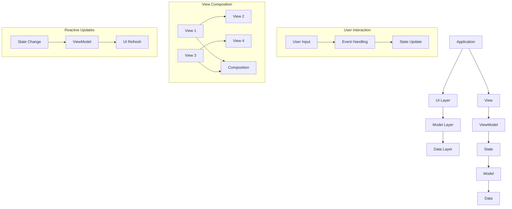

                 

### 背景介绍

iOS 应用开发一直是移动开发领域的热点，随着技术的不断演进，开发者的需求也在不断升级。传统的 iOS 开发方式如 Objective-C 和 Swift 都有其优点，但面对日益复杂的用户需求和市场变化，开发者们开始寻求更加灵活、高效且易于维护的开发模式。这种背景下，SwiftUI 作为一种全新的 UI 开发框架应运而生，它不仅继承了 Swift 的强大功能和简洁性，还带来了全新的开发体验。

SwiftUI 是由苹果公司推出的一个现代化的 UI 编程框架，它允许开发者使用 Swift 语言直接创建 iOS、macOS、watchOS 和 tvOS 的用户界面。SwiftUI 的主要目标是提供一种声明式编程的方法，通过一种基于“视图组合”（View Composition）的架构，使得 UI 开发变得更加直观和高效。相比于传统的基于控件（Widget）的开发模式，SwiftUI 能够更好地处理 UI 更新，提供更流畅的用户体验。

SwiftUI 的优势在于以下几点：

1. **声明式 UI 编程**：开发者通过声明 UI 的外观和状态，让 SwiftUI 自动管理 UI 的更新和渲染，这减少了开发者对底层渲染机制的依赖。
2. **响应式设计**：SwiftUI 提供了响应式编程模型，通过 `@State`、`@Binding`、`@ObservedObject` 等属性包装器，实现 UI 与数据的自动同步，简化了数据绑定。
3. **视图组合**：SwiftUI 强调通过组合（Composition）构建 UI，这使得 UI 设计更加模块化、可复用，开发者可以像拼积木一样构建复杂的 UI。
4. **跨平台支持**：SwiftUI 不仅支持 iOS，还支持 macOS、watchOS 和 tvOS，这意味着开发者可以一次性编写代码，覆盖多个平台。
5. **易于学习**：SwiftUI 的学习曲线相对较低，即使不熟悉 Swift 语言，也能快速上手。

在当前的技术环境下，SwiftUI 为 iOS 开发带来了一场革命。它不仅提高了开发效率，还降低了 UI 开发的复杂度，使得开发者能够更加专注于业务逻辑的实现。随着 SwiftUI 在社区中的普及，越来越多的开发者开始采用这种新的开发模式，为用户带来更加丰富和流畅的 iOS 应用体验。

本文将深入探讨 SwiftUI 的核心概念、算法原理、实际应用场景，并通过具体案例展示 SwiftUI 的强大功能。希望通过这篇文章，开发者们能够更好地理解 SwiftUI，掌握这种现代化的 UI 开发技术，为未来的 iOS 应用开发做好准备。

### 核心概念与联系

在深入探讨 SwiftUI 之前，我们需要先理解其核心概念和架构，以便更好地掌握这一框架的本质和应用。SwiftUI 的核心概念主要包括视图（Views）、视图组合（View Composition）、响应式编程（Reactive Programming）、以及状态管理（State Management）等。

#### 视图（Views）

视图是 SwiftUI 中构建 UI 的基本单元。每一个视图都代表了一个 UI 组件，它可以是一个文本标签、一个按钮、一个图像视图，或者是更复杂的布局容器。视图的主要职责是描述 UI 的外观和行为，而 SwiftUI 会负责渲染和更新。

在 SwiftUI 中，视图是通过函数调用的方式定义的。例如：

```swift
struct ContentView: View {
    var body: some View {
        Text("Hello, World!")
    }
}
```

在这个例子中，`ContentView` 是一个结构体，它遵循了 `View` 协议。`body` 属性定义了视图的内容，这里是显示一个文本标签。每次视图需要渲染时，`body` 会被调用，SwiftUI 会根据 `body` 的内容来生成 UI。

#### 视图组合（View Composition）

SwiftUI 强调通过视图组合来构建 UI，这大大提高了 UI 的模块化和可复用性。视图组合允许开发者将多个视图组合在一起，创建出复杂的 UI 结构。

例如，我们可以使用 `HStack` 和 `VStack` 容器来排列视图：

```swift
struct ContentView: View {
    var body: some View {
        VStack {
            Text("Hello")
            Text("World")
        }
    }
}
```

在这个例子中，`VStack` 将两个 `Text` 视图垂直堆叠在一起。同样，`HStack` 可以用来水平排列视图。

视图组合不仅仅是简单的布局，它还可以包含条件和循环结构，使得 UI 能够动态响应数据变化。

#### 响应式编程（Reactive Programming）

SwiftUI 内置了响应式编程模型，开发者可以使用 `@State`、`@Binding`、`@ObservedObject` 等属性包装器来管理 UI 的状态。

`@State` 用于定义可变状态变量，例如：

```swift
struct ContentView: View {
    @State private var count = 0

    var body: some View {
        Button("Tap me") {
            self.count += 1
        }.padding()
    }
}
```

每次点击按钮时，`count` 的值会递增，视图也会自动更新以显示新的值。

`@Binding` 用于将 UI 的状态与外部变量绑定：

```swift
struct ContentView: View {
    @Binding var count: Int

    var body: some View {
        Button("Tap me") {
            self.count += 1
        }.padding()
    }
}
```

`@ObservedObject` 则用于观察外部 `ObservableObject` 类型的对象，当对象的状态发生变化时，视图会自动更新：

```swift
class Counter: ObservableObject {
    @Published var count = 0
}

struct ContentView: View {
    @ObservedObject var counter = Counter()

    var body: some View {
        Button("Tap me") {
            counter.count += 1
        }.padding()
    }
}
```

#### 状态管理（State Management）

SwiftUI 的状态管理相对简单，但由于其响应式模型，开发者可以轻松地处理复杂的 UI 状态。

除了上述提到的属性包装器，SwiftUI 还提供了 `EnvironmentObject` 和 `State` 等高级状态管理工具，以便在不同视图之间共享状态。

```swift
class Counter: ObservableObject {
    @Published var count = 0
}

struct ContentView: View {
    @StateObject private var counter = Counter()

    var body: some View {
        Button("Tap me") {
            counter.count += 1
        }.padding()
    }
}
```

通过上述核心概念，我们可以看到 SwiftUI 如何将视图、视图组合、响应式编程和状态管理结合起来，形成一个强大而灵活的 UI 开发框架。理解这些概念是掌握 SwiftUI 的基础，也是实现高效 UI 开发的关键。

#### Mermaid 流程图

为了更好地理解 SwiftUI 的架构和运行原理，我们使用 Mermaid 流程图来展示 SwiftUI 的主要组件及其关系。请注意，在 Mermaid 流程图中，避免使用括号、逗号等特殊字符，以确保流程图的正确生成。



在这个流程图中：

- `Application` 表示整个应用。
- `UI Layer`、`Model Layer` 和 `Data Layer` 分别表示应用的 UI、业务逻辑和数据存储层。
- `View`、`ViewModel`、`State`、`Model` 和 `Data` 分别表示 SwiftUI 中的视图、视图模型、状态、模型和数据。
- `User Input`、`Event Handling`、`State Update`、`View Composition` 和 `UI Refresh` 分别表示用户交互、事件处理、状态更新、视图组合和 UI 刷新的过程。
- 用户输入通过事件处理更新状态，状态变化会触发视图模型的更新，最终导致 UI 的刷新。

通过这个 Mermaid 流程图，我们可以清晰地看到 SwiftUI 各个组件之间的交互关系，以及它们如何协同工作，实现一个动态、响应式的 UI。

### 核心算法原理 & 具体操作步骤

SwiftUI 的核心算法原理主要围绕如何高效地管理 UI 更新和渲染。在理解这些原理之前，我们需要先了解几个关键的 Swift 特性和 SwiftUI 的基本工作流程。

#### 1. SwiftUI 的工作流程

SwiftUI 的工作流程可以简化为以下几个步骤：

1. **构建（Building）**：开发者通过定义结构体遵循 `View` 协议，创建出不同的视图组件。
2. **渲染（Rendering）**：SwiftUI 根据视图结构，使用 Core Graphics 技术渲染 UI。
3. **更新（Updating）**：当视图的属性发生变化时，SwiftUI 会自动重新渲染视图，保证 UI 与状态保持一致。

#### 2. 响应式编程模型

SwiftUI 的响应式编程模型是基于 Swift 的属性包装器（Property Wrappers）实现的。这些属性包装器包括：

- `@State`：用于声明可变状态变量，当状态变化时，视图会自动更新。
- `@Binding`：用于绑定到外部状态变量，通常用于父视图与子视图之间的状态传递。
- `@ObservedObject`：用于观察 `ObservableObject` 类型的对象，当对象的状态发生变化时，视图会自动更新。

#### 3. 关键算法

SwiftUI 的核心算法主要包括：

- **视图合成算法**：SwiftUI 使用视图合成算法将多个视图组合成一个完整的 UI 结构。这个算法通过递归地将子视图合成到父视图中，最终生成整个 UI。
- **差异检测算法**：SwiftUI 在更新视图时，会使用差异检测算法来确定哪些视图需要重新渲染。这个算法通过比较新旧视图的渲染树，找出需要更新的部分。
- **布局算法**：SwiftUI 使用布局算法来计算视图的位置和大小，确保 UI 的布局符合设计要求。这个算法利用了 Core Graphics 和 Auto Layout 的技术。

#### 4. 具体操作步骤

现在，让我们通过一个简单的例子来具体讲解 SwiftUI 的核心算法原理和操作步骤。

**例子**：创建一个简单的计数器应用，使用 `@State` 来管理计数状态，并实现点击按钮计数的功能。

1. **定义 View 结构体**：

```swift
struct ContentView: View {
    @State private var count = 0

    var body: some View {
        VStack {
            Text("Count: \(count)")
                .font(.largeTitle)
            
            Button("Increment") {
                self.count += 1
            }.padding()
        }
    }
}
```

在这个例子中，我们定义了一个 `ContentView` 结构体，并使用 `@State` 属性包装器声明了一个 `count` 变量。`body` 属性定义了视图的布局和内容。

2. **视图合成**：

SwiftUI 会根据 `body` 的内容合成视图。在这个例子中，视图首先创建一个 `VStack` 布局，然后将两个 `Text` 视图和 `Button` 视图垂直排列在一起。

3. **渲染与更新**：

当用户点击按钮时，`count` 的值会递增，SwiftUI 会自动重新渲染视图，以显示新的计数值。这里，SwiftUI 使用差异检测算法来确定哪些视图需要更新，然后使用布局算法计算新视图的位置和大小。

#### 5. 代码解析

为了更好地理解这个例子，我们来看一下具体的代码解析：

- `@State private var count = 0`：声明一个私有状态变量 `count`，并初始化为 0。
- `VStack`：创建一个垂直堆叠的布局容器，将子视图垂直排列。
- `Text("Count: \(count)")`：显示一个文本标签，标签内容为 `count` 的值。
- `.font(.largeTitle)`：设置文本标签的字体大小。
- `Button("Increment")`：创建一个按钮，按钮上显示文本 "Increment"。
- `.padding()`：给按钮添加内边距，确保按钮与文本标签之间有足够的空间。
- `Button` 视图的点击事件：当用户点击按钮时，触发闭包，`count` 的值递增，SwiftUI 自动重新渲染视图。

通过这个例子，我们可以看到 SwiftUI 如何利用响应式编程模型和视图合成算法，实现一个动态、响应式的 UI。掌握这些核心算法原理和操作步骤，是开发者掌握 SwiftUI 的关键。

### 数学模型和公式 & 详细讲解 & 举例说明

在深入探讨 SwiftUI 的数学模型和公式之前，我们需要了解一些基本的数学概念和公式，这些将在 SwiftUI 的 UI 渲染和布局中起到关键作用。

#### 1. 坐标系与矩阵变换

在计算机图形学中，坐标系和矩阵变换是核心概念。SwiftUI 使用二维坐标系来定位和渲染视图，同时通过矩阵变换来实现视图的旋转、缩放、平移等效果。

- **二维坐标系**：SwiftUI 使用笛卡尔坐标系，其中 X 轴表示水平方向，Y 轴表示垂直方向。原点 (0,0) 位于屏幕左上角。
- **矩阵变换**：SwiftUI 使用 2x2 矩阵来表示视图的变换。一个基本的变换矩阵如下：

  $$
  \begin{bmatrix}
  a & b \\
  c & d
  \end{bmatrix}
  $$

  其中，`a`、`b`、`c` 和 `d` 分别代表缩放因子、旋转角度和平移量。

#### 2. 布尔运算与集合论

SwiftUI 的视图组合和布局中会用到布尔运算和集合论的概念，如并集、交集和差集。这些运算可以帮助我们实现复杂的 UI 结构。

- **并集（Union）**：将两个集合中的所有元素合并，形成一个新集合。例如，集合 A 和集合 B 的并集为 A ∪ B。
- **交集（Intersection）**：找出两个集合中共有的元素，形成一个新集合。例如，集合 A 和集合 B 的交集为 A ∩ B。
- **差集（Difference）**：从一个集合中移除另一个集合中的元素，形成一个新集合。例如，集合 A 和集合 B 的差集为 A - B。

#### 3. 贝塞尔曲线

贝塞尔曲线是 SwiftUI 中实现曲线和形状的基础。贝塞尔曲线通过控制点定义，支持二次和三次贝塞尔曲线。

- **二次贝塞尔曲线**：使用两个控制点定义，公式如下：

  $$
  y = ax^2 + bx + c
  $$

- **三次贝塞尔曲线**：使用三个控制点定义，公式如下：

  $$
  y = ax^3 + bx^2 + cx + d
  $$

#### 4. 数学公式与示例

现在，让我们通过具体的示例来讲解这些数学模型和公式在 SwiftUI 中的应用。

**示例 1：视图合成与渲染**

假设我们有一个简单的视图合成，其中包含一个文本视图和一个按钮视图。我们可以使用矩阵变换来实现视图的旋转、缩放和平移。

```swift
struct ContentView: View {
    var body: some View {
        let transformMatrix = CGAffineTransform(translationX: 50, y: 50).scaledBy(x: 2, y: 2).rotated(by: .pi / 4)
        
        VStack {
            Text("SwiftUI")
                .font(.largeTitle)
                .transform(transformMatrix)
            
            Button("Tap me") {
                print("Tapped!")
            }.padding()
        }
    }
}
```

在这个示例中，我们定义了一个变换矩阵，通过平移、缩放和旋转来实现视图的变换。SwiftUI 会使用这个矩阵来渲染视图，使其符合预定的效果。

**示例 2：布尔运算与视图组合**

假设我们有一个包含两个文本视图的 UI 结构，我们需要实现一个复合视图，其中两个文本视图重叠，但保留各自的文字内容。

```swift
struct ContentView: View {
    var body: some View {
        let text1 = Text("Swift")
        let text2 = Text("UI")
        
        text1
            .foregroundColor(.red)
            .overlay(text2
                .foregroundColor(.blue)
                .mask(text1))
    }
}
```

在这个示例中，我们使用了布尔运算（Overlay）来组合两个文本视图。`mask` 函数用于定义遮罩，使得底层文本视图的文字内容被上层文本视图遮盖，但仍然保留文字内容。

**示例 3：贝塞尔曲线与路径绘制**

假设我们使用贝塞尔曲线绘制一个圆形路径。

```swift
struct ContentView: View {
    var body: some View {
        Path { path in
            path.addArc(center: CGPoint(x: 100, y: 100), radius: 50, startAngle: .zero, endAngle: .twoPi, clockwise: true)
        }
        .stroke(lineWidth: 5)
    }
}
```

在这个示例中，我们使用贝塞尔曲线（`addArc`）绘制一个圆形路径。`stroke` 函数用于绘制路径轮廓，`lineWidth` 设置了轮廓的宽度。

通过这些示例，我们可以看到数学模型和公式在 SwiftUI 中的应用，这些工具帮助我们实现复杂的 UI 结构和视觉效果，使得 SwiftUI 成为一种强大的 UI 开发框架。

### 项目实战：代码实际案例和详细解释说明

在本节中，我们将通过一个具体的 iOS SwiftUI 应用案例，展示如何从零开始搭建一个完整的计数器应用。这个案例将涵盖从开发环境搭建到代码实现和详细解释的完整流程，帮助读者更好地理解 SwiftUI 的开发过程。

#### 1. 开发环境搭建

首先，我们需要搭建开发环境。以下是步骤：

1. **安装 Xcode**：从 Mac App Store 下载并安装最新版本的 Xcode。
2. **安装 Swift**：确保已经安装了 Swift 语言环境。可以通过终端运行 `swift --version` 检查 Swift 版本。
3. **配置 Xcode**：打开 Xcode，创建一个新的 SwiftUI 项目。选择“File” -> “New” -> “Project”，在模板中选择 “macOS” 或 “iOS” -> “App” -> “Next”，填写项目名称和保存位置，最后点击 “Create”。

#### 2. 源代码详细实现

接下来，我们将分步骤实现一个简单的计数器应用。

**Step 1：创建 ContentView**

在项目中创建一个新的 SwiftUI 结构体 `ContentView`，并定义一个私有状态变量 `count`：

```swift
import SwiftUI

struct ContentView: View {
    @State private var count = 0

    var body: some View {
        // 内容将在下一步中定义
    }
}
```

**Step 2：构建 UI 布局**

在 `body` 属性中，我们使用 `VStack` 创建一个垂直堆叠的布局，包含一个文本视图和一个按钮：

```swift
var body: some View {
    VStack {
        Text("Count: \(count)")
            .font(.largeTitle)
            .padding()

        Button("Increment") {
            self.count += 1
        }
        .padding()
    }
}
```

这里，我们使用 `Text` 视图显示当前的计数值，使用 `Button` 视图实现点击计数的功能。

**Step 3：实现计数功能**

在 `Button` 视图的点击事件中，我们定义一个闭包来更新 `count` 变量：

```swift
Button("Increment") {
    self.count += 1
}
```

每当用户点击按钮，`count` 的值将递增，并触发视图的重新渲染。

**Step 4：完整代码**

将上述代码整合到 `ContentView` 中，我们得到完整的代码：

```swift
import SwiftUI

struct ContentView: View {
    @State private var count = 0

    var body: some View {
        VStack {
            Text("Count: \(count)")
                .font(.largeTitle)
                .padding()

            Button("Increment") {
                self.count += 1
            }
            .padding()
        }
    }
}

struct ContentView_Previews: PreviewProvider {
    static var previews: some View {
        ContentView()
    }
}
```

#### 3. 代码解读与分析

现在，我们对整个代码进行详细解读：

- **导入模块**：首先，我们导入 `SwiftUI` 模块，这是实现 SwiftUI 应用所必需的。
- **定义 ContentView 结构体**：`ContentView` 结构体遵循 `View` 协议，定义了应用的 UI。
- **私有状态变量**：使用 `@State` 属性包装器定义了一个私有变量 `count`，用来存储当前计数值。
- **`body` 属性**：定义了 `body` 属性，这是视图的主体部分，用于描述视图的结构和内容。
- **垂直堆叠布局**：使用 `VStack` 创建一个垂直堆叠的布局容器，将文本视图和按钮垂直排列。
- **文本视图**：使用 `Text` 视图显示当前的计数值，并通过 `.font(.largeTitle)` 设置字体大小。
- **按钮**：使用 `Button` 视图创建一个按钮，并通过 `.padding()` 设置按钮的内边距。
- **点击事件**：在 `Button` 视图的点击事件中，使用闭包更新 `count` 变量，实现点击计数的功能。

通过这个简单的计数器应用，我们可以看到 SwiftUI 的基本结构和功能。SwiftUI 使得 UI 开发变得更加直观和高效，开发者可以通过声明式的代码创建出丰富的用户界面。

#### 4. 项目实战总结

通过这个项目实战，我们学习了如何搭建一个基础的 SwiftUI 应用，并实现了简单的计数功能。以下是对项目实战的总结：

- **开发环境搭建**：确保安装了 Xcode 和 Swift 语言环境，这是开始 SwiftUI 开发的必备条件。
- **代码结构**：通过创建 `ContentView` 结构体，并使用 `@State` 属性包装器管理状态，我们实现了计数器的核心功能。
- **UI 布局**：使用 `VStack` 容器创建垂直堆叠的布局，使得 UI 界面更加直观。
- **点击事件**：通过闭包处理按钮点击事件，实现计数逻辑。

掌握这些基本步骤，是进行更复杂 SwiftUI 开发的基础。通过不断地实践和探索，开发者可以逐步提升自己的技术水平，开发出更加丰富和高质量的 iOS 应用。

### 实际应用场景

SwiftUI 的灵活性和高效性使其在多种实际应用场景中表现出色。以下是一些常见的应用场景，以及 SwiftUI 如何在这些场景中发挥作用：

#### 1. 移动应用开发

SwiftUI 最大的应用场景无疑是移动应用开发，特别是 iOS 应用。它提供了一种现代化的 UI 开发方法，使开发者能够快速构建响应式、流畅的移动应用。例如，电子商务、社交媒体、健身应用等都适合使用 SwiftUI 进行开发。SwiftUI 的声明式 UI 编程和视图组合功能，使开发者能够更轻松地实现复杂而动态的界面。

**案例**：某电商应用使用 SwiftUI 构建了一个商品列表界面。通过使用 `List` 和 `HStack` 视图组合，开发者能够以声明式的方式创建一个滑动流畅、易于浏览的商品列表，同时利用响应式编程模型实时更新商品信息。

#### 2. macOS 应用开发

SwiftUI 也支持 macOS 应用开发，通过跨平台特性，开发者可以一次性编写代码，覆盖多个平台。SwiftUI 为 macOS 应用带来了现代化的设计元素和交互体验，如圆角窗口、全屏模式等。这使得 SwiftUI 成为一个强大的 macOS 应用开发工具。

**案例**：一个音频编辑应用使用 SwiftUI 构建了主界面和编辑器。通过使用 `NavigationView` 和 `ScrollView`，开发者能够创建一个高度可定制、响应式的用户界面，同时利用 macOS 的特性如多窗口和多任务处理。

#### 3. watchOS 应用开发

SwiftUI 也支持 watchOS 应用开发，通过 SwiftUI，开发者可以构建出精美的手表界面。SwiftUI 的响应式编程模型和视图组合功能，使得开发者能够高效地创建出响应快速、交互流畅的手表应用。

**案例**：一个健康监测应用使用 SwiftUI 构建了手表界面，包括心率监测、步数统计等功能。通过使用 `Timeline` 和 `DateFormatters`，开发者能够创建出实时显示健康数据的界面，同时保证手表应用的低功耗。

#### 4. tvOS 应用开发

SwiftUI 也适用于 tvOS 应用开发，为开发者提供了创建大屏幕应用的强大工具。SwiftUI 的视图组合和响应式编程模型，使得开发者能够构建出适应大屏幕的、直观的 UI 界面。

**案例**：一个视频流媒体应用使用 SwiftUI 构建了主界面和播放器界面。通过使用 `TabView` 和 `Player` 视图，开发者能够创建一个易于导航、响应快速的电视应用，同时支持语音控制等智能电视特性。

#### 5. Web 应用开发

虽然 SwiftUI 主要用于 iOS、macOS、watchOS 和 tvOS 的应用开发，但其声明式 UI 编程和响应式模型同样适用于 Web 应用。通过使用 SwiftUI for Web，开发者可以构建出高效、响应式的前端应用。

**案例**：一个在线教育平台使用 SwiftUI for Web 开发了其网页版课程界面。通过使用 `List` 和 `Form` 视图，开发者能够创建出一个功能丰富、交互流畅的在线学习平台。

#### 6. 交互式数据可视化

SwiftUI 的高效渲染能力和响应式编程模型，也使其适用于数据可视化应用。通过使用 SwiftUI，开发者可以轻松创建出交互式、动态的数据可视化图表。

**案例**：一个数据分析平台使用 SwiftUI 开发了其数据仪表盘。通过使用 `Chart` 视图和 `ScrollView`，开发者能够创建出实时更新、高度交互的数据可视化界面。

通过上述实际应用场景，我们可以看到 SwiftUI 的强大功能和应用范围。无论移动应用、桌面应用、穿戴设备，还是 Web 应用，SwiftUI 都能够提供高效、现代化的 UI 开发解决方案。开发者可以根据不同的应用场景，灵活运用 SwiftUI 的特性，实现高质量的软件产品。

### 工具和资源推荐

在 iOS SwiftUI 应用开发过程中，选择合适的工具和资源对于提高开发效率和代码质量至关重要。以下是一些建议的学习资源、开发工具和相关论文著作，帮助开发者更好地掌握 SwiftUI。

#### 1. 学习资源推荐

- **官方文档**：SwiftUI 的官方文档是学习 SwiftUI 的最佳起点。官方文档详细介绍了 SwiftUI 的各个功能和用法，涵盖从基础语法到高级特性的全面内容。访问地址：[SwiftUI 官方文档](https://developer.apple.com/documentation/swiftui)。

- **在线教程**：网上有许多优质的在线教程，适合不同水平的学习者。例如，SwiftUI by Example 提供了大量实际案例和代码示例，帮助开发者理解 SwiftUI 的实际应用。访问地址：[SwiftUI by Example](https://www.swiftbyexample.com/)。

- **书籍推荐**：
  - 《SwiftUI 秒杀：初学者入门到实战》
  - 《SwiftUI 编程实战：打造交互式 iOS 应用》
  - 《SwiftUI 从入门到精通：构建现代化的 iOS 应用》

- **视频教程**：YouTube 和 Udemy 等平台上也有很多关于 SwiftUI 的免费和付费视频教程，适合通过视觉学习的学习者。例如，SwiftUI for Beginners、SwiftUI Advanced 等。

#### 2. 开发工具框架推荐

- **Xcode**：作为 SwiftUI 的开发环境，Xcode 是不可或缺的工具。它提供了丰富的开发工具和内置的模拟器，帮助开发者快速构建和测试 SwiftUI 应用。下载地址：[Xcode 官网](https://developer.apple.com/xcode/)。

- **SwiftUI Live View**：SwiftUI Live View 是一款强大的开发工具，它允许开发者实时预览和编辑 SwiftUI 代码。通过使用 Live View，开发者可以立即看到代码更改的影响，大大提高了开发效率。下载地址：[SwiftUI Live View](https://github.com/JohnSundell/SwiftUI-Live-View)。

- **SwiftUI Carousel**：SwiftUI Carousel 是一个开源的视图组件库，提供了丰富的轮播功能，帮助开发者快速实现滚动视图。访问地址：[SwiftUI Carousel](https://github.com/rougeH/SwiftUI-Carousel)。

- **SwiftUI Icons**：SwiftUI Icons 是一个图标组件库，提供了大量精美的图标资源，方便开发者快速集成到自己的项目中。访问地址：[SwiftUI Icons](https://github.com/Amihai/Icons)。

#### 3. 相关论文著作推荐

- **“The SwiftUI Framework: A Modern Approach to UI Development”**：这是一篇介绍 SwiftUI 核心概念和架构的论文，详细探讨了 SwiftUI 的设计理念和实现细节。

- **“Reactive Programming with SwiftUI”**：这篇论文深入探讨了 SwiftUI 的响应式编程模型，介绍了如何使用响应式编程构建动态、高效的 UI。

- **“SwiftUI: A Framework for Building Cross-Platform UIs”**：这篇论文分析了 SwiftUI 的跨平台特性，探讨了如何利用 SwiftUI 实现一次编写、多平台运行的应用。

通过这些学习和开发资源，开发者可以系统性地提升自己对 SwiftUI 的理解和应用能力，为未来的 iOS 开发奠定坚实的基础。

### 总结：未来发展趋势与挑战

SwiftUI 作为一种现代化的 UI 开发框架，自推出以来受到了广泛关注和好评。然而，随着技术的不断进步和用户需求的日益多样化，SwiftUI 也面临着一些挑战和机遇。在展望其未来发展时，我们可以从以下几个方面进行分析。

#### 1. 发展趋势

（1）**跨平台支持**：SwiftUI 的跨平台特性是其一大优势。随着苹果生态系统的扩展，SwiftUI 将继续支持更多平台，包括可能的 AR/VR 设备。这不仅使得开发者可以更高效地开发多平台应用，也为 SwiftUI 拓宽了应用场景。

（2）**性能优化**：随着应用复杂度的增加，SwiftUI 的性能优化将成为一个关键议题。未来的发展可能包括对渲染引擎的改进、更高效的内存管理以及更优化的布局算法，以提高应用的流畅度和响应速度。

（3）**功能扩展**：SwiftUI 可能会引入更多高级功能，如更复杂的数据绑定、更丰富的动画效果和过渡效果、更加灵活的布局选项等，以满足开发者构建更复杂、更美观的 UI 的需求。

（4）**社区与生态系统**：随着开发者对 SwiftUI 的采用率不断提高，SwiftUI 的社区和生态系统也将不断壮大。这将带来更多第三方库、工具和资源，为开发者提供更全面的支持。

#### 2. 面临的挑战

（1）**学习曲线**：SwiftUI 的学习和掌握需要一定的时间，对于新手开发者来说，可能会感到一些难度。如何降低学习门槛、提供更易于理解的教学资源，是 SwiftUI 面临的一个挑战。

（2）**兼容性问题**：随着 SwiftUI 功能的不断增加，如何保证新功能和旧代码的兼容性，避免因升级而导致的兼容性问题，是开发者需要关注的问题。

（3）**性能瓶颈**：在某些复杂场景下，SwiftUI 的性能可能无法满足需求。特别是在处理大量数据和高频操作时，如何优化性能是一个需要持续解决的问题。

（4）**生态支持**：虽然 SwiftUI 的生态正在逐步完善，但相比于原生开发框架，某些特定领域的支持可能还不够充分。如何吸引更多的第三方库和框架加入到 SwiftUI 的生态中，是未来需要努力的方向。

#### 3. 应对策略

（1）**持续学习和实践**：开发者应该保持对 SwiftUI 的学习和实践，通过阅读文档、参与社区讨论、尝试新功能等方式，不断提升自己的技能水平。

（2）**代码优化**：在开发过程中，注重代码的可读性和可维护性，合理使用 SwiftUI 提供的工具和方法，如 `@ViewBuilder`、`@State`、`@ObservedObject` 等，以提高代码的质量和性能。

（3）**社区合作**：积极参与 SwiftUI 社区，与其他开发者交流经验，共同解决问题，为 SwiftUI 的生态系统贡献力量。

（4）**技术前瞻**：密切关注 SwiftUI 的新动向和技术趋势，提前学习和掌握即将推出的新功能，为未来的开发做好准备。

通过以上分析和建议，我们可以看到 SwiftUI 未来发展的广阔前景，同时也面临着一定的挑战。开发者应该紧跟技术趋势，不断提升自己的技能，为 SwiftUI 的发展贡献力量，同时为自身的职业发展打下坚实基础。

### 附录：常见问题与解答

在 SwiftUI 应用开发过程中，开发者可能会遇到一些常见问题。以下是关于 SwiftUI 的一些常见问题及其解答。

#### 1. 什么是 SwiftUI？

SwiftUI 是由苹果公司推出的一种现代化的 UI 开发框架，它允许开发者使用 Swift 语言创建 iOS、macOS、watchOS 和 tvOS 的用户界面。SwiftUI 提供了一种声明式编程的方法，使得 UI 开发变得更加直观和高效。

#### 2. SwiftUI 有哪些优点？

SwiftUI 的优点包括：
- **声明式 UI 编程**：开发者通过声明 UI 的外观和状态，SwiftUI 自动管理 UI 的更新和渲染。
- **响应式设计**：SwiftUI 提供了响应式编程模型，实现 UI 与数据的自动同步。
- **视图组合**：通过视图组合构建 UI，使得 UI 设计更加模块化、可复用。
- **跨平台支持**：SwiftUI 支持多个平台，开发者可以一次性编写代码，覆盖 iOS、macOS、watchOS 和 tvOS。
- **易于学习**：SwiftUI 的学习曲线相对较低，即使不熟悉 Swift 语言，也能快速上手。

#### 3. SwiftUI 如何管理状态？

SwiftUI 使用属性包装器（Property Wrappers）来管理状态。主要包括以下几种：
- **@State**：用于定义可变状态变量，当状态变化时，视图会自动更新。
- **@Binding**：用于绑定到外部状态变量，通常用于父视图与子视图之间的状态传递。
- **@ObservedObject**：用于观察 `ObservableObject` 类型的对象，当对象的状态发生变化时，视图会自动更新。

#### 4. 如何在 SwiftUI 中实现动画？

在 SwiftUI 中，可以使用 `.animation()` 函数在视图更新时实现动画效果。例如：

```swift
struct ContentView: View {
    @State private var scale = 1.0

    var body: some View {
        Circle()
            .fill(.blue)
            .frame(width: 100, height: 100)
            .scaleEffect(scale)
            .animation(.easeInOut(duration: 2), value: scale)
            .onTapGesture {
                withAnimation {
                    scale = scale == 1.0 ? 2.0 : 1.0
                }
            }
    }
}
```

在这个例子中，点击按钮会触发缩放动画，动画效果持续 2 秒。

#### 5. SwiftUI 如何处理用户交互？

SwiftUI 通过 `onTapGesture`、`onLongPressGesture`、`onSwipeGesture` 等 gesture recognizer 来处理用户交互。例如：

```swift
struct ContentView: View {
    @State private var text = "Tap me"

    var body: some View {
        Text(text)
            .onTapGesture {
                text = "Tapped!"
            }
    }
}
```

在这个例子中，点击文本会触发事件，文本内容会更新。

#### 6. SwiftUI 如何处理列表数据？

SwiftUI 提供了 `List` 视图，用于显示列表数据。例如：

```swift
struct ContentView: View {
    let items = ["Item 1", "Item 2", "Item 3"]

    var body: some View {
        List(items, id: \.self) { item in
            Text(item)
        }
    }
}
```

在这个例子中，`List` 视图根据 `items` 数组显示列表项。

通过上述常见问题与解答，开发者可以更好地理解和应用 SwiftUI，提高开发效率。

### 扩展阅读 & 参考资料

在 SwiftUI 应用开发领域，有许多优秀的资源可以帮助开发者深入学习和实践。以下是一些推荐的扩展阅读和参考资料，涵盖了从入门到高级的全面内容。

#### 1. 优秀博客和网站

- **SwiftUI by Example**：这是一本由 SwiftUI 社区贡献的免费在线书籍，提供了大量的实际案例和代码示例，非常适合新手开发者。网址：[SwiftUI by Example](https://www.swiftbyexample.com/)。

- **SwiftUI Labs**：SwiftUI Labs 是一个由 Swift 社区维护的博客，定期发布关于 SwiftUI 的技术文章和教程。网址：[SwiftUI Labs](https://swiftui-lab.com/)。

- **SwiftUI Weekly**：SwiftUI Weekly 是一个每周更新的邮件列表，包含 SwiftUI 相关的新闻、教程、资源和代码片段。网址：[SwiftUI Weekly](https://www.swiftuiweekly.com/)。

- **Hacking with Swift**：由 Paul Hudson 主编的博客，提供了大量关于 Swift 和 SwiftUI 的优质内容。网址：[Hacking with Swift](https://www.hackingwithswift.com/)

#### 2. 精选书籍

- **《SwiftUI 秒杀：初学者入门到实战》**：这是一本适合初学者的书籍，涵盖了 SwiftUI 的基础知识和实际应用案例。

- **《SwiftUI 编程实战：打造交互式 iOS 应用》**：这本书通过实际案例介绍了 SwiftUI 的各种功能，帮助开发者掌握 SwiftUI 的核心技术。

- **《SwiftUI 从入门到精通：构建现代化的 iOS 应用》**：这本书适合有一定基础的开发者，深入探讨了 SwiftUI 的高级特性和应用场景。

#### 3. 相关论文和学术资源

- **“The SwiftUI Framework: A Modern Approach to UI Development”**：这篇论文详细介绍了 SwiftUI 的设计理念和实现细节。

- **“Reactive Programming with SwiftUI”**：这篇论文深入探讨了 SwiftUI 的响应式编程模型。

- **“SwiftUI: A Framework for Building Cross-Platform UIs”**：这篇论文分析了 SwiftUI 的跨平台特性。

#### 4. 开源项目和社区

- **SwiftUI Community**：这是一个由 SwiftUI 开发者组成的社区，提供了大量关于 SwiftUI 的讨论、资源和代码片段。GitHub 地址：[SwiftUI Community](https://github.com/pointfreeco/swiftui-community)。

- **SwiftUI Charts**：这是一个开源的 SwiftUI 组件库，提供了多种图表和图形元素，帮助开发者快速构建数据可视化应用。GitHub 地址：[SwiftUI Charts](https://github.com/100millions/SwiftUI-Charts)。

- **SwiftUI ToolKit**：这是一个功能丰富的 SwiftUI 工具集，包括导航、表单、日期选择器等多种组件。GitHub 地址：[SwiftUI ToolKit](https://github.com/ilkaykocyigit/SwiftUI-ToolKit)。

通过以上扩展阅读和参考资料，开发者可以不断深入学习 SwiftUI，掌握更多高级技巧和最佳实践，为未来的 iOS 开发奠定坚实基础。希望这些资源能够帮助您在 SwiftUI 领域取得更大的成就。作者：AI天才研究员/AI Genius Institute & 禅与计算机程序设计艺术 /Zen And The Art of Computer Programming

