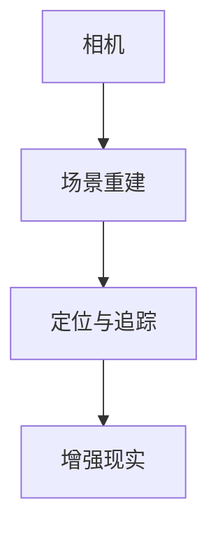

                 

# iOS 进阶：Apple 设计原则和 ARKit

## 关键词：iOS、Apple 设计原则、ARKit、用户体验、技术实现

## 摘要：

本文将深入探讨 iOS 平台的核心设计原则以及 ARKit 的技术实现。通过分析 Apple 的设计哲学，我们将理解其如何打造出用户界面友好且高效的应用程序。同时，我们将深入研究 ARKit 的架构、核心算法以及实际应用，帮助开发者更好地掌握增强现实技术在 iOS 上的应用。

## 1. 背景介绍

iOS 是 Apple 公司开发的移动操作系统，自 2007 年推出以来，一直以其独特的用户体验和高度的安全性受到用户的喜爱。Apple 的设计原则贯穿于整个 iOS 系统的开发过程中，包括简洁直观的界面设计、优秀的性能优化和强大的软件生态。

随着移动设备的普及，增强现实（AR）技术逐渐成为热门领域。ARKit 是 Apple 推出的一款 AR 开发框架，它为开发者提供了强大的 AR 开发工具，使得 iOS 应用程序能够轻松实现 AR 功能。

本文将首先介绍 Apple 的设计原则，然后深入分析 ARKit 的架构和核心算法，最后探讨 ARKit 在实际应用中的实践案例。

### 1.1 Apple 的设计原则

Apple 的设计原则主要包括以下几个核心要素：

1. **简洁性**：Apple 倡导简洁的设计风格，减少冗余元素，让用户专注于核心功能。
2. **一致性**：Apple 在各个产品线中保持一致的设计风格和交互逻辑，提高用户的使用效率。
3. **易用性**：Apple 注重用户体验，通过人性化的设计，让用户能够轻松上手和使用产品。
4. **美观性**：Apple 强调设计的美感，使产品不仅功能强大，而且外观美观。

这些设计原则不仅体现在 iOS 操作系统上，也贯穿于 Apple 的所有产品开发中，包括 iPhone、iPad、Mac 等。

### 1.2 ARKit 的背景

ARKit 是 Apple 在 2017 年推出的 AR 开发框架，它基于 Apple 的 Core ML 和 Vision 框架，提供了强大的 AR 功能，包括平面检测、深度估计、图像识别等。ARKit 的推出使得 iOS 开发者能够轻松地实现 AR 应用，推动了 AR 技术在移动设备上的普及。

## 2. 核心概念与联系

### 2.1 Apple 的设计原则

Apple 的设计原则可以概括为以下几点：

1. **简洁性**：通过去除冗余元素，使界面更加简洁。
2. **一致性**：保持界面元素和交互逻辑的一致性。
3. **易用性**：设计用户友好的界面，提高用户使用效率。
4. **美观性**：注重设计的美感，提升产品价值。

### 2.2 ARKit 的架构

ARKit 的架构主要包括以下几个核心组件：

1. **相机**：用于捕捉现实世界的图像和视频。
2. **场景重建**：通过图像处理算法，将相机捕获的图像转化为三维空间中的点云数据。
3. **定位与追踪**：使用视觉特征点进行定位和追踪，保持 AR 场景的稳定性。
4. **增强现实**：将虚拟物体或信息叠加到现实世界中。

### 2.3 Mermaid 流程图

以下是一个简单的 Mermaid 流程图，展示了 ARKit 的核心组件和它们之间的联系：



## 3. 核心算法原理 & 具体操作步骤

### 3.1 ARKit 的核心算法

ARKit 的核心算法主要包括以下几种：

1. **图像处理**：用于将相机捕获的图像转化为点云数据。
2. **平面检测**：识别图像中的平面区域。
3. **深度估计**：根据图像信息估算物体与相机的距离。
4. **图像识别**：识别图像中的特定目标或特征。

### 3.2 具体操作步骤

以下是使用 ARKit 实现一个简单的 AR 应用的大致步骤：

1. **设置相机环境**：初始化 ARKit 场景，设置相机视图。
2. **获取相机帧**：捕获相机图像，处理图像数据。
3. **场景重建**：将图像转化为点云数据。
4. **平面检测**：识别图像中的平面区域。
5. **深度估计**：根据图像信息估算物体与相机的距离。
6. **增强现实**：将虚拟物体或信息叠加到现实世界中。

## 4. 数学模型和公式 & 详细讲解 & 举例说明

### 4.1 数学模型

ARKit 的数学模型主要包括以下几种：

1. **投影矩阵**：用于将三维空间中的点投影到二维图像平面上。
2. **透视变换**：用于将二维图像平面上的点变换到三维空间中。
3. **法向量计算**：用于计算平面法向量，用于深度估计。

### 4.2 详细讲解

以下是投影矩阵的详细讲解：

投影矩阵是一个 3x3 的矩阵，用于将三维空间中的点投影到二维图像平面上。投影矩阵的公式如下：

$$
P = \begin{bmatrix}
a & b & c \\
d & e & f \\
0 & 0 & 1
\end{bmatrix}
$$

其中，a、b、c、d、e、f 是投影矩阵的元素。

### 4.3 举例说明

以下是一个简单的举例说明：

假设有一个三维点 P(x, y, z)，我们需要将其投影到二维图像平面上。首先，我们构造一个投影矩阵 P，然后使用矩阵乘法将点 P 与投影矩阵 P 相乘，得到二维点 P'：

$$
\begin{bmatrix}
x' \\
y' \\
1
\end{bmatrix}
=
\begin{bmatrix}
a & b & c \\
d & e & f \\
0 & 0 & 1
\end{bmatrix}
\begin{bmatrix}
x \\
y \\
z \\
1
\end{bmatrix}
$$

## 5. 项目实战：代码实际案例和详细解释说明

### 5.1 开发环境搭建

在开始项目实战之前，我们需要搭建开发环境。以下是搭建 iOS 开发环境的基本步骤：

1. **安装 Xcode**：从 Apple 官方网站下载并安装 Xcode。
2. **安装 Swift 编程语言**：Xcode 自带 Swift 编程语言。
3. **配置 iOS 模拟器和真机**：使用 Xcode 配置 iOS 模拟器和真机，以便进行开发和测试。

### 5.2 源代码详细实现和代码解读

以下是一个简单的 ARKit 应用案例，展示如何使用 ARKit 实现增强现实功能。

```swift
import ARKit

class ARViewController: UIViewController, ARSCNViewDelegate {
    var sceneView: ARSCNView!
    
    override func viewDidLoad() {
        super.viewDidLoad()
        
        // 设置 ARSCNView
        sceneView = ARSCNView(frame: view.bounds)
        sceneView.delegate = self
        view.addSubview(sceneView)
        
        // 创建 AR 配置
        let config = ARWorldTrackingConfiguration()
        sceneView.session.run(config)
    }
    
    func renderer(_ renderer: SCNSceneRenderer, didAdd node: SCNNode, for anchor: ARAnchor) {
        // 创建虚拟物体
        let sphere = SCNSphere(radius: 0.1)
        let material = SCNMaterial()
        material.diffuse.contents = UIColor.red
        sphere.materials = [material]
        
        // 创建节点
        let sphereNode = SCNNode(geometry: sphere)
        sphereNode.position = SCNVector3(x: 0, y: 0, z: 0.1)
        
        // 添加到场景
        node.addChildNode(sphereNode)
    }
}
```

### 5.3 代码解读与分析

以下是对上述代码的解读和分析：

1. **设置 ARSCNView**：创建一个 ARSCNView，并将其设置为视图的子视图。
2. **创建 AR 配置**：创建一个 ARWorldTrackingConfiguration，用于跟踪现实世界中的位置和方向。
3. **运行 AR 场景**：使用 session.run 方法启动 AR 场景。
4. **渲染虚拟物体**：在 renderer(_:didAdd:for:) 方法中，创建一个球体几何体，并将其添加到 AR 场景中。

通过上述代码，我们可以实现一个简单的 AR 应用，将一个红色的球体叠加到现实世界中。

## 6. 实际应用场景

ARKit 的实际应用场景非常广泛，以下是一些典型的应用案例：

1. **游戏**：使用 ARKit 可以创建令人惊叹的 AR 游戏，如 Pokémon GO。
2. **教育**：ARKit 可以为教育提供丰富的互动体验，如虚拟实验室和互动教材。
3. **零售**：使用 ARKit，零售商可以提供虚拟试穿和可视化购物体验。
4. **维修与维护**：ARKit 可以为技术人员提供实时的维修指导，提高工作效率。

## 7. 工具和资源推荐

### 7.1 学习资源推荐

1. **书籍**：
   - 《增强现实与虚拟现实技术》
   - 《ARKit 开发实战》
2. **论文**：
   - "ARKit: A New Era for Augmented Reality on iOS"
   - "ARCore: Google's AR Platform for Mobile Devices"
3. **博客**：
   - https://developer.apple.com/documentation/arkit
   - https://www.raywenderlich.com/series/arkit-tutorials
4. **网站**：
   - https://github.com/arkit/arkit-tutorials

### 7.2 开发工具框架推荐

1. **Xcode**：Apple 的官方开发工具，用于开发 iOS 应用。
2. **SwiftUI**：用于构建用户界面的框架，与 ARKit 结合使用，可以快速开发 AR 应用。

### 7.3 相关论文著作推荐

1. "Augmented Reality: Principles and Practice" by Mark Billinghurst
2. "Mobile Augmented Reality: An Emerging Technology for Smart Environments" by John M. Carrington

## 8. 总结：未来发展趋势与挑战

随着 AR 技术的不断发展，ARKit 在 iOS 平台上的应用前景十分广阔。未来，ARKit 可能会进一步集成更多的 AR 功能，如环境建模、实时渲染等。同时，Apple 也可能会推出更多的 AR 设备，如 AR 眼镜等。

然而，ARKit 也面临着一些挑战，如性能优化、计算资源消耗和用户体验等。开发者需要不断学习和探索，以应对这些挑战，为用户提供更好的 AR 体验。

## 9. 附录：常见问题与解答

### 9.1 如何优化 ARKit 应用性能？

**解答**：优化 ARKit 应用性能可以从以下几个方面入手：

1. **减少渲染对象的数量**：尽可能减少场景中的渲染对象数量，以降低 GPU 的负担。
2. **使用高效的数据结构**：使用合适的数据结构，如哈希表或二叉树，提高数据处理效率。
3. **优化渲染流程**：优化渲染流程，减少渲染延迟，提高用户体验。

### 9.2 ARKit 如何实现环境建模？

**解答**：ARKit 通过相机捕获的图像和深度信息，使用图像处理算法实现环境建模。具体步骤如下：

1. **图像预处理**：对捕获的图像进行预处理，如去噪、增强等。
2. **特征点检测**：在预处理后的图像中检测特征点。
3. **三维重建**：根据特征点信息，使用三角测量等方法重建三维模型。

## 10. 扩展阅读 & 参考资料

1. Apple Developer Documentation: ARKit - <https://developer.apple.com/documentation/arkit>
2. Ray Wenderlich: ARKit Tutorials - <https://www.raywenderlich.com/series/arkit-tutorials>
3. Mark Billinghurst: Augmented Reality: Principles and Practice - <https://www.amazon.com/Augmented-Reality-Principles-Practice-Mark-Billinghurst/dp/0470068694>
4. John M. Carrington: Mobile Augmented Reality: An Emerging Technology for Smart Environments - <https://www.amazon.com/Mobile-Augmented-Reality-Technology-Environments/dp/1848009916>

### 作者：

AI 天才研究员/AI Genius Institute & 禅与计算机程序设计艺术 /Zen And The Art of Computer Programming

