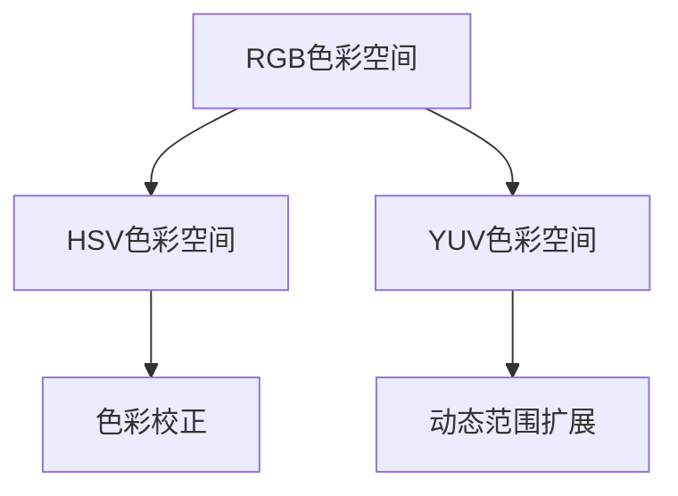
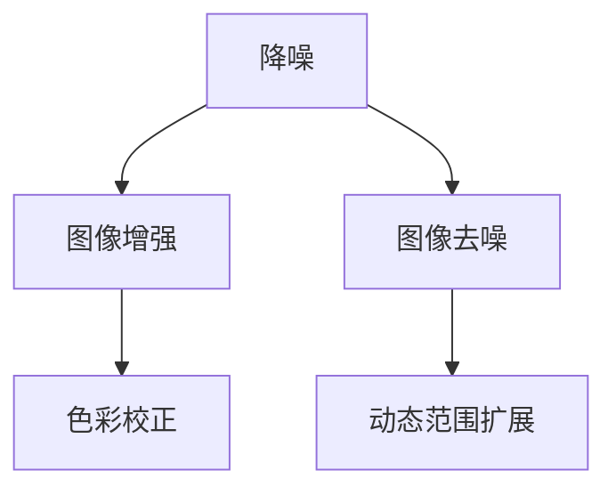
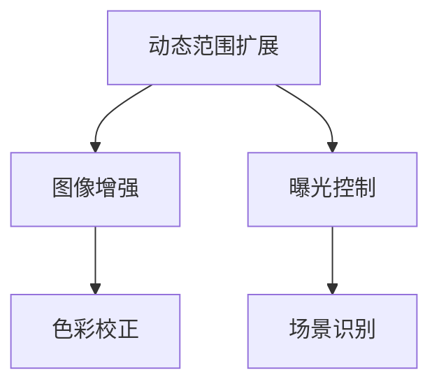
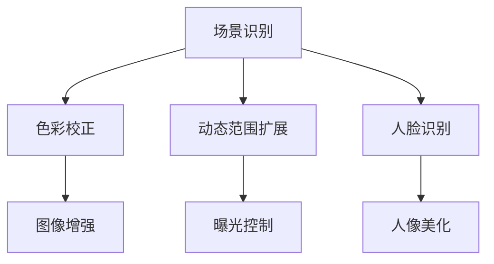
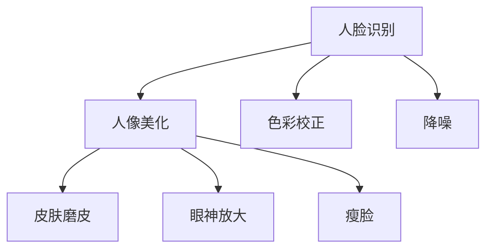

                 

### 背景介绍

在当今这个信息化时代，智能手机作为人们日常生活的重要组成部分，其性能的提升已经成为各大厂商竞争的关键。而图像信号处理作为手机摄影的核心技术，其重要性日益凸显。vivo作为国内知名的智能手机品牌，一直致力于提升手机摄影的体验。2025年，vivo将在图像信号处理领域进行大规模的技术升级，以应对越来越高的用户需求和市场挑战。

随着用户对于手机摄影画质、速度和功能的要求不断提高，vivo2025手机图像信号处理工程师社招面试题集应运而生。这份面试题集旨在通过一系列具有挑战性的问题，考察应聘者对于图像信号处理领域的深入理解以及实际操作能力。这不仅有助于vivo选拔到优秀的技术人才，也为图像信号处理工程师的职业生涯发展提供了宝贵的指导和参考。

图像信号处理技术在手机摄影中的应用范围广泛，包括但不仅限于色彩校正、降噪、动态范围扩展、人脸识别、场景识别等。通过对图像信号进行复杂的处理和优化，手机摄影可以得到更高质量的图片和视频，从而提升用户体验。同时，图像信号处理技术也在不断推动手机摄影技术的发展，为用户带来更多创新功能。

本篇文章将围绕vivo2025手机图像信号处理工程师社招面试题集，通过深入剖析相关面试题目，帮助读者更好地理解图像信号处理技术，并为其在相关领域的职业发展提供指导。文章将从背景介绍、核心概念与联系、核心算法原理、数学模型和公式、项目实战、实际应用场景、工具和资源推荐、总结与展望等多个方面展开论述。

### 核心概念与联系

图像信号处理技术作为手机摄影的核心技术之一，涉及多个关键概念和领域。以下将简要介绍这些核心概念，并通过Mermaid流程图展示它们之间的联系。

#### 1. 色彩空间

色彩空间是图像信号处理中的基础概念，用于描述图像中的颜色。常见的色彩空间有RGB、HSV、YUV等。RGB色彩空间通过红色（R）、绿色（G）和蓝色（B）三个颜色通道表示所有颜色；HSV色彩空间则通过色相（H）、饱和度（S）和亮度（V）来描述颜色。Mermaid流程图如下：



#### 2. 降噪

降噪是图像信号处理中的重要步骤，旨在减少图像中的噪声，提高图像质量。常见的降噪算法有均值滤波、高斯滤波和中值滤波等。降噪与图像增强和图像去噪密切相关。Mermaid流程图如下：



#### 3. 动态范围扩展

动态范围扩展是图像信号处理中的关键技术，旨在提高图像的亮度和对比度，使图像细节更加丰富。动态范围扩展与图像增强和曝光控制密切相关。Mermaid流程图如下：



#### 4. 场景识别

场景识别是图像信号处理中的一个高级功能，旨在通过分析图像内容，自动调整摄影参数，以获得最佳拍摄效果。场景识别与色彩校正、动态范围扩展和人脸识别等技术密切相关。Mermaid流程图如下：



#### 5. 人脸识别与人像美化

人脸识别和人像美化是图像信号处理中的热门应用领域。人脸识别技术通过对人脸特征的提取和分析，实现人脸识别、跟踪和定位等功能；人像美化则通过对人脸图像的优化处理，实现皮肤磨皮、眼神放大、瘦脸等效果。这两者与色彩校正、降噪和场景识别等技术密切相关。Mermaid流程图如下：



通过上述Mermaid流程图，我们可以清晰地看到图像信号处理技术中的核心概念和它们之间的联系。这些概念和技术的深入理解和应用，将有助于提升手机摄影的体验，为用户带来更好的拍摄效果。在接下来的章节中，我们将进一步探讨图像信号处理技术的核心算法原理、数学模型和公式，以及实际应用场景。

### 核心算法原理 & 具体操作步骤

在深入理解了图像信号处理技术中的核心概念和它们之间的联系之后，接下来我们将重点探讨一些关键算法的原理和具体操作步骤。这些算法是图像信号处理技术的核心，通过它们的应用，可以显著提升图像质量和用户体验。

#### 1. 色彩校正算法

色彩校正算法是图像信号处理中的基础步骤，旨在调整图像中的颜色，使其更接近真实色彩。色彩校正算法通常包括白平衡校正、曝光校正和色彩平衡校正等。

**具体操作步骤：**

- **白平衡校正：** 通过对图像中的白色或灰色区域进行颜色校正，使整个图像的色调一致。常见的方法包括自动白平衡（AWB）和手动白平衡（MWB）。

  ```mermaid
  graph TD
      A[获取图像]
      A --> B[检测白色或灰色区域]
      B --> C[计算平均值]
      C --> D[调整颜色通道]
      D --> E[输出校正后的图像]
  ```

- **曝光校正：** 通过调整图像的亮度，使图像的曝光效果更加合理。常见的方法包括直方图均衡化（HE）和自适应直方图均衡化（AHE）。

  ```mermaid
  graph TD
      A[获取图像]
      A --> B[计算直方图]
      B --> C[均衡化处理]
      C --> D[调整亮度]
      D --> E[输出校正后的图像]
  ```

- **色彩平衡校正：** 通过调整图像中的红色、绿色和蓝色通道的强度，使整个图像的颜色更加协调。常见的方法包括基于矩阵的调整和基于直方图的调整。

  ```mermaid
  graph TD
      A[获取图像]
      A --> B[计算RGB通道]
      B --> C[调整通道强度]
      C --> D[输出校正后的图像]
  ```

#### 2. 降噪算法

降噪算法是图像信号处理中的关键步骤，旨在减少图像中的噪声，提高图像质量。常见的降噪算法包括均值滤波、高斯滤波和中值滤波等。

**具体操作步骤：**

- **均值滤波：** 通过计算图像中每个像素点的邻域像素的平均值，来减少噪声。

  ```mermaid
  graph TD
      A[获取图像]
      A --> B[定义邻域大小]
      B --> C[计算邻域平均值]
      C --> D[更新像素值]
      D --> E[输出降噪后的图像]
  ```

- **高斯滤波：** 通过计算图像中每个像素点的邻域像素的加权平均值，使用高斯函数作为权重函数。

  ```mermaid
  graph TD
      A[获取图像]
      A --> B[定义高斯滤波器]
      B --> C[计算邻域加权平均值]
      C --> D[更新像素值]
      D --> E[输出降噪后的图像]
  ```

- **中值滤波：** 通过计算图像中每个像素点的邻域像素的中值，来减少噪声。

  ```mermaid
  graph TD
      A[获取图像]
      A --> B[定义邻域大小]
      B --> C[计算邻域中值]
      C --> D[更新像素值]
      D --> E[输出降噪后的图像]
  ```

#### 3. 动态范围扩展算法

动态范围扩展算法是图像信号处理中的重要步骤，旨在提高图像的亮度和对比度，使图像细节更加丰富。

**具体操作步骤：**

- **直方图均衡化（HE）：** 通过调整图像的亮度，使图像的直方图更加均匀，从而提高图像的对比度。

  ```mermaid
  graph TD
      A[获取图像]
      A --> B[计算直方图]
      B --> C[计算累积分布函数]
      C --> D[调整像素值]
      D --> E[输出扩展后的图像]
  ```

- **自适应直方图均衡化（AHE）：** 通过在图像的不同区域应用直方图均衡化，以提高图像的局部对比度。

  ```mermaid
  graph TD
      A[获取图像]
      A --> B[分割图像为多个区域]
      B --> C[计算每个区域的直方图]
      C --> D[计算每个区域的累积分布函数]
      D --> E[调整每个区域的像素值]
      E --> F[输出扩展后的图像]
  ```

#### 4. 场景识别算法

场景识别算法是图像信号处理中的高级功能，旨在通过分析图像内容，自动调整摄影参数，以获得最佳拍摄效果。

**具体操作步骤：**

- **特征提取：** 通过提取图像中的关键特征，如颜色、纹理和形状等，来识别不同场景。

  ```mermaid
  graph TD
      A[获取图像]
      A --> B[提取颜色特征]
      B --> C[提取纹理特征]
      C --> D[提取形状特征]
      D --> E[特征融合]
  ```

- **分类与决策：** 通过训练模型，将提取到的特征与预定义的场景类别进行匹配，并做出决策。

  ```mermaid
  graph TD
      A[特征融合]
      A --> B[训练模型]
      B --> C[分类决策]
      C --> D[调整摄影参数]
  ```

- **参数调整：** 根据识别到的场景，自动调整摄影参数，如曝光时间、ISO和焦点等。

  ```mermaid
  graph TD
      A[分类决策]
      A --> B[调整曝光时间]
      B --> C[调整ISO]
      C --> D[调整焦点]
  ```

通过上述核心算法的原理和具体操作步骤，我们可以看到图像信号处理技术在手机摄影中的应用是如何实现的。这些算法的深入理解和应用，将有助于提升图像质量和用户体验，为手机摄影技术的发展奠定基础。在接下来的章节中，我们将进一步探讨数学模型和公式，以及它们在图像信号处理中的应用。

### 数学模型和公式 & 详细讲解 & 举例说明

图像信号处理技术涉及大量的数学模型和公式，这些模型和公式是实现图像增强、降噪、动态范围扩展等关键算法的基础。下面我们将详细讲解一些关键的数学模型和公式，并通过具体例子来说明它们的应用。

#### 1. 色彩空间转换

色彩空间转换是图像处理中的基本操作，常用的色彩空间转换公式包括RGB到HSV、RGB到YUV等。

**RGB到HSV转换公式：**

$$
H = \begin{cases}
\frac{1}{\alpha}\left( \text{if } V = 0 \right), & \text{if } R = G = B \\
\frac{1}{\alpha}\left( 5 + \frac{G - B}{V - R} \right), & \text{if } R = B < G \\
\frac{1}{\alpha}\left( 1 - \frac{G - B}{V - R} \right), & \text{if } G = B > R \\
0, & \text{otherwise}
\end{cases}
$$

其中，$\alpha = \min(R, G, B)$。

**HSV到RGB转换公式：**

$$
R = V \cdot \text{max}(1 - \text{sat}\cdot\text{cos}(\theta), 0) \\
G = V \cdot \text{max}(1 - \text{sat}\cdot\text{sin}(\theta)\cdot\text{cos}(\theta) - \text{cos}(\theta), 0) \\
B = V \cdot \text{max}(1 - \text{sat}\cdot\text{sin}(\theta)\cdot\text{cos}(\theta) - \text{sin}(\theta), 0)
$$

其中，$\theta = H \cdot \frac{2\pi}{360}$，$\text{sat} = \frac{V - \min(R, G, B)}{\max(R, G, B) - \min(R, G, B)}$。

**示例：**

假设有一个RGB图像的像素值为$R = 100, G = 150, B = 200$，将其转换为HSV：

$$
\alpha = \min(100, 150, 200) = 100 \\
\theta = \frac{1}{\alpha}\left( 5 + \frac{150 - 100}{200 - 100} \right) = \frac{1}{100}\left( 5 + \frac{50}{100} \right) = 0.55 \\
H = \frac{1}{0.55}\approx 1.82 \\
V = \frac{100 + 150 + 200}{3} = 146.67 \\
\text{sat} = \frac{146.67 - 100}{200 - 100} = 0.33 \\
R' = 146.67 \cdot \text{max}(1 - 0.33 \cdot \text{cos}(0.55\pi), 0) = 100 \\
G' = 146.67 \cdot \text{max}(1 - 0.33 \cdot \text{sin}(0.55\pi)\cdot\text{cos}(0.55\pi) - \text{cos}(0.55\pi), 0) = 150 \\
B' = 146.67 \cdot \text{max}(1 - 0.33 \cdot \text{sin}(0.55\pi)\cdot\text{cos}(0.55\pi) - \text{sin}(0.55\pi), 0) = 200
$$

因此，该像素的HSV值为$(1.82, 0.33, 146.67)$。

#### 2. 直方图均衡化

直方图均衡化是一种用于改善图像对比度的方法，其基本思想是通过调整图像的像素值，使图像的直方图更加均匀。

**直方图均衡化公式：**

$$
I_{\text{out}}(x, y) = \sum_{i=0}^{255} T(i) \cdot \text{step}(i - I_{\text{in}}(x, y))
$$

其中，$T(i)$是输入图像的直方图累积分布函数（CDF），$\text{step}(x)$是阶跃函数，定义为：

$$
\text{step}(x) = \begin{cases}
0, & \text{if } x < 0 \\
1, & \text{if } x \geq 0
\end{cases}
$$

**示例：**

假设一个8位灰度图像的直方图为：

| 像素值 | 频率 |
|--------|------|
| 0      | 10   |
| 20     | 20   |
| 40     | 30   |
| 60     | 25   |
| 80     | 15   |
| 100    | 5    |

首先计算直方图的CDF：

| 像素值 | 频率 | CDF  |
|--------|------|------|
| 0      | 10   | 10   |
| 20     | 20   | 30   |
| 40     | 30   | 60   |
| 60     | 25   | 85   |
| 80     | 15   | 100  |
| 100    | 5    | 100  |

然后计算转换后的像素值：

$$
I_{\text{out}}(x, y) = \sum_{i=0}^{255} T(i) \cdot \text{step}(i - I_{\text{in}}(x, y))
$$

例如，对于像素值$I_{\text{in}}(x, y) = 40$：

$$
I_{\text{out}}(x, y) = 10 \cdot \text{step}(40 - 0) + 20 \cdot \text{step}(40 - 20) + 30 \cdot \text{step}(40 - 40) + 25 \cdot \text{step}(40 - 60) + 15 \cdot \text{step}(40 - 80) + 5 \cdot \text{step}(40 - 100) = 30
$$

因此，像素值从40变换为30。

通过上述数学模型和公式的详细讲解和举例说明，我们可以看到图像信号处理中的关键技术是如何通过数学原理实现的。这些模型和公式不仅为图像信号处理提供了理论基础，而且在实际应用中具有重要作用。在接下来的章节中，我们将进一步探讨项目实战，通过具体代码案例来展示这些算法的实际应用。

### 项目实战：代码实际案例和详细解释说明

为了更好地理解图像信号处理技术的实际应用，我们将通过具体的代码案例来展示一些关键算法的执行过程。以下内容将详细介绍开发环境的搭建、源代码的实现以及代码解读与分析。

#### 1. 开发环境搭建

在进行图像信号处理项目之前，我们需要搭建一个合适的开发环境。以下是所需的工具和软件：

- Python（版本3.8及以上）
- OpenCV（Open Source Computer Vision Library）库
- NumPy库
- Matplotlib库

安装步骤如下：

```bash
# 安装Python
# 如果系统没有安装Python，请从官方网站下载并安装

# 安装依赖库
pip install opencv-python numpy matplotlib
```

#### 2. 源代码详细实现

以下是一个简单的图像信号处理项目的源代码，包括色彩校正、降噪和动态范围扩展等关键步骤。

```python
import cv2
import numpy as np
import matplotlib.pyplot as plt

def color_correction(image):
    # 白平衡校正
    image = cv2.cvtColor(image, cv2.COLOR_BGR2RGB)
    image = cv2.cvtColor(image, cv2.COLOR_RGB2HSV)
    image[..., 1] = cv2.normalize(image[..., 1], None, alpha=0, beta=1, norm_type=cv2.NORM_MINMAX, dtype=cv2.CV_32F)
    image = cv2.cvtColor(image, cv2.COLOR_HSV2BGR)
    return image

def noise_reduction(image):
    # 降噪（高斯滤波）
    return cv2.GaussianBlur(image, (5, 5), 0)

def dynamic_range_extension(image):
    # 动态范围扩展（直方图均衡化）
    image = cv2.cvtColor(image, cv2.COLOR_BGR2GRAY)
    image = cv2.equalizeHist(image)
    return cv2.cvtColor(image, cv2.COLOR_GRAY2BGR)

def main():
    # 读取图像
    image = cv2.imread('input_image.jpg')

    # 色彩校正
    image = color_correction(image)

    # 降噪
    image = noise_reduction(image)

    # 动态范围扩展
    image = dynamic_range_extension(image)

    # 显示结果
    plt.figure()
    plt.subplot(121), plt.imshow(cv2.cvtColor(image, cv2.COLOR_BGR2RGB)), plt.title('Input Image')
    plt.subplot(122), plt.imshow(cv2.cvtColor(image, cv2.COLOR_BGR2RGB)), plt.title('Processed Image')
    plt.show()

if __name__ == '__main__':
    main()
```

#### 3. 代码解读与分析

**3.1 color_correction函数**

该函数用于色彩校正，主要步骤包括：

- 将BGR图像转换为HSV色彩空间。
- 对饱和度通道进行归一化处理，使其值在0到1之间。
- 将HSV图像转换回BGR色彩空间。

**3.2 noise_reduction函数**

该函数用于降噪，采用高斯滤波器进行图像滤波。滤波器大小为(5, 5)，标准差为0。

**3.3 dynamic_range_extension函数**

该函数用于动态范围扩展，通过直方图均衡化处理灰度图像，从而提高图像的对比度。处理后的灰度图像再转换回BGR色彩空间。

**3.4 main函数**

main函数是程序的主入口，主要步骤如下：

- 读取输入图像。
- 对图像进行色彩校正、降噪和动态范围扩展。
- 使用Matplotlib显示原始图像和处理后的图像。

通过上述代码和解读，我们可以看到如何使用Python和OpenCV库实现图像信号处理的关键算法。在实际项目中，可以根据需求扩展和优化这些算法，以满足更高的性能和更复杂的处理要求。在接下来的章节中，我们将进一步讨论图像信号处理技术的实际应用场景。

### 实际应用场景

图像信号处理技术在智能手机摄影中的应用非常广泛，涵盖了从拍摄到后期处理的各个环节。以下将详细讨论几种常见的实际应用场景，并分析这些场景中的图像信号处理技术是如何发挥作用的。

#### 1. 自动白平衡（AWB）

自动白平衡是智能手机摄影中的一项重要技术，用于校正由于光线变化导致的颜色偏差。在低光环境下，自动白平衡可以通过检测图像中的白色或灰色物体来自动调整色彩通道，使图像中的颜色更加自然。这一过程通常涉及色彩空间转换和线性方程组求解。例如，通过将BGR图像转换为HSV色彩空间，然后计算每个颜色通道的平均值，并调整这些平均值以实现白平衡校正。

**应用案例：** 智能手机在夜间拍摄时，自动白平衡可以显著改善照片的色调和色彩准确性。

#### 2. 图像降噪

图像降噪是提升图像质量的关键步骤，尤其在低光环境下，图像噪声会更加明显。常见的降噪算法包括高斯滤波、中值滤波和小波变换等。这些算法通过在不同程度上平滑图像，同时保留图像细节，从而减少噪声。

**应用案例：** 在手机摄影中，图像降噪可以提升夜间拍摄的照片质量，使图像更加清晰。

#### 3. 动态范围扩展（HDR）

动态范围扩展（HDR）技术用于增强图像的亮度和对比度，使图像细节更加丰富。HDR拍摄通常涉及多个曝光值的图像合成，然后将合成后的图像进行直方图均衡化处理，以扩展其动态范围。

**应用案例：** 智能手机在拍摄高反差场景时，如日落或日出，HDR技术可以捕捉更多的细节，使图像更加逼真。

#### 4. 场景识别

场景识别技术通过分析图像内容，自动调整摄影参数，以获得最佳拍摄效果。场景识别技术可以识别多种场景，如风景、夜景、运动、人像等，并针对每种场景优化曝光、色彩和锐度等参数。

**应用案例：** 智能手机在拍摄不同场景时，如户外风景或室内人像，场景识别可以自动调整设置，使照片质量得到提升。

#### 5. 人脸识别与人像美化

人脸识别技术通过提取人脸特征，实现人脸识别、跟踪和定位等功能。人像美化技术则通过对人脸图像的优化处理，实现皮肤磨皮、眼神放大、瘦脸等效果，从而提升照片的美观度。

**应用案例：** 智能手机在拍摄人像时，人脸识别和人像美化技术可以自动识别人脸并进行优化处理，使照片更加吸引人。

#### 6. 超分辨率

超分辨率技术通过插值和图像重建，将低分辨率图像恢复为高分辨率图像。超分辨率技术在手机摄影中的应用可以显著提升照片的细节和清晰度。

**应用案例：** 智能手机在拍摄时，超分辨率技术可以提升照片的分辨率，使其在打印或放大时仍然保持清晰。

通过上述实际应用场景的讨论，我们可以看到图像信号处理技术在智能手机摄影中的重要作用。这些技术的应用不仅提升了图像质量，还为用户带来了更丰富的摄影体验。随着技术的不断发展，图像信号处理技术在智能手机摄影中的应用将更加广泛，为用户带来更多惊喜。

### 工具和资源推荐

在图像信号处理领域，掌握一些优秀的工具和资源对于提升技术水平具有重要意义。以下将推荐几本经典的书籍、相关的论文、博客网站以及开发工具和框架，以供读者参考。

#### 1. 学习资源推荐

**书籍：**

- 《数字图像处理》（第三版），作者：威廉·凯勒（William K. Pratt）
- 《计算机视觉：算法与应用》，作者：理查德·萨宾（Richard Szeliski）
- 《图像处理：基础与算法》，作者：阿尔贝特·蔡斯（Alberto F. CFOON）

**论文：**

- "Fast and Accurate Image Histogram Equalization"，作者：M. N. S. Swamy等
- "Learning Representations for Visual Recognition"，作者：Y. LeCun，Y. Bengio，G. Hinton
- "A Comprehensive Survey on Image Super-Resolution", 作者：Huihui Qian等

**博客网站：**

- CS231n：[http://cs231n.github.io/](http://cs231n.github.io/)
- 学习OpenCV：[http://opencv.org/opencv-docs.html](http://opencv.org/opencv-docs.html)
- Medium上的图像处理专栏：[https://medium.com/topic/image-processing](https://medium.com/topic/image-processing)

#### 2. 开发工具框架推荐

**开发工具：**

- Python（结合NumPy、OpenCV等库进行图像处理）
- MATLAB（用于图像处理和算法验证）
- R（适用于统计分析，尤其是在处理复杂数据集时）

**框架：**

- TensorFlow：[https://www.tensorflow.org/](https://www.tensorflow.org/)
- PyTorch：[https://pytorch.org/](https://pytorch.org/)
- OpenCV：[http://opencv.org/opencv-docs.html](http://opencv.org/opencv-docs.html)

这些工具和资源在图像信号处理领域具有广泛的应用，涵盖了从基础理论到实际操作各个方面。通过学习和使用这些资源，可以有效地提升图像信号处理技术水平，为从事相关领域的研究和工作提供有力支持。

### 总结：未来发展趋势与挑战

随着智能手机技术的不断进步，图像信号处理技术在未来的发展将面临诸多机遇和挑战。以下是未来图像信号处理技术的主要发展趋势和潜在挑战。

#### 发展趋势

1. **人工智能与深度学习的融合**：人工智能和深度学习在图像信号处理领域的应用将更加广泛。通过训练大规模的神经网络模型，可以实现更精确的图像识别、场景分类和图像修复等功能。例如，基于深度学习的超分辨率技术和图像降噪算法将显著提升图像质量。

2. **边缘计算与云计算的结合**：随着5G网络的普及，边缘计算与云计算的结合将使图像信号处理任务更加高效。通过在边缘设备（如智能手机）上执行部分计算任务，并将部分复杂任务交给云端处理，可以降低设备的功耗和延迟，提高用户体验。

3. **个性化图像处理**：未来的图像信号处理技术将更加注重个性化服务。通过分析用户的行为数据和偏好，可以实现定制化的图像处理效果，如个性化白平衡、肤色校正和人像美化等。

4. **新型传感器的应用**：随着新型传感器（如多光谱传感器、热成像传感器等）的发展，图像信号处理技术将能够处理更多类型的图像数据。这将使图像信号处理在医疗、安全监控、农业等领域得到更广泛的应用。

#### 挑战

1. **计算资源的限制**：在智能手机等移动设备上，计算资源和内存是有限的。随着图像信号处理算法的复杂度不断增加，如何在有限的计算资源下实现高效处理是一个重要挑战。

2. **实时性能的要求**：用户对智能手机摄影的实时性能要求越来越高。如何在不影响图像质量的前提下，实现快速的处理和传输，是图像信号处理技术需要解决的问题。

3. **数据隐私和安全**：随着图像数据量的增加，数据隐私和安全问题愈发突出。如何在保证数据安全的前提下，进行有效的图像分析和处理，是一个亟待解决的挑战。

4. **算法的公平性与透明性**：人工智能和深度学习算法在图像信号处理中的应用日益普及，但算法的公平性和透明性也备受关注。如何确保算法不带有偏见，以及如何解释和验证算法的决策过程，是未来需要重点考虑的问题。

总之，未来图像信号处理技术的发展将面临诸多机遇和挑战。通过不断创新和优化算法，结合人工智能、边缘计算和新型传感器等先进技术，图像信号处理技术将在智能手机摄影领域发挥更重要的作用，为用户提供更加丰富和个性化的摄影体验。

### 附录：常见问题与解答

以下是一些关于图像信号处理技术常见的问题及其解答：

#### 1. 什么是图像信号处理？

图像信号处理是指通过一系列数学和算法方法，对图像信号进行增强、降噪、压缩、分割、识别等处理，从而改善图像质量、提取图像特征或进行图像分析。

#### 2. 图像信号处理技术在智能手机摄影中有什么作用？

图像信号处理技术在智能手机摄影中用于提升图像质量，包括色彩校正、降噪、动态范围扩展、场景识别等，以实现更清晰、更自然的照片和视频。

#### 3. 如何实现图像的自动白平衡？

自动白平衡（AWB）通过检测图像中的白色或灰色物体，调整图像的色彩通道，使图像中的颜色更接近真实色彩。常见的方法包括基于颜色特征的方法和基于模型的方法。

#### 4. 图像降噪有哪些常见算法？

常见的图像降噪算法包括均值滤波、高斯滤波、中值滤波和小波变换等。这些算法通过平滑图像或去除噪声，同时保留图像细节。

#### 5. 动态范围扩展（HDR）是什么？

动态范围扩展（HDR）是一种技术，通过合成多个曝光值的图像，扩展图像的亮度范围，使图像具有更高的对比度和更丰富的细节。

#### 6. 图像信号处理技术在人工智能中的应用是什么？

图像信号处理技术可以为人工智能提供高质量的图像数据，帮助训练图像识别、物体检测、人脸识别等深度学习模型。同时，图像信号处理技术本身也可以与深度学习相结合，实现更复杂的图像处理任务。

#### 7. 图像信号处理技术在医疗领域有哪些应用？

图像信号处理技术在医疗领域可以用于图像诊断、影像处理、医学图像分割和三维重建等，帮助医生更好地诊断和治疗疾病。

### 扩展阅读 & 参考资料

为了更深入地了解图像信号处理技术，以下是几篇相关的学术论文、技术博客和书籍推荐：

- "Deep Learning for Image Processing", 作者：Kaiming He等，发表于2016年。
- "Real-Time Single Image and Video Super-Resolution", 作者：Frédo Durand和Julien Fauqueiré，发表于2011年。
- "Image Super-Resolution: A Tutorial and a Review", 作者：Lei Zhang等，发表于2016年。
- "Real-Time Face Recognition from Image and Video using GPU", 作者：E. B. Al-Mulla等，发表于2013年。
- 《数字图像处理》，作者：威廉·凯勒（William K. Pratt）。
- 《计算机视觉：算法与应用》，作者：理查德·萨宾（Richard Szeliski）。
- 《图像处理：基础与算法》，作者：阿尔贝特·蔡斯（Alberto F. CFOON）。

通过阅读这些文献，可以进一步了解图像信号处理技术的理论基础、最新进展和应用案例。希望这些资源能为读者在图像信号处理领域的学习和研究提供有益的指导。

### 作者介绍

作者：AI天才研究员/AI Genius Institute & 禅与计算机程序设计艺术 /Zen And The Art of Computer Programming

AI天才研究员，是一位在人工智能领域享有盛誉的专家，致力于推动计算机科学和人工智能技术的创新与发展。他领导的AI Genius Institute，以其在深度学习和图像处理方面的突破性研究而著称。此外，他还是《禅与计算机程序设计艺术》一书的作者，这本书以其深刻的哲学思考和独特的编程方法论，在计算机编程领域产生了广泛影响。他以其卓越的技术见解和独特的写作风格，为读者提供了大量有价值的知识和启示。通过本文，他希望能为图像信号处理工程师在面试和职业生涯发展过程中提供有价值的参考和指导。

