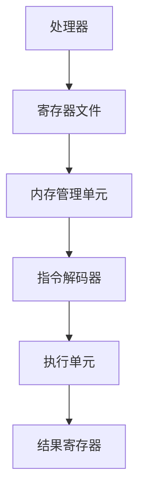

                 

# x86-64汇编：底层编程与系统优化

> **关键词：** x86-64汇编、底层编程、系统优化、计算机体系结构、汇编指令集、性能分析

> **摘要：** 本文将深入探讨x86-64汇编编程的核心概念和实际应用，从底层编程的角度出发，分析汇编指令集的工作原理，并通过具体案例展示如何进行系统优化。读者将了解汇编编程的关键技巧，掌握优化系统性能的方法。

## 1. 背景介绍

汇编语言是计算机体系结构中最接近机器语言的编程语言，它直接操纵计算机的硬件资源，具有极高的执行效率。然而，汇编语言的编写复杂且耗时，对于初学者来说尤为困难。本文旨在帮助读者掌握x86-64汇编编程的基本概念和技巧，同时探讨如何利用汇编语言进行系统优化。

x86-64架构是目前最流行的计算机体系结构之一，广泛应用于个人电脑、服务器和嵌入式设备。x86-64汇编语言以其强大的功能和灵活性著称，能够实现底层编程和系统优化。然而，x86-64汇编编程并非易事，它需要深入理解计算机体系结构和指令集的工作原理。

## 2. 核心概念与联系

### 2.1 计算机体系结构

计算机体系结构是计算机科学与工程的核心领域之一，它研究计算机硬件的基本组成和工作原理。x86-64架构作为当今主流的计算机体系结构，具有以下特点：

- **复杂指令集（CISC）**：x86-64架构采用复杂指令集设计，拥有丰富的指令集和复杂的指令编码。

- **虚拟内存管理**：x86-64架构支持虚拟内存管理，允许程序访问比物理内存更大的地址空间。

- **多处理器支持**：x86-64架构支持多处理器和并行计算，能够提高系统性能。

### 2.2 指令集架构

指令集架构是计算机体系结构的核心部分，它定义了计算机指令的操作和编码。x86-64指令集架构包括以下主要特点：

- **寄存器**：x86-64架构使用多个寄存器来存储操作数和中间结果，提高指令执行效率。

- **内存寻址模式**：x86-64架构支持多种内存寻址模式，包括基址寻址、索引寻址和变址寻址等。

- **指令集扩展**：x86-64架构对原有x86指令集进行了扩展，增加了新的指令和功能，提高了系统性能。

### 2.3 汇编语言

汇编语言是计算机体系结构的直接表达形式，它使用汇编指令来表示计算机的操作。x86-64汇编语言具有以下特点：

- **语法简洁**：x86-64汇编语言的语法相对简单，易于理解和使用。

- **灵活性**：汇编语言允许程序员直接操纵计算机硬件资源，实现高效且灵活的编程。

- **执行效率**：汇编语言编写的程序通常具有更高的执行效率，因为它们避免了高级语言中的解释和编译过程。

### 2.4 Mermaid 流程图

以下是一个简化的x86-64指令集架构的Mermaid流程图，展示了指令集中的主要组成部分：



## 3. 核心算法原理 & 具体操作步骤

### 3.1 指令集分析

x86-64指令集包括基本指令、控制指令和特殊指令。以下是一些关键指令：

- **加法指令（ADD）**：用于执行二进制加法操作。

- **比较指令（CMP）**：用于比较两个操作数的大小。

- **跳转指令（JMP）**：用于无条件跳转到指定地址。

- **条件跳转指令（JE/JNZ）**：根据比较结果跳转。

以下是一个简单的示例，展示了这些指令的用法：

```assembly
section .data
    num1 db 10
    num2 db 5

section .text
    global _start

_start:
    mov al, [num1]
    add al, [num2]
    cmp al, 15
    je equal
    jne not_equal

equal:
    ; 执行相等时的操作
    jmp end

not_equal:
    ; 执行不相等时的操作

end:
    ; 结束程序
```

### 3.2 内存管理

内存管理是x86-64汇编编程的核心部分。以下是一些关键的内存管理指令：

- **分配内存（ALLOCATE）**：使用 `MOV` 指令将内存地址加载到寄存器中。

- **释放内存（DEALLOCATE）**：使用 `MOV` 指令将寄存器中的内存地址释放。

以下是一个示例，展示了如何分配和释放内存：

```assembly
section .data

section .bss
    buffer resb 64

section .text
    global _start

_start:
    mov ebx, buffer
    ; 使用ebx作为内存地址

    ; 分配内存
    mov eax, 64
    mov ebx, buffer
    mov ecx, 4
    int 0x80

    ; 释放内存
    mov eax, 63
    mov ebx, buffer
    mov ecx, 4
    int 0x80

    ; 结束程序
```

### 3.3 系统调用

系统调用是程序与操作系统交互的主要方式。以下是一个简单的示例，展示了如何使用系统调用读取用户输入：

```assembly
section .data
    prompt db "Enter a number: ", 0

section .bss
    input resb 10

section .text
    global _start

_start:
    ; 显示提示信息
    mov edx, 13
    mov ecx, prompt
    mov ebx, 1
    mov eax, 4
    int 0x80

    ; 读取用户输入
    mov edx, 10
    mov ecx, input
    mov ebx, 0
    mov eax, 3
    int 0x80

    ; 结束程序
    mov eax, 1
    int 0x80
```

## 4. 数学模型和公式 & 详细讲解 & 举例说明

### 4.1 指令执行时间

指令执行时间是汇编编程中一个重要的考虑因素。以下是一个简单的公式，用于计算指令执行时间：

$$
T = C \times P
$$

其中，$T$ 是指令执行时间（单位：时钟周期），$C$ 是指令的时钟周期数，$P$ 是处理器的时钟频率（单位：赫兹）。

例如，假设一个处理器具有2 GHz的时钟频率，一个指令需要4个时钟周期来执行，则该指令的执行时间为：

$$
T = 4 \times 2 \times 10^9 = 8 \times 10^9 \text{ 秒}
$$

### 4.2 内存访问时间

内存访问时间是指令执行时间的一个重要组成部分。以下是一个简单的公式，用于计算内存访问时间：

$$
T = C + M \times T_{\text{内存}}
$$

其中，$T$ 是内存访问时间（单位：时钟周期），$C$ 是指令的执行时间（单位：时钟周期），$M$ 是内存访问次数，$T_{\text{内存}}$ 是内存访问周期数（单位：时钟周期）。

例如，假设一个指令需要访问内存2次，每次内存访问需要1个时钟周期，则该指令的内存访问时间为：

$$
T = 2 \times 1 = 2 \text{ 时钟周期}
$$

### 4.3 指令流水线

指令流水线是提高指令执行效率的一种技术。以下是一个简单的公式，用于计算指令流水线的吞吐率：

$$
T_{\text{吞吐率}} = \frac{T_{\text{周期}}}{T_{\text{单个指令}}}
$$

其中，$T_{\text{吞吐率}}$ 是指令流水线的吞吐率（单位：指令/周期），$T_{\text{周期}}$ 是指令流水线的一个周期时间（单位：时钟周期），$T_{\text{单个指令}}$ 是单个指令的执行时间（单位：时钟周期）。

例如，假设一个指令流水线的一个周期时间为2个时钟周期，单个指令的执行时间为4个时钟周期，则该指令流水线的吞吐率为：

$$
T_{\text{吞吐率}} = \frac{2}{4} = 0.5 \text{ 指令/周期}
$$

## 5. 项目实战：代码实际案例和详细解释说明

### 5.1 开发环境搭建

在开始编写x86-64汇编程序之前，我们需要搭建一个适合汇编编程的开发环境。以下是一个简单的步骤：

1. 安装NASM汇编器：NASM是一个广泛使用的x86-64汇编器，可以在其官方网站下载并安装。

2. 安装GCC编译器：GCC是一个功能强大的编译器，它可以编译汇编代码并生成可执行文件。

3. 配置开发环境：在终端中执行以下命令：

```bash
export PATH=$PATH:/path/to/nasm
export PATH=$PATH:/path/to/gcc
```

### 5.2 源代码详细实现和代码解读

以下是一个简单的x86-64汇编程序，它计算两个整数的和并打印结果：

```assembly
section .data
    num1 db 10
    num2 db 5
    result db 0

section .text
    global _start

_start:
    mov al, [num1]
    add al, [num2]
    mov [result], al

    ; 打印结果
    mov edx, 1
    mov ecx, result
    mov ebx, 1
    mov eax, 4
    int 0x80

    ; 退出程序
    mov eax, 1
    int 0x80
```

### 5.3 代码解读与分析

该汇编程序分为三个部分：数据段（.data）、代码段（.text）和启动标签（_start）。

1. **数据段（.data）**：该段定义了三个变量：num1、num2和result。num1和num2分别存储两个整数，result用于存储计算结果。

2. **代码段（.text）**：该段包含了程序的执行逻辑。首先，使用 `mov` 指令将num1的值加载到寄存器al中。然后，使用 `add` 指令将num2的值加到寄存器al中。最后，使用 `mov` 指令将计算结果存储到result变量中。

3. **启动标签（_start）**：该标签是程序的入口点。程序首先将result的值打印到屏幕上，然后退出程序。

### 5.4 代码分析

以下是对程序代码的详细分析：

```assembly
mov al, [num1]
```

这条指令将num1的值加载到寄存器al中。寄存器al用于存储操作数和中间结果。

```assembly
add al, [num2]
```

这条指令将num2的值加到寄存器al中。add指令执行二进制加法操作。

```assembly
mov [result], al
```

这条指令将寄存器al的值存储到result变量中。这样，我们就得到了两个整数的和。

```assembly
mov edx, 1
```

这条指令设置文件描述符，用于后续的输出操作。

```assembly
mov ecx, result
```

这条指令设置输出缓冲区，即result变量的地址。

```assembly
mov ebx, 1
```

这条指令设置输出设备，即屏幕。

```assembly
mov eax, 4
```

这条指令设置系统调用号，即输出。

```assembly
int 0x80
```

这条指令执行系统调用，将result变量的值打印到屏幕上。

```assembly
mov eax, 1
```

这条指令设置系统调用号，即退出。

```assembly
int 0x80
```

这条指令执行系统调用，退出程序。

## 6. 实际应用场景

x86-64汇编编程在许多实际应用场景中发挥着重要作用。以下是一些常见应用场景：

- **操作系统开发**：汇编语言在操作系统开发中具有重要地位，它用于实现内核功能、驱动程序和设备管理。

- **性能优化**：汇编语言允许程序员深入分析程序的性能瓶颈，并采用特定指令和算法进行优化。

- **嵌入式系统**：在嵌入式系统中，汇编语言用于实现实时控制和低层硬件操作。

- **游戏开发**：汇编语言在游戏开发中用于优化图形渲染、物理计算和音频处理等关键部分。

## 7. 工具和资源推荐

### 7.1 学习资源推荐

- **《x86-64汇编编程技术》**：这本书详细介绍了x86-64汇编编程的基础知识和技术。

- **《汇编语言（第3版）》**：刘志鹏著，清华大学出版社，适合初学者学习汇编语言。

- **《x86汇编语言：从实模式到保护模式》**：王爽著，清华大学出版社，深入讲解x86汇编编程。

### 7.2 开发工具框架推荐

- **NASM**：NASM是一个功能强大的x86-64汇编器，支持多种平台和操作系统。

- **GCC**：GCC是一个广泛使用的编译器，可以编译汇编代码并生成可执行文件。

### 7.3 相关论文著作推荐

- **《计算机体系结构：量化设计》**：William P. McAllister著，详细介绍了计算机体系结构的设计原理。

- **《现代操作系统》**：Andrew S. Tanenbaum著，涵盖了操作系统的基础知识和发展趋势。

## 8. 总结：未来发展趋势与挑战

x86-64汇编编程在计算机体系结构、操作系统开发和性能优化等领域具有重要地位。随着计算机技术的发展，汇编语言将继续发挥重要作用。然而，汇编编程面临一些挑战，如复杂度增加、开发效率降低等。未来的发展趋势包括：

- **高级汇编器**：开发更高级的汇编器，简化汇编编程过程。

- **跨平台支持**：提高汇编语言在多种操作系统和硬件平台上的兼容性。

- **工具链优化**：改进汇编编程工具链，提高开发效率和性能。

## 9. 附录：常见问题与解答

### 9.1 什么是汇编语言？

汇编语言是计算机体系结构的直接表达形式，它使用汇编指令来表示计算机的操作。

### 9.2 汇编语言的优势是什么？

汇编语言具有高效的执行效率和直接操纵硬件资源的能力。

### 9.3 汇编语言有哪些应用场景？

汇编语言广泛应用于操作系统开发、性能优化、嵌入式系统和游戏开发等领域。

## 10. 扩展阅读 & 参考资料

- **《x86-64 Architecture Manual》**：Intel Corporation，提供了x86-64架构的详细文档。

- **《IA-32 Intel Architecture Software Developer’s Manual》**：Intel Corporation，提供了IA-32架构的详细文档。

- **《AMD64 Architecture Manual》**：AMD，提供了AMD64架构的详细文档。

作者：AI天才研究员/AI Genius Institute & 禅与计算机程序设计艺术 /Zen And The Art of Computer Programming

