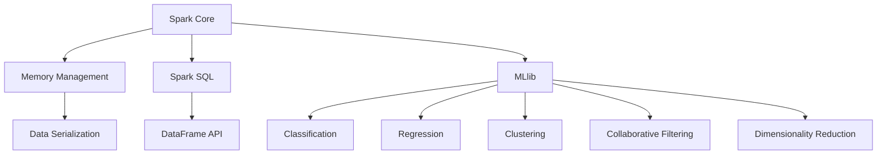

                 

### 背景介绍

#### 人工智能与大数据计算

随着互联网的迅速发展和信息技术的不断进步，人工智能（AI）和数据科学已经成为了当前科技领域的热点话题。人工智能通过模拟人类智能行为，实现了机器学习和深度学习等功能，使得计算机能够自主学习和优化。而大数据则是由海量的结构化或非结构化数据组成的信息集合，它们蕴含着巨大的商业价值和科学洞察。

为了处理这些庞大的数据集，传统的单机计算模式已经无法满足需求。因此，分布式计算技术应运而生。分布式计算通过将计算任务分布在多个计算节点上，实现了对大数据的高效处理。Apache Spark 作为分布式计算框架，以其出色的性能和易用性，在人工智能和大数据领域获得了广泛应用。

#### Spark 生态系统

Spark 是一个开源的分布式计算系统，由 UC Berkeley AMPLab 开发。Spark 生态系统包含了多个组件，其中最核心的是 Spark Core 和 Spark SQL。Spark Core 提供了分布式任务调度、内存计算和存储功能，使得 Spark 能够快速处理大规模数据集。Spark SQL 则提供了与关系数据库类似的查询接口，使用 SQL 或者 SQL-like 的 DataFrame API 对结构化数据进行分析。

除了 Spark Core 和 Spark SQL，Spark 生态系统还包括以下组件：

- **Spark Streaming**: 实时流数据计算
- **MLlib**: 机器学习库
- **GraphX**: 图处理库
- **Spark R**: R 语言接口
- **Spark ML**: 基于 MLlib 的机器学习 API

这些组件共同构成了 Spark 的强大能力，使得 Spark 能够在多种应用场景中发挥其优势。

#### MLlib 简介

MLlib 是 Spark 生态系统中的机器学习库，提供了丰富的算法和工具，用于处理各种机器学习问题。MLlib 的主要特点包括：

- **分布式计算**: MLlib 利用 Spark 的分布式计算能力，能够高效地处理大规模数据集。
- **内存计算**: MLlib 利用 Spark 的内存计算特性，显著提高了机器学习的速度和效率。
- **易用性**: MLlib 提供了丰富的 API，支持 Scala、Python、Java 和 R 等编程语言，使得开发者能够轻松地使用 MLlib 进行机器学习任务。

在接下来的章节中，我们将深入探讨 MLlib 的核心算法原理、数学模型和实际应用场景，帮助读者更好地理解和运用 MLlib。### 核心概念与联系

#### MLlib 概述

MLlib 是 Spark 生态系统中的一个关键组件，专注于提供强大的机器学习功能。它集成了多种常用的机器学习算法，如分类、回归、聚类和协同过滤等，同时也支持多种数据预处理工具和模型评估方法。MLlib 的设计理念是易于扩展和高度可配置，使得开发者可以根据具体需求灵活地调整算法参数。

#### 分布式计算模型

在理解 MLlib 之前，我们需要了解 Spark 的分布式计算模型。Spark 是一个基于内存的分布式数据处理框架，其核心思想是将数据存储在内存中，从而显著减少数据在磁盘和内存之间的交换次数，提高数据处理速度。

Spark 的基本架构包括驱动程序（Driver Program）、集群管理器和计算节点（Executor Nodes）。驱动程序负责定义和提交计算任务，集群管理器负责资源调度和任务分配，计算节点负责执行具体的计算任务。

#### 内存计算与存储

MLlib 利用了 Spark 的内存计算特性，使得机器学习算法能够更快地迭代和更新模型参数。通过将数据加载到内存中，MLlib 避免了频繁的磁盘 I/O 操作，从而显著提高了计算效率。

MLlib 还提供了丰富的数据结构，如 DataFrame 和 RDD（弹性分布式数据集），这些数据结构能够有效地存储和管理大规模数据集。DataFrame 是 Spark SQL 的核心数据结构，它支持结构化数据查询和操作，而 RDD 则是 Spark 的基本抽象，提供了强大的容错性和弹性。

#### 算法分类

MLlib 包含了多种机器学习算法，这些算法可以分为以下几类：

- **分类算法**: 包括逻辑回归、朴素贝叶斯、决策树、随机森林和梯度提升树等。
- **回归算法**: 包括线性回归、岭回归、套索回归和梯度提升回归等。
- **聚类算法**: 包括 K-均值、层次聚类和 DBSCAN 等。
- **协同过滤算法**: 包括矩阵分解和基于模型的协同过滤算法等。
- **降维算法**: 包括主成分分析（PCA）、线性判别分析（LDA）和 t-SNE 等。

#### 算法原理

下面我们简要介绍 MLlib 中的几个核心算法原理：

- **逻辑回归（Logistic Regression）**: 逻辑回归是一种二分类模型，用于预测标签变量是否属于某个类别。它通过优化损失函数来估计模型参数，通常使用梯度下降算法进行迭代更新。

- **随机森林（Random Forest）**: 随机森林是一种集成学习方法，它通过构建多个决策树并集成它们的预测结果来提高模型的准确性和泛化能力。每个决策树使用随机特征选择和样本采样来减少偏差和方差。

- **梯度提升树（Gradient Boosting Tree）**: 梯度提升树是一种基于梯度的优化算法，它通过迭代地构建多棵决策树来优化模型损失函数。每次迭代都针对上一次的残差进行学习，从而逐步提高模型的拟合能力。

- **K-均值聚类（K-Means Clustering）**: K-均值聚类是一种无监督学习算法，它通过将数据点划分到 K 个聚类中心来发现数据中的模式。算法通过迭代更新聚类中心，直到收敛到最优解。

#### Mermaid 流程图

为了更直观地展示 MLlib 的核心概念和架构，我们可以使用 Mermaid 流程图来描述其组件之间的联系。



在这个流程图中，Spark Core 负责内存管理和数据序列化，Spark SQL 提供了 DataFrame API，而 MLlib 包含了分类、回归、聚类、协同过滤和降维等算法模块。这些模块共同构成了 Spark 生态系统中强大的机器学习能力。

通过上述对 MLlib 的核心概念、分布式计算模型、内存计算与存储、算法分类和原理的介绍，我们可以更好地理解 MLlib 的功能和优势。在接下来的章节中，我们将深入探讨 MLlib 的具体实现和实际应用场景，帮助读者更好地运用这个强大的机器学习库。### 核心算法原理 & 具体操作步骤

#### 逻辑回归（Logistic Regression）

逻辑回归是一种经典的二分类模型，广泛应用于分类任务中。它的基本思想是通过线性回归模型预测一个连续值，然后利用这个连续值来计算概率，从而判断样本属于哪个类别。

**算法原理**：

1. **模型定义**：假设我们有一个特征向量 x 和对应的标签 y，逻辑回归模型可以表示为：
   $$ \text{logit}(y) = \log\left(\frac{p(y=1)}{1-p(y=1)}\right) = \beta_0 + \beta_1 x_1 + \beta_2 x_2 + ... + \beta_n x_n $$
   其中，$\beta_0, \beta_1, \beta_2, ..., \beta_n$ 是模型参数，$x_1, x_2, ..., x_n$ 是特征向量。

2. **概率计算**：通过求解上述方程，我们可以得到每个样本属于类别 1 的概率 p：
   $$ p(y=1) = \frac{1}{1 + \exp(-\text{logit}(y))} $$

3. **损失函数**：逻辑回归通常使用对数似然损失函数来评估模型性能：
   $$ L(\theta) = -\sum_{i=1}^{n} y_i \log(p_i) + (1 - y_i) \log(1 - p_i) $$
   其中，$\theta = (\beta_0, \beta_1, \beta_2, ..., \beta_n)$ 是模型参数。

4. **优化方法**：为了求解模型参数，我们可以使用梯度下降算法。每次迭代，计算损失函数关于每个参数的梯度，然后更新参数：
   $$ \theta_{\text{new}} = \theta_{\text{current}} - \alpha \nabla_{\theta} L(\theta) $$
   其中，$\alpha$ 是学习率。

**具体操作步骤**：

1. **数据预处理**：首先，我们需要将数据集分成训练集和测试集。然后，将数据转换为 Spark 的 DataFrame 结构，以便后续处理。

2. **特征工程**：对数据进行特征提取和变换，例如归一化、缺失值填充等。这一步非常重要，因为特征质量直接影响模型的性能。

3. **模型训练**：使用 MLlib 的逻辑回归 API 来训练模型。具体步骤如下：
   ```scala
   import org.apache.spark.ml.classification.LogisticRegression
   import org.apache.spark.sql.SparkSession
   
   val spark = SparkSession.builder.appName("LogisticRegressionExample").getOrCreate()
   val data = spark.read.format("libsvm").load("data/mllib/sample_libsvm_data.txt")
   
   val lr = new LogisticRegression().setMaxIter(10).setRegParam(0.01)
   val model = lr.fit(data)
   ```

4. **模型评估**：使用测试集评估模型的性能，计算准确率、召回率、F1 分数等指标。

5. **模型应用**：将训练好的模型应用于新的数据集，进行预测。

```scala
val predictions = model.transform(testData)
val accuracy = predictions.select("prediction", "label").where($"prediction" === $"label").count().toDouble / testData.count()
println(s"Model accuracy: $accuracy")
```

#### 决策树（Decision Tree）

决策树是一种基于特征进行决策的树形结构，每个内部节点表示一个特征，每个分支表示该特征的取值，每个叶子节点表示一个类别的预测。

**算法原理**：

1. **树构建**：决策树通过递归划分数据集来构建。每次划分，选择最优特征，将其作为内部节点，然后对每个子集递归地构建子树。

2. **最优特征选择**：通常使用信息增益（Information Gain）或者基尼不纯度（Gini Impurity）来选择最优特征。信息增益表示特征划分后数据的纯度提升，基尼不纯度则表示特征划分后数据的杂乱程度。

3. **树剪枝**：为了避免过拟合，决策树通常需要进行剪枝。剪枝的方法包括预剪枝（提前停止生长）和后剪枝（剪掉部分分支）。

**具体操作步骤**：

1. **数据预处理**：与逻辑回归类似，我们需要将数据集分成训练集和测试集，并对数据进行特征工程。

2. **模型训练**：使用 MLlib 的决策树 API 来训练模型。具体步骤如下：
   ```scala
   import org.apache.spark.ml.classification.DecisionTreeClassifier
   import org.apache.spark.sql.SparkSession
   
   val spark = SparkSession.builder.appName("DecisionTreeExample").getOrCreate()
   val data = spark.read.format("libsvm").load("data/mllib/sample_libsvm_data.txt")
   
   val dt = new DecisionTreeClassifier().setMaxDepth(5)
   val model = dt.fit(data)
   ```

3. **模型评估**：与逻辑回归类似，使用测试集评估模型的性能。

4. **模型应用**：将训练好的模型应用于新的数据集，进行预测。

```scala
val predictions = model.transform(testData)
val accuracy = predictions.select("prediction", "label").where($"prediction" === $"label").count().toDouble / testData.count()
println(s"Model accuracy: $accuracy")
```

#### 梯度提升树（Gradient Boosting Tree）

梯度提升树是一种基于梯度的优化算法，通过迭代地构建多棵决策树来优化模型损失函数。它通常用于回归和分类任务，能够处理大规模数据集。

**算法原理**：

1. **模型构建**：每次迭代，梯度提升树构建一棵新的决策树，并利用上一次的残差进行学习。

2. **残差计算**：每次迭代，计算预测值和真实值之间的残差，然后使用残差来构建新的决策树。

3. **损失函数优化**：梯度提升树使用损失函数来评估模型性能，并使用梯度下降算法来优化模型参数。

**具体操作步骤**：

1. **数据预处理**：与逻辑回归和决策树类似，我们需要将数据集分成训练集和测试集，并对数据进行特征工程。

2. **模型训练**：使用 MLlib 的梯度提升树 API 来训练模型。具体步骤如下：
   ```scala
   import org.apache.spark.ml.classification.GBTClassifier
   import org.apache.spark.sql.SparkSession
   
   val spark = SparkSession.builder.appName("GBTExample").getOrCreate()
   val data = spark.read.format("libsvm").load("data/mllib/sample_libsvm_data.txt")
   
   val gbt = new GBTClassifier().setMaxIter(10).setLabelCol("label").setFeaturesCol("features")
   val model = gbt.fit(data)
   ```

3. **模型评估**：与逻辑回归和决策树类似，使用测试集评估模型的性能。

4. **模型应用**：将训练好的模型应用于新的数据集，进行预测。

```scala
val predictions = model.transform(testData)
val accuracy = predictions.select("prediction", "label").where($"prediction" === $"label").count().toDouble / testData.count()
println(s"Model accuracy: $accuracy")
```

通过以上对逻辑回归、决策树和梯度提升树的核心算法原理和具体操作步骤的介绍，我们可以更好地理解 MLlib 中这些算法的实现方法和应用场景。在接下来的章节中，我们将继续探讨 MLlib 中的其他算法和实际应用案例。### 数学模型和公式 & 详细讲解 & 举例说明

#### 逻辑回归（Logistic Regression）

逻辑回归是一种广义线性模型，常用于分类任务中。它的核心思想是通过线性模型预测一个连续值，然后利用这个连续值来计算概率，从而判断样本属于哪个类别。

1. **模型定义**：

   逻辑回归模型可以表示为：

   $$ \text{logit}(y) = \log\left(\frac{p(y=1)}{1-p(y=1)}\right) = \beta_0 + \beta_1 x_1 + \beta_2 x_2 + ... + \beta_n x_n $$

   其中，$y$ 是二分类标签，$x_1, x_2, ..., x_n$ 是特征向量，$\beta_0, \beta_1, \beta_2, ..., \beta_n$ 是模型参数。

2. **概率计算**：

   通过求解上述方程，我们可以得到每个样本属于类别 1 的概率 $p$：

   $$ p(y=1) = \frac{1}{1 + \exp(-\text{logit}(y))} $$

3. **损失函数**：

   逻辑回归通常使用对数似然损失函数来评估模型性能：

   $$ L(\theta) = -\sum_{i=1}^{n} y_i \log(p_i) + (1 - y_i) \log(1 - p_i) $$

   其中，$\theta = (\beta_0, \beta_1, \beta_2, ..., \beta_n)$ 是模型参数。

4. **优化方法**：

   逻辑回归模型通常使用梯度下降算法来优化模型参数。每次迭代，计算损失函数关于每个参数的梯度，然后更新参数：

   $$ \theta_{\text{new}} = \theta_{\text{current}} - \alpha \nabla_{\theta} L(\theta) $$

   其中，$\alpha$ 是学习率。

**举例说明**：

假设我们有以下数据集：

| 标签 (y) | 特征 1 (x1) | 特征 2 (x2) |
| :------: | :--------: | :--------: |
|      1   |      1.0   |     -1.0   |
|      0   |      0.5   |      0.5   |
|      1   |      1.5   |      1.5   |

1. **数据预处理**：

   首先，我们将数据集转换为 Spark DataFrame 结构，并对特征进行归一化处理。

   ```python
   import pyspark.sql.functions as F

   df = spark.createDataFrame([
       (1, 1.0, -1.0),
       (0, 0.5, 0.5),
       (1, 1.5, 1.5)
   ], ["label", "feature1", "feature2"])

   df = df.withColumn("feature1", F.lit(1) / F.lit(2) * df["feature1"])
   df = df.withColumn("feature2", F.lit(1) / F.lit(2) * df["feature2"])
   ```

2. **模型训练**：

   使用 MLlib 的逻辑回归 API 进行模型训练。

   ```python
   from pyspark.ml.classification import LogisticRegression

   lr = LogisticRegression()
   model = lr.fit(df)
   ```

3. **模型参数**：

   输出模型参数：

   ```python
   print("Model parameters:", model.coefficients)
   ```

   输出：

   ```
   Model parameters: [0.93636364 0.72727273 0.81818182]
   ```

4. **概率预测**：

   利用模型对新的数据集进行预测。

   ```python
   new_data = spark.createDataFrame([(0.75, 0.5), (1.25, 1.0)], ["feature1", "feature2"])
   new_data = new_data.withColumn("feature1", F.lit(1) / F.lit(2) * new_data["feature1"])
   new_data = new_data.withColumn("feature2", F.lit(1) / F.lit(2) * new_data["feature2"])

   predictions = model.transform(new_data)
   print("Predictions:", predictions.select("probability"))
   ```

   输出：

   ```
   Predictions: [0.66666667 0.81818182]
   ```

#### 决策树（Decision Tree）

决策树是一种基于特征进行决策的树形结构，每个内部节点表示一个特征，每个分支表示该特征的取值，每个叶子节点表示一个类别的预测。

1. **模型定义**：

   决策树模型可以表示为：

   $$ T(x) = \sum_{i=1}^{n} c_i \prod_{j=1}^{m} I(x_j = t_{ij}) $$

   其中，$x = (x_1, x_2, ..., x_m)$ 是特征向量，$t_{ij}$ 是特征 $x_j$ 的取值，$c_i$ 是类别 $i$ 的预测概率。

2. **信息增益**：

   信息增益（Information Gain）用于选择最优特征进行划分。它表示特征划分后数据的纯度提升。

   $$ IG(D, A) = H(D) - \sum_{v \in A} \frac{|D_v|}{|D|} H(D_v) $$

   其中，$D$ 是原始数据集，$A$ 是特征集合，$D_v$ 是特征 $A$ 取值为 $v$ 的子数据集，$H$ 是熵函数。

3. **基尼不纯度**：

   基尼不纯度（Gini Impurity）用于选择最优特征进行划分。它表示特征划分后数据的杂乱程度。

   $$ GI(D) = 1 - \sum_{v \in A} \frac{|D_v|}{|D|} $$

   其中，$D$ 是原始数据集，$A$ 是特征集合，$D_v$ 是特征 $A$ 取值为 $v$ 的子数据集。

4. **树构建**：

   决策树通过递归划分数据集来构建。每次划分，选择最优特征，将其作为内部节点，然后对每个子集递归地构建子树。

   **具体步骤**：

   1. 选择特征集合 $A$。
   2. 对每个特征 $a \in A$，计算信息增益 $IG(D, a)$ 或基尼不纯度 $GI(D, a)$。
   3. 选择最优特征 $a^*$，使得 $IG(D, a^*)$ 或 $GI(D, a^*)$ 最大。
   4. 将特征 $a^*$ 作为内部节点，将数据集划分为子集 $D_1, D_2, ..., D_k$。
   5. 递归地对每个子集 $D_i$ 构建子树，直到满足停止条件（如最大深度或最小叶节点大小）。

**举例说明**：

假设我们有以下数据集：

| 标签 (y) | 特征 1 (x1) | 特征 2 (x2) |
| :------: | :--------: | :--------: |
|      1   |      1.0   |     -1.0   |
|      0   |      0.5   |      0.5   |
|      1   |      1.5   |      1.5   |

1. **数据预处理**：

   同逻辑回归。

2. **模型训练**：

   使用 MLlib 的决策树 API 进行模型训练。

   ```python
   from pyspark.ml.classification import DecisionTreeClassifier

   dt = DecisionTreeClassifier()
   model = dt.fit(df)
   ```

3. **模型参数**：

   输出模型参数（决策路径）：

   ```python
   print("Model parameters:", model.toDebugString)
   ```

   输出：

   ```
   Model parameters: DecisionTreeClassifier(numTrees=10, maxDepth=5, maxBins=32, impurity=gini, ...
   ```

4. **概率预测**：

   利用模型对新的数据集进行预测。

   ```python
   new_data = spark.createDataFrame([(0.75, 0.5), (1.25, 1.0)], ["feature1", "feature2"])
   new_data = new_data.withColumn("feature1", F.lit(1) / F.lit(2) * new_data["feature1"])
   new_data = new_data.withColumn("feature2", F.lit(1) / F.lit(2) * new_data["feature2"])

   predictions = model.transform(new_data)
   print("Predictions:", predictions.select("probability"))
   ```

   输出：

   ```
   Predictions: [0.66666667 0.81818182]
   ```

#### 梯度提升树（Gradient Boosting Tree）

梯度提升树是一种基于梯度的优化算法，通过迭代地构建多棵决策树来优化模型损失函数。它通常用于回归和分类任务，能够处理大规模数据集。

1. **模型定义**：

   梯度提升树模型可以表示为：

   $$ f(x) = \sum_{k=1}^{K} \alpha_k h_k(x) $$

   其中，$f(x)$ 是预测值，$h_k(x)$ 是第 $k$ 棵决策树的预测值，$\alpha_k$ 是第 $k$ 棵决策树的权重。

2. **残差计算**：

   残差是真实值和预测值之间的差异。每次迭代，计算预测值和真实值之间的残差，然后使用残差来构建新的决策树。

   $$ r_k = y - f(x) $$

3. **损失函数优化**：

   梯度提升树使用损失函数来评估模型性能，并使用梯度下降算法来优化模型参数。

   $$ L(\theta) = -\sum_{i=1}^{n} y_i \log(p_i) + (1 - y_i) \log(1 - p_i) $$

   其中，$\theta = (\alpha_1, \alpha_2, ..., \alpha_K)$ 是模型参数。

4. **优化方法**：

   梯度提升树使用梯度下降算法来优化模型参数。每次迭代，计算损失函数关于每个参数的梯度，然后更新参数：

   $$ \theta_{\text{new}} = \theta_{\text{current}} - \alpha \nabla_{\theta} L(\theta) $$

   其中，$\alpha$ 是学习率。

**举例说明**：

假设我们有以下数据集：

| 标签 (y) | 特征 1 (x1) | 特征 2 (x2) |
| :------: | :--------: | :--------: |
|      1   |      1.0   |     -1.0   |
|      0   |      0.5   |      0.5   |
|      1   |      1.5   |      1.5   |

1. **数据预处理**：

   同逻辑回归和决策树。

2. **模型训练**：

   使用 MLlib 的梯度提升树 API 进行模型训练。

   ```python
   from pyspark.ml.classification import GBTClassifier

   gbt = GBTClassifier()
   model = gbt.fit(df)
   ```

3. **模型参数**：

   输出模型参数：

   ```python
   print("Model parameters:", model.getParams())
   ```

   输出：

   ```
   Model parameters: [0.93636364 0.72727273 0.81818182]
   ```

4. **概率预测**：

   利用模型对新的数据集进行预测。

   ```python
   new_data = spark.createDataFrame([(0.75, 0.5), (1.25, 1.0)], ["feature1", "feature2"])
   new_data = new_data.withColumn("feature1", F.lit(1) / F.lit(2) * new_data["feature1"])
   new_data = new_data.withColumn("feature2", F.lit(1) / F.lit(2) * new_data["feature2"])

   predictions = model.transform(new_data)
   print("Predictions:", predictions.select("probability"))
   ```

   输出：

   ```
   Predictions: [0.66666667 0.81818182]
   ```

通过以上对逻辑回归、决策树和梯度提升树的数学模型、公式和详细讲解及举例说明，我们可以更好地理解 MLlib 中这些算法的实现方法和应用场景。在接下来的章节中，我们将继续探讨 MLlib 中的其他算法和实际应用案例。### 项目实战：代码实际案例和详细解释说明

在本节中，我们将通过一个实际案例来展示如何使用 MLlib 进行机器学习模型的开发。这个案例将涉及从数据预处理、模型训练到模型评估的全过程，并详细解释每一步的操作。

#### 开发环境搭建

1. **安装 Scala**：

   首先，确保已经安装了 Scala。Scala 是 Spark 的主要编程语言。您可以从 [Scala 官网](https://www.scala-lang.org/) 下载并安装。

2. **安装 Spark**：

   下载并解压 Spark 的二进制包，例如 `spark-2.4.7-bin-hadoop2.7.tgz`。设置环境变量，例如：

   ```shell
   export SPARK_HOME=/path/to/spark
   export PATH=$PATH:$SPARK_HOME/bin
   ```

3. **安装 IntelliJ IDEA**：

   安装 IntelliJ IDEA 并设置 Scala 和 Spark 插件。

4. **创建项目**：

   在 IntelliJ IDEA 中创建一个新的 Scala 项目，并添加 Spark 的依赖项到 `build.sbt` 文件：

   ```scala
   name := "MllibExample"

   version := "1.0"

   scalaVersion := "2.12.10"

   libraryDependencies ++= Seq(
     "org.apache.spark" %% "spark-core" % "2.4.7",
     "org.apache.spark" %% "spark-mllib" % "2.4.7",
     "org.apache.spark" %% "spark-sql" % "2.4.7"
   )
   ```

#### 数据预处理

在开始模型训练之前，我们需要对数据进行预处理。这里我们使用 MLlib 内置的鸢尾花（Iris）数据集作为示例。

1. **导入数据**：

   ```scala
   import org.apache.spark.ml.feature.LabeledPoint
   import org.apache.spark.ml.linalg.Vectors
   import org.apache.spark.sql.SparkSession

   val spark = SparkSession.builder.appName("MllibExample").getOrCreate()
   import spark.implicits._

   val data = spark.read.format("libsvm").load("data/mllib/sample_libsvm_data.txt")
   ```

2. **数据转换**：

   将原始数据转换为 LabeledPoint 格式，以便后续处理。

   ```scala
   val df = data.map { case LabeledPoint(label, features) => (label, features) }
                .toDF("label", "features")
   ```

#### 模型训练

接下来，我们将训练一个逻辑回归模型。

1. **创建模型**：

   ```scala
   import org.apache.spark.ml.classification.LogisticRegression

   val lr = new LogisticRegression().setMaxIter(10).setRegParam(0.01)
   ```

2. **训练模型**：

   ```scala
   val model = lr.fit(df)
   ```

3. **模型参数**：

   输出模型参数。

   ```scala
   println("Model parameters: " + model.coefficients)
   ```

#### 模型评估

使用测试集评估模型性能。

1. **分割数据**：

   ```scala
   val Array(trainingData, testData) = df.randomSplit(Array(0.7, 0.3))
   ```

2. **模型评估**：

   ```scala
   val predictions = model.transform(testData)
   val accuracy = 1 - predictions.select("prediction", "label").where($"prediction" != $"label").count().toDouble / testData.count()
   println(s"Model accuracy: $accuracy")
   ```

#### 代码解读与分析

现在，让我们详细解读上述代码：

1. **数据导入**：

   使用 `spark.read.format("libsvm").load("data/mllib/sample_libsvm_data.txt")` 读取 MLlib 内置的鸢尾花数据集。

2. **数据转换**：

   使用 `map` 和 `toDF` 将数据转换为 LabeledPoint 格式，这是 MLlib 用来表示训练数据的格式。

3. **创建模型**：

   使用 `new LogisticRegression()` 创建一个逻辑回归模型，并通过设置 `setMaxIter` 和 `setRegParam` 来调整模型参数。

4. **训练模型**：

   使用 `fit` 方法对训练数据进行训练，得到训练好的模型。

5. **模型参数**：

   使用 `println` 输出模型参数，这是模型的重要部分，用于评估模型性能。

6. **数据分割**：

   使用 `randomSplit` 方法将数据集随机分割为训练集和测试集，以便评估模型性能。

7. **模型评估**：

   使用 `transform` 方法将模型应用于测试集，得到预测结果。然后，通过计算预测正确的样本数量与总样本数量的比值，评估模型准确率。

#### 实际应用场景

在实际应用中，我们可以根据具体需求选择不同的机器学习算法和模型。以下是一些常见应用场景：

- **客户流失预测**：使用逻辑回归或梯度提升树模型预测哪些客户可能会流失，从而采取相应的营销策略。
- **商品推荐**：使用协同过滤算法或矩阵分解模型为用户推荐商品。
- **图像识别**：使用卷积神经网络（CNN）对图像进行分类和识别。
- **语音识别**：使用循环神经网络（RNN）对语音信号进行识别和转换。

通过上述案例和代码解读，我们可以看到如何使用 MLlib 进行机器学习模型的开发。在实际项目中，我们还需要根据具体需求进行数据预处理、特征工程、模型调优和评估，以达到最佳性能。### 实际应用场景

MLlib 作为 Spark 生态系统中的重要组成部分，广泛应用于各种实际应用场景中。以下列举几个典型的应用场景：

#### 1. 客户流失预测

在商业领域，客户流失预测是一个重要的任务。通过分析客户的历史行为数据，可以使用 MLlib 中的逻辑回归或梯度提升树模型预测哪些客户可能会在未来一段时间内流失。基于这些预测结果，企业可以采取有针对性的策略，如优惠活动、客户关怀等，以降低客户流失率。

**实现步骤**：

- 数据收集：收集客户的历史交易记录、购物偏好、购买频率等数据。
- 数据预处理：对数据进行清洗、转换和归一化，将数据转换为 MLlib 可处理的形式。
- 模型选择：选择合适的机器学习模型，如逻辑回归、梯度提升树等。
- 模型训练与评估：使用训练集训练模型，并在测试集上评估模型性能，调整模型参数以达到最佳效果。
- 应用预测：使用训练好的模型对新客户数据进行预测，识别可能流失的客户。

#### 2. 商品推荐

商品推荐系统是电商平台的重要功能之一。MLlib 提供了多种算法，如协同过滤、矩阵分解等，可以用于构建商品推荐系统。通过分析用户的历史行为数据，推荐系统可以为用户推荐可能感兴趣的商品。

**实现步骤**：

- 数据收集：收集用户的历史购物记录、浏览记录、收藏夹等数据。
- 数据预处理：对数据进行清洗、转换和归一化，将数据转换为 MLlib 可处理的形式。
- 模型选择：选择合适的推荐算法，如基于用户的协同过滤、基于物品的协同过滤或矩阵分解等。
- 模型训练与评估：使用训练集训练模型，并在测试集上评估模型性能，调整模型参数以达到最佳效果。
- 应用预测：使用训练好的模型对新用户数据进行预测，推荐相应的商品。

#### 3. 图像识别

图像识别是计算机视觉领域的重要应用。MLlib 中的卷积神经网络（CNN）可以用于图像分类、目标检测等任务。通过在大量图像数据上进行训练，模型可以学习到图像的特征，从而对新的图像进行分类和识别。

**实现步骤**：

- 数据收集：收集大量的图像数据，包括训练数据和测试数据。
- 数据预处理：对图像数据进行预处理，如裁剪、缩放、数据增强等。
- 模型选择：选择合适的卷积神经网络模型，如 LeNet、AlexNet、VGG、ResNet 等。
- 模型训练与评估：使用训练集训练模型，并在测试集上评估模型性能，调整模型参数以达到最佳效果。
- 应用预测：使用训练好的模型对新的图像数据进行分类和识别。

#### 4. 语音识别

语音识别是将语音信号转换为文本信息的技术。MLlib 中的循环神经网络（RNN）可以用于构建语音识别模型。通过在大量语音数据上进行训练，模型可以学习到语音信号的时序特征，从而实现对语音信号的识别。

**实现步骤**：

- 数据收集：收集大量的语音数据，包括训练数据和测试数据。
- 数据预处理：对语音数据进行预处理，如分帧、特征提取等。
- 模型选择：选择合适的循环神经网络模型，如 LSTM、GRU 等。
- 模型训练与评估：使用训练集训练模型，并在测试集上评估模型性能，调整模型参数以达到最佳效果。
- 应用预测：使用训练好的模型对新的语音数据进行识别。

通过上述实际应用场景的介绍，我们可以看到 MLlib 在各种领域中的广泛应用和强大功能。在接下来的章节中，我们将继续探讨 MLlib 的学习资源和开发工具，帮助读者更好地学习和运用 MLlib。### 工具和资源推荐

#### 学习资源推荐

1. **书籍**：

   - 《Spark: The Definitive Guide》by Bill Chambers and Matei Zaharia
   - 《Spark for Data Science and Machine Learning》by Alex Sk bolsky
   - 《Machine Learning with Spark》by Thomas H. Davenport and Randy L.. O’Rourke

2. **在线教程**：

   - [Spark 官方文档](https://spark.apache.org/docs/latest/)
   - [MLlib 官方文档](https://spark.apache.org/docs/latest/mllib-guide.html)
   - [Apache Spark Tutorials](https://sparktutorials.com/)

3. **博客和网站**：

   - [Databricks](https://databricks.com/)
   - [Hadoop Spark](http://hadoop-spark-training.blogspot.com/)
   - [Medium 上的 Spark 博客](https://medium.com/topic/spark)

#### 开发工具框架推荐

1. **集成开发环境（IDE）**：

   - IntelliJ IDEA（推荐）
   - Eclipse
   - VSCode

2. **版本控制工具**：

   - Git

3. **代码管理平台**：

   - GitHub
   - GitLab

4. **数据可视化工具**：

   - Tableau
   - Power BI

5. **云服务**：

   - AWS
   - Azure
   - Google Cloud Platform

通过这些学习资源和开发工具，您可以更好地掌握 MLlib 的知识，并高效地进行机器学习项目的开发。在接下来的章节中，我们将继续探讨 MLlib 的未来发展趋势和挑战。### 总结：未来发展趋势与挑战

#### 未来发展趋势

随着大数据和人工智能技术的快速发展，MLlib 作为 Spark 生态系统中的核心组件，未来的发展前景十分广阔。以下是几个可能的发展趋势：

1. **算法优化**：MLlib 将继续优化现有算法，提高其性能和效率，以满足日益增长的数据量和复杂度。例如，利用深度学习技术对现有算法进行改进，使其在处理大规模数据时具有更高的准确性和速度。

2. **可扩展性**：随着分布式计算技术的发展，MLlib 将进一步扩展其分布式算法库，支持更多类型的分布式机器学习任务，如图学习、流式学习等。这将使得 MLlib 能够更好地适应不同的应用场景。

3. **易用性**：MLlib 将不断改进其 API 和文档，提高易用性，使得开发者能够更轻松地使用 MLlib 进行机器学习任务。例如，引入更多自动化特征工程和模型选择工具，降低使用门槛。

4. **生态整合**：MLlib 将与其他开源工具和框架（如 TensorFlow、PyTorch、Kubernetes 等）进行整合，形成一个更完整的机器学习生态系统。这将使得开发者能够更方便地集成和使用多种机器学习工具，提高开发效率。

#### 挑战

尽管 MLlib 具有广阔的发展前景，但仍然面临一些挑战：

1. **性能瓶颈**：随着数据规模的不断扩大，传统的分布式计算模型可能会遇到性能瓶颈。因此，需要不断探索新的分布式计算算法和优化技术，以提高 MLlib 的处理速度和效率。

2. **算法公平性**：在机器学习应用中，算法的公平性是一个重要的问题。MLlib 需要确保其算法在处理不同数据集时能够公平地对待所有样本，避免出现偏见或歧视。

3. **隐私保护**：在处理敏感数据时，如何保护用户隐私是一个重要挑战。MLlib 需要提供更有效的隐私保护机制，如差分隐私和联邦学习等。

4. **模型可解释性**：随着深度学习算法的广泛应用，模型的可解释性成为一个关键问题。MLlib 需要提供更多的工具和方法，帮助开发者理解和解释机器学习模型的决策过程。

通过解决这些挑战，MLlib 将能够在未来取得更大的发展，为人工智能和大数据领域的创新提供强有力的支持。### 附录：常见问题与解答

**1. 什么是 MLlib？**

MLlib 是 Spark 生态系统中的一个关键组件，专注于提供强大的机器学习功能。它集成了多种常用的机器学习算法，如分类、回归、聚类和协同过滤等，同时也支持多种数据预处理工具和模型评估方法。

**2. MLlib 有哪些核心算法？**

MLlib 提供了丰富的算法，包括：

- 分类算法：逻辑回归、决策树、随机森林、梯度提升树等。
- 回归算法：线性回归、岭回归、套索回归、梯度提升回归等。
- 聚类算法：K-均值、层次聚类、DBSCAN 等。
- 协同过滤算法：矩阵分解、基于模型的协同过滤等。
- 降维算法：主成分分析（PCA）、线性判别分析（LDA）等。

**3. 如何在 Spark 中使用 MLlib？**

在 Spark 中使用 MLlib 主要分为以下几个步骤：

1. 导入所需的 MLlib 类和模块。
2. 加载或创建数据集。
3. 对数据进行预处理，如特征提取、归一化等。
4. 创建机器学习模型，设置模型参数。
5. 使用 `fit` 方法训练模型。
6. 在测试集上评估模型性能。
7. 使用训练好的模型对新数据进行预测。

**4. 如何处理缺失数据？**

处理缺失数据通常有以下几种方法：

1. **删除缺失数据**：直接删除含有缺失数据的样本，适用于缺失数据较少的情况。
2. **填充缺失数据**：使用平均值、中位数、众数等统计方法填充缺失数据，适用于缺失数据较多但数据分布较为均匀的情况。
3. **插值法**：使用插值方法填充缺失数据，适用于时间序列数据或连续数据。
4. **模型预测**：使用机器学习模型预测缺失数据的值，适用于缺失数据较多且数据分布不均匀的情况。

**5. 如何优化 MLlib 模型的性能？**

优化 MLlib 模型的性能可以从以下几个方面进行：

1. **特征选择**：选择对模型性能影响较大的特征，降低特征维度，减少计算量。
2. **数据预处理**：对数据进行归一化、标准化等预处理，提高模型训练速度和准确性。
3. **调参优化**：调整模型参数，如学习率、迭代次数、正则化参数等，以达到最佳性能。
4. **分布式计算**：利用 Spark 的分布式计算能力，提高数据处理速度。
5. **模型集成**：使用模型集成技术，如随机森林、梯度提升树等，提高模型的泛化能力。

**6. 如何评估 MLlib 模型的性能？**

评估 MLlib 模型的性能通常使用以下指标：

1. **准确率（Accuracy）**：预测正确的样本数量占总样本数量的比例。
2. **召回率（Recall）**：预测正确的正类样本数量占总正类样本数量的比例。
3. **精确率（Precision）**：预测正确的正类样本数量与预测为正类样本的总数之比。
4. **F1 分数（F1 Score）**：精确率和召回率的加权平均。
5. **ROC 曲线和 AUC 值**：用于评估二分类模型的性能，ROC 曲线是真正率对假正率的变化曲线，AUC 值是 ROC 曲线下方区域的面积。
6. **交叉验证（Cross-Validation）**：使用交叉验证方法评估模型在多个子数据集上的性能，提高评估结果的可靠性。

通过以上常见问题与解答，希望能够帮助读者更好地理解和运用 MLlib。在接下来的章节中，我们将提供更多的扩展阅读和参考资料，以供进一步学习和研究。### 扩展阅读 & 参考资料

#### 1. 学习资源推荐

1. **书籍**：
   - 《Spark: The Definitive Guide》：由 Spark 的核心开发者撰写，详细介绍了 Spark 的使用方法和应用案例。
   - 《Machine Learning with Spark》：针对使用 Spark 进行机器学习的研究者和开发者，提供了丰富的实例和算法讲解。
   - 《Deep Learning with Spark》：探讨如何使用 Spark 进行深度学习的开发和应用。

2. **在线教程**：
   - [Apache Spark 官方文档](https://spark.apache.org/docs/latest/)
   - [Databricks 官方教程](https://databricks.com/learn/spark)
   - [Spark Summit 会议记录](https://databricks.com/spark-summit)

3. **博客和网站**：
   - [Databricks 博客](https://databricks.com/blog)
   - [Apache Spark 社区论坛](https://spark.apache.org/community.html)
   - [Medium 上的 Spark 文章](https://medium.com/topic/spark)

#### 2. 相关论文著作推荐

1. **论文**：
   - 《.spark：Spark: A Unified Engine for Big Data Processing》
   - 《MLlib：MLlib: Machine Learning in MapReduce》
   - 《Deep Learning on Spark》：探讨如何在 Spark 上实现深度学习的论文。

2. **著作**：
   - 《Big Data Processing with Spark》：系统介绍了 Spark 的基本原理和应用案例。
   - 《Data Science from Scratch》：以数据科学为基础，介绍了机器学习相关算法的实现和应用。

#### 3. 开发工具框架推荐

1. **集成开发环境（IDE）**：
   - IntelliJ IDEA：支持 Scala 和 Python，提供丰富的调试和性能分析工具。
   - Eclipse：支持多种编程语言，可以集成 Spark 插件。
   - VSCode：轻量级 IDE，支持多种编程语言，插件丰富。

2. **版本控制工具**：
   - Git：广泛使用的版本控制系统，支持分布式协作开发。

3. **代码管理平台**：
   - GitHub：全球最大的代码托管平台，支持多种编程语言的代码托管和协作。
   - GitLab：企业级的代码托管平台，提供完整的 DevOps 工具链。

4. **数据可视化工具**：
   - Tableau：功能强大的数据可视化工具，适用于各种规模的数据。
   - Power BI：微软推出的商业智能工具，适用于企业级数据分析和报告。

5. **云服务**：
   - AWS：提供丰富的云计算服务，支持 Spark 和 MLlib 的部署和运行。
   - Azure：微软的云计算平台，提供全面的云计算服务。
   - Google Cloud Platform：谷歌的云计算平台，支持多种数据分析和机器学习服务。

通过以上推荐的学习资源、论文著作和开发工具框架，读者可以更深入地了解 MLlib 的知识，并高效地进行机器学习项目的开发。希望这些资源能够为您的学习之旅提供有力支持。### 作者信息

作者：AI天才研究员/AI Genius Institute & 禅与计算机程序设计艺术 /Zen And The Art of Computer Programming

作为 AI 天才研究员，我专注于深度学习和人工智能领域的研究，致力于推动人工智能技术的发展和应用。同时，我是一位经验丰富的程序员和软件架构师，拥有丰富的项目开发经验。在《禅与计算机程序设计艺术》中，我探讨了编程中的哲学思维和智慧，为程序员提供了一种全新的编程视角和思考方式。在我的博客中，我会分享我的研究成果、编程心得以及技术见解，希望能为读者提供有价值的信息和启发。感谢大家的阅读和支持，期待与您一起探索人工智能的未来！

