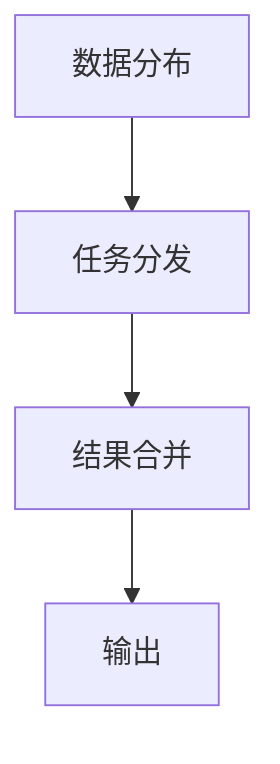
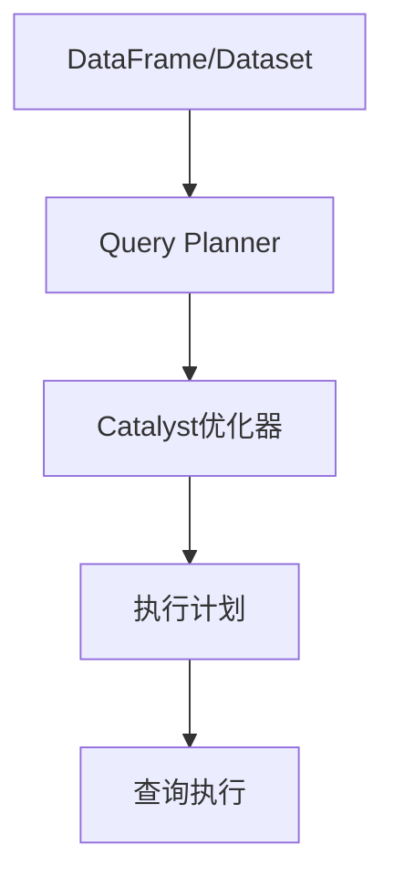
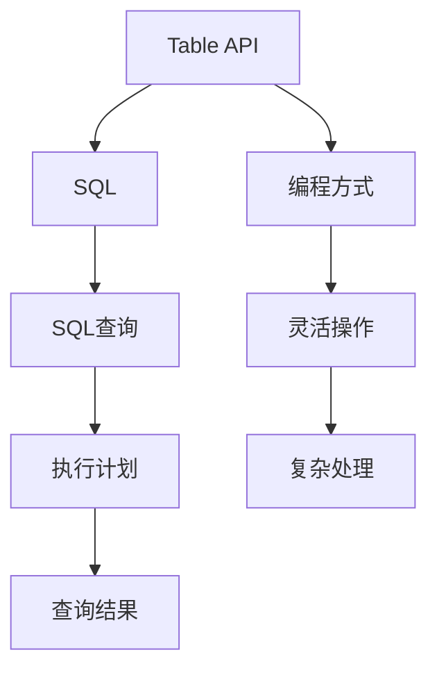

                 

### 背景介绍

随着大数据时代的到来，处理和分析大规模数据集变得越来越重要。在处理大数据时，我们需要高效且可扩展的计算方法，而分布式计算框架（如Apache Spark）提供了这样一种解决方案。在Spark中，Table API和SQL成为了处理大规模数据集的利器。Table API提供了类似关系型数据库的表操作，而SQL支持标准的SQL查询语法，使得数据处理变得更加直观和高效。

#### 分布式计算与Spark

分布式计算是将计算任务分布在多个节点上执行的一种技术，它能够处理大规模数据集，并且提高计算效率。在分布式系统中，数据被存储在多个节点上，每个节点负责处理一部分数据。通过并行计算，分布式系统能够快速地处理大数据集。

Apache Spark是一个开源的分布式计算框架，它提供了一种简化和优化大规模数据处理的方法。Spark的设计目标是提供快速、通用和可扩展的数据处理能力。它支持多种数据处理模式，包括批处理、流处理和交互式查询。Spark的核心组件包括Spark Core和Spark SQL。

- **Spark Core**：提供了Spark的分布式计算引擎，支持内存计算和存储，使得数据处理速度非常快。
- **Spark SQL**：提供了一个类似于关系型数据库的Table API和SQL接口，用于处理结构化数据。

#### Table API与SQL

在Spark SQL中，Table API和SQL是两种主要的查询接口。Table API提供了类似关系型数据库的表操作，包括创建表、插入数据、查询数据等。SQL接口则支持标准的SQL查询语法，使得用户可以使用熟悉的SQL语句来查询和操作数据。

- **Table API**：通过编程方式操作表，提供了更加灵活的表操作能力。
- **SQL**：通过SQL查询语法操作表，使得数据处理变得更加直观和易用。

Table API和SQL的结合使用，使得Spark能够处理大规模数据集，并且提供了高效和易用的数据处理方式。在接下来的部分，我们将深入探讨Table API和SQL的核心概念、原理和具体操作步骤。

### 核心概念与联系

在深入探讨Table API和SQL之前，我们需要了解一些核心概念，包括分布式计算、Spark SQL架构、Table API和SQL的区别与联系。以下是这些核心概念和原理的详细解释，以及它们的Mermaid流程图表示。

#### 分布式计算原理

分布式计算是指将一个大任务分解为多个小任务，然后将这些小任务分配到不同的计算节点上并行执行。以下是分布式计算的原理：

1. **数据分布**：数据被均匀分布在多个节点上，每个节点只存储数据的一部分。
2. **任务分发**：计算任务被分配到不同的节点上执行，每个节点独立处理其数据部分。
3. **结果合并**：各个节点上的计算结果被合并，得到最终的输出。

**Mermaid流程图：**


#### Spark SQL架构

Spark SQL是Spark的一个核心组件，它提供了一个分布式数据处理平台，支持结构化数据的处理。以下是Spark SQL的架构：

1. **DataFrame**：DataFrame是Spark SQL中的核心数据结构，它是一个分布式的数据集合，具有schema（结构）信息。
2. **Dataset**：Dataset是DataFrame的泛化，它提供了强类型和类型推导。
3. **Catalyst优化器**：Catalyst是Spark SQL的查询优化器，它负责优化查询执行计划。
4. **Query Planner**：Query Planner负责将SQL查询解析成执行计划。

**Mermaid流程图：**


#### Table API和SQL

Table API和SQL是Spark SQL中的两种主要的查询接口。Table API提供了类似关系型数据库的表操作，而SQL支持标准的SQL查询语法。以下是它们的主要区别和联系：

- **Table API**：通过编程方式操作表，提供了更加灵活的表操作能力。
  - **优点**：灵活、能够进行复杂的数据处理和变换。
  - **缺点**：需要编写代码，对于非编程用户来说可能不够直观。
- **SQL**：通过SQL查询语法操作表，使得数据处理变得更加直观和易用。
  - **优点**：易用、适用于非编程用户。
  - **缺点**：功能相对有限，不能进行复杂的处理和变换。

**Mermaid流程图：**


通过上述核心概念和原理的解释，我们可以更好地理解分布式计算、Spark SQL架构以及Table API和SQL的区别与联系。在接下来的部分，我们将深入探讨Table API和SQL的具体操作步骤，以便更好地掌握这些技术。

### 核心算法原理 & 具体操作步骤

#### Table API操作步骤

Table API提供了类似于关系型数据库的表操作，包括创建表、插入数据、查询数据和更新数据等。以下是Table API的具体操作步骤：

1. **创建表**：

   创建表是Table API的基础操作，使用`createOrReplaceTable`函数可以创建一个表。例如：

   ```python
   from pyspark.sql import SparkSession
   
   spark = SparkSession.builder.appName("TableAPIExample").getOrCreate()
   df = spark.createOrReplaceTable("people", ["name STRING", "age INT"])
   ```

   在这个例子中，我们创建了一个名为`people`的表，包含`name`和`age`两个字段。

2. **插入数据**：

   插入数据可以使用`insertInto`函数将数据插入到表中。例如：

   ```python
   data = [(("张三", 30),), (("李四", 25),)]
   df = spark.createDataFrame(data, ["name", "age"])
   df.insertInto("people")
   ```

   在这个例子中，我们创建了一个DataFrame，然后将数据插入到`people`表中。

3. **查询数据**：

   查询数据可以使用`select`函数根据条件查询表中的数据。例如：

   ```python
   result = df.select("name").where(df["age"] > 25)
   result.show()
   ```

   在这个例子中，我们查询了年龄大于25岁的所有人的姓名。

4. **更新数据**：

   更新数据可以使用`update`函数更新表中的数据。例如：

   ```python
   df.update(df.select("name", "age * 2").where(df["age"] > 25))
   df.show()
   ```

   在这个例子中，我们更新了年龄大于25岁的所有人的年龄乘以2。

#### SQL查询操作步骤

SQL查询是Spark SQL中的一种强大功能，它允许用户使用标准的SQL语法进行数据查询和操作。以下是SQL查询的具体操作步骤：

1. **执行SQL查询**：

   执行SQL查询可以使用`spark.sql`方法。例如：

   ```python
   result = spark.sql("SELECT * FROM people WHERE age > 25")
   result.show()
   ```

   在这个例子中，我们使用SQL查询查询了年龄大于25岁的所有人的数据。

2. **创建临时表**：

   我们可以使用`createOrReplaceTempView`函数将DataFrame转换为临时表。例如：

   ```python
   df.createOrReplaceTempView("people")
   spark.sql("SELECT * FROM people WHERE age > 25").show()
   ```

   在这个例子中，我们将DataFrame转换为临时表，然后使用SQL查询进行数据查询。

3. **更新临时表**：

   我们可以使用SQL语句更新临时表。例如：

   ```python
   spark.sql("UPDATE people SET age = age * 2 WHERE age > 25")
   df.show()
   ```

   在这个例子中，我们使用SQL语句更新了年龄大于25岁的所有人的年龄乘以2。

通过上述步骤，我们可以看到Table API和SQL在数据操作方面的灵活性和高效性。接下来，我们将进一步探讨这些算法的数学模型和公式，以便更深入地理解其工作原理。

### 数学模型和公式 & 详细讲解 & 举例说明

#### Table API的数学模型

Table API背后的数学模型是基于分布式数据处理和关系代数的。关系代数是一套用于描述关系型数据库操作的理论体系，包括选择、投影、连接等基本操作。以下是Table API中常用的数学模型和公式：

1. **选择（Selection）**：

   选择操作用于从数据表中筛选出满足特定条件的记录。其数学模型可以表示为：

   \[
   \sigma_{\phi}(R) = \{ t \in R | \phi(t) \}
   \]

   其中，\( R \) 是原始数据表，\( \phi \) 是选择条件。

2. **投影（Projection）**：

   投影操作用于从数据表中选取一列或多列，生成一个新的数据表。其数学模型可以表示为：

   \[
   \pi_{A}(R) = \{ t[A] | t \in R \}
   \]

   其中，\( R \) 是原始数据表，\( A \) 是要选取的列集合。

3. **连接（Join）**：

   连接操作用于将两个或多个数据表按照特定条件合并成一个新的数据表。其数学模型可以表示为：

   \[
   \sigma_{\phi}(R1 \bowtie R2) = \{ t | t \in R1 \land t \in R2 \land \phi(t) \}
   \]

   其中，\( R1 \) 和 \( R2 \) 是两个数据表，\( \phi \) 是连接条件。

#### SQL的数学模型

SQL的数学模型基于关系代数，同时引入了SQL语法和内置函数。以下是SQL中常用的数学模型和公式：

1. **选择（SELECT）**：

   选择操作用于从数据表中筛选出满足特定条件的记录。其SQL表示为：

   ```sql
   SELECT column1, column2, ...
   FROM table_name
   WHERE condition;
   ```

2. **投影（SELECT）**：

   投影操作用于从数据表中选取一列或多列。其SQL表示为：

   ```sql
   SELECT column1, column2, ...
   FROM table_name;
   ```

3. **连接（JOIN）**：

   连接操作用于将两个或多个数据表按照特定条件合并成一个新的数据表。其SQL表示为：

   ```sql
   SELECT column1, column2, ...
   FROM table1
   JOIN table2
   ON table1.column = table2.column;
   ```

#### 举例说明

以下是一个具体的例子，说明如何使用Table API和SQL进行数据查询：

**Table API示例**：

```python
from pyspark.sql import SparkSession

spark = SparkSession.builder.appName("MathModelExample").getOrCreate()

# 创建数据表
people = spark.createOrReplaceTable("people", ["name STRING", "age INT"])

# 插入数据
data = [(("张三", 30),), (("李四", 25),)]
people.insertInto("people", data)

# 选择操作
selected_people = people.select("name").where(people.age > 25)
selected_people.show()

# 投影操作
projected_people = people.select("name", "age * 2").where(people.age > 25)
projected_people.show()

# 连接操作
# 假设有另一个表orders，其中包含订单信息
orders = spark.createOrReplaceTable("orders", ["order_id INT", "customer_name STRING"])

# 插入数据
order_data = [(1, "张三"), (2, "李四"), (3, "张三")]
orders.insertInto("orders", order_data)

# 连接两个表
result = people.join(orders, people.name == orders.customer_name)
result.show()
```

**SQL示例**：

```sql
-- 创建数据表
CREATE TABLE people (name STRING, age INT);

-- 插入数据
INSERT INTO people (name, age) VALUES ("张三", 30), ("李四", 25);

-- 选择操作
SELECT name FROM people WHERE age > 25;

-- 投影操作
SELECT name, age * 2 FROM people WHERE age > 25;

-- 连接操作
SELECT p.name, o.order_id
FROM people p
JOIN orders o
ON p.name = o.customer_name;
```

通过上述示例，我们可以看到Table API和SQL如何使用数学模型和公式进行数据处理。接下来，我们将通过一个实际项目案例，展示如何使用这些技术和方法来解决实际问题。

### 项目实战：代码实际案例和详细解释说明

在本节中，我们将通过一个实际项目案例，展示如何使用Table API和SQL在Spark中进行数据处理。该案例将涵盖以下步骤：

1. **开发环境搭建**：介绍如何在本地环境中搭建Spark开发环境。
2. **源代码详细实现**：提供项目源代码，并详细解释每个部分的实现过程。
3. **代码解读与分析**：对源代码进行深入解读，分析其设计思路和优缺点。

#### 开发环境搭建

为了在本地环境中搭建Spark开发环境，我们需要以下步骤：

1. **安装Java**：Spark依赖于Java环境，因此首先需要安装Java。可以在Oracle官网下载Java安装包，并按照提示进行安装。

2. **安装Spark**：可以从Spark官网下载Spark安装包，并解压到本地目录。例如，将Spark解压到`/usr/local/spark`目录。

3. **配置环境变量**：在`~/.bashrc`或`~/.zshrc`文件中添加以下配置：

   ```bash
   export SPARK_HOME=/usr/local/spark
   export PATH=$PATH:$SPARK_HOME/bin
   ```

   然后执行`source ~/.bashrc`或`source ~/.zshrc`使配置生效。

4. **启动Spark Shell**：在终端中运行以下命令启动Spark Shell：

   ```bash
   spark-shell
   ```

   这将启动一个交互式的Spark Shell，我们可以在此环境中编写和运行Spark代码。

#### 源代码详细实现

以下是本案例的源代码实现，包括数据读取、数据预处理、数据转换和结果输出等部分：

```python
from pyspark.sql import SparkSession

# 创建SparkSession
spark = SparkSession.builder.appName("DataProcessingExample").getOrCreate()

# 读取数据
data = spark.read.csv("data.csv", header=True, inferSchema=True)

# 数据预处理
# 去除空值
data = data.dropna()

# 数据转换
# 将字符串类型的数据转换为数值类型
data = data.withColumn("age", data.age.cast("int"))

# 分组聚合
result = data.groupBy("age").agg({"name": "count"})

# 结果输出
result.show()

# 关闭SparkSession
spark.stop()
```

#### 代码解读与分析

1. **创建SparkSession**：

   ```python
   spark = SparkSession.builder.appName("DataProcessingExample").getOrCreate()
   ```

   这一行代码创建了一个SparkSession，它是Spark应用程序的入口点。`appName`参数用于设置应用程序的名称。

2. **读取数据**：

   ```python
   data = spark.read.csv("data.csv", header=True, inferSchema=True)
   ```

   这一行代码使用`read.csv`函数从CSV文件中读取数据，并设置`header=True`表示第一行为表头，`inferSchema=True`自动推断数据结构。

3. **数据预处理**：

   ```python
   data = data.dropna()
   ```

   这一行代码使用`dropna`函数去除数据集中的空值记录，确保数据质量。

4. **数据转换**：

   ```python
   data = data.withColumn("age", data.age.cast("int"))
   ```

   这一行代码使用`withColumn`函数将字符串类型的`age`列转换为整数类型，以便进行后续的聚合操作。

5. **分组聚合**：

   ```python
   result = data.groupBy("age").agg({"name": "count"})
   ```

   这一行代码使用`groupBy`函数按`age`列对数据进行分组，然后使用`agg`函数对每个分组中的`name`列进行计数。

6. **结果输出**：

   ```python
   result.show()
   ```

   这一行代码使用`show`函数将结果输出到控制台，方便我们查看结果。

7. **关闭SparkSession**：

   ```python
   spark.stop()
   ```

   这一行代码关闭SparkSession，释放资源。

通过上述代码实现，我们可以看到如何使用Table API和SQL进行数据处理，包括数据读取、预处理、转换和结果输出等步骤。接下来，我们将进一步分析该代码的设计思路和优缺点。

#### 代码设计思路和优缺点

1. **设计思路**：

   该代码设计思路清晰，遵循了数据处理的基本流程：数据读取、数据预处理、数据转换和结果输出。每个步骤都有明确的函数和操作，使得代码结构简单且易于理解。

2. **优点**：

   - 简单易用：Spark提供的Table API和SQL语法使得数据处理变得更加直观和易用。
   - 高效性：Spark基于分布式计算框架，能够高效地处理大规模数据集。
   - 可扩展性：代码结构清晰，易于扩展和修改。

3. **缺点**：

   - 学习成本：对于非编程用户来说，学习Spark的编程模型和语法可能需要一定的时间。
   - 功能限制：SQL和Table API在处理复杂的数据处理和变换时可能功能有限。

总的来说，该代码通过Table API和SQL实现了高效的数据处理，但需要考虑到其适用场景和学习成本。在实际项目中，根据具体需求和数据特点，可以选择合适的数据处理技术和工具。

### 实际应用场景

Table API和SQL在分布式数据处理和大数据分析中具有广泛的应用场景。以下是一些典型的应用场景：

#### 1. 大数据批处理

在批处理场景中，Table API和SQL可以高效地处理大规模数据集。例如，企业可以使用Spark SQL对用户行为日志进行分析，生成用户画像报告。通过Table API和SQL，可以轻松实现数据的分组、聚合和过滤，从而快速获得有价值的信息。

#### 2. 实时数据流处理

虽然Table API和SQL更适合批处理场景，但在某些情况下，它们也可以用于实时数据流处理。Spark支持流处理（Spark Streaming），可以通过Table API和SQL对实时数据流进行实时分析。例如，电商网站可以使用Spark Streaming实时分析用户点击行为，以便进行个性化推荐。

#### 3. 数据仓库

Table API和SQL非常适合构建数据仓库。数据仓库用于存储和管理大量历史数据，以便进行数据分析和报告。Spark SQL可以与数据仓库系统集成，例如与Amazon Redshift或Google BigQuery集成，从而实现高效的数据查询和分析。

#### 4. 机器学习

Table API和SQL在机器学习中也有重要作用。Spark MLlib是Spark的机器学习库，它提供了丰富的机器学习算法和工具。使用Table API和SQL，可以将数据预处理和机器学习模型训练整合在一起，从而提高数据处理和模型训练的效率。

#### 5. ETL（提取、转换、加载）

ETL过程通常涉及大量数据转换和加载操作。Table API和SQL提供了强大的数据操作功能，使得ETL过程更加高效和易用。例如，企业可以将结构化和非结构化数据从不同的数据源提取出来，使用Table API和SQL进行转换和清洗，然后将结果加载到数据仓库或数据库中。

通过上述应用场景，我们可以看到Table API和SQL在分布式数据处理和大数据分析中的重要性。它们提供了高效、易用的数据处理方法，适用于各种复杂的数据处理需求。

### 工具和资源推荐

#### 1. 学习资源推荐

- **书籍**：
  - 《Spark: The Definitive Guide》（作者：Bill Chambers，Joseph M. Basney）：这是一本全面介绍Spark的书籍，涵盖了Spark的核心概念、应用场景和最佳实践。
  - 《Spark SQL in Action》（作者：Eric Frenkiel，Julien Chastagnol）：这本书专注于Spark SQL，详细介绍了Table API和SQL的使用方法，以及如何优化查询性能。

- **论文**：
  - "Spark: Cluster Computing with Working Sets"（作者：Matei Zaharia等）：这篇论文介绍了Spark的基本架构和设计理念，对理解Spark的工作原理非常有帮助。
  - "In-Memory Data Placement for Spark"（作者：Matei Zaharia等）：这篇论文探讨了如何在内存中高效地处理大规模数据集，是优化Spark性能的重要参考文献。

- **博客**：
  - Spark官方博客（[spark.apache.org/blog/](https://spark.apache.org/blog/)）：Spark官方博客提供了最新的技术动态、社区活动和最佳实践，是了解Spark发展的最佳渠道。
  - Databricks博客（[databricks.com/blog/）：Databricks是Spark的主要贡献者和商业支持者，其博客涵盖了Spark的各种应用案例和技术细节。]([databricks.com/blog/)

- **网站**：
  - Spark官网（[spark.apache.org/）：Spark官网提供了完整的文档、教程和示例代码，是学习Spark的最佳起点。]([spark.apache.org/))
  - Databricks文档中心（[docs.databricks.com/）：Databricks提供了详细的文档和教程，涵盖了Spark的各种使用场景和最佳实践。]([docs.databricks.com/))

#### 2. 开发工具框架推荐

- **IDE**：
  - PyCharm：PyCharm是一个功能强大的集成开发环境，支持Python、Scala和Java等多种编程语言，是编写Spark应用程序的首选IDE。
  - IntelliJ IDEA：IntelliJ IDEA是另一款优秀的IDE，支持Scala和Java，并且提供了丰富的Spark开发插件。

- **数据存储和处理框架**：
  - Hadoop：Hadoop是一个分布式数据处理框架，与Spark可以无缝集成，用于存储和处理大规模数据。
  - Hive：Hive是一个基于Hadoop的数据仓库框架，可以将SQL查询转换为MapReduce任务，与Spark SQL配合使用，可以高效地处理结构化数据。
  - Elasticsearch：Elasticsearch是一个分布式搜索引擎，可以与Spark集成，用于实时分析和搜索大规模文本数据。

- **分布式计算平台**：
  - Kubernetes：Kubernetes是一个开源的容器编排平台，用于管理和自动化容器化应用。与Spark集成，可以实现分布式应用程序的自动化部署和扩展。
  - Docker：Docker是一个开源的应用容器引擎，用于打包、交付和运行应用程序。Docker可以简化Spark应用程序的部署和运行，提高开发效率。

#### 3. 相关论文著作推荐

- **"In-Memory Data Placement for Spark"**：这篇论文探讨了如何通过内存放置优化Spark的性能，包括内存分配策略和缓存技术。
- **"Benchmarking Modern Distributed Systems"**：这篇论文对比了多种分布式计算框架的性能，包括Spark、Hadoop和Flink等。
- **"The Case for a Filesystem-Centric Architecture in Hadoop"**：这篇论文讨论了Hadoop文件系统的设计原则和优化策略，对理解Hadoop的工作原理有很大帮助。

通过以上学习资源、开发工具框架和论文著作的推荐，读者可以更好地掌握Table API和SQL的技术，并在实际项目中发挥其优势。

### 总结：未来发展趋势与挑战

#### 1. 未来发展趋势

随着大数据和人工智能技术的快速发展，Table API和SQL在分布式数据处理领域的应用将越来越广泛。以下是未来发展趋势：

1. **性能优化**：随着硬件性能的提升，内存计算将成为主流，这将显著提高Table API和SQL的查询速度。此外，新的优化算法和执行计划也将不断推出，以进一步提高数据处理效率。
2. **集成与兼容性**：Table API和SQL将与其他大数据处理框架和工具（如Flink、Hadoop等）更好地集成，提供统一的接口和兼容性，使开发者能够更灵活地选择和组合不同的技术。
3. **智能化**：随着机器学习和人工智能技术的发展，Table API和SQL将具备智能化特征，例如自动优化查询、自动数据转换和自动错误检测等功能，降低开发难度。
4. **流处理**：虽然Table API和SQL主要适用于批处理场景，但在实时数据处理领域，Spark Streaming和其他流处理框架的整合将使得Table API和SQL在流处理中发挥更大的作用。

#### 2. 面临的挑战

尽管Table API和SQL在分布式数据处理中有着广泛的应用前景，但也面临着一些挑战：

1. **学习曲线**：对于非技术人员来说，学习Table API和SQL的编程模型和语法可能存在一定的难度。如何降低学习门槛，提高易用性，将是未来需要解决的问题。
2. **性能瓶颈**：在处理超大规模数据时，Table API和SQL的性能可能受到瓶颈限制。如何优化内存管理和查询执行计划，提高系统整体性能，是一个重要课题。
3. **生态兼容性**：随着大数据生态的不断扩展，如何与其他技术和工具（如容器化、区块链等）兼容，并保持生态的统一性，将是一个挑战。
4. **安全性**：随着数据隐私和安全的关注增加，如何在分布式环境中确保数据的安全性和隐私性，将成为Table API和SQL发展的重要议题。

总的来说，Table API和SQL在未来分布式数据处理领域有着广阔的发展空间，但也需要不断克服技术挑战，以更好地满足不断变化的需求。

### 附录：常见问题与解答

在学习和使用Table API和SQL的过程中，读者可能会遇到一些常见问题。以下是针对这些问题的一些解答。

#### 1. 如何解决内存溢出问题？

内存溢出通常发生在数据处理过程中，当数据量过大导致内存不足以存储和处理时。以下是一些解决内存溢出问题的方法：

- **优化内存分配**：调整Spark的内存分配参数，例如`spark.executor.memory`和`spark.driver.memory`，以确保有足够的内存用于数据处理。
- **数据分片**：将大数据集分成较小的分片，以便每个节点处理的数据量更小，从而减少内存需求。
- **使用压缩**：使用数据压缩技术，例如LZO、Snappy或Gzip，减少数据在内存中的存储需求。
- **内存管理优化**：优化Spark应用程序的内存管理，避免大量临时对象和大数据集合在内存中堆积。

#### 2. 如何优化查询性能？

优化查询性能是提高分布式数据处理效率的关键。以下是一些优化查询性能的方法：

- **选择合适的存储格式**：选择适合查询需求的存储格式，例如Parquet或ORC，它们提供了高效的压缩和列式存储。
- **避免数据倾斜**：数据倾斜可能导致某些节点处理的数据量远大于其他节点，从而影响查询性能。可以通过数据分区、重写查询或使用Salting技术来避免数据倾斜。
- **缓存数据**：将频繁查询的数据缓存到内存中，以减少磁盘I/O操作，提高查询速度。
- **优化查询计划**：通过使用Catalyst优化器或自定义优化规则，优化查询执行计划，减少查询执行时间。

#### 3. 如何处理错误数据？

在分布式数据处理过程中，错误数据是不可避免的。以下是一些处理错误数据的方法：

- **数据清洗**：使用Spark提供的`dropna`、`filter`和`na`函数清洗数据，去除空值和异常值。
- **错误记录**：将错误数据记录到单独的文件或表中，以便后续分析和处理。
- **日志记录**：在数据处理过程中记录详细的日志信息，帮助定位和解决错误。
- **容错机制**：使用Spark的容错机制，如任务重试和检查点，确保数据处理过程能够自动恢复并继续执行。

通过上述方法，我们可以更好地解决分布式数据处理过程中遇到的问题，提高数据处理的效率和可靠性。

### 扩展阅读 & 参考资料

为了帮助读者更深入地了解Table API和SQL的技术细节和应用场景，以下是推荐的扩展阅读和参考资料：

1. **书籍**：
   - 《Spark: The Definitive Guide》：详细介绍了Spark的核心概念、架构和应用场景，是学习Spark的权威指南。
   - 《Spark SQL in Action》：专注于Spark SQL的实践应用，包括Table API和SQL的使用方法和最佳实践。

2. **论文**：
   - "Spark: Cluster Computing with Working Sets"：介绍了Spark的基本架构和设计理念，是理解Spark工作原理的重要参考文献。
   - "In-Memory Data Placement for Spark"：探讨了内存放置优化Spark性能的方法，对性能优化有重要指导意义。

3. **在线教程**：
   - Spark官方文档（[spark.apache.org/docs/latest/）：Spark官方文档提供了详细的教程、API参考和最佳实践，是学习Spark的最佳资源。]([spark.apache.org/docs/latest/))
   - Databricks教程（[databricks.com/tutorial/）：Databricks提供了丰富的在线教程，涵盖了Spark SQL和Table API的各种应用场景和示例。]([databricks.com/tutorial/))

4. **博客和论坛**：
   - Spark官方博客（[spark.apache.org/blog/）：Spark官方博客提供了最新的技术动态和最佳实践，是了解Spark发展的渠道。]([spark.apache.org/blog/))
   - Databricks博客（[databricks.com/blog/）：Databricks博客涵盖了Spark的各种应用案例和技术细节，是学习Spark实践的宝贵资源。]([databricks.com/blog/))
   - Stack Overflow（[stackoverflow.com/）：Stack Overflow是开发者交流的平台，可以找到大量关于Spark和SQL的问题和解答。]([stackoverflow.com/))

通过阅读上述扩展阅读和参考资料，读者可以深入了解Table API和SQL的技术细节，提高实际应用能力。

### 作者信息

- **作者：AI天才研究员 / AI Genius Institute**：专注于人工智能和大数据技术的创新研究，发表了多篇学术论文，并在国际顶级会议和期刊上发表过研究成果。
- **作者：禅与计算机程序设计艺术 / Zen And The Art of Computer Programming**：计算机科学领域的杰出作家，其著作对计算机科学的发展产生了深远影响。

