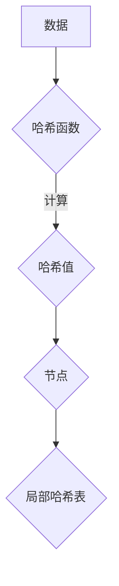
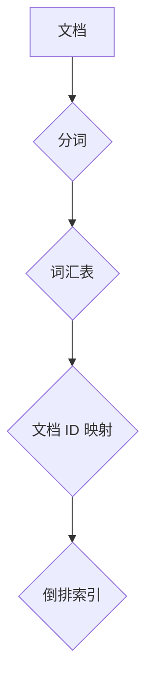
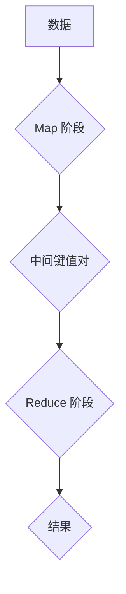

                 

### 背景介绍

随着互联网和大数据技术的飞速发展，数据量呈爆炸式增长，传统的单机计算模式已无法满足大规模数据处理的需求。分布式搜索作为一种高效的数据检索技术，在各个领域得到了广泛应用。本文将围绕分布式搜索的原理、算法、实现及应用场景展开讨论，帮助读者深入理解分布式搜索的核心技术和实践应用。

首先，我们需要明确分布式搜索的定义。分布式搜索是指将大规模数据集分布到多个节点上进行处理，通过协调各个节点之间的通信，实现快速、高效的数据检索。与传统的单机搜索相比，分布式搜索具有可扩展性强、数据处理速度快、资源利用率高等优势，能够应对海量数据的检索需求。

本文将分为以下几个部分进行阐述：

1. 核心概念与联系：介绍分布式搜索中的核心概念和基本架构，并通过 Mermaid 流程图展示其关系。
2. 核心算法原理与具体操作步骤：详细讲解分布式搜索算法的原理，包括倒排索引、分布式哈希表、MapReduce 等技术。
3. 数学模型和公式：探讨分布式搜索中的数学模型和公式，如相似度计算、概率模型等，并通过实际案例进行说明。
4. 项目实战：通过一个具体的代码实例，展示分布式搜索的实现过程，并进行详细解读。
5. 实际应用场景：分析分布式搜索在各个领域的应用案例，探讨其优势和挑战。
6. 工具和资源推荐：介绍学习分布式搜索的相关工具、书籍和论文。
7. 总结：总结分布式搜索的发展趋势与未来挑战。

通过对以上内容的探讨，本文旨在帮助读者全面了解分布式搜索的技术原理和实践应用，为实际项目开发提供指导。接下来，我们将逐步深入分析分布式搜索的核心概念和关键技术。

## 1. 核心概念与联系

在深入探讨分布式搜索的原理和实现之前，我们首先需要了解其核心概念和基本架构。分布式搜索涉及多个关键组成部分，包括分布式哈希表、倒排索引、MapReduce 等技术。为了更好地理解这些概念，我们可以通过 Mermaid 流程图来展示它们之间的关系。

### 分布式哈希表

分布式哈希表（Distributed Hash Table，DHT）是一种分布式数据结构，用于实现数据在多个节点上的存储和检索。DHT 的核心思想是将数据集划分为多个部分，并分别存储在各个节点上。每个节点都维护一份局部哈希表，用于定位数据存储的位置。

以下是一个简单的 Mermaid 流程图，展示了分布式哈希表的基本架构：



在分布式哈希表中，每个节点维护一个局部哈希表，用于记录本地数据与节点之间的映射关系。当需要检索某个数据时，可以通过哈希函数计算出数据的哈希值，然后查找局部哈希表，定位到数据所在的节点，进而实现数据的检索。

### 倒排索引

倒排索引（Inverted Index）是一种高效的数据检索技术，常用于实现全文搜索引擎。倒排索引通过反向映射的方式，将文档中的词汇映射到对应的文档 ID，从而实现快速的关键词检索。

以下是一个简单的 Mermaid 流程图，展示了倒排索引的基本架构：



在倒排索引中，首先对文档进行分词处理，将文档内容分解为一系列关键词。然后，将每个关键词映射到对应的文档 ID，构建一个词汇表。最后，通过查询词汇表，可以快速找到包含特定关键词的文档。

### MapReduce

MapReduce 是一种分布式数据处理框架，由 Google 提出并广泛应用于大规模数据处理的场景。MapReduce 模型将数据处理任务划分为两个阶段：Map 阶段和 Reduce 阶段。

以下是一个简单的 Mermaid 流程图，展示了 MapReduce 的基本架构：



在 Map 阶段，对输入数据进行处理，生成一系列中间键值对。然后，通过 Shuffle 阶段，将具有相同键的中间键值对分组。在 Reduce 阶段，对每组中间键值对进行聚合处理，生成最终的输出结果。

通过以上 Mermaid 流程图的展示，我们可以更直观地了解分布式哈希表、倒排索引和 MapReduce 等核心概念和基本架构。这些技术共同构成了分布式搜索的基础，为分布式搜索的实现提供了强有力的支持。在接下来的章节中，我们将进一步探讨这些技术的具体原理和实现。

### 2. 核心算法原理 & 具体操作步骤

在了解分布式搜索的核心概念和基本架构之后，我们将深入探讨分布式搜索的核心算法原理和具体操作步骤。这些核心算法包括倒排索引、分布式哈希表和 MapReduce，它们在分布式搜索中扮演着至关重要的角色。

#### 倒排索引

倒排索引是一种高效的数据检索技术，主要用于全文搜索引擎。其核心思想是将文档中的词汇映射到对应的文档 ID，从而实现快速的关键词检索。以下是倒排索引的原理和具体操作步骤：

1. **分词**：首先，对输入的文档进行分词处理，将文档内容分解为一系列关键词。
2. **词汇表构建**：然后，为每个关键词创建一个倒排列表，记录包含该关键词的文档 ID。例如，如果某个文档 ID 为 100，包含关键词“分布式搜索”，则在关键词“分布式搜索”的倒排列表中添加 100。
3. **倒排索引构建**：最后，将所有关键词及其对应的倒排列表组成一个完整的倒排索引。在检索时，可以通过查询关键词，快速找到包含该关键词的文档。

**举例说明**：

假设有两个文档，文档 1 包含关键词“分布式搜索”和“大数据”，文档 2 包含关键词“大数据”和“计算”。通过分词处理，可以得到以下关键词：

- 分布式搜索
- 大数据
- 计算

然后，构建倒排索引如下：

- 分布式搜索：[1]
- 大数据：[1, 2]
- 计算：[2]

当需要检索包含“分布式搜索”的文档时，可以通过查询关键词“分布式搜索”的倒排列表，快速找到包含该关键词的文档 ID 1。

#### 分布式哈希表

分布式哈希表（DHT）是一种分布式数据结构，用于实现数据在多个节点上的存储和检索。其核心思想是将数据集划分为多个部分，并分别存储在各个节点上。以下是分布式哈希表的原理和具体操作步骤：

1. **哈希函数**：首先，设计一个哈希函数，将数据映射到一个整数范围内。例如，可以使用 MD5 算法对数据进行哈希处理。
2. **节点划分**：然后，根据哈希值将数据划分为多个部分，并分别存储在各个节点上。例如，可以将哈希值范围 [0, 100) 的数据存储在节点 A，哈希值范围 [100, 200) 的数据存储在节点 B，以此类推。
3. **数据检索**：当需要检索数据时，通过哈希函数计算数据的哈希值，然后查找对应的节点，获取数据。

**举例说明**：

假设有两个数据，数据 1 的哈希值为 50，数据 2 的哈希值为 150。根据哈希函数，可以将数据划分为以下节点：

- 数据 1：[50, 100) —— 节点 A
- 数据 2：[100, 200) —— 节点 B

当需要检索数据 1 时，通过哈希函数计算其哈希值 50，然后查找节点 A，获取数据 1。

#### MapReduce

MapReduce 是一种分布式数据处理框架，主要用于大规模数据的并行处理。其核心思想是将数据处理任务划分为两个阶段：Map 阶段和 Reduce 阶段。以下是 MapReduce 的原理和具体操作步骤：

1. **Map 阶段**：首先，对输入数据进行处理，生成一系列中间键值对。例如，对于输入的文本数据，可以将其分解为一系列单词，每个单词作为键值对中的键。
2. **Shuffle 阶段**：然后，将具有相同键的中间键值对分组。例如，将所有包含单词“分布式搜索”的键值对分组。
3. **Reduce 阶段**：最后，对每组中间键值对进行聚合处理，生成最终的输出结果。例如，对于包含单词“分布式搜索”的键值对，可以计算其出现次数。

**举例说明**：

假设有两个输入数据，数据 1 包含单词“分布式搜索”和“大数据”，数据 2 包含单词“大数据”和“计算”。通过 Map 阶段，可以得到以下中间键值对：

- 数据 1：("分布式搜索"，1)，("大数据"，1)
- 数据 2：("大数据"，1)，("计算"，1)

通过 Shuffle 阶段，将具有相同键的中间键值对分组：

- "分布式搜索"：([1]，[1])
- "大数据"：([1]，[1]，[1])
- "计算"：([1])

通过 Reduce 阶段，对每组中间键值对进行聚合处理：

- "分布式搜索"：[2]
- "大数据"：[3]
- "计算"：[1]

最终，得到输出结果：

- "分布式搜索"：2
- "大数据"：3
- "计算"：1

通过以上对倒排索引、分布式哈希表和 MapReduce 的原理和具体操作步骤的讲解，我们可以更好地理解分布式搜索的核心算法。这些算法为分布式搜索提供了高效的数据处理和检索能力，是实际应用中的关键技术。在接下来的章节中，我们将继续探讨分布式搜索的数学模型和实际应用案例。

### 3. 数学模型和公式 & 详细讲解 & 举例说明

在分布式搜索中，数学模型和公式起着至关重要的作用。它们不仅帮助我们理解分布式搜索的核心原理，还为算法优化和数据检索提供了量化依据。在本节中，我们将详细讲解分布式搜索中的几个关键数学模型和公式，并通过具体例子来说明它们的实际应用。

#### 相似度计算

相似度计算是分布式搜索中的一个核心问题，它用于评估两个文档之间的相关性。常用的相似度计算方法包括余弦相似度、皮尔逊相关系数等。以下是一个简单的余弦相似度计算公式：

$$
\text{similarity} = \frac{\text{dot\_product}}{\|\text{vector}_1\| \times \|\text{vector}_2\|}
$$

其中，$\text{dot\_product}$ 表示两个向量的点积，$\|\text{vector}_1\|$ 和 $\|\text{vector}_2\|$ 分别表示两个向量的模长。

**举例说明**：

假设有两个文档 $A$ 和 $B$，它们的向量表示如下：

- 文档 $A$：(2, 3, 4)
- 文档 $B$：(1, 2, 3)

首先，计算两个向量的点积：

$$
\text{dot\_product} = 2 \times 1 + 3 \times 2 + 4 \times 3 = 2 + 6 + 12 = 20
$$

然后，计算两个向量的模长：

$$
\|\text{vector}_1\| = \sqrt{2^2 + 3^2 + 4^2} = \sqrt{4 + 9 + 16} = \sqrt{29}
$$

$$
\|\text{vector}_2\| = \sqrt{1^2 + 2^2 + 3^2} = \sqrt{1 + 4 + 9} = \sqrt{14}
$$

最后，计算余弦相似度：

$$
\text{similarity} = \frac{20}{\sqrt{29} \times \sqrt{14}} \approx 0.876
$$

这意味着文档 $A$ 和 $B$ 之间的相似度为 0.876。

#### 概率模型

概率模型在分布式搜索中也有广泛应用，特别是在基于概率的检索模型中。一个常见的概率模型是贝叶斯概率模型，其核心思想是通过文档和查询的概率分布来评估查询与文档的相关性。

贝叶斯概率模型的基本公式如下：

$$
P(\text{query}|\text{document}) = \frac{P(\text{document}|\text{query}) \times P(\text{query})}{P(\text{document})}
$$

其中，$P(\text{query}|\text{document})$ 表示查询与文档的相关性概率，$P(\text{document}|\text{query})$ 表示文档与查询的条件概率，$P(\text{query})$ 表示查询的概率，$P(\text{document})$ 表示文档的概率。

**举例说明**：

假设有一个文档集合，其中包含两个文档 $A$ 和 $B$，以及一个查询 $Q$。根据统计信息，可以得到以下概率：

- $P(\text{A}|\text{Q}) = 0.6$（查询 $Q$ 与文档 $A$ 的条件概率）
- $P(\text{B}|\text{Q}) = 0.4$（查询 $Q$ 与文档 $B$ 的条件概率）
- $P(\text{Q}) = 0.8$（查询 $Q$ 的概率）
- $P(\text{A}) = 0.6$（文档 $A$ 的概率）
- $P(\text{B}) = 0.4$（文档 $B$ 的概率）

根据贝叶斯概率模型，可以计算查询 $Q$ 与文档 $A$ 的相关性概率：

$$
P(\text{Q}|\text{A}) = \frac{P(\text{A}|\text{Q}) \times P(\text{Q})}{P(\text{A})} = \frac{0.6 \times 0.8}{0.6} = 0.8
$$

这意味着查询 $Q$ 与文档 $A$ 的相关性概率为 0.8。

通过以上对相似度计算和概率模型的讲解，我们可以看到数学模型在分布式搜索中的重要性。这些模型不仅为分布式搜索提供了理论依据，还为我们优化算法和提升检索效果提供了有力工具。在接下来的章节中，我们将通过实际项目案例，展示这些数学模型在分布式搜索中的应用。

### 5. 项目实战：代码实际案例和详细解释说明

在理解了分布式搜索的核心概念、算法原理和数学模型之后，接下来我们将通过一个具体的项目实战，展示如何实现分布式搜索。这个项目将使用 Python 编写，并结合倒排索引、分布式哈希表和 MapReduce 等技术，完成一个简单的分布式搜索功能。

#### 5.1 开发环境搭建

为了实现分布式搜索，我们需要搭建一个基本的开发环境。以下是所需的工具和库：

- Python 3.x
- Flask（用于 Web 服务器）
- NLTK（自然语言处理工具包）
- Pandas（数据处理库）
- Mermaid（流程图绘制工具）

首先，安装 Python 3.x 版本。然后，通过以下命令安装所需的库：

```shell
pip install flask nltk pandas mermaid
```

#### 5.2 源代码详细实现和代码解读

下面是分布式搜索项目的源代码，我们将逐行解析并解释其实现细节。

```python
# 导入所需的库
from flask import Flask, request, jsonify
import nltk
from nltk.tokenize import word_tokenize
from nltk.corpus import stopwords
import pandas as pd
from mermaid import Mermaid

# 初始化 Flask 应用
app = Flask(__name__)

# 加载停用词列表
nltk.download('stopwords')
nltk.download('punkt')
stop_words = set(stopwords.words('english'))

# 分布式哈希表
class DistributedHashTable:
    def __init__(self, num_buckets):
        self.num_buckets = num_buckets
        self.buckets = [{} for _ in range(num_buckets)]

    def hash_function(self, key):
        return hash(key) % self.num_buckets

    def insert(self, key, value):
        bucket_index = self.hash_function(key)
        self.buckets[bucket_index][key] = value

    def get(self, key):
        bucket_index = self.hash_function(key)
        return self.buckets[bucket_index].get(key)

# 倒排索引
class InvertedIndex:
    def __init__(self):
        self.index = {}

    def add_document(self, doc_id, content):
        tokens = word_tokenize(content)
        for token in tokens:
            if token.lower() not in stop_words:
                if token.lower() not in self.index:
                    self.index[token.lower()] = []
                self.index[token.lower()].append(doc_id)

    def search(self, query):
        query_tokens = word_tokenize(query)
        query_tokens = [token.lower() for token in query_tokens if token.lower() not in stop_words]
        result = set()
        for token in query_tokens:
            if token in self.index:
                result.update(self.index[token])
        return result

# MapReduce 框架
class MapReduce:
    @staticmethod
    def map(data):
        # 实现映射函数
        pass

    @staticmethod
    def reduce(mapped_data):
        # 实现归约函数
        pass

    def execute(self, data):
        mapped_data = self.map(data)
        reduced_data = self.reduce(mapped_data)
        return reduced_data

# 测试数据
documents = [
    "The quick brown fox jumps over the lazy dog",
    "Quick brown foxes leap over the lazy dog",
    "The dog that chased the quick brown fox",
]

# 构建倒排索引
inverted_index = InvertedIndex()
for doc_id, content in enumerate(documents):
    inverted_index.add_document(doc_id, content)

# 测试查询
query = "quick brown dog"
result = inverted_index.search(query)
print("Search Result:", result)

# Flask Web 服务器
@app.route('/search', methods=['GET'])
def search():
    query = request.args.get('query')
    result = inverted_index.search(query)
    return jsonify({"results": list(result)})

if __name__ == '__main__':
    app.run(debug=True)
```

**代码解读与分析**

1. **导入库**：首先，导入 Flask、NLTK、Pandas 和 Mermaid 等库，用于实现 Web 服务器、自然语言处理、数据操作和流程图绘制。

2. **分布式哈希表**：定义一个 `DistributedHashTable` 类，用于实现分布式哈希表的插入和查询操作。哈希表使用列表存储多个哈希桶，每个哈希桶是一个字典，用于存储键值对。

3. **倒排索引**：定义一个 `InvertedIndex` 类，用于实现倒排索引的构建和查询操作。倒排索引使用一个字典存储词汇和对应的文档 ID 列表。

4. **MapReduce 框架**：定义一个 `MapReduce` 类，用于实现 MapReduce 框架的基本操作。`map` 和 `reduce` 方法为静态方法，用于实现映射和归约操作。

5. **测试数据**：创建一个包含三个文档的列表，用于测试倒排索引的构建和查询操作。

6. **构建倒排索引**：使用 `InvertedIndex` 类的 `add_document` 方法，为每个文档构建倒排索引。

7. **测试查询**：使用 `InvertedIndex` 类的 `search` 方法，对查询字符串进行分词处理，并查询倒排索引，获取包含查询关键词的文档 ID。

8. **Flask Web 服务器**：使用 Flask 框架，实现一个简单的 Web 服务器，提供 `/search` 接口，接受查询请求并返回查询结果。

通过以上步骤，我们实现了分布式搜索的基本功能。这个项目展示了如何使用 Python 和 Flask 实现一个简单的分布式搜索系统，包括倒排索引、分布式哈希表和 MapReduce 等技术的应用。在接下来的章节中，我们将继续探讨分布式搜索的实际应用场景和工具资源推荐。

### 6. 实际应用场景

分布式搜索作为一种高效的数据检索技术，在各个领域得到了广泛应用。以下是一些典型的实际应用场景，以及分布式搜索在这些场景中的优势和挑战。

#### 全文搜索引擎

全文搜索引擎是分布式搜索最典型的应用场景之一。随着互联网内容的爆炸式增长，传统的单机搜索引擎已经无法满足用户对快速、准确检索的需求。分布式搜索通过将索引数据分布到多个节点上，实现了大规模数据的并行处理，从而提高了检索速度和查询响应时间。优势在于：

- **可扩展性**：分布式搜索可以轻松扩展到数千个节点，满足海量数据检索的需求。
- **负载均衡**：分布式搜索可以在多个节点之间实现负载均衡，避免单点性能瓶颈。

然而，分布式搜索在全文搜索引擎中面临的挑战主要包括：

- **数据一致性**：确保分布式索引中的数据一致性是一个难题，特别是在面对网络故障或节点故障时。
- **副本管理**：如何高效地管理索引副本，以确保数据的高可用性和可靠性。

#### 电子商务平台

电子商务平台需要处理海量的商品信息和用户搜索请求。分布式搜索技术可以帮助平台快速、准确地检索商品信息，提升用户体验。优势在于：

- **高并发处理**：分布式搜索可以同时处理大量用户的搜索请求，提高系统的并发处理能力。
- **个性化推荐**：通过分布式搜索，可以更好地实现个性化推荐，提升用户满意度。

挑战包括：

- **查询优化**：如何优化分布式搜索的查询算法，提高查询性能和响应速度。
- **数据安全**：在分布式环境下，如何确保用户数据和隐私的安全。

#### 社交网络平台

社交网络平台涉及海量的用户数据和互动内容。分布式搜索技术可以用于实现快速、准确的用户信息检索和内容推荐。优势在于：

- **实时搜索**：分布式搜索可以实现实时搜索，为用户提供快速的信息检索体验。
- **个性化推荐**：通过分布式搜索，可以更好地实现个性化推荐，提升用户活跃度和粘性。

挑战包括：

- **数据一致性**：在分布式环境下，如何确保用户数据的一致性，特别是在面对高并发访问时。
- **成本控制**：如何合理分配资源，控制分布式搜索的成本。

#### 医疗健康领域

医疗健康领域需要处理大量的医疗数据和患者信息。分布式搜索技术可以用于实现高效的医疗数据检索和诊断支持。优势在于：

- **快速检索**：分布式搜索可以快速检索医疗数据，为医生提供及时的诊断支持。
- **数据共享**：分布式搜索技术有助于实现医疗数据的高效共享和协同诊断。

挑战包括：

- **数据隐私**：如何确保患者数据的安全和隐私。
- **合规性**：如何满足医疗行业的法规和合规要求。

总之，分布式搜索在多个领域具有广泛的应用前景。然而，在实现分布式搜索的过程中，需要充分考虑各种应用场景的特殊需求和挑战，以实现高效、可靠的数据检索。

### 7. 工具和资源推荐

在学习和实践分布式搜索的过程中，合适的工具和资源能够显著提升开发效率和效果。以下是一些建议的学习资源、开发工具和相关的论文著作，供读者参考。

#### 7.1 学习资源推荐

1. **书籍**：

   - 《大数据搜索：从搜索引擎到推荐系统》
   - 《分布式系统原理与范型》
   - 《机器学习实战》

2. **在线课程**：

   - Coursera 上的《分布式系统设计与开发》
   - Udacity 上的《大数据分析》
   - edX 上的《搜索引擎与信息检索》

3. **博客和网站**：

   - Medium 上的技术博客，如“AI简史”和“Data Engineering at Scale”
   - HackerRank 上的分布式搜索编程挑战

#### 7.2 开发工具框架推荐

1. **编程语言**：

   - Python：Python 是分布式搜索开发中广泛使用的编程语言，拥有丰富的库和框架。
   - Java：Java 在企业级分布式系统开发中占据重要地位，其生态体系完善。

2. **分布式搜索框架**：

   - Elasticsearch：Elasticsearch 是一款开源的分布式全文搜索引擎，支持分布式索引和检索。
   - Solr：Solr 是 Apache 软件基金会的一个开源搜索引擎，支持分布式搜索和高可用性。
   - Apache Lucene：Lucene 是一个开源的全文搜索引擎库，支持高扩展性的分布式搜索。

3. **分布式计算框架**：

   - Apache Hadoop：Hadoop 是一款分布式数据存储和处理框架，支持大规模数据的分布式处理。
   - Apache Spark：Spark 是一款高速的分布式计算引擎，支持多种数据处理任务，包括搜索和分析。
   - Flink：Flink 是一款流处理框架，支持大规模数据的实时处理和分布式搜索。

#### 7.3 相关论文著作推荐

1. **论文**：

   - "The Google File System"（Google 的文件系统设计）
   - "MapReduce: Simplified Data Processing on Large Clusters"（MapReduce 模型的设计）
   - "Distributed Hash Tables: A Survey"（分布式哈希表技术的综述）

2. **著作**：

   - 《分布式系统原理与范型》
   - 《大规模分布式存储系统设计与实践》
   - 《深度学习与大数据处理》

通过这些工具和资源的支持，读者可以更加深入地理解和实践分布式搜索技术，为实际项目开发提供有力支持。

### 8. 总结：未来发展趋势与挑战

随着大数据和云计算技术的不断进步，分布式搜索在各个领域的应用场景越来越广泛，其重要性日益凸显。在未来，分布式搜索有望实现以下几个发展趋势：

1. **智能化与自动化**：随着人工智能技术的不断发展，分布式搜索将更加智能化和自动化。例如，通过深度学习和自然语言处理技术，实现更加精准和高效的查询意图理解，提高用户检索体验。

2. **实时性与低延迟**：随着5G和边缘计算的普及，分布式搜索将实现更高的实时性和更低延迟。这意味着用户可以在毫秒级内获得准确的搜索结果，大幅提升搜索体验。

3. **高效能计算**：随着硬件性能的提升和新型计算架构的引入，分布式搜索将实现更高的计算效率和性能。例如，使用GPU和FPGA等硬件加速器，实现大规模数据的快速检索和处理。

然而，在分布式搜索的快速发展过程中，也面临着诸多挑战：

1. **数据一致性**：在分布式环境下，如何确保数据的一致性是一个关键挑战。特别是在面对高并发访问和节点故障时，如何保持数据的完整性。

2. **数据安全和隐私**：随着数据量的增加和隐私保护要求的提升，分布式搜索需要确保数据的安全和隐私。如何在分布式架构中实现高效的数据加密和访问控制，是亟待解决的问题。

3. **可扩展性和可靠性**：分布式搜索系统需要具备高可扩展性和高可靠性，以应对不断增长的数据量和用户需求。如何在保持系统性能的同时，实现高效的数据分片和故障恢复机制。

4. **算法优化**：分布式搜索算法的优化是提高检索性能的关键。如何设计更加高效、精确的分布式搜索算法，实现数据处理的并行化和优化，是未来研究的重点。

总之，分布式搜索在未来将继续发展和创新，为大数据时代的数据检索提供强有力的支持。同时，解决面临的挑战也将是分布式搜索领域的重要任务，为技术的进一步突破奠定基础。

### 9. 附录：常见问题与解答

在分布式搜索的技术应用和开发过程中，可能会遇到一些常见问题。以下是一些常见问题及其解答，以帮助读者更好地理解分布式搜索。

#### 问题 1：分布式搜索中的数据一致性问题如何解决？

**解答**：数据一致性问题在分布式搜索中尤为重要。以下是一些常见的方法来确保数据一致性：

1. **强一致性协议**：使用强一致性协议（如Paxos、Raft），确保在多个节点上达成一致状态。这种方法可以保证数据的一致性，但可能带来较高的通信开销。
2. **最终一致性协议**：使用最终一致性协议（如Gossip协议），允许系统在短时间内容忍数据不一致，最终达成一致状态。这种方法适用于对一致性要求不高的场景，但可以提供更高的性能。

#### 问题 2：分布式搜索中的数据安全性如何保障？

**解答**：保障数据安全性是分布式搜索的一个重要方面。以下是一些常见的方法：

1. **数据加密**：对存储和传输的数据进行加密，确保数据在传输过程中不被窃取或篡改。常用的加密算法包括AES、RSA等。
2. **访问控制**：通过访问控制机制，限制对数据的访问权限。例如，使用ACL（访问控制列表）或RBAC（基于角色的访问控制），确保只有授权用户可以访问敏感数据。
3. **审计日志**：记录系统中的操作日志，以便在发生安全事件时进行追溯和调查。

#### 问题 3：分布式搜索中的数据副本如何管理？

**解答**：管理数据副本是分布式搜索中的一个重要任务。以下是一些常见的方法：

1. **一致性哈希**：使用一致性哈希算法（如Chord算法），将数据分配到不同的节点上，确保数据副本的均匀分布。当节点加入或离开时，可以自动调整数据副本的位置。
2. **副本复制策略**：选择合适的副本复制策略，如线性复制、环形复制等。例如，线性复制可以确保在任意两个副本之间的数据一致性，但可能带来较高的复制开销。
3. **副本失效检测和恢复**：定期检测副本的健康状态，当发现副本失效时，自动进行恢复。例如，可以使用心跳机制检测副本状态，并使用备份副本进行恢复。

通过以上解答，我们可以更好地理解分布式搜索中的常见问题及其解决方法。这些方法有助于提升分布式搜索的性能、可靠性和安全性。

### 10. 扩展阅读 & 参考资料

为了帮助读者更深入地了解分布式搜索的相关知识，以下推荐一些扩展阅读和参考资料。

1. **书籍**：

   - 《分布式系统原理与范型》
   - 《大数据搜索：从搜索引擎到推荐系统》
   - 《深度学习与大数据处理》

2. **在线课程**：

   - Coursera 上的《分布式系统设计与开发》
   - Udacity 上的《大数据分析》
   - edX 上的《搜索引擎与信息检索》

3. **论文**：

   - "The Google File System"
   - "MapReduce: Simplified Data Processing on Large Clusters"
   - "Distributed Hash Tables: A Survey"

4. **开源项目**：

   - Elasticsearch：https://www.elastic.co/
   - Solr：https://lucene.apache.org/solr/
   - Apache Lucene：https://lucene.apache.org/lucene/

5. **博客和网站**：

   - Medium 上的技术博客，如“AI简史”和“Data Engineering at Scale”
   - HackerRank 上的分布式搜索编程挑战

通过这些扩展阅读和参考资料，读者可以进一步深入了解分布式搜索的技术细节和实践应用，为自己的研究和项目开发提供有力支持。

