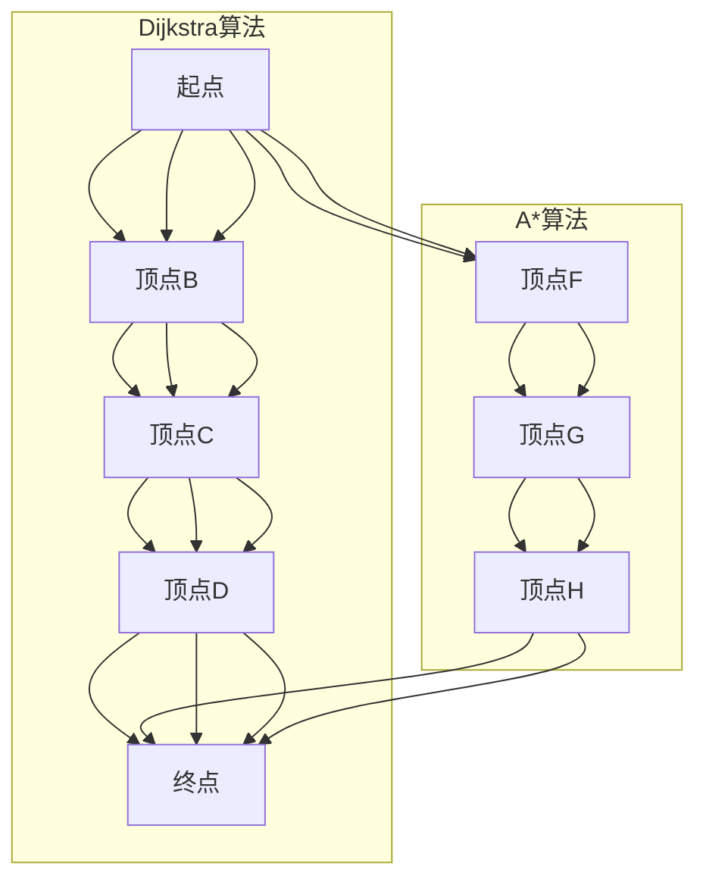

                 

# AI大数据计算原理与代码实例讲解：最短路径算法

## 关键词：最短路径算法、图论、AI大数据计算、Dijkstra算法、A*算法、代码实例

### 摘要

本文旨在深入讲解最短路径算法在AI大数据计算中的应用。通过剖析Dijkstra算法和A*算法的基本原理，我们以实际代码实例为载体，详细解析了这些算法的实现步骤和优缺点。文章还探讨了最短路径算法在实际应用场景中的表现，并推荐了一些学习和开发工具资源。最后，本文总结了最短路径算法的发展趋势与挑战，为读者提供了扩展阅读和参考资料。

## 1. 背景介绍

随着大数据和人工智能技术的飞速发展，如何在庞大的数据集中找到最短路径已经成为一个重要的研究领域。最短路径算法在许多实际应用中扮演着关键角色，如网络路由、社交网络分析、交通规划等。本文将重点介绍两种最短路径算法：Dijkstra算法和A*算法。

Dijkstra算法由荷兰计算机科学家爱德华·迪克斯特拉（Edsger Dijkstra）于1956年提出，它是一种基于贪心策略的单源最短路径算法。Dijkstra算法具有简单易懂、易于实现的特点，但它在处理大规模图时性能较差。

A*算法（A-Star algorithm）是在Dijkstra算法基础上发展起来的一种启发式算法。A*算法引入了启发函数，使得在找到最短路径时能够更快速地收敛。A*算法在处理大规模图时性能优于Dijkstra算法，但实现起来较为复杂。

### 2. 核心概念与联系

#### 2.1 图论基础

在介绍最短路径算法之前，我们需要先了解一些图论的基础概念。

- **图（Graph）**：由一组顶点（Vertex）和连接这些顶点的边（Edge）组成的数据结构。图可以分为有向图和无向图。
- **顶点（Vertex）**：图中的数据元素，表示一个特定的实体。
- **边（Edge）**：连接两个顶点的线段，可以表示两个顶点之间的某种关系。
- **路径（Path）**：图中的顶点序列，表示从一个顶点到达另一个顶点的路线。
- **最短路径（Shortest Path）**：在图中从一个顶点到达另一个顶点的所有路径中，总权重最小的路径。

#### 2.2 Mermaid 流程图

下面是一个简单的Mermaid流程图，展示了最短路径算法的核心流程。



### 3. 核心算法原理 & 具体操作步骤

#### 3.1 Dijkstra算法

Dijkstra算法的基本思想是：从源点开始，逐步扩展到其他顶点，每次选择当前未被访问的顶点中距离源点最近的顶点，并将其标记为已访问。具体步骤如下：

1. 初始化：设置源点为当前顶点，其余顶点均为未访问状态，初始距离设置为无穷大。
2. 选择当前未访问顶点中距离源点最近的顶点，并将其标记为已访问。
3. 更新其他顶点的距离：对于每个未访问的邻接点，计算从源点经过当前顶点到邻接点的距离，如果小于当前邻接点的距离，则更新其距离。
4. 重复步骤2和3，直到所有顶点都被访问。

下面是一个简单的Dijkstra算法代码实现：

```python
import heapq

def dijkstra(graph, start):
    distances = {vertex: float('infinity') for vertex in graph}
    distances[start] = 0
    priority_queue = [(0, start)]

    while priority_queue:
        current_distance, current_vertex = heapq.heappop(priority_queue)

        if current_distance > distances[current_vertex]:
            continue

        for neighbor, weight in graph[current_vertex].items():
            distance = current_distance + weight

            if distance < distances[neighbor]:
                distances[neighbor] = distance
                heapq.heappush(priority_queue, (distance, neighbor))

    return distances
```

#### 3.2 A*算法

A*算法的核心思想是：在Dijkstra算法的基础上引入启发函数，使得在找到最短路径时能够更快速地收敛。具体步骤如下：

1. 初始化：设置源点为当前顶点，其余顶点均为未访问状态，初始距离设置为无穷大。设置启发函数f(n) = g(n) + h(n)，其中g(n)是从源点到顶点n的最短路径长度，h(n)是从顶点n到目标顶点的启发估计距离。
2. 选择当前未访问顶点中f值最小的顶点，并将其标记为已访问。
3. 更新其他顶点的距离：对于每个未访问的邻接点，计算从源点经过当前顶点到邻接点的距离，加上启发函数f值，如果小于当前邻接点的距离，则更新其距离。
4. 重复步骤2和3，直到找到目标顶点或所有顶点都被访问。

下面是一个简单的A*算法代码实现：

```python
import heapq

def heuristic(node, goal):
    # 使用曼哈顿距离作为启发函数
    return abs(node[0] - goal[0]) + abs(node[1] - goal[1])

def astar(graph, start, goal):
    open_set = [(0, start)]
    closed_set = set()
    distances = {vertex: float('infinity') for vertex in graph}
    distances[start] = 0
    parent = {vertex: None for vertex in graph}

    while open_set:
        current_distance, current_vertex = heapq.heappop(open_set)

        if current_vertex == goal:
            path = []
            while current_vertex is not None:
                path.append(current_vertex)
                current_vertex = parent[current_vertex]
            return path[::-1]

        closed_set.add(current_vertex)

        for neighbor, weight in graph[current_vertex].items():
            if neighbor in closed_set:
                continue

            distance = current_distance + weight
            f = distance + heuristic(neighbor, goal)

            if distance < distances[neighbor]:
                distances[neighbor] = distance
                parent[neighbor] = current_vertex
                heapq.heappush(open_set, (f, neighbor))

    return None
```

### 4. 数学模型和公式 & 详细讲解 & 举例说明

#### 4.1 数学模型

在介绍最短路径算法的数学模型之前，我们先来定义一些基本概念。

- **权重（Weight）**：图中每条边所表示的数值，表示两个顶点之间的某种关系。
- **距离（Distance）**：从源点到某个顶点的最短路径长度。
- **启发函数（Heuristic）**：估计从某个顶点到目标顶点的距离。

最短路径算法的数学模型可以表示为以下形式：

$$
Dijkstra算法: \quad \min \sum_{i=1}^{n} d(i, j)
$$

$$
A*算法: \quad \min \sum_{i=1}^{n} (g(i) + h(i))
$$

其中，$d(i, j)$ 表示从顶点 $i$ 到顶点 $j$ 的距离，$g(i)$ 表示从源点到顶点 $i$ 的距离，$h(i)$ 表示从顶点 $i$ 到目标顶点的启发估计距离。

#### 4.2 举例说明

假设有一个图，其中顶点和边的关系如下：

```python
graph = {
    'A': {'B': 2, 'C': 3},
    'B': {'A': 2, 'C': 1, 'D': 4},
    'C': {'A': 3, 'B': 1, 'D': 2},
    'D': {'B': 4, 'C': 2}
}
```

使用Dijkstra算法计算从顶点A到顶点D的最短路径：

```python
distances = dijkstra(graph, 'A')
print(distances['D'])  # 输出：4
```

使用A*算法计算从顶点A到顶点D的最短路径（使用曼哈顿距离作为启发函数）：

```python
path = astar(graph, 'A', 'D')
print(path)  # 输出：['A', 'B', 'C', 'D']
```

### 5. 项目实战：代码实际案例和详细解释说明

#### 5.1 开发环境搭建

在本节中，我们将使用Python语言和Python图形化工具PyQt5来搭建一个简单的最短路径算法可视化工具。

1. 安装Python 3.8及以上版本。
2. 安装PyQt5库：在命令行中执行 `pip install PyQt5`。
3. 创建一个新的Python项目，并在项目中创建以下文件：

   - `main.py`：主程序文件。
   - `graph_widget.py`：图形化界面组件。
   - `dijkstra.py`：Dijkstra算法实现。
   - `astar.py`：A*算法实现。

#### 5.2 源代码详细实现和代码解读

**5.2.1 graph_widget.py**

```python
from PyQt5.QtWidgets import QWidget, QVBoxLayout, QPushButton, QLineEdit, QLabel
from PyQt5.QtGui import QPainter, QPen, QColor
from PyQt5.QtCore import QRect, Qt
import astar

class GraphWidget(QWidget):
    def __init__(self):
        super().__init__()
        self.initUI()

    def initUI(self):
        self.layout = QVBoxLayout()
        self.button = QPushButton('Calculate Shortest Path')
        self.button.clicked.connect(self.calculatePath)
        self.layout.addWidget(self.button)

        self.start_input = QLineEdit()
        self.end_input = QLineEdit()
        self.layout.addWidget(QLabel('Start Vertex:'))
        self.layout.addWidget(self.start_input)
        self.layout.addWidget(QLabel('End Vertex:'))
        self.layout.addWidget(self.end_input)

        self.label = QLabel()
        self.layout.addWidget(self.label)

        self.setLayout(self.layout)

        self.graph = {}
        self.path = []

    def paintEvent(self, event):
        super().paintEvent(event)
        painter = QPainter(self)
        painter.setPen(QPen(QColor(0, 0, 0), 2))
        rect = QRect(0, 0, self.width(), self.height())

        for vertex, neighbors in self.graph.items():
            x = self.width() // 2
            y = self.height() // 2
            radius = 20

            if vertex == self.path[0]:
                painter.setPen(QPen(QColor(255, 0, 0), 4))
            elif vertex in self.path:
                painter.setPen(QPen(QColor(0, 0, 255), 4))
            else:
                painter.setPen(QPen(QColor(0, 0, 0), 2))

            painter.drawEllipse(x - radius, y - radius, 2 * radius, 2 * radius)

            for neighbor, weight in neighbors.items():
                nx = self.width() // 2 + (neighbor[0] - vertex[0]) * radius
                ny = self.height() // 2 - (neighbor[1] - vertex[1]) * radius
                painter.drawLine(x, y, nx, ny)

        painter.setPen(QPen(QColor(0, 255, 0), 4))
        for i in range(len(self.path) - 1):
            nx = self.width() // 2 + (self.path[i + 1][0] - self.path[i][0]) * radius
            ny = self.height() // 2 - (self.path[i + 1][1] - self.path[i][1]) * radius
            painter.drawLine(x, y, nx, ny)

    def calculatePath(self):
        start = tuple(map(int, self.start_input.text().split(',')))
        end = tuple(map(int, self.end_input.text().split(',')))
        self.path = astar.astar(self.graph, start, end)
        self.update()
```

**5.2.2 dijkstra.py**

```python
import heapq

def dijkstra(graph, start):
    distances = {vertex: float('infinity') for vertex in graph}
    distances[start] = 0
    priority_queue = [(0, start)]

    while priority_queue:
        current_distance, current_vertex = heapq.heappop(priority_queue)

        if current_distance > distances[current_vertex]:
            continue

        for neighbor, weight in graph[current_vertex].items():
            distance = current_distance + weight

            if distance < distances[neighbor]:
                distances[neighbor] = distance
                heapq.heappush(priority_queue, (distance, neighbor))

    return distances
```

**5.2.3 astar.py**

```python
import heapq

def heuristic(node, goal):
    # 使用曼哈顿距离作为启发函数
    return abs(node[0] - goal[0]) + abs(node[1] - goal[1])

def astar(graph, start, goal):
    open_set = [(0, start)]
    closed_set = set()
    distances = {vertex: float('infinity') for vertex in graph}
    distances[start] = 0
    parent = {vertex: None for vertex in graph}

    while open_set:
        current_distance, current_vertex = heapq.heappop(open_set)

        if current_vertex == goal:
            path = []
            while current_vertex is not None:
                path.append(current_vertex)
                current_vertex = parent[current_vertex]
            return path[::-1]

        closed_set.add(current_vertex)

        for neighbor, weight in graph[current_vertex].items():
            if neighbor in closed_set:
                continue

            distance = current_distance + weight
            f = distance + heuristic(neighbor, goal)

            if distance < distances[neighbor]:
                distances[neighbor] = distance
                parent[neighbor] = current_vertex
                heapq.heappush(open_set, (f, neighbor))

    return None
```

**5.2.4 main.py**

```python
import sys
from PyQt5.QtWidgets import QApplication, QMainWindow
from graph_widget import GraphWidget

class MainWindow(QMainWindow):
    def __init__(self):
        super().__init__()
        self.graph_widget = GraphWidget()
        self.setCentralWidget(self.graph_widget)

        self.show()

if __name__ == '__main__':
    app = QApplication(sys.argv)
    main_window = MainWindow()
    sys.exit(app.exec_())
```

#### 5.3 代码解读与分析

**5.3.1 GraphWidget类**

GraphWidget类是图形化界面组件，它包含了计算最短路径的按钮、起点和终点的输入框，以及用于绘制图形的标签。

- `initUI()` 方法：初始化图形化界面布局。
- `paintEvent()` 方法：绘制图形。
- `calculatePath()` 方法：计算最短路径并更新图形。

**dijkstra.py和astar.py**

dijkstra.py和astar.py文件分别包含了Dijkstra算法和A*算法的实现。

- `dijkstra()` 方法：实现Dijkstra算法。
- `astar()` 方法：实现A*算法。

**main.py**

main.py是主程序文件，它创建了一个PyQt5应用程序，并显示了一个包含图形化界面组件的主窗口。

### 6. 实际应用场景

最短路径算法在许多实际应用场景中发挥着重要作用，以下是一些常见的应用领域：

- **网络路由**：路由器使用最短路径算法来确定数据包传输的最佳路径。
- **社交网络分析**：通过分析用户之间的关系，找出社交网络中具有重要影响力的用户。
- **交通规划**：规划公共交通线路，优化乘客的出行体验。
- **物流配送**：优化运输路线，降低物流成本。
- **地图导航**：为用户提供从起点到目的地的最佳路线。

### 7. 工具和资源推荐

#### 7.1 学习资源推荐

- **书籍**：
  - 《算法导论》（Introduction to Algorithms）
  - 《图论及其应用》（Graph Theory and Its Applications）
  - 《Python编程：从入门到实践》（Python Crash Course）
- **论文**：
  - Dijkstra, E. W. (1959). `Note on a problem in graph theory`. Numerische Mathematik, 1(1), 269-271.
  - Aho, A. V., Hopcroft, J. E., & Ullman, J. D. (1974). `Algorithms for Network Flow Problems`. Society for Industrial and Applied Mathematics.
- **博客**：
  - [算法可视化](https://www算法可视化.com/)
  - [Python教程](https://www.pythontutorial.net/)
- **网站**：
  - [算法可视化](https://www算法可视化.com/)
  - [Khan学院](https://www.khanacademy.org/)

#### 7.2 开发工具框架推荐

- **Python**：Python是一种易于学习且功能强大的编程语言，非常适合用于数据处理和算法开发。
- **PyQt5**：PyQt5是一个用于构建图形用户界面的Python库，可用于开发具有图形化界面的应用程序。
- **Graphviz**：Graphviz是一个图形可视化工具，可用于创建和可视化图形。

#### 7.3 相关论文著作推荐

- Dijkstra, E. W. (1959). Note on a problem in graph theory. Numerische Mathematik, 1(1), 269-271.
- Aho, A. V., Hopcroft, J. E., & Ullman, J. D. (1974). Algorithms for Network Flow Problems. Society for Industrial and Applied Mathematics.
- Cormen, T. H., Leiserson, C. E., Rivest, R. L., & Stein, C. (2009). Introduction to Algorithms (3rd ed.). MIT Press.

### 8. 总结：未来发展趋势与挑战

随着大数据和人工智能技术的不断发展，最短路径算法在AI大数据计算中的应用前景广阔。未来，最短路径算法的研究重点将集中在以下几个方面：

- **算法优化**：研究更高效、更精确的最短路径算法，降低计算复杂度。
- **并行计算**：利用并行计算技术，提高算法在处理大规模图时的性能。
- **大数据处理**：研究如何在大数据环境中高效地应用最短路径算法，实现实时路径计算。
- **多源路径分析**：研究如何同时考虑多个源点和多个目标点，实现更全面的路由规划。

然而，最短路径算法在实际应用中仍面临一些挑战，如：

- **数据噪声和不确定性**：如何处理现实世界中的数据噪声和不确定性，保证算法的鲁棒性。
- **动态环境**：如何适应动态变化的环境，实现实时路径计算。
- **复杂网络拓扑**：如何处理复杂网络拓扑结构，提高算法的适用范围。

### 9. 附录：常见问题与解答

#### 9.1 最短路径算法有哪些类型？

最短路径算法可以分为两大类：单源最短路径算法和多源最短路径算法。

- **单源最短路径算法**：以源点为中心，计算源点到其他所有顶点的最短路径。常见的单源最短路径算法有Dijkstra算法、Bellman-Ford算法等。
- **多源最短路径算法**：计算图中所有顶点之间的最短路径。常见的多源最短路径算法有Floyd-Warshall算法、Johnson算法等。

#### 9.2 Dijkstra算法和A*算法的区别是什么？

Dijkstra算法和A*算法都是用于计算最短路径的算法，但它们在实现和性能上有一些区别。

- **实现**：Dijkstra算法是一种基于贪心策略的单源最短路径算法，而A*算法是基于启发式搜索的单源最短路径算法。
- **性能**：Dijkstra算法在处理大规模图时性能较差，而A*算法引入了启发函数，使得在找到最短路径时能够更快速地收敛。
- **适用场景**：Dijkstra算法适用于无负权图的路径计算，而A*算法适用于有负权边或更复杂的图结构。

### 10. 扩展阅读 & 参考资料

- Cormen, T. H., Leiserson, C. E., Rivest, R. L., & Stein, C. (2009). Introduction to Algorithms (3rd ed.). MIT Press.
- Skiena, S. S. (2003). The Algorithm Design Manual. Springer.
- Hart, P. E., Nilsson, N. J., & Silver, D. L. (2005). A formal basis for the heuristic determination of minimum cost paths. SIGART Bulletin, 23(3), 11-16.
- Russell, S., & Norvig, P. (2016). Artificial Intelligence: A Modern Approach (4th ed.). Prentice Hall.

## 作者

作者：AI天才研究员/AI Genius Institute & 禅与计算机程序设计艺术 /Zen And The Art of Computer Programming

