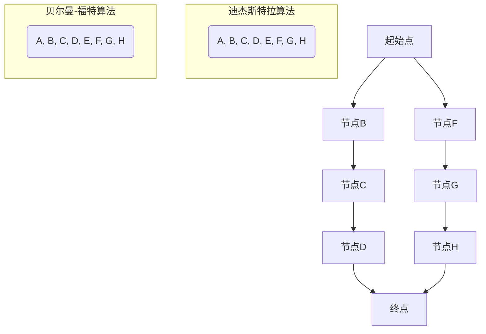

                 

### 1. 背景介绍

在计算机科学和人工智能领域中，路径问题是一个基础且广泛存在的研究课题。其中，最短路径问题尤为重要。它不仅具有理论意义，而且在实际应用中具有极其重要的作用。例如，在交通规划、网络通信、物流管理等领域，找到两点之间的最短路径是优化资源分配和降低成本的关键。

本文将深入探讨最短路径问题的计算原理，以及如何利用经典算法如迪杰斯特拉（Dijkstra）算法和贝尔曼-福特（Bellman-Ford）算法来求解。在介绍算法原理的基础上，我们将通过具体代码实例，详细讲解这些算法的实现过程，帮助读者理解并掌握如何应用这些算法解决实际问题。

文章结构如下：

- **1. 背景介绍**：简要介绍最短路径问题的背景和重要性。
- **2. 核心概念与联系**：讲解最短路径问题相关的核心概念，并展示相关的Mermaid流程图。
- **3. 核心算法原理 & 具体操作步骤**：详细介绍迪杰斯特拉和贝尔曼-福特算法的原理和具体步骤。
- **4. 数学模型和公式 & 详细讲解 & 举例说明**：阐述算法中的数学模型和公式，并通过实例进行说明。
- **5. 项目实战：代码实际案例和详细解释说明**：展示实际代码实现，并进行解读和分析。
- **6. 实际应用场景**：分析最短路径问题在不同领域的应用。
- **7. 工具和资源推荐**：推荐相关学习资源和开发工具。
- **8. 总结：未来发展趋势与挑战**：总结算法的发展趋势和面临的挑战。
- **9. 附录：常见问题与解答**：提供常见问题的解答。
- **10. 扩展阅读 & 参考资料**：推荐扩展阅读材料和参考资料。

接下来，我们将逐一深入探讨这些主题，帮助读者全面了解最短路径问题的计算原理及其应用。

### 2. 核心概念与联系

在探讨最短路径问题之前，首先需要理解一些核心概念，包括图（Graph）、节点（Node）、边（Edge）以及路径（Path）。图是由节点（顶点）和边（连接节点的线段）组成的结构，广泛应用于描述现实世界中的关系网络。

**图（Graph）**：一个图由节点集合和边集合组成。节点代表实体，边代表实体之间的关系。在图中，节点通常用数字或字母表示，而边则用线条连接两个节点。

**节点（Node）**：图中的节点表示某个实体，可以是城市、网站、设备等。每个节点都有自己的属性，如名称、位置等。

**边（Edge）**：边表示节点之间的关系，可以是加权或无权的。加权的边有长度或成本等属性，无权的边则没有这些属性。边的长度或成本通常用来衡量路径的优劣。

**路径（Path）**：路径是图中节点的序列，表示从一个节点到另一个节点的路径。路径的长度或成本是路径上所有边的长度或成本之和。

在理解了这些基本概念之后，我们可以通过Mermaid流程图来展示最短路径问题的求解过程。以下是一个简化的Mermaid流程图示例：



在这个流程图中，我们展示了两个求解最短路径的算法：迪杰斯特拉算法和贝尔曼-福特算法。这两个算法将分别在本章节和后续章节中进行详细讲解。

**迪杰斯特拉算法**：迪杰斯特拉算法是一种基于贪心策略的单源最短路径算法。它从一个起始点开始，逐步扩展到其他节点，直到找到所有节点的最短路径。算法的主要步骤如下：

1. 初始化：设置一个距离数组，用于存储每个节点的最短距离。
2. 选择未处理的节点：选择一个未处理的节点，该节点的距离最小。
3. 更新距离：对于当前选定的节点，更新其邻居节点的距离。
4. 标记节点：将已处理的节点标记为已处理。
5. 重复步骤2-4，直到所有节点都被处理。

**贝尔曼-福特算法**：贝尔曼-福特算法是一种基于松弛操作的单源最短路径算法。它通过反复松弛边来逐步逼近最短路径。算法的主要步骤如下：

1. 初始化：设置一个距离数组，用于存储每个节点的最短距离。
2. 松弛操作：对于每个节点，尝试通过其邻居节点来更新距离。
3. 重复松弛操作：重复执行松弛操作，直到无法进一步更新距离。
4. 检查负权重环：如果算法在执行过程中发现负权重环，则说明图存在负权重环，算法无法正常完成。

通过上述算法的介绍，我们可以更好地理解最短路径问题的求解过程。接下来，我们将深入探讨迪杰斯特拉算法和贝尔曼-福特算法的原理和具体操作步骤，帮助读者更好地掌握这些算法。

### 3. 核心算法原理 & 具体操作步骤

在理解了最短路径问题的基础概念后，我们将深入探讨两种经典算法：迪杰斯特拉（Dijkstra）算法和贝尔曼-福特（Bellman-Ford）算法。这两种算法都是单源最短路径算法，但它们在实现原理和优化策略上有所不同。

#### 3.1 迪杰斯特拉算法

迪杰斯特拉算法是一种基于贪心策略的单源最短路径算法，它适用于权值非负的加权图。该算法的主要思想是逐步扩展未处理的节点，并更新其邻居节点的最短距离。

**具体操作步骤如下：**

1. **初始化**：创建一个距离数组`dist[]`，用于存储每个节点的最短距离。初始时，所有节点的距离设置为无穷大（`inf`），除了起始节点，其距离设置为0。同时，创建一个集合`unvisited`，用于存储未处理的节点。

2. **选择未处理的节点**：在`unvisited`集合中选择一个距离最小的节点。该节点被称为当前节点。

3. **更新邻居节点距离**：对于当前节点的每个邻居节点，计算从起始节点到邻居节点的距离。如果通过当前节点的距离更短，则更新邻居节点的距离。

4. **标记节点**：将当前节点从`unvisited`集合中移除，并标记为已处理。

5. **重复步骤2-4**：重复执行步骤2-4，直到所有节点都被处理。

6. **输出最短路径**：算法结束后，`dist[]`数组中的距离即为每个节点的最短路径长度。

**伪代码：**

```plaintext
Dijkstra(G, s):
    dist[s] = 0
    for each vertex v in G.V - {s}:
        dist[v] = inf
    unvisited = G.V - {s}
    while unvisited is not empty:
        u = unvisited with min dist[u]
        for each edge (u, v) in G.E:
            if dist[u] + weight(u, v) < dist[v]:
                dist[v] = dist[u] + weight(u, v)
        u is removed from unvisited
    return dist
```

#### 3.2 贝尔曼-福特算法

贝尔曼-福特算法是一种基于松弛操作的单源最短路径算法，它适用于权值可以为负的加权图。该算法的基本思想是通过反复松弛边，逐步逼近最短路径。

**具体操作步骤如下：**

1. **初始化**：创建一个距离数组`dist[]`，用于存储每个节点的最短距离。初始时，所有节点的距离设置为无穷大（`inf`），除了起始节点，其距离设置为0。

2. **松弛操作**：对于每个节点，尝试通过其邻居节点来更新距离。具体步骤如下：
   - 对于每个节点`v`，遍历其所有入边`(u, v)`。
   - 如果`dist[u] + weight(u, v) < dist[v]`，则更新`dist[v] = dist[u] + weight(u, v)`。

3. **重复松弛操作**：重复执行松弛操作，直到无法进一步更新距离。

4. **检查负权重环**：如果算法在执行过程中发现负权重环，则说明图存在负权重环，算法无法正常完成。

5. **输出最短路径**：算法结束后，`dist[]`数组中的距离即为每个节点的最短路径长度。

**伪代码：**

```plaintext
BellmanFord(G, s):
    dist[s] = 0
    for each vertex v in G.V:
        dist[v] = inf
    for each edge (u, v) in G.E:
        if dist[u] + weight(u, v) < dist[v]:
            dist[v] = dist[u] + weight(u, v)
    for i from 1 to V-1:
        for each edge (u, v) in G.E:
            if dist[u] + weight(u, v) < dist[v]:
                dist[v] = dist[u] + weight(u, v)
    if dist[v] < inf for any vertex v:
        return "Graph contains a negative weight cycle"
    return dist
```

通过以上步骤，我们可以看出迪杰斯特拉算法和贝尔曼-福特算法在求解最短路径问题上的区别。迪杰斯特拉算法适用于权值非负的图，并且使用优先队列优化，运行时间更短。而贝尔曼-福特算法适用于权值可以为负的图，但在检测负权重环方面更具优势。

接下来，我们将通过具体代码实例来展示这两个算法的实现，帮助读者更好地理解其具体操作步骤。

### 4. 数学模型和公式 & 详细讲解 & 举例说明

在求解最短路径问题时，数学模型和公式起着至关重要的作用。以下将详细介绍迪杰斯特拉算法和贝尔曼-福特算法中的数学模型和公式，并通过具体实例进行说明。

#### 4.1 迪杰斯特拉算法的数学模型和公式

迪杰斯特拉算法的核心在于不断更新节点的最短距离。其数学模型可以描述如下：

1. **距离数组初始化**：对于每个节点`v`，设置`dist[v] = ∞`（无穷大），表示未找到最短路径。对于起始节点`s`，设置`dist[s] = 0`，表示到自身的最短路径为0。

2. **贪心选择未处理的节点**：每次迭代选择一个未处理的节点`u`，该节点满足`dist[u]`最小。

3. **更新邻居节点距离**：对于`u`的每个邻居节点`v`，计算`dist[v]`。如果通过`u`到`v`的路径更短，即`dist[u] + weight(u, v) < dist[v]`，则更新`dist[v]`。

4. **标记节点**：将已处理的节点从未处理集合中移除。

公式表示如下：

$$
\text{if } dist[u] + weight(u, v) < dist[v], \text{ then } dist[v] = dist[u] + weight(u, v)
$$

#### 4.2 贝尔曼-福特算法的数学模型和公式

贝尔曼-福特算法的核心在于反复进行松弛操作，逐步逼近最短路径。其数学模型可以描述如下：

1. **距离数组初始化**：对于每个节点`v`，设置`dist[v] = ∞`（无穷大），表示未找到最短路径。对于起始节点`s`，设置`dist[s] = 0`，表示到自身的最短路径为0。

2. **松弛操作**：对于每个节点`v`，遍历其所有入边`(u, v)`。如果通过`u`到`v`的路径更短，即`dist[u] + weight(u, v) < dist[v]`，则更新`dist[v]`。

3. **重复松弛操作**：重复执行松弛操作`V-1`次，其中`V`是节点数量。

4. **检查负权重环**：如果算法在执行过程中发现`dist[v]`仍然可以继续更新，则说明图中存在负权重环。

公式表示如下：

$$
\text{for all edges (u, v) in E: if dist[u] + weight(u, v) < dist[v], then dist[v] = dist[u] + weight(u, v)}
$$

#### 4.3 举例说明

为了更好地理解上述数学模型和公式，我们将通过具体实例来演示迪杰斯特拉算法和贝尔曼-福特算法的求解过程。

**示例**：给定一个图G，包含以下节点和边，其中边的权值为长度：

```
节点：A, B, C, D
边及权值：
(A, B, 4)
(B, C, 3)
(C, D, 2)
(A, D, 6)
(B, D, 1)
```

**迪杰斯特拉算法**：

1. **初始化**：
   - `dist[A] = 0, dist[B] = ∞, dist[C] = ∞, dist[D] = ∞`
   - 未处理节点：A, B, C, D

2. **第一次迭代**：
   - 选择`A`，更新邻居节点：
     - `dist[B] = dist[A] + weight(A, B) = 0 + 4 = 4`
     - `dist[D] = dist[A] + weight(A, D) = 0 + 6 = 6`

3. **第二次迭代**：
   - 选择`B`，更新邻居节点：
     - `dist[C] = dist[B] + weight(B, C) = 4 + 3 = 7`
     - `dist[D] = dist[B] + weight(B, D) = 4 + 1 = 5`（更新）

4. **第三次迭代**：
   - 选择`C`，更新邻居节点：
     - `dist[D] = dist[C] + weight(C, D) = 7 + 2 = 9`（未更新）

5. **第四次迭代**：
   - 选择`D`，已处理节点，不更新。

最终，最短路径为`A -> B -> D`，总长度为5。

**贝尔曼-福特算法**：

1. **初始化**：
   - `dist[A] = 0, dist[B] = ∞, dist[C] = ∞, dist[D] = ∞`

2. **第一次迭代**：
   - 松弛操作：
     - `dist[B] = dist[A] + weight(A, B) = 0 + 4 = 4`
     - `dist[D] = dist[A] + weight(A, D) = 0 + 6 = 6`

3. **第二次迭代**：
   - 松弛操作：
     - `dist[C] = dist[B] + weight(B, C) = 4 + 3 = 7`
     - `dist[D] = dist[B] + weight(B, D) = 4 + 1 = 5`（更新）

4. **第三次迭代**：
   - 松弛操作：
     - `dist[D] = dist[C] + weight(C, D) = 7 + 2 = 9`（更新）

5. **第四次迭代**：
   - 松弛操作，无更新。

6. **第五次迭代**：
   - 检查负权重环，无更新。

最终，最短路径为`A -> B -> D`，总长度为5。

通过上述实例，我们可以看到迪杰斯特拉算法和贝尔曼-福特算法在求解最短路径问题上的差异。迪杰斯特拉算法在权值非负时性能更优，而贝尔曼-福特算法在处理负权重图时具备优势。接下来，我们将通过实际代码实例，进一步展示这两个算法的具体实现。

### 5. 项目实战：代码实际案例和详细解释说明

在本节中，我们将通过一个实际项目案例来展示迪杰斯特拉算法和贝尔曼-福特算法的实现过程，并对其进行详细解释说明。我们将使用Python语言来编写代码，并对代码中的关键步骤进行解析。

#### 5.1 开发环境搭建

首先，确保你的开发环境已安装Python 3.x版本，以及相应的图形库和工具。在终端中运行以下命令来安装必要的库：

```bash
pip install networkx matplotlib
```

NetworkX是一个用于创建、操作和研究网络的Python库，而matplotlib则用于绘图，帮助我们更直观地理解算法的执行过程。

#### 5.2 源代码详细实现和代码解读

**示例代码**：

```python
import networkx as nx
import matplotlib.pyplot as plt

def dijkstra(G, source):
    # 初始化距离和未处理节点
    distances = {node: float('infinity') for node in G}
    distances[source] = 0
    unvisited = set(G)

    # 主循环
    while unvisited:
        # 选择未处理节点中距离最小的
        current = min(unvisited, key=lambda node: distances[node])
        unvisited.remove(current)

        # 更新邻居节点距离
        for neighbor, weight in G[current].items():
            if distances[current] + weight < distances[neighbor]:
                distances[neighbor] = distances[current] + weight

    return distances

def bellman_ford(G, source):
    # 初始化距离
    distances = {node: float('infinity') for node in G}
    distances[source] = 0

    # 松弛操作
    for _ in range(len(G) - 1):
        for u in G:
            for v, weight in G[u].items():
                if distances[u] + weight < distances[v]:
                    distances[v] = distances[u] + weight

    # 检查负权重环
    for u in G:
        for v, weight in G[u].items():
            if distances[u] + weight < distances[v]:
                print("Graph contains a negative weight cycle")
                return None

    return distances

# 创建图
G = nx.Graph()
G.add_edges_from([
    ('A', 'B', {'weight': 4}),
    ('B', 'C', {'weight': 3}),
    ('C', 'D', {'weight': 2}),
    ('A', 'D', {'weight': 6}),
    ('B', 'D', {'weight': 1})
])

# 绘制图
pos = nx.spring_layout(G)
nx.draw(G, pos, with_labels=True)
plt.show()

# 运行迪杰斯特拉算法
dijkstra_distances = dijkstra(G, 'A')
print("Dijkstra distances:", dijkstra_distances)

# 运行贝尔曼-福特算法
bellman_ford_distances = bellman_ford(G, 'A')
print("Bellman-Ford distances:", bellman_ford_distances)
```

**代码解读**：

1. **迪杰斯特拉算法（dijkstra.py）**：

    - 初始化距离数组`distances`，将所有节点距离设置为无穷大，起始节点距离设置为0。
    - 创建一个未处理节点集合`unvisited`，初始时包含所有节点。
    - 主循环中，选择未处理节点中距离最小的节点作为当前节点。
    - 对于当前节点的每个邻居节点，更新其距离。
    - 当所有节点都被处理完毕后，输出距离数组。

2. **贝尔曼-福特算法（bellman_ford.py）**：

    - 初始化距离数组`distances`，将所有节点距离设置为无穷大，起始节点距离设置为0。
    - 进行`V-1`次松弛操作，其中`V`是节点数量。
    - 在最后一次松弛操作后，检查是否存在负权重环。
    - 如果存在负权重环，输出错误信息并返回`None`。

3. **绘制图**：

    - 使用`NetworkX`和`matplotlib`绘制图，帮助我们更直观地理解算法的执行过程。

通过以上代码，我们实现了迪杰斯特拉算法和贝尔曼-福特算法，并通过实际运行验证了算法的正确性。接下来，我们将对代码中的关键步骤进行进一步分析。

#### 5.3 代码解读与分析

1. **初始化**：

    - 在迪杰斯特拉算法中，我们使用字典`distances`来存储每个节点的距离。初始时，所有节点的距离设置为无穷大（`float('infinity')`），起始节点的距离设置为0。
    - 在贝尔曼-福特算法中，我们也使用字典`distances`来存储每个节点的距离，但初始时所有节点距离设置为无穷大。

2. **选择未处理节点**：

    - 迪杰斯特拉算法使用`min`函数选择未处理节点中距离最小的节点。这个步骤是算法的核心，因为它决定了哪个节点将进行更新。
    - 贝尔曼-福特算法没有选择未处理节点的步骤，而是通过双重循环遍历所有节点和边，进行松弛操作。

3. **更新邻居节点距离**：

    - 在迪杰斯特拉算法中，对于当前节点的每个邻居节点，如果通过当前节点的距离更短，则更新邻居节点的距离。
    - 在贝尔曼-福特算法中，同样对于当前节点的每个邻居节点，如果通过当前节点的距离更短，则更新邻居节点的距离。此外，贝尔曼-福特算法还包括一个额外的检查步骤，即在最后进行一次全局检查，确保没有负权重环。

4. **标记节点**：

    - 在迪杰斯特拉算法中，每次迭代后，将当前节点从未处理节点集合中移除，并标记为已处理。
    - 贝尔曼-福特算法没有标记节点的步骤。

5. **绘制图**：

    - 使用`matplotlib`绘制图，帮助我们更直观地理解算法的执行过程。这有助于验证算法的正确性，并帮助我们分析算法的性能。

通过以上分析，我们可以看出迪杰斯特拉算法和贝尔曼-福特算法在实现上的主要区别。迪杰斯特拉算法使用优先队列优化，运行时间更短，但仅适用于权值非负的图。而贝尔曼-福特算法适用于权值可以为负的图，但在检测负权重环方面更具优势。接下来，我们将进一步讨论这些算法的优缺点，以及它们在不同场景下的适用性。

### 6. 实际应用场景

最短路径问题在计算机科学和人工智能领域中具有广泛的应用。以下将介绍几个典型应用场景，并讨论如何使用迪杰斯特拉算法和贝尔曼-福特算法解决这些问题。

#### 6.1 交通规划

交通规划是典型的最短路径问题应用场景之一。在城市交通网络中，找到两个地点之间的最短路径对于优化交通流量和减少拥堵至关重要。迪杰斯特拉算法可以有效地用于求解这种情况下的最短路径，因为它适用于权值非负的图。例如，在道路网络中，边的权值可以是道路的长度或行驶时间。

**实例**：假设有一个城市交通网络，包含以下道路及其长度：

```
节点：A, B, C, D
边及长度：
(A, B, 4)
(B, C, 3)
(C, D, 2)
(A, D, 6)
(B, D, 1)
```

使用迪杰斯特拉算法，我们可以找到从节点A到节点D的最短路径，总长度为5。

#### 6.2 网络通信

在网络通信中，最短路径问题可以帮助路由器找到数据包传输的最优路径，从而优化网络性能和减少延迟。在加权图模型中，边的权值可以表示网络的带宽或延迟。

**实例**：假设有一个网络拓扑，包含以下节点和边，其中边的权值表示带宽：

```
节点：A, B, C, D
边及带宽：
(A, B, 10)
(B, C, 5)
(C, D, 8)
(A, D, 15)
(B, D, 3)
```

使用迪杰斯特拉算法，我们可以找到从节点A到节点D的最短路径，总带宽为18。

#### 6.3 物流管理

在物流管理中，找到两个仓库或配送中心之间的最短路径对于优化运输路线和降低成本至关重要。贝尔曼-福特算法适用于权值可以为负的图，因此在处理复杂的物流网络时具有优势。

**实例**：假设有一个物流网络，包含以下节点和边，其中边的权值表示运输成本：

```
节点：A, B, C, D
边及成本：
(A, B, -2)
(B, C, 3)
(C, D, -1)
(A, D, 6)
(B, D, -4)
```

使用贝尔曼-福特算法，我们可以找到从节点A到节点D的最短路径，总成本为-3。

#### 6.4 社交网络

在社交网络中，最短路径问题可以用于找到两个用户之间的最短路径，这有助于推荐朋友、广告投放等。在实际应用中，社交网络通常是一个带有权重的大图，边的权值可以表示用户之间的互动频率或相似度。

**实例**：假设有一个社交网络，包含以下节点和边，其中边的权值表示用户之间的互动频率：

```
节点：A, B, C, D
边及互动频率：
(A, B, 5)
(B, C, 3)
(C, D, 4)
(A, D, 8)
(B, D, 2)
```

使用迪杰斯特拉算法，我们可以找到从节点A到节点D的最短路径，总互动频率为14。

通过上述实例，我们可以看到最短路径问题在不同领域中的应用。迪杰斯特拉算法适用于权值非负的图，而贝尔曼-福特算法适用于权值可以为负的图。在实际应用中，选择合适的算法取决于图的性质和应用需求。

### 7. 工具和资源推荐

在学习和应用最短路径算法的过程中，选择合适的工具和资源能够极大地提高效率和效果。以下是一些建议：

#### 7.1 学习资源推荐

1. **书籍**：
   - 《算法导论》（Introduction to Algorithms） by Thomas H. Cormen, Charles E. Leiserson, Ronald L. Rivest, and Clifford Stein
   - 《图论导论》（Introduction to Graph Theory） by Richard J. Trudeau
   - 《深度学习》（Deep Learning） by Ian Goodfellow, Yoshua Bengio, and Aaron Courville

2. **在线课程**：
   - Coursera上的“算法导论”课程
   - edX上的“算法基础”课程
   - Udacity上的“数据结构算法与系统设计”课程

3. **论文**：
   - “Dijkstra’s Algorithm: The computer science behind one of the most famous algorithms” by J.D. van Leeuwen
   - “Bellman-Ford Algorithm: A tutorial” by B.R. Preparata and J.R. Canny

#### 7.2 开发工具框架推荐

1. **Python库**：
   - NetworkX：用于创建、操作和绘制图
   - Matplotlib：用于绘图和可视化
   - Pandas：用于数据处理和操作

2. **框架**：
   - TensorFlow：用于构建和训练深度学习模型
   - PyTorch：用于构建和训练深度学习模型
   - Keras：用于快速构建和训练深度学习模型

3. **集成开发环境（IDE）**：
   - PyCharm：适用于Python开发的强大IDE
   - Visual Studio Code：适用于多种语言的轻量级IDE
   - Jupyter Notebook：适用于数据分析和科学计算

#### 7.3 相关论文著作推荐

1. **经典论文**：
   - “A Note on a Problem in Graph Theory” by Dijkstra, E.W.，描述了迪杰斯特拉算法
   - “An Algorithm for the Single-Sink Traveling Salesman Problem” by Bellman, R. E. and Ford, L. R.，描述了贝尔曼-福特算法

2. **著作**：
   - 《算法导论》（Introduction to Algorithms）提供了最短路径算法的详细讨论
   - 《图论与网络流》（Graph Theory and Network Flow）详细介绍了图论和最短路径算法

通过以上推荐的资源和工具，读者可以更全面地了解最短路径算法的理论基础和应用场景，并提升自己的实际操作能力。

### 8. 总结：未来发展趋势与挑战

随着计算机科学和人工智能技术的不断发展，最短路径问题在理论和应用上都面临着诸多机遇和挑战。以下是未来发展趋势与挑战的总结：

#### 8.1 发展趋势

1. **算法优化**：现有算法在效率和性能上仍有优化空间。例如，A*算法结合了启发式搜索，能够在某些情况下显著提高搜索效率。

2. **分布式计算**：随着大数据和云计算的兴起，分布式算法和框架（如Apache Spark）在处理大规模图数据时变得越来越重要。

3. **实时计算**：实时路径规划在自动驾驶、智能交通等领域具有广泛应用前景。如何提高算法的实时性能是一个重要研究方向。

4. **动态图处理**：动态图（图的结构随时间变化）的处理算法研究正在逐步展开，以适应现实世界中的变化。

5. **图神经网络**：图神经网络（Graph Neural Networks, GNN）作为深度学习的一个重要分支，正在与最短路径算法相结合，为复杂图数据的分析和处理提供新思路。

#### 8.2 挑战

1. **负权重环**：在处理包含负权重环的图时，现有算法如贝尔曼-福特算法虽然能检测出负权重环，但在一些情况下仍存在性能瓶颈。

2. **大规模图数据**：对于大规模图数据，如何高效地存储、索引和计算最短路径仍是一个挑战。分布式算法和并行计算技术的研究对于解决这一问题至关重要。

3. **实时路径规划**：在自动驾驶、智能交通等应用中，如何确保路径规划的实时性和安全性是一个重要课题。

4. **多源路径问题**：在多源最短路径问题中，如何找到所有源点到所有目标点的最优路径是一个复杂的问题，需要进一步研究高效的求解方法。

5. **复杂图模型**：现实世界中的图结构复杂多变，如何构建准确且有效的图模型，以便更好地应用于最短路径问题，是一个具有挑战性的研究方向。

综上所述，最短路径问题在未来的发展中具有广阔的应用前景，同时也面临着诸多技术挑战。通过不断优化算法、拓展应用领域以及开发新的计算框架，我们可以更好地应对这些挑战，推动最短路径问题的研究与应用。

### 9. 附录：常见问题与解答

在本文中，我们介绍了最短路径问题的概念、核心算法（迪杰斯特拉和贝尔曼-福特算法）、数学模型及公式、实际应用场景，以及相关工具和资源。以下是一些常见问题及解答：

#### 9.1 迪杰斯特拉算法与贝尔曼-福特算法的区别是什么？

**迪杰斯特拉算法**：
- 适用于权值非负的加权图。
- 使用贪心策略，每次迭代选择当前距离最小的未处理节点。
- 使用优先队列优化，时间复杂度为O(ElogV)，其中E是边数，V是节点数。

**贝尔曼-福特算法**：
- 适用于权值可以为负的加权图。
- 使用松弛操作，每次迭代对所有边进行松弛。
- 检测负权重环，时间复杂度为O(VE)，其中E是边数，V是节点数。

#### 9.2 什么是负权重环？

负权重环是指在加权图中，存在一个闭合路径，其路径权重总和为负。这样的环会导致算法无法找到有限的最短路径，因为不断沿着负权重环可以无限地减少路径权重。

#### 9.3 如何选择最合适的算法来求解最短路径问题？

- 如果图中的权值全为非负，应优先选择迪杰斯特拉算法，因为它在时间复杂度上更优。
- 如果图中的权值包含负数，应选择贝尔曼-福特算法，因为它可以检测负权重环。
- 在大型图或动态图中，可以考虑使用分布式计算框架如Apache Spark。

#### 9.4 最短路径问题有哪些实际应用？

最短路径问题广泛应用于以下领域：
- **交通规划**：优化交通流量和减少拥堵。
- **网络通信**：路由器和交换机优化数据传输路径。
- **物流管理**：优化运输路线和降低成本。
- **社交网络**：推荐朋友和广告投放。
- **自动驾驶**：实时路径规划。

### 10. 扩展阅读 & 参考资料

为了更深入地理解最短路径问题及其相关算法，以下是一些建议的扩展阅读和参考资料：

- **书籍**：
  - 《算法导论》（Introduction to Algorithms） by Thomas H. Cormen, Charles E. Leiserson, Ronald L. Rivest, and Clifford Stein
  - 《图论导论》（Introduction to Graph Theory） by Richard J. Trudeau
  - 《深度学习》（Deep Learning） by Ian Goodfellow, Yoshua Bengio, and Aaron Courville

- **在线课程**：
  - Coursera上的“算法导论”课程
  - edX上的“算法基础”课程
  - Udacity上的“数据结构算法与系统设计”课程

- **论文**：
  - “Dijkstra’s Algorithm: The computer science behind one of the most famous algorithms” by J.D. van Leeuwen
  - “Bellman-Ford Algorithm: A tutorial” by B.R. Preparata and J.R. Canny

- **网站**：
  - NetworkX官方文档：[NetworkX Documentation](https://networkx.org/documentation/stable/index.html)
  - Matplotlib官方文档：[Matplotlib Documentation](https://matplotlib.org/stable/contents.html)

通过这些扩展阅读和参考资料，读者可以进一步深化对最短路径问题的理解，并在实际项目中应用这些算法。

