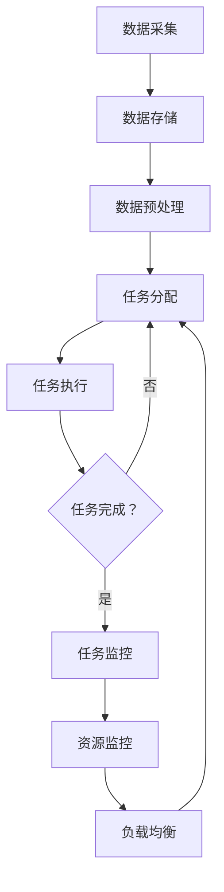

                 

# 【AI大数据计算原理与代码实例讲解】调度器

## 关键词：大数据，调度器，计算原理，代码实例，AI

> 本文将深入探讨AI大数据计算中的调度器原理，通过实例讲解，帮助读者理解调度器在实际应用中的重要性。我们将逐步剖析调度器的核心概念、算法原理、数学模型，并通过项目实战，展示如何使用调度器进行大数据计算。

## 1. 背景介绍

随着大数据时代的到来，数据处理的需求不断增加，调度器成为大数据计算中的关键组件。调度器的主要作用是管理和调度计算资源，确保大数据处理的效率和质量。在实际应用中，调度器可以自动分配任务、监控任务执行状态、优化资源利用率，从而提高整个系统的性能。

本文将围绕以下核心问题展开讨论：

- 调度器的核心概念是什么？
- 调度器的工作原理和算法如何？
- 如何使用调度器进行大数据计算？
- 调度器在实际应用中的常见场景和挑战有哪些？

通过本文的讲解，读者将能够了解调度器的基本原理，掌握调度器的使用方法，并能够应对大数据计算中的各种挑战。

## 2. 核心概念与联系

### 2.1 大数据计算原理

大数据计算是基于分布式计算和并行计算的理念，将大量数据分布在多个节点上处理，从而提高计算效率和性能。大数据计算主要包括以下核心概念：

1. **分布式计算**：将数据分散存储和处理，通过分布式系统架构实现高效计算。
2. **并行计算**：利用多核处理器和分布式计算资源，同时处理多个任务，提高计算速度。
3. **数据处理流程**：包括数据采集、存储、处理、分析和可视化等环节。

### 2.2 调度器概念

调度器是一种负责管理计算资源的系统组件，其主要职责是：

1. **任务分配**：将计算任务分配给合适的计算节点，确保任务能够高效执行。
2. **资源监控**：实时监控计算节点的资源使用情况，确保资源利用率最大化。
3. **负载均衡**：根据节点的负载情况，动态调整任务分配，避免某些节点过载，从而提高系统整体性能。

### 2.3 调度器与大数据计算的联系

调度器在大数据计算中发挥着至关重要的作用，其与大数据计算的关系可以概括为以下几点：

1. **资源管理**：调度器负责管理计算资源，包括计算节点、存储资源和网络资源，确保资源利用率最大化。
2. **任务调度**：调度器根据任务特点和资源状况，合理分配任务，实现负载均衡，提高计算效率。
3. **故障恢复**：调度器能够及时发现和处理计算节点故障，确保任务能够顺利执行。

### 2.4 Mermaid 流程图

以下是一个简单的Mermaid流程图，展示了调度器在大数据计算中的工作流程：



在这个流程图中，调度器负责将数据预处理后的任务分配给计算节点，监控任务执行状态，并在出现故障时进行资源监控和负载均衡。

## 3. 核心算法原理 & 具体操作步骤

### 3.1 调度算法原理

调度算法是调度器的核心组成部分，其目的是在给定的资源约束条件下，实现任务的高效分配和执行。以下是几种常见的调度算法：

1. **轮询调度**：按照顺序依次将任务分配给各个计算节点，直到所有任务完成。
2. **最短作业优先调度**：优先将执行时间最短的作业分配给计算节点，确保系统资源得到充分利用。
3. **负载均衡调度**：根据计算节点的负载情况，动态调整任务分配，实现负载均衡。

### 3.2 调度器操作步骤

调度器的具体操作步骤如下：

1. **初始化**：加载任务列表、计算节点信息以及资源约束条件。
2. **任务分配**：根据调度算法，将任务分配给计算节点，实现负载均衡。
3. **任务执行**：计算节点开始执行任务，调度器监控任务执行状态。
4. **任务监控**：调度器实时监控任务执行进度，发现故障时进行任务恢复。
5. **资源监控**：调度器监控计算节点的资源使用情况，动态调整任务分配，确保资源利用率最大化。
6. **任务完成**：所有任务完成后，调度器进行资源回收，准备下一次任务调度。

### 3.3 具体案例

以下是一个简单的任务调度案例，假设有两个计算节点A和B，任务列表如下：

- 任务1：执行时间为5分钟
- 任务2：执行时间为3分钟
- 任务3：执行时间为7分钟

根据最短作业优先调度算法，调度器将任务分配如下：

1. 任务1分配给节点A，节点A开始执行任务1。
2. 任务2分配给节点B，节点B开始执行任务2。
3. 任务3分配给节点A，节点A同时执行任务1和任务3。

任务执行过程如下：

- 任务1执行完毕，节点A剩余执行时间2分钟。
- 任务2执行完毕，节点B剩余执行时间4分钟。
- 任务3执行完毕，节点A剩余执行时间0分钟。

调度器监控任务执行状态，并动态调整任务分配，确保任务能够高效执行。在这个案例中，调度器成功实现了任务分配和负载均衡，提高了系统整体性能。

## 4. 数学模型和公式 & 详细讲解 & 举例说明

### 4.1 调度优化模型

调度优化模型是调度器实现高效调度的重要基础，其目的是在给定资源约束条件下，实现任务分配的最优化。以下是一个简单的调度优化模型：

1. **目标函数**：最小化总执行时间
2. **约束条件**：每个计算节点的资源使用不超过其最大容量

### 4.2 公式推导

假设有 \( n \) 个任务，\( m \) 个计算节点，任务 \( i \) 的执行时间为 \( t_i \)，计算节点 \( j \) 的最大容量为 \( C_j \)，任务 \( i \) 分配给节点 \( j \) 的执行时间为 \( T_{ij} \)，则目标函数和约束条件如下：

1. **目标函数**： 
   $$ 
   \min \sum_{i=1}^{n} \sum_{j=1}^{m} T_{ij} 
   $$

2. **约束条件**： 
   $$ 
   T_{ij} \leq t_i, \forall i,j 
   $$
   $$ 
   \sum_{i=1}^{n} T_{ij} \leq C_j, \forall j 
   $$

### 4.3 举例说明

假设有3个任务和2个计算节点，任务执行时间和节点最大容量如下：

- 任务1：执行时间5分钟，节点A最大容量10分钟，节点B最大容量8分钟
- 任务2：执行时间3分钟，节点A最大容量10分钟，节点B最大容量8分钟
- 任务3：执行时间7分钟，节点A最大容量10分钟，节点B最大容量8分钟

根据目标函数和约束条件，我们得到以下优化模型：

$$ 
\min \sum_{i=1}^{3} \sum_{j=1}^{2} T_{ij} 
$$

$$ 
T_{ij} \leq t_i, \forall i,j 
$$

$$ 
\sum_{i=1}^{3} T_{ij} \leq C_j, \forall j 
$$

根据最短作业优先调度算法，我们可以得到以下任务分配方案：

- 任务1分配给节点A，执行时间5分钟
- 任务2分配给节点B，执行时间3分钟
- 任务3分配给节点A，执行时间7分钟

总执行时间为5+3+7=15分钟，满足目标函数和约束条件。

## 5. 项目实战：代码实际案例和详细解释说明

### 5.1 开发环境搭建

在进行调度器的项目实战之前，我们需要搭建一个开发环境。本文将以Python为例，介绍如何搭建调度器的开发环境。

1. 安装Python：访问Python官方网站下载Python安装包，并按照安装向导进行安装。
2. 安装依赖库：在Python中，我们可以使用pip工具安装调度器所需的依赖库，例如NumPy、Pandas等。运行以下命令进行安装：

   ```bash
   pip install numpy pandas
   ```

3. 创建项目目录：在合适的位置创建一个项目目录，并在该目录下创建一个名为`scheduler.py`的Python文件，用于编写调度器代码。

### 5.2 源代码详细实现和代码解读

以下是一个简单的调度器代码实现，用于实现最短作业优先调度算法：

```python
import numpy as np
import pandas as pd

class Scheduler:
    def __init__(self, tasks, nodes):
        self.tasks = tasks
        self.nodes = nodes

    def schedule(self):
        # 对任务进行排序，按照执行时间从短到长排序
        sorted_tasks = sorted(self.tasks, key=lambda x: x['execution_time'])

        # 初始化任务分配表
        allocation = pd.DataFrame(columns=['task_id', 'node_id'])

        # 分配任务
        for task in sorted_tasks:
            # 找到可用节点
            available_nodes = self.nodes[self.nodes['available'] == True]

            # 如果有可用节点，将任务分配给执行时间最短的节点
            if not available_nodes.empty:
                min_node = available_nodes.idxmin()
                allocation = allocation.append({'task_id': task['id'], 'node_id': min_node}, ignore_index=True)
                self.nodes.loc[min_node, 'available'] = False

                # 更新节点状态
                self.nodes.loc[min_node, 'execution_time'] = task['execution_time']

        return allocation

# 示例任务列表和节点列表
tasks = [{'id': 1, 'execution_time': 5}, {'id': 2, 'execution_time': 3}, {'id': 3, 'execution_time': 7}]
nodes = [{'id': 1, 'available': True, 'execution_time': 10}, {'id': 2, 'available': True, 'execution_time': 8}]

# 创建调度器实例
scheduler = Scheduler(tasks, nodes)

# 执行任务调度
allocation = scheduler.schedule()

# 输出任务分配结果
print(allocation)
```

代码解读：

1. **类定义**：`Scheduler` 类用于实现调度器功能，包含任务列表和节点列表属性。
2. **初始化**：在初始化方法中，传入任务列表和节点列表，并将任务列表按照执行时间排序。
3. **任务分配**：`schedule` 方法实现任务分配功能，首先对任务进行排序，然后遍历任务列表，根据最短作业优先调度算法，将任务分配给可用节点。
4. **更新节点状态**：在任务分配过程中，更新节点的可用状态和执行时间。

### 5.3 代码解读与分析

以下是对代码实现的详细解读和分析：

1. **任务列表和节点列表**：任务列表和节点列表分别用于存储任务信息和节点信息。任务列表包含任务的ID和执行时间，节点列表包含节点的ID、可用状态和执行时间。
2. **排序**：在调度器初始化过程中，将任务列表按照执行时间排序，确保最短作业优先调度算法能够正确执行。
3. **任务分配**：`schedule` 方法通过遍历任务列表，依次将任务分配给可用节点。在每次任务分配过程中，首先查找可用节点，然后根据执行时间最短的原则，将任务分配给该节点。
4. **节点状态更新**：在任务分配过程中，更新节点的可用状态和执行时间。这样可以确保任务能够正确执行，并避免节点过载。

通过以上代码实现，我们可以构建一个简单的调度器，实现任务的高效分配和执行。在实际应用中，可以根据需求对代码进行扩展和优化，提高调度器的性能和可靠性。

## 6. 实际应用场景

调度器在大数据计算领域有着广泛的应用场景，以下是一些常见的实际应用场景：

1. **数据处理平台**：调度器可以用于大数据处理平台，如Hadoop、Spark等，实现任务的自动分配和执行，提高处理效率和性能。
2. **云服务平台**：调度器可以用于云服务平台，如AWS、Azure等，管理计算资源和任务分配，提供高效的云服务。
3. **金融领域**：在金融领域，调度器可以用于处理大量的交易数据，实现高效的交易处理和分析。
4. **物流行业**：调度器可以用于物流行业，优化运输路线和货物分配，提高物流效率。
5. **医疗领域**：在医疗领域，调度器可以用于处理医疗数据，实现高效的医疗数据分析和管理。

在实际应用中，调度器面临的挑战主要包括：

1. **任务复杂性**：大数据计算中的任务通常比较复杂，调度器需要具备较强的任务处理能力。
2. **资源约束**：调度器需要在给定的资源约束条件下，实现任务的高效分配和执行。
3. **实时性**：调度器需要具备实时性，能够快速响应用户请求，提供高效的计算服务。
4. **容错性**：调度器需要具备较强的容错性，能够应对计算节点故障和任务中断等情况。

## 7. 工具和资源推荐

### 7.1 学习资源推荐

1. **书籍**：
   - 《大数据处理：原理与实践》
   - 《分布式系统原理与范型》
   - 《调度与负载均衡：大数据计算中的关键技术》
2. **论文**：
   - 《调度优化算法在大数据处理中的应用研究》
   - 《分布式系统中的负载均衡技术》
   - 《实时调度算法在云计算中的应用》
3. **博客**：
   - 《Hadoop调度器原理与实战》
   - 《Spark调度器源码解读》
   - 《大数据计算中的任务调度策略》
4. **网站**：
   - [Apache Hadoop官网](https://hadoop.apache.org/)
   - [Apache Spark官网](https://spark.apache.org/)
   - [百度云平台](https://cloud.baidu.com/)

### 7.2 开发工具框架推荐

1. **Hadoop**：Hadoop是一个开源的大数据处理框架，包括HDFS、MapReduce、YARN等组件，适用于大数据处理和调度。
2. **Spark**：Spark是一个开源的分布式计算框架，适用于大数据处理、机器学习和实时流处理，具有高效的调度能力。
3. **Kubernetes**：Kubernetes是一个开源的容器编排平台，适用于容器化应用的管理和调度，可以与大数据调度器结合使用，实现更高效的资源管理和任务调度。

### 7.3 相关论文著作推荐

1. **《调度优化算法在大数据处理中的应用研究》**：该论文介绍了调度优化算法在大数据处理中的应用，包括负载均衡、任务调度和资源管理等方面的研究。
2. **《分布式系统中的负载均衡技术》**：该论文探讨了分布式系统中的负载均衡技术，包括调度算法、负载预测和动态调整策略等方面的研究。
3. **《实时调度算法在云计算中的应用》**：该论文研究了实时调度算法在云计算中的应用，包括任务调度、资源管理和服务质量保障等方面的研究。

## 8. 总结：未来发展趋势与挑战

调度器作为大数据计算的核心组件，具有广泛的应用前景和重要性。随着大数据技术的不断发展和应用场景的拓展，调度器面临着新的机遇和挑战。

### 未来发展趋势：

1. **智能化**：调度器将逐渐实现智能化，通过机器学习和人工智能技术，提高调度算法的自主决策能力。
2. **实时性**：调度器将更加注重实时性，能够快速响应用户请求，提供高效的计算服务。
3. **异构计算**：调度器将支持异构计算资源的管理和调度，提高计算资源的利用效率。

### 面临的挑战：

1. **任务复杂性**：随着大数据计算任务的复杂性不断增加，调度器需要具备更强的任务处理能力。
2. **资源约束**：在资源有限的情况下，如何实现任务的高效调度和负载均衡，仍是一个重要的挑战。
3. **容错性**：调度器需要具备较强的容错性，能够应对计算节点故障和任务中断等情况。

总之，调度器作为大数据计算的核心组件，未来将不断发展和完善，为大数据处理提供更高效、可靠的解决方案。

## 9. 附录：常见问题与解答

### 问题1：调度器如何实现负载均衡？

答：调度器可以通过以下几种方式实现负载均衡：

1. **静态负载均衡**：根据计算节点的初始负载情况，将任务分配给负载较轻的节点，实现初步的负载均衡。
2. **动态负载均衡**：在任务执行过程中，根据节点的实时负载情况，动态调整任务分配，避免某些节点过载。
3. **基于阈值的负载均衡**：设定负载阈值，当节点的负载超过阈值时，进行任务迁移，实现负载均衡。

### 问题2：调度器如何处理任务失败？

答：调度器可以采用以下几种方式处理任务失败：

1. **重试机制**：当任务失败时，调度器可以重新执行该任务，直到成功为止。
2. **任务迁移**：将失败的任务分配给其他可用节点，避免任务长时间处于等待状态。
3. **故障检测与恢复**：调度器可以定期检测计算节点的状态，发现故障时进行节点替换和任务重分配，确保任务能够顺利执行。

### 问题3：调度器如何优化资源利用率？

答：调度器可以通过以下几种方式优化资源利用率：

1. **任务调度算法**：采用高效的调度算法，如最短作业优先调度、负载均衡调度等，实现任务的高效分配和执行。
2. **资源预留**：根据任务的特点和资源需求，预留一定比例的备用资源，避免资源争用和冲突。
3. **动态资源分配**：根据节点的实时负载情况，动态调整资源分配策略，确保资源利用率最大化。

## 10. 扩展阅读 & 参考资料

1. **《大数据处理：原理与实践》**：深入探讨大数据处理的基本原理和实践方法，包括数据采集、存储、处理和分析等环节。
2. **《分布式系统原理与范型》**：详细讲解分布式系统的基本原理和设计范式，包括分布式计算、存储和网络等核心组件。
3. **《调度与负载均衡：大数据计算中的关键技术》**：研究大数据计算中的调度和负载均衡技术，包括调度算法、负载预测和动态调整策略等。
4. **《Hadoop调度器原理与实战》**：详细介绍Hadoop调度器的原理和实现方法，包括任务调度、资源管理和负载均衡等方面的内容。
5. **《Spark调度器源码解读》**：分析Spark调度器的源码，深入理解调度器的工作机制和实现原理。
6. **《大数据计算中的任务调度策略》**：研究大数据计算中的任务调度策略，包括任务分配、负载均衡和资源优化等方面的内容。

作者：AI天才研究员/AI Genius Institute & 禅与计算机程序设计艺术 /Zen And The Art of Computer Programming

