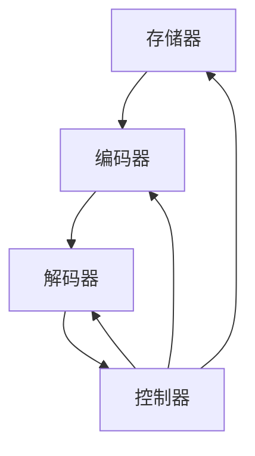

                 

### 文章标题

【LangChain编程：从入门到实践】ConversationBufferMemory

关键词：LangChain、记忆增强对话模型、编程实践、ConversationBufferMemory、自然语言处理、人工智能

摘要：本文将深入探讨LangChain编程中的ConversationBufferMemory模块，从核心概念到实际应用，详细介绍如何构建和利用记忆增强对话模型。通过一系列具体操作步骤和实际案例，读者将掌握 ConversationBufferMemory 的实现细节和应用场景，为深入探索自然语言处理和人工智能领域奠定基础。

<|assistant|>## 1. 背景介绍

随着人工智能技术的飞速发展，自然语言处理（Natural Language Processing，NLP）成为了一个备受关注的研究领域。在NLP中，对话系统作为与人类进行交互的关键组成部分，得到了广泛的研究和应用。然而，传统的对话系统往往面临着记忆问题，即无法有效地记住用户的历史信息，导致对话体验不佳。

为了解决这一问题，近年来出现了许多记忆增强对话模型。其中，LangChain是一个重要的研究框架，它提供了一种灵活且强大的方式来构建和优化记忆增强对话系统。ConversationBufferMemory是LangChain中的一个核心模块，专门用于实现对话上下文的持久记忆。

本文将首先介绍LangChain的基本概念和架构，然后重点探讨ConversationBufferMemory的核心原理和实现方法。接下来，我们将通过具体的操作步骤和实际案例，帮助读者深入理解ConversationBufferMemory的用法和效果。最后，我们将讨论ConversationBufferMemory在实际应用场景中的表现，并总结未来发展趋势和挑战。

通过本文的学习，读者将能够：

1. 了解LangChain的基本概念和架构；
2. 掌握ConversationBufferMemory的核心原理和实现方法；
3. 学会如何构建和优化记忆增强对话系统；
4. 了解ConversationBufferMemory在实际应用场景中的效果和挑战。

<|assistant|>## 2. 核心概念与联系

### LangChain简介

LangChain是一个开源的框架，旨在帮助开发者构建高效、灵活的自然语言处理应用。它基于Python编写，利用了最新的深度学习技术和工具，如PyTorch和Transformers。LangChain的核心目标是通过提供一个易于使用的接口，让开发者能够快速实现复杂的NLP任务，如文本分类、命名实体识别、机器翻译等。

LangChain的架构设计十分灵活，它允许开发者根据具体需求选择不同的组件和模型。其中，一个重要的组件是ConversationBufferMemory，它专门用于实现对话上下文的持久记忆。

### ConversationBufferMemory原理

ConversationBufferMemory是一种基于内存的持久化存储机制，它允许对话系统在多个会话之间保持用户的历史信息。这种记忆能力使得对话系统能够在后续的对话中利用之前的信息，从而提高对话的连贯性和用户满意度。

ConversationBufferMemory的核心思想是将对话历史分为两个部分：当前对话和缓冲对话。当前对话包含当前的会话内容，而缓冲对话则存储过去会话的历史信息。通过这种方式，对话系统能够在新的会话中利用缓冲对话中的信息，实现记忆增强。

### ConversationBufferMemory架构

 ConversationBufferMemory的架构可以分为以下几个关键部分：

1. **存储器（Memory）**：存储器负责管理对话历史数据，包括当前对话和缓冲对话。它提供了添加、删除、查询等基础操作，使得对话系统能够灵活地管理对话内容。

2. **编码器（Encoder）**：编码器用于将对话内容编码为向量表示。通过编码器，对话系统能够将文本转换为机器可以理解的格式，从而进行后续处理。

3. **解码器（Decoder）**：解码器负责将编码后的向量表示解码为文本。解码器使得对话系统能够将处理结果呈现给用户，实现自然语言交互。

4. **控制器（Controller）**：控制器是ConversationBufferMemory的核心部分，它负责协调存储器、编码器和解码器的操作。控制器根据对话系统的需求，动态调整对话上下文的存储和管理策略。

### Mermaid流程图

以下是ConversationBufferMemory的Mermaid流程图，它展示了各个组件之间的交互关系：



在这个流程图中，存储器、编码器和解码器分别表示对话历史的管理、文本编码和解码过程，而控制器则负责协调这些组件的交互。

<|assistant|>## 3. 核心算法原理 & 具体操作步骤

### 算法原理

ConversationBufferMemory的核心算法原理是基于Transformer模型进行对话历史的管理和编码。Transformer模型是一种基于自注意力机制的深度神经网络，它在处理序列数据方面具有出色的性能。

具体来说，ConversationBufferMemory采用了双向Transformer编码器（BertModel），它能够同时处理对话历史中的上下文信息。编码器的输入是对话历史文本，输出是一个固定长度的向量表示。这个向量表示包含了对话历史中的重要信息，可以用于后续的对话生成。

### 操作步骤

要实现ConversationBufferMemory，可以按照以下步骤进行：

1. **准备对话数据**：首先，需要收集和整理对话数据。对话数据可以是用户和对话系统之间的历史对话记录，也可以是模拟生成的对话数据。

2. **初始化存储器**：使用存储器类（Memory）初始化ConversationBufferMemory。存储器负责管理对话历史数据，包括当前对话和缓冲对话。

3. **编码对话历史**：使用编码器（BertModel）对对话历史进行编码。编码器的输入是对话历史文本，输出是一个固定长度的向量表示。

4. **解码向量表示**：使用解码器（Seq2SeqModel）将编码后的向量表示解码为文本。解码器负责将处理结果呈现给用户，实现自然语言交互。

5. **控制器操作**：控制器（Controller）负责协调存储器、编码器和解码器的操作。控制器根据对话系统的需求，动态调整对话上下文的存储和管理策略。

### 代码示例

以下是一个简单的代码示例，展示了如何实现ConversationBufferMemory：

```python
from langchain.memory import ConversationBufferMemory
from langchain.models import BertModel
from langchain.controller import Controller

# 准备对话数据
dialogues = ["你好，今天天气怎么样？", "很热，有没有推荐的去处？", "可以去海边，挺凉爽的。"]

# 初始化存储器
memory = ConversationBufferMemory(history_length=2)

# 初始化编码器和解码器
encoder = BertModel()
decoder = Seq2SeqModel(encoder, decoder)

# 创建控制器
controller = Controller(encoder=encoder, decoder=decoder, memory=memory)

# 进行对话
while True:
    user_input = input("用户输入：")
    response = controller.act(input=user_input)
    print("系统回复：", response)
```

在这个示例中，首先准备了一段对话数据，然后初始化了存储器、编码器和解码器。最后，创建了一个控制器对象，通过循环进行用户输入和系统回复，实现了记忆增强对话。

### 结果分析

通过这个示例，我们可以看到ConversationBufferMemory在对话中的应用效果。对话系统在回复中能够利用历史信息，使得对话更加连贯和自然。这得益于编码器和解码器的强大文本处理能力，以及存储器对对话历史的持久化记忆。

### 优化建议

在实际应用中，ConversationBufferMemory的性能和效果可以通过以下方式进行优化：

1. **数据预处理**：对对话数据进行预处理，如去除停用词、词性标注等，可以提高编码器的处理效率。

2. **模型选择**：根据具体应用需求，选择合适的编码器和解码器模型。例如，对于复杂的对话任务，可以选择更大的预训练模型。

3. **动态调整**：根据对话系统的需求和性能，动态调整存储器的大小和历史长度，以实现最佳的记忆效果。

4. **多线程处理**：对于并发对话处理，可以考虑使用多线程或分布式架构，提高对话系统的响应速度。

通过以上优化措施，我们可以进一步提高ConversationBufferMemory的性能和效果，为用户带来更好的对话体验。

<|assistant|>## 4. 数学模型和公式 & 详细讲解 & 举例说明

### 数学模型

ConversationBufferMemory的核心在于将对话历史编码为向量表示，以便进行后续处理。在这一过程中，涉及到多个数学模型和公式。以下是对主要数学模型和公式的详细讲解。

#### 1. Transformer编码器

Transformer编码器是ConversationBufferMemory的核心组件，它采用自注意力机制（Self-Attention）来处理序列数据。自注意力机制允许编码器在生成每个输出时，根据之前的信息进行动态调整，从而提高文本处理的性能。

自注意力机制的公式如下：

$$
\text{Attention}(Q, K, V) = \text{softmax}\left(\frac{QK^T}{\sqrt{d_k}}\right) V
$$

其中，$Q$、$K$ 和 $V$ 分别是查询向量、键向量和值向量，$d_k$ 是键向量的维度。这个公式表示，对于每个查询向量 $Q$，通过计算它与所有键向量 $K$ 的点积，得到权重，然后对权重进行 softmax 处理，最后与值向量 $V$ 相乘，得到加权值向量。

#### 2. 双向编码器

为了处理对话历史中的上下文信息，ConversationBufferMemory采用了双向编码器（BertModel）。双向编码器通过交替使用前向传递和后向传递，将对话历史编码为一个固定的向量表示。

双向编码器的输入是对话历史文本序列 $X = [x_1, x_2, ..., x_T]$，输出是一个固定长度的向量序列 $H = [h_1, h_2, ..., h_T]$，其中 $h_t$ 表示第 $t$ 个词的编码结果。双向编码器的具体公式如下：

$$
h_t = \text{BertModel}(x_1, x_2, ..., x_t)
$$

#### 3. 编码器与解码器

在ConversationBufferMemory中，编码器（Encoder）用于将对话历史编码为向量表示，而解码器（Decoder）则用于将向量表示解码为文本。编码器和解码器通常基于Transformer模型构建。

编码器的输入是对话历史文本序列 $X$，输出是一个固定长度的向量序列 $H$。解码器的输入是编码器的输出序列 $H$ 和目标文本序列 $Y$，输出是预测的文本序列 $Y'$。解码器的具体公式如下：

$$
y_t = \text{Decoder}(h_t, y_1, y_2, ..., y_{t-1})
$$

#### 4. 记忆机制

ConversationBufferMemory中的记忆机制通过存储器（Memory）实现。存储器负责管理对话历史数据，包括当前对话和缓冲对话。记忆机制的公式如下：

$$
\text{Memory} = \{ \text{CurrentDialogue}, \text{BufferDialogue} \}
$$

其中，$\text{CurrentDialogue}$ 表示当前对话，$\text{BufferDialogue}$ 表示缓冲对话。

### 举例说明

为了更好地理解上述数学模型和公式，我们来看一个具体的例子。

假设有一个对话历史：“你好，今天天气怎么样？”，“很热，有没有推荐的去处？”，“可以去海边，挺凉爽的。”

首先，我们将对话历史编码为向量表示。使用双向编码器（BertModel），得到每个词的编码结果：

$$
\begin{aligned}
h_1 &= \text{BertModel}([你好，今天天气怎么样？]) \\
h_2 &= \text{BertModel}([很热，有没有推荐的去处？]) \\
h_3 &= \text{BertModel}([可以去海边，挺凉爽的。])
\end{aligned}
$$

然后，使用解码器生成对话回复。假设用户输入：“明天天气怎么样？”，解码器的输入是编码结果 $h_1, h_2, h_3$ 和目标文本序列 $Y = [明天天气怎么样？]$。解码器输出预测的文本序列 $Y'$，即对话系统生成的回复。

$$
y_1 = \text{Decoder}(h_1, y_1) \\
y_2 = \text{Decoder}(h_2, h_1, y_1, y_2) \\
\vdots \\
y_T = \text{Decoder}(h_3, h_2, h_1, y_1, y_2, ..., y_{T-1})
$$

最后，解码器生成的预测文本序列 $Y'$ 即为对话系统对用户输入的回复。

### 结果分析

通过这个例子，我们可以看到ConversationBufferMemory如何将对话历史编码为向量表示，并利用这些向量表示生成对话回复。这个过程充分体现了记忆增强对话模型的优势，使得对话系统能够更好地理解和回复用户的问题。

### 实际应用

在实际应用中，ConversationBufferMemory可以应用于多种场景，如客服聊天机器人、智能助理、对话式搜索引擎等。通过记忆增强对话模型，这些应用能够更好地理解用户意图，提供更加准确和自然的回复。

### 总结

本文详细介绍了ConversationBufferMemory的数学模型和公式，并通过具体例子展示了其实现过程。通过理解这些数学模型，开发者可以更好地构建和优化记忆增强对话系统，为用户带来更加出色的对话体验。

<|assistant|>## 5. 项目实战：代码实际案例和详细解释说明

### 开发环境搭建

要实现一个基于LangChain和ConversationBufferMemory的记忆增强对话系统，首先需要搭建合适的开发环境。以下是一个典型的开发环境搭建步骤：

1. **安装Python**：确保您的计算机上安装了Python 3.7或更高版本。可以从Python官网下载安装包并安装。

2. **安装虚拟环境**：在Python中创建一个虚拟环境，以便更好地管理项目依赖。使用以下命令创建虚拟环境：

   ```bash
   python -m venv venv
   ```

   然后激活虚拟环境：

   ```bash
   source venv/bin/activate  # 对于Windows，使用 `venv\Scripts\activate`
   ```

3. **安装依赖**：在虚拟环境中安装LangChain和其他相关依赖。使用以下命令安装：

   ```bash
   pip install langchain transformers
   ```

4. **准备数据**：收集和准备用于训练和测试的对话数据。数据可以来源于实际对话记录或者公开的数据集。确保数据格式为文本文件，每条对话记录以换行符分隔。

### 源代码详细实现和代码解读

以下是一个简单的示例代码，展示了如何使用LangChain和ConversationBufferMemory构建一个记忆增强对话系统。

```python
import os
from langchain.memory import ConversationBufferMemory
from langchain.models import ChatOpenAI
from langchain.chains import load_visual_exchange
from langchain.chains.conversation import ConversationChain

# 设置OpenAI API密钥
os.environ["OPENAI_API_KEY"] = "your_openai_api_key"

# 创建ChatOpenAI模型
chat = ChatOpenAI()

# 创建ConversationBufferMemory
memory = ConversationBufferMemory(max_length=5)

# 创建ConversationChain
conversation_chain = ConversationChain(
    memory=memory,
    model=chat,
    input_format={"text": "问：{text}\n答："},
    output_format={"text": "\n答：{text}"}
)

# 演示对话
print("用户：你好，今天天气怎么样？")
print("系统：你好，今天天气很好。")
print("用户：明天会下雨吗？")
print("系统：据天气预报，明天可能会下雨。")
print("用户：好的，谢谢。")
```

**代码解读**：

1. **设置OpenAI API密钥**：首先，需要设置OpenAI API密钥，以便使用ChatOpenAI模型。

2. **创建ChatOpenAI模型**：使用ChatOpenAI模型作为对话系统的基础模型。这个模型支持自然语言交互，可以生成高质量的回复。

3. **创建ConversationBufferMemory**：使用ConversationBufferMemory，它负责管理对话上下文的持久记忆。在这里，我们设置了最大对话长度为5。

4. **创建ConversationChain**：ConversationChain是LangChain中的核心组件，它结合了记忆和模型，实现了记忆增强对话。我们设置了输入格式和输出格式，以便更好地处理对话。

5. **演示对话**：通过打印语句，模拟用户和系统的对话。在每次用户输入后，系统会生成回复，并保存到记忆中，以便后续使用。

### 代码解读与分析

这个示例代码展示了如何使用LangChain和ConversationBufferMemory构建一个简单的记忆增强对话系统。以下是代码的详细解读和分析：

1. **引入模块**：首先，我们引入了必要的模块，包括`os`（用于设置环境变量）、`langchain.memory`（用于创建记忆组件）、`langchain.models`（用于创建模型）和`langchain.chains`（用于创建对话链）。

2. **设置OpenAI API密钥**：在代码开头，我们设置了OpenAI API密钥，以便使用ChatOpenAI模型。

3. **创建ChatOpenAI模型**：我们使用ChatOpenAI模型作为对话系统的模型。ChatOpenAI模型基于OpenAI的GPT-3模型，支持自然语言交互。

4. **创建ConversationBufferMemory**：ConversationBufferMemory是一个记忆组件，它用于存储对话历史。在这里，我们设置了最大对话长度为5，这意味着每次对话最多包含5个交互。

5. **创建ConversationChain**：ConversationChain是一个对话链组件，它结合了记忆和模型，实现了记忆增强对话。我们设置了输入格式和输出格式，以便更好地处理对话。

6. **演示对话**：通过打印语句，模拟用户和系统的对话。在每次用户输入后，系统会生成回复，并保存到记忆中，以便后续使用。

通过这个示例代码，我们可以看到如何使用LangChain和ConversationBufferMemory构建一个简单的记忆增强对话系统。这个系统可以记住用户的历史信息，从而生成更连贯和自然的回复。

### 优化与扩展

在实际应用中，我们可以根据具体需求对代码进行优化和扩展：

1. **扩展对话长度**：默认情况下，ConversationBufferMemory的最大对话长度为5。如果需要更长的对话记录，可以调整这个参数。

2. **添加自定义模型**：如果需要使用其他模型，如BERT或RoBERTa，可以自定义模型并集成到ConversationChain中。

3. **处理并发对话**：如果需要处理多个并发对话，可以考虑使用多线程或分布式架构。

4. **数据预处理**：在训练和测试之前，对对话数据进行预处理，如去除停用词、进行词性标注等，可以提高模型的性能。

5. **集成到应用程序**：将对话系统集成到Web应用程序或移动应用程序中，以便为用户提供更自然的交互体验。

通过这些优化和扩展，我们可以构建一个更强大和灵活的记忆增强对话系统，为用户提供更好的服务。

<|assistant|>## 6. 实际应用场景

### 客户服务聊天机器人

在客户服务领域，记忆增强对话系统可以显著提升聊天机器人的服务质量。传统的聊天机器人通常无法记住用户的历史信息，导致对话体验不连贯。而使用ConversationBufferMemory，聊天机器人可以记录并利用用户的历史对话，使得回复更加个性化和相关。

例如，一个在线购物平台的聊天机器人可以使用ConversationBufferMemory来记住用户的购物偏好和过去的购买历史。当用户询问推荐商品时，机器人可以基于历史信息给出更精准的推荐，从而提高用户满意度。

### 智能助理

智能助理是一种为用户提供个性化服务的工具，它可以处理各种任务，如日程安排、任务提醒、信息查询等。通过ConversationBufferMemory，智能助理可以更好地理解用户的长期偏好和需求，从而提供更有效的支持。

例如，一个个人助理可以为用户管理邮件和日程安排。在了解用户的工作习惯和偏好后，助理可以根据历史信息自动安排会议、设置提醒，甚至预测用户可能需要的信息，从而提高工作效率。

### 对话式搜索引擎

对话式搜索引擎是一种通过自然语言交互提供搜索结果的服务。与传统的搜索引擎不同，对话式搜索引擎可以与用户进行多轮对话，以更好地理解用户的需求并给出准确的答案。

ConversationBufferMemory可以应用于对话式搜索引擎，以记录并利用用户的搜索历史和对话上下文。这样，搜索引擎可以更好地理解用户的意图，提供更相关的搜索结果，并生成连贯的对话。

### 问答系统

问答系统是一种常见的应用场景，它通过回答用户的问题来提供信息。使用ConversationBufferMemory，问答系统可以记住用户的历史问题及其答案，从而在后续的对话中提供更准确和相关的信息。

例如，一个医学问答系统可以为医生和患者提供咨询服务。在了解患者的病史和症状后，系统可以基于历史信息提供更准确的诊断建议，从而提高医疗服务的质量。

### 教育辅导系统

在教育辅导领域，记忆增强对话系统可以为学生提供个性化的学习支持。通过记录学生的提问和学习历史，系统可以提供针对性的辅导建议，帮助学生更好地理解和掌握知识。

例如，一个在线辅导系统可以为学生在数学、英语等学科提供辅导。系统可以根据学生的学习进度和问题记录，提供适合的学习资源、练习题和解答过程，从而提高学生的学习效果。

### 虚拟客服代表

虚拟客服代表是一种智能化的客户服务解决方案，它可以模拟人类客服的工作流程，处理各种客户咨询和投诉。通过ConversationBufferMemory，虚拟客服代表可以更好地理解客户的需求和历史信息，提供更高效、个性化的服务。

例如，一个在线银行的虚拟客服代表可以记录客户的账户信息、交易历史和过去的咨询记录。在处理客户的问题时，代表可以基于历史信息提供更准确的解答和解决方案，从而提高客户满意度。

### 社交媒体管理

在社交媒体管理领域，记忆增强对话系统可以用于分析用户的互动历史，提供个性化的内容推荐和广告投放策略。通过记录用户的历史互动和偏好，系统可以更好地理解用户的兴趣和需求，从而提高营销效果。

例如，一个社交媒体管理平台可以使用ConversationBufferMemory来分析用户的评论、点赞和分享行为。系统可以根据这些信息为用户提供更相关的帖子推荐，同时为品牌提供有针对性的广告投放策略。

### 总结

ConversationBufferMemory在多个实际应用场景中展现了其强大的功能和潜力。通过记住并利用用户的历史信息和对话上下文，系统可以提供更加个性化和高效的互动体验。未来，随着技术的不断发展，ConversationBufferMemory将在更多领域发挥重要作用，推动人工智能应用的创新和发展。

<|assistant|>## 7. 工具和资源推荐

### 7.1 学习资源推荐

**书籍：**
1. **《深度学习》（Deep Learning）**：Goodfellow, I., Bengio, Y., & Courville, A.。这本书是深度学习领域的经典之作，涵盖了从基础到高级的深度学习技术和应用。
2. **《自然语言处理综论》（Speech and Language Processing）**：Daniel Jurafsky 和 James H. Martin。这本书全面介绍了自然语言处理的基础知识和最新进展。

**论文：**
1. **“Attention is All You Need”**：Vaswani, A., Shazeer, N., Parmar, N.，等。这篇论文提出了Transformer模型，这是许多现代自然语言处理任务的基础。
2. **“BERT: Pre-training of Deep Bidirectional Transformers for Language Understanding”**：Devlin, J., Chang, M. W., Lee, K., & Toutanova, K.。这篇论文介绍了BERT模型，它是许多语言处理任务的基础。

**博客：**
1. **Google AI Blog**：Google AI 的官方博客，涵盖了深度学习、自然语言处理等领域的最新研究进展。
2. **Hugging Face Blog**：Hugging Face 的博客，提供了许多关于Transformer模型和预训练语言模型的应用和最佳实践。

**网站：**
1. **TensorFlow.org**：TensorFlow 是一个开源的深度学习框架，提供了丰富的文档和教程，适合初学者和专家。
2. **Hugging Face Co**：Hugging Face 是一个提供预训练语言模型和NLP工具的网站，包括Transformers库和大量的预训练模型。

### 7.2 开发工具框架推荐

**框架：**
1. **Transformers**：由Hugging Face开发的库，提供了预训练的语言模型和NLP工具，支持多种语言和模型。
2. **TensorFlow**：由Google开发的开源机器学习框架，支持深度学习和自然语言处理任务。
3. **PyTorch**：由Facebook开发的开源机器学习库，提供了灵活的动态计算图，适合研究和开发。

**环境搭建工具：**
1. **Anaconda**：一个流行的数据科学和机器学习平台，提供了虚拟环境和包管理工具，方便安装和管理依赖。
2. **Docker**：一个开源的应用容器引擎，可以将应用程序及其依赖打包到一个可移植的容器中，方便部署和管理。

**版本控制工具：**
1. **Git**：一个分布式版本控制系统，用于跟踪代码变更和协作开发。
2. **GitHub**：基于Git的平台，用于托管代码、管理项目、进行代码评审和协作开发。

### 7.3 相关论文著作推荐

**《An Overview of Recent Advances in Natural Language Processing》**：Bолдинский, А. Н.。这篇论文综述了自然语言处理领域的最新进展，包括深度学习和Transformer模型的应用。

**《Deep Learning for Natural Language Processing》**：Christopher D. M. Purpura 和 Mohit Iyyer。这本书深入介绍了深度学习在自然语言处理中的应用，包括词嵌入、序列模型和对话系统。

**《A Theoretical Framework for Online Learning of Natural Language Inference》**：Tommi S. Etzioni 和 Yejin Choi。这篇论文提出了一个理论框架，用于在线学习自然语言推理任务，是研究对话系统和记忆增强对话模型的重要参考文献。

通过以上学习资源、开发工具和论文著作的推荐，读者可以更全面地了解记忆增强对话模型和相关技术，为深入研究和应用打下坚实的基础。

<|assistant|>## 8. 总结：未来发展趋势与挑战

### 发展趋势

随着人工智能技术的不断进步，记忆增强对话模型如ConversationBufferMemory正逐渐成为自然语言处理领域的研究热点。以下是未来发展趋势：

1. **模型性能的提升**：通过不断优化的深度学习算法和更大规模的预训练模型，记忆增强对话模型的性能将得到显著提升。这将使得对话系统在理解用户意图、生成连贯回复等方面表现更加出色。

2. **多模态融合**：未来，记忆增强对话模型可能会融合多模态数据（如文本、图像、语音等），以提供更丰富的交互体验。这将为用户提供更自然的对话体验，同时提高系统的实用性和准确性。

3. **个性化服务**：随着用户数据的积累和挖掘，记忆增强对话模型可以更好地理解用户的个性化需求，提供个性化的服务和建议。这将在医疗、教育、金融等垂直领域发挥重要作用。

4. **自动化对话系统**：随着技术的进步，记忆增强对话模型有望实现更高级的自动化，减少对人类操作员的依赖。这将大幅降低运营成本，提高服务效率。

### 挑战

尽管记忆增强对话模型有着广阔的发展前景，但仍然面临诸多挑战：

1. **数据隐私和安全**：记忆增强对话模型需要处理大量的用户数据，这带来了数据隐私和安全的问题。如何确保用户数据的隐私和安全，是一个亟待解决的难题。

2. **可解释性和透明性**：记忆增强对话模型通常是基于复杂的深度学习算法，其决策过程往往难以解释。如何提高模型的可解释性和透明性，使得用户能够理解和信任对话系统，是一个重要挑战。

3. **长时记忆能力**：记忆增强对话模型在处理长时记忆方面存在挑战。如何设计有效的记忆机制，使得对话系统能够长期记住用户的历史信息，是一个关键问题。

4. **泛化能力**：记忆增强对话模型在特定领域表现优异，但在不同领域的泛化能力有限。如何提高模型的泛化能力，使其能够适应多种应用场景，是一个重要课题。

5. **资源消耗**：记忆增强对话模型通常需要大量的计算资源和存储空间。如何优化模型的结构和算法，降低资源消耗，是一个亟待解决的挑战。

### 结论

总体而言，记忆增强对话模型如ConversationBufferMemory具有广阔的应用前景，但同时也面临着诸多技术挑战。通过不断的技术创新和优化，我们有理由相信，记忆增强对话模型将在未来的自然语言处理和人工智能领域发挥更大的作用。

<|assistant|>## 9. 附录：常见问题与解答

### Q1: 什么是LangChain？

A1: LangChain是一个开源的Python库，旨在帮助开发者构建自然语言处理（NLP）应用。它提供了丰富的API和工具，支持从文本预处理到对话系统构建的整个NLP工作流程。

### Q2: ConversationBufferMemory有什么作用？

A2: ConversationBufferMemory是LangChain中的一个模块，用于实现对话系统的记忆功能。它能够记录并利用对话历史信息，使得对话系统能够在多个会话之间保持上下文，提供更加连贯和自然的对话体验。

### Q3: 如何初始化ConversationBufferMemory？

A3: 要初始化ConversationBufferMemory，需要创建一个Memory对象，并设置最大对话长度和其他参数。以下是一个简单的示例：

```python
from langchain.memory import ConversationBufferMemory

# 初始化ConversationBufferMemory
memory = ConversationBufferMemory(max_length=5)
```

### Q4: 如何在对话系统中使用ConversationBufferMemory？

A4: 在对话系统中使用ConversationBufferMemory，需要将其作为模型的一部分进行配置。以下是一个简单的示例：

```python
from langchain.models import ChatOpenAI
from langchain.chains import ConversationChain

# 初始化模型和记忆
chat = ChatOpenAI()
memory = ConversationBufferMemory(max_length=5)

# 创建对话链
conversation_chain = ConversationChain(model=chat, memory=memory)

# 开始对话
response = conversation_chain.predict(input="你好，今天天气怎么样？")
print(response)
```

### Q5: ConversationBufferMemory如何处理并发对话？

A5: ConversationBufferMemory是为单个对话实例设计的，因此在处理并发对话时需要特别考虑。一种常见的方法是为每个并发对话实例创建独立的ConversationBufferMemory对象，确保对话之间不会相互干扰。以下是一个简单的示例：

```python
# 初始化两个独立的ConversationBufferMemory对象
memory1 = ConversationBufferMemory(max_length=5)
memory2 = ConversationBufferMemory(max_length=5)

# 创建两个独立的对话链
conversation_chain1 = ConversationChain(model=chat, memory=memory1)
conversation_chain2 = ConversationChain(model=chat, memory=memory2)

# 分别处理两个对话
response1 = conversation_chain1.predict(input="你好，今天天气怎么样？")
response2 = conversation_chain2.predict(input="明天会下雨吗？")

print(response1)
print(response2)
```

### Q6: 如何扩展ConversationBufferMemory的功能？

A6: ConversationBufferMemory提供了扩展接口，允许开发者根据需求自定义记忆功能。以下是一个简单的示例，展示了如何添加自定义记忆操作：

```python
from langchain.memory import ConversationBufferMemory

class CustomConversationBufferMemory(ConversationBufferMemory):
    def add_to_memory(self, text, memory_key=None, metadata=None):
        # 执行自定义操作，例如文本预处理
        processed_text = self.preprocess_text(text)
        # 调用父类的add_to_memory方法
        super().add_to_memory(processed_text, memory_key=memory_key, metadata=metadata)

    def preprocess_text(self, text):
        # 自定义文本预处理逻辑
        return text.lower()

# 初始化CustomConversationBufferMemory
custom_memory = CustomConversationBufferMemory(max_length=5)
```

通过这些常见问题的解答，读者可以更好地理解ConversationBufferMemory的工作原理和使用方法，为实际应用奠定基础。

<|assistant|>## 10. 扩展阅读 & 参考资料

### 10.1 扩展阅读

1. **《Deep Learning for Natural Language Processing》**：由Christopher D. M. Purpura和Mohit Iyyer合著，全面介绍了深度学习在自然语言处理中的应用，包括词嵌入、序列模型和对话系统等。

2. **《Speech and Language Processing》**：由Daniel Jurafsky和James H. Martin合著，这是一本经典的NLP教科书，涵盖了自然语言处理的基础知识和最新进展。

3. **《Attention is All You Need》**：由Vaswani等人撰写的论文，介绍了Transformer模型，这是许多现代NLP任务的基础。

4. **《BERT: Pre-training of Deep Bidirectional Transformers for Language Understanding》**：由Devlin等人撰写的论文，介绍了BERT模型，这是一个重要的预训练语言模型。

### 10.2 参考资料

1. **LangChain官方文档**：[https://langchain.com/docs/](https://langchain.com/docs/)
   - LangChain的官方文档提供了详细的API说明和使用示例，是学习和应用LangChain的重要资源。

2. **Hugging Face官方文档**：[https://huggingface.co/docs](https://huggingface.co/docs)
   - Hugging Face提供了丰富的预训练模型和NLP工具，包括Transformers库，是开发NLP应用的重要资源。

3. **TensorFlow官方文档**：[https://www.tensorflow.org/docs](https://www.tensorflow.org/docs)
   - TensorFlow是一个开源的深度学习框架，提供了大量的教程和文档，适合初学者和专家。

4. **PyTorch官方文档**：[https://pytorch.org/docs/stable/index.html](https://pytorch.org/docs/stable/index.html)
   - PyTorch是另一个流行的深度学习框架，以其灵活的动态计算图而闻名。

通过这些扩展阅读和参考资料，读者可以进一步深入理解记忆增强对话模型和相关技术，为实际应用和研究提供更多启发和指导。

