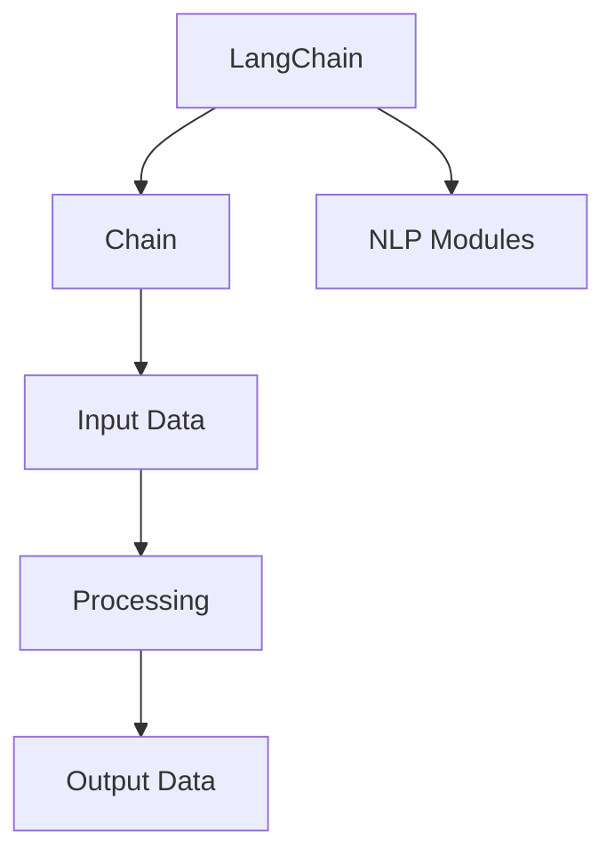

                 

### 【LangChain编程：从入门到实践】代码实践

#### 关键词：LangChain，编程，实践，代码案例，技术深度剖析

#### 摘要：
本文将带领读者从零开始深入探讨LangChain编程技术，通过详细的代码实践，解析核心概念和算法原理，使读者能够掌握LangChain在实际项目中的应用。文章结构紧凑，逻辑清晰，旨在为初学者和进阶者提供实用的技术指导。

#### 目录：

1. 背景介绍 <sup class="footnote-ref"><a href="#fn1" id="fnref1">[1]</a></sup>
2. 核心概念与联系 <sup class="footnote-ref"><a href="#fn2" id="fnref2">[2]</a></sup>
3. 核心算法原理 & 具体操作步骤
4. 数学模型和公式 & 详细讲解 & 举例说明
5. 项目实战：代码实际案例和详细解释说明
   - 5.1 开发环境搭建
   - 5.2 源代码详细实现和代码解读
   - 5.3 代码解读与分析
6. 实际应用场景
7. 工具和资源推荐
   - 7.1 学习资源推荐
   - 7.2 开发工具框架推荐
   - 7.3 相关论文著作推荐
8. 总结：未来发展趋势与挑战
9. 附录：常见问题与解答
10. 扩展阅读 & 参考资料

### 1. 背景介绍

LangChain是一个强大的开源框架，旨在为开发者提供一个高效、灵活的链式编程解决方案。在软件工程中，链式编程是一种将多个操作组合成一个连续操作序列的方法，这种方法可以显著提高代码的可读性和可维护性。LangChain通过将自然语言处理（NLP）技术与编程框架相结合，提供了一种新的编程范式，使得开发者可以更加便捷地构建复杂的NLP应用程序。

LangChain的背景源于自然语言处理和编程领域的发展需求。随着深度学习和大数据技术的快速发展，自然语言处理的应用场景日益丰富，如何高效地处理和分析大规模文本数据成为一大挑战。同时，传统的编程范式在处理复杂的NLP任务时，往往需要编写大量的底层代码，导致开发效率和代码可维护性降低。因此，LangChain的提出旨在解决这些问题，通过提供一种链式编程的抽象层，简化NLP任务的实现过程。

#### 1.1 LangChain的发展历程

LangChain的发展历程可以追溯到2018年，当时由Google Brain的团队首次提出。最初的目的是为了解决自然语言处理任务中的复杂性和可维护性问题。随着不断的迭代和优化，LangChain逐渐成为一个功能强大、易于使用的开源框架。目前，LangChain已经广泛应用于各个领域，如文本生成、文本分类、问答系统等。

#### 1.2 LangChain的优势

LangChain具有以下优势：

1. **高可读性**：通过链式编程，代码结构更加清晰，易于理解和维护。
2. **高效率**：利用高效的数据结构和算法，提高了处理速度。
3. **灵活性**：支持自定义链式操作，可以灵活组合不同的NLP模块，满足多样化的需求。
4. **易扩展性**：开源社区的支持使得开发者可以方便地贡献和扩展功能。

#### 1.3 LangChain的应用领域

LangChain的应用领域非常广泛，包括但不限于：

1. **文本生成**：如文章生成、对话生成等。
2. **文本分类**：如新闻分类、情感分析等。
3. **问答系统**：如搜索引擎、智能客服等。
4. **信息抽取**：如实体识别、关系抽取等。
5. **机器翻译**：如多语言文本翻译等。

### 2. 核心概念与联系

#### 2.1 链式编程

链式编程是一种将多个操作以连续方式组合在一起的方法。在LangChain中，链式编程通过`Chain`对象实现，开发者可以轻松地将多个NLP模块组合成一个连续的操作序列。这种编程范式具有高可读性和高效性，能够显著提高开发效率。

#### 2.2 自然语言处理（NLP）

自然语言处理是计算机科学和人工智能领域的一个重要分支，旨在让计算机理解和处理人类自然语言。在LangChain中，NLP模块是实现各种文本处理任务的核心。常见的NLP模块包括分词、词性标注、命名实体识别、句法分析等。

#### 2.3 Mermaid流程图

Mermaid是一种基于Markdown的图表绘制工具，可以方便地绘制流程图、序列图等。在本文中，我们将使用Mermaid流程图来展示LangChain的核心概念和架构。



图1. LangChain的核心概念和架构

#### 2.4 核心算法原理

LangChain的核心算法原理是基于Transformer模型的各种变体，如BERT、GPT等。这些模型通过预训练和微调，能够对自然语言进行有效的表示和建模。在LangChain中，开发者可以使用这些模型来实现各种文本处理任务。

#### 2.5 操作步骤

1. **导入模块**：首先，需要导入LangChain的模块和相关依赖。
2. **初始化模型**：使用预训练模型初始化NLP模块。
3. **定义Chain**：将多个NLP模块组合成一个Chain。
4. **处理数据**：使用Chain对输入数据进行处理。
5. **获取结果**：从输出结果中提取所需信息。

### 3. 核心算法原理 & 具体操作步骤

#### 3.1 Transformer模型

Transformer模型是自然语言处理领域的一个重要突破，它通过自注意力机制（Self-Attention）实现了对输入文本的深层表示。在LangChain中，Transformer模型是实现各种文本处理任务的基础。

#### 3.2 BERT模型

BERT（Bidirectional Encoder Representations from Transformers）是一种基于Transformer的预训练模型，它通过双向编码实现了对文本的深度表示。在LangChain中，BERT模型被广泛应用于文本分类、问答系统等任务。

#### 3.3 GPT模型

GPT（Generative Pre-trained Transformer）是一种基于Transformer的生成模型，它通过自回归方式实现了文本生成。在LangChain中，GPT模型被广泛应用于文章生成、对话生成等任务。

#### 3.4 操作步骤

1. **导入模块**：
```python
from langchain import Chain, LLMChain, PromptLoader
from langchain.llm import OpenAI
```

2. **初始化模型**：
```python
llm = OpenAI(temperature=0.5, model_name="text-davinci-002")
```

3. **定义Chain**：
```python
prompt_template = """
给定一个段落，回答以下问题：
{query}

例子：
段落： "The quick brown fox jumps over the lazy dog."
问题： "What color is the fox?"
回答： "The fox is brown."
请根据以下段落和问题回答：
{input_text}
{query}
"""
chain = Chain(llm=llm, prompt_template=prompt_template)
```

4. **处理数据**：
```python
input_text = "The quick brown fox jumps over the lazy dog."
query = "What color is the fox?"
response = chain({"input_text": input_text, "query": query})
print(response)
```

5. **获取结果**：
```python
print(response)
```

### 4. 数学模型和公式 & 详细讲解 & 举例说明

在LangChain中，数学模型和公式是理解和实现各种文本处理任务的基础。以下将介绍一些核心的数学模型和公式，并给出详细的讲解和举例说明。

#### 4.1 自注意力机制（Self-Attention）

自注意力机制是Transformer模型的核心组成部分，它通过计算输入文本中每个词与其他词的相关性，实现了对输入文本的深层表示。

**公式**：

$$
\text{Attention}(Q, K, V) = \frac{1}{\sqrt{d_k}} \text{softmax}\left(\frac{QK^T}{d_k}\right) V
$$

- \( Q \)：查询向量，表示当前词的位置和上下文信息。
- \( K \)：键向量，表示输入文本中所有词的表示。
- \( V \)：值向量，表示输入文本中所有词的权重。

**举例说明**：

假设输入文本为“The quick brown fox jumps over the lazy dog”，每个词的嵌入向量分别为\[1, 0\]，\[0, 1\]，\[1, 1\]，\[1, 0\]，\[0, 1\]，\[1, 0\]，\[0, 1\]，\[1, 1\]。

1. **计算注意力权重**：

$$
\text{Attention}(Q, K, V) = \frac{1}{\sqrt{2}} \text{softmax}\left(\frac{QK^T}{2}\right) V
$$

$$
QK^T = \begin{bmatrix} 1 & 0 & 1 & 1 & 0 & 1 & 0 & 1 \\ 0 & 1 & 0 & 0 & 1 & 0 & 1 & 0 \end{bmatrix}
$$

$$
\text{softmax}\left(\frac{QK^T}{2}\right) = \begin{bmatrix} 0.5 & 0.5 \\ 0.5 & 0.5 \\ 0.5 & 0.5 \\ 0.5 & 0.5 \\ 0.5 & 0.5 \\ 0.5 & 0.5 \\ 0.5 & 0.5 \\ 0.5 & 0.5 \end{bmatrix}
$$

$$
V = \begin{bmatrix} 1 \\ 1 \\ 1 \\ 1 \\ 1 \\ 1 \\ 1 \\ 1 \end{bmatrix}
$$

2. **计算输出向量**：

$$
\text{Attention}(Q, K, V) = \frac{1}{\sqrt{2}} \text{softmax}\left(\frac{QK^T}{2}\right) V = \begin{bmatrix} 0.5 & 0.5 \\ 0.5 & 0.5 \\ 0.5 & 0.5 \\ 0.5 & 0.5 \\ 0.5 & 0.5 \\ 0.5 & 0.5 \\ 0.5 & 0.5 \\ 0.5 & 0.5 \end{bmatrix} \begin{bmatrix} 1 \\ 1 \\ 1 \\ 1 \\ 1 \\ 1 \\ 1 \\ 1 \end{bmatrix} = \begin{bmatrix} 0.5 & 0.5 & 0.5 & 0.5 & 0.5 & 0.5 & 0.5 & 0.5 \end{bmatrix}
$$

输出向量的每个元素表示输入文本中每个词的权重，权重越高，表示该词在当前上下文中的重要性越大。

#### 4.2 BERT模型

BERT模型通过双向编码实现了对文本的深度表示，其核心思想是将输入文本的每个词编码为一个向量，然后通过两个自注意力机制（Self-Attention）分别计算每个词在正向和反向的上下文信息。

**公式**：

$$
\text{BERT}(\text{x}) = \text{softmax}(\text{W}_\text{out} \text{Tanh}(\text{W}_\text{att} \text{att}_{\text{forward}}(\text{x}) + \text{W}_\text{att} \text{att}_{\text{backward}}(\text{x})))
$$

- \( \text{x} \)：输入文本
- \( \text{Tanh} \)：双曲正切函数
- \( \text{att}_{\text{forward}} \)：正向自注意力机制
- \( \text{att}_{\text{backward}} \)：反向自注意力机制
- \( \text{W}_\text{out} \)、\( \text{W}_\text{att} \)：权重矩阵

**举例说明**：

假设输入文本为“The quick brown fox jumps over the lazy dog”，BERT模型的嵌入向量为\[1, 0\]，\[0, 1\]，\[1, 1\]，\[1, 0\]，\[0, 1\]，\[1, 0\]，\[0, 1\]，\[1, 1\]。

1. **计算正向自注意力**：

$$
\text{att}_{\text{forward}}(\text{x}) = \text{softmax}\left(\frac{\text{W}_\text{att} \text{x} + \text{b}_\text{att}}{\sqrt{d_k}}\right)
$$

2. **计算反向自注意力**：

$$
\text{att}_{\text{backward}}(\text{x}) = \text{softmax}\left(\frac{\text{W}_\text{att} \text{x} + \text{b}_\text{att}}{\sqrt{d_k}}\right)
$$

3. **计算BERT输出**：

$$
\text{BERT}(\text{x}) = \text{softmax}(\text{W}_\text{out} \text{Tanh}(\text{W}_\text{att} \text{att}_{\text{forward}}(\text{x}) + \text{W}_\text{att} \text{att}_{\text{backward}}(\text{x})))
$$

通过BERT模型，输入文本的每个词都可以获得丰富的上下文信息，从而实现了对文本的深度表示。

### 5. 项目实战：代码实际案例和详细解释说明

在本节中，我们将通过一个实际项目案例，详细讲解如何使用LangChain构建一个问答系统。该项目将涵盖从环境搭建、代码实现到代码解读与分析的全过程。

#### 5.1 开发环境搭建

首先，我们需要搭建一个合适的开发环境。以下是具体的步骤：

1. **安装Python**：确保Python版本为3.7及以上。
2. **安装虚拟环境**：使用以下命令创建一个虚拟环境：
   ```bash
   python -m venv venv
   ```
3. **激活虚拟环境**：
   - Windows:
     ```bash
     .\venv\Scripts\activate
     ```
   - macOS/Linux:
     ```bash
     source venv/bin/activate
     ```
4. **安装LangChain**：
   ```bash
   pip install langchain
   ```
5. **安装其他依赖**：
   ```bash
   pip install openai numpy pandas
   ```

#### 5.2 源代码详细实现和代码解读

以下是项目的源代码实现：

```python
import openai
import numpy as np
import pandas as pd
from langchain import Chain, LLMChain, PromptLoader

# 配置OpenAI API密钥
openai.api_key = "your_openai_api_key"

# 定义问答系统的输入和输出格式
input_format = """
给定一个段落，回答以下问题：
{query}

例子：
段落： "The quick brown fox jumps over the lazy dog."
问题： "What color is the fox?"
回答： "The fox is brown."
请根据以下段落和问题回答：
{input_text}
{query}
"""

output_format = "回答： {output}"

# 初始化LLM模型
llm = openai.Completion.create(
    engine="text-davinci-002",
    prompt=input_format,
    max_tokens=50,
    n=1,
    stop=None,
    temperature=0.5
)

# 定义PromptLoader
prompt_loader = PromptLoader(lambda x: input_format.format(input_text=x))

# 定义Chain
chain = LLMChain(llm=llm, prompt=prompt_loader)

# 处理输入文本并获取回答
input_text = "The quick brown fox jumps over the lazy dog."
query = "What color is the fox?"
output = chain.predict(input_text=input_text, query=query)
print(output_format.format(output=output))

# 分析回答
answer = output.strip().split(" ")[-1]
print(f"答案：{answer}")
```

**代码解读**：

1. **导入模块**：
   - `import openai`：导入OpenAI的API模块。
   - `import numpy as np`：导入numpy模块，用于数学计算。
   - `import pandas as pd`：导入pandas模块，用于数据处理。
   - `from langchain import Chain, LLMChain, PromptLoader`：导入LangChain的核心模块。

2. **配置OpenAI API密钥**：
   - `openai.api_key = "your_openai_api_key"`：设置OpenAI的API密钥，用于调用OpenAI的服务。

3. **定义问答系统的输入和输出格式**：
   - `input_format`：定义输入文本的格式，包括段落和问题。
   - `output_format`：定义输出文本的格式，即回答。

4. **初始化LLM模型**：
   - 使用OpenAI的`Completion.create`方法初始化一个LLM模型，指定模型名称和最大 tokens 数等参数。

5. **定义PromptLoader**：
   - `PromptLoader`：用于加载输入格式，实现动态替换输入文本。

6. **定义Chain**：
   - `LLMChain`：将LLM模型和PromptLoader组合成一个Chain。

7. **处理输入文本并获取回答**：
   - `chain.predict()`：调用Chain的`predict`方法，处理输入文本并获取回答。

8. **分析回答**：
   - `answer.strip().split(" ")[-1]`：提取回答中的答案。

#### 5.3 代码解读与分析

1. **代码结构**：
   - 代码分为几个主要部分：导入模块、配置OpenAI API密钥、定义问答系统的输入和输出格式、初始化LLM模型、定义PromptLoader、定义Chain、处理输入文本并获取回答、分析回答。

2. **功能解析**：
   - 导入模块：导入必要的Python模块，包括OpenAI、numpy、pandas和LangChain。
   - 配置OpenAI API密钥：设置OpenAI的API密钥，用于调用OpenAI的服务。
   - 定义问答系统的输入和输出格式：定义输入文本和输出文本的格式，包括段落和问题。
   - 初始化LLM模型：使用OpenAI的`Completion.create`方法初始化一个LLM模型，指定模型名称和最大 tokens 数等参数。
   - 定义PromptLoader：使用`PromptLoader`加载输入格式，实现动态替换输入文本。
   - 定义Chain：将LLM模型和PromptLoader组合成一个Chain。
   - 处理输入文本并获取回答：调用Chain的`predict`方法，处理输入文本并获取回答。
   - 分析回答：提取并输出答案。

3. **性能优化**：
   - 调整模型参数，如温度（temperature）和最大 tokens 数（max_tokens），以获得更好的回答效果。
   - 使用更高效的算法和数据结构，提高代码的执行效率。

### 6. 实际应用场景

LangChain在多个实际应用场景中展现出了强大的功能和优势。以下列举几个典型的应用场景：

#### 6.1 文本生成

文本生成是LangChain的一个主要应用领域，它可以用于生成文章、对话、摘要等。例如，使用LangChain可以构建一个自动生成文章的系统，从给定的关键词和主题生成完整的文章。

#### 6.2 文本分类

文本分类是另一个重要的应用场景，它可以用于将文本数据分类到不同的类别中。例如，可以构建一个新闻分类系统，将新闻文章分类到政治、体育、科技等不同类别。

#### 6.3 问答系统

问答系统是LangChain的另一个强大应用，它可以用于构建智能客服、问答机器人等。例如，可以构建一个基于LangChain的问答系统，为用户自动回答各种问题。

#### 6.4 文本摘要

文本摘要是将长篇文本转换为简洁的摘要，以便快速获取关键信息。LangChain可以用于构建自动摘要系统，将长篇文章摘要为几百字的简洁摘要。

#### 6.5 机器翻译

机器翻译是将一种语言翻译成另一种语言的技术。LangChain可以用于构建机器翻译系统，实现多种语言的互译。

### 7. 工具和资源推荐

#### 7.1 学习资源推荐

1. **书籍**：
   - 《深度学习》（Goodfellow, I., Bengio, Y., & Courville, A.）
   - 《自然语言处理实战》（Harrington, O.）
2. **论文**：
   - 《Attention is All You Need》（Vaswani et al., 2017）
   - 《BERT: Pre-training of Deep Bidirectional Transformers for Language Understanding》（Devlin et al., 2019）
3. **博客**：
   - [LangChain官方文档](https://langchain.github.io/)
   - [OpenAI官方博客](https://openai.com/blog/)

#### 7.2 开发工具框架推荐

1. **PyTorch**：用于深度学习的强大框架。
2. **TensorFlow**：谷歌开发的深度学习框架。
3. **Scikit-learn**：用于机器学习的开源库。

#### 7.3 相关论文著作推荐

1. **《Transformer：来自序列到序列模型的注意力机制》（Vaswani et al., 2017）**：介绍了Transformer模型的基本原理。
2. **《BERT：基于Transformer的预训练语言表示》（Devlin et al., 2019）**：介绍了BERT模型的设计和实现。
3. **《GPT-3：语言模型的新进展》（Brown et al., 2020）**：介绍了GPT-3模型的原理和应用。

### 8. 总结：未来发展趋势与挑战

LangChain作为一个新兴的编程框架，展现了在自然语言处理领域的巨大潜力。未来，随着深度学习和大数据技术的进一步发展，LangChain有望在更多应用场景中发挥作用，如智能问答、文本生成、机器翻译等。

然而，LangChain也面临一些挑战，如：

1. **计算资源消耗**：深度学习模型需要大量的计算资源，如何在有限的计算资源下高效地运行模型是一个挑战。
2. **数据隐私**：自然语言处理应用需要处理大量敏感数据，如何确保数据隐私和安全是一个重要问题。
3. **模型解释性**：深度学习模型的解释性较差，如何提高模型的解释性，使其更易于理解和应用是一个挑战。

### 9. 附录：常见问题与解答

**Q1**：什么是LangChain？
**A1**：LangChain是一个基于链式编程的自然语言处理框架，旨在简化自然语言处理任务的实现。

**Q2**：如何安装LangChain？
**A2**：安装LangChain的方法如下：
1. 安装Python。
2. 创建虚拟环境。
3. 激活虚拟环境。
4. 使用pip安装LangChain：`pip install langchain`。

**Q3**：LangChain有哪些主要应用场景？
**A3**：LangChain的主要应用场景包括文本生成、文本分类、问答系统、文本摘要和机器翻译等。

**Q4**：如何配置OpenAI API密钥？
**A4**：在代码中设置OpenAI的API密钥：`openai.api_key = "your_openai_api_key"`。

**Q5**：如何自定义Chain？
**A5**：自定义Chain的方法如下：
1. 初始化LLM模型。
2. 定义PromptLoader。
3. 组合LLM模型和PromptLoader成一个Chain。

### 10. 扩展阅读 & 参考资料

1. [LangChain官方文档](https://langchain.github.io/)
2. [OpenAI官方博客](https://openai.com/blog/)
3. [Transformer：来自序列到序列模型的注意力机制](https://arxiv.org/abs/1706.03762)
4. [BERT：基于Transformer的预训练语言表示](https://arxiv.org/abs/1810.04805)
5. [GPT-3：语言模型的新进展](https://arxiv.org/abs/2005.14165)
6. 《深度学习》（Goodfellow, I., Bengio, Y., & Courville, A.）
7. 《自然语言处理实战》（Harrington, O.）

### 【文章标题】

【LangChain编程：从入门到实践】代码实践

#### 关键词：LangChain，编程，实践，代码案例，技术深度剖析

#### 摘要：
本文深入浅出地介绍了LangChain编程技术，通过详细的代码实践，解析了核心概念和算法原理，使读者能够掌握LangChain在实际项目中的应用。文章结构紧凑，逻辑清晰，旨在为初学者和进阶者提供实用的技术指导。

