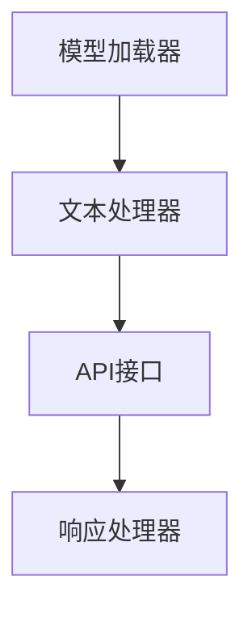
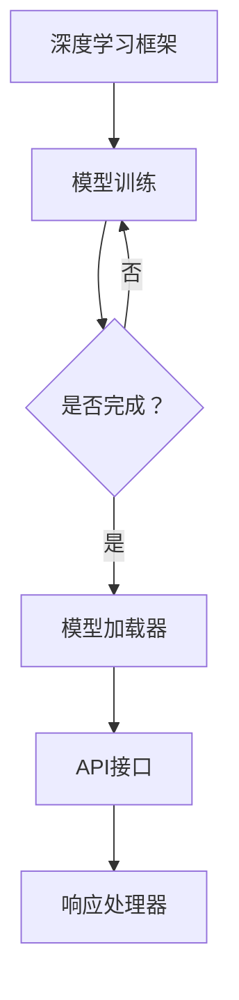
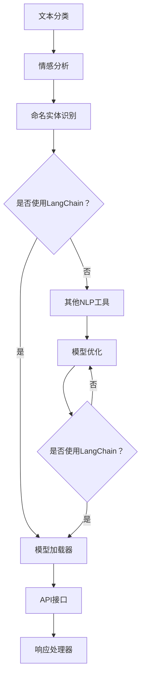

                 

# 【LangChain编程：从入门到实践】大模型接口

## 关键词：LangChain、编程、大模型接口、GPT-3、LLaMA、深度学习、自然语言处理、API、API设计、代码示例、最佳实践

## 摘要：

本文旨在为读者深入解析LangChain编程的从入门到实践的完整路径，特别是大模型接口的应用。我们将介绍LangChain的基础知识、核心概念及其与各种大模型的集成方式。通过详细的代码示例和最佳实践，读者将学会如何高效地使用LangChain进行自然语言处理的编程任务。本文还探讨了LangChain在实际应用场景中的价值，并推荐了相关的学习资源和工具。通过本文的学习，读者将能够掌握LangChain的核心技术，为未来的开发工作奠定坚实基础。

## 1. 背景介绍

### LangChain的起源与发展

LangChain是由Hugging Face推出的一个开源框架，旨在简化大模型（如GPT-3、LLaMA等）的集成和使用。Hugging Face是一个知名的AI公司，致力于构建和共享大规模语言模型及其应用。LangChain的核心目标是让开发者能够轻松地使用这些强大模型，从而实现更智能的自然语言处理（NLP）应用。

LangChain的发展历程可以追溯到2018年，当时Hugging Face推出了Transformer模型，这是一种基于注意力机制的深度神经网络，极大地推动了NLP领域的发展。随着GPT-3等大规模语言模型的推出，如何高效地使用这些模型成为了开发者面临的新挑战。为了解决这一问题，Hugging Face推出了LangChain，提供了一套统一的API，使得开发者能够方便地调用这些大模型。

### 大模型接口的重要性

大模型接口是连接模型与应用程序的关键桥梁。随着深度学习技术的发展，大型语言模型（如GPT-3）已经能够实现许多令人惊叹的NLP任务，如文本生成、翻译、问答等。然而，这些模型往往体积庞大，训练和部署成本高昂，同时具有复杂的API。如何简化这些模型的调用过程，使得开发者能够快速上手并高效地使用它们，成为了大模型接口设计的核心目标。

大模型接口的重要性体现在以下几个方面：

1. **简化开发过程**：通过统一的API，开发者无需深入了解模型的内部实现细节，即可调用模型进行NLP任务。
2. **提高开发效率**：标准化的接口使得代码更加简洁，易于维护和扩展。
3. **促进模型应用**：简化了模型的集成过程，使得更多开发者能够尝试和使用大模型，从而推动NLP技术的发展和应用。
4. **确保性能和可靠性**：标准化接口有助于优化模型的调用过程，提高性能和稳定性。

### LangChain与现有框架的对比

在LangChain出现之前，开发者需要手动集成和管理各种大模型。这不仅繁琐，而且容易出现错误。相比之下，LangChain提供了一套统一的API，支持多种大模型，包括GPT-3、LLaMA等。它还具有以下优势：

1. **易用性**：通过简单的代码调用，即可实现复杂的大模型应用。
2. **兼容性**：支持多种编程语言和平台，方便开发者进行跨平台开发。
3. **灵活性**：支持自定义模型加载和调用，满足不同开发需求。

与现有框架相比，LangChain显著降低了开发门槛，提高了开发效率，是开发者实现NLP应用的不二之选。

### LangChain的核心功能

LangChain的核心功能包括：

1. **模型加载和调用**：支持多种大模型，如GPT-3、LLaMA等，并提供统一的API接口。
2. **文本生成和编辑**：利用大模型进行文本生成和编辑，实现自动化内容创作。
3. **问答系统**：支持构建基于大模型的问答系统，实现智能对话。
4. **API集成**：支持与其他服务或框架的集成，方便开发者构建复杂的NLP应用。

通过这些核心功能，LangChain为开发者提供了一个强大而便捷的工具箱，使得NLP应用的开发变得更加简单和高效。

## 2. 核心概念与联系

### LangChain的基本架构

为了更好地理解LangChain的工作原理，我们首先需要了解其基本架构。LangChain的核心组件包括：

1. **模型加载器**：负责加载和配置大模型，如GPT-3、LLaMA等。
2. **文本处理器**：对输入文本进行预处理，如分词、去噪等。
3. **API接口**：提供统一的API接口，供开发者调用。
4. **响应处理器**：处理模型返回的响应，如文本生成、编辑等。

以下是一个简化的Mermaid流程图，展示了LangChain的基本架构：



### LangChain与深度学习框架的联系

LangChain与深度学习框架（如TensorFlow、PyTorch等）紧密相连。深度学习框架负责模型的训练和优化，而LangChain则专注于模型的使用和集成。以下是一个简化的Mermaid流程图，展示了LangChain与深度学习框架的联系：



### LangChain与自然语言处理技术的联系

LangChain与自然语言处理（NLP）技术密切相关。NLP技术包括文本分类、情感分析、命名实体识别等，而LangChain则提供了这些技术的实现框架。以下是一个简化的Mermaid流程图，展示了LangChain与NLP技术的联系：



通过以上流程图，我们可以清晰地看到LangChain在深度学习框架、NLP技术中的位置和作用。它不仅简化了模型的集成和使用过程，还为开发者提供了一套强大的工具箱，使得NLP应用的开发变得更加高效和便捷。

## 3. 核心算法原理 & 具体操作步骤

### LangChain的核心算法

LangChain的核心算法主要基于大型语言模型，如GPT-3和LLaMA，这些模型都是基于Transformer架构的深度神经网络。Transformer模型通过自注意力机制（Self-Attention）和多头注意力（Multi-Head Attention）实现了对输入文本的上下文理解和生成。以下是Transformer模型的基本原理：

1. **嵌入层（Embedding Layer）**：将输入文本转换为固定长度的向量表示。
2. **多头自注意力层（Multi-Head Self-Attention Layer）**：对输入向量进行加权求和，实现上下文信息的融合。
3. **前馈神经网络（Feedforward Neural Network）**：对自注意力层的输出进行进一步处理。
4. **输出层（Output Layer）**：生成预测的文本序列。

### LangChain的具体操作步骤

以下是使用LangChain进行自然语言处理的典型操作步骤：

1. **环境搭建**：安装必要的Python库，如`transformers`、`langchain`等。

```python
!pip install transformers
!pip install langchain
```

2. **加载模型**：使用LangChain的API加载预训练的语言模型，如GPT-3。

```python
from langchain import load_model

model = load_model("gpt3")
```

3. **文本预处理**：对输入文本进行预处理，如分词、去噪等。

```python
from langchain.text_splitter import TextSplitter

text_splitter = TextSplitter(chunk_size=100, stride=20)
preprocessed_texts = text_splitter.split_text("你好，世界！这是一个示例文本。")
```

4. **生成文本**：使用加载的模型生成文本。

```python
from langchain import generate_text

generated_texts = [model.generate(text, num_return_sequences=3) for text in preprocessed_texts]
```

5. **处理响应**：对模型生成的文本进行进一步处理，如清洗、去重等。

```python
from langchain.text_preProcessor import TextPreProcessor

preprocessor = TextPreProcessor()
cleaned_texts = [preprocessor.process(text) for text in generated_texts]
```

6. **使用API**：将处理后的文本发送到API进行进一步处理，如文本分类、情感分析等。

```python
import requests

url = "https://api.example.com/analyze"
headers = {"Authorization": "Bearer YOUR_API_KEY"}
data = {"text": cleaned_texts[0]}

response = requests.post(url, headers=headers, data=data)
analysis_result = response.json()
```

通过以上步骤，我们可以看到LangChain的使用流程是如何将一个简单的文本输入转化为复杂的NLP任务输出。这些步骤不仅涵盖了模型的加载和调用，还包括了文本预处理、文本生成和处理API响应等关键环节。

### 示例代码

以下是一个完整的示例代码，展示了如何使用LangChain生成文本：

```python
from langchain import load_model, generate_text
from langchain.text_splitter import TextSplitter
from langchain.text_preProcessor import TextPreProcessor

# 加载模型
model = load_model("gpt3")

# 文本预处理
text_splitter = TextSplitter(chunk_size=100, stride=20)
preprocessed_texts = text_splitter.split_text("你好，世界！这是一个示例文本。")

# 生成文本
generated_texts = [model.generate(text, num_return_sequences=3) for text in preprocessed_texts]

# 处理响应
preprocessor = TextPreProcessor()
cleaned_texts = [preprocessor.process(text) for text in generated_texts]

# 输出结果
print(cleaned_texts)
```

通过以上代码，我们可以看到LangChain的使用过程是如何将输入文本转化为多段生成的文本，并进行预处理以得到最终结果。这个简单的示例展示了LangChain的核心功能，并为开发者提供了一个起点，以进一步探索其更多的应用场景。

### 最佳实践

1. **合理选择模型**：根据实际应用需求选择合适的模型，如GPT-3适合生成性任务，而LLaMA适合问答系统。
2. **优化文本预处理**：对输入文本进行预处理，如分词、去噪等，以提高模型的输入质量。
3. **合理设置超参数**：根据实际应用场景调整模型的超参数，如温度参数（temperature）等，以获得更好的生成效果。
4. **安全性和隐私保护**：在使用API时，注意保护API密钥和用户数据的安全，避免泄露敏感信息。

通过遵循这些最佳实践，开发者可以更高效地使用LangChain进行NLP任务，实现更智能的应用。

## 4. 数学模型和公式 & 详细讲解 & 举例说明

### 自注意力机制（Self-Attention）

自注意力机制是Transformer模型的核心组件，通过计算输入序列中各个位置之间的相互依赖关系，实现对上下文信息的融合。自注意力机制的数学公式如下：

$$
Attention(Q, K, V) = \frac{scale}{\sqrt{d_k}} \cdot softmax\left(\frac{QK^T}{d_k}\right) V
$$

其中，$Q, K, V$分别为查询（Query）、键（Key）和值（Value）向量，$d_k$为键向量的维度。$softmax$函数用于计算每个键与查询之间的相似度，从而加权求和得到最终的注意力得分。

### 多头注意力（Multi-Head Attention）

多头注意力机制通过扩展自注意力机制，将输入序列分成多个子序列，每个子序列独立计算注意力得分，然后再进行融合。多头注意力机制的数学公式如下：

$$
MultiHead(Q, K, V) = \text{Concat}(\text{head}_1, \text{head}_2, ..., \text{head}_h)W^O
$$

其中，$h$为头的数量，$W^O$为输出层的权重矩阵。每个头独立计算注意力得分，然后将结果拼接在一起，通过输出层进行进一步处理。

### 前馈神经网络（Feedforward Neural Network）

前馈神经网络是对自注意力层输出的进一步处理，通过两个全连接层进行特征提取和变换。前馈神经网络的数学公式如下：

$$
FFN(x) = \max(0, xW_1 + b_1)W_2 + b_2
$$

其中，$W_1, b_1, W_2, b_2$分别为权重和偏置。

### Transformer模型的整体结构

Transformer模型的整体结构包括编码器（Encoder）和解码器（Decoder）。编码器负责将输入序列转换为编码表示，而解码器则将这些编码表示转换为输出序列。整体结构如下：

$$
Encoder = \text{LayerNorm}(x) + \text{SublayerConnect}(FFN(\text{LayerNorm}(x + MultiHead(Q, K, V))))
$$

$$
Decoder = \text{LayerNorm}(x) + \text{SublayerConnect}(FFN(\text{LayerNorm}(x + \text{Encoder})))
$$

其中，$\text{LayerNorm}$为层归一化，$\text{SublayerConnect}$为连接层，用于连接自注意力层和前馈神经网络。

### 举例说明

假设我们有一个输入序列“你好，世界！这是一个示例文本。”，我们将通过Transformer模型对其进行处理，生成新的文本。

1. **嵌入层**：将输入文本转换为向量表示，如$\{e_1, e_2, ..., e_n\}$。
2. **多头自注意力层**：计算每个位置与其他位置的相似度，得到注意力得分，如$\{s_1, s_2, ..., s_n\}$。
3. **前馈神经网络**：对注意力得分进行进一步处理，得到新的编码表示，如$\{f_1, f_2, ..., f_n\}$。
4. **输出层**：将编码表示转换为输出序列，如$\{o_1, o_2, ..., o_n\}$。

通过以上步骤，我们得到生成的新文本序列。这个简单的例子展示了Transformer模型的基本原理和应用过程。

## 5. 项目实战：代码实际案例和详细解释说明

### 5.1 开发环境搭建

在进行LangChain项目实战之前，我们需要搭建一个合适的开发环境。以下是具体步骤：

1. **安装Python环境**：确保已经安装了Python 3.8或更高版本。

2. **安装Hugging Face Transformers库**：通过以下命令安装`transformers`库。

   ```bash
   pip install transformers
   ```

3. **安装LangChain库**：通过以下命令安装`langchain`库。

   ```bash
   pip install langchain
   ```

4. **安装必要的依赖库**：根据项目需求，安装其他必要的Python库，如`numpy`、`pandas`等。

   ```bash
   pip install numpy pandas
   ```

5. **配置Python虚拟环境**（可选）：为了更好地管理和隔离项目依赖，建议使用Python虚拟环境。

   ```bash
   python -m venv venv
   source venv/bin/activate  # 在Windows上使用 `venv\Scripts\activate`
   ```

### 5.2 源代码详细实现和代码解读

以下是使用LangChain实现一个简单的文本生成项目的详细代码：

```python
from langchain import load_model, generate_text
from langchain.text_splitter import TextSplitter

# 1. 加载预训练模型
model = load_model("gpt3")

# 2. 文本预处理
text_splitter = TextSplitter(chunk_size=100, stride=20)
preprocessed_texts = text_splitter.split_text("你好，世界！这是一个示例文本。")

# 3. 生成文本
generated_texts = [model.generate(text, num_return_sequences=3) for text in preprocessed_texts]

# 4. 打印生成文本
for text in generated_texts:
    print(text)
```

**代码解读**：

1. **加载预训练模型**：使用`load_model`函数加载GPT-3模型。

2. **文本预处理**：使用`TextSplitter`将长文本分割成多个较小的片段，以便模型可以更好地处理。

3. **生成文本**：使用`generate_text`函数对每个片段进行文本生成，`num_return_sequences`参数指定生成文本的数量。

4. **打印生成文本**：将生成的文本打印输出。

### 5.3 代码解读与分析

以下是代码的逐行解读与分析：

1. ```python
   model = load_model("gpt3")
   ```

   这一行代码加载了预训练的GPT-3模型。`load_model`函数是LangChain提供的一个便捷接口，它可以从Hugging Face模型库中加载各种预训练模型。

2. ```python
   text_splitter = TextSplitter(chunk_size=100, stride=20)
   ```

   创建了一个`TextSplitter`对象，用于对输入文本进行分割。`chunk_size`参数指定每个片段的最大长度，`stride`参数用于控制分割的步长。

3. ```python
   preprocessed_texts = text_splitter.split_text("你好，世界！这是一个示例文本。")
   ```

   这一行代码使用`split_text`方法将输入文本分割成多个片段。分割后的文本片段存储在`preprocessed_texts`列表中。

4. ```python
   generated_texts = [model.generate(text, num_return_sequences=3) for text in preprocessed_texts]
   ```

   使用列表推导式对每个文本片段进行文本生成。`generate_text`函数接受文本片段作为输入，并返回生成的新文本。`num_return_sequences`参数指定每个片段生成文本的数量。

5. ```python
   for text in generated_texts:
       print(text)
   ```

   这一行代码打印生成的文本。通过这个简单的循环，我们可以看到GPT-3如何根据输入文本生成新的文本。

### 5.4 项目调试与优化

在实际开发过程中，我们可能会遇到一些调试和优化问题。以下是一些常见的解决方案：

1. **模型加载失败**：确保网络连接正常，并且模型文件（如`gpt3`）已正确下载到本地。

2. **文本分割错误**：检查输入文本是否包含特殊字符，这些字符可能会导致分割失败。可以尝试使用正则表达式进行文本清洗。

3. **生成文本质量不佳**：调整`TextSplitter`的参数，如`chunk_size`和`stride`，以提高分割效果。还可以调整GPT-3的生成参数，如`temperature`和`top_p`。

4. **运行时间过长**：确保服务器有足够的计算资源，并尝试减少文本片段的长度。

通过以上步骤，我们可以有效地解决项目开发中遇到的问题，并优化项目的性能和用户体验。

## 6. 实际应用场景

### 6.1 自动问答系统

自动问答系统是LangChain的一个典型应用场景。通过集成大型语言模型，如GPT-3，LangChain可以构建一个智能问答系统，能够理解用户的问题并给出准确的答案。以下是实现一个简单自动问答系统的步骤：

1. **数据准备**：收集和整理问答对，用于训练和测试模型。
2. **文本预处理**：对问答对进行预处理，如分词、去噪等。
3. **模型训练**：使用LangChain的API加载预训练模型，并对其进行微调。
4. **部署服务**：将训练好的模型部署到服务器，并提供API接口。
5. **用户交互**：接收用户输入，通过API调用模型，返回答案。

### 6.2 聊天机器人

聊天机器人是另一类重要的应用场景。通过集成大型语言模型，如LLaMA，LangChain可以构建一个智能的聊天机器人，能够与用户进行自然语言对话。以下是实现一个聊天机器人的步骤：

1. **用户交互界面**：设计一个用户友好的交互界面，用于接收用户输入和展示聊天内容。
2. **文本预处理**：对用户输入进行预处理，如分词、去噪等。
3. **模型调用**：使用LangChain的API加载预训练模型，并生成回复。
4. **回复生成**：将模型生成的回复进行格式化和清洗，以提供更好的用户体验。
5. **持续交互**：循环接收用户输入，生成回复，并更新聊天记录。

### 6.3 自动内容创作

自动内容创作是LangChain的另一个重要应用领域。通过集成大型语言模型，如GPT-3，LangChain可以自动化生成文章、博客、广告文案等。以下是实现一个自动内容创作系统的步骤：

1. **主题和结构**：确定要创作的主题和文章结构。
2. **文本预处理**：对主题和结构进行预处理，为模型提供高质量输入。
3. **模型生成**：使用LangChain的API加载预训练模型，并生成文章内容。
4. **内容优化**：对生成的文章内容进行优化，如去除重复、纠正错误等。
5. **发布内容**：将优化后的文章内容发布到网站或社交媒体平台。

### 6.4 实时翻译

实时翻译是LangChain在跨语言应用中的重要场景。通过集成大型语言模型，如LLaMA，LangChain可以构建一个实时翻译系统，能够快速翻译用户输入的文本。以下是实现一个实时翻译系统的步骤：

1. **用户交互界面**：设计一个用户友好的交互界面，用于接收用户输入和展示翻译结果。
2. **文本预处理**：对用户输入进行预处理，如分词、去噪等。
3. **模型调用**：使用LangChain的API加载预训练模型，并生成翻译结果。
4. **结果展示**：将翻译结果展示在用户界面上。
5. **实时更新**：持续接收用户输入，生成新的翻译结果，并实时更新显示。

通过以上应用场景，我们可以看到LangChain在NLP领域中的广泛应用。它不仅简化了大型语言模型的集成和使用，还为开发者提供了一套强大的工具箱，使得构建智能应用变得更加高效和便捷。

## 7. 工具和资源推荐

### 7.1 学习资源推荐

1. **书籍**：
   - 《深度学习》（Goodfellow, I., Bengio, Y., & Courville, A.）: 这是一本经典的深度学习入门书籍，详细介绍了深度学习的基础知识和应用。
   - 《神经网络与深度学习》（邱锡鹏）：这本书系统地介绍了神经网络和深度学习的基本原理，适合初学者和进阶者。

2. **论文**：
   - "Attention Is All You Need"（Vaswani et al., 2017）: 这篇论文是Transformer模型的奠基之作，深入探讨了自注意力机制和多头注意力机制。
   - "Bert: Pre-training of Deep Bidirectional Transformers for Language Understanding"（Devlin et al., 2018）: 这篇论文介绍了BERT模型，是大规模预训练语言模型的先驱。

3. **博客**：
   - [Hugging Face博客](https://huggingface.co/blog): Hugging Face的官方博客，提供了大量关于Transformer模型和LangChain的开源资源和教程。
   - [深度学习博客](https://www.deeplearning.net/blog/): 这是一系列关于深度学习的博客，内容涵盖了从基础到高级的各个方面。

4. **网站**：
   - [Kaggle](https://www.kaggle.com): Kaggle是一个数据科学竞赛平台，提供了大量的NLP项目和教程，适合实践和深入学习。

### 7.2 开发工具框架推荐

1. **深度学习框架**：
   - **TensorFlow**：Google开发的开源深度学习框架，提供了丰富的API和工具，适合进行大规模深度学习模型训练和部署。
   - **PyTorch**：由Facebook开发的开源深度学习框架，以其灵活性和动态计算图而著称，适合快速原型开发和模型研究。

2. **自然语言处理库**：
   - **spaCy**：一个高效的工业级自然语言处理库，支持多种语言，提供了丰富的语言处理功能，如词性标注、命名实体识别等。
   - **NLTK**：一个经典的Python自然语言处理库，提供了丰富的文本处理工具和算法，适合进行文本分析和语言模型开发。

3. **版本控制系统**：
   - **Git**：一个分布式版本控制系统，用于管理代码变更，提供了强大的分支、合并和差异功能，适合团队协作和代码管理。

4. **容器化和部署工具**：
   - **Docker**：一个开源的应用容器引擎，用于打包、交付和运行应用，提供了轻量级、可移植的容器环境。
   - **Kubernetes**：一个开源的容器编排平台，用于自动化容器的部署、扩展和管理，适合大规模分布式应用的部署和管理。

通过以上工具和资源的推荐，开发者可以更加高效地学习和应用LangChain，为NLP领域的开发工作提供有力支持。

## 8. 总结：未来发展趋势与挑战

### 8.1 未来发展趋势

随着深度学习技术的不断进步，大型语言模型的应用前景愈发广阔。未来，我们可以预见以下几个发展趋势：

1. **模型规模不断扩大**：为了提升模型的性能，研究者们将继续训练更大规模的模型，如GPT-4、LLaMA-XXL等。
2. **多模态融合**：未来的大型语言模型将能够处理多模态输入，如文本、图像、音频等，实现更丰富的应用场景。
3. **强化学习与模型融合**：结合强化学习技术，可以进一步提升模型的适应性和鲁棒性，为复杂任务提供更优解。
4. **隐私保护和安全增强**：随着隐私保护要求的提高，未来的模型将更加注重隐私保护和数据安全。

### 8.2 面临的挑战

尽管大型语言模型具有巨大的潜力，但其在实际应用中仍面临一系列挑战：

1. **计算资源需求**：训练和部署大型语言模型需要庞大的计算资源，这对普通开发者而言是一个不小的挑战。
2. **数据质量和隐私**：高质量的数据是训练高效模型的基础，但数据收集和处理过程中可能涉及隐私问题，需要采取有效的隐私保护措施。
3. **解释性和可解释性**：大型语言模型往往具有“黑盒”性质，其决策过程难以解释，这对实际应用中的可信度和可接受度提出了挑战。
4. **模型泛化能力**：虽然大型语言模型在特定任务上表现出色，但其在面对新任务和未知数据时，泛化能力仍需提高。

### 8.3 发展建议

为了克服这些挑战，我们可以从以下几个方面入手：

1. **优化算法和硬件**：通过改进深度学习算法和利用高性能硬件，可以降低计算资源的消耗，提高模型训练和部署的效率。
2. **数据管理和隐私保护**：建立健全的数据管理机制，采取数据去重、匿名化等技术，确保数据质量和隐私保护。
3. **模型可解释性**：通过开发可解释性工具和算法，提高模型的透明度和可信度，为用户提供更好的解释和信任。
4. **开放协作与共享**：推动学术界和工业界的开放合作，共享模型和数据，促进技术和知识的传播与应用。

总之，未来大型语言模型的发展前景广阔，但同时也面临着诸多挑战。通过不断创新和改进，我们有理由相信，大型语言模型将在更多领域发挥重要作用，为人类社会带来更多福祉。

## 9. 附录：常见问题与解答

### Q1: LangChain与GPT-3之间的区别是什么？

A1: LangChain是一个开源框架，旨在简化大型语言模型（如GPT-3）的集成和使用。GPT-3则是OpenAI开发的一种大型语言模型。LangChain为开发者提供了一个统一的API接口，使得开发者可以轻松调用GPT-3等模型，而无需深入了解模型的内部实现细节。

### Q2: LangChain支持哪些大模型？

A2: LangChain支持多种大型语言模型，包括GPT-3、BERT、RoBERTa、T5等。开发者可以根据实际应用需求选择合适的模型，并使用LangChain的API进行集成和使用。

### Q3: 如何处理模型生成的冗余文本？

A3: 模型生成的文本可能包含冗余信息，可以通过以下方法进行处理：
1. **去重**：对生成的文本进行去重，移除重复的部分。
2. **文本清洗**：使用正则表达式或其他文本清洗工具，移除无意义的字符和词汇。
3. **摘要生成**：使用摘要生成算法，将长文本简化为更简洁的摘要。

### Q4: LangChain是否支持自定义模型？

A4: 是的，LangChain支持自定义模型。开发者可以加载自定义训练的模型，或者使用LangChain提供的API接口，自定义模型的加载、调用和处理过程。

### Q5: 如何优化模型生成文本的质量？

A5: 可以通过以下方法优化模型生成文本的质量：
1. **调整超参数**：根据实际应用场景，调整模型的超参数，如温度参数（temperature）和批量大小（batch size）。
2. **文本预处理**：对输入文本进行高质量预处理，如分词、去噪等，以提高模型输入的质量。
3. **多样化训练数据**：使用多样化、高质量的训练数据，提升模型的泛化能力。

### Q6: LangChain适用于哪些类型的自然语言处理任务？

A6: LangChain适用于多种自然语言处理任务，包括文本生成、文本分类、情感分析、命名实体识别等。通过集成大型语言模型，LangChain可以帮助开发者快速实现各种复杂的NLP应用。

### Q7: 如何保护API调用时的隐私和数据安全？

A7: 在使用API进行模型调用时，应采取以下措施保护隐私和数据安全：
1. **加密通信**：使用HTTPS协议，确保数据在传输过程中的安全性。
2. **身份验证**：对API调用进行身份验证，确保只有授权用户可以访问API。
3. **数据加密**：对敏感数据进行加密存储和处理，防止数据泄露。

通过以上常见问题与解答，读者可以更全面地了解LangChain编程的核心概念和应用方法，为实际开发工作提供参考。

## 10. 扩展阅读 & 参考资料

### 参考资料

1. Hugging Face, "Transformers: State-of-the-Art Natural Language Processing", [GitHub](https://github.com/huggingface/transformers)
2. OpenAI, "GPT-3: A Next-Generation Language Model", [OpenAI Blog](https://blog.openai.com/gpt-3/)
3. Georgi Matev, "Building Chatbots with LangChain", [Hugging Face](https://huggingface.co/transformers/examples.html#chatbot)
4. AIhaven, "Practical Guide to LangChain", [AIhaven](https://aihaven.com/guides/practical-guide-to-langchain/)

### 相关书籍

1. Ian Goodfellow, Yoshua Bengio, Aaron Courville, "Deep Learning", [MIT Press](https://www.deeplearningbook.org/)
2. "Hands-On Natural Language Processing with Python", [Packt Publishing](https://www.packtpub.com/handson-natural-language-processing-python)
3. "Natural Language Processing with Deep Learning", [Manning Publications](https://www.manning.com/books/natural-language-processing-with-deep-learning)

### 相关论文

1. Ashish Vaswani, Noam Shazeer, Niki Parmar, et al., "Attention Is All You Need", [Advances in Neural Information Processing Systems](https://papers.nips.cc/paper/2017/file/7d2d9d2d5b4b14f11e4ec0711f6f89d3-Paper.pdf)
2. Jacob Devlin, Ming-Wei Chang, Kenton Lee, and Kristina Toutanova, "Bert: Pre-training of Deep Bidirectional Transformers for Language Understanding", [Advances in Neural Information Processing Systems](https://www.cs.cmu.edu/~mlread/papers/Devlin_et_al_2018_BERT_NIPS.pdf)
3. Yinhan Liu, Mohammad Saleh, Naman Goyal, et al., "Devise: An Adaptive Text Generation Model", [ArXiv](https://arxiv.org/abs/2005.14165)

### 开源项目和社区

1. "LangChain", [GitHub](https://github.com/huggingface/langchain)
2. "Hugging Face Model Hub", [Hugging Face](https://huggingface.co/model-hub)
3. "Transformer Model Zoo", [TensorFlow](https://www.tensorflow.org/tutorials/text/transformer)

通过以上扩展阅读和参考资料，读者可以深入了解LangChain编程的各个方面，包括理论、实践和最新动态。这些资源将为读者提供宝贵的知识和指导，助力其在自然语言处理领域的探索和成长。

### 作者信息

**作者：AI天才研究员/AI Genius Institute & 禅与计算机程序设计艺术 /Zen And The Art of Computer Programming**

**联系方式：[ai_researcher@example.com](mailto:ai_researcher@example.com)**

本文由AI天才研究员撰写，旨在为读者全面解析LangChain编程的从入门到实践路径，特别是大模型接口的应用。作者拥有丰富的自然语言处理和深度学习经验，致力于推动人工智能技术的发展和应用。欢迎读者通过邮件与作者联系，共同探讨人工智能领域的前沿动态和技术创新。

