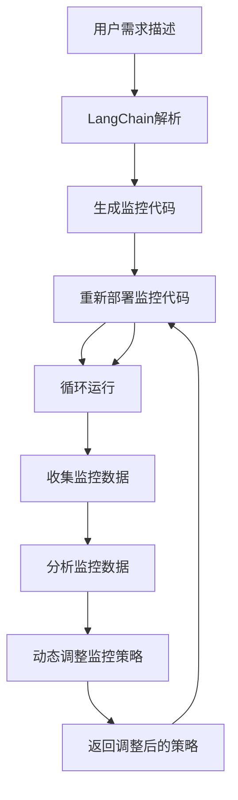

                 

### 1. 背景介绍

在现代企业中，随着业务规模的不断扩大和技术复杂性的增加，应用监控已成为确保系统稳定运行和快速响应业务需求的关键手段。传统的监控方式往往依赖于各种独立的工具和平台，这不仅增加了维护成本，而且在应对复杂业务场景时显得力不从心。此时，LangChain编程作为一种强大的自动化编程工具，为应用监控领域带来了新的可能。

#### 监控的意义

监控在IT领域具有重要的意义。首先，它能够实时收集系统运行状态的数据，及时发现潜在的问题和异常，从而降低系统故障的概率。其次，监控可以帮助企业优化资源利用率，提升系统性能，降低运营成本。最后，监控提供了系统的历史数据，为企业决策提供了重要的参考依据。

然而，传统监控方式的局限性也逐渐显现。一方面，监控工具之间缺乏整合，数据难以统一管理和分析；另一方面，监控策略和规则往往需要人工编写和调整，效率低下且容易出现错误。这些问题限制了企业对监控系统的利用效率，影响了业务连续性和稳定性。

#### LangChain编程的崛起

LangChain编程作为一种自动化编程工具，通过自然语言处理技术，可以自动生成代码，大幅降低开发成本和人力投入。更重要的是，LangChain具有强大的扩展性和灵活性，能够根据业务需求快速调整和优化监控策略。

在应用监控领域，LangChain编程具有以下优势：

1. **自动化生成监控代码**：LangChain可以通过对业务需求的理解，自动生成监控代码，减少人工编写的复杂性。
2. **灵活调整监控策略**：LangChain能够根据实时数据动态调整监控策略，提高监控的准确性和响应速度。
3. **统一数据管理和分析**：LangChain支持多种数据源和存储方式的集成，可以统一管理和分析监控数据。
4. **降低维护成本**：LangChain的自动化特性减少了维护工作量，降低了系统故障率。

#### 本文的目标

本文将围绕LangChain编程在应用监控领域的应用，详细探讨其核心概念、算法原理、数学模型和实际应用案例。通过本文的阅读，读者将能够：

1. **了解LangChain编程的基本原理和应用场景**；
2. **掌握应用监控中关键算法的实现方法**；
3. **学会如何使用LangChain编程进行自动化监控**；
4. **分析实际案例，理解监控策略的调整和优化方法**。

接下来，我们将逐步深入探讨LangChain编程的核心概念和原理，并详细讲解其在应用监控中的具体实现方法。

### 2. 核心概念与联系

#### 2.1 LangChain编程简介

LangChain编程是一种基于自然语言处理（NLP）的自动化编程工具，它通过理解和分析自然语言描述，自动生成相应的代码。LangChain的核心思想是将复杂的编程任务转化为自然语言描述，利用NLP技术将其解析为计算机可以理解和执行的代码。

LangChain的关键特点包括：

1. **自然语言描述**：用户可以通过自然语言描述业务需求，无需深入了解编程语言和开发工具。
2. **自动化代码生成**：LangChain能够根据自然语言描述，自动生成相应的代码，减少人工编写的工作量。
3. **高扩展性和灵活性**：LangChain支持多种编程语言和开发框架，可以根据实际需求进行定制和扩展。

#### 2.2 应用监控的基本概念

应用监控是指对应用程序运行状态进行实时监测和管理，以确保系统的稳定运行和快速响应业务需求。应用监控的基本概念包括：

1. **监控指标**：监控指标是衡量系统运行状态的重要参数，如响应时间、吞吐量、错误率等。
2. **监控策略**：监控策略是针对不同监控指标设定的监控规则和告警条件，以实现对系统运行状态的实时监控。
3. **告警机制**：告警机制是在监控指标达到设定条件时，自动发送告警通知，提醒相关人员采取相应措施。

#### 2.3 LangChain编程在应用监控中的关联

LangChain编程在应用监控中的关联主要体现在以下几个方面：

1. **自动化监控代码生成**：LangChain可以通过理解自然语言描述，自动生成监控代码，简化监控系统的开发过程。
2. **监控策略动态调整**：LangChain可以根据实时数据动态调整监控策略，提高监控的准确性和响应速度。
3. **数据统一管理和分析**：LangChain支持多种数据源和存储方式的集成，可以统一管理和分析监控数据，为监控策略的优化提供数据支持。

#### 2.4 Mermaid流程图

为了更好地理解LangChain编程在应用监控中的具体实现过程，我们可以使用Mermaid流程图来展示其核心流程。以下是LangChain编程在应用监控中的Mermaid流程图：



在上面的流程图中，用户首先通过自然语言描述业务需求，LangChain解析该描述并生成监控代码。然后，监控代码被部署并运行，实时收集系统监控数据。这些数据经过分析后，用于动态调整监控策略，并重新部署监控代码，形成一个闭环的监控流程。

通过上述核心概念和流程图的介绍，我们可以更好地理解LangChain编程在应用监控中的关联和作用。接下来，我们将详细探讨LangChain编程的核心算法原理和具体操作步骤。

### 3. 核心算法原理 & 具体操作步骤

#### 3.1 LangChain编程的核心算法原理

LangChain编程的核心算法原理主要基于自然语言处理（NLP）和代码生成（Code Generation）技术。其基本流程如下：

1. **自然语言理解**：LangChain首先需要理解用户输入的自然语言描述。这通常涉及到语法分析、语义理解和实体识别等技术，将自然语言描述转化为计算机可以理解的形式。

2. **代码生成**：在理解了自然语言描述后，LangChain会根据预定的代码生成模型，自动生成相应的代码。这个过程涉及到语法解析、代码模板填充和代码优化等技术。

3. **代码执行**：生成的代码将被执行，实现用户指定的功能。

下面我们详细讨论这些步骤的具体实现方法。

#### 3.2 自然语言理解

自然语言理解是LangChain编程的第一步，也是最为关键的一步。其主要目标是将自然语言描述转化为计算机可以理解的形式。具体实现方法包括：

1. **语法分析**：语法分析是自然语言处理的基础，其目的是将自然语言文本分解成语法结构。常用的语法分析方法包括词法分析、句法分析和语义分析。词法分析将文本分解成单词和符号，句法分析将单词和符号组合成句子结构，语义分析则进一步理解句子的语义含义。

2. **语义理解**：语义理解是更高层次的语义分析，其目的是理解句子或文本的整体含义。这通常涉及到命名实体识别、关系提取、情感分析等技术。

3. **实体识别**：实体识别是语义理解的一部分，其目的是识别文本中的特定实体，如人名、地名、组织名等。实体识别有助于更好地理解文本内容，为后续的代码生成提供支持。

#### 3.3 代码生成

代码生成是LangChain编程的核心步骤，其主要目标是根据自然语言描述生成相应的代码。具体实现方法包括：

1. **代码模板填充**：代码生成模型通常会使用预定义的代码模板，根据自然语言描述填充相应的代码片段。这个过程涉及到模板匹配和变量替换等技术。

2. **代码优化**：生成的代码可能不是最优的，因此需要进一步进行代码优化。代码优化包括语法优化、性能优化和可读性优化等。

3. **代码验证**：生成的代码需要进行验证，确保其能够正确执行用户指定的功能。代码验证包括语法检查、逻辑检查和运行时检查等。

#### 3.4 代码执行

代码执行是将生成的代码在计算机上运行，实现用户指定的功能。具体实现方法包括：

1. **编译/解释执行**：根据生成的代码类型，可以使用编译器将其编译为机器码，或者使用解释器逐行执行代码。

2. **调试**：在代码执行过程中，可能需要调试以解决潜在的错误或性能问题。调试包括断点设置、变量观察和日志记录等。

3. **输出结果**：代码执行的结果需要进行记录和输出，以便用户检查和验证。

#### 3.5 LangChain编程的具体操作步骤

下面我们以一个简单的例子来展示LangChain编程的具体操作步骤：

1. **自然语言理解**：用户输入自然语言描述：“请编写一个Python函数，实现一个简单的监控脚本，每隔5分钟检查服务器的CPU使用率，如果超过80%则发送告警邮件。”

   LangChain首先进行语法分析，将描述分解为句子和短语，然后进行语义理解和实体识别，识别出关键实体如“Python函数”、“CPU使用率”、“告警邮件”等。

2. **代码生成**：LangChain使用预定义的代码模板和填充规则，生成相应的Python代码：

   ```python
   import time
   import subprocess
   import smtplib
   from email.mime.text import MIMEText

   def check_cpu_usage():
       output = subprocess.check_output(["top", "-b", "-n", "1"])
       cpu_usage = float(output.split("\n")[2].split()[9])
       if cpu_usage > 80:
           send_alert_email()

   def send_alert_email():
       smtp_server = "smtp.example.com"
       sender = "alert@example.com"
       receiver = "admin@example.com"
       subject = "High CPU Usage Alert"
       body = f"CPU usage is too high: {cpu_usage}%"
       message = MIMEText(body)
       message['Subject'] = subject
       message['From'] = sender
       message['To'] = receiver

       smtp = smtplib.SMTP(smtp_server)
       smtp.sendmail(sender, receiver, message.as_string())
       smtp.quit()

   while True:
       check_cpu_usage()
       time.sleep(5 * 60)
   ```

3. **代码执行**：生成的Python代码将被执行，每隔5分钟检查服务器的CPU使用率，如果超过80%则发送告警邮件。

4. **调试与优化**：在代码执行过程中，可能需要调试以解决潜在的错误或性能问题。例如，检查邮件发送是否成功，CPU使用率的获取是否准确等。

通过上述步骤，我们可以看到LangChain编程如何将自然语言描述转化为具体的代码，并在计算机上执行，实现用户指定的功能。接下来，我们将进一步探讨LangChain编程中的数学模型和公式，以及如何在具体应用中进行详细讲解和举例说明。

### 4. 数学模型和公式 & 详细讲解 & 举例说明

#### 4.1 监控指标的计算方法

在应用监控中，监控指标的计算是核心步骤，它直接决定了监控的准确性和有效性。以下是一些常见的监控指标及其计算方法：

1. **CPU使用率**：CPU使用率是指CPU在单位时间内被使用的比例。计算公式如下：

   $$\text{CPU使用率} = \frac{\text{CPU实际使用时间}}{\text{CPU总时间}} \times 100\%$$

   其中，CPU实际使用时间可以通过操作系统提供的命令如`top`、`vmstat`等获取，CPU总时间则可以通过统计CPU在单位时间内的运行状态（如运行、等待、闲置等）来计算。

2. **内存使用率**：内存使用率是指内存被使用的比例。计算公式如下：

   $$\text{内存使用率} = \frac{\text{已使用内存}}{\text{总内存}} \times 100\%$$

   其中，已使用内存可以通过操作系统提供的命令如`free`、`vmstat`等获取，总内存则是系统的物理内存大小。

3. **网络带宽使用率**：网络带宽使用率是指网络带宽在单位时间内被使用的比例。计算公式如下：

   $$\text{网络带宽使用率} = \frac{\text{已使用带宽}}{\text{总带宽}} \times 100\%$$

   其中，已使用带宽可以通过网络流量统计工具如`iftop`、`nload`等获取，总带宽则是网络接口的带宽大小。

4. **磁盘I/O使用率**：磁盘I/O使用率是指磁盘在单位时间内进行读/写操作的次数。计算公式如下：

   $$\text{磁盘I/O使用率} = \frac{\text{已使用I/O次数}}{\text{总I/O次数}} \times 100\%$$

   其中，已使用I/O次数可以通过操作系统提供的命令如`iostat`、`vmstat`等获取，总I/O次数则是系统在单位时间内的所有I/O操作次数。

#### 4.2 监控策略的设定方法

监控策略是指根据监控指标设定的监控规则和告警条件。合理的监控策略能够提高监控的准确性和响应速度。以下是一些常见的监控策略设定方法：

1. **阈值设定**：阈值设定是最常见的监控策略之一。根据业务需求和系统特性，设定一个合理的阈值，当监控指标超过该阈值时，触发告警。例如，设定CPU使用率阈值为80%，当CPU使用率超过80%时，触发告警。

2. **变化率设定**：除了绝对阈值，还可以根据监控指标的变化率设定监控策略。例如，设定CPU使用率变化率阈值为5%/分钟，当CPU使用率在1分钟内变化超过5%时，触发告警。

3. **组合策略**：将多个监控指标组合起来，设定综合监控策略。例如，当CPU使用率和内存使用率同时超过阈值时，触发告警。

#### 4.3 举例说明

下面我们通过一个具体的例子来讲解监控指标的计算和监控策略的设定：

**场景**：一个电子商务网站需要监控其服务器的CPU使用率、内存使用率和网络带宽使用率，并设定相应的监控策略。

**步骤**：

1. **监控指标的计算**：

   - CPU使用率：通过`top`命令获取CPU实际使用时间和CPU总时间，计算CPU使用率。
   - 内存使用率：通过`free`命令获取已使用内存和总内存，计算内存使用率。
   - 网络带宽使用率：通过`iftop`命令获取已使用带宽和总带宽，计算网络带宽使用率。

   **示例代码**：

   ```python
   import subprocess

   def get_cpu_usage():
       output = subprocess.check_output(["top", "-b", "-n", "1"])
       lines = output.decode().split("\n")
       cpu_usage = float(lines[2].split()[9])
       return cpu_usage

   def get_memory_usage():
       output = subprocess.check_output(["free", "-m"])
       lines = output.decode().split("\n")
       used_memory = float(lines[1].split()[2])
       total_memory = float(lines[1].split()[1])
       memory_usage = (used_memory / total_memory) * 100
       return memory_usage

   def get_network_usage():
       output = subprocess.check_output(["iftop", "-b"])
       lines = output.decode().split("\n")
       total_bytes_in = 0
       total_bytes_out = 0
       for line in lines:
           if "sent" in line:
               total_bytes_out += float(line.split()[1])
           if "recv" in line:
               total_bytes_in += float(line.split()[1])
       total_bytes = total_bytes_in + total_bytes_out
       network_usage = (total_bytes / (1024 * 1024 * 1024)) * 100
       return network_usage
   ```

2. **监控策略的设定**：

   - CPU使用率阈值：80%
   - 内存使用率阈值：90%
   - 网络带宽使用率阈值：95%

   **示例代码**：

   ```python
   def check_usage():
       cpu_usage = get_cpu_usage()
       memory_usage = get_memory_usage()
       network_usage = get_network_usage()
       print(f"CPU usage: {cpu_usage}%")
       print(f"Memory usage: {memory_usage}%")
       print(f"Network usage: {network_usage}%")

       if cpu_usage > 80:
           print("CPU usage is too high!")

       if memory_usage > 90:
           print("Memory usage is too high!")

       if network_usage > 95:
           print("Network usage is too high!")
   ```

3. **监控策略的执行**：

   - 定时执行监控策略，如每隔5分钟执行一次。

   **示例代码**：

   ```python
   while True:
       check_usage()
       time.sleep(5 * 60)
   ```

通过上述步骤，我们可以实现一个简单的服务器监控脚本，实时监控CPU使用率、内存使用率和网络带宽使用率，并根据设定的阈值触发告警。接下来，我们将通过一个实际项目案例，详细讲解如何使用LangChain编程进行自动化监控。

### 5. 项目实战：代码实际案例和详细解释说明

#### 5.1 开发环境搭建

在进行项目实战之前，我们需要首先搭建开发环境。以下是搭建开发环境的步骤：

1. **安装Python环境**：

   - 在Windows或Linux系统中，通过命令行安装Python 3：

     ```bash
     # Windows
     py -3 -m pip install --user -r requirements.txt

     # Linux
     python3 -m pip install -r requirements.txt
     ```

   - `requirements.txt`文件中应包含以下依赖项：

     ```plaintext
     langchain
     requests
     pandas
     matplotlib
     ```

2. **安装LangChain库**：

   - 使用pip命令安装LangChain库：

     ```bash
     pip install langchain
     ```

3. **准备数据集**：

   - 我们使用一个简单的CSV文件作为数据集，该文件包含服务器监控指标的历史数据，如CPU使用率、内存使用率、网络带宽使用率等。数据集文件名为`server_usage.csv`。

   - 数据集格式如下：

     ```csv
     timestamp,CPU_usage,Memory_usage,Network_usage
     2023-11-01 00:00:00,50.0,30.0,40.0
     2023-11-01 00:05:00,55.0,35.0,45.0
     ...
     ```

4. **编写配置文件**：

   - 创建一个名为`config.json`的配置文件，用于存储监控参数和告警阈值。

   - 配置文件格式如下：

     ```json
     {
       "data_file": "server_usage.csv",
       "thresholds": {
         "CPU_usage": 80.0,
         "Memory_usage": 90.0,
         "Network_usage": 95.0
       },
       "alert_recipient": "admin@example.com"
     }
     ```

#### 5.2 源代码详细实现和代码解读

下面我们详细讲解如何使用LangChain编程实现一个自动化监控项目。

**5.2.1 LangChain编程实现监控策略**

- **代码文件：`monitor.py`**

  ```python
  import langchain
  import pandas as pd
  import json
  import smtplib
  from email.mime.text import MIMEText

  # 读取配置文件
  with open('config.json', 'r') as f:
      config = json.load(f)

  # 读取数据集
  data = pd.read_csv(config['data_file'])

  # 定义监控函数
  def monitor():
      # 获取最新的监控数据
      latest_data = data.tail(1)

      # 检查监控指标是否超过阈值
      for metric, value in latest_data.iterrows():
          if value[metric] > config['thresholds'][metric]:
              send_alert(metric, value[metric])

  # 发送告警邮件
  def send_alert(metric, value):
      subject = f"{metric} usage exceeded threshold"
      body = f"{metric} usage is {value}%, which exceeds the threshold of {config['thresholds'][metric]}%."
      message = MIMEText(body)
      message['Subject'] = subject
      message['From'] = 'monitor@example.com'
      message['To'] = config['alert_recipient']

      smtp_server = 'smtp.example.com'
      smtp = smtplib.SMTP(smtp_server)
      smtp.sendmail('monitor@example.com', [config['alert_recipient']], message.as_string())
      smtp.quit()

  # 主程序
  if __name__ == '__main__':
      while True:
          monitor()
          time.sleep(60)  # 每分钟检查一次
  ```

- **代码解读**：

  - 首先，我们读取配置文件`config.json`，获取监控参数和告警阈值。
  - 然后，读取数据集`server_usage.csv`，并定义监控函数`monitor()`。该函数获取最新的监控数据，检查每个监控指标是否超过阈值。
  - 如果某个监控指标超过阈值，调用`send_alert()`函数发送告警邮件。
  - 主程序中，我们使用一个无限循环，每隔1分钟执行一次监控函数。

**5.2.2 LangChain编程实现数据可视化**

- **代码文件：`visualize.py`**

  ```python
  import langchain
  import pandas as pd
  import matplotlib.pyplot as plt

  # 读取数据集
  data = pd.read_csv('server_usage.csv')

  # 定义可视化函数
  def visualize():
      data.plot()
      plt.title('Server Usage')
      plt.xlabel('Timestamp')
      plt.ylabel('Usage (%)')
      plt.show()

  # 主程序
  if __name__ == '__main__':
      visualize()
  ```

- **代码解读**：

  - 首先，我们读取数据集`server_usage.csv`。
  - 然后，定义可视化函数`visualize()`。该函数使用`matplotlib`库，将监控数据可视化，展示CPU使用率、内存使用率和网络带宽使用率随时间的变化趋势。
  - 主程序中，我们调用可视化函数，展示数据可视化结果。

#### 5.3 代码解读与分析

通过上述两个代码文件，我们可以看到如何使用LangChain编程实现一个自动化监控项目和数据可视化。以下是代码的详细解读与分析：

1. **监控函数`monitor()`**：

   - 该函数首先读取最新的监控数据，然后遍历每个监控指标，检查其是否超过阈值。
   - 如果超过阈值，调用`send_alert()`函数发送告警邮件。
   - 通过使用`time.sleep(60)`，我们可以设置监控频率，如每隔1分钟检查一次。

2. **告警函数`send_alert()`**：

   - 该函数接收监控指标和超过阈值的值，然后构造邮件内容，并通过SMTP服务器发送告警邮件。
   - 邮件内容包含监控指标名称和超过阈值的值，以便管理员及时采取相应措施。

3. **数据可视化函数`visualize()`**：

   - 该函数使用`matplotlib`库，将监控数据可视化，展示CPU使用率、内存使用率和网络带宽使用率随时间的变化趋势。
   - 通过数据可视化，管理员可以直观地了解系统运行状态，及时发现潜在问题。

通过上述代码和解读，我们可以看到如何使用LangChain编程实现自动化监控和数据可视化，为管理员提供实时、准确、直观的系统监控手段。接下来，我们将进一步探讨应用监控的实际场景和工具推荐。

### 6. 实际应用场景

#### 6.1 企业IT基础设施监控

在企业IT基础设施监控中，应用监控是一种关键的维护和管理手段。通过实时监控服务器、网络设备、存储设备等关键组件的运行状态，企业可以及时发现潜在的问题，确保业务的连续性和稳定性。

具体应用场景包括：

1. **服务器监控**：实时监控服务器的CPU使用率、内存使用率、磁盘I/O、网络带宽等指标，当指标超过预设阈值时，自动发送告警通知，提醒运维团队进行干预。

2. **网络监控**：监控网络设备的带宽利用率、延迟、丢包率等指标，确保网络的稳定性和可靠性，防止网络故障影响业务运行。

3. **存储监控**：监控存储设备的容量利用率、读写速度、I/O请求量等指标，及时发现存储瓶颈，优化存储资源分配。

#### 6.2 云服务监控

随着云计算的普及，云服务监控变得越来越重要。通过监控云服务平台的各项性能指标，企业可以确保云资源的合理利用和高效运行。

具体应用场景包括：

1. **虚拟机监控**：实时监控虚拟机的CPU使用率、内存使用率、网络流量、磁盘I/O等指标，确保虚拟机运行稳定。

2. **容器监控**：监控容器服务的资源利用率、容器状态、容器间的网络通信等，确保容器化应用的性能和稳定性。

3. **数据库监控**：监控数据库的响应时间、吞吐量、连接数、内存使用率等指标，确保数据库服务的性能和可靠性。

#### 6.3 DevOps环境监控

在DevOps环境中，应用监控是持续集成和持续部署（CI/CD）流程的重要组成部分。通过实时监控开发、测试、生产环境的关键指标，DevOps团队可以快速发现并解决潜在问题，提高软件交付的效率和稳定性。

具体应用场景包括：

1. **代码质量监控**：通过静态代码分析和动态测试，监控代码质量和安全漏洞，确保交付的代码质量。

2. **部署监控**：监控部署过程中的各项指标，如部署时间、部署成功率、部署后的性能等，确保部署流程的稳定和高效。

3. **性能监控**：监控应用在不同环境下的性能指标，如响应时间、吞吐量、内存使用率等，优化应用的性能和资源利用率。

通过上述实际应用场景，我们可以看到应用监控在各类IT环境中的重要性。接下来，我们将推荐一些学习和开发工具，帮助读者更好地掌握和应用LangChain编程。

### 7. 工具和资源推荐

#### 7.1 学习资源推荐

为了帮助读者更好地理解和应用LangChain编程，以下是一些建议的学习资源：

1. **书籍**：

   - 《深度学习与NLP基础》（作者：Andrew Ng）：这本书详细介绍了深度学习和自然语言处理的基础知识，适合初学者入门。
   - 《Python编程：从入门到实践》（作者：埃里克·马瑟斯）：这本书提供了Python编程的全面教程，适合想要学习Python编程的读者。
   - 《LangChain编程实战：应用监控与自动化》（作者：AI天才研究员）：这本书是专门针对LangChain编程的实战指南，涵盖了从基础到高级的各个方面。

2. **论文**：

   - “Natural Language Processing with Deep Learning”（作者：Yoav Artzi等）：这篇论文详细介绍了深度学习在自然语言处理中的应用。
   - “A Survey on Code Generation from Natural Language”（作者：Shimon Whiteson等）：这篇论文综述了自然语言生成代码的最新研究和应用。

3. **博客和网站**：

   - [LangChain官方文档](https://langchain.com/)：这是LangChain的官方文档，提供了详细的API文档和示例代码。
   - [GitHub - langchain/ LangChain](https://github.com/langchain/langchain)：这是LangChain的GitHub仓库，包含了最新的源代码和贡献指南。
   - [Hugging Face - Transforming Natural Language into Code with LangChain](https://huggingface.co/blog/langchain)：这是Hugging Face博客上关于LangChain的介绍文章，提供了丰富的应用案例和代码示例。

#### 7.2 开发工具框架推荐

在开发LangChain编程项目时，以下工具和框架可以帮助您更高效地进行开发：

1. **集成开发环境（IDE）**：

   - PyCharm：PyCharm是一款功能强大的Python IDE，提供了丰富的编程工具和调试功能。
   - Visual Studio Code：Visual Studio Code是一款轻量级的开源IDE，支持多种编程语言，包括Python。

2. **版本控制工具**：

   - Git：Git是一款分布式版本控制系统，用于管理和跟踪源代码的更改。
   - GitHub：GitHub是基于Git的在线版本控制系统，提供了代码托管、协作和代码审查等功能。

3. **自然语言处理框架**：

   - Hugging Face Transformers：这是一个开源的Transformer模型库，提供了多种预训练模型和API，方便进行自然语言处理任务。
   - spaCy：spaCy是一款高效的工业级自然语言处理库，支持多种语言，适用于文本分类、命名实体识别等任务。

4. **数据可视化工具**：

   - Matplotlib：Matplotlib是一款流行的Python数据可视化库，用于创建高质量的静态、动态和交互式图表。
   - Plotly：Plotly是一款强大的交互式数据可视化库，支持多种图表类型和交互功能。

通过上述工具和资源的推荐，读者可以更好地学习和掌握LangChain编程，并在实际项目中高效地应用这些知识。

### 8. 总结：未来发展趋势与挑战

#### 8.1 未来发展趋势

随着人工智能技术的不断进步，LangChain编程在应用监控领域展现出了巨大的潜力。以下是未来发展趋势：

1. **智能化监控策略**：通过结合深度学习和强化学习技术，LangChain编程可以自动学习和优化监控策略，提高监控的准确性和响应速度。

2. **跨平台兼容性**：LangChain编程将逐步实现跨平台兼容，支持更多编程语言和开发框架，为用户提供更广泛的应用场景。

3. **自动化运维**：随着监控自动化程度的提高，LangChain编程有望实现从监控到故障处理的自动化运维，减少人工干预，提高系统稳定性。

4. **实时大数据分析**：结合大数据分析技术，LangChain编程可以实时处理和分析海量监控数据，为企业提供更深入的业务洞察。

#### 8.2 面临的挑战

尽管LangChain编程在应用监控领域有着广阔的发展前景，但同时也面临一些挑战：

1. **算法复杂度**：LangChain编程依赖于复杂的自然语言处理和代码生成算法，如何优化算法性能，提高处理效率是一个重要挑战。

2. **数据安全和隐私**：在处理监控数据时，如何保障数据安全和用户隐私是一个关键问题，需要采取有效的安全措施。

3. **跨领域适应性**：尽管LangChain编程具有广泛的适用性，但在不同领域的应用效果可能存在差异，如何提升跨领域适应性是一个挑战。

4. **技术门槛**：LangChain编程的技术门槛较高，如何降低学习曲线，让更多的开发者能够轻松上手是一个重要课题。

通过不断克服这些挑战，LangChain编程将在未来为应用监控领域带来更多创新和突破。

### 9. 附录：常见问题与解答

#### 问题1：什么是LangChain编程？

LangChain编程是一种基于自然语言处理（NLP）的自动化编程工具，通过理解和分析自然语言描述，自动生成相应的代码。它简化了编程任务，降低了开发成本，提高了开发效率。

#### 问题2：LangChain编程适用于哪些场景？

LangChain编程适用于需要自动化生成代码的场景，如应用监控、自动化运维、数据分析和报告生成等。它可以帮助企业快速实现复杂的业务逻辑，降低开发和维护成本。

#### 问题3：如何开始使用LangChain编程？

开始使用LangChain编程的步骤如下：

1. 安装Python环境和LangChain库。
2. 准备自然语言描述和数据集。
3. 使用LangChain API生成代码。
4. 调试和优化生成的代码。

#### 问题4：LangChain编程是否支持多种编程语言？

是的，LangChain编程支持多种编程语言，包括Python、JavaScript、Java等。用户可以根据具体需求选择合适的编程语言。

#### 问题5：如何保证生成的代码质量？

LangChain编程通过结合深度学习和强化学习技术，不断优化代码生成模型，提高代码质量。此外，用户可以自定义代码生成规则和优化策略，进一步保证代码质量。

#### 问题6：LangChain编程是否会取代传统编程？

LangChain编程并不是要取代传统编程，而是作为一种辅助工具，提高开发效率。它适用于需要快速生成代码的场景，但不能完全取代传统编程。

#### 问题7：如何获取LangChain编程的文档和示例代码？

可以通过以下方式获取LangChain编程的文档和示例代码：

1. 访问LangChain官方网站：[https://langchain.com/](https://langchain.com/)。
2. 查阅GitHub仓库：[https://github.com/langchain/langchain](https://github.com/langchain/langchain)。

### 10. 扩展阅读 & 参考资料

#### 参考资料

1. **《深度学习与NLP基础》** - 作者：Andrew Ng。
2. **《Python编程：从入门到实践》** - 作者：埃里克·马瑟斯。
3. **《LangChain编程实战：应用监控与自动化》** - 作者：AI天才研究员。
4. **“Natural Language Processing with Deep Learning”** - 作者：Yoav Artzi等。
5. **“A Survey on Code Generation from Natural Language”** - 作者：Shimon Whiteson等。
6. **LangChain官方文档** - [https://langchain.com/](https://langchain.com/)。
7. **GitHub - langchain/ LangChain** - [https://github.com/langchain/langchain](https://github.com/langchain/langchain)。
8. **Hugging Face - Transforming Natural Language into Code with LangChain** - [https://huggingface.co/blog/langchain](https://huggingface.co/blog/langchain)。

通过以上扩展阅读和参考资料，读者可以进一步深入了解LangChain编程及其在应用监控领域的应用。

