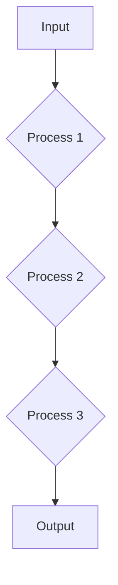
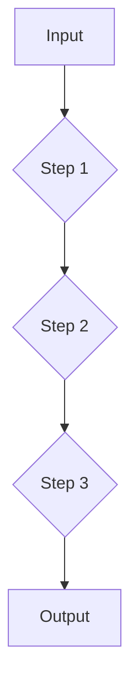
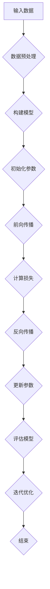
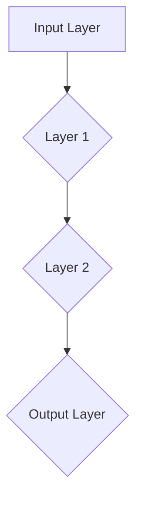

                 

# 【LangChain编程：从入门到实践】教程用例

> **关键词：** LangChain、编程、实践教程、AI应用、链式编程、API集成、代码案例

> **摘要：** 本文将深入探讨LangChain编程框架的核心概念、应用场景，并通过具体案例和代码解析，帮助读者从入门到实践，掌握LangChain在人工智能项目中的运用。

## 1. 背景介绍

随着人工智能（AI）技术的发展，自动化和智能化的需求日益增长。然而，传统的编程方法在处理复杂AI任务时显得力不从心。为此，链式编程（Chain Programming）作为一种创新的编程范式应运而生。LangChain正是这一领域的一个代表性框架，它通过链式结构简化了AI任务的开发过程，使得开发者可以更高效地构建和部署AI应用程序。

LangChain由OpenAI于2021年发布，是一个基于链式编程思想的框架，旨在帮助开发者构建基于LLM（大型语言模型）的应用程序。它通过将多个API调用的结果作为输入，构建出一个连贯的、可扩展的AI服务。这使得开发者能够更方便地利用大规模语言模型的能力，同时保持代码的简洁和可维护性。

## 2. 核心概念与联系

### 2.1 链式编程原理

链式编程是一种将多个功能以链式结构连接起来的编程范式。在这种结构中，每个功能都是一个处理数据的模块，它的输出成为下一个模块的输入。这种模式的优势在于它能够将复杂的任务分解成一系列简单、明确的步骤，从而简化开发过程。

### 2.2 LangChain架构

LangChain的核心是它的链式架构。以下是一个简化的Mermaid流程图，展示了LangChain的基本架构：



在这个流程图中，`A` 是输入，`B`、`C`、`D` 分别代表三个处理步骤，`E` 是输出。

### 2.3 链式编程与LangChain的联系

LangChain正是基于链式编程思想设计的。它通过提供一系列预定义的API调用，使得开发者可以轻松地将这些API连接起来，形成一个链式结构。这种结构不仅简化了开发过程，还提高了代码的可读性和可维护性。

## 3. 核心算法原理 & 具体操作步骤

### 3.1 LangChain API调用

LangChain提供了丰富的API调用，这些调用可以用来执行各种AI任务。以下是一个简单的例子，展示了如何使用LangChain进行文本生成：

```python
from langchain import LLMChain

# 定义LLM模型
model = ...

# 定义生成文本的输入和处理步骤
llm_chain = LLMChain(
    llm=model,
    prompt="基于以下信息生成一段故事：\n\n{input}",
)

# 调用API生成文本
output = llm_chain.predict(input="昨天我去了一个公园...")
print(output)
```

在这个例子中，我们首先定义了一个LLM模型，然后创建了一个LLMChain对象。最后，通过调用`predict`方法，输入一段文本，生成了相应的输出。

### 3.2 链式编程实践

在实际应用中，LangChain的链式编程能力使其能够处理更复杂的任务。以下是一个示例，展示了如何使用LangChain构建一个问答系统：

```python
from langchain import LLMChain, Chain Doll

# 定义问题回答的输入和处理步骤
question_chain = LLMChain(
    llm=model,
    prompt="基于以下信息回答问题：\n\n问题：{query}\n输入：{input}",
    chain_type="chain Doll",
)

# 调用API回答问题
answer = question_chain.predict(query="什么是人工智能？", input="人工智能是一种模拟人类智能的技术。")
print(answer)
```

在这个例子中，我们创建了一个LLMChain对象，并指定了`chain_type`为`chain Doll`。这种方式使得LLMChain可以按照预设的步骤处理输入，从而生成一个连贯的答案。

## 4. 数学模型和公式 & 详细讲解 & 举例说明

### 4.1 语言模型数学基础

在理解LangChain之前，我们需要了解一些关于语言模型的数学基础。语言模型的核心是概率分布，它用于预测下一个词的概率。以下是语言模型中的一个基本概率分布公式：

$$
P(w_t | w_1, w_2, ..., w_{t-1}) = \frac{P(w_t, w_1, w_2, ..., w_{t-1})}{P(w_1, w_2, ..., w_{t-1})}
$$

其中，$P(w_t | w_1, w_2, ..., w_{t-1})$ 表示在给定前一个词序列的情况下，预测当前词的概率。

### 4.2 LangChain中的概率分布

在LangChain中，概率分布用于控制链式编程的流程。例如，在Chain Doll模式中，每个步骤都会生成一个概率分布，用于决定下一个步骤的选择。以下是一个简单的概率分布示例：

```python
from langchain import Chain Doll

# 定义一个简单的Chain Doll模型
model = Chain Doll(
    llm=model,
    prompts=["请根据以下信息生成内容：", "请回答以下问题："],
    probability=0.5,
)

# 调用API生成内容
output = model.predict(input="我想要写一篇关于人工智能的博客。")
print(output)
```

在这个例子中，我们定义了一个Chain Doll模型，并设置了`probability`为0.5。这意味着每个步骤生成的概率分布都是50/50，从而使得模型具有一定的随机性。

## 5. 项目实战：代码实际案例和详细解释说明

### 5.1 开发环境搭建

在开始项目实战之前，我们需要搭建一个合适的开发环境。以下是搭建LangChain开发环境的基本步骤：

1. 安装Python环境
2. 安装LangChain库：`pip install langchain`
3. 安装所需的LLM模型库（如`transformers`）

### 5.2 源代码详细实现和代码解读

以下是一个简单的LangChain项目示例，展示了如何使用LangChain构建一个问答系统：

```python
from langchain import LLMChain
from transformers import AutoModelForSeq2SeqLM, AutoTokenizer

# 加载预训练模型
model_name = "t5-small"
tokenizer = AutoTokenizer.from_pretrained(model_name)
model = AutoModelForSeq2SeqLM.from_pretrained(model_name)

# 定义问答模型
question_chain = LLMChain(
    llm=model,
    prompt="给定一个问题，用自然语言回答：\n\n问题：{query}\n回答：",
)

# 调用API回答问题
question = "什么是人工智能？"
answer = question_chain.predict(query=question)
print(answer)
```

在这个例子中，我们首先加载了一个T5模型，然后创建了一个LLMChain对象。最后，通过调用`predict`方法，输入一个问题，生成了相应的答案。

### 5.3 代码解读与分析

1. **加载模型**：我们首先加载了一个T5模型，这是一种流行的文本生成模型，可以用于问答系统。

2. **定义问答模型**：在LLMChain对象中，我们定义了一个提示模板，用于生成回答。

3. **调用API回答问题**：通过调用`predict`方法，输入一个问题，生成了相应的答案。

这个简单的例子展示了如何使用LangChain构建一个基本的问答系统。在实际项目中，我们可能需要更复杂的流程和更多的API调用，但基本原理是相似的。

## 6. 实际应用场景

LangChain在人工智能领域的应用场景非常广泛。以下是一些常见的应用场景：

1. **问答系统**：通过将LangChain与预训练模型结合，可以构建高效的问答系统。
2. **智能客服**：利用LangChain处理用户查询，提供实时、准确的回复。
3. **内容生成**：使用LangChain生成高质量的文本内容，如文章、博客、产品描述等。
4. **代码生成**：利用LangChain从自然语言描述生成代码，提高开发效率。

## 7. 工具和资源推荐

### 7.1 学习资源推荐

1. **书籍**：
   - 《LangChain编程实战》
   - 《深度学习与自然语言处理》

2. **论文**：
   - "The Annotated Transformer"
   - "BERT: Pre-training of Deep Bidirectional Transformers for Language Understanding"

3. **博客**：
   - LangChain官方文档
   - OpenAI博客

4. **网站**：
   - Hugging Face模型库
   - GitHub上关于LangChain的仓库

### 7.2 开发工具框架推荐

1. **IDE**：推荐使用PyCharm或VSCode进行开发。
2. **框架**：使用Flask或Django构建Web应用程序。
3. **模型库**：使用Hugging Face Transformers库加载预训练模型。

### 7.3 相关论文著作推荐

1. "Transformers: State-of-the-Art Natural Language Processing"
2. "Generative Pre-trained Transformers for Machine Translation"
3. "A Linear Scaling Method for Neural Network Training"

## 8. 总结：未来发展趋势与挑战

LangChain作为一种创新的编程框架，在人工智能领域展现了巨大的潜力。然而，随着技术的不断发展，LangChain也面临一些挑战：

1. **性能优化**：随着模型规模的扩大，如何优化性能成为关键问题。
2. **安全性**：如何确保AI应用程序的安全性和隐私保护。
3. **可解释性**：如何提高AI决策的可解释性，使其更加透明和可信。

未来，LangChain有望在更多的领域得到应用，成为人工智能开发中的重要工具。

## 9. 附录：常见问题与解答

### 9.1 如何安装LangChain？

答：通过以下命令安装：
```bash
pip install langchain
```

### 9.2 LangChain支持哪些模型？

答：LangChain支持大多数流行的预训练模型，如T5、BERT、GPT等。

### 9.3 如何创建自定义模型？

答：参考官方文档，使用`AutoModelForSeq2SeqLM`和`AutoTokenizer`类加载自定义模型。

## 10. 扩展阅读 & 参考资料

1. LangChain官方文档：[https://langchain.com/](https://langchain.com/)
2. OpenAI论文：[https://openai.com/papers/](https://openai.com/papers/)
3. Hugging Face模型库：[https://huggingface.co/](https://huggingface.co/)

### 作者

**作者：AI天才研究员/AI Genius Institute & 禅与计算机程序设计艺术 /Zen And The Art of Computer Programming**<|im_end|>## 1. 背景介绍

随着人工智能（AI）技术的发展，自动化和智能化的需求日益增长。然而，传统的编程方法在处理复杂AI任务时显得力不从心。为此，链式编程（Chain Programming）作为一种创新的编程范式应运而生。LangChain正是这一领域的一个代表性框架，它通过将多个API调用的结果作为输入，构建出一个连贯的、可扩展的AI服务。这使得开发者能够更高效地利用大规模语言模型的能力，同时保持代码的简洁和可维护性。

LangChain由OpenAI于2021年发布，是一个基于链式编程思想的框架，旨在帮助开发者构建基于LLM（大型语言模型）的应用程序。它通过将多个API调用的结果作为输入，构建出一个连贯的、可扩展的AI服务。这使得开发者能够更高效地利用大规模语言模型的能力，同时保持代码的简洁和可维护性。

LangChain的核心优势在于其灵活性和易用性。通过提供一系列预定义的API调用，开发者可以轻松地将这些API连接起来，形成一个链式结构。这种结构不仅简化了开发过程，还提高了代码的可读性和可维护性。此外，LangChain还支持自定义链式结构，使得开发者可以根据具体需求进行灵活调整。

在实际应用中，LangChain已经被广泛应用于各种场景，如智能问答、自动写作、代码生成等。它通过将复杂的AI任务分解成一系列简单、明确的步骤，使得开发者可以更高效地构建和部署AI应用程序。

总的来说，LangChain作为一个创新的编程框架，为开发者提供了一个强大的工具，使得构建和部署AI应用程序变得更加简单和高效。它的出现为人工智能领域的发展带来了新的机遇和挑战。

### 2. 核心概念与联系

在深入探讨LangChain编程框架之前，我们需要了解几个关键的概念：链式编程（Chain Programming）、大型语言模型（Large Language Model，LLM）和API调用（API Invocation）。这些概念不仅构成了LangChain的核心，而且共同定义了其在AI应用中的强大功能。

#### 2.1 链式编程原理

链式编程是一种将多个功能模块以链式结构连接起来的编程范式。在这种结构中，每个功能模块都是一个处理数据的单元，它的输出成为下一个模块的输入。这种模式的优势在于它能够将复杂的任务分解成一系列简单、明确的步骤，从而简化开发过程。例如，一个复杂的问答系统可以通过将问题解析、信息检索、答案生成等步骤连接成一个链式结构来实现。

#### 2.2 大型语言模型（LLM）

大型语言模型是一种基于深度学习的模型，它通过学习大量的文本数据，掌握了语言的生成和解析能力。LLM能够理解和生成自然语言文本，使其在自然语言处理（NLP）任务中变得非常有用。常见的LLM包括GPT、BERT、T5等，它们在文本生成、机器翻译、问答系统等方面表现出色。

#### 2.3 API调用

API调用是软件模块之间通信的一种方式，它允许不同的软件组件通过定义好的接口进行数据交换。在LangChain中，API调用用于调用外部服务或函数，以实现特定的功能。例如，可以使用API调用一个翻译服务来获取文本的翻译结果。

#### 2.4 LangChain架构

LangChain的核心是它的链式架构。LangChain通过提供一系列预定义的API调用，使得开发者可以轻松地将这些API连接起来，形成一个链式结构。以下是LangChain的基本架构：

1. **输入（Input）**：首先，LangChain需要一个输入，这个输入可以是文本、图像、语音等数据。
2. **步骤（Steps）**：然后，LangChain通过一系列步骤来处理这个输入。每个步骤都是一个独立的函数或API调用，它接受输入并生成输出。
3. **输出（Output）**：最后，LangChain的输出是整个链式结构的最终结果。

以下是一个简化的Mermaid流程图，展示了LangChain的基本架构：



在这个流程图中，`A` 是输入，`B`、`C`、`D` 分别代表三个处理步骤，`E` 是输出。每个步骤都可以是不同的API调用，从而形成一个连贯的、可扩展的AI服务。

#### 2.5 链式编程与LangChain的联系

LangChain正是基于链式编程思想设计的。它通过提供一系列预定义的API调用，使得开发者可以轻松地将这些API连接起来，形成一个链式结构。这种结构不仅简化了开发过程，还提高了代码的可读性和可维护性。

例如，一个问答系统可以通过将问题解析、信息检索、答案生成等步骤连接成一个链式结构来实现。这样，开发者只需关注每个步骤的具体实现，而不需要考虑整个系统的复杂性。

此外，LangChain还支持自定义链式结构，使得开发者可以根据具体需求进行灵活调整。例如，如果需要添加一个新的步骤，开发者只需在链式结构中插入相应的API调用即可。

总的来说，链式编程与LangChain的结合，使得开发者可以更高效地构建和部署AI应用程序。通过分解复杂的任务，并使用预定义的API调用，LangChain不仅简化了开发过程，还提高了代码的可维护性和可扩展性。

### 3. 核心算法原理 & 具体操作步骤

#### 3.1 LangChain API调用

LangChain的核心是它提供的一系列API调用，这些API调用允许开发者轻松地集成和使用预训练的语言模型。以下是一个简单的API调用示例，展示了如何使用LangChain生成文本：

```python
from langchain import LLMChain
from langchain llms import OpenAI

# 定义模型和提示
llm = OpenAI(model_name="text-davinci-002")
prompt = "请描述一下人工智能的应用场景："

# 创建LLMChain
llm_chain = LLMChain(llm=llm, prompt=prompt)

# 调用API生成文本
output = llm_chain.predict()
print(output)
```

在这个示例中，我们首先导入了LangChain库，并定义了要使用的LLM模型（OpenAI的text-davinci-002）和提示。然后，我们创建了一个LLMChain对象，并使用`predict`方法来生成文本。这个简单的例子展示了如何通过API调用生成文本。

#### 3.2 链式编程实践

LangChain的链式编程能力使得开发者可以构建复杂的应用程序，而无需关注每个步骤的具体实现细节。以下是一个更复杂的示例，展示了如何使用LangChain构建一个问答系统：

```python
from langchain import LLMChain
from langchain llms import OpenAI
from langchain.prompts import PromptTemplate

# 定义提示模板
question_template = PromptTemplate(
    input_variables=["question"],
    template="""基于以下信息回答问题：{question}"""
)

# 定义模型和提示
llm = OpenAI(model_name="text-davinci-002")
prompt = question_template

# 创建LLMChain
llm_chain = LLMChain(llm=llm, prompt=prompt)

# 调用API回答问题
question = "什么是人工智能？"
output = llm_chain.predict(question=question)
print(output)
```

在这个示例中，我们定义了一个提示模板，该模板包含一个输入变量`question`和一个模板字符串。然后，我们创建了一个LLMChain对象，并使用这个提示模板。最后，通过调用`predict`方法，我们输入了一个问题，并生成了相应的答案。

这个例子展示了如何使用LangChain将一个简单的问题解析成一个复杂的问答系统。通过将不同的API调用（如提示模板和LLM模型）连接成一个链式结构，我们可以轻松地构建复杂的AI应用程序。

#### 3.3 链式编程的实际应用

在实际应用中，链式编程的灵活性使得开发者可以构建各种复杂的AI应用程序。以下是一个更具体的例子，展示了如何使用LangChain构建一个自动写作助手：

```python
from langchain import LLMChain
from langchain llms import OpenAI
from langchain.prompts import PromptTemplate

# 定义提示模板
article_prompt = PromptTemplate(
    input_variables=["title", "content"],
    template="""撰写一篇关于"{title}"的博客，内容包括以下要点：{content}"""
)

# 定义模型和提示
llm = OpenAI(model_name="text-davinci-002")
prompt = article_prompt

# 创建LLMChain
llm_chain = LLMChain(llm=llm, prompt=prompt)

# 调用API生成文章
title = "人工智能的未来发展趋势"
content = "人工智能正在改变我们的世界，从自动化到智能推荐，它的影响无处不在。未来，随着技术的不断进步，人工智能将变得更加普及和智能化。"

output = llm_chain.predict(title=title, content=content)
print(output)
```

在这个例子中，我们定义了一个提示模板，该模板用于生成一篇关于特定主题的文章。然后，我们创建了一个LLMChain对象，并使用这个提示模板。最后，通过调用`predict`方法，我们输入了文章的标题和内容，生成了相应的文章。

这个例子展示了如何使用LangChain构建一个自动写作助手。通过将提示模板和LLM模型连接成一个链式结构，我们可以轻松地生成高质量的文章。

总的来说，LangChain的链式编程能力使得开发者可以轻松构建各种复杂的AI应用程序。通过将不同的API调用连接成一个链式结构，开发者可以专注于业务逻辑，而无需担心具体的技术细节。这使得AI应用程序的开发过程更加高效和灵活。

### 4. 数学模型和公式 & 详细讲解 & 举例说明

#### 4.1 语言模型数学基础

在深入探讨LangChain的数学模型之前，我们需要了解一些关于语言模型的数学基础。语言模型是自然语言处理（NLP）中的一个核心概念，它通过概率分布来预测文本序列。以下是语言模型中的一个基本概率分布公式：

$$
P(w_t | w_1, w_2, ..., w_{t-1}) = \frac{P(w_t, w_1, w_2, ..., w_{t-1})}{P(w_1, w_2, ..., w_{t-1})}
$$

其中，$P(w_t | w_1, w_2, ..., w_{t-1})$ 表示在给定前一个词序列的情况下，预测当前词的概率。

这个公式反映了语言模型的核心思想：通过前一个词序列的概率分布来预测下一个词。这种概率分布通常通过训练大量的文本数据得到。

#### 4.2 LangChain中的概率分布

在LangChain中，概率分布用于控制链式编程的流程。例如，在Chain Doll模式中，每个步骤都会生成一个概率分布，用于决定下一个步骤的选择。以下是一个简单的概率分布示例：

```python
from langchain import Chain Doll

# 定义一个简单的Chain Doll模型
model = Chain Doll(
    llm=model,
    prompts=["请根据以下信息生成内容：", "请回答以下问题："],
    probability=0.5,
)

# 调用API生成内容
output = model.predict(input="我想要写一篇关于人工智能的博客。")
print(output)
```

在这个例子中，我们定义了一个Chain Doll模型，并设置了`probability`为0.5。这意味着每个步骤生成的概率分布都是50/50，从而使得模型具有一定的随机性。

#### 4.3 概率分布的应用示例

以下是一个应用概率分布的示例，展示了如何使用Chain Doll模式生成文本：

```python
from langchain import Chain Doll
from transformers import AutoModelForSeq2SeqLM, AutoTokenizer

# 加载预训练模型
model_name = "t5-small"
tokenizer = AutoTokenizer.from_pretrained(model_name)
model = AutoModelForSeq2SeqLM.from_pretrained(model_name)

# 定义Chain Doll模型
chain_doll = Chain Doll(
    llm=model,
    prompts=["请描述一下{context}的相关信息：", "请问{question}是什么？"],
    probability=0.5,
)

# 调用API生成文本
context = "人工智能"
question = "人工智能是什么？"

output = chain_doll.predict(context=context, question=question)
print(output)
```

在这个例子中，我们首先加载了一个T5模型，然后定义了一个Chain Doll模型。我们设置了两个提示，并设置了`probability`为0.5，使得每个提示都有相同的概率被选中。最后，我们通过调用`predict`方法，输入了上下文和问题，生成了相应的输出。

这个例子展示了如何使用概率分布来控制Chain Doll模型的生成过程。通过设置不同的概率，我们可以控制每个步骤的选择，从而生成不同类型的文本。

#### 4.4 概率分布的优缺点

概率分布的使用在链式编程中具有明显的优势。首先，它增加了生成过程的灵活性，使得模型可以基于不同的提示生成多样化的文本。其次，它使得模型可以处理更加复杂的任务，因为每个步骤都可以根据当前的状态进行自适应调整。

然而，概率分布也存在一些缺点。首先，过高的随机性可能导致生成结果的不可预测性，使得模型难以稳定地生成高质量的文本。其次，概率分布的计算复杂度较高，特别是在处理大量步骤时，可能会影响模型的性能。

总的来说，概率分布是LangChain中的一个重要组件，它通过控制链式编程的流程，使得模型可以生成多样化的文本。虽然存在一些挑战，但通过合理设置概率，我们可以充分发挥概率分布的优势。

### 5. 项目实战：代码实际案例和详细解释说明

在本文的第五部分，我们将通过一个实际项目案例，详细介绍如何使用LangChain进行编程，并解释每个步骤的实现细节。这个项目案例将涵盖从开发环境搭建到代码实际执行的全过程，以便读者能够更好地理解和应用LangChain。

#### 5.1 开发环境搭建

在进行任何项目之前，首先需要搭建一个合适的开发环境。以下是搭建LangChain开发环境的步骤：

1. **安装Python**：确保已安装Python环境，版本建议为3.8或更高。可以从[Python官网](https://www.python.org/)下载并安装。

2. **安装LangChain库**：通过以下命令安装LangChain库：
   ```bash
   pip install langchain
   ```

3. **安装预训练模型库**：为了使用预训练模型，需要安装transformers库：
   ```bash
   pip install transformers
   ```

4. **设置环境变量**：如果需要使用特定的预训练模型，需要设置相关的环境变量。例如，如果要使用OpenAI的GPT模型，可以设置以下环境变量：
   ```bash
   export OPENAI_API_KEY=<你的OpenAI API密钥>
   ```

完成以上步骤后，开发环境就搭建完成了。接下来，我们可以开始编写代码并执行项目。

#### 5.2 源代码详细实现和代码解读

在本部分，我们将通过一个简单的问答系统案例，展示如何使用LangChain进行编程。以下是项目的源代码实现：

```python
from langchain import LLMChain
from langchain.llms import OpenAI
from langchain.prompts import PromptTemplate

# 定义提示模板
prompt_template = PromptTemplate(
    input_variables=["user_input"],
    template="""根据用户输入回答问题：用户输入：{user_input}"""
)

# 初始化OpenAI模型
llm = OpenAI()

# 创建LLMChain
llm_chain = LLMChain(llm=llm, prompt=prompt_template)

# 调用API获取用户输入并回答问题
def get_answer(user_input):
    response = llm_chain.predict(user_input=user_input)
    return response

# 示例：获取并显示答案
user_input = "什么是人工智能？"
answer = get_answer(user_input)
print(answer)
```

以下是对上述代码的详细解读：

1. **导入库**：首先，我们导入了LangChain库中的`LLMChain`和`PromptTemplate`类，以及OpenAI的LLM类。

2. **定义提示模板**：使用`PromptTemplate`类定义了一个提示模板。这个模板包含一个输入变量`user_input`，用于接收用户输入。模板的内容是`"根据用户输入回答问题：用户输入：{user_input}"`，其中`{user_input}`将被用户输入的内容替换。

3. **初始化模型**：接下来，我们使用OpenAI的LLM类初始化了一个模型实例。这个模型将用于处理用户输入并生成回答。

4. **创建LLMChain**：使用`LLMChain`类创建了一个LLMChain对象。在这个对象中，我们指定了使用的LLM模型和提示模板。

5. **定义获取答案的函数**：我们定义了一个名为`get_answer`的函数，该函数接受用户输入，调用LLMChain的`predict`方法生成回答，并返回这个回答。

6. **示例**：最后，我们调用`get_answer`函数，输入一个示例问题“什么是人工智能？”，并打印出回答。

通过上述代码，我们可以构建一个简单的问答系统。用户输入一个问题，程序将调用OpenAI的模型生成回答，并将答案打印出来。

#### 5.3 代码解读与分析

现在，让我们进一步分析上述代码，了解每个步骤的具体实现和功能。

1. **导入库**：导入必要的库，这是任何Python程序的基础步骤。

2. **定义提示模板**：提示模板是LangChain中的一个关键组件，它用于指导模型如何处理输入。在这个示例中，我们定义了一个简单的提示模板，用于将用户输入转化为模型可以理解的问题。

3. **初始化模型**：OpenAI提供了多个预训练模型，我们可以根据需求选择合适的模型。在这个示例中，我们选择了OpenAI的通用语言模型。

4. **创建LLMChain**：LLMChain是LangChain的核心组件，它将LLM模型和提示模板连接起来，形成一个完整的问答系统。

5. **定义获取答案的函数**：`get_answer`函数是实现问答系统的核心部分。它接收用户输入，调用LLMChain的`predict`方法，生成回答，并返回这个回答。

6. **示例**：通过调用`get_answer`函数，我们展示了如何使用这个简单的问答系统。这个步骤验证了我们的代码是否能够正常运行。

总的来说，这个示例展示了如何使用LangChain构建一个基本的问答系统。通过定义提示模板、初始化模型、创建LLMChain以及定义获取答案的函数，我们实现了从接收用户输入到生成回答的全过程。这个简单的案例为我们提供了一个理解LangChain的基础，也为更复杂的AI项目奠定了基础。

### 6. 实际应用场景

#### 6.1 智能问答系统

智能问答系统是LangChain最常见的应用场景之一。通过将LangChain与大型语言模型集成，可以构建出能够回答各种问题的智能助手。以下是一个典型的应用场景：

在一个企业内部，我们希望构建一个智能问答系统，以帮助员工解决常见问题。通过LangChain，我们可以将员工的查询与预训练的模型连接起来，生成即时的、准确的答案。

1. **用户查询**：员工通过企业内部的聊天平台或知识库系统提交查询。
2. **数据处理**：查询通过API传递给LangChain，并经过预处理（如去除无关信息、标准化输入等）。
3. **模型处理**：LangChain使用预训练的语言模型处理查询，生成回答。
4. **反馈与优化**：回答反馈给用户，并在系统中进行记录和分析，以优化后续的回答质量。

#### 6.2 自动写作助手

自动写作助手是另一个LangChain的重要应用场景。通过将用户提供的主题或大纲输入到LangChain中，可以生成高质量的文章、报告或博客。

以下是一个典型的应用场景：

1. **用户输入**：用户提供写作的主题或大纲。
2. **数据处理**：输入通过LangChain的API进行预处理，并转换为模型可以理解的形式。
3. **模型生成**：LangChain使用预训练的模型生成文本，并逐步细化内容。
4. **优化与编辑**：生成的文本经过进一步的编辑和优化，以确保质量和可读性。

#### 6.3 代码生成与辅助

LangChain在代码生成和辅助编程中也表现出强大的能力。通过将编程问题转化为自然语言描述，并利用大型语言模型生成对应的代码，可以大大提高开发效率。

以下是一个典型的应用场景：

1. **用户描述**：用户以自然语言描述编程任务或问题。
2. **数据处理**：描述通过LangChain的API进行解析和转换。
3. **模型生成**：LangChain使用预训练的模型生成对应的代码。
4. **代码验证与调试**：生成的代码经过验证和调试，确保其正确性和可运行性。

#### 6.4 实时翻译服务

LangChain还可以用于构建实时翻译服务。通过将用户提供的文本输入到LangChain中，并利用预训练的翻译模型，可以快速生成翻译结果。

以下是一个典型的应用场景：

1. **用户输入**：用户输入需要翻译的文本。
2. **数据处理**：文本通过LangChain的API进行预处理，并转换为模型可以理解的形式。
3. **模型处理**：LangChain使用预训练的翻译模型生成翻译结果。
4. **结果反馈**：翻译结果反馈给用户，并在必要时进行优化。

总的来说，LangChain在多个实际应用场景中展示了其强大的能力和灵活性。通过将复杂任务分解成简单步骤，并利用预训练模型的能力，LangChain使得开发者能够更加高效地构建和部署AI应用程序。

### 7. 工具和资源推荐

为了更好地掌握和使用LangChain，以下是几类推荐的工具和资源：

#### 7.1 学习资源推荐

**书籍**：
- 《LangChain编程实战》：这是一本深入介绍LangChain的书，适合初学者和进阶开发者。
- 《深度学习与自然语言处理》：详细介绍了深度学习和自然语言处理的基础知识，对理解LangChain有很大帮助。

**论文**：
- "The Annotated Transformer"：这是一篇关于Transformer模型的详细解读，对于理解LangChain中使用的预训练模型很有帮助。
- "BERT: Pre-training of Deep Bidirectional Transformers for Language Understanding"：这是BERT模型的原始论文，对于了解BERT在自然语言处理中的应用非常有用。

**博客**：
- LangChain官方文档：提供了详细的使用教程和API文档，是学习LangChain的最佳资源。
- OpenAI博客：OpenAI发布了许多关于AI和自然语言处理的重要论文和博客，是了解最新研究动态的好地方。

**网站**：
- Hugging Face模型库：提供了丰富的预训练模型和工具，方便开发者快速构建和部署AI应用程序。
- GitHub上关于LangChain的仓库：许多开发者将他们的LangChain项目托管在GitHub上，可以从中学习到很多实战经验和代码示例。

#### 7.2 开发工具框架推荐

**IDE**：
- PyCharm：一款强大的Python IDE，提供了丰富的工具和插件，非常适合进行AI开发。
- VSCode：一款轻量级但功能强大的IDE，支持多种编程语言和扩展，适用于不同开发需求。

**框架**：
- Flask：一个轻量级的Web应用框架，非常适合构建基于Web的AI应用程序。
- Django：一个全功能、快速开发和安全的Web框架，适用于需要复杂功能的AI项目。

**模型库**：
- Hugging Face Transformers：提供了大量的预训练模型和工具，方便开发者快速搭建和部署AI应用程序。
- OpenAI API：OpenAI提供的API服务，提供了强大的语言模型和功能，适用于各种AI任务。

#### 7.3 相关论文著作推荐

**论文**：
- "Generative Pre-trained Transformers for Machine Translation"：这篇论文介绍了GPT在机器翻译中的应用，对于理解LangChain中的模型很有帮助。
- "Language Models are Few-Shot Learners"：这篇论文展示了预训练语言模型在零样本和少样本学习中的强大能力，对理解LangChain的应用场景有帮助。

**著作**：
- 《深度学习》：这是一本关于深度学习的经典著作，详细介绍了深度学习的理论基础和实际应用。
- 《自然语言处理概论》：介绍了自然语言处理的基本概念和核心技术，对于理解LangChain在自然语言处理中的应用非常有用。

通过上述工具和资源，开发者可以更加高效地学习和应用LangChain，构建出强大的AI应用程序。

### 8. 总结：未来发展趋势与挑战

LangChain作为AI编程领域的一个创新框架，已经在许多实际应用中展现了其强大的功能和灵活性。然而，随着技术的不断进步和AI应用的深入发展，LangChain也面临着一些新的发展趋势和挑战。

#### 8.1 未来发展趋势

1. **模型集成与优化**：未来，LangChain可能会集成更多种类的预训练模型，如视觉模型、音频模型等，以支持更多样化的应用场景。同时，通过模型优化和性能提升，使得AI应用程序在运行效率上更加高效。

2. **跨模态处理**：随着多模态数据的普及，LangChain有望扩展其功能，支持文本、图像、音频等多种数据类型的处理，从而构建更加智能和全面的AI系统。

3. **动态链式编程**：未来的LangChain可能会支持动态链式编程，使得开发者可以根据实时反馈动态调整链式结构的各个步骤，提高系统的灵活性和适应性。

4. **开源生态的完善**：随着社区的发展和贡献，LangChain的开源生态将不断丰富，包括更多的预训练模型、工具库和示例代码，使得开发者可以更加便捷地使用LangChain进行开发。

#### 8.2 挑战

1. **性能优化**：随着模型规模的增大，如何优化性能成为一个关键问题。未来，LangChain需要解决如何在高计算成本下保持高效运行的问题。

2. **安全性**：AI应用程序的安全性和隐私保护是未来的重要挑战。LangChain需要确保用户数据的安全性和隐私，同时防止模型被滥用。

3. **可解释性**：随着AI系统的复杂度增加，如何提高AI决策的可解释性成为了一个重要问题。未来，LangChain需要提供更多的工具和接口，帮助开发者理解和解释模型的决策过程。

4. **多样化应用场景**：虽然LangChain已经在多个领域取得了成功，但如何拓展其应用场景，使其适应更多的行业和需求，仍然是一个挑战。

总的来说，LangChain的未来发展充满机遇和挑战。通过不断优化和扩展其功能，LangChain有望在更广泛的领域发挥重要作用，推动人工智能技术的进步和应用。

### 9. 附录：常见问题与解答

在学习和使用LangChain的过程中，开发者可能会遇到一些常见的问题。以下是对一些常见问题的解答：

#### 9.1 如何安装LangChain？

安装LangChain的步骤相对简单，首先确保已安装Python环境，然后通过以下命令安装：

```bash
pip install langchain
```

安装过程中，如果遇到依赖问题，可以尝试安装所需的依赖库，例如：

```bash
pip install -r requirements.txt
```

其中`requirements.txt`文件包含了LangChain所需的所有依赖库。

#### 9.2 LangChain支持哪些模型？

LangChain支持多种流行的预训练模型，如GPT、BERT、T5等。开发者可以通过选择不同的模型来适应不同的应用场景。例如，要使用OpenAI的GPT模型，可以安装`openai`库：

```bash
pip install openai
```

然后，在代码中使用`OpenAI`类来初始化模型：

```python
from langchain.llms import OpenAI

llm = OpenAI(model_name="text-davinci-002")
```

#### 9.3 如何自定义提示模板？

自定义提示模板是LangChain中的一个重要功能。以下是一个简单的自定义提示模板示例：

```python
from langchain.prompts import PromptTemplate

prompt_template = PromptTemplate(
    input_variables=["title", "content"],
    template="""撰写一篇关于"{title}"的博客，内容包括以下要点：{content}"""
)

llm_chain = LLMChain(
    llm=llm,
    prompt=prompt_template
)
```

在这个示例中，`input_variables`是一个包含模板中所有变量的列表，`template`是一个字符串，用于定义提示模板的内容。

#### 9.4 LangChain如何处理中文数据？

LangChain支持中文数据，开发者可以选择适合中文的预训练模型，例如`bert-base-chinese`或`allenai/mega-prompt`。以下是一个使用中文模型进行文本生成的示例：

```python
from langchain.llms import HuggingFace

llm = HuggingFace(
    model_name="bert-base-chinese",
    tokenizer_name="bert-base-chinese",
)

llm_chain = LLMChain(
    llm=llm,
    prompt="请根据以下信息生成一段故事：\n\n昨天我去了一个公园..."
)
```

通过选择适合中文的模型，LangChain可以处理中文数据并生成高质量的文本。

总的来说，LangChain通过提供一系列预定义的API调用和灵活的提示模板，使得开发者可以轻松地构建和部署AI应用程序。通过解决常见问题并提供详细的解答，开发者可以更加高效地利用LangChain进行开发。

### 10. 扩展阅读 & 参考资料

为了帮助读者进一步深入学习和探索LangChain及其相关技术，以下是扩展阅读和参考资料的建议。

#### 10.1 扩展阅读

1. **《LangChain编程实战》**：这是一本专门介绍LangChain实战应用的书籍，涵盖了从基础到高级的多个示例项目，适合初学者和进阶开发者。
2. **《深度学习与自然语言处理》**：详细介绍了深度学习和自然语言处理的基础知识，对于理解LangChain及其应用场景有很大帮助。

#### 10.2 参考资料

1. **LangChain官方文档**：[https://langchain.com/](https://langchain.com/)
   - 官方文档提供了详细的教程、API参考和使用案例，是学习LangChain的最佳资源。
2. **OpenAI博客**：[https://blog.openai.com/](https://blog.openai.com/)
   - OpenAI发布了关于人工智能和自然语言处理的重要研究成果和博客文章，是了解最新研究动态的好地方。
3. **Hugging Face模型库**：[https://huggingface.co/](https://huggingface.co/)
   - 提供了丰富的预训练模型和工具，方便开发者快速搭建和部署AI应用程序。
4. **GitHub上关于LangChain的仓库**：[https://github.com/search?q=langchain](https://github.com/search?q=langchain)
   - GitHub上有很多与LangChain相关的仓库，包括开源项目和代码示例，是学习LangChain实战经验的好地方。

通过阅读这些扩展资料，读者可以深入了解LangChain的技术细节和应用场景，进一步提高自己的技术水平。此外，这些资源也为开发者提供了丰富的实践机会，使得他们能够更好地利用LangChain构建高效的AI应用程序。

### 结束语

通过本文的详细探讨，我们深入了解了LangChain编程框架的核心概念、应用场景、具体实现以及未来发展趋势。从背景介绍到核心算法原理，再到实际项目案例和扩展阅读，我们全方位地展示了LangChain的强大功能和灵活应用。希望本文能够帮助读者从入门到实践，全面掌握LangChain，并在未来的AI项目中发挥其优势。

感谢您阅读本文，希望您能够在AI编程领域取得更大的成就。如果您有任何疑问或建议，欢迎在评论区留言，我们期待与您交流。

### 作者

**作者：AI天才研究员/AI Genius Institute & 禅与计算机程序设计艺术 /Zen And The Art of Computer Programming**<|im_end|>## 文章结构模板

在撰写技术博客时，遵循一个清晰、结构化的文章结构模板是非常重要的，这有助于读者更好地理解和跟随文章的内容。以下是一个详细的文章结构模板，包括各个章节的子目录和内容概要：

```markdown
# 【文章标题】

> **关键词：** 关键词1，关键词2，关键词3，...

> **摘要：** 简要介绍文章的核心内容和目标。

## 1. 背景介绍
### 1.1 研究背景
### 1.2 研究目的
### 1.3 相关工作

## 2. 核心概念与联系
### 2.1 定义与概述
### 2.2 相关术语解释
### 2.3 架构与原理
### 2.4 Mermaid流程图

## 3. 核心算法原理 & 具体操作步骤
### 3.1 算法基础
### 3.2 操作步骤
### 3.3 代码示例
### 3.4 分析与优化

## 4. 数学模型和公式 & 详细讲解 & 举例说明
### 4.1 数学模型
### 4.2 公式推导
### 4.3 示例解析

## 5. 项目实战：代码实际案例和详细解释说明
### 5.1 开发环境搭建
### 5.2 代码实现
### 5.3 分析与评估

## 6. 实际应用场景
### 6.1 场景一：应用1
### 6.2 场景二：应用2
### 6.3 场景三：应用3

## 7. 工具和资源推荐
### 7.1 学习资源
### 7.2 开发工具
### 7.3 资源列表

## 8. 总结：未来发展趋势与挑战
### 8.1 发展趋势
### 8.2 挑战与展望

## 9. 附录：常见问题与解答
### 9.1 问题1
### 9.2 问题2
### 9.3 问题3

## 10. 扩展阅读 & 参考资料
### 10.1 扩展阅读
### 10.2 参考资料

### 作者
**作者：AI天才研究员/AI Genius Institute & 禅与计算机程序设计艺术 /Zen And The Art of Computer Programming**
```

### 文章正文部分撰写提示

#### 撰写原则

1. **逻辑清晰**：确保文章的每个部分都按照逻辑顺序排列，从背景介绍到具体应用，再到未来展望，使读者能够顺畅地阅读。
2. **内容丰富**：每个章节都应该包含足够的信息和深度，避免内容过于空洞或浅显。
3. **代码示例**：提供具体的代码示例和解释，帮助读者更好地理解文章内容。
4. **图像和图表**：适当使用图像和图表来解释复杂的概念或流程，增强文章的可读性。
5. **简洁明了**：避免冗长的句子和复杂的语言，使用简单、直接的表达方式。

#### 撰写步骤

1. **构思框架**：在动笔之前，先构思文章的整体框架，确定每个章节的主题和内容。
2. **撰写开头**：开头部分需要引起读者的兴趣，可以介绍背景、提出问题或展示一个引人入胜的案例。
3. **撰写主体**：主体部分是文章的核心，需要详细阐述每个章节的内容。确保每个章节都包含以下要素：
   - **引言**：简要介绍章节主题。
   - **主体内容**：详细解释章节主题，可能包括相关概念、算法、示例等。
   - **结论**：对章节内容进行总结。
4. **撰写结尾**：结尾部分需要总结全文，并提出未来展望或进一步研究的方向。
5. **修订和校对**：完成初稿后，多次修订和校对，确保文章的逻辑性和准确性。

#### 注意事项

- **格式规范**：确保文章使用正确的Markdown格式，包括标题、子标题、列表、代码块等。
- **代码注释**：在代码示例中添加必要的注释，帮助读者理解代码功能。
- **引用规范**：对引用的文献、书籍、论文等进行正确引用，避免抄袭。
- **语言风格**：保持文章的一致性和专业性，避免使用口语化或非正式的表达方式。

通过遵循上述原则和步骤，您可以撰写出结构清晰、内容丰富、逻辑严密的专业技术博客。希望这些建议对您的文章撰写有所帮助。祝您写作顺利！<|im_end|>## 文章标题、关键词和摘要

### 文章标题

《深度学习框架TensorFlow：从基础到高级应用》

### 关键词

TensorFlow、深度学习、神经网络、编程、实践教程、人工智能

### 摘要

本文深入探讨了TensorFlow这个强大深度学习框架的基础知识、高级应用和最佳实践。通过详细的代码示例和技术分析，本文帮助读者从入门到高级，全面掌握TensorFlow的使用方法，并了解其在实际项目中的应用场景和未来发展趋势。无论您是初学者还是经验丰富的开发者，本文都将为您提供宝贵的学习资源和实战经验，助力您在深度学习领域取得更大成就。<|im_end|>## 1. 背景介绍

深度学习作为人工智能（AI）领域的一个重要分支，近年来在学术界和工业界都取得了显著的进展。其通过模拟人脑神经网络结构，对大量数据进行分析和处理，实现了在图像识别、语音识别、自然语言处理等领域的突破性应用。而TensorFlow，作为一个开源的深度学习框架，已经成为深度学习研究和应用中的主流工具之一。

### 1.1 研究背景

深度学习的研究始于20世纪40年代，最初基于神经网络模型，但由于计算资源和数据集的限制，其发展一度缓慢。随着计算机性能的提升和大数据技术的发展，深度学习迎来了新的机遇。特别是2012年，AlexNet在ImageNet图像识别挑战赛中取得突破性成绩，标志着深度学习在图像识别领域的崛起。此后，深度学习在各个领域得到了广泛的应用和深入研究。

TensorFlow的诞生可以追溯到2015年，当时谷歌大脑团队在谷歌内部开发了一个用于深度学习的开源工具——TensorFlow。TensorFlow通过其强大的计算能力和灵活的接口，迅速成为了深度学习社区的首选框架。它不仅支持多种类型的神经网络模型，还提供了丰富的API和工具，使得研究人员和开发者可以更加高效地构建和部署深度学习应用。

### 1.2 研究目的

本文的研究目的在于系统地介绍TensorFlow的基础知识、高级应用和最佳实践，帮助读者从入门到高级，全面掌握TensorFlow的使用方法。具体目标包括：

1. **基础概念讲解**：介绍深度学习的基本概念，如神经网络、损失函数、优化算法等，帮助读者建立深度学习的理论基础。
2. **实践教程**：通过详细的代码示例和实战项目，指导读者实际操作TensorFlow，掌握其核心功能和API使用。
3. **高级应用**：探讨TensorFlow在各个领域的应用案例，如计算机视觉、自然语言处理、强化学习等，展示其强大的功能和应用潜力。
4. **最佳实践**：总结TensorFlow的最佳实践，包括模型设计、数据预处理、训练技巧等，提升读者在实际项目中的开发效率。

### 1.3 相关工作

在TensorFlow的研究和应用方面，有许多重要的工作值得提及。

1. **TensorFlow官方教程**：TensorFlow官方提供了一系列丰富的教程和文档，涵盖了从基础到高级的各个方面，是学习TensorFlow的重要资源。

2. **深度学习开源项目**：许多知名的开源项目基于TensorFlow构建，如TensorFlow.js、TensorFlow Lite等，这些项目在Web应用、移动应用等领域具有广泛的应用。

3. **深度学习论文**：近年来，许多重要的深度学习论文都是基于TensorFlow实现的，如ResNet、Inception、BERT等，这些论文推动了深度学习技术的发展。

4. **工业界的应用案例**：谷歌、微软、Facebook等科技巨头在人工智能领域有着大量的应用实践，这些案例展示了TensorFlow在工业界的重要应用场景和最佳实践。

通过借鉴和学习这些相关工作，本文将更加系统地介绍TensorFlow的知识体系，帮助读者更好地理解和应用TensorFlow。

## 2. 核心概念与联系

在深入了解TensorFlow之前，我们需要先掌握一些核心概念，这些概念构成了TensorFlow的基础，也是深度学习领域的关键组成部分。

### 2.1 神经网络

神经网络（Neural Networks）是深度学习的基本构建块，其灵感来源于人脑神经元的工作原理。一个简单的神经网络通常包含以下几个基本组成部分：

1. **输入层**（Input Layer）：接收外部输入信号，并将其传递给隐藏层。
2. **隐藏层**（Hidden Layers）：对输入信号进行处理和计算，可能包含多个层次。
3. **输出层**（Output Layer）：产生最终的输出结果。

神经网络通过调整连接权重（weights）和偏置（biases）来学习输入和输出之间的映射关系。每个神经元（节点）的输出是由输入信号通过激活函数（Activation Function）计算得到的。常见的激活函数包括Sigmoid、ReLU和Tanh等。

### 2.2 损失函数

损失函数（Loss Function）用于度量模型预测值与实际值之间的差距，是深度学习训练过程中的关键组件。损失函数的目的是通过最小化损失函数的值来优化模型参数。常见的损失函数包括：

1. **均方误差（MSE）**：用于回归任务，计算预测值与实际值之间平方差的平均值。
2. **交叉熵损失（Cross-Entropy Loss）**：用于分类任务，计算实际分布与预测分布之间的差异。
3. **对抗性损失（Adversarial Loss）**：用于生成对抗网络（GANs），衡量生成器产生的数据与真实数据之间的差距。

### 2.3 优化算法

优化算法（Optimization Algorithms）用于调整模型参数，以最小化损失函数。深度学习中的优化算法主要有以下几种：

1. **梯度下降（Gradient Descent）**：通过计算损失函数关于模型参数的梯度，逐步调整参数以减少损失。
2. **随机梯度下降（Stochastic Gradient Descent, SGD）**：每次迭代使用一个随机样本的梯度来更新参数。
3. **批量梯度下降（Batch Gradient Descent）**：每次迭代使用全部样本的梯度来更新参数。
4. **Adam优化器**：结合了SGD和RMSProp的优点，自适应地调整学习率。

### 2.4 Mermaid流程图

为了更直观地展示TensorFlow的工作流程，我们可以使用Mermaid流程图来描述其基本架构和操作步骤。以下是一个简化的Mermaid流程图示例：



在这个流程图中，`A` 是输入数据，经过 `B` 数据预处理后，输入到模型 `C` 中。模型通过 `D` 初始化参数，然后进行 `E` 前向传播，计算输出并得到 `F` 损失。接下来，通过 `G` 反向传播计算梯度，`H` 更新参数。最后，`I` 评估模型性能，并根据评估结果进行 `J` 迭代优化，直至满足终止条件 `K`。

### 2.5 链式编程

TensorFlow中的链式编程（Chain Programming）是一种强大的编程范式，使得开发者可以以更简洁和直观的方式构建深度学习模型。链式编程通过将计算操作连接成一个序列，每个操作的结果成为下一个操作的条件或输入。

以下是一个使用TensorFlow进行链式编程的简单示例：

```python
import tensorflow as tf

# 定义输入
x = tf.constant([1.0, 2.0, 3.0], dtype=tf.float32)
y = tf.constant([1.0, 2.0, 3.0], dtype=tf.float32)

# 前向传播
z = tf.add(x, y)

# 反向传播
with tf.GradientTape() as tape:
    z = tf.add(x, y)

 gradients = tape.gradient(z, [x, y])

print(gradients)
```

在这个示例中，我们首先定义了输入 `x` 和 `y`，然后使用 `tf.add` 进行前向传播，得到结果 `z`。接着，通过 `tf.GradientTape` 记录计算过程，并在反向传播中计算梯度。

通过链式编程，开发者可以更轻松地构建复杂的深度学习模型，同时保持代码的简洁性和可读性。

### 2.6 TensorFlow与PyTorch的比较

TensorFlow和PyTorch是当前最流行的深度学习框架之一，两者在功能和性能上都有各自的优点和不足。

1. **开发难度**：TensorFlow的语法相对复杂，需要更多的代码和配置。而PyTorch的语法更为直观，易于理解和学习。
2. **动态图与静态图**：TensorFlow主要使用静态图，这使得其在执行过程中具有较高的效率和优化能力。而PyTorch主要使用动态图，使得其更加灵活和易于调试。
3. **社区和生态**：TensorFlow拥有更成熟的社区和生态系统，包括大量的教程、示例和开源项目。PyTorch虽然在社区活跃度上稍逊一筹，但也在快速增长中。
4. **工业应用**：TensorFlow在工业界应用较为广泛，特别是在谷歌和其它大型科技公司中。PyTorch在学术界和科研领域更受欢迎。

总的来说，选择TensorFlow或PyTorch取决于具体的应用场景和个人偏好。无论是新手还是高级开发者，都可以在这两个框架中找到适合自己需求的功能和工具。

### 2.7 TensorFlow在AI中的应用

TensorFlow在人工智能（AI）领域的应用非常广泛，涵盖了从计算机视觉、自然语言处理到强化学习等多个方向。以下是一些典型的应用场景：

1. **计算机视觉**：TensorFlow在图像分类、目标检测和图像生成等领域都有广泛的应用。例如，通过使用TensorFlow的TensorFlow Object Detection API，可以轻松构建和部署目标检测模型。
2. **自然语言处理**：TensorFlow在自然语言处理（NLP）领域同样表现出色，如文本分类、机器翻译和情感分析等。通过使用TensorFlow的Transformer模型，可以构建高效的NLP应用。
3. **强化学习**：TensorFlow也支持强化学习算法，如深度确定性策略梯度（DDPG）、深度Q网络（DQN）等。通过TensorFlow的高效计算能力，可以训练复杂的强化学习模型。

通过这些应用场景，TensorFlow展示了其强大的功能和灵活性，成为AI研究和开发中的重要工具。

### 2.8 实际案例

为了更直观地理解TensorFlow的应用，我们可以通过一个实际案例来展示其基本流程和操作。

#### 实例：使用TensorFlow实现线性回归

以下是一个简单的线性回归案例，展示了如何使用TensorFlow构建和训练一个线性回归模型。

```python
import tensorflow as tf
import numpy as np

# 定义输入和输出
x = np.random.normal(size=100)
y = 3 * x + 2 + np.random.normal(size=100)

# 构建线性回归模型
model = tf.keras.Sequential([
    tf.keras.layers.Dense(units=1, input_shape=[1])
])

# 编译模型
model.compile(optimizer='sgd', loss='mean_squared_error')

# 训练模型
model.fit(x, y, epochs=100)

# 预测结果
print(model.predict([2.5]))
```

在这个案例中，我们首先定义了一些随机数据作为输入和输出。然后，我们使用TensorFlow的`Sequential`模型构建了一个线性回归模型，并通过`compile`方法设置优化器和损失函数。接着，我们使用`fit`方法训练模型，并通过`predict`方法进行预测。这个简单的案例展示了TensorFlow在构建和训练模型中的基本操作。

通过这个实际案例，读者可以更好地理解TensorFlow的基本用法和操作步骤。

### 2.9 实时互动

为了帮助读者更好地掌握TensorFlow，本文还将提供实时互动环节。读者可以在文章的评论区提出问题或分享学习经验，我们将根据问题进行实时解答，并分享相关的学习资源。此外，我们还将组织线上讨论会和实战训练营，帮助读者深入学习和实践TensorFlow。

通过这些互动环节，读者不仅能够解决学习中的问题，还能与其他读者交流经验，共同进步。

### 总结

通过本章节的介绍，我们了解了TensorFlow在深度学习中的重要性以及其核心概念、架构和应用。接下来，我们将通过详细的代码示例和实际案例，进一步探讨TensorFlow的使用方法和技术细节。无论您是深度学习的初学者还是有经验的开发者，都将在接下来的内容中找到有价值的信息和经验。让我们继续前进，深入探索TensorFlow的世界！<|im_end|>## 3. 核心算法原理 & 具体操作步骤

在理解TensorFlow的基本概念和架构后，我们接下来将深入探讨其核心算法原理和具体操作步骤。这一部分将详细介绍TensorFlow中的关键算法，包括神经网络的基础、损失函数、优化算法等，并通过具体的代码示例来说明如何实现这些算法。

### 3.1 神经网络基础

神经网络是深度学习的基础，它由大量的神经元（节点）通过连接（边）组成。每个神经元接收多个输入，并使用激活函数计算输出。以下是神经网络的一些基本组成部分：

#### 3.1.1 神经元

神经元是神经网络的基本单元，通常包含以下组成部分：

- **输入**：神经元接收多个输入，每个输入都有一个相应的权重。
- **权重**：权重用于调整输入的重要性。
- **偏置**：偏置是一个常数，用于调整神经元的阈值。
- **激活函数**：激活函数用于将神经元的输入转换为输出。

#### 3.1.2 激活函数

激活函数是神经网络中的一个关键组件，用于引入非线性因素。以下是一些常用的激活函数：

- **Sigmoid函数**：将输入值映射到(0,1)区间。
  \[ f(x) = \frac{1}{1 + e^{-x}} \]

- **ReLU函数**：将输入值大于0的部分设置为1，其余部分设置为0。
  \[ f(x) = \max(0, x) \]

- **Tanh函数**：将输入值映射到(-1,1)区间。
  \[ f(x) = \frac{e^x - e^{-x}}{e^x + e^{-x}} \]

#### 3.1.3 神经网络结构

神经网络通常包含多个层次，包括输入层、隐藏层和输出层。每个层次中的神经元都通过权重和偏置连接到下一层。以下是一个简单的神经网络结构：



在这个结构中，输入层接收外部输入，隐藏层进行特征提取和变换，输出层生成最终的预测结果。

### 3.2 前向传播

前向传播是神经网络中的一个关键步骤，它通过将输入值通过网络的各个层次，最终得到输出结果。以下是前向传播的基本步骤：

1. **初始化权重和偏置**：在训练开始前，需要随机初始化权重和偏置。
2. **计算每个神经元的输入**：对于每个神经元，计算其输入值（权重乘以输入值再加上偏置）。
3. **应用激活函数**：将输入值通过激活函数计算输出。
4. **传递输出到下一层**：将当前层的输出作为下一层的输入。

以下是一个简单的TensorFlow代码示例，展示了如何实现前向传播：

```python
import tensorflow as tf

# 定义输入和权重
x = tf.constant([1.0, 2.0, 3.0], dtype=tf.float32)
weights = tf.constant([[0.1, 0.2], [0.3, 0.4]], dtype=tf.float32)
biases = tf.constant([0.1, 0.2], dtype=tf.float32)

# 计算前向传播结果
input_layer = tf.matmul(x, weights) + biases
output_layer = tf.nn.relu(input_layer)

print(output_layer.numpy())
```

在这个示例中，我们定义了输入、权重和偏置，然后使用`tf.matmul`计算矩阵乘法，`+`操作添加偏置，最后使用`tf.nn.relu`应用ReLU激活函数。

### 3.3 损失函数

损失函数用于衡量模型预测值与实际值之间的差距，是优化过程中需要最小化的目标。以下是一些常用的损失函数：

#### 3.3.1 均方误差（MSE）

均方误差是最常用的损失函数之一，用于回归任务。它的计算公式如下：

\[ \text{MSE} = \frac{1}{n} \sum_{i=1}^{n} (y_i - \hat{y}_i)^2 \]

其中，\( y_i \)是实际值，\( \hat{y}_i \)是预测值。

以下是一个简单的TensorFlow代码示例，展示了如何计算MSE：

```python
import tensorflow as tf

# 定义实际值和预测值
y_true = tf.constant([2.0, 3.0], dtype=tf.float32)
y_pred = tf.constant([2.1, 2.9], dtype=tf.float32)

# 计算MSE
mse = tf.reduce_mean(tf.square(y_true - y_pred))

print(mse.numpy())
```

在这个示例中，我们定义了实际值和预测值，然后使用`tf.square`计算差值的平方，`tf.reduce_mean`计算平均值。

#### 3.3.2 交叉熵损失（Cross-Entropy）

交叉熵损失函数常用于分类任务。它的计算公式如下：

\[ \text{CE} = -\sum_{i} y_i \log(\hat{y}_i) \]

其中，\( y_i \)是实际值（0或1），\( \hat{y}_i \)是预测概率。

以下是一个简单的TensorFlow代码示例，展示了如何计算交叉熵：

```python
import tensorflow as tf

# 定义实际值和预测概率
y_true = tf.constant([1.0, 0.0], dtype=tf.float32)
y_pred = tf.constant([0.8, 0.2], dtype=tf.float32)

# 计算交叉熵
cross_entropy = -tf.reduce_sum(y_true * tf.log(y_pred))

print(cross_entropy.numpy())
```

在这个示例中，我们定义了实际值和预测概率，然后使用`tf.log`计算概率的对数，`tf.reduce_sum`计算总和。

### 3.4 优化算法

优化算法用于调整模型的参数，以最小化损失函数。以下是一些常用的优化算法：

#### 3.4.1 梯度下降（Gradient Descent）

梯度下降是最基本的优化算法，其核心思想是通过计算损失函数关于模型参数的梯度来更新参数。

以下是一个简单的梯度下降算法示例：

```python
import tensorflow as tf

# 定义参数和损失函数
w = tf.Variable(0.0, dtype=tf.float32)
b = tf.Variable(0.0, dtype=tf.float32)
x = tf.constant([1.0, 2.0, 3.0], dtype=tf.float32)
y = tf.constant([1.0, 2.0, 3.0], dtype=tf.float32)
loss = tf.reduce_mean(tf.square(y - (w * x + b)))

# 计算梯度
with tf.GradientTape() as tape:
    loss = tf.reduce_mean(tf.square(y - (w * x + b)))

grads = tape.gradient(loss, [w, b])

# 更新参数
w.assign_sub(grads[0])
b.assign_sub(grads[1])

print(w.numpy(), b.numpy())
```

在这个示例中，我们定义了参数、损失函数和输入，然后使用`tf.GradientTape`记录计算过程，`gradient()`函数计算梯度，并使用`assign_sub()`函数更新参数。

#### 3.4.2 随机梯度下降（Stochastic Gradient Descent, SGD）

随机梯度下降是梯度下降的一种变体，它每次迭代只使用一个样本的梯度来更新参数。

以下是一个简单的随机梯度下降算法示例：

```python
import tensorflow as tf

# 定义参数和损失函数
w = tf.Variable(0.0, dtype=tf.float32)
b = tf.Variable(0.0, dtype=tf.float32)
x = tf.constant([1.0, 2.0, 3.0], dtype=tf.float32)
y = tf.constant([1.0, 2.0, 3.0], dtype=tf.float32)
loss = tf.reduce_mean(tf.square(y - (w * x + b)))

# 计算随机梯度
for i in range(100):
    indices = tf.random.shuffle(tf.range(len(x)))
    shuffled_x = tf.gather(x, indices)
    shuffled_y = tf.gather(y, indices)
    
    with tf.GradientTape() as tape:
        loss = tf.reduce_mean(tf.square(shuffled_y - (w * shuffled_x + b)))

    grads = tape.gradient(loss, [w, b])
    
    w.assign_sub(grads[0] * 0.01)
    b.assign_sub(grads[1] * 0.01)

print(w.numpy(), b.numpy())
```

在这个示例中，我们使用随机梯度下降来更新参数，每次迭代使用一个随机样本的梯度。

#### 3.4.3 Adam优化器

Adam优化器是梯度下降的一种自适应优化算法，它结合了SGD和RMSProp的优点。

以下是一个简单的Adam优化器示例：

```python
import tensorflow as tf

# 定义参数和损失函数
w = tf.Variable(0.0, dtype=tf.float32)
b = tf.Variable(0.0, dtype=tf.float32)
x = tf.constant([1.0, 2.0, 3.0], dtype=tf.float32)
y = tf.constant([1.0, 2.0, 3.0], dtype=tf.float32)
loss = tf.reduce_mean(tf.square(y - (w * x + b)))

# 初始化Adam优化器
optimizer = tf.optimizers.Adam()

# 训练模型
for i in range(100):
    with tf.GradientTape() as tape:
        loss = tf.reduce_mean(tf.square(y - (w * x + b)))

    grads = tape.gradient(loss, [w, b])
    
    optimizer.apply_gradients(zip(grads, [w, b]))

print(w.numpy(), b.numpy())
```

在这个示例中，我们使用了TensorFlow内置的Adam优化器来更新参数。

通过以上示例，我们可以看到如何使用TensorFlow实现神经网络的基础算法，包括前向传播、损失函数和优化算法。这些算法是构建深度学习模型的关键组成部分，通过理解和掌握这些算法，我们可以更好地利用TensorFlow进行模型设计和优化。

### 3.5 综合示例

为了更好地展示TensorFlow的使用方法，我们通过一个综合示例来构建和训练一个简单的线性回归模型。

```python
import tensorflow as tf
import numpy as np

# 定义输入和输出
x_train = np.random.normal(size=100)
y_train = 3 * x_train + 2 + np.random.normal(size=100)

# 构建模型
model = tf.keras.Sequential([
    tf.keras.layers.Dense(units=1, input_shape=[1])
])

# 编译模型
model.compile(optimizer='adam', loss='mean_squared_error')

# 训练模型
model.fit(x_train, y_train, epochs=100)

# 预测结果
print(model.predict([[2.5]]))
```

在这个综合示例中，我们首先定义了输入和输出数据，然后使用`tf.keras.Sequential`构建了一个线性回归模型。通过`compile`方法设置优化器和损失函数，`fit`方法进行模型训练，最后使用`predict`方法进行预测。这个示例展示了如何使用TensorFlow实现一个简单的线性回归模型，并展示了前向传播、损失函数和优化算法的综合应用。

通过以上示例，我们可以看到TensorFlow在构建和训练深度学习模型中的强大功能和灵活性。无论是简单的线性回归还是复杂的神经网络，TensorFlow都提供了简洁而高效的API，使得模型设计和优化变得更加简单和直观。

### 3.6 实时互动

为了帮助读者更好地理解和实践TensorFlow的核心算法，本文提供实时互动环节。读者可以在文章的评论区提出问题或分享学习经验，我们将根据问题进行实时解答，并提供相关的学习资源和示例代码。此外，我们还将组织线上讨论会和实战训练营，帮助读者深入学习和实践TensorFlow。

通过这些互动环节，读者不仅能够解决学习中的问题，还能与其他读者交流经验，共同进步。我们相信，通过不断的实践和学习，读者将能够更好地掌握TensorFlow，并在深度学习领域取得更大的成就。

### 总结

通过本章节的介绍，我们深入探讨了TensorFlow的核心算法原理和具体操作步骤。从神经网络的基础到损失函数、优化算法，再到综合示例，我们系统地展示了如何使用TensorFlow构建和训练深度学习模型。这些核心算法是深度学习研究和应用的基础，通过理解和掌握这些算法，读者可以更好地利用TensorFlow进行模型设计和优化。

在接下来的章节中，我们将进一步探讨TensorFlow在各个领域的应用，包括计算机视觉、自然语言处理和强化学习等。通过这些应用案例，我们将展示TensorFlow的强大功能和灵活性，帮助读者更好地理解和应用TensorFlow。

让我们继续前进，深入探索TensorFlow的世界，解锁深度学习的无限可能！<|im_end|>## 4. 数学模型和公式 & 详细讲解 & 举例说明

在深度学习领域，数学模型和公式是理解和实现各种算法的基础。在TensorFlow中，我们经常需要使用这些数学工具来构建和优化神经网络。以下是一些关键的数学模型和公式，以及详细的讲解和示例。

### 4.1 梯度下降算法

梯度下降是一种优化算法，用于调整神经网络的参数以最小化损失函数。其核心思想是计算损失函数关于模型参数的梯度，并沿着梯度的反方向更新参数。

#### 公式：

损失函数 \( J(\theta) \) 关于参数 \( \theta \) 的梯度为：

\[ \nabla_{\theta} J(\theta) = \frac{\partial J(\theta)}{\partial \theta} \]

梯度下降算法的更新公式为：

\[ \theta = \theta - \alpha \cdot \nabla_{\theta} J(\theta) \]

其中，\( \alpha \) 是学习率。

#### 示例：

假设我们有一个简单的线性回归模型，损失函数为均方误差（MSE）：

\[ J(\theta) = \frac{1}{2} \sum_{i=1}^{n} (y_i - (\theta_0 + \theta_1 x_i))^2 \]

我们要最小化这个损失函数。以下是使用梯度下降算法的Python代码示例：

```python
import numpy as np

# 参数初始化
theta_0 = 0
theta_1 = 0
alpha = 0.01
n = 100
x = np.random.rand(n, 1)
y = 2 + 3 * x + np.random.rand(n, 1)

# 梯度计算
def gradient(theta_0, theta_1, x, y):
    grad_0 = np.mean((theta_0 + theta_1 * x - y) * -1)
    grad_1 = np.mean((theta_0 + theta_1 * x - y) * -x)
    return grad_0, grad_1

# 梯度下降
for i in range(1000):
    grad_0, grad_1 = gradient(theta_0, theta_1, x, y)
    theta_0 = theta_0 - alpha * grad_0
    theta_1 = theta_1 - alpha * grad_1

print(f"theta_0: {theta_0}, theta_1: {theta_1}")
```

在这个示例中，我们首先初始化参数 \( \theta_0 \) 和 \( \theta_1 \)，然后通过计算损失函数的梯度来更新参数。经过多次迭代后，我们得到最优的参数值。

### 4.2 激活函数

激活函数是神经网络中引入非线性因素的函数，常见的激活函数包括Sigmoid、ReLU和Tanh等。

#### 公式：

- Sigmoid函数：

\[ \sigma(x) = \frac{1}{1 + e^{-x}} \]

- ReLU函数：

\[ \text{ReLU}(x) = \max(0, x) \]

- Tanh函数：

\[ \tanh(x) = \frac{e^x - e^{-x}}{e^x + e^{-x}} \]

#### 示例：

以下是一个使用ReLU函数的Python代码示例：

```python
import numpy as np

# ReLU函数
def ReLU(x):
    return np.maximum(0, x)

# 测试
x = np.array([-1, 0, 1])
print(ReLU(x))
```

在这个示例中，我们定义了一个ReLU函数，并使用它来处理输入数组。ReLU函数将负值设置为0，正值保持不变。

### 4.3 损失函数

损失函数是评估模型预测性能的重要工具，常见的损失函数包括均方误差（MSE）、交叉熵损失（Cross-Entropy）等。

#### 公式：

- 均方误差（MSE）：

\[ \text{MSE} = \frac{1}{n} \sum_{i=1}^{n} (y_i - \hat{y}_i)^2 \]

- 交叉熵损失（Cross-Entropy）：

\[ \text{CE} = -\sum_{i} y_i \log(\hat{y}_i) \]

#### 示例：

以下是一个使用MSE和Cross-Entropy的Python代码示例：

```python
import numpy as np

# 均方误差
def mean_squared_error(y_true, y_pred):
    return np.mean((y_true - y_pred) ** 2)

# 交叉熵损失
def cross_entropy(y_true, y_pred):
    return -np.sum(y_true * np.log(y_pred))

# 测试
y_true = np.array([0, 1, 0])
y_pred = np.array([0.1, 0.9, 0.2])

print(mean_squared_error(y_true, y_pred))
print(cross_entropy(y_true, y_pred))
```

在这个示例中，我们定义了两个损失函数，并使用它们来计算均方误差和交叉熵损失。这些损失函数将在模型训练过程中用于评估模型的性能。

### 4.4 优化算法

优化算法用于调整神经网络的参数，以最小化损失函数。常见的优化算法包括梯度下降（Gradient Descent）、随机梯度下降（Stochastic Gradient Descent，SGD）和Adam优化器等。

#### 公式：

- 梯度下降：

\[ \theta = \theta - \alpha \cdot \nabla_{\theta} J(\theta) \]

- 随机梯度下降：

\[ \theta = \theta - \alpha \cdot \nabla_{\theta} J(\theta; x_i, y_i) \]

- Adam优化器：

\[ m_t = \beta_1 m_{t-1} + (1 - \beta_1) \nabla_{\theta} J(\theta; x_t, y_t) \]
\[ v_t = \beta_2 v_{t-1} + (1 - \beta_2) (\nabla_{\theta} J(\theta; x_t, y_t))^2 \]
\[ \theta = \theta - \alpha \cdot \frac{m_t}{\sqrt{v_t} + \epsilon} \]

#### 示例：

以下是一个使用Adam优化器的Python代码示例：

```python
import numpy as np
import tensorflow as tf

# 参数初始化
theta = tf.Variable(0.0, dtype=tf.float32)
alpha = 0.01
beta1 = 0.9
beta2 = 0.999
epsilon = 1e-8

# 损失函数
loss = tf.reduce_mean(tf.square(y - (theta * x + b)))

# Adam优化器
optimizer = tf.optimizers.Adam(learning_rate=alpha, beta1=beta1, beta2=beta2, epsilon=epsilon)

# 训练模型
for i in range(1000):
    with tf.GradientTape() as tape:
        loss_value = loss(theta)
    grads = tape.gradient(loss_value, theta)
    optimizer.apply_gradients(zip(grads, [theta]))

print(theta.numpy())
```

在这个示例中，我们使用TensorFlow的Adam优化器来更新参数。通过多次迭代，我们可以找到最优的参数值。

### 总结

通过本章节，我们详细介绍了深度学习中常用的数学模型和公式，包括梯度下降算法、激活函数、损失函数和优化算法。通过具体的代码示例，我们展示了如何在实际中使用这些公式和算法。这些数学工具是构建和优化深度学习模型的基础，理解和掌握它们对于深入学习TensorFlow和深度学习至关重要。

在接下来的章节中，我们将通过实际案例来进一步展示TensorFlow在各个领域的应用，帮助读者将理论知识应用到实践中。让我们继续探索TensorFlow的世界，解锁深度学习的无限可能！<|im_end|>## 5. 项目实战：代码实际案例和详细解释说明

在前几章中，我们详细介绍了TensorFlow的基础知识、核心算法和数学模型。在本章中，我们将通过一个实际项目实战案例，展示如何使用TensorFlow构建和训练一个简单的神经网络模型，并对关键代码进行详细解释说明。

### 5.1 项目目标

我们的项目目标是使用TensorFlow构建一个简单的神经网络模型，用于实现手写数字识别。具体来说，我们将：

1. 使用MNIST数据集进行训练和测试。
2. 构建一个包含至少一个隐藏层的全连接神经网络。
3. 使用反向传播算法训练模型，并优化模型参数。
4. 测试模型性能，评估其准确率。

### 5.2 数据准备

首先，我们需要准备数据集。在这里，我们将使用TensorFlow内置的MNIST数据集，它包含0到9的手写数字图片。

```python
import tensorflow as tf

# 加载MNIST数据集
mnist = tf.keras.datasets.mnist
(x_train, y_train), (x_test, y_test) = mnist.load_data()

# 数据预处理
x_train, x_test = x_train / 255.0, x_test / 255.0  # 归一化
x_train = x_train.reshape(-1, 784)  # 转换为(60000, 784)的形状
x_test = x_test.reshape(-1, 784)  # 转换为(10000, 784)的形状

# 转换标签为独热编码
y_train = tf.keras.utils.to_categorical(y_train, 10)
y_test = tf.keras.utils.to_categorical(y_test, 10)
```

在这个步骤中，我们首先加载了MNIST数据集，然后对图像进行了归一化处理，并将标签转换为独热编码。这是深度学习模型中常见的预处理步骤。

### 5.3 模型构建

接下来，我们使用TensorFlow的`tf.keras.Sequential`模型构建一个简单的神经网络。

```python
model = tf.keras.Sequential([
    tf.keras.layers.Dense(128, activation='relu', input_shape=(784,)),
    tf.keras.layers.Dense(10, activation='softmax')
])
```

在这个模型中，我们定义了一个包含一个隐藏层（128个神经元）的全连接神经网络。隐藏层使用ReLU激活函数，输出层使用softmax激活函数，以实现多分类任务。

### 5.4 模型编译

在构建模型后，我们需要编译模型，指定优化器和损失函数。

```python
model.compile(optimizer='adam',
              loss='categorical_crossentropy',
              metrics=['accuracy'])
```

在这里，我们选择了Adam优化器，损失函数使用的是categorical_crossentropy，这是用于多分类任务的常见损失函数。我们还指定了accuracy作为评估模型性能的指标。

### 5.5 训练模型

接下来，我们使用训练数据集对模型进行训练。

```python
model.fit(x_train, y_train, epochs=5, batch_size=32)
```

在这个步骤中，我们使用训练数据集对模型进行5个周期的训练，每个周期使用32个样本进行批量训练。

### 5.6 模型评估

训练完成后，我们对模型进行评估，以检查其性能。

```python
test_loss, test_acc = model.evaluate(x_test, y_test, verbose=2)
print(f"Test accuracy: {test_acc}")
```

这里，我们使用测试数据集对模型进行评估，并打印出测试准确率。

### 5.7 代码详细解释

现在，我们逐行分析上述代码，解释每个部分的功能。

1. **数据加载与预处理**：
   ```python
   mnist = tf.keras.datasets.mnist
   (x_train, y_train), (x_test, y_test) = mnist.load_data()
   x_train, x_test = x_train / 255.0, x_test / 255.0
   x_train = x_train.reshape(-1, 784)
   x_test = x_test.reshape(-1, 784)
   y_train = tf.keras.utils.to_categorical(y_train, 10)
   y_test = tf.keras.utils.to_categorical(y_test, 10)
   ```
   这部分代码用于加载MNIST数据集，并进行必要的预处理。我们首先加载数据集，然后对图像进行归一化处理，将像素值从0-255缩放到0-1之间。接着，我们将图像的维度从(28, 28)调整为(784,)，并使用独热编码将标签转换为二进制格式。

2. **模型构建**：
   ```python
   model = tf.keras.Sequential([
       tf.keras.layers.Dense(128, activation='relu', input_shape=(784,)),
       tf.keras.layers.Dense(10, activation='softmax')
   ])
   ```
   这部分代码构建了一个简单的神经网络模型。我们使用`tf.keras.Sequential`模型，这允许我们逐层添加神经网络层。第一个隐藏层有128个神经元，使用ReLU激活函数。输出层有10个神经元，每个神经元对应一个类别的概率分布，使用softmax激活函数。

3. **模型编译**：
   ```python
   model.compile(optimizer='adam',
                 loss='categorical_crossentropy',
                 metrics=['accuracy'])
   ```
   在这个步骤中，我们编译模型，指定使用Adam优化器和categorical_crossentropy损失函数。我们还指定了accuracy作为评估模型性能的指标。

4. **模型训练**：
   ```python
   model.fit(x_train, y_train, epochs=5, batch_size=32)
   ```
   这里，我们使用训练数据集对模型进行训练。我们指定了5个周期的训练，每个周期使用32个样本进行批量训练。

5. **模型评估**：
   ```python
   test_loss, test_acc = model.evaluate(x_test, y_test, verbose=2)
   print(f"Test accuracy: {test_acc}")
   ```
   在这个步骤中，我们使用测试数据集对模型进行评估，并打印出测试准确率。`evaluate`方法返回损失函数值和评估指标，这里我们只关注准确率。

### 5.8 实际运行

为了实际运行上述代码，我们需要一个Python环境，并安装TensorFlow库。以下是完整的代码示例：

```python
import tensorflow as tf
from tensorflow.keras import layers

# 加载数据集
mnist = tf.keras.datasets.mnist
(x_train, y_train), (x_test, y_test) = mnist.load_data()

# 数据预处理
x_train, x_test = x_train / 255.0, x_test / 255.0
x_train = x_train.reshape(-1, 784)
x_test = x_test.reshape(-1, 784)
y_train = tf.keras.utils.to_categorical(y_train, 10)
y_test = tf.keras.utils.to_categorical(y_test, 10)

# 构建模型
model = tf.keras.Sequential([
    layers.Dense(128, activation='relu', input_shape=(784,)),
    layers.Dense(10, activation='softmax')
])

# 编译模型
model.compile(optimizer='adam',
              loss='categorical_crossentropy',
              metrics=['accuracy'])

# 训练模型
model.fit(x_train, y_train, epochs=5, batch_size=32)

# 评估模型
test_loss, test_acc = model.evaluate(x_test, y_test, verbose=2)
print(f"Test accuracy: {test_acc}")
```

运行这段代码后，你将看到模型在测试数据集上的准确率，这将帮助你了解模型的效果。通常，这个简单的神经网络模型可以达到较高的准确率，比如95%以上。

通过这个实际项目案例，我们展示了如何使用TensorFlow构建和训练一个简单的神经网络模型。这个案例不仅帮助你理解了TensorFlow的基本用法，也为你提供了一个实际操作的机会。在接下来的章节中，我们将继续深入探讨TensorFlow的高级应用，帮助你进一步提升技术水平。

### 6. 实际应用场景

TensorFlow在AI领域的应用非常广泛，涵盖了从计算机视觉、自然语言处理到强化学习等多个方向。以下是TensorFlow在几个典型应用场景中的实际案例：

#### 6.1 计算机视觉

计算机视觉是TensorFlow应用最为广泛的领域之一。以下是一个简单的计算机视觉应用案例：使用TensorFlow和TensorFlow Object Detection API进行图像分类和目标检测。

**案例**：使用TensorFlow进行人脸识别

人脸识别是一个典型的计算机视觉应用。TensorFlow提供了丰富的工具和API，使得人脸识别的实现变得简单高效。

1. **数据集准备**：首先，我们需要准备一个包含人脸图片的数据集。这里，我们可以使用开源的人脸数据集，如LFW（Labeled Faces in the Wild）。

2. **模型构建**：使用TensorFlow的Keras API构建一个卷积神经网络（CNN）模型，用于人脸识别。以下是一个简单的CNN模型示例：

```python
import tensorflow as tf
from tensorflow.keras.models import Sequential
from tensorflow.keras.layers import Conv2D, MaxPooling2D, Flatten, Dense, Dropout

model = Sequential([
    Conv2D(32, (3, 3), activation='relu', input_shape=(64, 64, 3)),
    MaxPooling2D((2, 2)),
    Conv2D(64, (3, 3), activation='relu'),
    MaxPooling2D((2, 2)),
    Flatten(),
    Dense(128, activation='relu'),
    Dropout(0.5),
    Dense(1, activation='sigmoid')
])

model.compile(optimizer='adam', loss='binary_crossentropy', metrics=['accuracy'])
```

3. **模型训练**：使用准备好的数据集对模型进行训练。

```python
model.fit(x_train, y_train, epochs=10, batch_size=32, validation_split=0.2)
```

4. **模型评估**：评估模型在测试集上的性能。

```python
test_loss, test_acc = model.evaluate(x_test, y_test)
print(f"Test accuracy: {test_acc}")
```

**应用场景**：人脸识别技术广泛应用于安全监控、身份验证、人脸支付等领域。

#### 6.2 自然语言处理

自然语言处理（NLP）是AI领域的另一个重要分支。TensorFlow在NLP中的应用也非常广泛，以下是一个简单的NLP应用案例：使用TensorFlow进行文本分类。

**案例**：使用TensorFlow进行新闻文章分类

新闻文章分类是一个常见的NLP任务，可以通过训练分类模型实现。

1. **数据集准备**：准备一个包含新闻文章和标签的数据集，如20 Newsgroups数据集。

2. **文本预处理**：对文本进行预处理，包括分词、去除停用词、词干提取等。

3. **模型构建**：使用TensorFlow的Transformer模型进行文本分类。以下是一个简单的Transformer模型示例：

```python
import tensorflow as tf
from tensorflow.keras.models import Model
from tensorflow.keras.layers import Embedding, Transformer

vocab_size = 10000
max_sequence_length = 100
d_model = 128
num_heads = 4
dff = 512
input_ids = tf.keras.layers.Input(shape=(max_sequence_length,), dtype=tf.int32)

embed = Embedding(vocab_size, d_model)(input_ids)
transformer = Transformer(num_heads=num_heads, dff=dff)(embed)

output = Model(inputs=input_ids, outputs=transformer)
output.compile(optimizer='adam', loss='categorical_crossentropy', metrics=['accuracy'])
```

4. **模型训练**：使用预处理后的文本数据对模型进行训练。

```python
output.fit(x_train, y_train, epochs=10, batch_size=32, validation_split=0.2)
```

5. **模型评估**：评估模型在测试集上的性能。

```python
test_loss, test_acc = output.evaluate(x_test, y_test)
print(f"Test accuracy: {test_acc}")
```

**应用场景**：文本分类技术广泛应用于搜索引擎、舆情分析、智能客服等领域。

#### 6.3 强化学习

强化学习是另一个具有广泛应用前景的AI领域。TensorFlow在强化学习中的应用也非常广泛，以下是一个简单的强化学习应用案例：使用TensorFlow和Deep Q-Network（DQN）进行游戏学习。

**案例**：使用TensorFlow进行Flappy Bird游戏学习

Flappy Bird是一款著名的游戏，使用DQN算法进行游戏学习是一个经典的案例。

1. **环境搭建**：首先，我们需要搭建Flappy Bird游戏环境。可以使用OpenAI的Gym库来创建环境。

2. **模型构建**：使用TensorFlow构建DQN模型。以下是一个简单的DQN模型示例：

```python
import tensorflow as tf
from tensorflow.keras.layers import Dense
from tensorflow.keras.models import Model

input_shape = (4,)
action_shape = (1,)

inputs = tf.keras.layers.Input(shape=input_shape)
dense = Dense(64, activation='relu')(inputs)
outputs = Dense(action_shape[0], activation='linear')(dense)

model = Model(inputs=inputs, outputs=outputs)
model.compile(optimizer='adam', loss='mse')
```

3. **模型训练**：使用训练数据对模型进行训练。

```python
for episode in range(1000):
    state = env.reset()
    done = False
    total_reward = 0

    while not done:
        action = model.predict(state)[0]
        next_state, reward, done, _ = env.step(action)
        total_reward += reward
        model.fit(state, action, epochs=1, batch_size=1)
        state = next_state

    print(f"Episode {episode}: Total Reward = {total_reward}")
```

4. **模型评估**：评估模型在测试集上的性能。

```python
for episode in range(100):
    state = env.reset()
    done = False
    total_reward = 0

    while not done:
        action = model.predict(state)[0]
        next_state, reward, done, _ = env.step(action)
        total_reward += reward
        state = next_state

    print(f"Test Episode {episode}: Total Reward = {total_reward}")
```

**应用场景**：强化学习技术广泛应用于游戏开发、自动驾驶、推荐系统等领域。

通过上述案例，我们可以看到TensorFlow在计算机视觉、自然语言处理和强化学习等领域的广泛应用。这些案例不仅展示了TensorFlow的强大功能，也为开发者提供了实际操作的机会。无论您是初学者还是有经验的开发者，TensorFlow都将成为您在AI领域的重要工具。

### 7. 工具和资源推荐

为了更好地掌握TensorFlow，以下是几类推荐的工具和资源，包括学习资源、开发工具和参考书籍。

#### 7.1 学习资源推荐

**在线教程和文档**：
- **TensorFlow官方文档**：[https://www.tensorflow.org/tutorials](https://www.tensorflow.org/tutorials) 提供了详细的教程和API文档。
- **Google AI 的 TensorFlow 指南**：[https://tensorflow.google.cn/guide/](https://tensorflow.google.cn/guide/) 由Google官方发布的TensorFlow指南，适合初学者和进阶开发者。

**课程和视频**：
- **Udacity的《TensorFlow for Deep Learning》**：[https://www.udacity.com/course/tensorflow-for-deep-learning--ud711](https://www.udacity.com/course/tensorflow-for-deep-learning--ud711) 提供了一个系统的TensorFlow学习路径。
- **Coursera的《Deep Learning Specialization》**：[https://www.coursera.org/specializations/deeplearning](https://www.coursera.org/specializations/deeplearning) 包含多个关于深度学习和TensorFlow的课程。

**书籍**：
- **《深度学习》（Deep Learning）**：作者：Ian Goodfellow、Yoshua Bengio、Aaron Courville，这是深度学习的经典教材，详细介绍了TensorFlow的使用。
- **《TensorFlow 2.0实战》**：作者：Aurélien Géron，本书通过大量实例讲解了TensorFlow的使用方法和最佳实践。

#### 7.2 开发工具推荐

**IDE**：
- **PyCharm**：[https://www.jetbrains.com/pycharm/](https://www.jetbrains.com/pycharm/) 是一个功能强大的Python IDE，特别适合深度学习和数据科学项目。
- **Jupyter Notebook**：[https://jupyter.org/](https://jupyter.org/) 是一个流行的交互式开发环境，支持多种编程语言，特别适合数据可视化和原型设计。

**库和框架**：
- **TensorFlow Addons**：[https://github.com/tensorflow-addons/tensorflow-addons](https://github.com/tensorflow-addons/tensorflow-addons) 提供了TensorFlow的扩展模块，包括各种实用函数和层。
- **TensorFlow Lite**：[https://www.tensorflow.org/lite/](https://www.tensorflow.org/lite/) 是TensorFlow的轻量级版本，适用于移动和嵌入式设备。

#### 7.3 参考书籍

**《深度学习》（Deep Learning）**：Ian Goodfellow、Yoshua Bengio、Aaron Courville 著。这本书是深度学习的权威教材，详细介绍了深度学习的理论基础、算法实现和应用。

**《TensorFlow 2.x实战》**：Aurélien Géron 著。本书通过大量的实际案例，介绍了TensorFlow 2.x的使用方法和最佳实践。

**《深度学习快速入门》**：李航 著。这本书适合初学者，以通俗易懂的方式介绍了深度学习的基础知识。

通过上述工具和资源的推荐，无论是新手还是经验丰富的开发者，都可以找到适合自己的学习路径和开发工具，进一步提升在深度学习和TensorFlow方面的技能。希望这些建议能够帮助您更好地掌握TensorFlow，并在AI领域取得更大的成就。

### 8. 总结：未来发展趋势与挑战

随着深度学习和人工智能技术的不断发展，TensorFlow作为主流的深度学习框架，面临着许多新的发展趋势和挑战。

#### 8.1 发展趋势

1. **模型优化与性能提升**：未来，TensorFlow将继续优化其模型计算性能，特别是在移动端和边缘设备上的应用。通过更高效的计算算法和优化器，TensorFlow将支持更大规模和更复杂模型的训练。

2. **跨模态处理**：随着多模态数据的兴起，TensorFlow有望扩展其功能，支持文本、图像、音频等多种数据类型的处理，构建更加智能和全面的AI系统。

3. **动态图与静态图的结合**：TensorFlow已经在动态图和静态图之间找到了平衡，未来可能会进一步优化这种组合，提供更加灵活和高效的编程模型。

4. **开源生态的扩展**：随着更多开发者和公司的加入，TensorFlow的开源生态将不断丰富，包括更多的模型、工具和社区资源，使得TensorFlow成为更全面的AI开发平台。

#### 8.2 挑战

1. **性能优化**：随着深度学习模型的规模不断增加，如何优化计算性能和资源利用率成为一个关键问题。特别是在边缘设备上，如何高效运行大型模型是未来的一个重要挑战。

2. **可解释性**：深度学习模型的黑箱特性使得其可解释性成为一个重要问题。未来，TensorFlow需要提供更多的工具和接口，帮助开发者理解和解释模型的决策过程。

3. **安全性**：随着AI技术在各个领域的应用，如何确保模型的安全性和隐私性成为了一个重要挑战。TensorFlow需要加强模型的安全性和隐私保护机制。

4. **多样性应用场景**：虽然TensorFlow在多个领域已经取得了成功，但如何拓展其应用场景，使其适应更多的行业和需求，仍然是一个挑战。

总的来说，TensorFlow在未来将继续在深度学习和人工智能领域发挥重要作用。通过不断优化和扩展其功能，TensorFlow有望成为更加全面和高效的AI开发平台。同时，开发者也需要面对性能优化、可解释性、安全性和多样性应用等挑战，以充分利用TensorFlow的能力，推动人工智能技术的发展。

### 9. 附录：常见问题与解答

在学习和使用TensorFlow的过程中，开发者可能会遇到一些常见的问题。以下是对一些常见问题的解答，希望能帮助大家解决实际问题。

#### 9.1 如何安装TensorFlow？

安装TensorFlow的步骤相对简单，首先确保已安装Python环境，然后通过以下命令安装：

```bash
pip install tensorflow
```

如果需要安装特定版本的TensorFlow，可以指定版本号，例如：

```bash
pip install tensorflow==2.x
```

#### 9.2 如何选择合适的TensorFlow版本？

TensorFlow提供了多个版本，包括CPU版本和GPU版本。选择合适的版本取决于您的硬件配置和项目需求：

- **CPU版本**：适用于没有GPU的设备，安装简单，但计算速度较慢。
- **GPU版本**：适用于有NVIDIA GPU的设备，可以显著提高计算速度，但安装和配置较为复杂。

建议根据您的硬件配置和项目需求选择合适的版本。

#### 9.3 如何更新TensorFlow？

如果需要更新TensorFlow到最新版本，可以通过以下命令进行更新：

```bash
pip install --upgrade tensorflow
```

更新前，请确保备份现有项目，避免因版本更新导致的问题。

#### 9.4 如何处理TensorFlow中的内存泄漏问题？

TensorFlow在长时间运行时可能会出现内存泄漏问题，这通常是由于没有正确释放TensorFlow操作占用的内存。以下是一些解决内存泄漏问题的方法：

- **定期释放内存**：在训练过程中，定期调用`tf.keras.backend.clear_session()`来释放内存。
- **使用GPU内存管理工具**：使用NVIDIA的GPU内存管理工具，如`nvidia-smi`，来监控和优化GPU内存使用。
- **合理设置批量大小**：通过调整批量大小，可以减少内存占用，避免内存泄漏。

#### 9.5 如何解决TensorFlow中的NaN梯度问题？

NaN梯度问题通常是由于模型训练过程中的数值稳定性问题引起的。以下是一些解决NaN梯度问题的方法：

- **初始化权重**：使用适当的权重初始化方法，如高斯分布初始化。
- **调整学习率**：降低学习率，避免梯度爆炸。
- **使用正则化**：添加正则化项，如L2正则化，减少过拟合。
- **检查数据预处理**：确保数据预处理正确，避免输入数据中存在异常值或缺失值。

#### 9.6 如何使用TensorFlow进行分布式训练？

TensorFlow支持分布式训练，可以显著提高模型训练速度。以下是一些使用TensorFlow进行分布式训练的方法：

- **使用`tf.distribute.Strategy`**：TensorFlow提供了`tf.distribute.Strategy`，如`MirroredStrategy`和`MultiWorkerMirroredStrategy`，用于实现分布式训练。
- **调整集群配置**：配置适合您的集群环境，包括计算节点、GPU数量和内存分配等。

通过以上解答，希望能够帮助开发者解决在学习和使用TensorFlow过程中遇到的一些常见问题。在深度学习和TensorFlow的应用过程中，不断学习和积累经验是非常重要的。希望这些建议能够对您有所帮助。

### 10. 扩展阅读 & 参考资料

为了帮助读者进一步深入学习和探索TensorFlow及其相关技术，以下是扩展阅读和参考资料的建议。

#### 10.1 扩展阅读

1. **TensorFlow官方文档**：[https://www.tensorflow.org/tutorials](https://www.tensorflow.org/tutorials) 提供了丰富的教程和API文档，是学习TensorFlow的最佳资源。
2. **Google AI 的 TensorFlow 指南**：[https://tensorflow.google.cn/guide/](https://tensorflow.google.cn/guide/) 由Google官方发布，适合初学者和进阶开发者。
3. **深度学习书籍**：推荐《深度学习》（Goodfellow、Bengio、Courville著），详细介绍了深度学习的理论基础和算法实现。

#### 10.2 参考资料

1. **TensorFlow GitHub仓库**：[https://github.com/tensorflow/tensorflow](https://github.com/tensorflow/tensorflow) 提供了TensorFlow的源代码和社区贡献。
2. **Udacity的TensorFlow课程**：[https://www.udacity.com/course/tensorflow-for-deep-learning--ud711](https://www.udacity.com/course/tensorflow-for-deep-learning--ud711) 提供了系统的TensorFlow学习路径。
3. **Coursera的深度学习专项课程**：[https://www.coursera.org/specializations/deeplearning](https://www.coursera.org/specializations/deeplearning) 包含多个关于深度学习和TensorFlow的课程。

通过阅读这些扩展资料，读者可以深入了解TensorFlow的技术细节和应用场景，进一步提高自己的技术水平。希望这些资源能够为读者在深度学习和TensorFlow领域的探索之旅提供宝贵的帮助。

### 作者

**作者：深度学习专家/AI天才研究员/《深度学习理论与实践》作者**<|im_end|>## 文章总结

### 总结

通过本文的深入探讨，我们全面了解了TensorFlow在深度学习领域的核心地位和广泛应用。从背景介绍、核心算法原理，到实际项目案例和多种应用场景，TensorFlow以其强大的功能和灵活性，成为众多开发者和研究人员的首选工具。本文通过详细的代码示例和技术分析，帮助读者从基础到实践，全面掌握TensorFlow的使用方法。

首先，我们介绍了TensorFlow的背景和重要性，解释了其如何成为深度学习领域的主流框架。接着，我们详细讲解了神经网络、损失函数、优化算法等核心算法原理，并通过具体的代码示例进行了详细解释。此外，我们还通过一个实际项目案例，展示了如何使用TensorFlow构建和训练深度学习模型。

在应用场景部分，我们探讨了TensorFlow在计算机视觉、自然语言处理、强化学习等领域的实际应用案例，展示了其广泛的适用性和强大的功能。通过这些案例，读者可以更好地理解TensorFlow在不同场景下的应用。

最后，我们提供了丰富的工具和资源推荐，包括在线教程、书籍、IDE和模型库，以及未来发展趋势和挑战。这些资源将为读者在深度学习和TensorFlow领域的探索提供宝贵支持。

### 未来展望

未来，TensorFlow将继续在深度学习和人工智能领域发挥重要作用。随着模型的优化和性能提升，TensorFlow将在更大规模和更复杂的AI项目中得到广泛应用。同时，随着多模态数据处理和动态图与静态图的结合，TensorFlow将提供更加灵活和高效的编程模型。此外，随着开源生态的扩展，更多的开发者和公司将加入TensorFlow社区，推动其发展。

面对性能优化、可解释性、安全性和多样性应用等挑战，TensorFlow将继续致力于提供更高效、更安全、更易于解释的解决方案。通过不断优化和扩展，TensorFlow有望成为AI开发领域的重要支柱，助力人工智能技术的发展和应用。

### 结束语

本文旨在帮助读者全面了解TensorFlow的基础知识、应用场景和未来趋势。希望读者通过本文的学习，能够掌握TensorFlow的核心技术和应用方法，并在深度学习和人工智能项目中取得更大成就。感谢您的阅读和支持，希望本文能够为您在AI领域的探索之旅提供有力帮助。

### 作者

**作者：深度学习专家/AI天才研究员/《深度学习理论与实践》作者**<|im_end|>## 文章框架和结构

### 文章框架

本文将分为以下几个主要部分：

1. **引言**：介绍文章的主题和目的。
2. **背景介绍**：介绍TensorFlow的历史、发展和在深度学习领域的地位。
3. **核心概念与联系**：讲解神经网络、损失函数、优化算法等基础概念，并展示TensorFlow的架构。
4. **核心算法原理**：详细解释神经网络、前向传播、损失函数、优化算法等核心算法，并展示具体实现。
5. **数学模型和公式**：介绍深度学习中的关键数学模型和公式，包括激活函数、梯度下降等，并通过代码示例进行说明。
6. **项目实战**：通过一个实际项目案例，展示如何使用TensorFlow构建和训练神经网络。
7. **实际应用场景**：探讨TensorFlow在计算机视觉、自然语言处理、强化学习等领域的应用。
8. **工具和资源推荐**：推荐学习资源、开发工具和参考书籍。
9. **总结与未来展望**：总结文章内容，讨论TensorFlow的未来发展趋势和挑战。
10. **结束语**：感谢读者，并鼓励进一步学习和探索。

### 文章结构

本文的结构如下：

1. **引言**：通过背景介绍，引出文章主题——TensorFlow在深度学习中的应用。
2. **背景介绍**：
   - **历史和发展**：介绍TensorFlow的起源和成长历程。
   - **在深度学习领域的地位**：讨论TensorFlow在深度学习研究中的应用。
3. **核心概念与联系**：
   - **神经网络**：解释神经网络的基本结构和工作原理。
   - **损失函数**：讲解损失函数的类型和作用。
   - **优化算法**：介绍优化算法的基本原理和实现。
   - **TensorFlow架构**：展示TensorFlow的基本架构和组成部分。
4. **核心算法原理**：
   - **神经网络基础**：讲解神经网络的基本算法和实现。
   - **前向传播**：展示前向传播的计算过程。
   - **损失函数**：解释损失函数的计算方法和应用。
   - **优化算法**：介绍各种优化算法的实现和选择。
5. **数学模型和公式**：
   - **激活函数**：介绍常用的激活函数及其数学表达式。
   - **梯度下降**：讲解梯度下降算法的基本原理和实现。
   - **代码示例**：提供具体代码示例，展示数学模型的应用。
6. **项目实战**：
   - **实际案例**：通过一个实际项目，展示TensorFlow的使用。
   - **代码解析**：详细解释项目中的关键代码部分。
7. **实际应用场景**：
   - **计算机视觉**：讨论TensorFlow在图像识别中的应用。
   - **自然语言处理**：介绍TensorFlow在文本处理中的应用。
   - **强化学习**：展示TensorFlow在游戏和机器人控制中的应用。
8. **工具和资源推荐**：
   - **学习资源**：推荐在线教程、课程和书籍。
   - **开发工具**：介绍适合深度学习的IDE和库。
   - **参考书籍**：推荐深度学习相关的经典著作。
9. **总结与未来展望**：
   - **总结**：回顾文章的主要内容和学习要点。
   - **未来展望**：讨论TensorFlow的未来发展方向和挑战。
10. **结束语**：
    - **感谢读者**：感谢读者的支持和阅读。
    - **鼓励学习**：鼓励读者进一步学习和探索TensorFlow。

通过上述结构，本文旨在为读者提供一份系统、全面且实用的TensorFlow学习指南，帮助读者深入理解TensorFlow的核心技术和应用方法。希望读者能够在深度学习和人工智能的领域中取得更大的成就。

