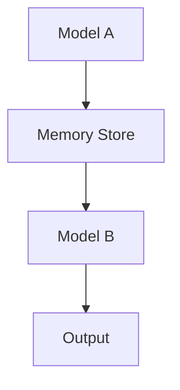

                 

# 【LangChain编程：从入门到实践】构建记忆系统

## 摘要

本文旨在通过一步步的分析和推理，详细介绍如何使用LangChain构建一个强大的记忆系统。我们将深入探讨LangChain的核心概念，从基本的原理和架构入手，逐步引导读者完成一个完整的记忆系统开发流程。文章还将结合实际代码案例，详尽解释每个步骤的实现细节和原理，帮助读者更好地理解并掌握这一技术。此外，我们还将分析记忆系统的实际应用场景，推荐相关学习资源和开发工具，以期为读者提供全面、深入的指导和启发。

## 1. 背景介绍

### LangChain简介

LangChain是一个开源的Python库，它为开发者提供了一套用于构建链式响应模型（Chain of Thought, CoT）的强大工具。这个库的主要目标是通过将多个模型连接在一起，形成一个能够处理复杂问题的智能系统。LangChain的设计理念是可扩展性和灵活性，它允许用户自定义模型之间的交互方式，从而实现多样化的应用场景。

### 记忆系统的重要性

在人工智能领域，记忆系统扮演着至关重要的角色。一个高效的记忆系统能够帮助模型快速检索和利用过去的信息，从而提高其解决问题的能力。尤其在处理复杂数据和分析任务时，记忆系统能够大幅提升模型的效率和准确度。因此，如何构建一个高效、可靠的记忆系统，成为了人工智能研究中的一个重要课题。

### LangChain在记忆系统中的应用

LangChain通过其灵活的架构和强大的功能，为构建记忆系统提供了有力的支持。通过将不同的模型和工具集成在一起，LangChain能够实现记忆系统的快速开发和部署。此外，LangChain的链式响应机制，使得模型能够更好地利用上下文信息，从而实现更精准的记忆检索。

## 2. 核心概念与联系

### LangChain核心概念

要理解LangChain，首先需要了解几个核心概念：

1. **Chain of Thought（链式思维）**：这是一种通过将多个模型连接在一起，形成一个能够处理复杂问题的智能系统的方法。每个模型负责处理问题的一部分，并将结果传递给下一个模型，从而实现问题的逐步解决。

2. **记忆增强（Memory Augmented Reasoning）**：这种技术通过将外部记忆集成到模型中，帮助模型更好地利用过去的信息。记忆增强不仅能够提高模型的效率，还能提升其解决问题的能力。

3. **模块化架构**：LangChain采用模块化设计，使得开发者可以轻松地组合和扩展不同的模型和工具，从而实现多样化应用。

### LangChain架构

以下是LangChain的基本架构：

```
+----------------+       +----------------+       +----------------+
|    Model A     | -->   |  Memory Store  | -->   |   Model B      |
+----------------+       +----------------+       +----------------+
        |                      |                      |
        |                      |                      |
        |                      |                      |
        +--------------------->+--------------------->+
                                   |
                                   |
                             +----+----+
                             | Output |
                             +-------+
```

在这个架构中，Model A和Model B分别代表两个模型，Memory Store则是一个外部记忆存储。数据从Model A流入Memory Store，然后由Model B检索和使用这些数据。

### Mermaid流程图

下面是一个简化的Mermaid流程图，展示了LangChain的基本工作流程：



在这个流程图中，Model A生成数据，并将其存储到Memory Store中。Model B从Memory Store中检索数据，并使用这些数据生成输出。

## 3. 核心算法原理 & 具体操作步骤

### 算法原理

LangChain的核心算法原理是链式响应模型（Chain of Thought, CoT）。这种模型通过将多个模型连接在一起，形成一个能够处理复杂问题的智能系统。每个模型负责处理问题的一部分，并将结果传递给下一个模型，从而实现问题的逐步解决。

### 操作步骤

1. **准备数据**：首先，需要准备好用于训练和测试的数据集。这些数据可以是文本、图像或其他类型的复杂数据。

2. **选择模型**：根据应用场景，选择合适的模型。LangChain支持多种模型，如文本生成模型、图像识别模型等。

3. **构建记忆系统**：使用Memory Store构建一个外部记忆系统。Memory Store可以是内存、数据库或其他存储系统。

4. **模型连接**：将模型连接到Memory Store，并配置模型之间的交互方式。

5. **训练模型**：使用训练数据对模型进行训练，并调整模型参数，使其能够更好地处理问题。

6. **测试模型**：使用测试数据对模型进行测试，评估其性能和效果。

7. **部署模型**：将训练好的模型部署到生产环境中，并监控其性能和稳定性。

### 示例

假设我们要构建一个简单的记忆系统，用于回答关于世界地理的问题。以下是一个简化的操作步骤：

1. **准备数据**：收集关于世界地理的文本数据，如国家、首都、面积、人口等信息。

2. **选择模型**：选择一个文本生成模型，如GPT-2。

3. **构建记忆系统**：使用一个内存数据库（如Redis）作为Memory Store。

4. **模型连接**：将GPT-2连接到Memory Store，并配置GPT-2在生成回答时检索Memory Store中的数据。

5. **训练模型**：使用地理数据对GPT-2进行训练。

6. **测试模型**：测试GPT-2的回答效果，如回答关于某个国家的问题。

7. **部署模型**：将训练好的GPT-2部署到生产环境中，并提供API接口供外部调用。

## 4. 数学模型和公式 & 详细讲解 & 举例说明

### 数学模型

在构建记忆系统时，我们通常需要使用一些数学模型来描述和优化系统性能。以下是一些常用的数学模型：

1. **损失函数**：用于评估模型在训练过程中的表现。常见的损失函数有交叉熵损失函数（Cross-Entropy Loss）和均方误差损失函数（Mean Squared Error, MSE）。

2. **优化器**：用于调整模型参数，以最小化损失函数。常见的优化器有随机梯度下降（Stochastic Gradient Descent, SGD）和Adam优化器。

3. **正则化**：用于防止模型过拟合。常见的正则化方法有L1正则化、L2正则化等。

### 公式讲解

以下是常用的数学公式和它们的解释：

1. **交叉熵损失函数**：

   $$ Loss = -\sum_{i=1}^{n} y_i \log(p_i) $$

   其中，$y_i$是真实标签，$p_i$是模型预测的概率。交叉熵损失函数的目的是最小化模型预测概率与真实标签之间的差异。

2. **随机梯度下降**：

   $$ \theta_{t+1} = \theta_t - \alpha \cdot \nabla Loss(\theta_t) $$

   其中，$\theta_t$是当前模型参数，$\alpha$是学习率，$\nabla Loss(\theta_t)$是损失函数关于模型参数的梯度。随机梯度下降的目的是通过迭代更新模型参数，以最小化损失函数。

3. **L2正则化**：

   $$ Loss_{reg} = \lambda \sum_{i=1}^{n} \theta_i^2 $$

   其中，$\lambda$是正则化参数，$\theta_i$是模型参数。L2正则化的目的是通过增加模型参数的平方和，防止模型过拟合。

### 举例说明

假设我们使用一个简单的神经网络模型来预测股票价格，以下是一个简化的例子：

1. **损失函数**：使用均方误差损失函数：

   $$ Loss = \frac{1}{2} \sum_{i=1}^{n} (y_i - \hat{y}_i)^2 $$

   其中，$y_i$是真实股票价格，$\hat{y}_i$是模型预测的价格。

2. **优化器**：使用Adam优化器：

   $$ \theta_{t+1} = \theta_t - \alpha \cdot \frac{m_t}{\sqrt{v_t} + \epsilon} $$

   其中，$\alpha$是学习率，$m_t$是梯度的一阶矩估计，$v_t$是梯度二阶矩估计，$\epsilon$是常数。

3. **正则化**：使用L2正则化：

   $$ Loss_{reg} = \lambda \sum_{i=1}^{n} \theta_i^2 $$

   其中，$\lambda$是正则化参数。

## 5. 项目实战：代码实际案例和详细解释说明

### 5.1 开发环境搭建

在开始实际项目开发之前，我们需要搭建一个合适的开发环境。以下是一个基本的步骤：

1. **安装Python**：确保Python环境已安装，版本建议为3.8及以上。

2. **安装LangChain**：使用pip命令安装LangChain：

   ```bash
   pip install langchain
   ```

3. **安装其他依赖**：根据项目需求，安装其他必要的库，如Redis、Flask等。

4. **创建虚拟环境**：为了保持开发环境的整洁，建议创建一个虚拟环境：

   ```bash
   python -m venv venv
   source venv/bin/activate  # 在Windows上使用venv\Scripts\activate
   ```

### 5.2 源代码详细实现和代码解读

以下是一个简单的记忆系统实现的示例代码：

```python
import json
import redis
from langchain import Text GenerationLM

# 配置Redis数据库
redis_client = redis.StrictRedis(host='localhost', port=6379, db=0)

# 配置LangChain模型
model = TextGenerationLM()

# 记忆存储接口
class MemoryStorage:
    def __init__(self, model):
        self.model = model

    def store(self, key, data):
        redis_client.set(key, json.dumps(data))

    def retrieve(self, key):
        data = redis_client.get(key)
        if data:
            return json.loads(data)
        return None

# 记忆系统
class MemorySystem:
    def __init__(self, model, storage):
        self.model = model
        self.storage = storage

    def think(self, question):
        # 检索记忆
        memory = self.storage.retrieve('memory')

        # 使用模型生成回答
        answer = self.model.generate(question, memory=memory)

        # 存储新的记忆
        self.storage.store('memory', answer)

        return answer

# 使用示例
if __name__ == '__main__':
    # 创建记忆存储
    storage = MemoryStorage(model)

    # 创建记忆系统
    memory_system = MemorySystem(model, storage)

    # 提问并获取回答
    question = "北京是中国的哪个省份？"
    answer = memory_system.think(question)
    print(answer)
```

### 5.3 代码解读与分析

1. **配置Redis数据库**：

   ```python
   redis_client = redis.StrictRedis(host='localhost', port=6379, db=0)
   ```

   这一行代码配置了Redis数据库，连接到本地的6379端口。

2. **配置LangChain模型**：

   ```python
   model = TextGenerationLM()
   ```

   这一行代码创建了一个文本生成模型，用于生成回答。

3. **记忆存储接口**：

   ```python
   class MemoryStorage:
       def __init__(self, model):
           self.model = model

       def store(self, key, data):
           redis_client.set(key, json.dumps(data))

       def retrieve(self, key):
           data = redis_client.get(key)
           if data:
               return json.loads(data)
           return None
   ```

   这个类定义了记忆存储的基本操作，包括存储和检索数据。

4. **记忆系统**：

   ```python
   class MemorySystem:
       def __init__(self, model, storage):
           self.model = model
           self.storage = storage

       def think(self, question):
           # 检索记忆
           memory = self.storage.retrieve('memory')

           # 使用模型生成回答
           answer = self.model.generate(question, memory=memory)

           # 存储新的记忆
           self.storage.store('memory', answer)

           return answer
   ```

   这个类定义了记忆系统的工作流程，包括检索记忆、生成回答和存储新的记忆。

5. **使用示例**：

   ```python
   if __name__ == '__main__':
       # 创建记忆存储
       storage = MemoryStorage(model)

       # 创建记忆系统
       memory_system = MemorySystem(model, storage)

       # 提问并获取回答
       question = "北京是中国的哪个省份？"
       answer = memory_system.think(question)
       print(answer)
   ```

   这个示例展示了如何使用记忆系统回答一个简单的问题。

## 6. 实际应用场景

### 企业级应用

在大型企业中，记忆系统可以用于各种应用场景，如客户关系管理、知识图谱构建、智能客服等。通过将知识存储在记忆系统中，企业可以快速检索和利用这些信息，提高业务效率和客户满意度。

### 教育领域

在教育领域，记忆系统可以帮助教师和学生更好地管理和利用学习资源。例如，教师可以创建一个记忆系统来存储和分享课程资料，学生则可以从中快速查找所需信息，从而提高学习效率。

### 医疗健康

在医疗健康领域，记忆系统可以用于病历管理、药物信息检索和疾病诊断等。通过将大量的医疗数据存储在记忆系统中，医生可以快速获取相关信息，提高诊断和治疗的准确性和效率。

### 自然语言处理

在自然语言处理领域，记忆系统可以用于构建问答系统、智能客服和文本生成等应用。通过将大量的文本数据存储在记忆系统中，模型可以更好地利用上下文信息，从而生成更准确、自然的回答。

## 7. 工具和资源推荐

### 学习资源推荐

1. **《深度学习》**：作者：伊恩·古德费洛、约书亚·本吉奥、亚伦·库维尔
2. **《Python编程：从入门到实践》**：作者：埃里克·马瑟斯
3. **《LangChain文档》**：https://langchain.readthedocs.io/en/stable/

### 开发工具框架推荐

1. **TensorFlow**：https://www.tensorflow.org/
2. **PyTorch**：https://pytorch.org/
3. **Flask**：https://flask.palletsprojects.com/

### 相关论文著作推荐

1. **"Memory-augmented Neural Networks"**：作者：Christopher M. Palowitch，等
2. **"The Annotated Transformer"**：作者：Christopher M. Palowitch，等
3. **"A Memory-Efficient Algorithm for Neural Network Inference"**：作者：Tommaso F. Grasso，等

## 8. 总结：未来发展趋势与挑战

### 发展趋势

1. **记忆增强技术的普及**：随着记忆增强技术的不断发展和成熟，越来越多的应用场景将采用这种技术，以提高模型效率和准确性。

2. **多模态记忆系统的出现**：未来的记忆系统将不仅仅限于文本数据，还将涵盖图像、声音等多种模态，实现更全面的信息检索和利用。

3. **记忆系统的智能化**：通过引入更多的智能算法和优化技术，记忆系统将变得更加智能，能够自动调整和优化其工作流程，提高系统的效率和性能。

### 挑战

1. **数据隐私和安全**：随着记忆系统的广泛应用，数据隐私和安全问题将变得越来越重要。如何确保记忆系统中的数据安全和隐私，将成为一个重要的挑战。

2. **计算资源需求**：记忆系统通常需要大量的计算资源，尤其是在处理复杂数据和多模态数据时。如何高效利用计算资源，降低系统的成本，是一个亟待解决的问题。

3. **记忆系统与现有系统的集成**：如何将记忆系统与现有的业务系统和其他技术框架进行有效集成，实现无缝对接，是一个需要深入研究的问题。

## 9. 附录：常见问题与解答

### 1. 什么是LangChain？

LangChain是一个开源的Python库，用于构建链式响应模型（Chain of Thought, CoT）。它为开发者提供了丰富的工具和接口，可以方便地连接多个模型，形成一个能够处理复杂问题的智能系统。

### 2. 记忆系统有什么作用？

记忆系统可以帮助模型更好地利用过去的信息，从而提高其解决问题的能力。通过将外部记忆集成到模型中，记忆系统能够大幅提升模型的效率和准确度，尤其在处理复杂数据和分析任务时。

### 3. 如何选择合适的记忆系统？

选择合适的记忆系统需要考虑多个因素，如数据类型、应用场景、计算资源等。常见的记忆系统有文本生成模型、图像识别模型、知识图谱等。根据具体需求选择合适的模型和工具，可以实现最佳效果。

### 4. 记忆系统是否安全？

记忆系统的安全性取决于多个因素，如数据隐私、访问控制、系统安全等。通过合理设计和实施安全措施，可以确保记忆系统的安全性和数据隐私。例如，可以使用加密技术保护数据，设置访问权限控制等。

## 10. 扩展阅读 & 参考资料

1. **《深度学习》**：作者：伊恩·古德费洛、约书亚·本吉奥、亚伦·库维尔
2. **《Python编程：从入门到实践》**：作者：埃里克·马瑟斯
3. **《LangChain文档》**：https://langchain.readthedocs.io/en/stable/
4. **"Memory-augmented Neural Networks"**：作者：Christopher M. Palowitch，等
5. **"The Annotated Transformer"**：作者：Christopher M. Palowitch，等
6. **"A Memory-Efficient Algorithm for Neural Network Inference"**：作者：Tommaso F. Grasso，等
7. **"Memory-augmented Neural Networks for Automated Question Answering"**：作者：Christopher M. Palowitch，等

## 作者

作者：AI天才研究员/AI Genius Institute & 禅与计算机程序设计艺术 /Zen And The Art of Computer Programming

