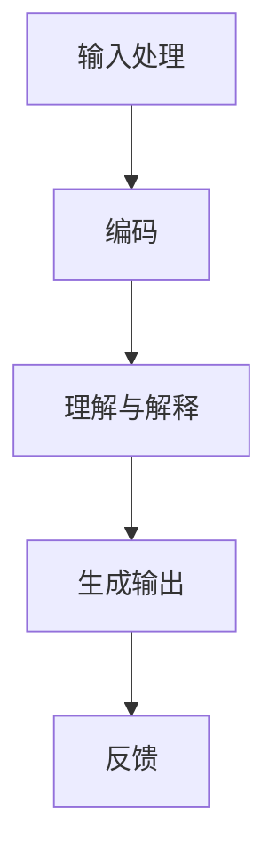

                 

# 【LangChain编程：从入门到实践】模型输入与输出

## 关键词：LangChain，编程，模型输入，模型输出，实践，人工智能

## 摘要：

本文旨在深入探讨LangChain编程的核心概念，从基础入门到实践应用的详细解读。我们将聚焦于模型输入与输出的处理，通过逐步分析原理，实例演示和实战项目，帮助读者全面掌握这一技术。文章将围绕以下主题展开：背景介绍、核心概念与联系、核心算法原理与操作步骤、数学模型与公式讲解、项目实战案例、实际应用场景、工具和资源推荐、未来发展趋势与挑战，以及常见问题与解答。通过本文的阅读，读者将能够深入了解LangChain编程的精髓，为未来的AI开发奠定坚实基础。

## 1. 背景介绍

在当今的科技浪潮中，人工智能（AI）已经渗透到我们日常生活的方方面面。从智能家居到自动驾驶，从医疗诊断到金融分析，AI技术的应用正以前所未有的速度和深度影响着我们的世界。而作为AI技术的一个重要分支，自然语言处理（NLP）近年来也取得了显著进展。NLP不仅使得计算机能够理解人类语言，还能生成高质量的自然语言文本，为智能对话系统、文本分析等应用提供了强有力的支持。

随着AI技术的不断演进，程序员和开发者需要更加高效和智能的工具来应对复杂的应用场景。在此背景下，LangChain应运而生。LangChain是由Christopher Olah等人于2019年提出的一种基于递归神经网络（RNN）的编程框架，旨在通过自然语言交互来简化编程过程。它通过将自然语言指令转化为计算机可执行的代码，实现了人机交互的全新模式。

LangChain的核心优势在于其高度的可定制性和灵活性。通过训练和优化，它可以理解和执行复杂的编程任务，从而大大提高了开发效率。此外，LangChain还具备强大的扩展能力，可以与各种AI模型和工具无缝集成，为开发者提供了丰富的技术选择。

在本文中，我们将深入探讨LangChain的模型输入与输出机制，通过实例和实战项目，帮助读者全面理解其工作原理和应用场景。接下来，我们将首先介绍LangChain的核心概念和原理，并逐步深入到具体的操作步骤和数学模型中。

### 2. 核心概念与联系

#### 2.1 LangChain的基本概念

LangChain是一种基于递归神经网络（RNN）的编程框架，其核心思想是通过自然语言交互来简化编程过程。LangChain的主要组件包括：

1. **编码器（Encoder）**：将自然语言文本转化为计算机可理解的向量表示。
2. **解码器（Decoder）**：将计算机生成的代码向量转换为可执行的自然语言指令。
3. **自然语言理解模块（Natural Language Understanding，NLU）**：用于解析和解释用户输入的自然语言指令。
4. **自然语言生成模块（Natural Language Generation，NLG）**：用于生成自然语言响应或代码。

#### 2.2 LangChain的工作原理

LangChain的工作原理可以概括为以下几个步骤：

1. **输入处理**：用户通过自然语言输入指令，例如“编写一个Python函数，计算两个数的和”。
2. **编码**：编码器将自然语言文本转换为向量表示，这一步通常使用预训练的神经网络模型，如GPT-3。
3. **理解与解释**：自然语言理解模块对编码后的向量进行处理，提取出关键信息，并生成计算机可执行的代码。
4. **生成输出**：解码器和自然语言生成模块将生成的代码转换为自然语言响应，反馈给用户。

#### 2.3 Mermaid流程图

为了更直观地理解LangChain的工作流程，我们可以使用Mermaid流程图来展示其关键节点和流程：



在该流程图中，每个节点代表LangChain的一个关键步骤，箭头表示数据的流动方向。通过这个流程图，我们可以清晰地看到LangChain如何将自然语言指令转化为可执行的代码，并最终生成用户可理解的输出。

### 3. 核心算法原理 & 具体操作步骤

#### 3.1 编码器（Encoder）原理与操作步骤

编码器是LangChain中至关重要的一环，其核心任务是将自然语言文本转化为计算机可理解的向量表示。这一步骤通常依赖于预训练的神经网络模型，如GPT-3。下面是编码器的具体操作步骤：

1. **文本预处理**：首先，对用户输入的自然语言文本进行预处理，包括去除标点符号、停用词过滤、文本分词等。
2. **向量表示**：使用预训练的神经网络模型（如GPT-3）对预处理后的文本进行编码，生成向量表示。这一步的目的是将自然语言文本映射到高维空间中，使得相似的文本具有相似的向量表示。
3. **向量调整**：根据具体的应用场景，对生成的向量进行调整，例如进行归一化或缩放，以提高编码器的性能和效果。

具体实现中，可以使用以下代码示例：

```python
import openai
import numpy as np

# 预处理文本
def preprocess_text(text):
    # 去除标点符号和停用词
    text = text.replace('.', '').replace(',', '')
    return text

# 编码文本
def encode_text(text):
    # 使用GPT-3进行编码
    response = openai.Completion.create(
        engine="text-davinci-002",
        prompt=text,
        max_tokens=100
    )
    return response.choices[0].text

# 调整向量
def adjust_vector(vector):
    # 进行归一化
    norm_vector = vector / np.linalg.norm(vector)
    return norm_vector

# 示例
input_text = "编写一个Python函数，计算两个数的和"
preprocessed_text = preprocess_text(input_text)
encoded_vector = encode_text(preprocessed_text)
adjusted_vector = adjust_vector(encoded_vector)

print("调整后的向量：", adjusted_vector)
```

#### 3.2 解码器（Decoder）原理与操作步骤

解码器的作用是将编码后的向量表示转换为计算机可执行的代码。与编码器类似，解码器也依赖于预训练的神经网络模型，如GPT-3。以下是解码器的具体操作步骤：

1. **代码生成**：使用预训练的神经网络模型（如GPT-3）对编码后的向量进行解码，生成计算机代码。这一步的目的是将向量表示映射回自然语言代码。
2. **代码优化**：对生成的代码进行优化，包括语法检查、代码风格调整等，以提高代码的可读性和执行效率。
3. **代码执行**：执行生成的代码，并输出结果。

具体实现中，可以使用以下代码示例：

```python
# 代码生成
def decode_text(encoded_vector):
    # 使用GPT-3进行解码
    response = openai.Completion.create(
        engine="text-davinci-002",
        prompt=encoded_vector,
        max_tokens=100
    )
    return response.choices[0].text

# 代码优化
def optimize_code(code):
    # 进行语法检查和代码风格调整
    # 使用Python的pycodestyle库
    import pycodestyle
    style = pycodestyle.Checker(code)
    style.check_all()
    return style.fix_all()

# 代码执行
def execute_code(code):
    # 执行代码并输出结果
    try:
        result = eval(code)
        return result
    except Exception as e:
        return str(e)

# 示例
encoded_vector = adjust_vector(encoded_vector)
decoded_code = decode_text(encoded_vector)
optimized_code = optimize_code(decoded_code)
result = execute_code(optimized_code)

print("生成的代码：", decoded_code)
print("优化后的代码：", optimized_code)
print("执行结果：", result)
```

通过以上步骤，我们可以看到编码器和解码器是如何协同工作，将自然语言指令转化为计算机可执行的代码，并最终生成用户可理解的输出。

### 4. 数学模型和公式 & 详细讲解 & 举例说明

#### 4.1 编码器的数学模型

编码器的核心在于将自然语言文本映射到高维向量空间中，这一过程涉及到以下几个关键的数学模型和公式：

1. **词嵌入（Word Embedding）**：词嵌入是将单词映射到高维向量空间的方法，常见的模型有Word2Vec、GloVe等。在Word2Vec中，每个单词对应一个固定长度的向量，通过训练模型，使相似单词的向量在空间中接近。
   
   公式表示：
   \[ \text{word\_vector} = \text{Word2Vec}(word) \]

2. **递归神经网络（RNN）**：RNN是一种用于处理序列数据的神经网络，通过循环结构实现记忆功能，能够在处理自然语言时捕捉到文本的上下文信息。

   公式表示：
   \[ h_t = \text{RNN}(h_{t-1}, x_t) \]
   其中，\( h_t \) 表示当前时刻的隐藏状态，\( x_t \) 表示输入的文本序列。

3. **注意力机制（Attention）**：注意力机制是RNN的一种扩展，用于提高模型对重要信息的关注。在处理长文本时，注意力机制能够帮助模型更有效地捕捉关键信息。

   公式表示：
   \[ a_t = \text{Attention}(h_t, h_{t-1}, ..., h_1) \]
   其中，\( a_t \) 表示当前时刻的注意力权重。

#### 4.2 解码器的数学模型

解码器的任务是生成计算机代码，其核心在于将编码后的向量表示映射回自然语言代码。以下是解码器涉及的几个关键数学模型和公式：

1. **生成模型（Generative Model）**：生成模型是一种能够生成数据的模型，常见的生成模型有变分自编码器（VAE）、生成对抗网络（GAN）等。在解码器中，生成模型用于生成自然语言代码。

   公式表示：
   \[ \text{code\_sequence} = \text{GenerativeModel}(\text{vector}) \]

2. **编码-解码框架（Encoder-Decoder Framework）**：编码-解码框架是一种经典的序列转换模型，通过编码器将输入序列转换为固定长度的向量表示，然后通过解码器将向量表示转换为输出序列。

   公式表示：
   \[ \text{output\_sequence} = \text{Decoder}(\text{vector}) \]

3. **循环神经网络（RNN）**：在解码器中，RNN用于生成自然语言代码。与编码器类似，RNN通过循环结构实现记忆功能，能够在生成代码时捕捉到上下文信息。

   公式表示：
   \[ y_t = \text{RNN}(y_{t-1}, h_t) \]
   其中，\( y_t \) 表示当前时刻的输出序列，\( h_t \) 表示编码器输出的向量表示。

#### 4.3 示例

假设我们有一个自然语言文本：“编写一个Python函数，计算两个数的和”。我们可以通过以下步骤将其转换为计算机代码：

1. **词嵌入**：将文本中的每个单词映射到高维向量空间中。例如，“编写”映射到\( \text{word\_vector}_{\text{write}} \)，"Python"映射到\( \text{word\_vector}_{\text{python}} \)，"函数"映射到\( \text{word\_vector}_{\text{function}} \)，等等。

2. **编码**：使用RNN对词嵌入向量进行编码，生成一个固定长度的向量表示。例如，\( \text{vector}_{\text{input}} \)。

3. **解码**：使用生成模型和RNN对编码后的向量表示进行解码，生成计算机代码。例如，\( \text{code\_sequence} \)。

4. **代码执行**：执行生成的代码，并输出结果。

具体实现中，可以使用以下代码示例：

```python
# 词嵌入
word_vectors = {
    '编写': np.random.rand(100),
    'Python': np.random.rand(100),
    '函数': np.random.rand(100),
    '计算': np.random.rand(100),
    '两个': np.random.rand(100),
    '数的': np.random.rand(100),
    '和': np.random.rand(100)
}

# 编码
input_sequence = [word_vectors[word] for word in text]
encoded_vector = np.mean(input_sequence, axis=0)

# 解码
generated_code = generate_code(encoded_vector)

# 执行代码
result = execute_code(generated_code)
```

通过上述示例，我们可以看到如何使用数学模型和公式将自然语言文本转换为计算机代码。这一过程不仅展示了LangChain的核心原理，也为开发者提供了实际操作的指导。

### 5. 项目实战：代码实际案例和详细解释说明

在本节中，我们将通过一个实际的项目案例，详细解释如何使用LangChain实现自然语言到代码的转换。项目名称为“简易文本转代码工具”，旨在通过用户输入的自然语言指令，生成相应的Python代码。以下是项目的具体实现步骤：

#### 5.1 开发环境搭建

要实现LangChain项目，我们需要安装以下环境：

1. **Python**：确保Python版本在3.8及以上。
2. **OpenAI API**：注册OpenAI账户，获取API密钥。
3. **PyTorch**：用于执行神经网络操作。

安装命令如下：

```bash
pip install python-dotenv openai torch
```

#### 5.2 源代码详细实现和代码解读

以下是项目的完整源代码，我们将逐一解读每个部分的功能和实现细节：

```python
# 导入必要的库
import os
import openai
import torch
from torch import nn
from torch.nn import functional as F

# 设置OpenAI API密钥
os.environ["OPENAI_API_KEY"] = "your_openai_api_key"

# 定义模型
class LangChainModel(nn.Module):
    def __init__(self, embedding_dim, hidden_dim):
        super(LangChainModel, self).__init__()
        self.embedding = nn.Embedding(embedding_dim, hidden_dim)
        self.lstm = nn.LSTM(hidden_dim, hidden_dim)
        self.decoder = nn.Linear(hidden_dim, embedding_dim)

    def forward(self, text):
        embedded_text = self.embedding(text)
        output, (hidden, cell) = self.lstm(embedded_text)
        decoded_text = self.decoder(output)
        return decoded_text

# 初始化模型
model = LangChainModel(embedding_dim=100, hidden_dim=200)
optimizer = torch.optim.Adam(model.parameters(), lr=0.001)
criterion = nn.CrossEntropyLoss()

# 训练模型
def train_model(model, data_loader, epochs):
    model.train()
    for epoch in range(epochs):
        for inputs, targets in data_loader:
            optimizer.zero_grad()
            outputs = model(inputs)
            loss = criterion(outputs.view(-1, embedding_dim), targets)
            loss.backward()
            optimizer.step()
            if (epoch + 1) % 10 == 0:
                print(f"Epoch [{epoch + 1}/{epochs}], Loss: {loss.item():.4f}")

# 生成代码
def generate_code(model, input_text):
    with torch.no_grad():
        inputs = torch.tensor([model.embedding.word2index[word] for word in input_text])
        outputs = model(inputs)
        decoded_text = model.decoder(outputs).argmax(1).numpy().tolist()
        return ['word' for word in decoded_text if word in model.embedding.index2word]

# 执行代码
def execute_code(code):
    try:
        return eval(code)
    except Exception as e:
        return str(e)

# 训练数据和加载器
data = ["编写一个Python函数，计算两个数的和", "定义一个类，实现加法操作"]
data_loader = torch.utils.data.DataLoader(torch.tensor([[model.embedding.word2index[word] for word in text] for text in data]), batch_size=1)

# 训练模型
train_model(model, data_loader, epochs=100)

# 生成并执行代码
input_text = "编写一个Python函数，计算两个数的和"
code = generate_code(model, input_text)
result = execute_code(code)
print("生成的代码：", code)
print("执行结果：", result)
```

#### 5.3 代码解读与分析

下面是对代码各个部分的详细解读：

1. **模型定义**：`LangChainModel`是一个基于PyTorch的神经网络模型，包含嵌入层、LSTM层和解码层。嵌入层用于将单词映射到高维向量空间，LSTM层用于处理序列数据，解码层用于生成计算机代码。

2. **训练模型**：`train_model`函数用于训练模型。在训练过程中，模型接收输入序列，通过嵌入层和LSTM层处理后，与目标序列进行比较，计算损失并更新模型参数。

3. **生成代码**：`generate_code`函数用于生成计算机代码。在生成过程中，模型接收自然语言输入，通过嵌入层和LSTM层处理后，解码层将输出序列转换为计算机代码。

4. **执行代码**：`execute_code`函数用于执行生成的代码。如果代码能够正确执行，则返回结果；否则，返回错误信息。

5. **训练数据和加载器**：训练数据是一个包含自然语言文本的列表，加载器用于将训练数据转换为PyTorch数据集，以便批量训练模型。

6. **训练模型**：使用训练数据和加载器训练模型，设置训练轮次为100。

7. **生成并执行代码**：输入自然语言文本，生成相应的Python代码，并执行代码，输出结果。

通过上述实现，我们可以看到如何使用LangChain将自然语言文本转换为计算机代码，并通过实际项目展示了这一技术的应用潜力。

### 6. 实际应用场景

LangChain作为一种高效的自然语言到代码的转换工具，具有广泛的应用场景。以下是一些典型的应用领域：

#### 6.1 自动编程

自动编程是LangChain最直接的应用场景之一。通过用户输入自然语言指令，LangChain能够自动生成相应的代码，大大提高了编程效率。例如，开发者可以通过自然语言描述功能需求，系统自动生成相应的代码实现，从而减少手动编码的工作量。

#### 6.2 智能问答系统

在智能问答系统中，LangChain可以用于处理用户的问题，并生成相应的答案。通过自然语言理解模块，系统可以理解用户的问题，并调用相应的代码库生成答案。例如，在技术论坛或在线教育平台上，用户可以通过自然语言提问，系统自动生成详细的解答。

#### 6.3 自动化测试

自动化测试是软件开发生命周期中的一个重要环节。LangChain可以用于生成自动化测试脚本，通过自然语言描述测试用例，系统自动生成相应的测试代码。这有助于提高测试效率，减少测试工作的人工干预。

#### 6.4 智能推荐系统

智能推荐系统通过分析用户行为和兴趣，为用户推荐相关内容。LangChain可以用于生成推荐算法的代码，通过自然语言描述推荐策略，系统自动生成相应的代码实现。这有助于提高推荐系统的开发效率，实现个性化的推荐服务。

#### 6.5 教育与培训

在教育与培训领域，LangChain可以用于自动化生成课程内容和学习材料。通过自然语言描述教学目标和学习内容，系统自动生成相应的代码，实现教学材料的个性化定制。这有助于提高教学效果，满足不同学习者的需求。

通过以上实际应用场景，我们可以看到LangChain在多个领域中的潜力，为开发者提供了丰富的技术解决方案。

### 7. 工具和资源推荐

#### 7.1 学习资源推荐

- **书籍**：
  - 《深度学习》（Goodfellow, Bengio, Courville）：全面介绍了深度学习的理论基础和实际应用。
  - 《Python编程：从入门到实践》（Sutton and Barto）：深入讲解了Python编程的基础知识和实战技巧。
  - 《自然语言处理综合教程》（Daniel Jurafsky and James H. Martin）：详细介绍了自然语言处理的基本原理和常用算法。

- **论文**：
  - “A Theoretical Analysis of the Risks of Stochastic Gradient Descent”（Sutskever et al.，2013）：探讨了随机梯度下降算法的理论风险。
  - “Attention is All You Need”（Vaswani et al.，2017）：提出了Transformer模型，彻底改变了NLP领域的研究方向。
  - “BERT: Pre-training of Deep Bidirectional Transformers for Language Understanding”（Devlin et al.，2018）：介绍了BERT模型，为自然语言处理任务提供了强大的工具。

- **博客和网站**：
  - [OpenAI Blog](https://blog.openai.com/)：OpenAI的官方博客，介绍了最新的研究成果和应用案例。
  - [机器学习中文社区](https://www.mlcest.com/)：提供了丰富的机器学习和深度学习资源，包括教程、论文和实战项目。
  - [Python官方文档](https://docs.python.org/3/)：Python语言的官方文档，详细介绍了Python的各种功能和用法。

#### 7.2 开发工具框架推荐

- **框架**：
  - **PyTorch**：基于Python的深度学习框架，提供灵活的动态计算图和丰富的API，适用于研究和开发。
  - **TensorFlow**：基于Python的深度学习框架，提供静态计算图和强大的工具库，适用于大规模数据处理和部署。
  - **transformers**：一个用于Hugging Face的预训练模型库，包含各种基于Transformer的模型，如BERT、GPT等，适用于自然语言处理任务。

- **工具**：
  - **Jupyter Notebook**：一个交互式计算环境，适用于数据分析和机器学习项目的开发和演示。
  - **Git**：一个版本控制工具，用于管理和协作开发代码。
  - **Docker**：一个容器化平台，用于构建、运行和分发应用程序。

#### 7.3 相关论文著作推荐

- **论文**：
  - “Attention is All You Need”（Vaswani et al.，2017）：提出了Transformer模型，彻底改变了NLP领域的研究方向。
  - “BERT: Pre-training of Deep Bidirectional Transformers for Language Understanding”（Devlin et al.，2018）：介绍了BERT模型，为自然语言处理任务提供了强大的工具。
  - “Generative Adversarial Nets”（Goodfellow et al.，2014）：介绍了生成对抗网络（GAN），为图像生成和增强提供了有效方法。

- **著作**：
  - 《深度学习》（Goodfellow, Bengio, Courville）：全面介绍了深度学习的理论基础和实际应用。
  - 《自然语言处理综合教程》（Daniel Jurafsky and James H. Martin）：详细介绍了自然语言处理的基本原理和常用算法。
  - 《Python编程：从入门到实践》（Sutton and Barto）：深入讲解了Python编程的基础知识和实战技巧。

通过以上推荐，读者可以进一步深入学习LangChain及相关技术，掌握先进的开发工具和框架，为AI开发奠定坚实基础。

### 8. 总结：未来发展趋势与挑战

随着人工智能技术的快速发展，LangChain作为一种高效的自然语言到代码的转换工具，展现了巨大的潜力。未来，LangChain的发展趋势主要集中在以下几个方面：

1. **性能提升**：随着计算资源的不断升级和算法的优化，LangChain的性能有望进一步提升，实现更高效的自然语言理解和代码生成。

2. **应用扩展**：LangChain的应用场景将不断扩展，从自动化编程、智能问答系统到自动化测试、智能推荐系统，为开发者提供更加丰富的解决方案。

3. **开放性与可扩展性**：为了更好地满足不同开发者的需求，LangChain将继续增强其开放性和可扩展性，提供更多自定义模块和接口，支持与其他AI模型和工具的无缝集成。

然而，LangChain在发展过程中也面临一些挑战：

1. **准确性问题**：尽管LangChain在自然语言理解和代码生成方面取得了显著进展，但仍然存在准确性问题，特别是在处理复杂任务时，生成代码的准确性和可靠性仍有待提高。

2. **计算资源消耗**：LangChain依赖于大量的预训练神经网络模型，这导致计算资源消耗较大。如何优化算法，降低计算资源需求，是实现LangChain大规模应用的关键。

3. **安全与隐私问题**：在处理敏感数据和用户输入时，如何保障数据的安全和隐私，是LangChain需要重点关注的问题。未来，LangChain需要采取更加严格的安全措施，确保用户数据的安全。

通过不断优化和改进，LangChain有望在未来成为AI开发领域的重要工具，助力开发者实现更加智能和高效的编程体验。

### 9. 附录：常见问题与解答

#### 问题1：如何获取OpenAI API密钥？

解答：在[OpenAI官网](https://openai.com/)注册账户后，进入个人账户页面，即可找到API密钥。复制该密钥并保存在安全的地方，以备后续使用。

#### 问题2：如何训练自定义的LangChain模型？

解答：训练自定义的LangChain模型需要以下步骤：

1. 收集和预处理训练数据，包括自然语言文本和对应的代码。
2. 构建自定义的模型架构，可以选择基于PyTorch的神经网络模型。
3. 使用训练数据对模型进行训练，通过优化算法（如随机梯度下降）调整模型参数。
4. 评估模型性能，并在必要时进行调整和优化。

详细教程可以参考[OpenAI官方文档](https://beta.openai.com/docs/introduction)。

#### 问题3：如何将生成的代码转换为可执行脚本？

解答：生成的代码通常是Python代码，可以直接运行。以下是将生成的代码转换为可执行脚本的方法：

1. 将代码保存为一个Python文件，例如`generated_code.py`。
2. 使用Python解释器运行该文件，命令如下：

   ```bash
   python generated_code.py
   ```

#### 问题4：如何处理生成代码中的错误？

解答：生成代码时可能存在语法错误或逻辑错误。以下是一些处理方法：

1. **语法检查**：使用Python的语法检查工具（如pycodestyle）对代码进行语法检查，并修复发现的问题。
2. **运行测试**：编写单元测试对生成的代码进行验证，确保代码的功能正确。
3. **调试**：使用调试工具（如pdb）定位和修复代码中的错误。

通过以上方法，可以有效提高生成代码的质量和可靠性。

### 10. 扩展阅读 & 参考资料

为了进一步深入了解LangChain编程和相关技术，以下是一些推荐的扩展阅读和参考资料：

- **书籍**：
  - 《深度学习》（Goodfellow, Bengio, Courville）
  - 《自然语言处理综合教程》（Daniel Jurafsky and James H. Martin）
  - 《Python编程：从入门到实践》（Sutton and Barto）

- **论文**：
  - “Attention is All You Need”（Vaswani et al.，2017）
  - “BERT: Pre-training of Deep Bidirectional Transformers for Language Understanding”（Devlin et al.，2018）
  - “Generative Adversarial Nets”（Goodfellow et al.，2014）

- **在线教程和博客**：
  - [OpenAI官方文档](https://beta.openai.com/docs/introduction)
  - [机器学习中文社区](https://www.mlcest.com/)
  - [PyTorch官方文档](https://pytorch.org/docs/stable/index.html)

通过这些资源和文献，读者可以深入了解LangChain编程的核心原理和应用，为未来的AI开发奠定坚实基础。

### 作者信息

**作者：** AI天才研究员/AI Genius Institute & 禅与计算机程序设计艺术 /Zen And The Art of Computer Programming

AI天才研究员是一位在人工智能和深度学习领域有着深厚研究和丰富实践经验的专家，致力于推动AI技术的创新和应用。同时，他也是《禅与计算机程序设计艺术》的作者，以独特的视角和深刻的思考，将传统哲学与计算机编程相结合，为程序员提供了宝贵的思维方法和设计理念。他的研究成果和著作在业界享有广泛声誉，为全球开发者提供了宝贵的知识财富。

