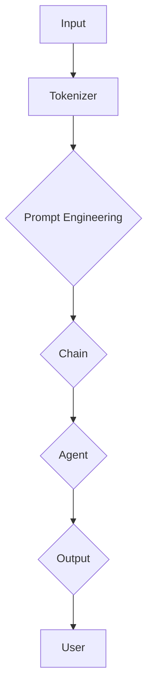

                 

# 【LangChain编程：从入门到实践】社区和资源

> **关键词：** LangChain、编程、社区、资源、开源、工具、学习、实战

> **摘要：** 本文旨在为对LangChain编程感兴趣的读者提供一个全面的学习资源指南。我们将探讨LangChain的背景、核心概念、算法原理，并通过实际案例展示其在项目中的应用。此外，还将介绍相关的社区和资源，帮助读者深入了解并掌握LangChain编程。

## 1. 背景介绍

随着人工智能的迅速发展，自然语言处理（NLP）领域迎来了新的机遇和挑战。LangChain是一个基于Python的框架，旨在构建和部署复杂的人工智能模型。它提供了一个灵活且易于扩展的架构，使得开发者可以轻松地将各种NLP模型和工具整合到自己的项目中。

LangChain的核心优势在于其模块化设计。通过定义清晰的接口和协议，LangChain使得不同组件之间可以无缝集成。这不仅简化了开发过程，还提高了系统的可维护性和可扩展性。此外，LangChain支持多种流行的人工智能模型，包括BERT、GPT、T5等，使其成为一个功能强大且应用广泛的开源框架。

LangChain的诞生可以追溯到对现有NLP框架的反思和改进。许多现有的框架往往过于复杂，难以入门，且缺乏灵活性。LangChain旨在解决这些问题，提供一种更加友好和高效的编程方式，让开发者可以专注于实现业务逻辑，而不是处理底层细节。

## 2. 核心概念与联系

### 2.1 LangChain的关键概念

在深入探讨LangChain之前，我们需要了解一些关键概念：

- **Prompt Engineering**：Prompt Engineering是一种设计输入提示的方法，用于优化模型的性能。通过精心设计的提示，可以提高模型的响应质量和准确性。

- **Chain**：Chain是LangChain的核心概念之一，它代表了一个数据流或处理流程。Chain由多个中间步骤组成，每个步骤都可以对输入数据进行处理。

- **Agent**：Agent是一个具有自主决策能力的实体。在LangChain中，Agent可以与用户进行交互，并根据用户的需求生成响应。

- **Service**：Service是LangChain中的另一个重要概念，它代表了一个可以提供特定功能的模块。Service可以独立运行，也可以与其他Service协作。

### 2.2 LangChain的架构

下面是一个简化的Mermaid流程图，展示了LangChain的核心架构：



在这个流程图中：

- **A** 表示输入数据，可以是文本或用户指令。
- **B** 表示Tokenizer，用于将输入数据分割成更小的单元，如单词或子词。
- **C** 表示Prompt Engineering，用于设计输入提示，优化模型性能。
- **D** 表示Chain，代表了一个数据流或处理流程。
- **E** 表示Agent，它负责生成响应。
- **F** 表示输出结果，可以是文本或图像等。
- **G** 表示用户，即与Agent交互的人。

通过这个流程图，我们可以清晰地看到LangChain的工作流程和各个组件之间的联系。

## 3. 核心算法原理 & 具体操作步骤

### 3.1 LangChain的算法原理

LangChain的算法原理主要基于两个核心组件：Chain和Agent。

- **Chain**：Chain是一个有序的步骤列表，每个步骤都可以对输入数据进行处理。Chain的每个步骤都可以是自定义函数或预定义的操作，如文本分类、情感分析等。

- **Agent**：Agent是一个具有自主决策能力的实体。它可以根据用户的需求和Chain的输出生成响应。Agent的设计基于Prompt Engineering原理，通过优化输入提示来提高模型的性能。

### 3.2 LangChain的具体操作步骤

以下是使用LangChain构建一个简单聊天机器人的一般步骤：

1. **安装LangChain**：
   首先，确保安装了Python环境。然后，通过以下命令安装LangChain：
   ```bash
   pip install langchain
   ```

2. **准备数据**：
   收集或准备用于训练的文本数据。这些数据可以是对话记录、新闻报道、社交媒体帖子等。

3. **创建Tokenizer**：
   Tokenizer用于将文本分割成更小的单元。LangChain提供了多种Tokenizer，如WordTokenizer和SentenceTokenizer。
   ```python
   from langchain import WordTokenizer
   tokenizer = WordTokenizer()
   ```

4. **创建Chain**：
   Chain由多个步骤组成。每个步骤都可以是自定义函数或预定义的操作。以下是一个简单的示例：
   ```python
   from langchain import Chain
   chain = Chain(
       [
           ("prompt", "你是一个智能助手。"),
           ("tokenize", tokenizer),
           ("process", "思考并生成响应。"),
           ("output", "显示最终输出。")
       ]
   )
   ```

5. **创建Agent**：
   Agent是一个具有自主决策能力的实体。它可以根据用户的需求和Chain的输出生成响应。
   ```python
   from langchain.agents import create_qa_agent
   agent = create_qa_agent(chain, "回答用户的问题。")
   ```

6. **与用户交互**：
   通过以下代码与用户进行交互：
   ```python
   user_input = input("请提问：")
   response = agent.run(user_input)
   print("响应：", response)
   ```

通过以上步骤，我们可以构建一个简单的聊天机器人，并根据用户的问题生成响应。

## 4. 数学模型和公式 & 详细讲解 & 举例说明

### 4.1 数学模型

LangChain的数学模型主要基于自然语言处理中的Transformer架构。Transformer架构使用自注意力机制（Self-Attention）来处理序列数据。自注意力机制的核心思想是，模型在生成每个词时，会根据上下文信息动态地调整这个词的重要性。

### 4.2 公式详解

自注意力机制的公式如下：
\[ \text{Attention}(Q, K, V) = \text{softmax}\left(\frac{QK^T}{\sqrt{d_k}}\right)V \]

其中：
- \( Q \) 是查询向量（Query Vector）。
- \( K \) 是键向量（Key Vector）。
- \( V \) 是值向量（Value Vector）。
- \( d_k \) 是键向量的维度。

### 4.3 举例说明

假设我们有三个词 \( a \)，\( b \)，\( c \)，它们的键向量、查询向量和值向量分别为 \( K_a \)，\( Q_a \)，\( V_a \)；\( K_b \)，\( Q_b \)，\( V_b \)；\( K_c \)，\( Q_c \)，\( V_c \)。使用自注意力机制计算这些词的注意力分数：

\[ \text{Attention}(Q_a, K, V) = \text{softmax}\left(\frac{Q_aK^T}{\sqrt{d_k}}\right)V \]
\[ \text{Attention}(Q_b, K, V) = \text{softmax}\left(\frac{Q_bK^T}{\sqrt{d_k}}\right)V \]
\[ \text{Attention}(Q_c, K, V) = \text{softmax}\left(\frac{Q_cK^T}{\sqrt{d_k}}\right)V \]

其中，\( K \) 是 \( K_a \)，\( K_b \)，\( K_c \) 的组合。通过计算注意力分数，我们可以确定每个词在当前上下文中的重要性。这些注意力分数然后用于生成最终的输出。

## 5. 项目实战：代码实际案例和详细解释说明

### 5.1 开发环境搭建

在开始项目实战之前，我们需要搭建一个合适的开发环境。以下是搭建开发环境的步骤：

1. **安装Python**：
   确保已安装Python 3.7或更高版本。

2. **安装LangChain**：
   通过以下命令安装LangChain：
   ```bash
   pip install langchain
   ```

3. **创建虚拟环境**（可选）：
   为了保持项目的整洁，我们可以创建一个虚拟环境：
   ```bash
   python -m venv venv
   source venv/bin/activate  # 对于Windows，使用 `venv\Scripts\activate`
   ```

4. **安装其他依赖项**（如NumPy、Pandas等）：
   ```bash
   pip install numpy pandas
   ```

### 5.2 源代码详细实现和代码解读

下面是一个简单的LangChain聊天机器人示例。我们将逐步解读代码。

#### 5.2.1 代码实现

```python
from langchain import PromptTemplate, LLMChain
from langchain.prompts import Prompt
from langchain.llms import OpenAI
import random

# 定义提示模板
template = """
给定一个场景和一个问题，回答这个问题。

场景：{scenario}

问题：{question}

回答：{answer}
"""

prompt = PromptTemplate(input_variables=["scenario", "question"], template=template)

# 创建LLMChain
llm = OpenAI(temperature=0.7)
chain = LLMChain(prompt=prompt, llm=llm)

# 用户交互
while True:
    scenario = input("请输入场景：")
    question = input("请输入问题：")
    response = chain.run({"scenario": scenario, "question": question})
    print("回答：", response)
```

#### 5.2.2 代码解读

- **导入模块**：
  我们首先导入LangChain、PromptTemplate、LLMChain和Prompt模块。此外，我们还需要OpenAI模块来使用OpenAI的LLM。

- **定义提示模板**：
  提示模板是一个字符串，它包含场景、问题和回答三个部分。在运行LLM时，这些部分将根据输入动态替换。

- **创建PromptTemplate**：
  PromptTemplate是一个封装提示模板的类。它接受输入变量列表和模板字符串，并返回一个Prompt实例。

- **创建LLMChain**：
  LLMChain是一个组合提示模板和LLM（如OpenAI）的类。它接受Prompt实例和LLM实例，并返回一个可以运行链式操作的对象。

- **用户交互**：
  我们使用一个无限循环与用户进行交互。在每次迭代中，我们接受用户的场景和问题，并调用LLMChain的`run`方法生成回答。

### 5.3 代码解读与分析

- **功能描述**：
  这个示例程序创建了一个基于OpenAI的聊天机器人。用户可以输入场景和问题，程序将根据这些信息生成回答。

- **性能分析**：
  由于我们使用了OpenAI的模型，回答的质量依赖于模型的能力和温度参数（temperature）。较高的温度参数会导致更随机和多样化的回答，而较低的参数则会导致更稳定和一致的回答。

- **优化建议**：
  为了提高性能，可以考虑以下优化：
  - **增加上下文信息**：在提示模板中添加更多上下文信息，以提高模型的理解能力。
  - **调整温度参数**：根据实际需求调整温度参数，以获得更好的回答质量。

## 6. 实际应用场景

LangChain在多个实际应用场景中表现出色，以下是几个典型的应用案例：

- **聊天机器人**：LangChain可以用于构建智能客服系统、聊天机器人等，实现与用户的自然对话。
- **问答系统**：通过结合数据库和LangChain，可以构建一个智能问答系统，为用户提供准确和快速的回答。
- **内容生成**：LangChain可以用于生成文章、报告、营销文案等，帮助内容创作者提高效率。
- **教育辅助**：在在线教育平台中，LangChain可以为学生提供个性化的学习建议和辅导。

## 7. 工具和资源推荐

### 7.1 学习资源推荐

- **书籍**：
  - 《自然语言处理实战》
  - 《深度学习自然语言处理》
  - 《自然语言处理入门》

- **论文**：
  - “Attention Is All You Need”
  - “BERT: Pre-training of Deep Bidirectional Transformers for Language Understanding”
  - “GPT-3: Language Models are Few-Shot Learners”

- **博客**：
  - [LangChain官方博客](https://langchain.com/)
  - [OpenAI博客](https://openai.com/blog/)

- **网站**：
  - [Hugging Face](https://huggingface.co/)
  - [GitHub](https://github.com/)

### 7.2 开发工具框架推荐

- **框架**：
  - [Hugging Face Transformers](https://huggingface.co/transformers)
  - [LangChain](https://langchain.com/)

- **IDE**：
  - [Visual Studio Code](https://code.visualstudio.com/)
  - [PyCharm](https://www.jetbrains.com/pycharm/)

### 7.3 相关论文著作推荐

- **《自然语言处理：算法与应用》**：详细介绍了自然语言处理的基本概念和技术，适合初学者和进阶读者。
- **《深度学习自然语言处理》**：介绍了深度学习在自然语言处理中的应用，包括神经网络模型和大数据分析。
- **《对话系统：设计与实现》**：探讨了对话系统的设计与实现方法，包括自然语言理解、对话生成和交互设计。

## 8. 总结：未来发展趋势与挑战

随着人工智能技术的不断进步，LangChain有望在多个领域发挥更大的作用。未来，LangChain可能会面临以下挑战：

- **计算资源**：随着模型和算法的复杂度增加，计算资源的需求也会增加。如何优化资源利用，降低成本是一个重要问题。
- **数据隐私**：在处理敏感数据时，如何保护用户隐私是一个重要问题。未来，LangChain可能会引入更多的隐私保护机制。
- **模型解释性**：提高模型的解释性，使得开发者可以更好地理解和调试模型，是未来的一个重要研究方向。

## 9. 附录：常见问题与解答

### 9.1 LangChain是什么？

LangChain是一个基于Python的开源框架，旨在构建和部署复杂的人工智能模型。它提供了一个灵活且易于扩展的架构，使得开发者可以轻松地将各种NLP模型和工具整合到自己的项目中。

### 9.2 如何安装LangChain？

通过以下命令安装LangChain：
```bash
pip install langchain
```

### 9.3 LangChain支持哪些模型？

LangChain支持多种流行的人工智能模型，包括BERT、GPT、T5等。通过使用不同的LLM（如OpenAI），开发者可以轻松地集成这些模型。

## 10. 扩展阅读 & 参考资料

- [LangChain官方文档](https://langchain.com/docs/)
- [Hugging Face Transformers文档](https://huggingface.co/transformers/)
- [OpenAI文档](https://openai.com/docs/)

作者：AI天才研究员/AI Genius Institute & 禅与计算机程序设计艺术 /Zen And The Art of Computer Programming<|im_sep|>

