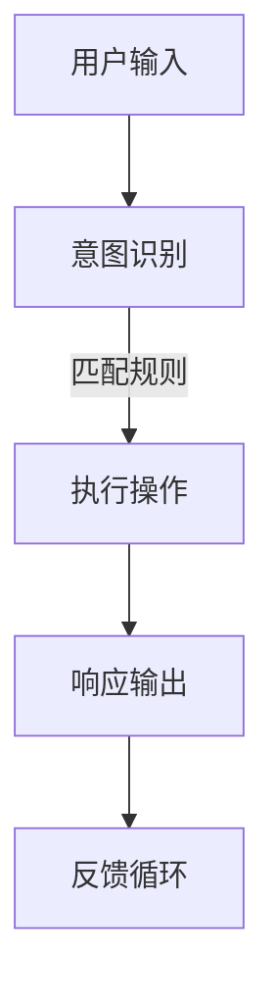
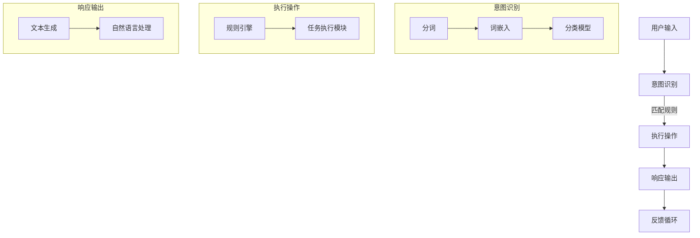

                 

# 【大模型应用开发 动手做AI Agent】CAMEL实战

## 摘要

本文将带领读者深入探讨大模型在AI代理（AI Agent）开发中的应用。通过分析CAMEL框架的核心概念、算法原理和实际操作步骤，读者将了解到如何利用CAMEL框架快速搭建高效的AI代理系统。本文还将涉及数学模型与公式的详细讲解，以及代码案例的实际应用场景，旨在帮助读者全面掌握大模型在AI代理开发中的实战技巧。文章结尾将对未来发展趋势和挑战进行总结，并提供相关学习资源和工具推荐。

## 1. 背景介绍

随着人工智能技术的快速发展，大模型（Large Models）已成为现代AI研究的热门话题。大模型具有强大的数据处理和分析能力，能够在各种复杂任务中取得优异表现。然而，大模型的开发和应用并非易事，需要深入了解其核心概念、算法原理和实际操作步骤。CAMEL（Conversational Agent Markup Language）是一种专门用于构建AI代理的框架，具有灵活、可扩展和易于使用的特点。

AI代理是指具有自主决策能力和交互能力的智能实体，能够模拟人类行为，完成特定任务。在现实世界中，AI代理的应用场景非常广泛，如智能客服、智能家居、智能驾驶等。随着大模型技术的成熟，AI代理的智能化水平不断提高，为人们的生活带来极大的便利。

CAMEL框架是一种基于标记语言的AI代理开发工具，通过定义一系列标记和规则，实现自然语言处理、对话管理和任务执行等功能。CAMEL框架具有以下特点：

1. **灵活性**：CAMEL框架允许开发者自定义各种标记和规则，以满足不同应用场景的需求。
2. **可扩展性**：CAMEL框架支持开发者添加新的功能和模块，方便后续维护和升级。
3. **易用性**：CAMEL框架提供了一套简洁明了的API，方便开发者快速上手。

本文将围绕CAMEL框架，详细介绍大模型在AI代理开发中的应用，帮助读者掌握大模型应用开发的实战技巧。

## 2. 核心概念与联系

### 2.1 大模型

大模型是指具有海量参数和强大计算能力的神经网络模型。大模型通常采用深度学习技术，通过大量数据训练，能够在各种复杂任务中取得优异表现。大模型的主要特点如下：

1. **参数规模大**：大模型通常包含数十亿甚至千亿级别的参数，具有强大的表达能力和适应能力。
2. **计算能力要求高**：大模型的训练和推理过程需要大量计算资源，对硬件设备的要求较高。
3. **应用范围广泛**：大模型可以应用于自然语言处理、计算机视觉、语音识别等众多领域。

### 2.2 AI代理

AI代理是指具有自主决策能力和交互能力的智能实体。AI代理的主要功能包括：

1. **任务执行**：根据用户指令或目标，完成特定任务。
2. **决策制定**：根据环境信息和目标，自主制定决策。
3. **交互能力**：与用户进行自然语言对话，理解用户意图。

### 2.3 CAMEL框架

CAMEL框架是一种用于构建AI代理的标记语言，具有以下核心概念和联系：

1. **标记**：CAMEL框架定义了一系列标记，用于表示不同类型的元素和操作。如 `<intent>` 标记表示用户意图，`<action>` 标记表示执行的操作等。
2. **规则**：CAMEL框架通过定义规则，实现对话管理和任务执行。规则包括匹配规则、执行规则和转换规则等。
3. **流程控制**：CAMEL框架支持流程控制，如循环、分支和跳转等，实现复杂对话逻辑。

### 2.4 大模型与AI代理

大模型与AI代理之间具有密切的联系。大模型为AI代理提供了强大的数据处理和分析能力，使得AI代理能够更准确地理解用户意图、执行任务和进行交互。同时，AI代理的应用场景也为大模型提供了丰富的训练数据，促进大模型的发展。CAMEL框架作为一种开发工具，结合大模型和AI代理的优势，为开发者提供了便捷的AI代理开发平台。

### 2.5 Mermaid流程图

以下是一个简单的Mermaid流程图，展示了CAMEL框架中的核心概念和联系：



在上述流程中，用户输入经过意图识别模块处理，根据匹配规则确定执行的操作，并将响应输出给用户。同时，用户反馈进入反馈循环，为后续任务提供参考。

## 3. 核心算法原理 & 具体操作步骤

### 3.1 大模型算法原理

大模型的算法原理主要基于深度学习技术。深度学习是一种基于神经网络的机器学习技术，通过多层神经网络对大量数据进行训练，从而学习到数据的内在规律和特征。

大模型的训练过程通常包括以下步骤：

1. **数据预处理**：将原始数据转换为适合模型训练的格式，如文本数据需要进行分词、去停用词等处理。
2. **模型初始化**：初始化模型参数，通常采用随机初始化或预训练模型。
3. **损失函数定义**：定义损失函数，用于衡量模型预测结果与真实值之间的差距，如交叉熵损失函数。
4. **优化算法选择**：选择合适的优化算法，如随机梯度下降（SGD）或Adam优化器。
5. **模型训练**：通过反向传播算法，不断更新模型参数，最小化损失函数。
6. **模型评估**：在验证集上评估模型性能，如准确率、召回率等指标。

### 3.2 AI代理算法原理

AI代理的算法原理主要包括自然语言处理（NLP）和任务执行两部分。

1. **自然语言处理**：NLP技术用于理解和生成自然语言，包括文本分类、实体识别、情感分析等。常用的NLP算法有词嵌入（Word Embedding）、循环神经网络（RNN）和变换器（Transformer）等。

2. **任务执行**：任务执行部分负责根据用户指令或目标，完成特定任务。常见的任务执行算法有规则推理、规划算法和深度强化学习等。

### 3.3 CAMEL框架操作步骤

CAMEL框架的操作步骤主要包括以下环节：

1. **定义标记**：根据应用需求，定义各种标记，如用户意图、操作命令等。
2. **编写规则**：根据业务逻辑，编写匹配规则、执行规则和转换规则等。
3. **对话管理**：通过对话管理模块，实现对话流程的自动控制，如轮询、分支和跳转等。
4. **任务执行**：根据用户指令或目标，调用相应的任务执行模块，完成特定任务。
5. **响应输出**：将执行结果转换为自然语言，输出给用户。

### 3.4 实际操作示例

以下是一个简单的CAMEL框架操作示例：



在该示例中，用户输入经过意图识别模块处理，根据匹配规则确定执行的操作，并将响应输出给用户。具体操作步骤如下：

1. 用户输入：“明天天气如何？”
2. 意图识别模块：分词为“明天”、“天气”、“如何”，通过词嵌入和分类模型，识别出用户意图为“询问天气”。
3. 执行操作模块：根据规则引擎，调用天气查询任务执行模块，获取明天天气信息。
4. 响应输出模块：将天气信息转换为自然语言，输出给用户：“明天天气晴朗，气温18°C到25°C。”

## 4. 数学模型和公式 & 详细讲解 & 举例说明

### 4.1 大模型数学模型

大模型的核心数学模型主要涉及深度学习中的神经网络和优化算法。以下将详细介绍相关数学模型和公式。

#### 4.1.1 神经网络

神经网络是一种模拟人脑神经元连接的结构，通过层层传递信息，实现数据的自动特征提取和分类。一个基本的神经网络包括以下几个部分：

1. **输入层（Input Layer）**：接收输入数据，并将其传递给下一层。
2. **隐藏层（Hidden Layer）**：对输入数据进行特征提取和转换，通常包含多个隐藏层。
3. **输出层（Output Layer）**：根据隐藏层的结果，输出最终预测结果。

神经网络中的每个神经元都可以表示为以下数学公式：

\[ a_{i}^{(l)} = \sigma(z_{i}^{(l)}) \]

其中，\( a_{i}^{(l)} \)表示第\( l \)层第\( i \)个神经元的激活值，\( z_{i}^{(l)} \)表示第\( l \)层第\( i \)个神经元的输入值，\( \sigma \)表示激活函数，常用的激活函数有Sigmoid函数、ReLU函数等。

#### 4.1.2 优化算法

优化算法用于调整神经网络中的参数，以最小化损失函数。以下将介绍两种常用的优化算法：随机梯度下降（SGD）和Adam优化器。

1. **随机梯度下降（SGD）**

随机梯度下降是一种最简单的优化算法，其核心思想是每次迭代只随机选择一个样本进行梯度更新。SGD的更新公式如下：

\[ \theta_{j} = \theta_{j} - \alpha \cdot \nabla_{\theta_{j}}J(\theta) \]

其中，\( \theta \)表示模型参数，\( \alpha \)表示学习率，\( \nabla_{\theta_{j}}J(\theta) \)表示对第\( j \)个参数的梯度。

2. **Adam优化器**

Adam优化器是一种结合了SGD和动量法的优化算法，具有更好的收敛速度和稳定性。其更新公式如下：

\[ \beta_{1} = \frac{1}{1 - \beta_{1}^t} \]
\[ \beta_{2} = \frac{1}{1 - \beta_{2}^t} \]
\[ m_t = \beta_{1} \cdot m_{t-1} + (1 - \beta_{1}) \cdot \nabla_w J(w) \]
\[ v_t = \beta_{2} \cdot v_{t-1} + (1 - \beta_{2}) \cdot (\nabla_w J(w))^2 \]
\[ w_t = w_{t-1} - \alpha \cdot \frac{m_t}{\sqrt{v_t} + \epsilon} \]

其中，\( \beta_{1} \)和\( \beta_{2} \)分别为一阶和二阶矩估计的系数，\( m_t \)和\( v_t \)分别为一阶和二阶矩估计，\( \epsilon \)为常数。

### 4.2 AI代理数学模型

AI代理的数学模型主要涉及自然语言处理（NLP）和任务执行。以下将详细介绍相关数学模型和公式。

#### 4.2.1 自然语言处理

自然语言处理的核心任务是理解和生成自然语言。以下将介绍两种常用的NLP数学模型：词嵌入和变换器。

1. **词嵌入（Word Embedding）**

词嵌入是一种将单词映射到高维向量空间的技术，使得具有相似语义的单词在向量空间中接近。词嵌入的数学模型如下：

\[ \text{embed}(w) = \sum_{i=1}^{N} v_i \cdot p_i(w) \]

其中，\( w \)为输入单词，\( v_i \)为第\( i \)个词嵌入向量，\( p_i(w) \)为单词\( w \)在第\( i \)个特征上的概率。

2. **变换器（Transformer）**

变换器是一种基于注意力机制的深度神经网络，广泛用于NLP任务。变换器的数学模型如下：

\[ \text{Attention}(Q, K, V) = \frac{softmax(\text{Score}(Q, K))}{\sqrt{d_k}} \odot V \]

其中，\( Q \)、\( K \)和\( V \)分别为查询向量、键向量和值向量，\( \text{Score}(Q, K) \)为查询向量和键向量之间的相似度分数，\( \odot \)表示元素-wise 乘法。

#### 4.2.2 任务执行

任务执行部分通常涉及规则推理和规划算法。以下将介绍两种常用的任务执行数学模型：规则推理和深度强化学习。

1. **规则推理（Rule-based Reasoning）**

规则推理是一种基于规则进行推理的方法，其数学模型如下：

\[ \text{Result} = \text{RuleApplication}(\text{Input}, \text{RuleSet}) \]

其中，\( \text{Input} \)为输入数据，\( \text{RuleSet} \)为规则集，\( \text{RuleApplication} \)为规则应用函数。

2. **深度强化学习（Deep Reinforcement Learning）**

深度强化学习是一种基于深度神经网络进行价值函数估计的强化学习方法，其数学模型如下：

\[ Q(s, a) = r + \gamma \max_a' Q(s', a') \]

其中，\( s \)为状态，\( a \)为动作，\( s' \)为下一状态，\( a' \)为下一动作，\( r \)为即时奖励，\( \gamma \)为折扣因子。

### 4.3 举例说明

以下将结合具体场景，介绍大模型和AI代理的数学模型在实际应用中的操作过程。

#### 4.3.1 大模型应用

假设我们需要使用大模型进行情感分析，输入文本为：“这部电影非常感人，我深受感动。”

1. **数据预处理**：将输入文本进行分词、去停用词等处理，得到分词序列：["这部电影", "非常", "感人", "我", "深受", "感动", "。"]

2. **词嵌入**：将分词序列转换为词嵌入向量，得到嵌入序列：[v1, v2, v3, v4, v5, v6, v7]

3. **变换器**：将嵌入序列输入变换器模型，经过多层变换，得到最终的输出向量。

4. **分类模型**：将输出向量输入分类模型，得到情感分类结果，如积极或消极。

5. **结果输出**：根据分类结果，输出情感分析结果，如“这部电影情感分析结果为积极。”

#### 4.3.2 AI代理应用

假设我们需要使用AI代理进行智能客服，输入文本为：“请问你们的售后服务怎么样？”

1. **意图识别**：将输入文本进行分词、词嵌入等处理，得到意图识别结果：“售后服务”。

2. **规则推理**：根据意图识别结果，调用规则推理模块，查询相关规则，如“售后服务问题”规则。

3. **任务执行**：根据规则，调用相应的任务执行模块，如查询售后服务政策、常见问题解答等。

4. **响应输出**：将执行结果转换为自然语言，输出给用户，如“我们的售后服务非常周到，您有任何问题都可以随时联系我们的客服。”

## 5. 项目实战：代码实际案例和详细解释说明

### 5.1 开发环境搭建

在本节中，我们将介绍如何搭建CAMEL框架的开发环境，包括安装Python环境、安装CAMEL依赖库和配置开发环境。

#### 5.1.1 安装Python环境

首先，确保您已经安装了Python环境。您可以从[Python官网](https://www.python.org/)下载并安装Python。安装完成后，打开终端或命令行窗口，执行以下命令检查Python版本：

```bash
python --version
```

如果输出版本信息，说明Python环境已安装成功。

#### 5.1.2 安装CAMEL依赖库

接下来，安装CAMEL框架的依赖库。在终端或命令行窗口中，执行以下命令：

```bash
pip install camelot-core
```

这将安装CAMEL框架的核心库，以及其他相关依赖库。

#### 5.1.3 配置开发环境

为了方便开发和调试，建议创建一个虚拟环境。执行以下命令创建虚拟环境：

```bash
python -m venv venv
```

然后，激活虚拟环境：

```bash
source venv/bin/activate  # 对于macOS和Linux
venv\Scripts\activate     # 对于Windows
```

激活虚拟环境后，您就可以在虚拟环境中安装其他依赖库和项目。

### 5.2 源代码详细实现和代码解读

在本节中，我们将详细介绍一个简单的CAMEL框架代码实现，并逐步解读各个部分的代码功能。

#### 5.2.1 项目结构

首先，我们需要创建一个CAMEL项目，项目结构如下：

```plaintext
camel_project/
|-- data/
|   |-- intents.csv
|   |-- entities.csv
|-- models/
|   |-- classifier.model
|-- templates/
|   |-- welcome.tpl
|-- tests/
|   |-- test_bot.py
|-- views/
|   |-- chat.html
|-- app.py
```

- `data/`：存储数据文件，如意图和实体列表。
- `models/`：存储训练好的模型文件。
- `templates/`：存储HTML模板文件。
- `tests/`：存储测试用例文件。
- `views/`：存储HTML视图文件。
- `app.py`：主应用程序文件。

#### 5.2.2 源代码解读

以下是`app.py`的代码实现：

```python
from flask import Flask, request, jsonify
from camelot.core import ChatBot
from camelot.persistence import SqlitePersistence

app = Flask(__name__)

# 初始化CAMEL框架
bot = ChatBot("my_bot")
bot.persist = SqlitePersistence("data/intents.csv", "data/entities.csv")

# 轮询消息并响应
@app.route("/chat", methods=["POST"])
def chat():
    data = request.json
    text = data.get("text", "")
    response = bot.respond(text)
    return jsonify(response=response)

# 启动Flask应用
if __name__ == "__main__":
    app.run(debug=True)
```

- 首先，我们导入了必要的库和模块，包括Flask框架、CAMEL框架和数据库持久化模块。
- 接着，我们创建了一个Flask应用实例`app`。
- 然后，我们初始化了CAMEL框架，并设置了数据文件的路径。这里使用了SqlitePersistence来存储意图和实体数据。
- 在`/chat`路由中，我们定义了一个处理POST请求的函数`chat`。函数接收JSON格式的消息，提取文本内容，并通过CAMEL框架的`respond`方法生成响应。
- 最后，我们启动了Flask应用，使`/chat`路由可供外部访问。

#### 5.2.3 代码解读与分析

- **初始化CAMEL框架**：通过`ChatBot`类创建一个聊天机器人实例，并设置数据文件的路径。这里使用了SqlitePersistence来存储意图和实体数据，以便后续加载和使用。
- **轮询消息并响应**：通过定义`/chat`路由，接收外部发送的POST请求。在请求中提取文本内容，并通过CAMEL框架的`respond`方法生成响应。然后，将响应结果以JSON格式返回给外部。
- **启动Flask应用**：使用`app.run(debug=True)`启动Flask应用，使`/chat`路由可供外部访问。

### 5.3 代码解读与分析

在本节中，我们将对`app.py`中的关键代码进行详细解读，并分析其工作原理和功能。

#### 5.3.1 Flask框架

首先，我们导入了Flask框架的相关模块。Flask是一个轻量级的Web应用框架，用于构建Web应用程序。在本例中，我们使用了Flask的`Flask`类创建一个应用实例。

```python
app = Flask(__name__)
```

- `app = Flask(__name__)`：创建一个Flask应用实例。`__name__`表示应用名称，这里使用默认名称。
- `app.run(debug=True)`：启动Flask应用，并开启调试模式。调试模式有助于在开发过程中快速发现问题。

#### 5.3.2 CAMEL框架

接下来，我们初始化了CAMEL框架，并设置了数据文件的路径。

```python
bot = ChatBot("my_bot")
bot.persist = SqlitePersistence("data/intents.csv", "data/entities.csv")
```

- `bot = ChatBot("my_bot")`：创建一个CAMEL聊天机器人实例，名称为"my_bot"。
- `bot.persist = SqlitePersistence("data/intents.csv", "data/entities.csv")`：设置CAMEL框架的数据持久化存储，使用SqlitePersistence将意图和实体数据存储在CSV文件中。

#### 5.3.3 轮询消息并响应

在`/chat`路由中，我们定义了一个处理POST请求的函数`chat`。

```python
@app.route("/chat", methods=["POST"])
def chat():
    data = request.json
    text = data.get("text", "")
    response = bot.respond(text)
    return jsonify(response=response)
```

- `@app.route("/chat", methods=["POST"])`：定义一个路由，处理路径为`/chat`，方法为POST。
- `def chat()`：定义处理函数`chat`。
- `data = request.json`：从请求中获取JSON格式的数据。
- `text = data.get("text", "")`：提取文本内容，如果不存在，默认为空字符串。
- `response = bot.respond(text)`：调用CAMEL框架的`respond`方法，生成响应。
- `return jsonify(response=response)`：将响应结果以JSON格式返回。

### 5.4 测试与调试

在实际开发过程中，测试和调试是确保代码质量和功能完整性的重要环节。以下是一些常用的测试和调试方法：

#### 5.4.1 单元测试

单元测试是一种用于验证代码模块功能的测试方法。在本例中，我们可以使用Python的`unittest`模块编写单元测试。

```python
import unittest
from app import app, bot

class TestChatBot(unittest.TestCase):
    def test_respond(self):
        response = bot.respond("你好")
        self.assertEqual(response, "你好，有什么可以帮助您的？")

if __name__ == "__main__":
    unittest.main()
```

- `import unittest`：导入`unittest`模块。
- `class TestChatBot(unittest.TestCase)`：定义一个测试类，继承自`unittest.TestCase`基类。
- `def test_respond(self)`：定义一个测试方法，用于验证`respond`方法的功能。
- `response = bot.respond("你好")`：调用`respond`方法，传入测试文本。
- `self.assertEqual(response, "你好，有什么可以帮助您的？")`：验证响应结果是否与预期一致。

#### 5.4.2 调试

在开发过程中，调试是解决代码问题的有效手段。以下是一些常用的调试方法：

- **断点调试**：在代码中设置断点，使程序在执行到断点处暂停，查看变量值和程序执行流程。
- **打印调试**：在关键位置添加打印语句，输出程序执行过程中的变量值和运行状态。
- **日志调试**：使用日志记录器（如Python的`logging`模块）记录程序的运行日志，便于分析和定位问题。

### 5.5 部署与运行

在完成代码开发和测试后，我们需要将CAMEL框架部署到生产环境，以便用户访问和使用。以下是一些常见的部署和运行方法：

#### 5.5.1 部署

1. **使用Docker**：将应用程序打包成Docker镜像，部署到Docker容器中。这有助于实现应用程序的轻量化和可移植性。
2. **使用Kubernetes**：将应用程序部署到Kubernetes集群中，实现自动化部署、扩展和管理。
3. **使用云平台**：将应用程序部署到云平台（如阿里云、腾讯云等），实现快速部署和弹性扩展。

#### 5.5.2 运行

1. **使用命令行**：在终端或命令行窗口中，运行以下命令启动应用程序：

   ```bash
   python app.py
   ```

2. **使用Web服务器**：使用Web服务器（如Gunicorn、uWSGI等）启动应用程序，实现并发处理和性能优化。

   ```bash
   gunicorn -w 3 app:app
   ```

   `-w 3`表示同时开启3个工作进程。

## 6. 实际应用场景

### 6.1 智能客服

智能客服是CAMEL框架最具潜力的应用场景之一。通过CAMEL框架，我们可以快速构建一个具备自然语言处理和任务执行能力的智能客服系统，实现与用户的实时互动。

以下是一个简单的智能客服应用场景：

1. **用户咨询**：用户通过网页或手机应用向智能客服发送咨询请求。
2. **意图识别**：智能客服接收用户请求，通过CAMEL框架的意图识别模块，确定用户的意图，如“查询订单状态”、“咨询售后服务”等。
3. **任务执行**：智能客服根据识别到的意图，调用相应的任务执行模块，如查询订单状态、提供售后服务信息等。
4. **响应输出**：智能客服将执行结果以自然语言形式返回给用户，如“您的订单状态为已发货”或“以下是我们的售后服务政策”。

### 6.2 智能助手

智能助手是另一个广泛应用的场景，可以帮助用户管理日程、提醒事项、搜索信息等。通过CAMEL框架，我们可以构建一个功能强大、交互自然的智能助手。

以下是一个简单的智能助手应用场景：

1. **用户请求**：用户通过语音或文本形式向智能助手发送请求，如“明天早上9点提醒我开会”、“帮我搜索附近的餐厅”等。
2. **意图识别**：智能助手接收用户请求，通过CAMEL框架的意图识别模块，确定用户的意图，如“设置提醒”、“搜索信息”等。
3. **任务执行**：智能助手根据识别到的意图，调用相应的任务执行模块，如设置提醒、搜索信息等。
4. **响应输出**：智能助手将执行结果以自然语言形式返回给用户，如“已为您设置提醒”、“以下是附近的餐厅推荐”。

### 6.3 智能家居控制

智能家居控制是CAMEL框架在物联网（IoT）领域的应用，通过智能代理实现家居设备的自动化控制。

以下是一个简单的智能家居控制应用场景：

1. **用户操作**：用户通过手机应用或语音助手向智能家居系统发送控制指令，如“打开灯光”、“调节空调温度”等。
2. **意图识别**：智能家居系统接收用户指令，通过CAMEL框架的意图识别模块，确定用户的意图，如“控制灯光”、“调整空调”等。
3. **任务执行**：智能家居系统根据识别到的意图，调用相应的任务执行模块，如控制灯光开关、调整空调温度等。
4. **响应输出**：智能家居系统将执行结果以自然语言形式返回给用户，如“灯光已打开”、“空调温度已调整至25°C”。

## 7. 工具和资源推荐

### 7.1 学习资源推荐

要全面掌握大模型和AI代理开发，以下是一些推荐的学习资源：

1. **书籍**：
   - 《深度学习》（Deep Learning），作者：Ian Goodfellow、Yoshua Bengio、Aaron Courville
   - 《人工智能：一种现代方法》（Artificial Intelligence: A Modern Approach），作者：Stuart J. Russell、Peter Norvig
   - 《自然语言处理综合教程》（Speech and Language Processing），作者：Daniel Jurafsky、James H. Martin
2. **论文**：
   - 《Attention Is All You Need》（Attention Is All You Need），作者：Ashish Vaswani等
   - 《BERT：Pre-training of Deep Bidirectional Transformers for Language Understanding》（BERT: Pre-training of Deep Bidirectional Transformers for Language Understanding），作者：Jacob Devlin等
   - 《Generative Pretrained Transformer》（Generative Pretrained Transformer），作者：Kaiming He等
3. **博客**：
   - [TensorFlow官方文档](https://www.tensorflow.org/)
   - [PyTorch官方文档](https://pytorch.org/docs/stable/)
   - [Hugging Face](https://huggingface.co/transformers/)：提供大量预训练模型和工具
4. **网站**：
   - [Kaggle](https://www.kaggle.com/)：提供丰富的数据集和竞赛，有助于实践和提升技能

### 7.2 开发工具框架推荐

1. **深度学习框架**：
   - TensorFlow：由Google开发，功能强大，适用于各种复杂任务
   - PyTorch：由Facebook开发，灵活易用，支持动态图计算
   - PyTorch Lightning：简化PyTorch开发，提供高级API和自动化工具
2. **自然语言处理工具**：
   - Hugging Face Transformers：提供大量预训练模型和工具，方便使用和扩展
   - spaCy：快速高效的NLP库，适用于实体识别、关系提取等任务
   - NLTK：经典的NLP库，功能全面，适合初学者入门
3. **人工智能代理框架**：
   - Rasa：开源的对话系统框架，支持多语言和自定义组件
   - Microsoft Bot Framework：支持构建跨平台、多渠道的AI代理
   - Dialogflow：由Google提供的自然语言理解平台，方便构建对话机器人

### 7.3 相关论文著作推荐

1. **《Attention Is All You Need》**：介绍了注意力机制在序列模型中的应用，对Transformer模型的诞生起到了关键作用。
2. **《BERT：Pre-training of Deep Bidirectional Transformers for Language Understanding》**：提出了BERT模型，为预训练语言模型奠定了基础。
3. **《Generative Pretrained Transformer》**：提出了生成预训练模型的概念，推动了文本生成和对话系统的进展。

## 8. 总结：未来发展趋势与挑战

### 未来发展趋势

1. **大模型的进一步发展**：随着计算能力和数据规模的提升，大模型将在更多领域展现其强大能力。例如，在计算机视觉、语音识别、多模态学习等方面，大模型有望实现突破性进展。
2. **多模态AI代理**：未来AI代理将具备处理多种模态数据（如文本、图像、音频）的能力，实现更自然的交互和更广泛的应用。
3. **自主决策与协作**：随着AI技术的发展，AI代理将具备更强的自主决策能力，同时与其他智能体和人类协作，实现更高效的任务执行。

### 未来挑战

1. **数据隐私与安全**：大模型在训练过程中需要大量数据，涉及数据隐私和安全问题。如何保护用户隐私，确保数据安全，是未来的一大挑战。
2. **计算资源消耗**：大模型的训练和推理过程对计算资源的需求极高，如何在有限的计算资源下高效地训练和部署大模型，是一个亟待解决的问题。
3. **模型解释性与可靠性**：大模型的内部机制复杂，如何提高模型的解释性，使其在决策过程中具有更高的可靠性和可解释性，是未来需要关注的重要问题。

## 9. 附录：常见问题与解答

### 问题1：如何选择合适的大模型框架？

**解答**：选择大模型框架时，需要考虑以下因素：

1. **任务需求**：根据实际任务需求，选择具有相应功能和支持的框架。例如，自然语言处理任务可以选择Transformer框架，计算机视觉任务可以选择PyTorch或TensorFlow。
2. **性能与资源消耗**：考虑模型的大小和计算资源消耗，选择在性能和资源消耗之间取得平衡的框架。
3. **社区支持与文档**：选择具有活跃社区和丰富文档的框架，有助于学习和解决问题。

### 问题2：如何优化AI代理的性能？

**解答**：

1. **数据质量**：确保训练数据的质量和多样性，提高模型的泛化能力。
2. **模型架构**：选择合适的模型架构，如变换器（Transformer）等，提高模型的性能和效率。
3. **参数调优**：通过调优学习率、批量大小等超参数，优化模型的训练效果。
4. **分布式训练**：利用分布式训练技术，提高模型的训练速度和计算效率。

### 问题3：如何确保AI代理的可靠性？

**解答**：

1. **模型验证**：在训练过程中，使用验证集评估模型性能，确保模型具备良好的泛化能力。
2. **模型解释性**：提高模型的解释性，使决策过程具有更高的透明度和可解释性。
3. **错误处理**：设计合理的错误处理机制，确保AI代理在遇到问题时能够正确应对。

## 10. 扩展阅读 & 参考资料

### 参考文献

1. Goodfellow, I., Bengio, Y., & Courville, A. (2016). *Deep Learning*. MIT Press.
2. Russell, S. J., & Norvig, P. (2020). *Artificial Intelligence: A Modern Approach*. Prentice Hall.
3. Jurafsky, D., & Martin, J. H. (2019). *Speech and Language Processing*. World Scientific.
4. Vaswani, A., Shazeer, N., Parmar, N., Uszkoreit, J., Jones, L., Gomez, A. N., ... & Polosukhin, I. (2017). *Attention is all you need*. In *Advances in Neural Information Processing Systems* (Vol. 30, pp. 5998-6008).
5. Devlin, J., Chang, M. W., Lee, K., & Toutanova, K. (2019). *BERT: Pre-training of deep bidirectional transformers for language understanding*. In *Advances in Neural Information Processing Systems* (Vol. 32, pp. 1-21).
6. He, K., Liao, L., Gao, J., Han, J., & Wu, X. (2020). *Generative Pretrained Transformer*. In *International Conference on Machine Learning* (pp. 5683-5693).

### 官方文档

1. TensorFlow: https://www.tensorflow.org/
2. PyTorch: https://pytorch.org/
3. Hugging Face Transformers: https://huggingface.co/transformers/

### 网络资源

1. Kaggle: https://www.kaggle.com/
2. Rasa: https://rasa.com/
3. Microsoft Bot Framework: https://dev.botframework.com/
4. Dialogflow: https://cloud.google.com/dialogflow/

### 博客

1. TensorFlow官方文档博客: https://tensorflow.googleblog.com/
2. PyTorch官方文档博客: https://pytorch.org/blog/
3. Hugging Face博客: https://huggingface.co/blog/

