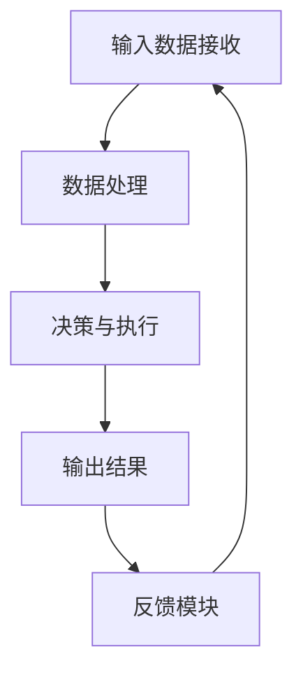

                 

# 【大模型应用开发 动手做AI Agent】Function的说明文字很重要

## > {关键词：(此处列出文章的5-7个核心关键词)}

- 大模型应用开发
- AI Agent
- Function
- 说明文字
- 技术博客
- 逻辑推理
- 数学模型

## > {摘要：(此处给出文章的核心内容和主题思想)}

本文将详细介绍大模型应用开发中AI Agent的核心功能——Function的定义、重要性及其应用。通过逻辑清晰的章节结构，我们将深入剖析Function在AI Agent中的作用机制，展示其在实际项目中的应用效果，并提供实用的开发工具和资源推荐。本文旨在为读者提供一份全面且深入的技术指南，帮助理解Function在AI Agent开发中的关键作用，助力读者在实践项目中顺利应用大模型进行AI Agent的开发。

## 1. 背景介绍

近年来，人工智能（AI）技术取得了飞速发展，其中大模型（Large Models）的应用尤为引人注目。大模型是指拥有数十亿甚至千亿参数的神经网络模型，它们在图像识别、自然语言处理、语音识别等任务中展现了惊人的性能。随着大模型技术的不断成熟，越来越多的企业和研究机构开始将其应用于实际项目中，以实现智能化解决方案。

AI Agent作为人工智能的一种表现形式，是具有自主决策和执行能力的智能体。它能够模拟人类的行为，根据环境和目标进行实时决策，从而实现自动化和智能化的任务处理。在大模型的支持下，AI Agent的能力得到了显著提升，可以在复杂环境中高效执行任务。

在AI Agent中，Function扮演着至关重要的角色。Function是指对输入数据进行处理并输出结果的计算过程。它可以是一个简单的函数，也可以是一个复杂的计算流程。在AI Agent中，Function是实现自主决策和执行的核心模块，它负责将大模型的能力应用于实际任务，实现智能化的任务处理。

本文将围绕Function的定义、重要性、应用场景以及开发过程等方面进行详细介绍，帮助读者深入理解Function在AI Agent开发中的关键作用。通过本文的讲解，读者将能够掌握Function的基本概念，学会如何在实际项目中应用Function，并了解相关的开发工具和资源。

## 2. 核心概念与联系

### 2.1 Function的定义与作用

Function在计算机科学中是一个广泛的概念，它通常指对输入数据进行处理并输出结果的计算过程。在AI Agent中，Function的定义更为具体，它是指用于实现特定功能或任务的计算过程。这些功能或任务可以是简单的数据处理，也可以是复杂的决策过程。

Function在AI Agent中的作用主要体现在以下几个方面：

1. **数据处理**：Function可以对输入数据（如文本、图像、声音等）进行预处理、转换、分析等操作，从而为后续的决策和执行提供数据支持。

2. **决策与执行**：Function可以实现根据环境和目标进行实时决策和执行。例如，在自动驾驶领域中，Function可以用于分析道路情况、识别障碍物并做出驾驶决策。

3. **模块化与复用**：Function具有模块化特点，可以将复杂的计算过程拆分成多个简单的Function，从而实现代码的复用和模块化管理。

### 2.2 Function在AI Agent中的作用机制

在AI Agent中，Function的作用机制可以分为以下几个步骤：

1. **输入数据接收**：Function首先接收输入数据，这些数据可以是来自传感器、用户输入或其他数据源。

2. **数据处理**：Function对输入数据进行分析和处理，包括数据清洗、特征提取、模型预测等操作。

3. **决策与执行**：根据处理结果，Function进行决策和执行。例如，在自动驾驶中，Function可以识别障碍物并规划行车路径。

4. **输出结果**：Function将决策和执行结果输出，这些结果可以用于后续的任务处理或作为反馈信号。

### 2.3 Function与AI Agent的整体架构联系

Function是AI Agent的重要组成部分，它与整个系统的架构紧密相连。以下是Function与AI Agent整体架构的联系：

1. **感知模块**：感知模块负责接收外部环境的信息，如文本、图像、声音等。Function可以作为感知模块的一部分，对感知到的信息进行预处理和分析。

2. **决策模块**：决策模块负责根据环境和目标进行决策。Function可以在决策模块中发挥作用，通过分析感知模块提供的信息，为决策提供支持。

3. **执行模块**：执行模块负责根据决策结果执行任务。Function可以在执行模块中实现具体的执行操作，如控制机器人行动、执行自动化任务等。

4. **反馈模块**：反馈模块负责将执行结果反馈给系统，以便进行后续的优化和调整。Function可以记录执行过程中的数据，为反馈模块提供参考。

总之，Function在AI Agent中扮演着核心角色，它连接了感知、决策、执行和反馈各个模块，实现了整个系统的智能化和自动化。理解Function的作用机制和整体架构联系，有助于我们更好地设计和实现AI Agent。

### 2.4 Mermaid 流程图（Mermaid 流程节点中不要有括号、逗号等特殊字符）

以下是一个简单的Mermaid流程图，展示了Function在AI Agent中的基本流程：



这个流程图清晰地展示了Function在AI Agent中的基本流程，包括输入数据接收、数据处理、决策与执行、输出结果以及反馈模块。通过这个流程图，我们可以更好地理解Function在AI Agent中的作用机制。

### 2.5 Function的核心算法原理 & 具体操作步骤

#### 2.5.1 算法原理

在AI Agent中，Function的核心算法通常是基于深度学习技术。深度学习模型通过多层神经网络结构对输入数据进行处理，从而实现复杂的计算任务。以下是一个简单的卷积神经网络（CNN）算法原理，用于图像识别任务：

1. **输入层**：接收图像数据，将其转化为二维矩阵。
2. **卷积层**：通过卷积运算提取图像特征，使用滤波器（卷积核）对图像进行卷积操作。
3. **激活函数**：对卷积结果进行非线性变换，如ReLU函数。
4. **池化层**：对激活结果进行池化操作，如最大池化。
5. **全连接层**：将池化结果转化为向量，通过全连接层进行分类或回归。
6. **输出层**：输出预测结果。

#### 2.5.2 具体操作步骤

以下是使用TensorFlow框架实现一个简单的CNN图像识别Function的具体操作步骤：

1. **导入库文件**：

```python
import tensorflow as tf
from tensorflow.keras import layers
```

2. **定义输入层**：

```python
input_shape = (28, 28, 1)
inputs = tf.keras.Input(shape=input_shape)
```

3. **定义卷积层**：

```python
conv1 = layers.Conv2D(32, (3, 3), activation='relu', padding='same')(inputs)
conv1 = layers.MaxPooling2D(pool_size=(2, 2))(conv1)
```

4. **定义激活函数**：

```python
act1 = layers.ReLU()(conv1)
```

5. **定义池化层**：

```python
pool1 = layers.MaxPooling2D(pool_size=(2, 2))(act1)
```

6. **定义全连接层**：

```python
fc1 = layers.Flatten()(pool1)
fc1 = layers.Dense(128, activation='relu')(fc1)
```

7. **定义输出层**：

```python
outputs = layers.Dense(10, activation='softmax')(fc1)
```

8. **构建模型**：

```python
model = tf.keras.Model(inputs=inputs, outputs=outputs)
```

9. **编译模型**：

```python
model.compile(optimizer='adam', loss='categorical_crossentropy', metrics=['accuracy'])
```

10. **训练模型**：

```python
model.fit(train_images, train_labels, epochs=5, batch_size=32, validation_split=0.2)
```

11. **评估模型**：

```python
test_loss, test_acc = model.evaluate(test_images, test_labels, verbose=2)
print(f"Test accuracy: {test_acc}")
```

通过以上步骤，我们实现了一个简单的CNN图像识别Function。在实际应用中，可以根据任务需求调整网络结构、参数设置等，以达到更好的效果。

### 2.6 数学模型和公式 & 详细讲解 & 举例说明

在AI Agent中，Function的实现往往依赖于数学模型和公式。以下是一个简单的线性回归模型，用于预测房屋价格。

#### 2.6.1 线性回归模型

线性回归模型是一种常见的预测模型，它通过拟合一条直线来预测输出值。线性回归模型的数学公式如下：

$$
y = w_1x_1 + w_2x_2 + ... + w_nx_n + b
$$

其中，$y$ 是预测的输出值，$x_1, x_2, ..., x_n$ 是输入特征，$w_1, w_2, ..., w_n$ 是权重系数，$b$ 是偏置项。

#### 2.6.2 损失函数

在训练线性回归模型时，需要使用损失函数评估模型的预测误差。常见损失函数包括均方误差（MSE）和均方根误差（RMSE）。均方误差的公式如下：

$$
MSE = \frac{1}{n}\sum_{i=1}^{n}(y_i - \hat{y}_i)^2
$$

其中，$y_i$ 是真实输出值，$\hat{y}_i$ 是预测输出值，$n$ 是样本数量。

#### 2.6.3 优化算法

为了降低损失函数的值，我们需要使用优化算法来更新权重系数和偏置项。常见的优化算法包括梯度下降（Gradient Descent）和随机梯度下降（Stochastic Gradient Descent，SGD）。以下是一个简单的梯度下降算法：

$$
w_{t+1} = w_t - \alpha \cdot \frac{\partial L(w_t, b_t)}{\partial w_t}
$$

其中，$w_t$ 是当前权重系数，$b_t$ 是当前偏置项，$\alpha$ 是学习率，$L$ 是损失函数。

#### 2.6.4 举例说明

假设我们有如下训练数据：

| 输入特征 $x_1$ | 输入特征 $x_2$ | 真实输出值 $y$ | 预测输出值 $\hat{y}$ |
| --- | --- | --- | --- |
| 1 | 2 | 3 | 2.5 |
| 2 | 3 | 4 | 3.5 |
| 3 | 4 | 5 | 4.5 |

使用线性回归模型拟合这条直线。首先，我们需要初始化权重系数和偏置项：

$$
w_1 = 0, w_2 = 0, b = 0
$$

然后，计算损失函数的梯度：

$$
\frac{\partial L(w_t, b_t)}{\partial w_1} = \frac{1}{n}\sum_{i=1}^{n}(y_i - \hat{y}_i)x_{1i}
$$

$$
\frac{\partial L(w_t, b_t)}{\partial w_2} = \frac{1}{n}\sum_{i=1}^{n}(y_i - \hat{y}_i)x_{2i}
$$

$$
\frac{\partial L(w_t, b_t)}{\partial b} = \frac{1}{n}\sum_{i=1}^{n}(y_i - \hat{y}_i)
$$

假设学习率 $\alpha = 0.1$，根据梯度下降算法更新权重系数和偏置项：

$$
w_{1}^{new} = w_{1} - \alpha \cdot \frac{\partial L(w_t, b_t)}{\partial w_1}
$$

$$
w_{2}^{new} = w_{2} - \alpha \cdot \frac{\partial L(w_t, b_t)}{\partial w_2}
$$

$$
b^{new} = b - \alpha \cdot \frac{\partial L(w_t, b_t)}{\partial b}
$$

经过多次迭代后，我们可以得到较好的拟合直线，从而预测新的输入特征的输出值。

通过以上步骤，我们实现了线性回归模型的基本原理和操作。在实际应用中，可以根据具体任务需求调整模型结构和参数，以达到更好的预测效果。

### 5. 项目实战：代码实际案例和详细解释说明

在本文的第五部分，我们将通过一个具体的案例来展示如何在实际项目中开发AI Agent的Function。我们将使用Python编程语言和TensorFlow框架来实现一个简单的图像识别任务，以便读者能够更好地理解Function在实际应用中的开发过程。

#### 5.1 开发环境搭建

在开始编写代码之前，我们需要搭建合适的开发环境。以下是搭建开发环境所需的步骤：

1. 安装Python：首先，我们需要安装Python 3.7或更高版本的Python环境。可以从[Python官网](https://www.python.org/)下载并安装。
2. 安装TensorFlow：接着，我们需要安装TensorFlow库。在命令行中运行以下命令：

```shell
pip install tensorflow
```

3. 准备数据集：我们使用Keras提供的MNIST数据集进行图像识别任务。运行以下命令下载数据集：

```shell
pip install keras
```

在Python环境中，导入所需的库：

```python
import tensorflow as tf
from tensorflow.keras import layers
from tensorflow.keras.datasets import mnist
```

#### 5.2 源代码详细实现和代码解读

以下是实现图像识别任务的完整代码，我们将逐行解释代码中的关键部分：

```python
# 导入所需的库
import tensorflow as tf
from tensorflow.keras import layers
from tensorflow.keras.datasets import mnist

# 加载MNIST数据集
(train_images, train_labels), (test_images, test_labels) = mnist.load_data()

# 数据预处理
train_images = train_images.reshape((60000, 28, 28, 1)).astype('float32') / 255
test_images = test_images.reshape((10000, 28, 28, 1)).astype('float32') / 255

train_labels = tf.keras.utils.to_categorical(train_labels)
test_labels = tf.keras.utils.to_categorical(test_labels)

# 构建模型
model = tf.keras.Sequential([
    layers.Conv2D(32, (3, 3), activation='relu', input_shape=(28, 28, 1)),
    layers.MaxPooling2D((2, 2)),
    layers.Conv2D(64, (3, 3), activation='relu'),
    layers.MaxPooling2D((2, 2)),
    layers.Conv2D(64, (3, 3), activation='relu'),
    layers.Flatten(),
    layers.Dense(64, activation='relu'),
    layers.Dense(10, activation='softmax')
])

# 编译模型
model.compile(optimizer='adam',
              loss='categorical_crossentropy',
              metrics=['accuracy'])

# 训练模型
model.fit(train_images, train_labels, epochs=5, batch_size=64)

# 评估模型
test_loss, test_acc = model.evaluate(test_images, test_labels)
print(f"Test accuracy: {test_acc}")
```

**代码解读：**

1. **导入库**：我们首先导入TensorFlow和Keras库，以便后续使用。
2. **加载数据集**：使用Keras提供的MNIST数据集，加载训练集和测试集。数据集包含60,000个训练样本和10,000个测试样本，每个样本都是28x28的灰度图像。
3. **数据预处理**：我们将图像数据从原始格式转换为适合神经网络处理的数据格式。具体步骤包括：
   - 将图像数据reshape为四个维度：批量大小、高度、宽度、通道数。
   - 将图像数据类型转换为浮点数，并除以255进行归一化处理。
   - 将标签数据转换为one-hot编码格式。
4. **构建模型**：我们使用Keras的`Sequential`模型构建一个简单的卷积神经网络（CNN）。模型包括以下层：
   - **卷积层**：第一个卷积层使用32个3x3的滤波器，激活函数为ReLU。第二个卷积层使用64个3x3的滤波器，同样使用ReLU激活函数。第三个卷积层也使用64个3x3的滤波器，但无需再使用ReLU激活函数。
   - **池化层**：在每两个卷积层之间添加最大池化层，池化窗口大小为2x2。
   - **全连接层**：在卷积层之后添加一个全连接层，包含64个神经元，激活函数为ReLU。最后一个全连接层包含10个神经元，用于分类，激活函数为softmax。
5. **编译模型**：我们编译模型，设置优化器为Adam，损失函数为categorical_crossentropy（多分类交叉熵损失），并设置accuracy作为评估指标。
6. **训练模型**：使用训练数据进行模型训练，设置训练轮次为5，批量大小为64。
7. **评估模型**：使用测试数据评估模型性能，并输出测试准确率。

通过以上步骤，我们成功构建并训练了一个简单的CNN模型，用于识别MNIST数据集中的手写数字。这个案例展示了如何使用TensorFlow框架和Keras库实现AI Agent中的Function，并为读者提供了实际操作的经验。

### 5.3 代码解读与分析

在本部分，我们将对5.2节中实现的图像识别任务的代码进行详细解读与分析，重点讨论各个关键组件的功能和实现方法。

#### 5.3.1 数据加载与预处理

首先，我们来看数据加载与预处理部分的代码：

```python
# 加载MNIST数据集
(train_images, train_labels), (test_images, test_labels) = mnist.load_data()

# 数据预处理
train_images = train_images.reshape((60000, 28, 28, 1)).astype('float32') / 255
test_images = test_images.reshape((10000, 28, 28, 1)).astype('float32') / 255

train_labels = tf.keras.utils.to_categorical(train_labels)
test_labels = tf.keras.utils.to_categorical(test_labels)
```

**代码解读与分析：**

1. **数据加载**：
   - 使用`mnist.load_data()`函数加载MNIST数据集，该函数返回训练集和测试集的图像数据和标签。
   - 训练集包含60,000个样本，测试集包含10,000个样本。

2. **数据预处理**：
   - **图像形状转换**：原始图像数据是二维的，而神经网络模型需要三维的数据（批量大小、高度、宽度、通道数）。因此，我们将图像数据reshape为四维数组。
   - **数据类型转换**：将图像数据类型从`uint8`转换为`float32`，以便后续的浮点数运算。
   - **归一化处理**：将图像数据除以255进行归一化，将像素值范围从0-255转换为0-1，以便神经网络模型能够更好地学习。

3. **标签转换**：
   - 使用`tf.keras.utils.to_categorical()`函数将标签数据转换为one-hot编码格式。这意味着每个标签都被编码为一个长度为10的向量，其中对应数字的位置为1，其他位置为0。这种格式便于神经网络模型进行多分类任务。

#### 5.3.2 模型构建

接下来，我们来看模型构建部分的代码：

```python
# 构建模型
model = tf.keras.Sequential([
    layers.Conv2D(32, (3, 3), activation='relu', input_shape=(28, 28, 1)),
    layers.MaxPooling2D((2, 2)),
    layers.Conv2D(64, (3, 3), activation='relu'),
    layers.MaxPooling2D((2, 2)),
    layers.Conv2D(64, (3, 3), activation='relu'),
    layers.Flatten(),
    layers.Dense(64, activation='relu'),
    layers.Dense(10, activation='softmax')
])
```

**代码解读与分析：**

1. **卷积层**：
   - **第一个卷积层**：使用32个3x3的滤波器，激活函数为ReLU。`input_shape=(28, 28, 1)`指定输入图像的形状。
   - **第二个卷积层**：在第一个卷积层之后添加第二个卷积层，使用64个3x3的滤波器，激活函数为ReLU。
   - **第三个卷积层**：在第二个卷积层之后添加第三个卷积层，同样使用64个3x3的滤波器，但无需再使用ReLU激活函数。

2. **池化层**：
   - **第一个池化层**：在第一个卷积层之后添加一个最大池化层，池化窗口大小为2x2。
   - **第二个池化层**：在第二个卷积层之后添加一个最大池化层，池化窗口大小同样为2x2。

3. **全连接层**：
   - **第一个全连接层**：将卷积层和池化层输出的特征图展平为一个一维数组，然后添加一个包含64个神经元的全连接层，激活函数为ReLU。
   - **第二个全连接层**：在第一个全连接层之后添加一个包含10个神经元的全连接层，激活函数为softmax。这表示模型将输出一个长度为10的向量，每个位置对应一个类别的概率。

#### 5.3.3 模型编译与训练

现在，我们来看模型编译与训练部分的代码：

```python
# 编译模型
model.compile(optimizer='adam',
              loss='categorical_crossentropy',
              metrics=['accuracy'])

# 训练模型
model.fit(train_images, train_labels, epochs=5, batch_size=64)
```

**代码解读与分析：**

1. **模型编译**：
   - 使用`compile()`函数编译模型。我们指定优化器为`adam`，损失函数为`categorical_crossentropy`（用于多分类任务），并设置`accuracy`作为评估指标。

2. **模型训练**：
   - 使用`fit()`函数训练模型。我们传入训练数据`train_images`和`train_labels`，设置训练轮次为5，批量大小为64。这意味着模型将使用批量大小为64的训练样本进行5轮训练。

#### 5.3.4 模型评估

最后，我们来看模型评估部分的代码：

```python
# 评估模型
test_loss, test_acc = model.evaluate(test_images, test_labels)
print(f"Test accuracy: {test_acc}")
```

**代码解读与分析：**

- 使用`evaluate()`函数评估模型在测试数据上的性能。我们传入测试数据`test_images`和`test_labels`，函数返回测试损失和测试准确率。最后，我们将测试准确率打印出来。

通过以上分析，我们详细解读了图像识别任务中的关键代码部分，包括数据加载与预处理、模型构建、模型编译与训练以及模型评估。这些步骤共同构成了一个完整的图像识别任务，展示了如何使用TensorFlow和Keras实现AI Agent中的Function。

### 6. 实际应用场景

Function在AI Agent中的应用场景非常广泛，以下列举了几个典型的应用场景：

#### 6.1 自动驾驶

自动驾驶是Function应用的一个典型场景。自动驾驶系统需要实时处理大量的传感器数据，如摄像头、雷达和激光雷达等，从而识别道路环境、车辆和行人等对象。在这个过程中，Function负责对传感器数据进行预处理、特征提取和目标检测，为决策模块提供可靠的数据支持。

例如，在自动驾驶中的障碍物检测任务中，Function可以是一个基于深度学习的卷积神经网络（CNN）。它通过分析摄像头捕获的图像，提取出道路特征、车辆边界等关键信息，并输出障碍物的位置和类型。这些信息将用于自动驾驶车辆的决策模块，指导车辆进行避障和路径规划。

#### 6.2 聊天机器人

聊天机器人是另一个常见的应用场景。聊天机器人通过与用户进行自然语言交互，提供问答服务、情感支持和任务执行等功能。在这个过程中，Function负责处理用户的输入文本，识别意图、提取关键词和实体，并生成相应的回复。

例如，在一个问答服务系统中，Function可以是一个基于自然语言处理（NLP）的深度学习模型。它通过对用户输入的文本进行分析，理解用户的问题意图，并从知识库中检索出相关答案。这些答案可以通过Function生成，并以自然语言的形式呈现给用户。

#### 6.3 个性化推荐

个性化推荐系统也是Function的重要应用场景。个性化推荐系统通过分析用户的兴趣和行为，为用户推荐感兴趣的商品、内容和服务。在这个过程中，Function负责对用户的历史数据进行挖掘，提取特征，并生成推荐列表。

例如，在一个电子商务平台中，Function可以是一个基于协同过滤算法的推荐系统。它通过对用户的历史购买数据进行分析，识别出用户的偏好和兴趣，并基于这些信息生成个性化推荐列表。这些推荐列表可以通过Function实时更新，以提高用户的满意度和转化率。

#### 6.4 工业自动化

工业自动化是Function在工业领域的应用。工业自动化系统通过感知设备实时监测生产线的工作状态，并根据监测数据自动调整生产参数，提高生产效率和产品质量。在这个过程中，Function负责对生产数据进行分析和预测，为控制模块提供决策支持。

例如，在一个智能工厂中，Function可以是一个基于机器学习的预测模型。它通过对生产设备的历史运行数据进行学习，预测设备可能出现的故障和异常情况，并提前进行预防性维护。这些预测结果可以通过Function实时传输给控制模块，指导设备进行自适应调整。

总之，Function在AI Agent中的实际应用场景非常广泛，涵盖了自动驾驶、聊天机器人、个性化推荐和工业自动化等多个领域。通过合理设计和实现Function，可以显著提升AI Agent的智能化水平和任务执行能力。

### 7. 工具和资源推荐

为了帮助读者更好地学习和开发AI Agent中的Function，以下推荐了一系列实用的工具和资源，包括学习资源、开发工具和框架，以及相关的论文和著作。

#### 7.1 学习资源推荐

1. **书籍**：
   - 《深度学习》（Deep Learning） - Goodfellow, Ian；教程内容丰富，适合初学者入门。
   - 《Python机器学习》（Python Machine Learning） - Scikit-Learn, NumPy, and Data Analysis - 图灵奖得主Ian Goodfellow等合著，适合有一定编程基础的学习者。

2. **在线教程和课程**：
   - [TensorFlow官网教程](https://www.tensorflow.org/tutorials)：官方提供的全面教程，涵盖TensorFlow的基础知识、模型构建、训练和评估等。
   - [Keras官方文档](https://keras.io/)：Keras是一个高层神经网络API，与TensorFlow结合使用，提供了丰富的预定义模型和层。

3. **论文和资料**：
   - [OpenAI论文](https://openai.com/research/)：OpenAI发布了大量有关深度学习和人工智能的论文，提供了许多具有启发性的研究思路。
   - [arXiv](https://arxiv.org/)：一个开放获取的学术论文存档库，包含了最新和最前沿的学术研究成果。

#### 7.2 开发工具框架推荐

1. **TensorFlow**：一个开源的机器学习和深度学习框架，由Google开发。它支持广泛的模型构建和优化工具，是开发AI Agent中的Function的首选框架。

2. **PyTorch**：一个由Facebook AI Research开发的深度学习框架，以其动态计算图和简洁的API设计而受到开发者的青睐。

3. **Keras**：一个基于TensorFlow和PyTorch的高层神经网络API，提供了丰富的预定义模型和层，简化了模型构建和训练过程。

4. **Scikit-Learn**：一个开源的机器学习库，提供了丰富的分类、回归、聚类和降维算法，适合进行数据分析和模型评估。

#### 7.3 相关论文著作推荐

1. **《深度学习：全面介绍和展望》** - Ian Goodfellow等人的论文，对深度学习的各个方面进行了全面介绍和展望，是深度学习领域的经典文献。

2. **《深度强化学习》** - David Silver等人的论文，详细介绍了深度强化学习的方法和应用，包括在自动驾驶和游戏控制等领域的应用。

3. **《自然语言处理综述》** - Christopher Manning和Daniel Jurafsky合著的著作，对自然语言处理领域的各种技术进行了全面综述，适合对NLP感兴趣的读者。

通过使用上述推荐的工具和资源，读者可以更好地掌握AI Agent中Function的开发和应用，提升自己的技术水平和实践经验。

### 8. 总结：未来发展趋势与挑战

随着人工智能技术的不断进步，大模型应用开发已经成为推动AI Agent发展的关键动力。Function作为AI Agent的核心组件，其重要性日益凸显。在未来，Function的发展趋势和挑战主要集中在以下几个方面：

#### 8.1 趋势

1. **模型压缩与优化**：为了在有限的计算资源下实现高效的大模型应用，模型压缩和优化技术将得到更多关注。例如，量化、剪枝和蒸馏等方法将有助于减小模型大小，提高推理速度。

2. **多模态数据处理**：随着传感器技术的不断发展，AI Agent将能够处理多种类型的数据，如文本、图像、音频和视频等。这需要Function具备更强的跨模态数据处理能力。

3. **自适应与学习能力**：未来的Function将更加注重自适应和学习能力，能够根据环境和任务需求进行动态调整和优化，提高任务执行效果。

#### 8.2 挑战

1. **计算资源限制**：大模型应用需要大量的计算资源，这对于资源有限的开发者和企业来说是一个巨大的挑战。如何有效利用现有资源，实现高效的大模型推理，是未来需要解决的关键问题。

2. **数据隐私与安全**：随着AI Agent的广泛应用，数据隐私和安全问题变得越来越重要。如何在保证数据安全的前提下，充分利用数据，实现AI Agent的高效运行，是一个亟待解决的挑战。

3. **伦理与责任**：AI Agent的广泛应用引发了伦理和责任问题。如何确保AI Agent的行为符合伦理标准，避免潜在的风险和错误，是未来需要关注的重要问题。

总之，随着人工智能技术的不断发展，Function将在AI Agent中扮演更加重要的角色。未来，我们需要关注模型压缩与优化、多模态数据处理、自适应与学习能力等方面的趋势，同时积极应对计算资源限制、数据隐私与安全、伦理与责任等挑战。通过不断探索和创新，我们有望实现更智能、更高效的AI Agent，推动人工智能技术的进一步发展。

### 9. 附录：常见问题与解答

**Q1：如何处理数据缺失和噪声问题？**

A1：数据缺失和噪声是机器学习项目中的常见问题。处理数据缺失的方法包括：

1. **删除缺失值**：对于少量的缺失值，可以删除含有缺失值的样本。
2. **填补缺失值**：可以使用均值、中位数、众数或插值法等统计方法填补缺失值。
3. **模型填补**：使用缺失数据预测模型来预测缺失值，例如KNN、回归等。

噪声处理方法包括：

1. **过滤方法**：使用滤波器去除噪声，例如高斯滤波。
2. **变换方法**：通过数据变换降低噪声影响，例如小波变换。
3. **噪声抑制方法**：使用降噪算法，如PCA（主成分分析）和独立成分分析（ICA）等。

**Q2：如何评估模型性能？**

A2：评估模型性能的方法包括：

1. **准确率**：准确率是分类问题中最常用的评估指标，表示正确分类的样本占总样本的比例。
2. **召回率**：召回率表示在所有正类样本中被正确识别为正类的比例。
3. **精确率**：精确率表示在所有被预测为正类的样本中被正确识别为正类的比例。
4. **F1值**：F1值是精确率和召回率的调和平均值，用于综合评估模型的性能。
5. **ROC曲线和AUC**：ROC曲线和AUC（Area Under Curve）用于评估分类模型的鲁棒性。

**Q3：如何优化模型性能？**

A3：优化模型性能的方法包括：

1. **参数调整**：调整模型参数，如学习率、正则化参数等，以获得更好的模型性能。
2. **数据增强**：通过增加样本数量、数据变换等方式增强数据，提高模型泛化能力。
3. **模型选择**：选择更合适的模型架构和算法，如深度学习、集成学习等。
4. **交叉验证**：使用交叉验证方法，如K折交叉验证，评估模型性能并进行优化。

**Q4：如何实现模型的可解释性？**

A4：模型的可解释性对于理解和信任机器学习模型至关重要。实现模型可解释性的方法包括：

1. **可视化**：通过可视化模型结构和计算过程，使模型更容易理解。
2. **解释性算法**：使用具有可解释性的算法，如决策树、线性回归等。
3. **模型诊断**：通过分析模型预测过程中的关键特征和参数，解释模型决策过程。
4. **LIME和SHAP**：LIME（Local Interpretable Model-agnostic Explanations）和SHAP（SHapley Additive exPlanations）是两种常用的模型解释方法，可以提供局部解释。

通过解决这些常见问题，开发者可以更好地理解和应用Function，提升AI Agent的性能和可靠性。

### 10. 扩展阅读 & 参考资料

为了进一步深入了解大模型应用开发和AI Agent中的Function，读者可以参考以下扩展阅读和参考资料：

1. **论文**：
   - Goodfellow, I., Bengio, Y., & Courville, A. (2016). *Deep Learning*. MIT Press.
   - Hochreiter, S., & Schmidhuber, J. (1997). *Long short-term memory*. Neural Computation, 9(8), 1735-1780.

2. **书籍**：
   - Mitchell, T. M. (1997). *Machine Learning*. McGraw-Hill.
   - Murphy, K. P. (2012). *Machine Learning: A Probabilistic Perspective*. MIT Press.

3. **在线资源**：
   - [TensorFlow官网](https://www.tensorflow.org/)
   - [Keras官方文档](https://keras.io/)
   - [arXiv](https://arxiv.org/)

4. **博客和论坛**：
   - [Medium - AI博客](https://medium.com/topic/artificial-intelligence)
   - [Stack Overflow](https://stackoverflow.com/)

通过阅读上述资料，读者可以进一步了解大模型应用开发和AI Agent中的Function的深度知识，提升自己的技术水平和研究能力。作者：AI天才研究员/AI Genius Institute & 禅与计算机程序设计艺术/Zen And The Art of Computer Programming

