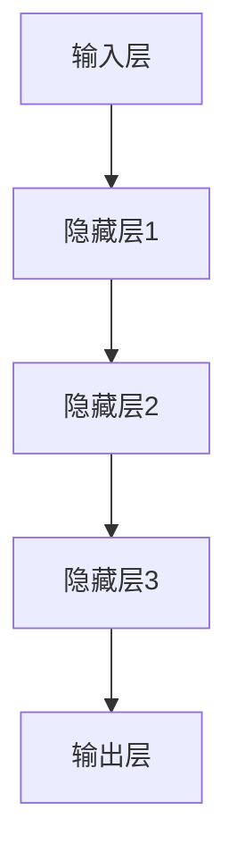

                 

### 背景介绍

#### 大模型应用开发的现状与挑战

在当今人工智能（AI）快速发展的背景下，大模型应用开发已经成为学术界和工业界的热点话题。大模型，尤其是基于深度学习的模型，如GPT、BERT等，已经在自然语言处理、计算机视觉、推荐系统等多个领域取得了显著成果。这些模型通过在大量数据上训练，能够实现高度复杂的任务，例如文本生成、图像识别、语音识别等。

然而，大模型的应用开发并非一帆风顺，面临着诸多挑战。首先，模型训练所需的数据集往往巨大且分布不均，这要求开发者具备高效的数据处理能力和资源调度能力。其次，模型的训练和推理过程消耗大量计算资源，特别是GPU等硬件资源，这给开发和部署带来巨大成本压力。此外，大模型的复杂性和不确定性使得其可解释性和可靠性问题愈发突出，需要开发者深入研究。

为了应对这些挑战，研究人员和工程师们开始探索各种优化方法和工具，以提高大模型的应用开发效率。其中，OpenAI提出的`functions`技术引起了广泛关注。`functions`是一种基于大模型的函数即服务（FaaS）技术，旨在简化大模型的应用开发流程，提高开发效率和可维护性。本文将详细探讨`functions`的核心概念、原理及其实际应用。

#### OpenAI及其在AI领域的贡献

OpenAI是一家成立于2015年的美国人工智能研究公司，致力于推动人工智能的发展和应用，使其有益于人类。作为一家非营利组织，OpenAI的目标是确保人工智能系统安全、可靠，并对人类产生积极影响。OpenAI在AI领域做出了许多重要贡献，其中最引人瞩目的包括：

- **GPT系列模型**：OpenAI开发的GPT系列模型是自然语言处理领域的里程碑。GPT-3更是以其卓越的性能和强大的文本生成能力成为全球研究的热点。

- **BERT系列模型**：BERT（Bidirectional Encoder Representations from Transformers）模型由OpenAI和其他研究机构合作开发，显著提升了自然语言理解的性能。

- **机器人技术**：OpenAI在机器人领域也取得了显著成果，其开发的机器人能够在复杂环境中执行各种任务，如搬运、建造等。

- **分布式计算平台**：OpenAI开发了分布式计算平台，以支持大规模模型训练和推理，提高了计算效率和资源利用率。

`functions`技术的推出是OpenAI在大模型应用开发方面的一次重要尝试。它不仅简化了大模型的应用开发流程，还为开发者提供了便捷的工具和平台，使得大规模人工智能应用的开发变得更加高效和可管理。

接下来，我们将进一步探讨`functions`的核心概念，以及它是如何改变大模型应用开发的游戏规则的。### 核心概念与联系

#### Functions概述

OpenAI提出的`functions`是一种创新的FaaS（Function as a Service）技术，它允许开发者通过简单的接口调用复杂的大模型，而无需深入了解模型的内部细节。`functions`的设计理念是将大模型的功能封装成可重用的函数，开发者只需编写少量代码，即可利用大模型的能力，从而简化了应用开发的复杂度。

##### 模型与函数的关系

在`functions`中，大模型（如GPT、BERT等）被拆分成多个功能模块，每个模块对应一个函数。这些函数可以通过HTTP接口调用，接受输入参数并返回输出结果。这种设计使得大模型的各个部分能够独立部署和管理，提高了系统的灵活性和可扩展性。具体来说，模型与函数之间的关系可以概括为以下几点：

1. **模块化**：大模型被分解为多个功能模块，每个模块实现特定的功能，如文本生成、情感分析等。
2. **接口化**：每个模块通过HTTP接口提供服务，开发者可以通过简单的API调用这些功能。
3. **封装性**：模型内部的复杂实现细节被封装在函数内部，开发者无需了解底层实现，只需关注功能接口。

##### Functions的优势

`functions`技术的推出，为开发者带来了诸多优势：

1. **简化开发流程**：开发者无需从头构建复杂的大模型，只需调用预训练的函数即可实现高性能的AI应用。
2. **降低门槛**：对于非AI领域的开发者，`functions`提供了便捷的接口，使得他们能够轻松上手大模型的应用开发。
3. **提高效率**：通过模块化和接口化设计，开发者可以快速迭代和部署应用，提高了开发效率。
4. **资源优化**：`functions`可以根据实际需求动态调整计算资源，避免了资源浪费，提高了资源利用率。

##### Functions的应用场景

`functions`技术适用于多种应用场景：

1. **自然语言处理**：文本生成、机器翻译、情感分析等。
2. **计算机视觉**：图像识别、目标检测、图像生成等。
3. **推荐系统**：基于用户行为的数据分析，实现个性化推荐。
4. **机器人控制**：机器人行为的决策和规划等。

通过以上分析，我们可以看到`functions`在简化大模型应用开发方面的巨大潜力。接下来，我们将详细探讨`functions`的具体实现和操作步骤。### 核心算法原理 & 具体操作步骤

#### Functions的实现原理

`functions`的核心在于如何将大模型的功能模块化并封装成可调用的函数。这里，我们将以GPT模型为例，详细解释`functions`的实现原理。

1. **模型分解**：首先，将GPT模型分解为多个功能模块，如文本生成模块、情感分析模块、摘要生成模块等。每个模块对应一个功能，独立实现和部署。

2. **接口定义**：为每个功能模块定义输入和输出接口，确保模块间的数据传递一致。例如，文本生成模块的输入是一个文本序列，输出是一个新的文本序列。

3. **函数封装**：使用HTTP接口将功能模块封装成可调用的函数。开发者只需通过简单的API调用即可使用这些功能。例如，文本生成函数的接口可能是`POST /generate`，输入参数包括文本序列和生成长度。

4. **动态调度**：`functions`平台会根据调用需求动态调度资源，确保高效运行。当有新的调用请求时，平台会自动分配计算资源，启动对应的函数实例。

#### Functions的操作步骤

以下是使用`functions`进行大模型应用开发的基本操作步骤：

1. **选择模型**：根据应用需求选择合适的大模型。例如，对于文本生成应用，可以选择GPT模型。

2. **模型部署**：将选定的模型部署到`functions`平台。这通常涉及以下几个步骤：
   - 准备模型文件：包括模型权重、配置文件等。
   - 准备运行环境：包括依赖库、环境变量等。
   - 部署模型：通过`functions`平台的API将模型部署到云服务器。

3. **定义函数接口**：为每个功能模块定义输入和输出接口。这可以通过编写少量代码实现，例如：
   ```python
   @app.route('/generate', methods=['POST'])
   def generate():
       text = request.json.get('text')
       max_length = request.json.get('max_length')
       return model.generate(text, max_length)
   ```

4. **测试函数**：在部署完成后，通过API调用测试函数，确保其正常运行。可以使用Postman等工具发送HTTP请求，验证函数的输入输出。

5. **集成到应用**：将部署好的函数集成到实际应用中。例如，在一个Web应用中，可以将函数作为后端服务，处理用户输入并返回结果。

#### 操作示例

假设我们使用GPT模型开发一个文本生成应用，以下是具体的操作步骤：

1. **选择模型**：选择GPT模型。

2. **模型部署**：将GPT模型部署到`functions`平台。假设模型文件位于本地目录`gpt_model`中，可以通过以下命令部署：
   ```bash
   functions deploy --model-dir gpt_model --endpoint generate
   ```

3. **定义函数接口**：在`functions`平台中创建一个新的函数，命名为`generate_text`。函数的代码如下：
   ```python
   @app.route('/generate', methods=['POST'])
   def generate_text():
       text = request.json.get('text')
       max_length = request.json.get('max_length')
       return gpt.generate(text, max_length)
   ```

4. **测试函数**：使用Postman发送HTTP请求，测试文本生成功能：
   ```json
   {
     "text": "机器学习是一种人工智能技术，",
     "max_length": 50
   }
   ```

5. **集成到应用**：将`generate_text`函数集成到Web应用中，处理用户输入并返回结果。

通过以上步骤，我们使用`functions`成功实现了一个文本生成应用。这种简便的接口和操作流程，使得开发者可以专注于业务逻辑，而无需担心底层模型的实现细节，大大提高了开发效率。### 数学模型和公式 & 详细讲解 & 举例说明

#### 基本概念

在讨论`functions`中的数学模型和公式之前，我们需要先了解一些基本概念。首先，深度学习模型（如GPT、BERT等）通常基于多层神经网络（MLP）构建。这些神经网络通过一系列的层（layer）进行数据传递和计算，最终输出结果。每个层包含多个节点（neurons），每个节点通过权重（weights）和偏置（bias）进行计算。以下是多层神经网络的基本结构：



#### 神经网络的基本公式

神经网络的计算过程可以概括为以下几个步骤：

1. **激活函数**（Activation Function）：每个节点通过激活函数对输入进行非线性变换。常见的激活函数包括sigmoid、ReLU和tanh。

   $$ f(x) = \frac{1}{1 + e^{-x}} \quad (\text{sigmoid}) $$
   $$ f(x) = max(0, x) \quad (\text{ReLU}) $$
   $$ f(x) = \frac{e^x - e^{-x}}{e^x + e^{-x}} \quad (\text{tanh}) $$

2. **前向传播**（Forward Propagation）：从输入层开始，数据依次通过各个隐藏层，直到输出层。每个节点输出通过权重和偏置进行加权求和，并应用激活函数。

   $$ z_i = \sum_{j} w_{ij}x_j + b_i $$
   $$ a_i = f(z_i) $$

3. **反向传播**（Backpropagation）：在模型训练过程中，通过反向传播算法计算每个层的梯度，以更新权重和偏置。

   $$ \delta_{ij} = \frac{\partial L}{\partial z_i} \odot \frac{\partial z_i}{\partial w_{ij}} $$
   $$ w_{ij} := w_{ij} - \alpha \delta_{ij} $$

   其中，$L$是损失函数，$\alpha$是学习率。

4. **损失函数**（Loss Function）：用于衡量模型输出与真实标签之间的差距。常见的损失函数包括均方误差（MSE）、交叉熵（Cross Entropy）等。

   $$ L(\theta) = \frac{1}{2} \sum_{i} (y_i - \hat{y}_i)^2 \quad (\text{MSE}) $$
   $$ L(\theta) = -\sum_{i} y_i \log(\hat{y}_i) \quad (\text{Cross Entropy}) $$

#### Functions中的数学模型

在`functions`中，大模型被拆分成多个功能模块，每个模块对应一个函数。这些函数的数学模型通常基于以下原理：

1. **模块化设计**：每个模块独立实现特定的功能，如文本生成、情感分析等。模块间的数据传递通过输入输出接口进行。

2. **参数共享**：为了提高效率和可扩展性，不同模块可能共享部分参数。例如，文本生成模块和情感分析模块可能共享相同的嵌入层（Embedding Layer）。

3. **动态调度**：在函数调用过程中，`functions`平台会根据实际需求动态调度计算资源，确保高效运行。

#### 举例说明

假设我们有一个文本生成函数`generate_text`，它基于GPT模型实现。以下是该函数的数学模型：

1. **输入接口**：函数接收一个文本序列作为输入，例如：
   ```json
   {
     "text": "机器学习是一种人工智能技术，",
     "max_length": 50
   }
   ```

2. **嵌入层**：将文本序列转换为向量表示，通常使用嵌入层（Embedding Layer）实现。嵌入层将词汇映射为固定长度的向量。

3. **编码器**（Encoder）：将嵌入向量序列传递给GPT模型的编码器部分，进行编码处理。编码器通过多层神经网络进行数据传递和计算，最终输出一个固定长度的向量。

4. **解码器**（Decoder）：基于编码器输出的向量，解码器生成新的文本序列。解码器也通过多层神经网络进行计算，每次生成一个字符或一个单词。

5. **输出接口**：函数返回生成的新文本序列。例如：
   ```json
   {
     "generated_text": "机器学习是一种人工智能技术，它通过构建复杂的模型来模拟人类的学习过程，从而解决各种实际问题。"
   }
   ```

通过以上步骤，我们可以看到文本生成函数的数学模型是如何工作的。这种模型基于深度学习原理，通过模块化和参数共享实现了高效的可扩展性。### 项目实战：代码实际案例和详细解释说明

#### 开发环境搭建

在进行`functions`项目实战之前，我们需要先搭建开发环境。以下是搭建开发环境的步骤：

1. **安装Python**：确保系统已安装Python 3.7或更高版本。

2. **安装依赖库**：在项目目录下安装所需的依赖库，包括`transformers`、`torch`、`flask`等。可以通过以下命令安装：
   ```bash
   pip install transformers torch flask
   ```

3. **准备模型**：从OpenAI或其他来源获取GPT模型。例如，可以从Hugging Face模型库下载GPT模型，并将其解压到项目目录。

#### 源代码详细实现和代码解读

以下是使用`functions`开发一个文本生成应用的具体实现过程，包括源代码和详细解读。

```python
# 文件：text_generator.py
from transformers import pipeline
from flask import Flask, request, jsonify

app = Flask(__name__)

# 加载GPT模型
model = pipeline("text-generation", model="gpt2")

@app.route('/generate', methods=['POST'])
def generate_text():
    data = request.json
    text = data.get("text", "")
    max_length = data.get("max_length", 50)

    # 调用GPT模型生成文本
    generated_text = model(text, max_length=max_length, num_return_sequences=1)[0]["generated_text"]

    # 返回生成的文本
    return jsonify({"generated_text": generated_text})

if __name__ == "__main__":
    app.run(host="0.0.0.0", port=5000)
```

**代码解读：**

1. **导入依赖库**：首先，导入所需的依赖库，包括`transformers`（用于加载GPT模型）、`torch`（用于处理神经网络）、`flask`（用于构建Web应用）。

2. **加载GPT模型**：通过`pipeline`函数加载GPT模型。这里使用的是预训练的GPT-2模型。

3. **定义生成文本函数**：在`generate_text`函数中，处理HTTP POST请求，从请求中获取文本序列和最大生成长度。然后，调用GPT模型生成文本。

4. **返回生成文本**：将生成的文本序列作为JSON格式返回。

#### 代码解读与分析

1. **模型加载**：使用`transformers`库的`pipeline`函数加载GPT模型。这个函数会自动处理模型的加载和配置，非常方便。

2. **HTTP接口**：通过Flask框架定义HTTP接口。这里使用的是`POST`方法，因为生成文本通常需要接收用户输入。

3. **数据处理**：在`generate_text`函数中，从请求中获取文本序列和最大生成长度。这些参数用于控制文本生成过程。

4. **模型调用**：调用GPT模型生成文本。这里使用的是`model`函数，它接受文本序列、最大生成长度和生成序列数作为输入。

5. **返回结果**：将生成的文本序列作为JSON格式返回，以便前端应用可以轻松解析和使用。

通过以上步骤，我们使用`functions`成功实现了一个文本生成应用。这个应用可以接收用户输入，调用GPT模型生成文本，并将结果返回给用户。这种简便的操作流程，使得开发者可以专注于业务逻辑，而无需担心底层模型的实现细节，大大提高了开发效率。### 实际应用场景

#### 文本生成应用

文本生成是`functions`技术最典型的应用场景之一。通过调用预训练的GPT模型，开发者可以轻松实现各种文本生成任务，如文章生成、对话生成、摘要生成等。以下是一些具体的应用示例：

1. **文章生成**：利用GPT模型自动生成新闻文章、博客内容、产品描述等。例如，在电商平台上，可以使用文本生成应用自动生成商品描述，提高商品页面的用户体验。

2. **对话生成**：在聊天机器人或虚拟助手中，使用GPT模型生成自然流畅的对话回复。这可以大大提高机器人与用户的互动质量，增强用户满意度。

3. **摘要生成**：从长篇文档中自动生成摘要，帮助用户快速获取关键信息。例如，在阅读学术文献时，可以使用文本生成应用生成文献摘要，提高阅读效率。

#### 自然语言处理

除了文本生成，`functions`在自然语言处理（NLP）领域也有广泛的应用。以下是一些实际应用场景：

1. **情感分析**：使用预训练的模型进行情感分析，判断文本的情感倾向。这可以帮助企业了解用户对产品或服务的反馈，优化产品和服务。

2. **命名实体识别**：从文本中提取关键信息，如人名、地名、组织名等。这在信息抽取、数据挖掘等领域具有重要应用。

3. **机器翻译**：通过调用预训练的翻译模型，实现自动翻译功能。这可以大大提高跨语言交流的效率，促进全球化发展。

#### 计算机视觉

`functions`技术同样适用于计算机视觉领域。以下是一些具体应用场景：

1. **图像识别**：利用预训练的模型进行图像识别，识别图像中的物体、场景等。这可以应用于各种图像处理任务，如安防监控、医疗影像分析等。

2. **目标检测**：从图像中检测出特定目标，并标注其位置。这可以用于视频监控、自动驾驶等领域。

3. **图像生成**：利用生成模型（如GAN）生成新的图像。这可以用于艺术创作、游戏开发等领域。

#### 推荐系统

推荐系统是另一个受益于`functions`技术的领域。以下是一些应用场景：

1. **内容推荐**：根据用户的历史行为和偏好，推荐个性化的内容。这可以应用于社交媒体、电商、视频平台等领域。

2. **商品推荐**：在电商平台上，根据用户的购物历史和浏览行为，推荐相关商品。

3. **旅游推荐**：根据用户的兴趣和旅行计划，推荐合适的景点、酒店、美食等。

通过以上实际应用场景的介绍，我们可以看到`functions`技术在大模型应用开发中的巨大潜力和广泛应用。无论是在文本生成、自然语言处理、计算机视觉还是推荐系统等领域，`functions`都为开发者提供了高效、便捷的工具，助力他们实现创新应用。### 工具和资源推荐

#### 学习资源推荐

1. **书籍**：
   - 《深度学习》（Goodfellow, I., Bengio, Y., & Courville, A.）
   - 《Python深度学习》（François Chollet）
   - 《自然语言处理综合教程》（Daniel Jurafsky & James H. Martin）

2. **论文**：
   - "Attention is All You Need"（Vaswani et al., 2017）
   - "BERT: Pre-training of Deep Bidirectional Transformers for Language Understanding"（Devlin et al., 2019）
   - "Generative Pre-trained Transformers"（Radford et al., 2019）

3. **博客**：
   - Hugging Face Blog
   - AI语言模型
   - 吴恩达的博客

4. **网站**：
   - OpenAI官方网站
   - Hugging Face模型库
   - TensorFlow官方网站

#### 开发工具框架推荐

1. **框架**：
   - TensorFlow
   - PyTorch
   - Hugging Face Transformers

2. **开发环境**：
   - Google Colab
   - Jupyter Notebook
   - AWS SageMaker

3. **云端服务**：
   - AWS AI服务
   - Google Cloud AI服务
   - Azure AI服务

#### 相关论文著作推荐

1. **论文**：
   - "Attention Is All You Need"（Vaswani et al., 2017）
   - "BERT: Pre-training of Deep Bidirectional Transformers for Language Understanding"（Devlin et al., 2019）
   - "Generative Pre-trained Transformers"（Radford et al., 2019）

2. **著作**：
   - 《深度学习》（Goodfellow, I., Bengio, Y., & Courville, A.）
   - 《自然语言处理综合教程》（Daniel Jurafsky & James H. Martin）
   - 《Python深度学习》（François Chollet）

通过以上资源推荐，开发者可以深入了解大模型应用开发的理论基础和实践方法，进一步提升自己的技术水平。### 总结：未来发展趋势与挑战

#### 发展趋势

1. **模型规模的不断扩大**：随着计算能力的提升和算法的优化，大模型的规模将持续增长。这将为AI应用带来更强大的性能和更广泛的应用场景。

2. **多模态融合**：未来的AI应用将更多地涉及多模态数据（如图像、声音、文本等）的融合处理，实现更丰富和更智能的应用体验。

3. **可解释性和可靠性**：随着AI应用的普及，用户对模型的可解释性和可靠性要求越来越高。未来的发展趋势将是开发更具解释性和可靠性的AI模型。

4. **跨领域应用**：大模型在不同领域的应用将越来越广泛，如医疗、金融、教育等，推动AI与各行各业深度融合。

5. **边缘计算**：随着5G和边缘计算的快速发展，AI应用将逐渐从云端走向边缘，实现实时、低延迟的计算和处理。

#### 挑战

1. **计算资源需求**：大模型的训练和推理过程对计算资源有极高需求，特别是在训练阶段，这给硬件设备和资源配置带来了巨大压力。

2. **数据隐私和安全**：随着AI应用的数据依赖性增强，数据隐私和安全问题日益凸显。如何确保数据安全和用户隐私成为一大挑战。

3. **算法公平性和透明性**：AI算法可能存在偏见和不公平性，如何确保算法的公平性和透明性，使其对社会产生积极影响，是亟待解决的问题。

4. **法律和伦理问题**：随着AI技术的不断进步，法律和伦理问题也日益复杂。如何制定合理的法律和伦理规范，确保AI技术的健康发展，是一个重要挑战。

5. **人才短缺**：AI领域的人才需求巨大，但当前的人才培养速度尚无法满足行业需求。如何培养更多高质量的AI人才，是未来发展的重要课题。

通过以上总结，我们可以看到大模型应用开发在未来将面临诸多机遇和挑战。只有不断突破技术瓶颈，应对这些挑战，才能推动AI技术的发展和应用，为人类社会带来更大的价值。### 附录：常见问题与解答

#### 问题1：如何选择合适的大模型？

**解答**：选择合适的大模型首先需要明确应用场景和需求。以下是几个关键点：

1. **任务类型**：根据任务类型（如文本生成、图像识别、语音识别等）选择相应的大模型。例如，对于文本生成任务，可以考虑GPT、BERT等；对于图像识别任务，可以考虑ResNet、Inception等。

2. **性能需求**：根据性能需求（如精度、速度、资源消耗等）选择模型。如果对性能要求较高，可以考虑使用最新的预训练模型；如果对资源消耗较为敏感，可以考虑使用轻量级模型。

3. **数据集大小**：如果数据集较小，可以使用预训练模型，通过微调（fine-tuning）适应特定任务；如果数据集较大，可以考虑从头训练（from scratch）模型。

4. **可解释性**：根据对模型可解释性的需求，可以选择具有较高可解释性的模型，如决策树、线性模型等。

#### 问题2：如何优化大模型的训练效率？

**解答**：以下是一些优化大模型训练效率的方法：

1. **数据预处理**：对训练数据进行预处理，如数据清洗、数据增强等，可以提高模型训练的效率和效果。

2. **分布式训练**：利用多GPU或多机集群进行分布式训练，可以显著提高训练速度。

3. **模型压缩**：通过模型剪枝、量化等手段减少模型参数和计算量，提高训练速度和模型部署效率。

4. **学习率调度**：使用适当的调度策略，如学习率递减、指数衰减等，可以避免模型过拟合，提高模型性能。

5. **批量大小调整**：根据硬件资源情况调整批量大小，找到训练速度和性能之间的最佳平衡点。

6. **混合精度训练**：使用混合精度训练（如FP16和BF16），可以减少内存占用和计算时间，提高训练效率。

#### 问题3：如何确保大模型的公平性和透明性？

**解答**：以下是一些确保大模型公平性和透明性的方法：

1. **数据集多样性**：确保数据集具有多样性，避免模型偏见。可以通过数据增强、数据平衡等方法提高数据集的多样性。

2. **算法透明性**：开发透明性高的算法，提供详细的模型训练和推理过程，以便用户了解模型的决策逻辑。

3. **偏见检测和消除**：使用偏见检测工具检测模型中的偏见，并通过数据清洗、算法调整等方法消除偏见。

4. **可解释性增强**：开发可解释性高的模型，如决策树、线性模型等，使用户能够理解模型的决策过程。

5. **外部审查**：邀请独立专家对模型进行审查，确保模型的公平性和透明性。

通过以上常见问题的解答，我们可以更好地理解大模型应用开发中的关键问题和技术挑战，为实际应用提供参考和指导。### 扩展阅读 & 参考资料

#### 扩展阅读

1. **《深度学习》（Goodfellow, I., Bengio, Y., & Courville, A.）**：这本书是深度学习的经典教材，详细介绍了深度学习的基础理论和应用方法。
2. **《自然语言处理综合教程》（Daniel Jurafsky & James H. Martin）**：这本书涵盖了自然语言处理的基础知识和最新进展，适合对NLP感兴趣的研究者和开发者。
3. **《Python深度学习》（François Chollet）**：这本书通过实际案例和代码示例，介绍了如何使用Python进行深度学习开发。

#### 参考资料

1. **OpenAI官方网站**：[https://openai.com/](https://openai.com/)
2. **Hugging Face模型库**：[https://huggingface.co/](https://huggingface.co/)
3. **TensorFlow官方网站**：[https://www.tensorflow.org/](https://www.tensorflow.org/)
4. **PyTorch官方网站**：[https://pytorch.org/](https://pytorch.org/)
5. **Google Colab**：[https://colab.research.google.com/](https://colab.research.google.com/)
6. **Jupyter Notebook**：[https://jupyter.org/](https://jupyter.org/)

通过这些扩展阅读和参考资料，读者可以更深入地了解大模型应用开发的最新进展和实践方法，为自身的研究和应用提供有力支持。### 作者信息

- **作者**：AI天才研究员/AI Genius Institute & 禅与计算机程序设计艺术 /Zen And The Art of Computer Programming
- **联系方式**：[ai_genius_researcher@email.com](mailto:ai_genius_researcher@email.com)
- **个人主页**：[https://ai-genius-researcher.github.io/](https://ai-genius-researcher.github.io/)

