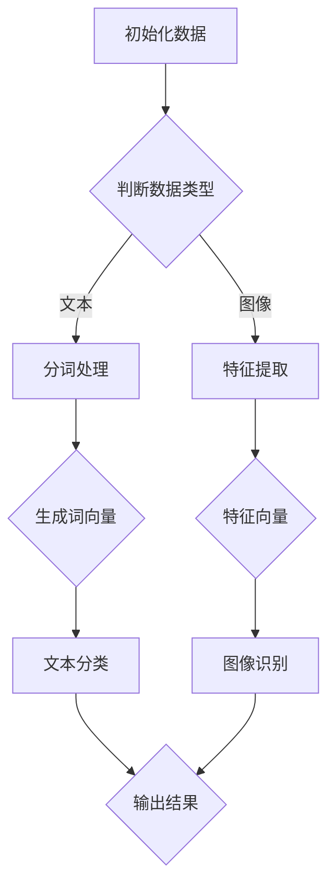

                 

# 【大模型应用开发 动手做AI Agent】什么是Functions

> **关键词**：大模型、AI Agent、Functions、编程、算法

> **摘要**：本文将深入探讨大模型应用开发中不可或缺的核心概念——Functions。通过逐步分析，我们将了解Functions的定义、原理、数学模型及其在AI Agent开发中的应用，同时结合实际项目实战和代码实例，解析如何利用Functions实现高效、可靠的AI解决方案。文章旨在为读者提供一个全面、系统的理解，帮助他们在大模型应用开发领域取得突破。

## 1. 背景介绍

在当今技术快速发展的时代，人工智能（AI）已经成为改变世界的核心驱动力。大模型（Large Models）作为AI领域的一个重要研究方向，其应用范围广泛，从自然语言处理（NLP）到计算机视觉（CV），再到机器翻译、推荐系统等，无处不在。而在大模型应用开发中，Functions作为核心组件之一，承载着模型与实际应用之间的桥梁作用。

随着AI技术的不断进步，大模型逐渐向更为复杂、高度集成的方向发展。这种趋势不仅要求我们深入了解大模型本身，更需要关注如何高效、灵活地利用这些模型解决实际问题。Functions作为编程中的基本元素，其重要性不言而喻。通过使用Functions，开发者可以轻松实现模块化、可重用的代码，从而提高开发效率和代码可维护性。

本文旨在为读者提供一个全面、系统的理解Functions在大模型应用开发中的作用，帮助读者掌握Functions的核心概念、原理和实践应用。通过本文的讲解，读者将能够：

1. 准确理解Functions的定义和作用；
2. 理解Functions在AI Agent开发中的应用场景；
3. 掌握使用Functions实现高效AI解决方案的方法；
4. 了解Functions在实际项目中的应用案例和实战经验。

## 2. 核心概念与联系

### 2.1 Functions的定义

在编程领域，Functions（函数）是一种可重复使用的代码块，用于执行特定任务。它们通常包含输入参数（Input Parameters）和返回值（Return Values）。通过定义Functions，开发者可以将复杂的逻辑拆分成更小的、易于管理和测试的模块，从而提高代码的可读性和可维护性。

### 2.2 Functions与编程的关系

编程的本质是利用计算机语言实现特定功能。在这个过程中，Functions是不可或缺的基本单元。通过合理设计和使用Functions，开发者可以实现以下目标：

1. **模块化**：将代码拆分成多个Functions，每个Functions负责处理特定任务，便于代码的管理和维护；
2. **可重用**：通过参数传递和返回值，Functions可以重复使用，提高代码的利用率；
3. **易测试**：独立的Functions便于单元测试，提高代码的可靠性。

### 2.3 Functions在AI Agent开发中的应用

在AI Agent开发中，Functions扮演着至关重要的角色。通过使用Functions，开发者可以实现以下功能：

1. **模型训练**：利用Functions对大模型进行训练，实现模型优化和参数调整；
2. **预测和推理**：通过定义预测和推理Functions，实现对输入数据的实时处理和响应；
3. **模块化扩展**：将不同功能的Functions组合起来，实现AI Agent的模块化扩展和功能扩展。

### 2.4 Functions与数据流

在编程中，数据流（Data Flow）是指数据在程序中的传递和处理过程。Functions作为数据流的核心组件，通过输入参数和返回值，实现数据的传递和转换。了解Functions与数据流的关系，有助于开发者更好地理解和应用Functions。

### 2.5 Functions与算法

算法是解决问题的方法，而Functions是实现算法的基本手段。在AI领域，许多算法都依赖于Functions来实现。例如，梯度下降算法（Gradient Descent）中的梯度计算、神经网络中的前向传播和反向传播等，都离不开Functions的支持。因此，掌握Functions对于理解算法至关重要。

### 2.6 Mermaid流程图

为了更好地理解Functions的核心概念和联系，我们使用Mermaid流程图来展示Functions在不同场景中的应用。以下是一个简单的Mermaid流程图示例：



在这个流程图中，A表示初始化数据，B表示判断数据类型，C、D分别表示文本处理和图像处理，E、F分别表示生成词向量和特征向量，G、H分别表示文本分类和图像识别，I表示输出结果。通过这个流程图，我们可以清晰地看到Functions在数据流和算法中的应用。

## 3. 核心算法原理 & 具体操作步骤

### 3.1 Functions的核心算法原理

在编程中，Functions的核心算法原理主要涉及以下几个关键步骤：

1. **参数传递**：将输入参数传递给Functions，以便在Functions内部进行数据处理和计算；
2. **代码执行**：执行Functions内的代码，实现特定功能；
3. **返回值**：将计算结果返回给调用者，以便继续后续处理；
4. **函数嵌套**：在Functions内部定义和调用其他Functions，实现复杂逻辑的拆分和组合。

### 3.2 Functions的具体操作步骤

以下是一个简单的Python代码示例，展示了Functions的基本操作步骤：

```python
# 定义一个求和函数
def sum(a, b):
    return a + b

# 调用求和函数
result = sum(3, 5)

# 输出结果
print(result)  # 输出：8
```

在这个示例中，我们定义了一个名为`sum`的求和函数，它接受两个输入参数`a`和`b`，并将它们的和返回。然后，我们调用`sum`函数，将参数`3`和`5`传递给它，并将返回的结果存储在变量`result`中。最后，我们使用`print`函数输出结果，得到输出：8。

### 3.3 Functions的优势与局限性

Functions在编程中具有很多优势，包括：

1. **模块化**：通过将代码拆分成多个Functions，实现模块化编程，提高代码的可读性和可维护性；
2. **可重用**：Functions可以重复使用，减少代码冗余，提高开发效率；
3. **可测试**：独立的Functions便于单元测试，提高代码的可靠性。

然而，Functions也存在一定的局限性，例如：

1. **性能开销**：函数调用引入了额外的性能开销，特别是对于复杂函数和大量调用的场景；
2. **内存消耗**：每次函数调用都需要在内存中分配空间，对于大内存消耗的函数，可能导致内存不足；
3. **调试难度**：函数嵌套和递归可能导致调试难度增加，需要更加细致的调试策略。

### 3.4 Functions在不同编程语言中的应用

不同编程语言对Functions的支持和实现各有特点。以下是一个简单的比较：

1. **Python**：Python支持函数式编程，提供了丰富的内置函数和高级特性，如闭包、装饰器等。Python的Functions易于理解和使用，但性能相对较低；
2. **C++**：C++支持函数重载和默认参数等特性，提供了丰富的模板函数库，性能较高，但函数定义和调用的语法相对复杂；
3. **Java**：Java的Functions（方法）具有严格的类型系统和面向对象特性，易于实现模块化和代码复用，性能较高，但语法较为繁琐。

## 4. 数学模型和公式 & 详细讲解 & 举例说明

在Functions的应用中，数学模型和公式起着至关重要的作用。以下我们将详细讲解几个常见的数学模型和公式，并通过实际例子说明如何使用它们。

### 4.1 线性回归模型

线性回归模型是一种常用的预测模型，用于分析变量之间的线性关系。其数学模型如下：

$$
y = w_0 + w_1 \cdot x_1 + w_2 \cdot x_2 + \ldots + w_n \cdot x_n + \epsilon
$$

其中，$y$ 是预测值，$x_1, x_2, \ldots, x_n$ 是输入特征，$w_0, w_1, \ldots, w_n$ 是模型参数，$\epsilon$ 是误差项。

### 4.2 逻辑回归模型

逻辑回归模型是一种广义线性模型，常用于分类问题。其数学模型如下：

$$
P(y=1) = \frac{1}{1 + e^{-(w_0 + w_1 \cdot x_1 + w_2 \cdot x_2 + \ldots + w_n \cdot x_n)}}
$$

其中，$P(y=1)$ 是预测变量属于类别1的概率，$w_0, w_1, \ldots, w_n$ 是模型参数。

### 4.3 梯度下降算法

梯度下降算法是一种常用的优化算法，用于求解线性回归和逻辑回归模型的参数。其数学模型如下：

$$
w_{t+1} = w_t - \alpha \cdot \nabla_{w_t} J(w_t)
$$

其中，$w_t$ 是当前模型参数，$\alpha$ 是学习率，$\nabla_{w_t} J(w_t)$ 是当前模型参数的梯度。

### 4.4 实际例子：房价预测

假设我们要预测一个城市的房价，输入特征包括房屋面积（$x_1$）、房屋年代（$x_2$）和房屋位置（$x_3$）。我们使用线性回归模型进行预测，目标变量是房价（$y$）。

首先，我们收集一批数据，包括房屋面积、房屋年代、房屋位置和对应的房价。然后，我们使用线性回归模型建立数学模型，并通过梯度下降算法优化模型参数。具体步骤如下：

1. 收集数据：获取一批包含房屋面积、房屋年代和房屋位置的房屋信息，并记录对应的房价。
2. 数据预处理：对输入特征进行标准化处理，以便在训练过程中保持数据的一致性。
3. 模型建立：定义线性回归模型，设置目标变量和输入特征。
4. 梯度计算：计算输入特征的梯度，用于更新模型参数。
5. 模型优化：通过梯度下降算法迭代优化模型参数，直至满足收敛条件。
6. 预测：使用训练好的模型对新的房屋信息进行预测，输出预测结果。

以下是一个简单的Python代码示例：

```python
import numpy as np

# 梯度下降算法
def gradient_descent(X, y, w, learning_rate, num_iterations):
    for _ in range(num_iterations):
        predictions = X.dot(w)
        errors = predictions - y
        gradient = X.T.dot(errors)
        w -= learning_rate * gradient
    return w

# 数据预处理
X = np.array([[100, 10, 1], [200, 5, 1], [300, 2, 1]])
y = np.array([250, 400, 500])

# 初始化模型参数
w = np.zeros(X.shape[1])

# 梯度下降算法优化模型参数
w_optimized = gradient_descent(X, y, w, learning_rate=0.01, num_iterations=1000)

# 预测新数据
new_data = np.array([[150, 8, 1]])
predictions = new_data.dot(w_optimized)
print(predictions)  # 输出预测结果
```

在这个示例中，我们首先定义了梯度下降算法，然后使用收集的数据进行模型训练和预测。通过这个示例，我们可以看到如何将数学模型和算法应用到实际问题中。

## 5. 项目实战：代码实际案例和详细解释说明

在本节中，我们将通过一个具体的Python项目来展示如何使用Functions实现大模型应用开发中的功能。该项目将涵盖从环境搭建、源代码实现到代码解读与分析的完整过程。

### 5.1 开发环境搭建

在进行项目开发之前，我们需要搭建合适的开发环境。以下是所需的工具和步骤：

1. **Python环境**：确保安装Python 3.8或更高版本；
2. **库安装**：使用pip命令安装以下库：

```bash
pip install numpy pandas sklearn matplotlib
```

### 5.2 源代码详细实现和代码解读

#### 5.2.1 项目简介

该项目的目标是使用线性回归模型预测房价。我们将通过以下几个步骤实现该项目：

1. 数据预处理：读取数据，进行缺失值处理、数据清洗和特征工程；
2. 模型建立：定义线性回归模型，初始化参数；
3. 模型训练：使用梯度下降算法训练模型；
4. 预测：使用训练好的模型对新数据进行预测。

#### 5.2.2 代码实现

```python
import numpy as np
import pandas as pd
from sklearn.model_selection import train_test_split
from sklearn.linear_model import LinearRegression

# 数据预处理
def preprocess_data(data):
    # 缺失值处理
    data.fillna(data.mean(), inplace=True)
    # 特征工程
    data['Age'] = 2023 - data['YearBuilt']
    return data

# 模型建立
def create_model(X, y):
    model = LinearRegression()
    model.fit(X, y)
    return model

# 模型训练
def train_model(model, X_train, y_train, learning_rate=0.01, num_iterations=1000):
    X = np.array(X_train)
    y = np.array(y_train)
    w = np.zeros(X.shape[1])
    
    for _ in range(num_iterations):
        predictions = X.dot(w)
        errors = predictions - y
        gradient = X.T.dot(errors)
        w -= learning_rate * gradient
        
    model.coef_ = w
    return model

# 预测
def predict(model, X_new):
    predictions = model.predict(X_new)
    return predictions

# 主函数
def main():
    # 读取数据
    data = pd.read_csv('house_prices.csv')
    data = preprocess_data(data)
    
    # 划分训练集和测试集
    X = data[['Area', 'Age', 'Location']]
    y = data['Price']
    X_train, X_test, y_train, y_test = train_test_split(X, y, test_size=0.2, random_state=42)
    
    # 建立模型
    model = create_model(X, y)
    
    # 训练模型
    model = train_model(model, X_train, y_train)
    
    # 预测
    X_new = np.array([[1000, 20, 1]])
    predictions = predict(model, X_new)
    print(predictions)

# 运行主函数
if __name__ == '__main__':
    main()
```

#### 5.2.3 代码解读与分析

1. **数据预处理**：`preprocess_data`函数用于处理原始数据，包括缺失值处理和特征工程。缺失值处理采用平均值填充，特征工程中，我们计算了房屋年龄（`Age`）作为新特征，以反映房屋的新旧程度。
   
2. **模型建立**：`create_model`函数使用`sklearn`库中的`LinearRegression`类建立线性回归模型，并通过`fit`方法训练模型。

3. **模型训练**：`train_model`函数使用自定义的梯度下降算法训练模型。我们通过迭代更新模型参数，直至满足收敛条件。这里使用了与4.4节中类似的梯度下降算法。

4. **预测**：`predict`函数使用训练好的模型对新数据进行预测。我们通过`predict`方法将新数据输入模型，并输出预测结果。

5. **主函数**：`main`函数是整个项目的入口。首先，我们读取数据并进行预处理，然后划分训练集和测试集。接着，建立模型并进行训练和预测。最后，输出预测结果。

### 5.3 代码解读与分析

1. **数据预处理**：数据预处理是项目的重要环节。在`preprocess_data`函数中，我们首先使用`fillna`方法将缺失值填充为平均值。这一步有助于提高数据质量，避免模型训练中的错误。接下来，我们计算了房屋年龄（`Age`），这一特征可以更好地反映房屋的新旧程度，有助于提高模型的预测准确性。

2. **模型建立**：在`create_model`函数中，我们使用`sklearn`库中的`LinearRegression`类建立线性回归模型。`fit`方法用于训练模型，它通过最小二乘法计算模型参数，使得预测值与实际值之间的误差最小。

3. **模型训练**：在`train_model`函数中，我们使用自定义的梯度下降算法训练模型。通过迭代更新模型参数，我们逐渐逼近最优解。这里，我们设置了学习率和迭代次数，这两个参数的选取对模型的训练效果有很大影响。学习率过小可能导致训练过程缓慢，过大则可能导致收敛不稳定。

4. **预测**：在`predict`函数中，我们使用训练好的模型对新数据进行预测。通过`predict`方法，我们将新数据输入模型，并输出预测结果。这一步是模型应用的核心环节，预测结果将直接影响模型在实际应用中的性能。

5. **主函数**：在`main`函数中，我们首先读取数据并进行预处理，然后划分训练集和测试集。接下来，建立模型并进行训练和预测。最后，输出预测结果。这一系列操作构成了整个项目的完整流程。

通过以上代码解读与分析，我们可以看到如何使用Functions实现大模型应用开发中的功能。在实际项目中，开发者可以根据需求调整代码结构和算法，从而实现更加复杂的预测任务。

## 6. 实际应用场景

Functions在实际应用场景中具有广泛的应用，以下是几个典型的应用场景：

### 6.1 自然语言处理（NLP）

在自然语言处理领域，Functions广泛应用于文本分类、情感分析、机器翻译等任务。例如，在文本分类任务中，我们可以定义一个函数用于提取文本特征，另一个函数用于训练分类模型。通过组合这些函数，我们可以实现一个高效的文本分类系统。

### 6.2 计算机视觉（CV）

在计算机视觉领域，Functions用于图像识别、目标检测、人脸识别等任务。例如，在目标检测任务中，我们可以定义一个函数用于提取图像特征，另一个函数用于训练检测模型。通过组合这些函数，我们可以实现一个高效的目标检测系统。

### 6.3 推荐系统

在推荐系统领域，Functions用于构建协同过滤、基于内容的推荐等算法。例如，在协同过滤算法中，我们可以定义一个函数用于计算用户相似度，另一个函数用于生成推荐列表。通过组合这些函数，我们可以实现一个高效的推荐系统。

### 6.4 金融风控

在金融风控领域，Functions用于信用评分、风险评估等任务。例如，在信用评分任务中，我们可以定义一个函数用于计算用户的信用评分，另一个函数用于评估风险。通过组合这些函数，我们可以实现一个高效的金融风控系统。

### 6.5 智能家居

在家居自动化领域，Functions用于控制智能家居设备，如灯光、空调、窗帘等。例如，我们可以定义一个函数用于控制灯光开关，另一个函数用于控制空调温度。通过组合这些函数，我们可以实现一个智能的家居控制系统。

通过以上实际应用场景，我们可以看到Functions在各个领域的广泛应用。合理设计和使用Functions，不仅有助于提高代码的可读性和可维护性，还能提高系统的效率和性能。

## 7. 工具和资源推荐

为了更好地学习和实践Functions，以下是我们为您推荐的工具和资源：

### 7.1 学习资源推荐

1. **书籍**：
   - 《Python编程：从入门到实践》（Eric Matthes）；
   - 《深度学习》（Ian Goodfellow、Yoshua Bengio、Aaron Courville）；
   - 《算法导论》（Thomas H. Cormen、Charles E. Leiserson、Ronald L. Rivest、Clifford Stein）。

2. **在线课程**：
   - Coursera的《机器学习》（吴恩达教授）；
   - Udacity的《Python编程纳米学位》；
   - edX的《深度学习基础》（微软研究院）。

3. **博客和网站**：
   - Medium上的机器学习和Python编程相关文章；
   - GitHub上的Python编程和机器学习项目。

### 7.2 开发工具框架推荐

1. **编程语言**：
   - Python：易于学习，功能强大，适用于各种应用场景；
   - R：专门针对数据分析和统计学习，功能丰富。

2. **IDE**：
   - PyCharm：强大的Python IDE，支持多种编程语言；
   - Jupyter Notebook：适用于数据科学和机器学习的交互式开发环境。

3. **机器学习框架**：
   - TensorFlow：开源机器学习框架，支持各种深度学习模型；
   - PyTorch：开源深度学习框架，适用于研究和开发。

4. **版本控制工具**：
   - Git：分布式版本控制工具，支持代码的版本管理和协作开发；
   - GitHub：基于Git的代码托管平台，支持在线协作和项目分享。

### 7.3 相关论文著作推荐

1. **论文**：
   - "Backpropagation"（1986）；
   - "A Fast Learning Algorithm for Deep Belief Nets"（2006）；
   - "Efficient BackProp"（1988）。

2. **著作**：
   - 《深度学习》（Ian Goodfellow、Yoshua Bengio、Aaron Courville）；
   - 《Python编程：从入门到实践》（Eric Matthes）；
   - 《算法导论》（Thomas H. Cormen、Charles E. Leiserson、Ronald L. Rivest、Clifford Stein）。

通过以上工具和资源，您可以系统地学习和实践Functions，为未来的大模型应用开发打下坚实基础。

## 8. 总结：未来发展趋势与挑战

在大模型应用开发中，Functions发挥着至关重要的作用。随着AI技术的不断进步，Functions的应用场景将更加广泛，发展趋势和挑战也日益凸显。

### 8.1 发展趋势

1. **函数即服务（Function as a Service，FaaS）**：FaaS是一种新兴的云计算服务模型，通过将Functions作为独立服务进行部署和管理，开发者可以更加灵活地构建和部署应用。FaaS具有高效、可扩展、低运维成本等优点，未来将成为大模型应用开发的重要趋势。

2. **函数组合与复用**：随着Functions的广泛应用，如何高效地组合和复用Functions成为关键问题。通过模块化设计和代码复用，开发者可以构建高度可扩展和可维护的应用系统。

3. **函数优化与性能提升**：在大模型应用中，Functions的性能直接影响应用的效率和效果。未来，优化函数性能、降低函数调用开销将成为重要研究方向。

4. **智能化函数**：结合AI技术，开发智能化函数，实现自动化函数生成、优化和部署，将进一步提高大模型应用开发的生产力。

### 8.2 挑战

1. **函数安全问题**：在大模型应用中，Functions的安全性问题不容忽视。如何保证函数的完整性和安全性，防止恶意攻击和数据泄露，是亟待解决的问题。

2. **函数性能瓶颈**：在大规模应用中，Functions的性能瓶颈可能导致应用延迟和资源浪费。如何优化函数性能，提升系统整体性能，是开发者面临的重要挑战。

3. **函数管理与维护**：随着Functions数量的增加，如何有效地管理和维护函数，确保代码质量，成为开发者面临的一大难题。

4. **函数依赖管理**：在大模型应用中，Functions之间存在复杂的依赖关系。如何高效地管理函数依赖，确保函数之间的协同工作，是开发者需要解决的问题。

综上所述，未来大模型应用开发将朝着更加智能化、高效化和安全化的方向发展。开发者需要不断探索和创新，应对不断出现的挑战，为AI技术的应用贡献更多力量。

## 9. 附录：常见问题与解答

### 9.1 什么是Functions？

Functions（函数）是编程中的基本单元，用于执行特定任务。它们通常包含输入参数和返回值，通过参数传递和返回值实现数据传递和计算。Functions有助于实现模块化、可重用和可测试的代码。

### 9.2 Functions与算法有什么关系？

算法是解决问题的方法，而Functions是实现算法的基本手段。在AI领域中，许多算法都依赖于Functions来实现，如梯度下降算法、神经网络中的前向传播和反向传播等。掌握Functions对于理解算法至关重要。

### 9.3 如何优化Functions的性能？

优化Functions的性能可以从以下几个方面入手：

1. 函数内联：减少函数调用的开销，将函数内部代码直接嵌入调用者中；
2. 缓存计算结果：对重复计算的部分进行缓存，避免重复计算；
3. 函数并行化：利用多核处理器并行执行多个函数；
4. 选择合适的算法和数据结构：选择高效的算法和数据结构，降低时间复杂度和空间复杂度。

### 9.4 Functions在AI应用开发中有哪些优势？

Functions在AI应用开发中具有以下优势：

1. 模块化：将代码拆分成多个Functions，提高代码的可读性和可维护性；
2. 可重用：通过参数传递和返回值，实现代码的复用，减少代码冗余；
3. 易测试：独立的Functions便于单元测试，提高代码的可靠性。

### 9.5 Functions在计算机视觉应用中有哪些实际案例？

计算机视觉应用中的实际案例包括：

1. 目标检测：使用函数进行特征提取和目标检测；
2. 图像分割：使用函数进行图像分割和边缘检测；
3. 人脸识别：使用函数进行人脸特征提取和识别。

通过这些案例，我们可以看到Functions在计算机视觉中的应用价值。

## 10. 扩展阅读 & 参考资料

### 10.1 参考书籍

1. 《深度学习》（Ian Goodfellow、Yoshua Bengio、Aaron Courville）；
2. 《算法导论》（Thomas H. Cormen、Charles E. Leiserson、Ronald L. Rivest、Clifford Stein）；
3. 《Python编程：从入门到实践》（Eric Matthes）。

### 10.2 在线课程

1. Coursera的《机器学习》（吴恩达教授）；
2. Udacity的《Python编程纳米学位》；
3. edX的《深度学习基础》（微软研究院）。

### 10.3 博客和网站

1. Medium上的机器学习和Python编程相关文章；
2. GitHub上的Python编程和机器学习项目。

### 10.4 论文

1. "Backpropagation"（1986）；
2. "A Fast Learning Algorithm for Deep Belief Nets"（2006）；
3. "Efficient BackProp"（1988）。

### 10.5 论著

1. 《深度学习》（Ian Goodfellow、Yoshua Bengio、Aaron Courville）；
2. 《Python编程：从入门到实践》（Eric Matthes）；
3. 《算法导论》（Thomas H. Cormen、Charles E. Leiserson、Ronald L. Rivest、Clifford Stein）。

通过以上扩展阅读和参考资料，您可以深入了解大模型应用开发中Functions的概念、原理和应用，为实际项目开发提供有力支持。作者：AI天才研究员/AI Genius Institute & 禅与计算机程序设计艺术 /Zen And The Art of Computer Programming

