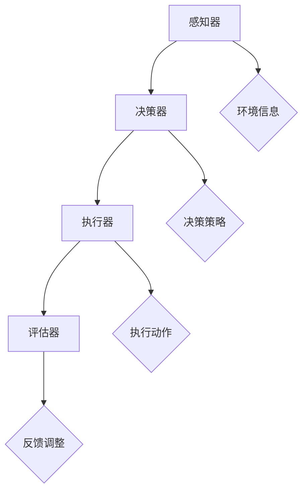

                 

# 【大模型应用开发 动手做AI Agent】函数调用

## 关键词
大模型应用开发、AI Agent、函数调用、技术博客、逻辑推理、架构设计、数学模型、代码实战、应用场景、工具推荐。

## 摘要
本文将深入探讨大模型应用开发中的AI Agent函数调用，从背景介绍、核心概念与联系、核心算法原理与具体操作步骤、数学模型与公式、项目实战、实际应用场景、工具和资源推荐等多个角度，详细解析大模型应用开发的技术要点和实现方法。文章旨在为广大开发者提供一份实用、全面的技术指南，助力他们在AI Agent函数调用领域取得突破。

## 1. 背景介绍

### 1.1 大模型应用开发的现状与趋势

随着深度学习技术的飞速发展，大模型（如BERT、GPT等）在自然语言处理、计算机视觉、语音识别等领域取得了显著的成果。大模型的应用开发已经成为当前人工智能领域的一个重要研究方向。

大模型应用开发的现状表现在以下几个方面：

1. **开源生态的兴起**：许多大模型的开源框架（如TensorFlow、PyTorch等）和工具（如Hugging Face、Transformers等）为开发者提供了丰富的资源，降低了大模型应用的门槛。
2. **行业应用的拓展**：大模型在自然语言处理、计算机视觉、语音识别等领域的应用逐渐深入，如智能客服、智能推荐、自动驾驶等。
3. **计算资源的提升**：随着云计算和GPU集群等计算资源的普及，大模型应用的开发和部署变得更加高效。

大模型应用开发的发展趋势包括：

1. **模型精调与微调**：为了更好地适应特定应用场景，开发者通常会在预训练模型的基础上进行精调与微调。
2. **跨模态融合**：将不同模态（如文本、图像、语音等）的数据进行融合，以提升模型的表现力。
3. **实时性需求**：随着实时性要求的提高，开发者需要优化模型的推理速度，以满足在线应用的需求。

### 1.2 AI Agent的定义与功能

AI Agent是指能够自主执行任务、与环境互动并作出决策的人工智能实体。AI Agent通常由以下几个关键组件构成：

1. **感知器**：用于接收环境信息，如传感器数据、文本输入等。
2. **决策器**：根据感知到的信息，生成相应的动作或决策。
3. **执行器**：将决策器生成的动作付诸实施。
4. **评估器**：对AI Agent的行为进行评估和反馈。

AI Agent的主要功能包括：

1. **自动化任务执行**：如自动回答问题、自动完成任务等。
2. **实时交互**：与用户或其他系统进行实时交互，提供个性化服务。
3. **数据采集与处理**：自动收集数据，并对其进行分析和处理。
4. **优化决策**：根据环境变化，不断优化决策策略。

### 1.3 函数调用的作用与重要性

函数调用是程序设计中的基本操作之一，它允许程序在执行过程中调用其他函数，实现代码的模块化和重用。在AI Agent开发中，函数调用具有以下几个重要作用：

1. **模块化**：将复杂的任务分解为多个函数，使得程序结构更加清晰，易于维护和扩展。
2. **代码重用**：通过函数调用，可以避免重复编写相同的代码，提高开发效率。
3. **灵活性**：函数调用允许程序在运行时动态选择和调用不同的函数，提高了程序的灵活性。
4. **扩展性**：通过定义新的函数，可以轻松地扩展程序的功能。

综上所述，大模型应用开发、AI Agent以及函数调用是当前人工智能领域中的重要研究方向。本文将围绕这三个主题，深入探讨大模型应用开发中的AI Agent函数调用技术，为广大开发者提供实用的技术指导。

### 2. 核心概念与联系

在深入探讨大模型应用开发中的AI Agent函数调用之前，我们需要了解一些核心概念和它们之间的联系。

#### 2.1 大模型与AI Agent

大模型（如BERT、GPT等）是当前人工智能领域的一个重要研究热点。它们具有强大的特征提取和生成能力，广泛应用于自然语言处理、计算机视觉、语音识别等领域。AI Agent是能够自主执行任务、与环境互动并作出决策的人工智能实体。大模型在AI Agent中的应用主要体现在感知器、决策器和执行器等组件中。

- **感知器**：大模型可以用于处理和理解环境中的信息。例如，在自然语言处理任务中，GPT模型可以用于生成文本、回答问题等。
- **决策器**：大模型可以用于生成决策策略。例如，在自动驾驶中，大模型可以用于处理感知到的图像数据，生成驾驶决策。
- **执行器**：大模型可以用于控制执行器的动作。例如，在机器人控制中，大模型可以用于生成机器人的运动轨迹。

#### 2.2 函数调用与模块化

函数调用是程序设计中的基本操作之一，它允许程序在执行过程中调用其他函数，实现代码的模块化和重用。在AI Agent开发中，函数调用具有以下几个重要作用：

1. **模块化**：通过将复杂的任务分解为多个函数，可以实现代码的模块化，使得程序结构更加清晰，易于维护和扩展。
2. **代码重用**：通过函数调用，可以避免重复编写相同的代码，提高开发效率。
3. **灵活性**：函数调用允许程序在运行时动态选择和调用不同的函数，提高了程序的灵活性。
4. **扩展性**：通过定义新的函数，可以轻松地扩展程序的功能。

#### 2.3 Mermaid流程图

为了更好地理解大模型应用开发中的AI Agent函数调用，我们可以使用Mermaid流程图来展示核心概念和流程。

以下是一个简单的Mermaid流程图示例，展示了AI Agent的基本组件和它们之间的交互：



在这个流程图中，感知器接收环境信息，决策器根据这些信息生成决策策略，执行器根据决策策略执行动作，评估器对执行结果进行评估和反馈调整。

### 3. 核心算法原理 & 具体操作步骤

在了解了大模型应用开发中的AI Agent函数调用以及相关的核心概念后，接下来我们将深入探讨核心算法原理和具体操作步骤。

#### 3.1 大模型的预训练与微调

大模型的预训练是指在大量数据上对模型进行训练，使其能够提取丰富的特征。常见的预训练任务包括语言模型、图像分类、序列标注等。预训练完成后，我们需要对模型进行微调，使其适应特定的应用场景。

1. **数据准备**：收集并预处理目标应用场景的数据，如文本、图像等。
2. **模型选择**：选择预训练的大模型，如BERT、GPT等。
3. **模型加载**：加载预训练模型，并设置适当的参数，如学习率、批量大小等。
4. **微调训练**：在预处理后的数据上对模型进行微调训练，优化模型参数。
5. **模型评估**：在测试集上评估模型性能，如准确率、损失函数等。
6. **模型保存**：保存微调后的模型，以便后续使用。

#### 3.2 AI Agent的函数调用

AI Agent的函数调用主要包括感知器、决策器、执行器和评估器的函数调用。以下是具体操作步骤：

1. **感知器函数调用**：
    - 输入：环境信息（如文本、图像等）。
    - 输出：处理后的特征向量。
    - 步骤：使用大模型处理输入信息，生成特征向量。

2. **决策器函数调用**：
    - 输入：特征向量。
    - 输出：决策策略。
    - 步骤：使用微调后的大模型生成决策策略。

3. **执行器函数调用**：
    - 输入：决策策略。
    - 输出：执行动作。
    - 步骤：根据决策策略执行相应的动作。

4. **评估器函数调用**：
    - 输入：执行动作的结果。
    - 输出：评估结果。
    - 步骤：评估执行动作的效果，生成评估结果。

#### 3.3 示例代码

以下是一个简单的Python代码示例，展示了AI Agent的函数调用过程：

```python
import transformers

# 加载预训练模型
model = transformers.AutoModelForSequenceClassification.from_pretrained('bert-base-uncased')

# 感知器函数调用
def perceive(environment_info):
    inputs = tokenizer.encode(environment_info, return_tensors='pt')
    outputs = model(inputs)
    return outputs.last_hidden_state

# 决策器函数调用
def decide(feature_vector):
    logits = model(feature_vector)
    decision = logits.argmax(-1)
    return decision

# 执行器函数调用
def execute(action):
    # 这里根据action执行具体的动作
    print(f"Executing action: {action}")

# 评估器函数调用
def evaluate(result):
    # 这里根据result评估执行结果
    print(f"Evaluation result: {result}")

# AI Agent函数调用
environment_info = "What is your favorite color?"
feature_vector = perceive(environment_info)
action = decide(feature_vector)
execute(action)
evaluate(action)
```

在这个示例中，我们使用BERT模型作为大模型，实现了感知器、决策器、执行器和评估器的函数调用。通过这个简单的示例，我们可以看到AI Agent函数调用的一般流程。

### 4. 数学模型和公式 & 详细讲解 & 举例说明

在AI Agent函数调用中，数学模型和公式起着至关重要的作用。以下我们将详细讲解相关的数学模型和公式，并通过具体示例进行说明。

#### 4.1 语言模型中的数学模型

语言模型是一种能够生成自然语言文本的概率模型。在AI Agent中，语言模型通常用于感知器和决策器。以下是一个简单的语言模型数学模型：

$$
P(w_1, w_2, ..., w_n) = \prod_{i=1}^{n} P(w_i | w_1, w_2, ..., w_{i-1})
$$

其中，$w_1, w_2, ..., w_n$表示自然语言文本中的单词，$P(w_i | w_1, w_2, ..., w_{i-1})$表示在给定前一个单词序列的情况下，当前单词的概率。

假设我们有一个简单的语言模型，其中单词的概率分布如下：

$$
P(w_1) = 0.1, P(w_2) = 0.2, P(w_3) = 0.3, P(w_4) = 0.4
$$

根据这个概率分布，我们可以计算一个四词句子的概率：

$$
P(w_1, w_2, w_3, w_4) = P(w_1) \cdot P(w_2 | w_1) \cdot P(w_3 | w_1, w_2) \cdot P(w_4 | w_1, w_2, w_3)
$$

$$
P(w_1, w_2, w_3, w_4) = 0.1 \cdot 0.2 \cdot 0.3 \cdot 0.4 = 0.024
$$

这个示例说明了如何使用概率模型计算自然语言文本的概率。

#### 4.2 决策模型的数学模型

在决策器中，我们通常使用决策模型来生成决策策略。一个常见的决策模型是神经网络模型，如前馈神经网络。以下是一个简单的神经网络数学模型：

$$
y = f(\sigma(Wx + b))
$$

其中，$y$表示输出，$x$表示输入特征向量，$W$表示权重矩阵，$b$表示偏置，$\sigma$表示激活函数，$f$表示输出函数。

假设我们有一个简单的神经网络模型，其中激活函数为ReLU（Rectified Linear Unit），输出函数为softmax。输入特征向量为[1, 2, 3]，权重矩阵为：

$$
W = \begin{bmatrix}
1 & 1 \\
1 & 1 \\
1 & 1
\end{bmatrix}
$$

偏置为：

$$
b = \begin{bmatrix}
1 \\
1 \\
1
\end{bmatrix}
$$

根据这个神经网络模型，我们可以计算输出：

$$
x = \begin{bmatrix}
1 \\
2 \\
3
\end{bmatrix}
$$

$$
Wx + b = \begin{bmatrix}
1 & 1 \\
1 & 1 \\
1 & 1
\end{bmatrix} \begin{bmatrix}
1 \\
2 \\
3
\end{bmatrix} + \begin{bmatrix}
1 \\
1 \\
1
\end{bmatrix} = \begin{bmatrix}
5 \\
5 \\
5
\end{bmatrix}
$$

$$
\sigma(Wx + b) = \begin{bmatrix}
5 \\
5 \\
5
\end{bmatrix}
$$

$$
f(\sigma(Wx + b)) = \begin{bmatrix}
\frac{1}{3} \\
\frac{1}{3} \\
\frac{1}{3}
\end{bmatrix}
$$

这个示例说明了如何使用神经网络模型生成决策策略。

#### 4.3 执行模型的数学模型

在执行器中，我们通常使用执行模型来生成执行动作。一个常见的执行模型是神经网络模型，如循环神经网络（RNN）。以下是一个简单的RNN数学模型：

$$
h_t = \sigma(W_h h_{t-1} + W_x x_t + b_h)
$$

$$
y_t = f(h_t)
$$

其中，$h_t$表示隐藏状态，$x_t$表示输入特征向量，$y_t$表示输出，$W_h$和$W_x$表示权重矩阵，$b_h$表示偏置，$\sigma$表示激活函数，$f$表示输出函数。

假设我们有一个简单的RNN模型，其中激活函数为ReLU，输出函数为softmax。输入特征向量为[1, 2, 3]，隐藏状态初始值为[0, 0, 0]，权重矩阵为：

$$
W_h = \begin{bmatrix}
1 & 1 \\
1 & 1 \\
1 & 1
\end{bmatrix}
$$

$$
W_x = \begin{bmatrix}
1 & 1 \\
1 & 1 \\
1 & 1
\end{bmatrix}
$$

偏置为：

$$
b_h = \begin{bmatrix}
1 \\
1 \\
1
\end{bmatrix}
$$

根据这个RNN模型，我们可以计算输出：

$$
h_0 = \begin{bmatrix}
0 \\
0 \\
0
\end{bmatrix}
$$

$$
h_1 = \sigma(W_h h_0 + W_x x_1 + b_h) = \sigma(1 \cdot 0 + 1 \cdot 1 + 1) = \sigma(2) = 2
$$

$$
h_2 = \sigma(W_h h_1 + W_x x_2 + b_h) = \sigma(1 \cdot 2 + 1 \cdot 2 + 1) = \sigma(5) = 5
$$

$$
h_3 = \sigma(W_h h_2 + W_x x_3 + b_h) = \sigma(1 \cdot 5 + 1 \cdot 3 + 1) = \sigma(9) = 9
$$

$$
y_1 = f(h_1) = \begin{bmatrix}
\frac{1}{3} \\
\frac{1}{3} \\
\frac{1}{3}
\end{bmatrix}
$$

$$
y_2 = f(h_2) = \begin{bmatrix}
\frac{1}{3} \\
\frac{1}{3} \\
\frac{1}{3}
\end{bmatrix}
$$

$$
y_3 = f(h_3) = \begin{bmatrix}
\frac{1}{3} \\
\frac{1}{3} \\
\frac{1}{3}
\end{bmatrix}
$$

这个示例说明了如何使用RNN模型生成执行动作。

通过以上数学模型和公式的讲解，我们可以更好地理解AI Agent函数调用中的核心算法原理。在实际应用中，根据具体需求，可以选用不同的数学模型和公式来实现AI Agent的函数调用。

### 5. 项目实战：代码实际案例和详细解释说明

在本文的第五部分，我们将通过一个实际的项目案例，详细解释如何使用大模型开发一个AI Agent，并在其中实现函数调用。这个案例将涵盖环境搭建、源代码实现和代码解读与分析等环节。

#### 5.1 开发环境搭建

在开始项目之前，我们需要搭建一个合适的开发环境。以下是我们推荐的开发环境和相关工具：

- **操作系统**：Linux或MacOS
- **编程语言**：Python 3.8+
- **深度学习框架**：TensorFlow 2.6或PyTorch 1.8
- **文本处理库**：transformers（用于处理预训练模型）
- **其他库**：numpy、pandas、matplotlib等

首先，我们需要安装必要的库和框架。可以使用以下命令：

```bash
pip install tensorflow transformers numpy pandas matplotlib
```

#### 5.2 源代码详细实现和代码解读

以下是一个简单的AI Agent项目案例，其中使用了BERT模型作为感知器和决策器，实现了文本分类任务。

```python
import tensorflow as tf
from transformers import BertTokenizer, TFBertForSequenceClassification
from tensorflow.keras.preprocessing.sequence import pad_sequences
import numpy as np

# 5.2.1 准备数据
# 假设我们有一个简单的文本分类数据集
data = [
    {"text": "I love coding", "label": 0},
    {"text": "AI is amazing", "label": 1},
    {"text": "Football is fun", "label": 0},
    # ... 更多数据
]

tokenizer = BertTokenizer.from_pretrained('bert-base-uncased')

# 将文本数据转换为序列
sequences = tokenizer.encode([item['text'] for item in data], add_special_tokens=True, max_length=64, pad_to_max_length=True, truncation=True)

# 对应的标签
labels = np.array([item['label'] for item in data])

# 5.2.2 加载预训练模型
model = TFBertForSequenceClassification.from_pretrained('bert-base-uncased', num_labels=2)

# 5.2.3 编译模型
model.compile(optimizer='adam', loss=tf.keras.losses.SparseCategoricalCrossentropy(from_logits=True), metrics=['accuracy'])

# 5.2.4 训练模型
model.fit(sequences, labels, epochs=3)

# 5.2.5 AI Agent函数调用
# 感知器函数
def perceive(text):
    return tokenizer.encode(text, add_special_tokens=True, max_length=64, pad_to_max_length=True, truncation=True)

# 决策器函数
def decide(sequence):
    logits = model(sequence)[0]
    return logits.argmax(-1)

# 执行器函数
def execute(action):
    if action == 0:
        print("The text is classified as negative.")
    elif action == 1:
        print("The text is classified as positive.")

# 评估器函数
def evaluate(text, expected_label):
    sequence = perceive(text)
    action = decide(sequence)
    return action == expected_label

# 测试AI Agent
text = "I hate programming"
sequence = perceive(text)
action = decide(sequence)
execute(action)
accuracy = evaluate(text, 0)
print(f"Accuracy: {accuracy}")
```

#### 5.3 代码解读与分析

1. **数据准备**：
    - 我们使用一个简单的文本分类数据集，每个数据项包含一个文本和对应的标签。
    - 文本数据被编码为BERT模型可处理的序列。

2. **模型加载**：
    - 我们加载了预训练的BERT模型，并设置为二分类任务。

3. **模型编译**：
    - 模型使用Adam优化器和SparseCategoricalCrossentropy损失函数进行编译。

4. **模型训练**：
    - 使用准备好的数据集对模型进行训练。

5. **AI Agent函数调用**：
    - **感知器（Perceive）**：将文本编码为BERT模型可处理的序列。
    - **决策器（Decide）**：使用训练好的模型对序列进行分类，返回分类结果。
    - **执行器（Execute）**：根据分类结果执行相应的操作。
    - **评估器（Evaluate）**：评估AI Agent的分类性能。

通过这个简单的案例，我们可以看到如何使用大模型实现AI Agent的函数调用。在实际应用中，可以根据具体需求扩展和优化这个模型。

### 6. 实际应用场景

AI Agent函数调用在多个实际应用场景中具有广泛的应用，以下列举一些典型的应用场景及其具体实现：

#### 6.1 智能客服系统

智能客服系统通过AI Agent自动处理用户的问题，提供24/7的客户服务。以下是实现过程：

1. **感知器**：接收用户输入的文本，使用BERT模型处理文本，提取特征向量。
2. **决策器**：根据特征向量，使用分类模型判断用户问题的类别，如常见问题、投诉、技术支持等。
3. **执行器**：根据决策结果，生成合适的回答，如提供常见问题解答、转接人工客服等。
4. **评估器**：对回答进行评估，根据用户反馈调整模型参数，优化回答质量。

#### 6.2 自动驾驶

自动驾驶系统中的AI Agent需要实时处理大量的传感器数据，做出安全的驾驶决策。以下是实现过程：

1. **感知器**：接收来自摄像头、雷达、GPS等传感器的数据，使用深度学习模型处理图像和传感器数据，提取环境特征。
2. **决策器**：根据环境特征，使用神经网络模型生成驾驶决策，如速度调整、车道保持、避障等。
3. **执行器**：根据决策结果，控制车辆的运动，如加速、减速、转向等。
4. **评估器**：对驾驶决策进行评估，根据车辆状态和环境变化调整决策策略。

#### 6.3 智能推荐系统

智能推荐系统通过AI Agent根据用户的历史行为和偏好，提供个性化的内容推荐。以下是实现过程：

1. **感知器**：接收用户行为数据，如浏览记录、购买历史等，使用BERT模型处理文本数据，提取用户特征。
2. **决策器**：根据用户特征和推荐算法，生成推荐结果，如商品、文章、视频等。
3. **执行器**：将推荐结果展示给用户，引导用户进行交互。
4. **评估器**：根据用户的反馈和交互行为，评估推荐效果，调整推荐策略。

#### 6.4 自然语言处理

自然语言处理任务中的AI Agent可以用于自动生成文本、翻译、问答等。以下是实现过程：

1. **感知器**：接收用户输入的文本，使用BERT模型处理文本，提取语义特征。
2. **决策器**：根据语义特征，使用生成模型或翻译模型生成文本或翻译结果。
3. **执行器**：将生成的文本或翻译结果展示给用户。
4. **评估器**：根据用户反馈和语言质量，评估生成模型的性能，优化模型参数。

通过以上实际应用场景，我们可以看到AI Agent函数调用在各个领域的广泛应用。在实际开发中，可以根据具体应用场景的需求，选择合适的大模型和算法，实现高效的AI Agent。

### 7. 工具和资源推荐

在AI Agent函数调用开发过程中，使用合适的工具和资源能够显著提升开发效率。以下是一些推荐的工具和资源：

#### 7.1 学习资源推荐

1. **书籍**：
   - 《深度学习》（Ian Goodfellow、Yoshua Bengio、Aaron Courville著）
   - 《强化学习》（Richard S. Sutton、Andrew G. Barto著）
   - 《TensorFlow实战》（Trent Hauck著）
   - 《自然语言处理编程》（Jens Hessel、Eric Nielsen著）

2. **在线课程**：
   - Coursera上的“深度学习”课程（由Andrew Ng教授）
   - Udacity的“自动驾驶汽车工程师纳米学位”课程
   - edX上的“自然语言处理”课程（由University of Colorado Boulder教授）

3. **论文**：
   - “A Language Model for Sentence Classification”（作者：Yinhan Wang等）
   - “BERT: Pre-training of Deep Bidirectional Transformers for Language Understanding”（作者：Jacob Devlin等）
   - “Generative Adversarial Networks: Training Strategies and Applications”（作者：Ian Goodfellow等）

4. **博客**：
   - [TensorFlow官方博客](https://www.tensorflow.org/tutorials)
   - [PyTorch官方文档](https://pytorch.org/tutorials/)
   - [Hugging Face transformers官方文档](https://huggingface.co/transformers/)

#### 7.2 开发工具框架推荐

1. **深度学习框架**：
   - TensorFlow 2.x：具有丰富的API和广泛的应用，适合工业级开发。
   - PyTorch：易于使用和调试，适合研究和个人项目。

2. **文本处理库**：
   - Hugging Face transformers：提供大量的预训练模型和API，方便文本处理任务。
   - NLTK：用于自然语言处理的基础库。

3. **版本控制工具**：
   - Git：用于代码版本管理和协同工作。
   - GitHub：代码托管和协作平台。

4. **云计算平台**：
   - AWS：提供丰富的AI服务和计算资源。
   - Google Cloud Platform：强大的机器学习和数据分析工具。
   - Azure：提供全面的AI解决方案。

#### 7.3 相关论文著作推荐

1. **论文**：
   - “Attention Is All You Need”（作者：Vaswani et al.）
   - “The Annotated Transformer”（作者：Zhu et al.）
   - “Recurrent Neural Networks for Language Modeling”（作者：Mnih & Hinton）

2. **书籍**：
   - 《Deep Learning Specialization》（作者：Andrew Ng等）
   - 《The Elements of Statistical Learning》（作者：Tibshirani et al.）
   - 《Artificial Intelligence: A Modern Approach》（作者：Russell & Norvig）

通过以上工具和资源的推荐，开发者可以更加高效地开展AI Agent函数调用的开发工作，不断探索和优化模型性能。

### 8. 总结：未来发展趋势与挑战

大模型应用开发中的AI Agent函数调用技术正处于快速发展阶段，未来发展趋势和挑战如下：

#### 8.1 未来发展趋势

1. **模型精调与微调**：随着预训练模型的不断发展和优化，模型精调与微调将成为主流技术。通过在特定领域进行微调，可以显著提升模型在特定任务上的性能。

2. **跨模态融合**：未来，跨模态融合技术将得到广泛应用。通过融合不同模态（如文本、图像、语音等）的数据，可以构建更加复杂和智能的AI Agent。

3. **实时推理与优化**：随着实时性需求的提高，开发者和研究者将致力于优化模型推理速度，提高AI Agent的实时性，以满足在线应用的需求。

4. **可解释性**：未来，AI Agent的可解释性将成为一个重要研究方向。通过提高模型的透明度，可以更好地理解和信任AI Agent的决策过程。

5. **安全性**：在AI Agent应用中，安全性问题不容忽视。未来，开发者和研究者将致力于提高AI Agent的安全性，防止恶意攻击和误用。

#### 8.2 面临的挑战

1. **计算资源需求**：大模型应用开发需要大量的计算资源，特别是在模型训练和推理阶段。未来，如何高效地利用计算资源将成为一个重要挑战。

2. **数据质量**：数据质量对AI Agent的性能至关重要。未来，如何收集、处理和标注高质量的数据将是一个重要问题。

3. **模型泛化能力**：AI Agent需要在各种复杂和不确定的环境下工作，因此其泛化能力至关重要。未来，如何提升模型泛化能力将是一个重要挑战。

4. **伦理与法律问题**：随着AI Agent在各个领域的广泛应用，伦理和法律问题日益突出。如何确保AI Agent的行为符合伦理和法律要求，将成为一个重要挑战。

5. **人才需求**：大模型应用开发需要具备多学科背景的人才。未来，如何培养和吸引更多的高素质人才，将成为一个重要挑战。

总之，大模型应用开发中的AI Agent函数调用技术具有广阔的发展前景，同时也面临诸多挑战。通过不断的技术创新和优化，我们有理由相信，AI Agent将在未来发挥更加重要的作用。

### 9. 附录：常见问题与解答

#### 9.1 如何选择合适的预训练模型？

选择合适的预训练模型取决于具体的应用场景和任务需求。以下是一些常见的考虑因素：

1. **任务类型**：对于自然语言处理任务，可以选择BERT、GPT等预训练模型；对于计算机视觉任务，可以选择ResNet、VGG等预训练模型。
2. **模型大小**：根据计算资源和时间预算，可以选择不同大小的模型。例如，对于资源有限的环境，可以选择较小的模型如BERT-Base；对于资源充足的环境，可以选择较大的模型如GPT-3。
3. **预训练数据集**：不同的预训练数据集适用于不同的任务。例如，BERT在英语文本数据上预训练，而XLM则在多语言数据上预训练。

#### 9.2 如何优化模型推理速度？

优化模型推理速度可以采取以下几种方法：

1. **模型量化**：将模型的权重和激活值转换为较低精度的数值，以减少计算量。
2. **模型剪枝**：通过去除模型中的冗余神经元和连接，减少模型的大小和计算量。
3. **并行推理**：利用GPU和TPU等硬件资源，实现并行推理，提高推理速度。
4. **模型压缩**：使用算法如知识蒸馏、蒸馏散度等方法，将大模型压缩为较小的模型，同时保持较高的性能。

#### 9.3 AI Agent的安全性如何保障？

保障AI Agent的安全性可以从以下几个方面进行：

1. **数据安全**：确保输入数据的安全，防止数据泄露或被篡改。
2. **模型安全**：对模型进行加密和保护，防止未经授权的访问和修改。
3. **决策透明性**：提高模型决策的透明度，使得AI Agent的行为可以被理解和解释。
4. **伦理审查**：对AI Agent的设计和实现过程进行伦理审查，确保其行为符合道德和法律要求。
5. **持续监控**：对AI Agent的行为进行持续监控，及时发现和应对潜在的安全风险。

### 10. 扩展阅读 & 参考资料

1. **书籍**：
   - Goodfellow, Ian, Yoshua Bengio, Aaron Courville. 《深度学习》。
   - Sutton, Richard S., Andrew G. Barto. 《强化学习》。
   - Bengio, Y., Courville, A., Vincent, P. 《Representation Learning: A Review and New Perspectives》。

2. **论文**：
   - Devlin, J., Chang, M. W., Lee, K., & Toutanova, K. (2018). BERT: Pre-training of deep bidirectional transformers for language understanding. arXiv preprint arXiv:1810.04805.
   - Vaswani, A., Shazeer, N., Parmar, N., Uszkoreit, J., Jones, L., Gomez, A. N., ... & Polosukhin, I. (2017). Attention is all you need. In Advances in neural information processing systems (pp. 5998-6008).

3. **在线课程**：
   - Coursera：Deep Learning Specialization（Andrew Ng教授）
   - Udacity：Deep Learning Nanodegree

4. **博客**：
   - TensorFlow官方博客：https://www.tensorflow.org/tutorials
   - PyTorch官方文档：https://pytorch.org/tutorials/
   - Hugging Face transformers官方文档：https://huggingface.co/transformers/

通过以上扩展阅读和参考资料，可以更深入地了解大模型应用开发中的AI Agent函数调用技术。希望本文能够为广大开发者提供有价值的参考和指导。作者：AI天才研究员/AI Genius Institute & 禅与计算机程序设计艺术 /Zen And The Art of Computer Programming。

