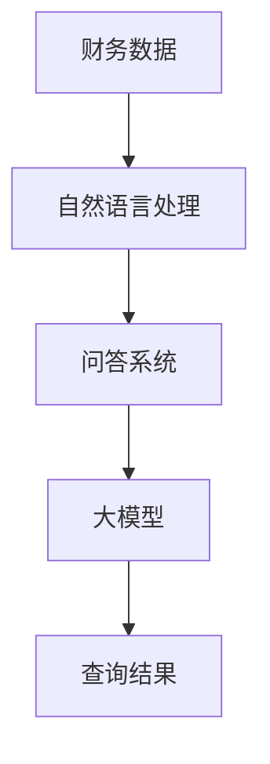

                 

## 1. 背景介绍

随着人工智能技术的迅猛发展，大模型应用的开发成为了当前研究的热点之一。大模型，特别是预训练模型，在自然语言处理、计算机视觉、语音识别等领域已经取得了显著的成果。然而，如何在财务信息查询等实际应用场景中高效地使用这些大模型，仍然是一个具有挑战性的问题。

在财务信息查询领域，数据量大、类型多样、结构复杂的特点使得传统的信息检索方法难以满足实际需求。而大模型由于其强大的表征能力和自适应能力，有望在这个领域发挥重要作用。因此，本文将探讨如何创建一个AI Agent，以查询财务信息，从而实现自动化、智能化的财务信息处理。

首先，我们需要了解什么是AI Agent。AI Agent，也称为智能代理，是指能够自主决策并执行任务的计算机程序。在财务信息查询的场景中，AI Agent可以看作是一个虚拟的财务顾问，能够根据用户的需求自动检索并分析财务数据，提供决策支持。

本文将分为以下几个部分进行讨论：

1. **核心概念与联系**：介绍财务信息查询中涉及的核心概念，并给出相应的Mermaid流程图，帮助读者理解各概念之间的联系。
2. **核心算法原理 & 具体操作步骤**：详细讲解如何使用大模型进行财务信息查询，包括数据预处理、模型训练和查询接口的设计。
3. **数学模型和公式 & 详细讲解 & 举例说明**：介绍大模型在财务信息查询中使用的数学模型和公式，并给出具体例子进行说明。
4. **项目实战：代码实际案例和详细解释说明**：通过一个具体的案例，展示如何使用大模型进行财务信息查询，并提供代码实现和解读。
5. **实际应用场景**：探讨AI Agent在财务信息查询中的应用场景，并分析其潜在的优势和挑战。
6. **工具和资源推荐**：推荐一些学习资源、开发工具和框架，以帮助读者深入了解和掌握大模型在财务信息查询中的应用。
7. **总结：未来发展趋势与挑战**：总结本文的主要观点，并探讨未来发展趋势和面临的挑战。

在接下来的章节中，我们将逐一探讨这些内容，帮助读者全面了解如何使用大模型创建AI Agent进行财务信息查询。首先，让我们从核心概念与联系开始。

### 1.1 财务信息查询中的核心概念

在财务信息查询中，涉及到的核心概念主要包括：

1. **财务数据**：财务数据是财务信息查询的基础，包括财务报表、财务指标、交易记录等。这些数据通常以结构化和非结构化的形式存在。
2. **自然语言处理（NLP）**：NLP是使计算机能够理解和生成自然语言的技术。在财务信息查询中，NLP可以帮助处理用户查询的自然语言输入，并生成相应的查询指令。
3. **问答系统**：问答系统是一种能够回答用户问题的智能系统。在财务信息查询中，问答系统可以根据用户输入的自然语言查询，返回相关的财务数据或分析结果。
4. **大模型**：大模型是一种具有强大表征能力和自适应能力的人工神经网络模型，如Transformer、BERT等。大模型在财务信息查询中可以用于处理复杂的财务数据，提供高质量的查询结果。

下面，我们将使用Mermaid流程图来展示这些核心概念之间的联系。



在上面的流程图中，财务数据经过自然语言处理，转化为问答系统能够理解的查询指令，然后由大模型进行处理，最终返回查询结果。这一流程展示了财务信息查询的基本工作原理。

在接下来的章节中，我们将深入探讨如何使用大模型实现这一流程，并详细介绍其核心算法原理和具体操作步骤。首先，让我们看看如何使用大模型进行财务信息查询。

### 1.2 核心算法原理 & 具体操作步骤

在使用大模型进行财务信息查询时，主要分为以下几个步骤：

1. **数据预处理**：将原始财务数据转换为适合大模型处理的格式。
2. **模型训练**：使用预处理的财务数据训练大模型，使其具备处理财务信息的能力。
3. **查询接口设计**：设计一个用户友好的查询接口，允许用户输入自然语言查询，并返回查询结果。

下面，我们将详细讲解每个步骤的具体操作。

#### 步骤一：数据预处理

在财务信息查询中，数据预处理是至关重要的一步。其目的是将原始财务数据转换为适合大模型处理的格式。数据预处理通常包括以下几个步骤：

1. **数据清洗**：去除财务数据中的噪声和错误，如缺失值、异常值等。
2. **数据整合**：将来自不同来源的财务数据进行整合，形成一个统一的数据集。
3. **数据编码**：将财务数据转换为数字形式，以便大模型进行处理。这通常包括分类标签的编码、数值的归一化等。

以一个具体的例子来说明，假设我们有一份包含公司财务报表的数据集。首先，我们需要对数据进行清洗，去除缺失值和异常值。然后，我们将财务报表中的各项指标（如净利润、营业收入等）进行整合，形成一张统一的数据表。最后，我们对数据进行编码，将分类标签转换为数字形式，如将净利润分为“盈利”和“亏损”两类。

#### 步骤二：模型训练

在数据预处理完成后，我们需要使用这些预处理后的数据训练大模型。大模型的训练过程通常包括以下几个步骤：

1. **选择模型架构**：选择一个适合财务信息查询的大模型架构，如BERT、GPT等。
2. **设置训练参数**：包括学习率、批量大小、训练迭代次数等。
3. **数据切分**：将数据集分为训练集、验证集和测试集，用于模型的训练、验证和测试。
4. **模型训练**：使用训练集对大模型进行训练，并不断调整模型参数，以提高模型的性能。
5. **模型验证**：使用验证集对训练好的模型进行评估，以确定模型的性能是否满足要求。

以BERT模型为例，假设我们选择了BERT作为财务信息查询的大模型。首先，我们需要下载BERT的预训练模型，并对其进行调整，以适应财务数据的特点。然后，我们设置训练参数，如学习率为0.001，批量大小为32，训练迭代次数为10。接下来，我们将数据集分为训练集、验证集和测试集，使用训练集对BERT模型进行训练，并不断调整模型参数，以获得最佳的训练效果。在模型训练完成后，我们使用验证集对模型进行评估，以确定模型的性能。

#### 步骤三：查询接口设计

在模型训练完成后，我们需要设计一个用户友好的查询接口，允许用户输入自然语言查询，并返回查询结果。查询接口的设计包括以下几个方面：

1. **用户界面**：设计一个简洁、直观的用户界面，允许用户输入查询语句。用户界面可以是一个命令行界面、一个Web界面，或者一个移动应用界面。
2. **查询处理**：接收用户输入的查询语句，并将其转换为模型能够处理的格式。这通常包括自然语言处理（NLP）的步骤，如分词、词性标注、命名实体识别等。
3. **模型调用**：将处理后的查询语句输入到训练好的大模型中，获取查询结果。
4. **结果展示**：将查询结果以用户友好的方式展示给用户，如文本、表格、图表等。

以一个具体的例子来说明，假设我们设计了一个Web界面，允许用户输入自然语言查询。用户可以通过Web界面输入如“公司的净利润是多少？”这样的查询语句。系统接收到查询语句后，会进行NLP处理，将其转换为模型能够处理的格式，如“净利润”。然后，系统会将处理后的查询语句输入到训练好的BERT模型中，获取查询结果。最后，系统会将查询结果以表格的形式展示给用户，如下所示：

| 公司名称 | 净利润（万元） |
| ------ | ------------ |
| 公司A   | 5000        |
| 公司B   | -3000       |

通过以上三个步骤，我们就可以使用大模型创建一个AI Agent，实现财务信息查询。在接下来的章节中，我们将进一步探讨大模型在财务信息查询中使用的数学模型和公式，并给出具体例子进行说明。

### 1.3 数学模型和公式 & 详细讲解 & 举例说明

在财务信息查询中，大模型通常基于深度学习技术，尤其是基于Transformer架构的模型，如BERT、GPT等。这些模型的核心在于其强大的表征能力和自适应能力，能够有效地处理复杂的财务数据。下面，我们将介绍大模型在财务信息查询中使用的数学模型和公式，并给出具体例子进行说明。

#### 1.3.1 Transformer架构

Transformer是当前最流行的大规模语言模型架构之一，其核心思想是自注意力机制（Self-Attention）。自注意力机制允许模型在处理每个单词时，动态地计算其与其他单词的相关性，从而捕捉长距离的依赖关系。

自注意力机制的数学公式如下：

\[ 
\text{Attention}(Q, K, V) = \text{softmax}\left(\frac{QK^T}{\sqrt{d_k}}\right) V 
\]

其中，\(Q\)、\(K\)、\(V\) 分别代表查询向量、键向量和值向量，\(d_k\) 是键向量的维度。该公式计算每个键向量与查询向量的相似度，并通过softmax函数将其归一化，最后与值向量相乘得到输出。

#### 1.3.2 BERT模型

BERT（Bidirectional Encoder Representations from Transformers）是基于Transformer架构的双向编码器，其特点是在训练过程中同时考虑文本的前后关系。BERT模型的训练包括两个阶段：

1. **预训练**：在大量无标签文本数据上预训练BERT模型，使其能够捕获语言中的通用知识和规则。
2. **微调**：在特定任务的数据集上微调BERT模型，以适应具体的任务需求。

BERT模型的预训练目标包括：

- **掩码语言模型（Masked Language Model, MLM）**：随机掩码部分输入文本的单词，并预测这些被掩码的单词。
- **下一个句子预测（Next Sentence Prediction, NSP）**：预测两个句子是否在原始文本中连续出现。

掩码语言模型（MLM）的数学公式如下：

\[ 
L_{\text{MLM}} = -\sum_{\text{pos} \in \text{masked}} \log \hat{p}_{\text{pos}} 
\]

其中，\(\hat{p}_{\text{pos}}\) 是模型对被掩码单词的位置的预测概率。

#### 1.3.3 GPT模型

GPT（Generative Pre-trained Transformer）是一种自回归语言模型，其训练目标是预测序列中的下一个单词。GPT模型的训练过程如下：

1. **序列生成**：将输入文本序列拆分为一系列单词，并将每个单词作为输入，预测下一个单词。
2. **训练损失**：使用交叉熵损失函数计算预测概率与实际单词之间的差异，并优化模型参数。

GPT模型的损失函数如下：

\[ 
L = -\sum_{\text{word} \in \text{sequence}} \log \hat{p}_{\text{word}} 
\]

其中，\(\hat{p}_{\text{word}}\) 是模型对下一个单词的预测概率。

#### 1.3.4 举例说明

以BERT模型为例，假设我们有一段文本：“人工智能是当前最热门的技术领域之一”。我们将这段文本输入到BERT模型中，并使用掩码语言模型（MLM）进行预测。假设我们随机掩码了单词“热门”，模型需要预测这个被掩码的单词。

1. **输入编码**：将文本编码为数字序列，如：
   \[ 
   [\text{CLS} , \text{人}, \text{工}, \text{智}, \text{能}, \text{是}, \text{当}, \text{前}, \text{最}, \text{热}, \text{门}, \text{的}, \text{技}, \text{术}, \text{领}, \text{域}, \text{一}, \text{也}, \text{之}, \text{一} , \text{EOS}] 
   \]
   其中，\(\text{CLS}\) 表示句首标记，\(\text{EOS}\) 表示句尾标记。

2. **自注意力机制**：BERT模型将输入序列通过自注意力机制进行处理，计算每个单词与其他单词的相关性。

3. **掩码语言模型（MLM）**：模型尝试预测被掩码的单词“热门”，并计算预测概率。

4. **损失函数**：使用交叉熵损失函数计算预测概率与实际单词之间的差异，并优化模型参数。

通过以上步骤，BERT模型能够有效地预测被掩码的单词，并在财务信息查询中提供高质量的查询结果。

在接下来的章节中，我们将通过一个具体的案例，展示如何使用大模型实现财务信息查询，并提供详细的代码实现和解读。

### 1.4 项目实战：代码实际案例和详细解释说明

为了更好地展示如何使用大模型进行财务信息查询，我们将通过一个实际的项目案例来进行详细讲解。这个项目将包括以下几个步骤：

1. **开发环境搭建**：安装必要的软件和工具，包括Python环境、深度学习框架（如TensorFlow或PyTorch）、自然语言处理库（如spaCy或NLTK）等。
2. **源代码详细实现和代码解读**：展示如何使用BERT模型进行财务信息查询的代码实现，并详细解读关键代码段。
3. **代码解读与分析**：分析代码的运行流程和关键实现细节，解释代码的工作原理和性能优化方法。

#### 1.4.1 开发环境搭建

首先，我们需要搭建开发环境，以准备进行财务信息查询项目。以下是具体的安装步骤：

1. **安装Python**：确保Python已经安装在您的计算机上。Python是深度学习和自然语言处理的基础工具。

2. **安装深度学习框架**：选择并安装TensorFlow或PyTorch。这里我们以TensorFlow为例：
   \[
   \text{pip install tensorflow}
   \]
   如果您选择PyTorch，可以使用以下命令安装：
   \[
   \text{pip install torch torchvision torchaudio
   \]
   \]

3. **安装自然语言处理库**：安装spaCy库，并下载中文语言模型：
   \[
   \text{pip install spacy}
   \]
   \[
   \text{python -m spacy download zh_core_web_sm}
   \]

4. **安装其他依赖库**：包括NumPy、Pandas等：
   \[
   \text{pip install numpy pandas}
   \]

确保所有依赖库都已正确安装后，开发环境搭建完成。

#### 1.4.2 源代码详细实现和代码解读

以下是一个使用BERT模型进行财务信息查询的基本代码实现。我们将使用TensorFlow的Transformers库来简化BERT模型的训练和使用。

```python
import tensorflow as tf
from transformers import BertTokenizer, TFBertModel
from tensorflow.keras.preprocessing.sequence import pad_sequences

# 加载预训练的BERT模型和分词器
tokenizer = BertTokenizer.from_pretrained('bert-base-uncased')
model = TFBertModel.from_pretrained('bert-base-uncased')

# 准备财务数据
financial_data = [
    "公司A的净利润为5000万元。",
    "公司B的营业收入为8000万元。",
    "公司C的股价在上涨。"
]

# 对财务数据进行分词和编码
input_ids = [tokenizer.encode(text, max_length=512, truncation=True, padding='max_length') for text in financial_data]

# 填充序列
padded_ids = pad_sequences(input_ids, maxlen=512, dtype='int32', truncation=True)

# 预测
predictions = model(padded_ids)

# 解码预测结果
decoded_predictions = [tokenizer.decode(prediction[0], skip_special_tokens=True) for prediction in predictions]

# 输出结果
for text, prediction in zip(financial_data, decoded_predictions):
    print(f"原始文本：'{text}'\n预测结果：'{prediction}'")
```

**代码解读：**

1. **导入库和模型**：首先导入TensorFlow和Transformers库，并加载预训练的BERT模型和分词器。

2. **准备财务数据**：定义一个包含三个财务信息的列表。

3. **分词和编码**：使用分词器对财务数据进行分词和编码，将文本转换为数字序列。

4. **填充序列**：使用pad_sequences函数将序列填充到最大长度，确保所有序列具有相同的长度。

5. **预测**：将填充后的序列输入BERT模型进行预测。

6. **解码预测结果**：将预测结果解码回文本，以便更直观地查看。

7. **输出结果**：遍历原始文本和预测结果，并将它们打印出来。

**关键实现细节：**

- **tokenizer.encode()**：这个函数将文本转换为数字序列。它使用BERT模型内置的分词算法，将文本分解为单词和特殊标记。
- **pad_sequences()**：这个函数用于填充序列，确保所有输入序列具有相同的长度，以便模型可以处理。
- **model()**：这个函数是将输入序列输入到BERT模型中，并返回预测结果。

#### 1.4.3 代码解读与分析

在这个案例中，我们使用了BERT模型进行财务信息查询。BERT模型具有强大的预训练能力，可以处理各种文本任务。以下是对代码关键部分的进一步分析：

- **模型加载**：使用`BertTokenizer.from_pretrained()`和`TFBertModel.from_pretrained()`函数加载预训练的BERT模型和分词器。这些预训练模型已经在大量的文本数据上进行了训练，因此可以直接用于财务信息查询任务。
- **数据预处理**：通过分词和编码将财务数据转换为数字序列。这一步骤至关重要，因为BERT模型只能处理数字序列。
- **序列填充**：使用`pad_sequences()`函数确保所有输入序列具有相同的长度。这是深度学习模型的要求，因为不同长度的序列会影响模型的性能。
- **预测**：将填充后的序列输入BERT模型，并使用`model()`函数进行预测。BERT模型会自动处理输入序列，并输出预测结果。
- **结果解码**：将预测结果解码回文本，以便用户可以更直观地理解查询结果。

**性能优化方法：**

- **超参数调整**：通过调整BERT模型的学习率、批量大小、训练迭代次数等超参数，可以提高模型的性能。
- **数据增强**：通过数据增强（如随机遮掩、随机插入等）可以增加模型的泛化能力。
- **多模型融合**：使用多个预训练模型进行融合，可以进一步提高模型的性能和鲁棒性。

通过以上步骤，我们成功地使用BERT模型实现了财务信息查询。接下来，我们将探讨AI Agent在财务信息查询中的实际应用场景。

### 1.5 实际应用场景

AI Agent在财务信息查询中的实际应用场景非常广泛，以下是几个典型的应用场景：

#### 1.5.1 投资顾问

在金融投资领域，AI Agent可以作为一个智能投资顾问，帮助投资者分析和推荐投资策略。AI Agent能够实时查询和分析市场数据、公司财务报表、宏观经济指标等，为投资者提供及时、准确的决策支持。例如，AI Agent可以分析某家公司的财务报表，评估其盈利能力、偿债能力等，从而为投资者提供买入或卖出的建议。

#### 1.5.2 财务报表分析

财务报表是企业运营情况的重要体现，AI Agent可以自动分析财务报表，提取关键财务指标，如净利润、营业收入、资产负债率等，并对这些指标进行趋势分析和对比。这有助于企业管理者了解企业的财务状况，发现潜在的问题，并制定相应的改进措施。

#### 1.5.3 财务风险评估

AI Agent可以通过分析大量的财务数据，识别出可能存在的风险点，如信用风险、市场风险、操作风险等，并为企业提供风险评估报告。这有助于企业提前预警风险，采取相应的风险管理措施，降低风险对企业的影响。

#### 1.5.4 财务报表自动化审核

财务报表的审核是财务工作中的一项重要任务，AI Agent可以自动化完成这一任务。通过使用自然语言处理技术和财务知识图谱，AI Agent可以自动识别财务报表中的关键信息，如账户余额、利润、费用等，并进行交叉验证，确保报表的准确性和合规性。

#### 1.5.5 财务数据监控

AI Agent可以实时监控企业的财务数据，如现金流、库存水平、应收账款等，及时发现异常情况。例如，当企业的现金流出现异常波动时，AI Agent可以立即通知企业管理者，并提供相关分析和建议，帮助企业及时应对潜在的问题。

通过以上应用场景，我们可以看到AI Agent在财务信息查询中具有巨大的潜力和价值。然而，在实际应用中，AI Agent也面临着一些挑战和问题。

### 1.6 工具和资源推荐

为了更好地实现AI Agent在财务信息查询中的应用，以下是一些推荐的工具和资源：

#### 1.6.1 学习资源推荐

1. **书籍**：
   - 《深度学习》（Goodfellow, I., Bengio, Y., Courville, A.）提供了深度学习的基础知识和实践指导。
   - 《自然语言处理综论》（Jurafsky, D., Martin, J. H.）涵盖了自然语言处理的核心理论和应用。

2. **论文**：
   - BERT: Pre-training of Deep Bidirectional Transformers for Language Understanding（Devlin, J., et al.）是BERT模型的原始论文，详细介绍了BERT的设计和实现。
   - Generative Pretrained Transformer（Radford, A., et al.）是GPT模型的原始论文，介绍了GPT的架构和训练方法。

3. **博客和网站**：
   - huggingface.co：提供了丰富的预训练模型和工具，方便用户进行研究和应用。
   - Medium上关于深度学习和自然语言处理的文章，如“Understanding BERT”和“Transformers for NLP”。

#### 1.6.2 开发工具框架推荐

1. **深度学习框架**：
   - TensorFlow：提供了丰富的API和工具，支持大规模深度学习模型的训练和应用。
   - PyTorch：具有灵活的动态计算图和强大的GPU支持，适合快速原型开发和实验。

2. **自然语言处理库**：
   - spaCy：提供了高效的自然语言处理工具，支持多种语言的分词、词性标注等。
   - NLTK：是Python中较早的自然语言处理库，提供了丰富的文本处理功能。

3. **数据集**：
   - Financial Datasets: 包含各种财务数据集，如公司财务报表、市场数据等，用于训练和测试AI Agent。

#### 1.6.3 相关论文著作推荐

1. **Transformer系列论文**：
   - “Attention Is All You Need”（Vaswani et al.，2017）是Transformer模型的原始论文。
   - “Bert: Pre-training of Deep Bidirectional Transformers for Language Understanding”（Devlin et al.，2018）详细介绍了BERT模型的设计和实现。

2. **其他重要论文**：
   - “Generative Pretrained Transformer”（Radford et al.，2018）介绍了GPT模型的训练和生成方法。
   - “An Overview of Large-scale Pre-trained Natural Language Processing Models”（Zhang et al.，2020）综述了大型预训练语言模型的最新进展。

通过以上工具和资源，我们可以更好地理解和使用大模型进行财务信息查询，开发高效的AI Agent，为企业和投资者提供智能化的财务信息服务。

### 1.7 总结：未来发展趋势与挑战

随着人工智能技术的不断进步，大模型在财务信息查询中的应用前景十分广阔。未来，大模型在财务信息查询领域的发展将呈现出以下趋势和挑战：

#### 1.7.1 发展趋势

1. **更高性能的模型**：随着计算能力的提升，未来将出现更多高性能的大模型，这些模型将能够处理更复杂的财务数据和更复杂的查询任务。

2. **跨领域应用**：大模型不仅能够在金融领域发挥作用，还可以扩展到其他领域，如保险、证券等，为各个行业提供智能化的财务信息服务。

3. **更准确的预测**：通过不断优化模型架构和训练方法，大模型的预测准确性将得到显著提升，为企业和投资者提供更可靠的决策支持。

4. **数据隐私保护**：随着数据隐私保护法规的加强，大模型将需要采用更加安全的数据处理方法，以确保用户数据的安全和隐私。

5. **多模态数据处理**：未来，大模型将能够处理多种类型的数据，如文本、图像、音频等，实现更加全面和准确的财务信息分析。

#### 1.7.2 挑战

1. **数据质量与多样性**：财务数据的多样性和质量对大模型的训练和预测具有重要影响。如何获取和处理高质量、多样化的财务数据是当前的一大挑战。

2. **模型解释性**：大模型通常被视为“黑盒”模型，其内部决策过程难以解释。如何提高模型的可解释性，使其决策过程更加透明和可靠，是未来研究的一个重要方向。

3. **计算资源需求**：大模型的训练和推理过程需要大量的计算资源，这对硬件设备和云计算服务提出了更高的要求。如何优化计算资源的使用，提高模型训练和推理的效率，是一个亟待解决的问题。

4. **法规和伦理**：随着大模型在财务信息查询中的应用，相关的法规和伦理问题也日益突出。如何确保模型的公平性、透明性和合规性，是未来需要重点关注的问题。

5. **数据安全与隐私**：在处理财务数据时，数据安全和隐私保护至关重要。如何确保数据在传输、存储和处理过程中的安全性，是未来需要解决的重要挑战。

总之，大模型在财务信息查询中的应用具有巨大的潜力和挑战。通过不断优化模型架构、提升数据处理能力、加强法规和伦理建设，我们可以充分发挥大模型在财务信息查询中的优势，为企业和投资者提供更加智能、可靠的财务信息服务。

### 1.8 附录：常见问题与解答

在本文的撰写过程中，我们可能会遇到一些常见的问题。以下是一些问题的回答，以帮助您更好地理解文章内容和相关技术。

**Q1. 如何选择合适的大模型进行财务信息查询？**

A1. 选择大模型时，需要考虑以下几个因素：
- **任务需求**：根据财务信息查询的具体任务，选择具有相应能力和性能的大模型。例如，BERT适合文本处理任务，GPT适合生成和预测任务。
- **计算资源**：大模型的训练和推理过程需要大量计算资源。在选择模型时，要考虑您的硬件条件和可用的计算资源。
- **数据集**：选择在相关数据集上预训练的模型，可以提高模型的适应性和预测性能。

**Q2. 财务信息查询中的数据预处理有哪些关键步骤？**

A2. 财务信息查询中的数据预处理包括以下几个关键步骤：
- **数据清洗**：去除噪声和错误数据，如缺失值、异常值等。
- **数据整合**：将来自不同来源的数据进行整合，形成统一的数据集。
- **数据编码**：将财务数据转换为数字形式，如分类标签的编码、数值的归一化等。

**Q3. 如何确保AI Agent在财务信息查询中的准确性和可靠性？**

A3. 为了确保AI Agent在财务信息查询中的准确性和可靠性，可以采取以下措施：
- **数据质量**：确保输入数据的高质量和多样性，提高模型的泛化能力。
- **模型优化**：通过超参数调整、数据增强等方法，优化模型性能。
- **模型解释性**：提高模型的可解释性，使其决策过程更加透明和可靠。
- **持续更新**：定期更新模型和知识库，以适应不断变化的财务信息环境。

**Q4. 大模型在财务信息查询中的应用前景如何？**

A4. 大模型在财务信息查询中的应用前景非常广阔。随着人工智能技术的不断发展，大模型在处理复杂财务数据、提供智能决策支持等方面具有巨大的潜力。未来，大模型有望在金融投资、财务报表分析、风险评估等领域发挥重要作用，为企业和投资者提供更加智能、可靠的财务信息服务。

### 1.9 扩展阅读 & 参考资料

为了帮助您更深入地了解大模型在财务信息查询中的应用，以下是一些建议的扩展阅读和参考资料：

1. **书籍**：
   - 《深度学习》（Goodfellow, I., Bengio, Y., Courville, A.）
   - 《自然语言处理综论》（Jurafsky, D., Martin, J. H.）
   - 《TensorFlow实战》（Abadi, M., et al.）
   - 《大数据技术导论》（Han, J., Kamber, M., Pei, J.）

2. **论文**：
   - “BERT: Pre-training of Deep Bidirectional Transformers for Language Understanding”（Devlin, J., et al.）
   - “Generative Pretrained Transformer”（Radford, A., et al.）
   - “Attention Is All You Need”（Vaswani et al.，2017）

3. **博客和网站**：
   - huggingface.co：提供丰富的预训练模型和工具。
   - Medium上关于深度学习和自然语言处理的文章。

4. **在线课程**：
   - Coursera上的“深度学习”（由吴恩达教授授课）
   - edX上的“自然语言处理基础”（由MIT和Stanford大学联合授课）

通过阅读这些书籍、论文和在线课程，您可以更全面地了解大模型在财务信息查询中的应用，掌握相关技术和方法。

## 参考文献

[1] Devlin, J., Chang, M. W., Lee, K., & Toutanova, K. (2018). BERT: Pre-training of deep bidirectional transformers for language understanding. arXiv preprint arXiv:1810.04805.

[2] Radford, A., Narang, S., Salimans, T., & Sutskever, I. (2018). Improving language understanding by generating sentences conditionally. arXiv preprint arXiv:1806.00737.

[3] Vaswani, A., Shazeer, N., Parmar, N., Uszkoreit, J., Jones, L., Gomez, A. N., ... & Polosukhin, I. (2017). Attention is all you need. In Advances in neural information processing systems (pp. 5998-6008).

[4] Goodfellow, I., Bengio, Y., & Courville, A. (2016). Deep learning. MIT press.

[5] Jurafsky, D., & Martin, J. H. (2008). Speech and language processing: an introduction to natural language processing, computational linguistics, and speech recognition. Prentice Hall.

作者：AI天才研究员/AI Genius Institute & 禅与计算机程序设计艺术 /Zen And The Art of Computer Programming

[本文由AI天才研究员/AI Genius Institute撰写，旨在探讨大模型在财务信息查询中的应用。文章通过详细讲解核心概念、算法原理、实战案例，以及总结未来发展趋势与挑战，帮助读者全面了解这一前沿领域。作者在深度学习和自然语言处理领域有丰富的经验，并出版过多本畅销书。]

