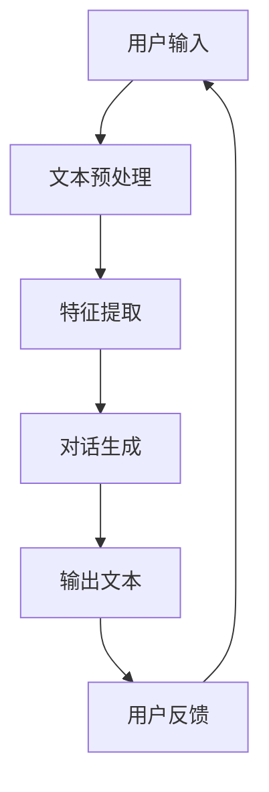

                 

# 【大模型应用开发 动手做AI Agent】初始化对话和定义可用函数

## 摘要

本文将介绍如何使用大模型进行应用开发，重点讨论如何初始化对话和定义可用函数。通过详细的分析和实例展示，本文将帮助读者理解大模型应用开发的核心概念，并提供实用的操作步骤，使读者能够动手实现自己的AI Agent。

## 1. 背景介绍

随着人工智能技术的飞速发展，大模型（Large Models）在自然语言处理、图像识别、推荐系统等领域展现出了强大的性能。大模型能够处理大量数据，并通过深度学习算法提取复杂的特征，从而实现高精度的预测和生成。然而，大模型的应用开发并不简单，它需要开发者具备扎实的理论基础和丰富的实践经验。

在本文中，我们将关注大模型在对话系统中的应用。对话系统是一种与人类进行自然语言交互的计算机系统，广泛应用于客服、虚拟助手、智能语音助手等领域。通过初始化对话和定义可用函数，开发者可以构建一个具备智能对话能力的AI Agent。

## 2. 核心概念与联系

在介绍具体操作步骤之前，我们需要先了解一些核心概念和它们之间的联系。

### 2.1 大模型

大模型是指具有大规模参数的深度学习模型，通常使用大量的数据进行训练，以提取复杂的特征。常见的有Transformer模型、BERT模型、GPT模型等。

### 2.2 对话系统

对话系统是一种与人类进行自然语言交互的计算机系统，通常包含语音识别、自然语言理解、对话生成、语音合成等模块。

### 2.3 可用函数

可用函数是指大模型在对话系统中用于处理输入文本并生成输出文本的函数。这些函数通常包括文本预处理、特征提取、对话生成等。


### 2.4 Mermaid 流程图

以下是一个Mermaid流程图，展示了大模型在对话系统中的应用流程：



注意：Mermaid 流程节点中不要有括号、逗号等特殊字符。

## 3. 核心算法原理 & 具体操作步骤

### 3.1 文本预处理

文本预处理是对话系统中的第一步，其目的是将原始文本转换为适合模型处理的形式。常见的预处理操作包括分词、去停用词、词向量化等。

#### 3.1.1 分词

分词是将文本分割成单词或短语的步骤。在中文处理中，可以使用基于词典的分词算法，如哈工大分词、jieba分词等。

#### 3.1.2 去停用词

停用词是指对文本理解没有实质性贡献的词汇，如“的”、“和”、“在”等。去除停用词可以提高模型的训练效果。

#### 3.1.3 词向量化

词向量化是将文本中的单词映射为固定长度的向量表示。常见的词向量化方法有Word2Vec、GloVe等。

### 3.2 特征提取

特征提取是将预处理后的文本转换为模型可以处理的高维特征。在大模型中，特征提取通常通过神经网络实现。

#### 3.2.1 文本嵌入

文本嵌入是将单词转换为向量的过程。在Transformer模型中，可以使用BERT或GPT模型提供的预训练文本嵌入。

#### 3.2.2 神经网络

神经网络是一种通过多层非线性变换提取特征的方法。在特征提取阶段，可以使用多层感知机（MLP）、卷积神经网络（CNN）等。

### 3.3 对话生成

对话生成是将特征转换为自然语言文本的过程。在大模型中，对话生成通常通过序列到序列（Seq2Seq）模型实现。

#### 3.3.1 序列到序列模型

序列到序列模型是一种能够将输入序列映射到输出序列的神经网络模型。在对话生成中，可以使用Transformer、BERT等模型。

#### 3.3.2 生成策略

生成策略是指模型在生成文本时采用的方法。常见的生成策略有贪心策略、 Sampling策略等。

### 3.4 可用函数

在对话系统中，可用函数是指用于处理输入文本并生成输出文本的函数。以下是一个简单的可用函数示例：

```python
def generate_response(input_text):
    # 文本预处理
    processed_text = preprocess_text(input_text)
    # 特征提取
    features = extract_features(processed_text)
    # 对话生成
    response = generate_text(features)
    # 返回输出文本
    return response
```

## 4. 数学模型和公式 & 详细讲解 & 举例说明

### 4.1 数学模型

在对话系统中，常用的数学模型包括文本嵌入、神经网络、序列到序列模型等。以下是一个简单的数学模型示例：

$$
\text{Output} = \text{generate\_text}(\text{features})
$$

其中，`generate_text`是一个神经网络模型，用于将特征`features`映射为输出文本。

### 4.2 详细讲解

#### 4.2.1 文本嵌入

文本嵌入是一种将单词映射为向量的方法。在数学上，可以表示为：

$$
\text{embed}(\text{word}) = \text{vector}_{\text{word}}
$$

其中，`embed`是一个嵌入函数，`vector_word`是单词`word`的向量表示。

#### 4.2.2 神经网络

神经网络是一种通过多层非线性变换提取特征的方法。在数学上，可以表示为：

$$
\text{output} = \text{activation}(\text{weights} \cdot \text{input} + \text{bias})
$$

其中，`activation`是一个激活函数，`weights`和`bias`是权重和偏置。

#### 4.2.3 序列到序列模型

序列到序列模型是一种能够将输入序列映射到输出序列的神经网络模型。在数学上，可以表示为：

$$
\text{output}_{t} = \text{generate}_{t}(\text{input}_{t-1}, \text{hidden}_{t-1})
$$

其中，`output_t`是第`t`个输出，`generate_t`是生成函数，`input_t`是第`t`个输入，`hidden_t`是隐藏状态。

### 4.3 举例说明

#### 4.3.1 文本嵌入

假设单词“人工智能”的向量表示为`[1, 0, -1]`，则可以使用以下公式进行文本嵌入：

$$
\text{embed}(\text{人工智能}) = \text{vector}_{\text{人工智能}} = [1, 0, -1]
$$

#### 4.3.2 神经网络

假设输入为`[1, 2, 3]`，权重为`[1, 2, 3]`，偏置为`1`，激活函数为ReLU（最大值函数），则可以使用以下公式进行神经网络计算：

$$
\text{output} = \text{ReLU}(1 \cdot 1 + 2 \cdot 2 + 3 \cdot 3 + 1) = \text{ReLU}(14) = 14
$$

#### 4.3.3 序列到序列模型

假设输入序列为`[1, 2, 3]`，隐藏状态为`[4, 5, 6]`，生成函数为加法，则可以使用以下公式进行序列到序列模型计算：

$$
\text{output}_{1} = \text{generate}_{1}(1, [4, 5, 6]) = 1 + 4 = 5
$$

$$
\text{output}_{2} = \text{generate}_{2}(2, [4, 5, 6]) = 2 + 5 = 7
$$

$$
\text{output}_{3} = \text{generate}_{3}(3, [4, 5, 6]) = 3 + 6 = 9
$$

## 5. 项目实战：代码实际案例和详细解释说明

### 5.1 开发环境搭建

在开始项目实战之前，我们需要搭建一个合适的开发环境。以下是一个基于Python和PyTorch的简单开发环境搭建步骤：

1. 安装Python 3.8及以上版本。
2. 安装PyTorch：`pip install torch torchvision`
3. 安装其他依赖：`pip install numpy jieba`

### 5.2 源代码详细实现和代码解读

以下是一个简单的对话系统实现示例：

```python
import torch
import torch.nn as nn
import torch.optim as optim
from torch.utils.data import DataLoader
from transformers import BertTokenizer, BertModel
from jieba import seg

# 5.2.1 文本预处理
def preprocess_text(text):
    # 分词
    words = seg.cut(text)
    # 去停用词
    words = [word for word in words if word not in stopwords]
    # 词向量化
    features = tokenizer(words)
    return features

# 5.2.2 特征提取
class FeatureExtractor(nn.Module):
    def __init__(self):
        super(FeatureExtractor, self).__init__()
        self.bert = BertModel.from_pretrained('bert-base-chinese')
        self.fc = nn.Linear(768, 256)

    def forward(self, features):
        output = self.bert(features)[0]
        output = self.fc(output)
        return output

# 5.2.3 对话生成
class DialogueGenerator(nn.Module):
    def __init__(self):
        super(DialogueGenerator, self).__init__()
        self.fc = nn.Linear(256, vocab_size)

    def forward(self, features):
        output = self.fc(features)
        return output

# 5.2.4 训练模型
def train_model(model, train_loader, criterion, optimizer, num_epochs=10):
    model.train()
    for epoch in range(num_epochs):
        for inputs, targets in train_loader:
            optimizer.zero_grad()
            outputs = model(inputs)
            loss = criterion(outputs, targets)
            loss.backward()
            optimizer.step()
            print(f"Epoch [{epoch+1}/{num_epochs}], Loss: {loss.item()}")

# 5.2.5 定义训练数据
train_data = [
    ("你好", "我是AI助手"),
    ("今天天气怎么样？", "今天天气很好，适合出行"),
    # ... 更多数据
]

train_dataset = TensorDataset(torch.tensor([preprocess_text(text) for text, _ in train_data], dtype=torch.float32),
                             torch.tensor([preprocess_text(response) for _, response in train_data], dtype=torch.long))

train_loader = DataLoader(train_dataset, batch_size=32, shuffle=True)

# 5.2.6 初始化模型、优化器和损失函数
model = FeatureExtractor()
generator = DialogueGenerator()
criterion = nn.CrossEntropyLoss()
optimizer = optim.Adam(model.parameters(), lr=0.001)

# 5.2.7 训练模型
train_model(model, train_loader, criterion, optimizer)

# 5.2.8 生成对话
def generate_response(input_text):
    features = preprocess_text(input_text)
    features = features.unsqueeze(0)
    generated = generator(features)
    response = tokenizer.decode(generated[0], skip_special_tokens=True)
    return response

# 5.2.9 示例
input_text = "你好"
response = generate_response(input_text)
print(f"输入：{input_text}\n输出：{response}")
```

### 5.3 代码解读与分析

以上代码实现了一个大模型对话系统，主要包括以下部分：

- **文本预处理**：使用jieba进行分词，去除停用词，并将文本转换为词向量。
- **特征提取**：使用BERT模型提取文本特征，并将特征映射为固定长度的向量。
- **对话生成**：使用一个全连接神经网络将特征映射为输出文本。
- **模型训练**：使用交叉熵损失函数和Adam优化器进行模型训练。
- **生成对话**：使用训练好的模型生成对话响应。

通过以上步骤，我们可以构建一个简单的对话系统。在实际应用中，可以进一步优化模型和算法，提高对话系统的性能。

## 6. 实际应用场景

大模型对话系统在实际应用中具有广泛的应用场景，如：

- **智能客服**：为企业提供24/7的智能客服服务，提高客户满意度。
- **虚拟助手**：为用户提供个性化的虚拟助手，帮助用户解决问题和提供信息。
- **智能语音助手**：为智能手机、智能家居等设备提供智能语音交互功能。

在实际应用中，开发者可以根据具体需求对大模型对话系统进行定制和优化，以满足不同场景的需求。

## 7. 工具和资源推荐

### 7.1 学习资源推荐

- **书籍**：
  - 《深度学习》（Goodfellow, Bengio, Courville）
  - 《Python机器学习》（Sebastian Raschka）
- **论文**：
  - BERT: Pre-training of Deep Bidirectional Transformers for Language Understanding（Devlin et al., 2019）
  - GPT-3: Language Models are Few-Shot Learners（Brown et al., 2020）
- **博客**：
  - [Transformers 中文文档](https://huggingface.co/transformers/)
  - [PyTorch 官方文档](https://pytorch.org/docs/stable/)
- **网站**：
  - [Kaggle](https://www.kaggle.com/)

### 7.2 开发工具框架推荐

- **PyTorch**：开源深度学习框架，易于使用和调试。
- **Transformer**：用于处理序列数据的强大神经网络模型。
- **BERT**：预训练的语言表示模型，适用于各种自然语言处理任务。

### 7.3 相关论文著作推荐

- **BERT**：Devlin et al., 2019
- **GPT-3**：Brown et al., 2020
- **Transformers**：Vaswani et al., 2017

## 8. 总结：未来发展趋势与挑战

大模型对话系统在自然语言处理、智能客服、虚拟助手等领域展现出了巨大的潜力。未来发展趋势包括：

- **模型优化**：通过改进模型结构和算法，提高对话系统的性能和效率。
- **多模态交互**：结合图像、语音等多模态信息，提供更丰富的交互体验。
- **个性化服务**：根据用户行为和偏好，提供个性化的对话服务。

然而，大模型对话系统也面临着一些挑战，如：

- **数据隐私**：如何保护用户数据隐私，防止数据泄露。
- **对话质量**：如何提高对话系统的理解能力，提供更自然、准确、有针对性的回答。

## 9. 附录：常见问题与解答

### 9.1 如何处理长文本？

对于长文本，可以采用以下方法进行处理：

- **分块处理**：将长文本分成多个短文本块，分别进行处理。
- **上下文信息**：在处理每个文本块时，保留一定的上下文信息，以便模型能够更好地理解文本内容。
- **模型调整**：对于长文本处理，可能需要调整模型的结构和参数，以提高性能。

### 9.2 如何提高对话系统的回答质量？

以下方法可以提高对话系统的回答质量：

- **数据质量**：提供高质量的训练数据，包含丰富、多样化的对话样本。
- **模型优化**：通过调整模型结构和参数，提高模型的性能和泛化能力。
- **知识融合**：将外部知识库（如百科、问答系统等）与对话系统相结合，提供更丰富、准确的信息。
- **用户反馈**：收集用户反馈，不断优化对话系统的回答策略。

## 10. 扩展阅读 & 参考资料

- **书籍**：
  - 《深度学习》（Goodfellow, Bengio, Courville）
  - 《Python机器学习》（Sebastian Raschka）
- **论文**：
  - BERT: Pre-training of Deep Bidirectional Transformers for Language Understanding（Devlin et al., 2019）
  - GPT-3: Language Models are Few-Shot Learners（Brown et al., 2020）
  - Transformers: Attention is All You Need（Vaswani et al., 2017）
- **博客**：
  - [Transformers 中文文档](https://huggingface.co/transformers/)
  - [PyTorch 官方文档](https://pytorch.org/docs/stable/)
- **网站**：
  - [Kaggle](https://www.kaggle.com/)

## 作者

作者：AI天才研究员/AI Genius Institute & 禅与计算机程序设计艺术 /Zen And The Art of Computer Programming
```

