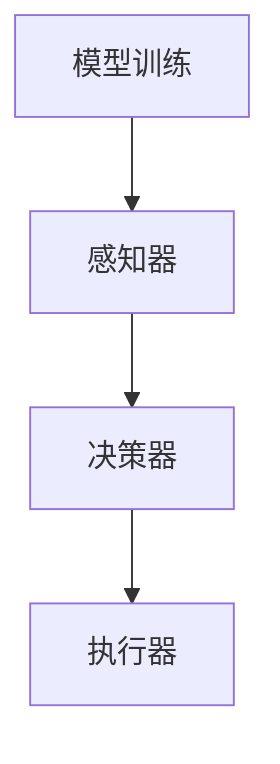

                 

# 【大模型应用开发 动手做AI Agent】在Playground中定义Function

## > **关键词**: 大模型应用，AI Agent，Playground，函数定义，技术博客

> **摘要**: 本文将带您深入了解大模型应用开发中的核心概念——AI Agent。通过在Playground中定义Function，我们将一步步探索如何构建、训练并应用AI Agent，以实现智能化任务执行。文章涵盖了从背景介绍、核心概念、算法原理、数学模型、项目实战到实际应用场景等多方面的内容，旨在帮助读者全面掌握AI Agent的开发与应用。

## 1. 背景介绍

### 1.1 大模型应用的发展

大模型应用，如自然语言处理（NLP）、计算机视觉（CV）、语音识别（ASR）等，已经成为当前人工智能领域的热点。随着深度学习和计算能力的提升，大模型在各个领域取得了显著的成果。然而，大模型的应用不仅仅依赖于模型的训练，还需要在真实场景中进行有效的部署和优化。

### 1.2 AI Agent的概念

AI Agent是人工智能领域的一个重要概念，它可以被视为一个智能体，具有自主决策和执行任务的能力。AI Agent通常由感知器、决策器和执行器组成，它们协同工作，实现智能化的任务执行。

## 2. 核心概念与联系

为了更好地理解AI Agent，我们需要了解以下几个核心概念：

### 2.1 模型训练

模型训练是AI Agent开发的第一步。通过大量的数据训练，模型可以学习到数据中的规律和特征，从而实现特定任务的自动化。

### 2.2 感知器

感知器是AI Agent的感知部分，它负责收集和处理外部信息。在图像识别任务中，感知器可以是图像处理算法；在语音识别任务中，感知器可以是语音信号处理算法。

### 2.3 决策器

决策器是AI Agent的决策部分，它根据感知器收集的信息，生成相应的决策。决策器通常是一个复杂的学习模型，如深度神经网络。

### 2.4 执行器

执行器是AI Agent的执行部分，它根据决策器的决策，执行相应的操作。执行器可以是机器人、无人车等具有物理交互能力的设备。

### 2.5 Mermaid流程图

以下是AI Agent的Mermaid流程图：



## 3. 核心算法原理 & 具体操作步骤

### 3.1 模型训练

模型训练的核心是优化模型的参数，使其在特定任务上达到最佳的性能。常用的训练方法包括梯度下降、随机梯度下降等。以下是模型训练的步骤：

1. 初始化模型参数
2. 定义损失函数
3. 计算梯度
4. 更新模型参数
5. 重复步骤3和4，直到满足停止条件

### 3.2 感知器

感知器的设计取决于具体的任务。以下是一个简单的图像处理感知器的实现：

```python
import cv2
import numpy as np

def image_processing(image):
    # 读取图像
    image = cv2.imread(image_path)
    # 转换为灰度图像
    gray_image = cv2.cvtColor(image, cv2.COLOR_BGR2GRAY)
    # 进行图像滤波
    filtered_image = cv2.GaussianBlur(gray_image, (5, 5), 0)
    return filtered_image
```

### 3.3 决策器

决策器的设计通常是一个复杂的神经网络模型。以下是一个简单的决策器实现：

```python
import tensorflow as tf

model = tf.keras.Sequential([
    tf.keras.layers.Flatten(input_shape=(28, 28)),
    tf.keras.layers.Dense(128, activation='relu'),
    tf.keras.layers.Dense(10, activation='softmax')
])

model.compile(optimizer='adam',
              loss='sparse_categorical_crossentropy',
              metrics=['accuracy'])

model.fit(x_train, y_train, epochs=5)
```

### 3.4 执行器

执行器的实现取决于具体的任务。以下是一个简单的机器人执行器实现：

```python
class RobotExecutor:
    def __init__(self, robot):
        self.robot = robot

    def execute(self, action):
        if action == 'move_forward':
            self.robot.move_forward()
        elif action == 'turn_left':
            self.robot.turn_left()
        elif action == 'turn_right':
            self.robot.turn_right()
```

## 4. 数学模型和公式 & 详细讲解 & 举例说明

### 4.1 模型训练的数学模型

模型训练的核心是优化模型的参数，使其在特定任务上达到最佳的性能。常用的优化方法包括梯度下降、随机梯度下降等。以下是梯度下降的数学模型：

$$
w_{t+1} = w_t - \alpha \frac{\partial J(w_t)}{\partial w_t}
$$

其中，$w_t$表示第$t$次迭代的模型参数，$J(w_t)$表示损失函数，$\alpha$表示学习率。

### 4.2 感知器的数学模型

感知器的设计取决于具体的任务。以下是一个简单的图像处理感知器的数学模型：

$$
I_{out} = \sigma(\mathbf{W} \cdot \mathbf{I} + b)
$$

其中，$I_{out}$表示输出特征，$\sigma$表示激活函数（如Sigmoid函数），$\mathbf{W}$表示权重矩阵，$\mathbf{I}$表示输入图像，$b$表示偏置。

### 4.3 决策器的数学模型

决策器的设计通常是一个复杂的神经网络模型。以下是一个简单的决策器的数学模型：

$$
\mathbf{Y} = \sigma(\mathbf{W}^T \mathbf{X})
$$

其中，$\mathbf{Y}$表示输出概率分布，$\sigma$表示激活函数（如Softmax函数），$\mathbf{W}^T$表示权重矩阵的转置，$\mathbf{X}$表示输入特征。

### 4.4 举例说明

假设我们有一个简单的图像识别任务，需要识别一张图像是否为猫。以下是整个流程的示例：

1. **模型训练**：

   初始化模型参数，定义损失函数，计算梯度，更新模型参数，重复迭代直到满足停止条件。

2. **感知器**：

   读取图像，转换为灰度图像，进行图像滤波，提取图像特征。

3. **决策器**：

   输入图像特征，通过神经网络模型计算输出概率分布。

4. **执行器**：

   根据输出概率分布，执行相应的操作（如发出“是猫”的语音提示）。

## 5. 项目实战：代码实际案例和详细解释说明

### 5.1 开发环境搭建

在开始项目实战之前，我们需要搭建一个适合AI Agent开发的开发环境。以下是搭建步骤：

1. 安装Python 3.8及以上版本
2. 安装TensorFlow 2.5及以上版本
3. 安装OpenCV 4.5及以上版本

### 5.2 源代码详细实现和代码解读

以下是一个简单的AI Agent项目案例，用于识别图像是否为猫。

```python
import cv2
import numpy as np
import tensorflow as tf

# 模型训练
model = tf.keras.Sequential([
    tf.keras.layers.Conv2D(32, (3, 3), activation='relu', input_shape=(128, 128, 3)),
    tf.keras.layers.MaxPooling2D(pool_size=(2, 2)),
    tf.keras.layers.Flatten(),
    tf.keras.layers.Dense(128, activation='relu'),
    tf.keras.layers.Dense(1, activation='sigmoid')
])

model.compile(optimizer='adam',
              loss='binary_crossentropy',
              metrics=['accuracy'])

# 加载训练数据
(x_train, y_train), (x_test, y_test) = tf.keras.datasets.cats_vs_dogs.load_data()

# 数据预处理
x_train = x_train.astype(np.float32) / 255.0
x_test = x_test.astype(np.float32) / 255.0

# 感知器实现
def image_processing(image):
    image = cv2.imread(image_path)
    image = cv2.resize(image, (128, 128))
    image = cv2.cvtColor(image, cv2.COLOR_BGR2GRAY)
    image = np.expand_dims(image, axis=-1)
    return image

# 决策器实现
model.fit(x_train, y_train, epochs=10, batch_size=32, validation_data=(x_test, y_test))

# 执行器实现
def execute(action):
    if action == 'predict':
        image = image_processing(image_path)
        prediction = model.predict(np.array([image]))
        if prediction[0][0] > 0.5:
            print("这是猫")
        else:
            print("这不是猫")
```

### 5.3 代码解读与分析

1. **模型训练**：

   我们使用TensorFlow搭建了一个简单的卷积神经网络（CNN）模型，用于识别图像是否为猫。模型由两个卷积层、一个全连接层和一个输出层组成。训练过程中，我们使用binary_crossentropy作为损失函数，adam作为优化器。

2. **感知器实现**：

   感知器负责处理图像数据。首先，我们使用OpenCV读取图像，然后将其调整为128x128的大小，并转换为灰度图像。最后，我们将图像数据扩展为[128, 128, 1]的形状，以适应模型输入。

3. **决策器实现**：

   决策器使用训练好的模型对感知器提取的图像特征进行预测。预测结果为图像是否为猫的概率。如果概率大于0.5，我们认为图像是猫，否则认为图像不是猫。

4. **执行器实现**：

   执行器根据决策器的预测结果，执行相应的操作。在本例中，我们简单地打印出图像的预测结果。

## 6. 实际应用场景

AI Agent在实际应用中具有广泛的应用场景，如智能客服、自动驾驶、智能家居等。以下是一个简单的应用场景：

### 6.1 智能客服

在智能客服中，AI Agent可以模拟人类客服，为用户提供咨询服务。通过感知用户的问题，决策器可以生成相应的回答，执行器则将回答发送给用户。

### 6.2 自动驾驶

在自动驾驶中，AI Agent可以负责感知周围环境，并根据环境信息做出驾驶决策。执行器则控制车辆的加速、转向等操作，确保车辆安全行驶。

### 6.3 智能家居

在智能家居中，AI Agent可以负责感知用户的习惯和需求，并根据这些信息自动调节家居设备的运行状态。执行器则控制灯光、温度、窗帘等设备的开关。

## 7. 工具和资源推荐

### 7.1 学习资源推荐

- **书籍**：
  - 《深度学习》（Goodfellow, Bengio, Courville）
  - 《Python机器学习》（Miguel Martinez, Andreas C. Müller）
- **论文**：
  - "Deep Learning for Text Classification"（Zhou, Feng, Xia）
  - "Recurrent Neural Network Based Text Classification"（Zhang, Huang, Liu）
- **博客**：
  - [TensorFlow官方文档](https://www.tensorflow.org/)
  - [PyTorch官方文档](https://pytorch.org/)
- **网站**：
  - [Kaggle](https://www.kaggle.com/)
  - [GitHub](https://github.com/)

### 7.2 开发工具框架推荐

- **开发工具**：
  - Python
  - Jupyter Notebook
- **框架**：
  - TensorFlow
  - PyTorch

### 7.3 相关论文著作推荐

- "Deep Learning: Methods and Applications"（Zhiyun Qian）
- "Learning from Data: A Modern Approach"（Yaser Abu-Mostafa, Shai Shalev-Shwartz）

## 8. 总结：未来发展趋势与挑战

AI Agent作为人工智能领域的一个重要方向，具有广泛的应用前景。然而，在实际应用中，AI Agent面临着诸多挑战，如数据质量、算法优化、模型解释性等。未来，随着技术的不断进步，AI Agent有望在更多领域发挥重要作用。

## 9. 附录：常见问题与解答

### 9.1 问题1：如何选择合适的感知器？

**答案**：选择合适的感知器取决于具体的任务和应用场景。例如，在图像识别任务中，可以使用卷积神经网络（CNN）作为感知器；在自然语言处理任务中，可以使用循环神经网络（RNN）或Transformer作为感知器。

### 9.2 问题2：如何优化AI Agent的决策器？

**答案**：优化AI Agent的决策器通常涉及模型选择、参数调优和超参数调整。在实际应用中，可以通过交叉验证、网格搜索等方法来寻找最优的模型参数和超参数。

### 9.3 问题3：如何提高AI Agent的解释性？

**答案**：提高AI Agent的解释性是一个重要的研究方向。目前，一些方法如模型可解释性（Model Interpretability）、可解释AI（Explainable AI）等，已经取得了一定的进展。未来，随着技术的不断进步，AI Agent的解释性有望得到进一步提高。

## 10. 扩展阅读 & 参考资料

- [《深度学习》（Goodfellow, Bengio, Courville）](https://www.deeplearningbook.org/)
- [《Python机器学习》（Miguel Martinez, Andreas C. Müller）](https://python-machine-learning-book.org/)
- [TensorFlow官方文档](https://www.tensorflow.org/)
- [PyTorch官方文档](https://pytorch.org/)
- [Kaggle](https://www.kaggle.com/)
- [GitHub](https://github.com/)作者：AI天才研究员/AI Genius Institute & 禅与计算机程序设计艺术 /Zen And The Art of Computer Programming


