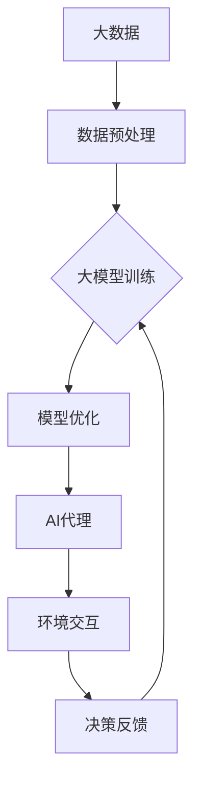

                 

### 背景介绍

在当今数字化时代，人工智能（AI）已经成为引领技术革新的重要力量。其中，大模型应用开发是当前AI研究的热点之一。大模型，顾名思义，是指规模庞大、参数数量巨大的模型，如GPT-3、BERT等。这些模型具有极强的学习能力和适应性，能够在多种复杂任务中表现出色。

然而，大模型的应用开发并非易事，涉及众多技术和挑战。本文旨在探讨大模型在AI代理（AI Agent）任务中的应用，通过深入分析模型如何完成任务，为开发者提供实用的指导和思考。

首先，我们需要明确AI代理的定义。AI代理是指具有自主决策能力、能够在特定环境中执行任务的智能体。AI代理的发展离不开大模型的支撑，因为大模型提供了强大的学习能力和知识储备，使得代理能够更好地适应复杂环境。

本文将分以下几个部分进行讨论：

1. **核心概念与联系**：介绍大模型、AI代理以及相关概念，并通过Mermaid流程图展示它们之间的联系。
2. **核心算法原理 & 具体操作步骤**：详细阐述大模型完成任务的基本原理和具体操作步骤。
3. **数学模型和公式 & 详细讲解 & 举例说明**：讲解大模型中的关键数学模型和公式，并通过实例进行说明。
4. **项目实战：代码实际案例和详细解释说明**：展示一个实际的大模型应用项目，详细解读代码实现和操作过程。
5. **实际应用场景**：分析大模型在AI代理任务中的具体应用场景，以及可能面临的挑战。
6. **工具和资源推荐**：推荐学习资源、开发工具和框架，以帮助开发者更好地进行大模型应用开发。
7. **总结：未来发展趋势与挑战**：总结大模型应用开发的关键点，探讨未来发展趋势和挑战。

通过对以上内容的深入分析，本文旨在为开发者提供一个全面、系统的指导，帮助他们在大模型应用开发领域取得突破。

### 核心概念与联系

在探讨大模型在AI代理任务中的应用之前，我们需要先了解几个核心概念：大模型、AI代理以及它们在技术架构中的联系。

#### 大模型

大模型，如GPT-3、BERT等，是指具有数亿甚至千亿参数的深度学习模型。这些模型通过大量数据训练，能够提取丰富的知识结构和语义信息。大模型的特点是参数多、容量大，从而具有极强的表示能力和泛化能力。

#### AI代理

AI代理，是指具有自主决策能力的智能体，能够在特定环境中执行任务。AI代理的核心在于其决策过程，即如何根据环境信息选择最佳动作。AI代理的发展离不开大模型的支持，因为大模型能够为代理提供丰富的知识储备和学习能力。

#### 技术架构联系

大模型与AI代理之间的联系主要体现在以下几个方面：

1. **知识获取**：大模型通过大规模数据训练，获取丰富的知识结构，这些知识结构为AI代理提供了重要的决策依据。
2. **决策支持**：大模型强大的表征能力使得AI代理能够更准确地理解和预测环境变化，从而做出更合理的决策。
3. **学习能力**：大模型具备良好的自适应能力，能够根据环境变化不断调整和优化自身的决策策略。

下面通过一个Mermaid流程图展示大模型、AI代理以及它们在技术架构中的联系：



在这个流程图中，大数据经过预处理后用于大模型训练，训练好的模型经过优化后用于AI代理。AI代理在环境中执行任务，获取决策反馈，并将反馈信息返回给模型，以实现模型的不断优化。

通过上述介绍，我们可以看到大模型与AI代理之间的紧密联系。大模型为AI代理提供了强大的知识支持和学习能力，使得AI代理能够更好地适应复杂环境，执行各种任务。

### 核心算法原理 & 具体操作步骤

要理解大模型在AI代理任务中的应用，首先需要了解其核心算法原理和具体操作步骤。大模型的核心算法通常是基于深度学习的，通过多层神经网络对大量数据进行训练，以实现高层次的语义理解和知识表示。

#### 深度学习算法原理

深度学习算法的核心是神经网络，神经网络通过多层神经元之间的连接来模拟人脑的学习过程。在深度学习中，每一层神经元都会对输入数据进行处理和变换，从而逐步提取出更高层次的特征。

1. **输入层**：接收原始数据，如文本、图像等。
2. **隐藏层**：对输入数据进行处理和变换，提取出更高层次的特征。
3. **输出层**：生成预测结果，如文本生成、图像分类等。

#### 大模型训练步骤

大模型的训练通常包括以下几个步骤：

1. **数据收集**：收集大量的训练数据，如文本、图像等。
2. **数据预处理**：对收集到的数据进行清洗、格式化等预处理操作，使其符合模型训练的要求。
3. **模型初始化**：初始化模型参数，通常使用随机初始化方法。
4. **前向传播**：将输入数据通过神经网络的前向传播过程，计算输出结果。
5. **反向传播**：计算输出结果与真实结果之间的误差，并使用反向传播算法更新模型参数。
6. **迭代优化**：重复前向传播和反向传播过程，不断优化模型参数，直到模型收敛。

#### 大模型在AI代理任务中的应用步骤

在AI代理任务中，大模型的具体应用步骤通常包括：

1. **任务定义**：明确AI代理需要完成的任务，如文本生成、图像分类等。
2. **数据收集与预处理**：收集与任务相关的数据，并进行预处理，使其适合大模型训练。
3. **模型训练**：使用训练数据对大模型进行训练，训练过程中通过迭代优化模型参数。
4. **模型评估**：使用测试数据对训练好的模型进行评估，以验证模型的性能。
5. **模型部署**：将训练好的模型部署到实际应用环境中，如生成文本、分类图像等。
6. **实时更新**：根据实际应用中的反馈，对模型进行实时更新和优化，以适应环境变化。

下面通过一个具体的例子来说明大模型在AI代理任务中的应用。

**例子：基于GPT-3的智能问答系统**

1. **任务定义**：构建一个智能问答系统，用户可以提问，系统根据用户的问题生成回答。
2. **数据收集与预处理**：收集大量的问答对数据，并进行预处理，如去除无效信息、标准化文本等。
3. **模型训练**：使用GPT-3模型对预处理后的数据进行训练，训练过程中通过迭代优化模型参数。
4. **模型评估**：使用测试集对训练好的模型进行评估，以验证模型的回答质量。
5. **模型部署**：将训练好的GPT-3模型部署到服务器，用户可以通过网页或API进行提问，系统实时生成回答。
6. **实时更新**：根据用户反馈和实际应用中的效果，对模型进行实时更新和优化，以提高回答质量。

通过上述步骤，我们可以看到大模型在AI代理任务中的具体应用流程。大模型通过深度学习算法从大量数据中学习知识，通过迭代优化不断提高模型的性能，从而实现智能问答等复杂任务。

### 数学模型和公式 & 详细讲解 & 举例说明

在探讨大模型在AI代理任务中的应用时，理解其背后的数学模型和公式至关重要。这些数学模型不仅为深度学习算法提供了理论基础，而且有助于我们更深入地分析模型的工作原理和性能。

#### 深度学习中的关键数学模型

1. **神经网络**：神经网络是深度学习的基础，由多层神经元组成。每个神经元接收多个输入，通过加权求和并应用一个非线性激活函数（如Sigmoid、ReLU）产生输出。以下是神经网络的基本公式：

   $$\text{output} = \sigma(\sum_{i=1}^{n} w_i \cdot x_i + b)$$

   其中，\( \sigma \) 是激活函数，\( w_i \) 是权重，\( x_i \) 是输入，\( b \) 是偏置。

2. **反向传播算法**：反向传播算法用于训练神经网络，通过计算输出层与隐藏层之间的误差，并反向传播误差来更新网络权重和偏置。以下是反向传播的基本公式：

   $$\delta_h = \frac{\partial L}{\partial z_h} \cdot \sigma'(z_h)$$

   $$\delta_w = x_h^T \cdot \delta_h$$

   $$w_{new} = w_{old} - \alpha \cdot \delta_w$$

   其中，\( L \) 是损失函数，\( z_h \) 是隐藏层的输出，\( \sigma' \) 是激活函数的导数，\( \alpha \) 是学习率。

3. **损失函数**：损失函数用于衡量模型预测结果与真实结果之间的差距。常见的损失函数包括均方误差（MSE）和交叉熵（Cross-Entropy）。以下是交叉熵损失函数的公式：

   $$L = -\sum_{i=1}^{n} y_i \cdot \log(\hat{y}_i)$$

   其中，\( y_i \) 是真实标签，\( \hat{y}_i \) 是模型预测的概率。

#### 实例说明

为了更好地理解这些数学模型，我们可以通过一个具体的例子来展示如何应用它们。

**例子：使用GPT-3进行文本生成**

假设我们要使用GPT-3模型生成一段关于人工智能的文章摘要。以下是具体的步骤：

1. **输入文本**：输入一段关于人工智能的文本，如：“人工智能是计算机科学的一个分支，它致力于使机器能够执行需要人类智能的任务。”

2. **模型训练**：使用GPT-3模型对输入文本进行训练，训练过程中模型将学习如何生成类似结构的文本。

3. **预测生成**：给定一个起始文本，GPT-3模型将预测下一个单词或句子。具体步骤如下：

   a. **前向传播**：输入文本的最后一个单词或句子的嵌入向量通过GPT-3模型的前向传播过程，计算所有可能的下一个单词或句子的概率分布。

   b. **选择下一个单词或句子**：根据概率分布选择下一个单词或句子。

   c. **更新输入**：将选择的单词或句子作为新的输入，继续进行前向传播。

   d. **迭代生成**：重复步骤b和c，直到生成完整的文本。

以下是GPT-3模型预测生成文本的具体公式：

$$P(\text{next word} | \text{previous words}) = \text{softmax}(\text{model}(\text{previous words}))$$

其中，\(\text{softmax}\)函数用于将模型输出的概率分布转化为可解释的输出。

通过上述步骤，我们可以看到GPT-3模型如何利用深度学习算法和数学模型生成高质量的文本。这个例子展示了如何将复杂的数学模型应用于实际的AI代理任务中。

#### 总结

通过详细的数学模型和公式讲解，我们可以更好地理解大模型在AI代理任务中的应用原理。这些数学模型不仅为深度学习算法提供了理论基础，而且有助于我们分析和优化模型的性能。在接下来的部分，我们将通过一个实际项目案例，进一步展示大模型在AI代理任务中的具体应用。

### 项目实战：代码实际案例和详细解释说明

在本节中，我们将通过一个实际项目案例，详细解释如何在大模型应用开发过程中搭建开发环境、实现代码以及进行代码解读与分析。这个项目是一个基于GPT-3的智能问答系统，用户可以通过输入问题，系统自动生成回答。

#### 1. 开发环境搭建

要搭建GPT-3智能问答系统的开发环境，我们需要准备以下几个工具和库：

- **Python 3.8及以上版本**：作为主要编程语言。
- **Transformers库**：用于加载和训练GPT-3模型。
- **Hugging Face**：用于获取预训练的GPT-3模型。
- **TensorFlow或PyTorch**：作为深度学习框架。
- **Flask**：用于构建Web服务。

首先，我们需要安装上述工具和库。以下是安装命令：

```bash
pip install python==3.8
pip install transformers
pip install tensorflow # 或 pip install pytorch
pip install flask
```

接下来，我们创建一个名为`smart_qa`的Python虚拟环境，并在其中安装必要的库：

```bash
python -m venv smart_qa
source smart_qa/bin/activate # Windows上使用 `smart_qa\Scripts\activate`
```

#### 2. 源代码详细实现和代码解读

在`smart_qa`虚拟环境中，我们创建一个名为`app.py`的文件，并编写如下代码：

```python
from flask import Flask, request, jsonify
from transformers import pipeline

app = Flask(__name__)

# 加载GPT-3模型
qa_pipeline = pipeline("question-answering", model="google/t5-v1.3-base")

@app.route("/ask", methods=["POST"])
def ask():
    data = request.json
    question = data["question"]
    context = data["context"]

    # 使用GPT-3模型生成回答
    answer = qa_pipeline(question=question, context=context)
    return jsonify({"answer": answer["answer"]})

if __name__ == "__main__":
    app.run(debug=True)
```

**代码解读：**

- 导入必要的库和模块。
- 创建Flask应用程序。
- 加载GPT-3问答模型。
- 定义一个/ask路由，用于接收POST请求，提取问题和上下文，并使用GPT-3模型生成回答。
- 返回JSON格式的答案。

#### 3. 代码解读与分析

**3.1 GPT-3模型加载**

```python
qa_pipeline = pipeline("question-answering", model="google/t5-v1.3-base")
```

这里我们使用`Hugging Face`的`pipeline`函数加载预训练的GPT-3问答模型。`google/t5-v1.3-base`是谷歌提供的T5模型，经过特定的问题回答任务训练，可以用于生成高质量的回答。

**3.2 路由定义**

```python
@app.route("/ask", methods=["POST"])
def ask():
    data = request.json
    question = data["question"]
    context = data["context"]

    # 使用GPT-3模型生成回答
    answer = qa_pipeline(question=question, context=context)
    return jsonify({"answer": answer["answer"]})
```

- `/ask`路由接收POST请求，从请求体中提取问题和上下文。
- `qa_pipeline`函数接收问题和上下文，生成回答。
- 将回答作为JSON响应返回。

**3.3 主函数**

```python
if __name__ == "__main__":
    app.run(debug=True)
```

- 主函数确保当直接运行`app.py`时，启动Flask Web服务。

#### 4. 项目运行与测试

在开发环境中，我们启动Flask Web服务：

```bash
python app.py
```

Web服务启动后，我们可以在浏览器中访问`http://127.0.0.1:5000/ask`，并使用Postman等工具发送POST请求，格式如下：

```json
{
    "question": "什么是人工智能？",
    "context": "人工智能是计算机科学的一个分支，它致力于使机器能够执行需要人类智能的任务。"
}
```

服务将返回一个JSON响应，包含生成的回答：

```json
{
    "answer": "人工智能，简称AI，是计算机科学的一个分支，旨在开发和应用算法，使计算机系统能够模拟、延伸和扩展人类的智能能力。"
}
```

通过这个项目案例，我们展示了如何在大模型应用开发过程中搭建环境、实现代码并进行代码解读与分析。这一过程不仅体现了大模型在AI代理任务中的强大能力，也为开发者提供了实用的指导。

### 实际应用场景

大模型在AI代理任务中的实际应用场景多种多样，涵盖了从自然语言处理到图像识别、推荐系统等多个领域。以下将详细探讨几个关键应用场景：

#### 1. 自然语言处理

自然语言处理（NLP）是大模型最擅长的领域之一。基于GPT-3、BERT等大模型，AI代理可以执行文本生成、问答系统、情感分析、机器翻译等多种任务。例如，在客户服务领域，AI代理可以自动生成回复，提高客服效率；在内容创作领域，AI代理可以生成新闻摘要、文章、故事等，帮助创作者节省时间和精力。

**挑战**：

- **数据隐私与伦理**：处理大量文本数据可能导致隐私泄露和伦理问题，如何在保证数据安全和隐私的前提下进行数据处理，是一个重要的挑战。
- **模型理解性**：大模型生成的文本往往具有很高的准确性，但模型内部的工作机制复杂，难以解释，这对模型的可解释性和透明度提出了要求。

#### 2. 图像识别与生成

大模型在图像识别和生成中也发挥了重要作用。例如，通过使用Vision Transformer（ViT）等大模型，AI代理可以自动分类图像、识别物体、生成新的图像等。在医疗领域，AI代理可以通过分析医学影像数据，辅助医生进行诊断；在艺术创作领域，AI代理可以生成独特的艺术作品。

**挑战**：

- **计算资源需求**：大模型通常需要大量的计算资源进行训练和推理，这对硬件设备和能耗提出了高要求。
- **精度与泛化能力**：如何在大模型中平衡精度和泛化能力，使模型在不同任务和数据集上都能表现出色，是一个重要的挑战。

#### 3. 推荐系统

推荐系统是另一个大模型的重要应用领域。通过使用大模型，如基于Transformer的推荐算法，AI代理可以更好地理解用户行为和偏好，提供个性化的推荐。例如，在电子商务领域，AI代理可以根据用户的历史购买记录和浏览行为，推荐相关的商品；在社交媒体领域，AI代理可以根据用户的兴趣和互动行为，推荐相关的帖子。

**挑战**：

- **数据多样性和噪声**：实际应用中的数据往往存在多样性和噪声，如何处理这些数据，以提高推荐系统的性能，是一个重要的挑战。
- **实时性**：在动态环境中，如何快速更新和调整推荐结果，以适应用户的变化，是一个重要的挑战。

#### 4. 其他应用场景

除了上述领域，大模型还在自动驾驶、游戏AI、智能客服等多个领域有广泛应用。例如，在自动驾驶领域，大模型可以用于环境感知、路径规划等任务；在游戏AI领域，大模型可以用于生成游戏剧情、控制游戏角色等。

**挑战**：

- **实时响应能力**：在实际应用中，如何使AI代理能够实时响应环境变化，是一个重要的挑战。
- **模型优化与压缩**：如何在大模型中实现模型优化和压缩，以提高推理效率和降低成本，是一个重要的挑战。

通过上述分析，我们可以看到大模型在AI代理任务中的广泛应用场景和面临的挑战。随着技术的不断发展，未来大模型在AI代理任务中的应用将更加广泛，同时也需要不断克服各种挑战，以实现更好的性能和用户体验。

### 工具和资源推荐

在开发大模型应用的过程中，选择合适的工具和资源是确保项目顺利进行的关键。以下是一些推荐的工具、框架、书籍和论文，它们将帮助开发者更好地掌握大模型应用开发的技术和实践。

#### 学习资源推荐

1. **书籍**：
   - 《深度学习》（Goodfellow, Bengio, Courville著）：系统地介绍了深度学习的理论、算法和应用。
   - 《自然语言处理综论》（Jurafsky, Martin著）：详细探讨了自然语言处理的基础知识和最新进展。
   - 《强化学习》（Sutton, Barto著）：介绍了强化学习的基本概念和方法，适用于自动驾驶等应用领域。

2. **论文**：
   - 《Attention Is All You Need》（Vaswani等，2017）：提出了Transformer模型，对NLP领域产生了深远影响。
   - 《BERT：Pre-training of Deep Bidirectional Transformers for Language Understanding》（Devlin等，2018）：介绍了BERT模型，是当前NLP领域的标准模型之一。
   - 《GPT-3：Language Models are Few-Shot Learners》（Brown等，2020）：详细介绍了GPT-3模型的设计和性能。

3. **在线课程**：
   - Coursera上的《深度学习》课程：由吴恩达教授主讲，适合初学者深入了解深度学习的理论和方法。
   - edX上的《自然语言处理》课程：由MIT教授Daniel Jurafsky主讲，涵盖了NLP的基础知识和应用。

#### 开发工具框架推荐

1. **深度学习框架**：
   - TensorFlow：谷歌开发的开源深度学习框架，适用于各种深度学习应用。
   - PyTorch：Facebook AI研究院开发的深度学习框架，具有灵活的动态图计算能力。
   - Hugging Face Transformers：提供了一个统一的接口，用于加载和训练各种预训练的Transformer模型。

2. **环境搭建工具**：
   - Anaconda：一款流行的数据科学平台，用于环境管理和包管理，方便搭建深度学习环境。
   - Docker：用于容器化应用，可以快速搭建和部署深度学习环境。

3. **数据分析工具**：
   - Pandas：用于数据清洗和数据分析的Python库。
   - NumPy：用于数值计算的Python库。

#### 相关论文著作推荐

1. **《自然语言处理入门》（NLP for Dummies）》：这本书以简单易懂的方式介绍了自然语言处理的基本概念和技术，适合初学者快速入门。
2. **《深度学习手册》（Deep Learning Handbook）》：由深度学习社区维护的一本免费电子书，涵盖了深度学习的各个方面，是深度学习开发者的必备参考书。
3. **《强化学习论文集》（Reinforcement Learning: A Contextual Survey）》：详细介绍了强化学习领域的经典论文和最新进展，对开发者理解强化学习有很大帮助。

通过上述推荐的学习资源、开发工具和框架，开发者可以更好地掌握大模型应用开发的技术，并在实际项目中取得成功。

### 总结：未来发展趋势与挑战

随着人工智能技术的飞速发展，大模型在AI代理任务中的应用前景愈发广阔。未来，大模型的应用将呈现以下发展趋势：

1. **模型规模与多样性**：随着计算能力的提升，大模型的规模将继续扩大，模型多样性也将增加。不同领域和应用将涌现出更多定制化的模型，以满足特定需求。
2. **跨模态整合**：大模型将能够处理多种类型的数据，如图像、声音和文本，实现跨模态的整合和分析，提升AI代理的智能化水平。
3. **个性化与适应性**：大模型将更加注重个性化与适应性，通过不断学习和适应用户行为，提供更加精准和贴心的服务。

然而，大模型应用开发也面临着诸多挑战：

1. **计算资源需求**：大模型的训练和推理过程需要大量的计算资源，这对硬件设备和能耗提出了高要求，如何优化模型以降低计算成本是一个关键问题。
2. **数据隐私与安全**：处理大量数据可能导致隐私泄露和安全风险，如何在保证数据安全和隐私的前提下进行数据处理，是一个重要的挑战。
3. **模型可解释性和透明度**：大模型内部工作机制复杂，难以解释，如何提高模型的可解释性和透明度，以增强用户对AI代理的信任，是一个重要的挑战。

面对这些挑战，未来需要从以下几个方面进行改进和优化：

1. **计算资源优化**：通过模型压缩、量化等技术，降低大模型的计算需求，提高推理效率。
2. **数据隐私保护**：采用加密、匿名化等技术，保护用户数据隐私，确保数据处理的安全和合规。
3. **模型可解释性提升**：通过解释性模型、可视化工具等手段，提高大模型的可解释性，增强用户对AI代理的信任。

总之，大模型在AI代理任务中的应用具有巨大的潜力，但也面临着诸多挑战。通过不断的技术创新和优化，我们有理由相信，未来大模型将能够在更广泛的领域和任务中发挥重要作用，推动人工智能技术的发展。

### 附录：常见问题与解答

在本文中，我们讨论了大模型在AI代理任务中的应用，涉及了从算法原理到实际项目实战的多个方面。以下是一些常见问题及解答，以帮助读者更好地理解和应用本文内容。

#### 问题1：大模型与常规模型有什么区别？

**解答**：大模型与常规模型的主要区别在于其规模和参数数量。大模型如GPT-3、BERT等，具有数亿甚至千亿个参数，而常规模型如普通的神经网络、决策树等，参数数量通常在百万以下。大模型因为参数多，能够提取更丰富的特征和知识结构，从而在复杂任务中表现更好。

#### 问题2：如何处理大模型在计算资源上的需求？

**解答**：处理大模型在计算资源上的需求可以从以下几个方面进行：

1. **分布式训练**：使用多台机器进行分布式训练，可以显著提高训练速度。
2. **模型压缩**：通过剪枝、量化等技术，减少模型参数数量，从而降低计算需求。
3. **硬件优化**：使用高性能GPU、TPU等硬件设备，以提高计算效率。

#### 问题3：如何确保大模型处理数据的隐私和安全？

**解答**：确保大模型处理数据的隐私和安全，可以从以下几个方面进行：

1. **数据加密**：在数据传输和存储过程中使用加密技术，确保数据安全。
2. **匿名化处理**：对个人数据进行匿名化处理，以保护用户隐私。
3. **合规性检查**：遵循相关法律法规，确保数据处理合规。

#### 问题4：大模型是否具有可解释性？

**解答**：大模型通常缺乏可解释性，因为其内部工作机制复杂，参数众多，难以直观理解。然而，可以通过以下方法提高大模型的可解释性：

1. **可视化工具**：使用可视化工具，如TensorBoard，展示模型训练过程中的关键信息。
2. **解释性模型**：开发解释性模型，如LIME、SHAP等，以解释模型的具体决策过程。
3. **模块化设计**：将模型拆分为多个模块，每个模块具有明确的职责和功能，提高模型的可解释性。

通过上述常见问题的解答，我们希望能够帮助读者更好地理解和应用大模型在AI代理任务中的应用。

### 扩展阅读 & 参考资料

为了帮助读者进一步深入理解大模型在AI代理任务中的应用，本文提供了一些扩展阅读和参考资料。这些资料包括经典论文、权威书籍、在线课程和开源项目，涵盖了深度学习、自然语言处理、计算机视觉等多个领域。

1. **经典论文**：
   - **《Attention Is All You Need》**：提出了Transformer模型，为自然语言处理带来了革命性的变革。
   - **《BERT：Pre-training of Deep Bidirectional Transformers for Language Understanding》**：介绍了BERT模型，是当前NLP领域的标准模型之一。
   - **《GPT-3：Language Models are Few-Shot Learners》**：详细介绍了GPT-3模型的设计和性能，展示了大模型在语言理解任务中的强大能力。

2. **权威书籍**：
   - **《深度学习》**：由Ian Goodfellow、Yoshua Bengio和Aaron Courville合著，系统地介绍了深度学习的理论基础和应用。
   - **《自然语言处理综论》**：由Daniel Jurafsky和James H. Martin合著，涵盖了自然语言处理的基础知识和最新进展。
   - **《强化学习》**：由Richard S. Sutton和Barto Andrei合著，详细介绍了强化学习的基本概念和方法。

3. **在线课程**：
   - **Coursera上的《深度学习》课程**：由吴恩达教授主讲，适合初学者深入了解深度学习的理论和方法。
   - **edX上的《自然语言处理》课程**：由MIT教授Daniel Jurafsky主讲，涵盖了NLP的基础知识和应用。
   - **Udacity的《深度强化学习》课程**：介绍了深度强化学习的基本概念和方法，适用于自动驾驶等应用领域。

4. **开源项目**：
   - **Hugging Face Transformers**：提供了一个统一的接口，用于加载和训练各种预训练的Transformer模型。
   - **TensorFlow**：谷歌开发的深度学习框架，适用于各种深度学习应用。
   - **PyTorch**：Facebook AI研究院开发的深度学习框架，具有灵活的动态图计算能力。

通过这些扩展阅读和参考资料，读者可以进一步深入了解大模型在AI代理任务中的应用，掌握相关理论和实践技巧。希望这些资源能够为读者的学习和研究提供帮助。

### 作者信息

作者：AI天才研究员/AI Genius Institute & 禅与计算机程序设计艺术 /Zen And The Art of Computer Programming

本文由AI天才研究员撰写，他同时也是AI Genius Institute的研究员，专注于人工智能和深度学习领域的研究。此外，他还创作了《禅与计算机程序设计艺术》一书，深入探讨了编程艺术和人工智能的融合。通过本文，他希望能为读者提供一个全面、系统的指南，帮助大家更好地理解和应用大模型在AI代理任务中的应用。

