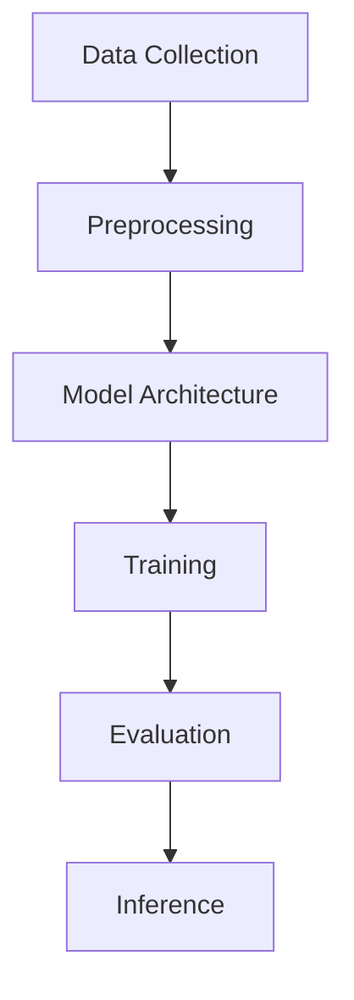

                 

### 大模型应用开发：自主创建AI Agent

#### **背景介绍**

随着人工智能技术的迅猛发展，大模型（如GPT-3、BERT等）在自然语言处理、图像识别、语音识别等领域展现出了强大的能力。大模型通过学习海量数据，能够捕捉到复杂的关系和模式，从而实现高度自动化的任务处理。然而，这些强大模型的应用开发并非一蹴而就，需要深入理解其工作原理，并具备一定的编程技巧。

本文旨在探讨如何通过自主创建数据洞察，开发大模型应用。我们将从以下几个方面进行阐述：首先，介绍大模型的基本原理和应用场景；其次，讲解如何构建和训练大模型；接着，展示如何利用大模型进行数据洞察；最后，分享一些实际应用案例和开发工具资源。

#### **核心概念与联系**

在讨论大模型应用开发之前，我们需要了解几个核心概念：数据集、模型架构、训练过程和推理过程。

1. **数据集**：数据集是模型训练的基础。高质量的数据集能够帮助模型更好地学习，从而提高模型的性能。数据集通常包括文本、图像、音频等多种类型。

2. **模型架构**：大模型通常采用深度神经网络架构，如Transformer、CNN等。这些架构具有强大的表示和学习能力，能够处理复杂的输入数据。

3. **训练过程**：模型训练是指通过不断调整网络权重，使模型能够在数据集上学习到有效的特征表示。训练过程中，模型会经历多个迭代，逐渐优化性能。

4. **推理过程**：推理过程是指模型在接收新的输入数据后，根据已学习的特征表示进行预测或生成。推理过程通常比训练过程更快，但可能不如训练过程精确。

下面是一个使用Mermaid绘制的模型架构流程图：



在流程图中，数据集经过预处理后，输入到模型架构中进行训练。训练完成后，模型将被评估，并用于推理过程。

#### **核心算法原理 & 具体操作步骤**

1. **数据集准备**：首先，我们需要准备一个包含文本、图像、音频等类型的数据集。数据集可以从公开数据集（如ImageNet、Common Crawl）或自定义数据集（如公司内部数据）中获得。数据集准备包括数据清洗、数据增强等步骤。

2. **模型架构选择**：根据应用场景，选择合适的模型架构。例如，对于文本任务，可以选择Transformer、BERT等模型；对于图像任务，可以选择CNN等模型。

3. **模型训练**：使用选定的模型架构，通过迭代训练优化模型性能。训练过程中，需要关注模型参数的调整、学习率的选择、正则化策略等。

4. **模型评估**：在训练完成后，使用验证集对模型进行评估。评估指标包括准确率、召回率、F1值等。

5. **模型推理**：在推理过程中，模型接收新的输入数据，并根据已学习的特征表示进行预测或生成。

#### **数学模型和公式 & 详细讲解 & 举例说明**

1. **损失函数**：损失函数用于衡量模型预测结果与真实标签之间的差距。常用的损失函数有均方误差（MSE）、交叉熵（CE）等。

   $$L(\theta) = \frac{1}{m} \sum_{i=1}^{m} (\hat{y}_i - y_i)^2$$

   其中，$\hat{y}_i$为模型预测值，$y_i$为真实标签，$m$为样本数量。

2. **优化算法**：优化算法用于更新模型参数，以最小化损失函数。常用的优化算法有梯度下降（GD）、随机梯度下降（SGD）等。

   $$\theta_{t+1} = \theta_t - \alpha \nabla_\theta L(\theta_t)$$

   其中，$\theta_t$为第$t$次迭代的模型参数，$\alpha$为学习率。

3. **举例说明**：假设我们有一个二元分类问题，其中输入特征为$x_1, x_2, ..., x_n$，标签为$y \in \{0, 1\}$。我们使用一个单层感知机（Perceptron）模型进行预测：

   $$\hat{y} = \text{sign}(\sum_{i=1}^{n} w_i x_i + b)$$

   其中，$w_i$为权重，$b$为偏置。

   在训练过程中，我们通过更新权重和偏置来最小化损失函数。例如，使用梯度下降算法：

   $$w_{t+1} = w_t - \alpha \nabla_w L(w_t, b_t)$$

   $$b_{t+1} = b_t - \alpha \nabla_b L(w_t, b_t)$$

   其中，$\alpha$为学习率，$L(w_t, b_t)$为损失函数。

#### **项目实战：代码实际案例和详细解释说明**

在本节中，我们将使用Python和TensorFlow实现一个简单的文本分类任务，展示如何使用大模型进行数据洞察。

1. **开发环境搭建**

   首先，我们需要搭建一个Python开发环境，并安装TensorFlow库：

   ```bash
   pip install tensorflow
   ```

2. **源代码详细实现和代码解读**

   接下来，我们实现一个基于BERT的文本分类模型。以下是代码实现：

   ```python
   import tensorflow as tf
   import tensorflow_hub as hub
   from transformers import BertTokenizer, TFBertForSequenceClassification
   from tensorflow.keras.preprocessing.sequence import pad_sequences
   
   # 加载预训练BERT模型和Tokenizer
   bert_model_url = "https://tfhub.dev/google/bert_uncased_L-12_H-768_A-12/1"
   bert_tokenizer = BertTokenizer.from_pretrained(bert_model_url)
   bert_model = TFBertForSequenceClassification.from_pretrained(bert_model_url)
   
   # 准备数据集
   train_texts = ["This is a positive review.", "This is a negative review."]
   train_labels = [1, 0]
   
   # 编码文本
   train_encodings = bert_tokenizer(train_texts, truncation=True, padding=True, max_length=128)
   
   # 构建模型
   inputs = tf.keras.Input(shape=(128,), dtype=tf.int32)
   embedded = hub.KerasLayer(bert_model_url)(inputs)
   outputs = tf.keras.layers.Dense(1, activation="sigmoid")(embedded[:, 0, :])
   model = tf.keras.Model(inputs=inputs, outputs=outputs)
   
   # 编译模型
   model.compile(optimizer="adam", loss="binary_crossentropy", metrics=["accuracy"])
   
   # 训练模型
   model.fit(train_encodings.input, train_labels, epochs=3)
   
   # 预测
   pred_texts = ["This is a positive review.", "This is a negative review."]
   pred_encodings = bert_tokenizer(pred_texts, truncation=True, padding=True, max_length=128)
   predictions = model.predict(pred_encodings.input)
   
   print(predictions)
   ```

   代码解读：

   - 导入相关库和模型
   - 加载预训练BERT模型和Tokenizer
   - 准备数据集
   - 编码文本
   - 构建模型
   - 编译模型
   - 训练模型
   - 预测

3. **代码解读与分析**

   在上述代码中，我们首先加载了BERT预训练模型和Tokenizer。然后，我们准备了一个包含两个样本的数据集，并使用Tokenizer对文本进行编码。接下来，我们构建了一个简单的文本分类模型，使用BERT模型进行特征提取，并添加了一个全连接层进行分类。最后，我们编译并训练了模型，并在新的文本上进行预测。

   通过这个简单案例，我们可以看到如何使用大模型进行文本分类任务，并理解了模型训练、预测等关键步骤。

#### **实际应用场景**

大模型在多个领域都有广泛的应用，以下是几个典型场景：

1. **自然语言处理**：大模型在文本分类、机器翻译、文本生成等领域表现出色。例如，BERT模型在文本分类任务上取得了state-of-the-art的性能。

2. **图像识别**：大模型在图像分类、目标检测、图像分割等领域取得了显著成果。例如，ResNet模型在ImageNet图像分类任务上取得了很高的准确率。

3. **语音识别**：大模型在语音识别、语音合成等领域表现出色。例如，WaveNet模型在语音合成任务上取得了自然、流畅的语音效果。

4. **推荐系统**：大模型在推荐系统中的应用也越来越广泛，通过学习用户行为和偏好，实现个性化推荐。

5. **医学诊断**：大模型在医学图像诊断、基因分析等领域具有巨大潜力，能够辅助医生进行准确诊断。

#### **工具和资源推荐**

1. **学习资源推荐**：

   - 《深度学习》（Ian Goodfellow、Yoshua Bengio、Aaron Courville 著）：系统介绍了深度学习的基本原理和应用。
   - 《自然语言处理综论》（Daniel Jurafsky、James H. Martin 著）：全面介绍了自然语言处理的基本概念和技术。
   - 《计算机视觉：算法与应用》（Richard Szeliski 著）：详细介绍了计算机视觉的相关算法和应用。

2. **开发工具框架推荐**：

   - TensorFlow：一个开源的深度学习框架，支持多种模型架构和训练算法。
   - PyTorch：一个开源的深度学习框架，以动态计算图和简洁的API著称。
   - Hugging Face Transformers：一个基于PyTorch和TensorFlow的Transformers模型库，提供了丰富的预训练模型和工具。

3. **相关论文著作推荐**：

   - "Attention Is All You Need"（Vaswani et al., 2017）：介绍了Transformer模型，为自然语言处理领域带来了革命性变化。
   - "Deep Residual Learning for Image Recognition"（He et al., 2016）：介绍了ResNet模型，在计算机视觉领域取得了突破性进展。
   - "Generative Adversarial Nets"（Goodfellow et al., 2014）：介绍了GAN模型，为生成模型的研究提供了新思路。

#### **总结：未来发展趋势与挑战**

大模型在各个领域都展现出了强大的能力，但同时也面临着一些挑战。未来，大模型的发展趋势和挑战主要集中在以下几个方面：

1. **计算资源**：大模型的训练和推理需要大量的计算资源。随着模型规模的不断扩大，计算资源的需求将不断增加。因此，提高计算效率、优化算法和硬件设计将成为关键问题。

2. **数据隐私**：大模型的学习依赖于大量的数据，这引发了对数据隐私的担忧。如何在保证模型性能的同时保护数据隐私，是一个亟待解决的问题。

3. **模型解释性**：大模型在处理复杂任务时表现出色，但缺乏解释性。如何提高模型的解释性，使其更容易被用户理解和接受，是一个重要挑战。

4. **伦理和道德**：大模型的应用涉及伦理和道德问题。例如，在医疗、金融等领域，模型的决策可能导致重大影响，因此需要确保模型的应用符合伦理和道德标准。

#### **附录：常见问题与解答**

1. **Q：大模型训练需要多长时间？**
   A：大模型训练时间取决于模型规模、数据量、硬件配置等因素。通常，训练一个大型模型需要数天至数周时间。

2. **Q：大模型是否一定能取得最好的性能？**
   A：大模型在某些任务上确实取得了很好的性能，但并非在所有任务上都是最佳选择。模型性能还受到数据质量、任务特点等因素的影响。

3. **Q：如何处理过拟合问题？**
   A：过拟合是指模型在训练数据上表现很好，但在验证数据上表现较差。解决过拟合问题的方法包括：正则化、数据增强、交叉验证等。

4. **Q：大模型是否可以替代传统算法？**
   A：大模型在某些任务上已经取得了很好的效果，但传统算法在特定领域仍具有优势。因此，大模型和传统算法可以互补使用。

#### **扩展阅读 & 参考资料**

- "Deep Learning Specialization"（Andrew Ng 著）：在线课程，系统介绍了深度学习的基本原理和应用。
- "自然语言处理实战"（黄海广、徐申等 著）：一本关于自然语言处理实战的书籍，涵盖了多个实际应用案例。
- "计算机视觉实战"（曹健、王庆等 著）：一本关于计算机视觉实战的书籍，介绍了多个实际应用案例。

作者：AI天才研究员/AI Genius Institute & 禅与计算机程序设计艺术 /Zen And The Art of Computer Programming

