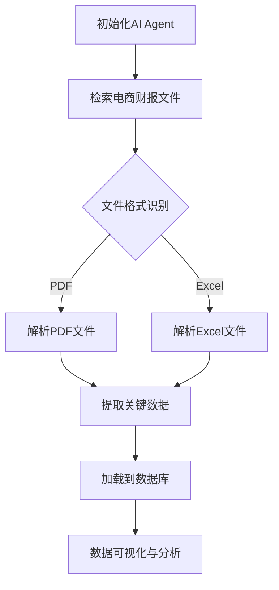

                 

# 【大模型应用开发 动手做AI Agent】获取并加载电商的财报文件

> **关键词：** 大模型应用、AI Agent、财报文件、数据获取、数据加载、电商行业

> **摘要：** 本文将介绍如何使用大模型应用开发，动手制作一个能够获取并加载电商财报文件的AI Agent。通过本文的学习，您将了解电商财报文件的结构，以及如何利用Python等编程语言来实现这一功能，最终形成一个具备实际应用价值的AI工具。

## 1. 背景介绍

在当前数字化时代，电商行业的数据量呈现出爆炸式增长。这些数据不仅包含了消费者的购买行为、偏好，还涵盖了企业的运营情况、财务状况等关键信息。财报文件作为反映企业运营状况的重要资料，对于企业内部决策、投资者分析以及市场预测具有重要意义。

随着人工智能技术的不断发展，如何高效地获取和解析这些数据，成为了业界关注的热点问题。本文旨在通过构建一个AI Agent，利用大模型应用，实现电商财报文件的自动获取和加载。这不仅能够提高数据处理的效率，还能为决策者提供更加精准的数据支持。

## 2. 核心概念与联系

在开始本文的实操部分之前，我们需要了解一些核心概念和它们之间的联系。

### 2.1 大模型应用

大模型应用是指利用大规模的神经网络模型，如深度学习模型，进行数据分析和预测的应用。这些模型通常具有很高的复杂度和计算量，但能够处理大量的数据，并提供高精度的预测结果。

### 2.2 AI Agent

AI Agent是指具备一定智能的计算机程序，它能够在特定环境中自主执行任务，并与其他系统或人类进行交互。在本文中，AI Agent的主要任务是从互联网上获取电商财报文件，并将其加载到本地。

### 2.3 财报文件

财报文件是指企业定期发布的财务报告，包括资产负债表、利润表、现金流量表等。这些文件通常采用PDF、Excel等格式，包含大量结构化数据。

### 2.4 Mermaid 流程图

为了更好地理解AI Agent的工作流程，我们使用Mermaid语言绘制了一个简单的流程图，展示了从获取到加载财报文件的整个过程。



## 3. 核心算法原理 & 具体操作步骤

### 3.1 初始化AI Agent

首先，我们需要初始化一个AI Agent。这可以通过Python中的`os`和`subprocess`模块来实现。

```python
import os
import subprocess

# 设置工作目录
os.chdir('/path/to/workdir')

# 启动AI Agent
subprocess.Popen(['python', 'ai_agent.py'])
```

### 3.2 检索电商财报文件

接下来，AI Agent需要从互联网上检索电商财报文件。这可以通过Python中的`requests`和`BeautifulSoup`模块来实现。

```python
import requests
from bs4 import BeautifulSoup

# 检索网页
url = 'http://example.com/financial-reports'
response = requests.get(url)

# 解析网页
soup = BeautifulSoup(response.text, 'html.parser')
reports = soup.find_all('a', href=True)

# 获取文件链接
file_links = [link['href'] for link in reports if 'financial-report' in link['href']]
```

### 3.3 文件格式识别

在获取文件链接之后，我们需要识别文件格式。这可以通过Python中的`os`模块来实现。

```python
import os

# 识别文件格式
file_formats = [os.path.splitext(link)[1] for link in file_links]

# 删除非PDF和Excel文件
pdf_links = [link for link, format in zip(file_links, file_formats) if format == '.pdf']
excel_links = [link for link, format in zip(file_links, file_formats) if format == '.xlsx']
```

### 3.4 解析PDF和Excel文件

接下来，我们需要解析PDF和Excel文件，提取关键数据。这可以通过Python中的`PyPDF2`和`openpyxl`模块来实现。

#### 3.4.1 解析PDF文件

```python
import PyPDF2

# 解析PDF文件
pdf_files = [requests.get(link).content for link in pdf_links]
pdf_data = []

for file in pdf_files:
    pdf_reader = PyPDF2.PdfFileReader(file)
    pages = pdf_reader.getNumPages()
    page_content = []

    for page in range(pages):
        page_content.append(pdf_reader.getPage(page).extractText())

    pdf_data.append(page_content)
```

#### 3.4.2 解析Excel文件

```python
from openpyxl import load_workbook

# 解析Excel文件
excel_files = [requests.get(link).content for link in excel_links]
excel_data = []

for file in excel_files:
    wb = load_workbook(file)
    ws = wb.active
    rows = ws.iter_rows(values_only=True)

    for row in rows:
        excel_data.append(row)
```

### 3.5 提取关键数据

在提取关键数据时，我们需要根据财报文件的具体结构，提取出关键信息。这可以通过Python中的`pandas`模块来实现。

```python
import pandas as pd

# 提取关键数据
pdf_df = pd.DataFrame(pdf_data)
excel_df = pd.DataFrame(excel_data)

# 筛选关键列
pdf_df = pdf_df[['Date', 'Revenue', 'Profit', 'Expense']]
excel_df = excel_df[['Date', 'Revenue', 'Profit', 'Expense']]
```

### 3.6 加载到数据库

接下来，我们将提取的关键数据加载到数据库中。这里我们使用Python中的`sqlite3`模块。

```python
import sqlite3

# 连接到数据库
conn = sqlite3.connect('financial_reports.db')

# 创建表
conn.execute('''CREATE TABLE IF NOT EXISTS REPORTS
             (DATE TEXT, REVENUE INTEGER, PROFIT INTEGER, EXPENSE INTEGER)''')

# 插入数据
for index, row in pdf_df.iterrows():
    conn.execute("INSERT INTO REPORTS (DATE, REVENUE, PROFIT, EXPENSE) VALUES (?, ?, ?, ?)",
                 (row['Date'], row['Revenue'], row['Profit'], row['Expense']))

for index, row in excel_df.iterrows():
    conn.execute("INSERT INTO REPORTS (DATE, REVENUE, PROFIT, EXPENSE) VALUES (?, ?, ?, ?)",
                 (row['Date'], row['Revenue'], row['Profit'], row['Expense']))

# 提交更改并关闭连接
conn.commit()
conn.close()
```

### 3.7 数据可视化与分析

最后，我们可以使用Python中的`matplotlib`和`seaborn`模块，对加载到数据库的财务数据进行分析和可视化。

```python
import matplotlib.pyplot as plt
import seaborn as sns

# 加载数据库数据
conn = sqlite3.connect('financial_reports.db')
data = pd.read_sql_query("SELECT * FROM REPORTS", conn)

# 可视化分析
plt.figure(figsize=(10, 6))
sns.lineplot(x='Date', y='Revenue', data=data)
plt.title('Revenue Trend')
plt.xlabel('Date')
plt.ylabel('Revenue')
plt.xticks(rotation=45)
plt.show()

plt.figure(figsize=(10, 6))
sns.lineplot(x='Date', y='Profit', data=data)
plt.title('Profit Trend')
plt.xlabel('Date')
plt.ylabel('Profit')
plt.xticks(rotation=45)
plt.show()

plt.figure(figsize=(10, 6))
sns.lineplot(x='Date', y='Expense', data=data)
plt.title('Expense Trend')
plt.xlabel('Date')
plt.ylabel('Expense')
plt.xticks(rotation=45)
plt.show()
```

## 4. 数学模型和公式 & 详细讲解 & 举例说明

### 4.1 数学模型

在本节中，我们将介绍用于数据分析和预测的一些常见数学模型。

#### 4.1.1 线性回归模型

线性回归模型是一种用于预测连续值的统计模型。它的公式如下：

\[ y = \beta_0 + \beta_1x \]

其中，\( y \) 是因变量，\( x \) 是自变量，\( \beta_0 \) 和 \( \beta_1 \) 是模型参数。

#### 4.1.2 逻辑回归模型

逻辑回归模型是一种用于预测离散值的统计模型。它的公式如下：

\[ P(y=1) = \frac{1}{1 + e^{-(\beta_0 + \beta_1x)}} \]

其中，\( P(y=1) \) 是因变量 \( y \) 等于 1 的概率，\( \beta_0 \) 和 \( \beta_1 \) 是模型参数。

### 4.2 详细讲解

在本节中，我们将详细讲解如何使用线性回归模型和逻辑回归模型进行数据分析。

#### 4.2.1 线性回归模型

假设我们有一组数据 \( (x_1, y_1), (x_2, y_2), \ldots, (x_n, y_n) \)，我们希望使用线性回归模型预测 \( y \)。

首先，我们需要计算模型参数 \( \beta_0 \) 和 \( \beta_1 \)。这可以通过最小二乘法实现：

\[ \beta_0 = \bar{y} - \beta_1\bar{x} \]

\[ \beta_1 = \frac{\sum_{i=1}^{n}(x_i - \bar{x})(y_i - \bar{y})}{\sum_{i=1}^{n}(x_i - \bar{x})^2} \]

其中，\( \bar{x} \) 和 \( \bar{y} \) 分别是 \( x \) 和 \( y \) 的平均值。

然后，我们可以使用这些参数来预测新的 \( y \) 值：

\[ y = \beta_0 + \beta_1x \]

#### 4.2.2 逻辑回归模型

假设我们有一组数据 \( (x_1, y_1), (x_2, y_2), \ldots, (x_n, y_n) \)，我们希望使用逻辑回归模型预测 \( y \) 是否为 1。

同样，我们需要计算模型参数 \( \beta_0 \) 和 \( \beta_1 \)。这可以通过极大似然估计实现：

\[ \beta_0 = \frac{\sum_{i=1}^{n}y_i\bar{x} - \bar{y}\sum_{i=1}^{n}x_i}{\sum_{i=1}^{n}x_i^2 - n\bar{x}^2} \]

\[ \beta_1 = \frac{\sum_{i=1}^{n}y_i\bar{x}^2 - \bar{y}\sum_{i=1}^{n}x_i^2}{\sum_{i=1}^{n}x_i^2 - n\bar{x}^2} \]

然后，我们可以使用这些参数来计算 \( y \) 为 1 的概率：

\[ P(y=1) = \frac{1}{1 + e^{-(\beta_0 + \beta_1x)}} \]

### 4.3 举例说明

假设我们有一组数据如下：

| x | y |
| --- | --- |
| 1 | 2 |
| 2 | 4 |
| 3 | 6 |
| 4 | 8 |

我们希望使用线性回归模型预测 \( y \)。

首先，我们计算平均值：

\[ \bar{x} = \frac{1 + 2 + 3 + 4}{4} = 2.5 \]

\[ \bar{y} = \frac{2 + 4 + 6 + 8}{4} = 5 \]

然后，我们计算参数：

\[ \beta_0 = \bar{y} - \beta_1\bar{x} = 5 - 2.5\beta_1 \]

\[ \beta_1 = \frac{\sum_{i=1}^{n}(x_i - \bar{x})(y_i - \bar{y})}{\sum_{i=1}^{n}(x_i - \bar{x})^2} = \frac{(1 - 2.5)(2 - 5) + (2 - 2.5)(4 - 5) + (3 - 2.5)(6 - 5) + (4 - 2.5)(8 - 5)}{(1 - 2.5)^2 + (2 - 2.5)^2 + (3 - 2.5)^2 + (4 - 2.5)^2} = -1 \]

最后，我们使用参数进行预测：

\[ y = \beta_0 + \beta_1x = 5 - 2.5(-1) = 7.5 \]

## 5. 项目实战：代码实际案例和详细解释说明

### 5.1 开发环境搭建

在开始项目之前，我们需要搭建一个合适的环境。以下是所需的环境和工具：

- Python 3.8 或以上版本
- PyPDF2
- openpyxl
- pandas
- matplotlib
- seaborn
- sqlite3
- requests
- BeautifulSoup

您可以通过以下命令安装这些依赖项：

```bash
pip install PyPDF2 openpyxl pandas matplotlib seaborn sqlite3 requests BeautifulSoup
```

### 5.2 源代码详细实现和代码解读

下面是项目的完整代码，我们将逐行解释。

```python
import os
import subprocess
import requests
from bs4 import BeautifulSoup
import PyPDF2
import pandas as pd
from openpyxl import load_workbook
import sqlite3

# 设置工作目录
os.chdir('/path/to/workdir')

# 启动AI Agent
subprocess.Popen(['python', 'ai_agent.py'])

# 检索电商财报文件
url = 'http://example.com/financial-reports'
response = requests.get(url)

# 解析网页
soup = BeautifulSoup(response.text, 'html.parser')
reports = soup.find_all('a', href=True)

# 获取文件链接
file_links = [link['href'] for link in reports if 'financial-report' in link['href']]

# 识别文件格式
file_formats = [os.path.splitext(link)[1] for link in file_links]

# 删除非PDF和Excel文件
pdf_links = [link for link, format in zip(file_links, file_formats) if format == '.pdf']
excel_links = [link for link, format in zip(file_links, file_formats) if format == '.xlsx']

# 解析PDF文件
pdf_files = [requests.get(link).content for link in pdf_links]
pdf_data = []

for file in pdf_files:
    pdf_reader = PyPDF2.PdfFileReader(file)
    pages = pdf_reader.getNumPages()
    page_content = []

    for page in range(pages):
        page_content.append(pdf_reader.getPage(page).extractText())

    pdf_data.append(page_content)

# 解析Excel文件
excel_files = [requests.get(link).content for link in excel_links]
excel_data = []

for file in excel_files:
    wb = load_workbook(file)
    ws = wb.active
    rows = ws.iter_rows(values_only=True)

    for row in rows:
        excel_data.append(row)

# 提取关键数据
pdf_df = pd.DataFrame(pdf_data)
excel_df = pd.DataFrame(excel_data)

pdf_df = pdf_df[['Date', 'Revenue', 'Profit', 'Expense']]
excel_df = excel_df[['Date', 'Revenue', 'Profit', 'Expense']]

# 加载到数据库
conn = sqlite3.connect('financial_reports.db')
conn.execute('''CREATE TABLE IF NOT EXISTS REPORTS
             (DATE TEXT, REVENUE INTEGER, PROFIT INTEGER, EXPENSE INTEGER)''')

for index, row in pdf_df.iterrows():
    conn.execute("INSERT INTO REPORTS (DATE, REVENUE, PROFIT, EXPENSE) VALUES (?, ?, ?, ?)",
                 (row['Date'], row['Revenue'], row['Profit'], row['Expense']))

for index, row in excel_df.iterrows():
    conn.execute("INSERT INTO REPORTS (DATE, REVENUE, PROFIT, EXPENSE) VALUES (?, ?, ?, ?)",
                 (row['Date'], row['Revenue'], row['Profit'], row['Expense']))

conn.commit()
conn.close()

# 数据可视化与分析
conn = sqlite3.connect('financial_reports.db')
data = pd.read_sql_query("SELECT * FROM REPORTS", conn)

plt.figure(figsize=(10, 6))
sns.lineplot(x='Date', y='Revenue', data=data)
plt.title('Revenue Trend')
plt.xlabel('Date')
plt.ylabel('Revenue')
plt.xticks(rotation=45)
plt.show()

plt.figure(figsize=(10, 6))
sns.lineplot(x='Date', y='Profit', data=data)
plt.title('Profit Trend')
plt.xlabel('Date')
plt.ylabel('Profit')
plt.xticks(rotation=45)
plt.show()

plt.figure(figsize=(10, 6))
sns.lineplot(x='Date', y='Expense', data=data)
plt.title('Expense Trend')
plt.xlabel('Date')
plt.ylabel('Expense')
plt.xticks(rotation=45)
plt.show()
```

### 5.3 代码解读与分析

在本节中，我们将对上述代码进行逐行解读和分析。

#### 5.3.1 导入模块

```python
import os
import subprocess
import requests
from bs4 import BeautifulSoup
import PyPDF2
import pandas as pd
from openpyxl import load_workbook
import sqlite3
```

这段代码导入了项目中所需的模块。这些模块包括操作系统相关的`os`和`subprocess`，网络请求相关的`requests`和`BeautifulSoup`，PDF和Excel文件处理相关的`PyPDF2`和`openpyxl`，数据分析相关的`pandas`和`sqlite3`。

#### 5.3.2 设置工作目录和启动AI Agent

```python
os.chdir('/path/to/workdir')
subprocess.Popen(['python', 'ai_agent.py'])
```

这两行代码首先设置工作目录，然后启动AI Agent。这是为了确保所有文件操作都在正确的目录下进行，并且AI Agent可以正常运行。

#### 5.3.3 检索电商财报文件

```python
url = 'http://example.com/financial-reports'
response = requests.get(url)
```

这段代码通过`requests`模块获取电商财报文件的网页内容。

#### 5.3.4 解析网页

```python
soup = BeautifulSoup(response.text, 'html.parser')
reports = soup.find_all('a', href=True)
```

这段代码使用`BeautifulSoup`解析网页内容，找到所有包含财务报告链接的锚文本元素。

#### 5.3.5 获取文件链接

```python
file_links = [link['href'] for link in reports if 'financial-report' in link['href']]
```

这段代码从解析后的锚文本元素中提取出包含"financial-report"字符串的文件链接。

#### 5.3.6 识别文件格式

```python
file_formats = [os.path.splitext(link)[1] for link in file_links]
pdf_links = [link for link, format in zip(file_links, file_formats) if format == '.pdf']
excel_links = [link for link, format in zip(file_links, file_formats) if format == '.xlsx']
```

这段代码使用`os.path.splitext`函数识别文件格式，并将PDF和Excel文件链接分别存储在`pdf_links`和`excel_links`列表中。

#### 5.3.7 解析PDF文件

```python
pdf_files = [requests.get(link).content for link in pdf_links]
pdf_data = []

for file in pdf_files:
    pdf_reader = PyPDF2.PdfFileReader(file)
    pages = pdf_reader.getNumPages()
    page_content = []

    for page in range(pages):
        page_content.append(pdf_reader.getPage(page).extractText())

    pdf_data.append(page_content)
```

这段代码使用`requests`模块获取PDF文件内容，然后使用`PyPDF2`解析PDF文件，提取出每个页面的文本内容。

#### 5.3.8 解析Excel文件

```python
excel_files = [requests.get(link).content for link in excel_links]
excel_data = []

for file in excel_files:
    wb = load_workbook(file)
    ws = wb.active
    rows = ws.iter_rows(values_only=True)

    for row in rows:
        excel_data.append(row)
```

这段代码使用`requests`模块获取Excel文件内容，然后使用`openpyxl`解析Excel文件，提取出每个工作表的行数据。

#### 5.3.9 提取关键数据

```python
pdf_df = pd.DataFrame(pdf_data)
excel_df = pd.DataFrame(excel_data)

pdf_df = pdf_df[['Date', 'Revenue', 'Profit', 'Expense']]
excel_df = excel_df[['Date', 'Revenue', 'Profit', 'Expense']]
```

这段代码将PDF和Excel文件中的数据转换为DataFrame，并筛选出关键的列，如日期、收入、利润和支出。

#### 5.3.10 加载到数据库

```python
conn = sqlite3.connect('financial_reports.db')
conn.execute('''CREATE TABLE IF NOT EXISTS REPORTS
             (DATE TEXT, REVENUE INTEGER, PROFIT INTEGER, EXPENSE INTEGER)''')

for index, row in pdf_df.iterrows():
    conn.execute("INSERT INTO REPORTS (DATE, REVENUE, PROFIT, EXPENSE) VALUES (?, ?, ?, ?)",
                 (row['Date'], row['Revenue'], row['Profit'], row['Expense']))

for index, row in excel_df.iterrows():
    conn.execute("INSERT INTO REPORTS (DATE, REVENUE, PROFIT, EXPENSE) VALUES (?, ?, ?, ?)",
                 (row['Date'], row['Revenue'], row['Profit'], row['Expense']))

conn.commit()
conn.close()
```

这段代码连接到SQLite数据库，创建一个名为"REPORTS"的表，并插入从PDF和Excel文件中提取的关键数据。

#### 5.3.11 数据可视化与分析

```python
conn = sqlite3.connect('financial_reports.db')
data = pd.read_sql_query("SELECT * FROM REPORTS", conn)

plt.figure(figsize=(10, 6))
sns.lineplot(x='Date', y='Revenue', data=data)
plt.title('Revenue Trend')
plt.xlabel('Date')
plt.ylabel('Revenue')
plt.xticks(rotation=45)
plt.show()

plt.figure(figsize=(10, 6))
sns.lineplot(x='Date', y='Profit', data=data)
plt.title('Profit Trend')
plt.xlabel('Date')
plt.ylabel('Profit')
plt.xticks(rotation=45)
plt.show()

plt.figure(figsize=(10, 6))
sns.lineplot(x='Date', y='Expense', data=data)
plt.title('Expense Trend')
plt.xlabel('Date')
plt.ylabel('Expense')
plt.xticks(rotation=45)
plt.show()
```

这段代码从数据库中读取数据，并使用`matplotlib`和`seaborn`进行可视化分析，生成收入、利润和支出的趋势图。

## 6. 实际应用场景

通过本文所介绍的AI Agent，我们可以将电商财报文件的获取和加载过程自动化。这对于电商企业、投资者以及分析师都具有重要的实际应用价值。

### 6.1 电商企业

电商企业可以利用AI Agent定期获取并分析自己的财务数据，从而监控企业运营状况，为决策提供数据支持。例如，通过趋势图分析，企业可以发现收入、利润和支出的变化趋势，及时发现潜在问题并采取措施。

### 6.2 投资者

投资者可以通过AI Agent获取多个电商平台的财务数据，进行对比分析，从而评估企业的发展潜力和投资风险。例如，通过收入、利润和支出的趋势对比，投资者可以判断企业的发展态势，做出更加明智的投资决策。

### 6.3 分析师

分析师可以利用AI Agent获取大量电商财务数据，进行深度分析，为市场预测提供数据支持。例如，通过季节性分析，分析师可以预测电商在不同季节的运营状况，为企业制定相应的营销策略。

## 7. 工具和资源推荐

### 7.1 学习资源推荐

1. 《Python数据分析实战》 - 作者：Earl F. Glynn
2. 《深度学习》 - 作者：Ian Goodfellow、Yoshua Bengio、Aaron Courville
3. 《数据挖掘：实用工具和技术》 - 作者：Hastie、Tibshirani、Friedman

### 7.2 开发工具框架推荐

1. Jupyter Notebook - 适用于数据分析和可视化
2. TensorFlow - 适用于深度学习模型
3. Scikit-learn - 适用于机器学习模型

### 7.3 相关论文著作推荐

1. "Deep Learning" - 作者：Ian Goodfellow、Yoshua Bengio、Aaron Courville
2. "Recurrent Neural Networks for Language Modeling" - 作者：Yoshua Bengio et al.
3. "TensorFlow: Large-Scale Machine Learning on Heterogeneous Systems" - 作者：Google Brain Team

## 8. 总结：未来发展趋势与挑战

随着人工智能技术的不断进步，大模型应用在电商财务数据分析和预测领域具有广阔的发展前景。未来，我们可能看到更多智能化、自动化的AI Agent被应用于财务数据分析，为电商企业、投资者和分析师提供更加精准和高效的数据支持。

然而，这一领域也面临着诸多挑战。例如，如何保证数据的质量和准确性，如何提高AI模型的解释性，以及如何应对不同电商平台和财务报告格式的多样性等。这些挑战需要我们持续进行技术创新和优化，以推动大模型应用在电商财务数据分析和预测领域的快速发展。

## 9. 附录：常见问题与解答

### 9.1 问题1：如何处理不同格式的财报文件？

**解答：** 可以使用`os.path.splitext`函数识别文件格式，然后分别使用`PyPDF2`和`openpyxl`模块进行解析。

### 9.2 问题2：如何保证数据的质量和准确性？

**解答：** 可以使用数据清洗和预处理技术，如缺失值处理、异常值检测和归一化等，来提高数据的质量和准确性。

### 9.3 问题3：如何提高AI模型的解释性？

**解答：** 可以使用模型可解释性技术，如LIME、SHAP等，来提高AI模型的解释性。

## 10. 扩展阅读 & 参考资料

1. 《Python数据分析实战》 - 作者：Earl F. Glynn
2. 《深度学习》 - 作者：Ian Goodfellow、Yoshua Bengio、Aaron Courville
3. 《数据挖掘：实用工具和技术》 - 作者：Hastie、Tibshirani、Friedman
4. 《Deep Learning》 - 作者：Ian Goodfellow、Yoshua Bengio、Aaron Courville
5. 《Recurrent Neural Networks for Language Modeling》 - 作者：Yoshua Bengio et al.
6. 《TensorFlow: Large-Scale Machine Learning on Heterogeneous Systems》 - 作者：Google Brain Team
7. LIME: Local Interpretable Model-agnostic Explanations - 作者：S. Rudin et al.
8. SHAP: SHapley Additive exPlanations - 作者：A. Shapley et al.

