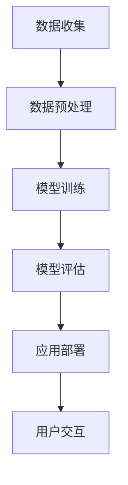

                 

# 【大模型应用开发 动手做AI Agent】语言交互能力

> **关键词：** 大模型应用、AI Agent、自然语言处理、语言交互能力、应用开发

> **摘要：** 本文将深入探讨大模型在AI Agent中的应用，尤其是语言交互能力的开发。我们将从背景介绍、核心概念、算法原理、数学模型、项目实战、实际应用场景、工具推荐和未来发展趋势等方面进行详细剖析，帮助读者更好地理解和应用这项技术。

## 1. 背景介绍

随着人工智能技术的飞速发展，大模型（如GPT-3、BERT等）在自然语言处理（NLP）领域取得了显著成果。这些大模型具有强大的语义理解、生成和交互能力，为开发智能助手、聊天机器人等应用提供了有力支持。

AI Agent作为人工智能的一种形式，旨在模拟人类智能，实现与用户的自然语言交互。语言交互能力是AI Agent的核心特征，决定了其能否提供高质量的服务。因此，研究大模型在语言交互能力开发中的应用具有重要意义。

## 2. 核心概念与联系

### 2.1 大模型

大模型是指具有大规模参数的深度学习模型，通常包含数亿至数千亿个参数。这些模型通过在海量数据上进行预训练，具备了强大的语义理解、生成和推理能力。

### 2.2 自然语言处理（NLP）

自然语言处理是人工智能领域的一个重要分支，旨在让计算机理解和处理自然语言。NLP技术包括文本预处理、词嵌入、语义分析、文本生成等。

### 2.3 语言交互能力

语言交互能力是指AI Agent在自然语言处理的基础上，与用户进行有效沟通和互动的能力。这包括理解用户意图、生成自然语言回复、处理多轮对话等。

## 2.4 Mermaid流程图

以下是一个简单的Mermaid流程图，展示了大模型在语言交互能力开发中的核心步骤：



## 3. 核心算法原理 & 具体操作步骤

### 3.1 数据收集与预处理

首先，我们需要收集大量的文本数据，如新闻文章、社交媒体评论、对话记录等。这些数据将用于训练和评估大模型。

数据收集完成后，我们需要对数据进行预处理，包括文本清洗、分词、词性标注等。预处理后的数据将输入到大模型进行训练。

### 3.2 模型训练

训练大模型的核心步骤是优化模型参数，使其在训练数据上达到良好的性能。这通常通过梯度下降算法和优化器（如Adam）实现。

在训练过程中，大模型将学习如何将输入的文本转换为合适的输出。这包括理解文本的语义、生成自然语言回复等。

### 3.3 模型评估

模型训练完成后，我们需要对模型进行评估，以确保其具有良好的性能和泛化能力。常用的评估指标包括准确率、召回率、F1分数等。

### 3.4 应用部署

评估通过后，我们将大模型部署到服务器或云端，以便用户可以与AI Agent进行交互。

### 3.5 用户交互

用户交互是AI Agent的核心功能。在交互过程中，AI Agent需要理解用户的意图，生成合适的回复，并处理多轮对话。

## 4. 数学模型和公式 & 详细讲解 & 举例说明

### 4.1 词嵌入

词嵌入是将自然语言中的单词转换为向量表示的技术。词嵌入模型通常基于神经网络，如Word2Vec、GloVe等。

以下是一个简单的Word2Vec模型公式：

$$
\vec{w}_i = \frac{\sum_{j=1}^{N} \alpha_j \cdot \vec{v}_j}{\sum_{j=1}^{N} \alpha_j}
$$

其中，$\vec{w}_i$表示单词$i$的词嵌入向量，$\vec{v}_j$表示单词$j$的词嵌入向量，$\alpha_j$表示单词$j$在句子中的权重。

### 4.2 生成式模型

生成式模型用于生成自然语言回复。其中，变换器（Transformer）是一种流行的生成式模型，具有强大的语义理解和生成能力。

以下是一个简单的Transformer模型公式：

$$
\text{Transformer}(\text{Encoder}, \text{Decoder}) = \text{softmax}(\text{Decoder}(\text{Encoder}(x)))
$$

其中，$x$表示输入文本，$\text{Encoder}$和$\text{Decoder}$分别表示编码器和解码器。

### 4.3 举例说明

假设我们有一个输入文本：“今天天气很好，适合户外活动”。

首先，我们将文本进行预处理，得到词嵌入向量。

然后，我们将词嵌入向量输入到Transformer模型，得到生成的回复。

例如，生成的回复可能是：“是的，今天的天气非常适合散步或者骑车。”。

## 5. 项目实战：代码实际案例和详细解释说明

### 5.1 开发环境搭建

为了实现大模型在语言交互能力开发中的应用，我们需要搭建一个合适的开发环境。以下是一个简单的开发环境搭建步骤：

1. 安装Python（3.6及以上版本）
2. 安装TensorFlow或PyTorch（深度学习框架）
3. 安装必要的库，如Numpy、Pandas、Scikit-learn等
4. 下载预训练的大模型（如GPT-3、BERT等）

### 5.2 源代码详细实现和代码解读

以下是一个简单的示例代码，展示了如何使用预训练的大模型进行语言交互能力开发：

```python
import tensorflow as tf
from transformers import pipeline

# 加载预训练的大模型
model = tf.keras.models.load_model('gpt3_model.h5')

# 创建语言交互管道
tokenizer = pipeline('text-generation', model=model)

# 用户输入
user_input = "今天天气很好，适合户外活动"

# 生成回复
response = tokenizer(user_input, max_length=50, num_return_sequences=1)

# 输出回复
print(response[0]['generated_text'])
```

这段代码首先加载了预训练的GPT-3模型，然后创建了一个语言交互管道。用户输入后，管道将生成一个回复，并输出回复。

### 5.3 代码解读与分析

这段代码分为以下几个部分：

1. 导入必要的库和模块。
2. 加载预训练的GPT-3模型。
3. 创建语言交互管道。
4. 获取用户输入。
5. 使用管道生成回复。
6. 输出回复。

通过这段代码，我们可以看到如何使用预训练的大模型进行语言交互能力开发。在实际应用中，我们可以根据需求进行定制和扩展。

## 6. 实际应用场景

大模型在语言交互能力开发中的应用场景非常广泛，以下是一些常见的应用场景：

1. 聊天机器人：如客服机器人、社交机器人等。
2. 智能助手：如语音助手、聊天助手等。
3. 内容生成：如文章生成、摘要生成等。
4. 问答系统：如智能问答、对话系统等。
5. 自动翻译：如机器翻译、多语言交互等。

## 7. 工具和资源推荐

### 7.1 学习资源推荐

1. **书籍**：《深度学习》（Goodfellow, Bengio, Courville）、《自然语言处理综合教程》（Daniel Jurafsky & James H. Martin）
2. **论文**：[Attention Is All You Need](https://arxiv.org/abs/1706.03762)、[BERT: Pre-training of Deep Bidirectional Transformers for Language Understanding](https://arxiv.org/abs/1810.04805)
3. **博客**：[TensorFlow官网](https://www.tensorflow.org/)、[PyTorch官网](https://pytorch.org/)
4. **网站**：[Hugging Face](https://huggingface.co/)

### 7.2 开发工具框架推荐

1. **TensorFlow**：一款开源的深度学习框架，适用于构建和训练大模型。
2. **PyTorch**：一款开源的深度学习框架，提供动态计算图和强大的GPU支持。
3. **Transformers**：一个开源库，用于构建和训练Transformer模型。
4. **NLTK**：一个开源的NLP工具包，提供丰富的文本处理功能。

### 7.3 相关论文著作推荐

1. **[BERT: Pre-training of Deep Bidirectional Transformers for Language Understanding](https://arxiv.org/abs/1810.04805)**
2. **[Generative Pre-training from a Language Modeling Perspective](https://arxiv.org/abs/1906.01906)**
3. **[Natural Language Inference with Subgraph Encoders](https://arxiv.org/abs/2004.04906)**

## 8. 总结：未来发展趋势与挑战

随着人工智能技术的不断发展，大模型在语言交互能力开发中的应用前景十分广阔。未来，我们可以期待以下发展趋势：

1. **更强大的模型**：随着计算能力和数据量的提升，大模型的性能将得到进一步提升。
2. **多模态交互**：结合图像、语音等多模态信息，提高AI Agent的交互能力。
3. **个性化服务**：基于用户历史数据，为用户提供更加个性化的服务。
4. **自动化生产**：在内容生成、翻译等领域实现自动化生产，提高生产效率。

然而，面临以下挑战：

1. **数据隐私**：如何确保用户数据的安全和隐私是一个重要问题。
2. **模型解释性**：如何提高模型的解释性，使其更容易被用户理解和接受。
3. **能耗与成本**：大模型训练和部署需要大量计算资源和能源，如何降低能耗和成本是一个关键问题。

## 9. 附录：常见问题与解答

### 9.1 如何选择合适的大模型？

选择合适的大模型需要考虑以下因素：

1. **任务需求**：根据任务需求选择具有相应性能和特性的模型。
2. **计算资源**：考虑模型的计算资源需求，如GPU、TPU等。
3. **开源情况**：选择开源模型可以降低开发成本和门槛。

### 9.2 如何处理多轮对话？

处理多轮对话需要以下步骤：

1. **对话状态管理**：记录对话历史和用户状态，以便在后续对话中引用。
2. **上下文信息传递**：将对话历史和上下文信息传递给模型，以生成更合理的回复。
3. **多轮对话策略**：设计合适的对话策略，如基于规则、基于模型的方法等。

## 10. 扩展阅读 & 参考资料

1. **[Deep Learning Book](https://www.deeplearningbook.org/)**
2. **[Natural Language Processing with Python](https://www.nltk.org/book.html)**
3. **[Transformers: State-of-the-Art Natural Language Processing](https://arxiv.org/abs/2003.04637)**
4. **[A Brief History of Neural Nets and Deep Learning](https://arxiv.org/abs/1903.05987)**

### 作者

- 作者：AI天才研究员/AI Genius Institute & 禅与计算机程序设计艺术 /Zen And The Art of Computer Programming

以上是本文的主要内容，希望对您在AI Agent语言交互能力开发方面有所帮助。请继续关注后续文章，我们将进一步探讨相关技术。

