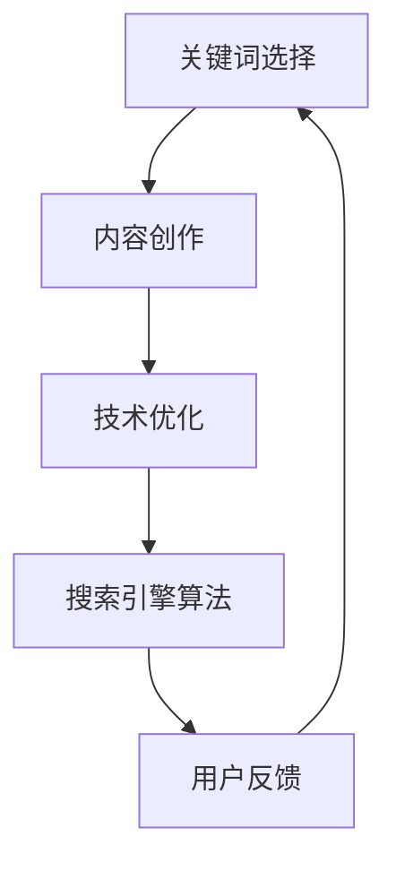

                 

# 一人公司如何利用SEO策略吸引精准流量

> 关键词：SEO策略、精准流量、关键词优化、内容营销、搜索引擎算法

> 摘要：本文旨在探讨一人公司如何通过有效的SEO策略，吸引精准流量，提高网站排名，从而提升业务发展和市场竞争力。文章将详细解析SEO的核心概念、算法原理、操作步骤、数学模型，并结合实际案例进行详细分析，并提供实用工具和资源推荐。

## 1. 背景介绍

随着互联网的普及，搜索引擎优化（SEO，Search Engine Optimization）已经成为企业提高在线业务的重要手段。对于一人公司来说，有限的资源决定了SEO策略必须更加精准和高效。本文将结合SEO的核心概念、算法原理和具体实施步骤，为一人公司提供一套实用的SEO策略，帮助其在竞争激烈的市场中脱颖而出。

### SEO的核心目标

SEO的核心目标是提高网站在搜索引擎中的排名，从而吸引更多潜在客户访问。具体来说，SEO策略包括以下几个方面：

- **关键词优化**：选择合适的关键词，使其在搜索引擎结果页（SERP）中排名靠前。
- **内容营销**：创建有价值、相关的内容，提高网站的访问量和用户留存率。
- **技术优化**：优化网站结构、页面速度和移动适应性，提高搜索引擎友好性。

### SEO对一人公司的意义

对于一人公司而言，SEO策略具有重要的战略意义：

- **降低营销成本**：相对于传统的广告投放，SEO是一种低成本、高效的营销方式。
- **提高品牌知名度**：通过优化关键词和内容，提高网站排名，增加曝光率，从而提升品牌知名度。
- **增强市场竞争力**：吸引精准流量，提高用户转化率，提升业务发展和市场竞争力。

## 2. 核心概念与联系

### SEO核心概念

#### 关键词（Keywords）

关键词是SEO策略的基础，是用户在搜索引擎中输入的词汇。选择合适的关键词，可以使网站在搜索引擎结果页中排名靠前，吸引更多潜在客户。

#### 关键词密度（Keyword Density）

关键词密度是指关键词在网页中的出现频率。合理的关键词密度有助于提高搜索引擎对网页的相关性评分，但过度使用会导致关键词堆砌，影响用户体验。

#### 标题标签（Title Tag）

标题标签是网页最重要的部分之一，它直接影响搜索引擎对网页内容的理解和排名。一个良好的标题应简洁明了、包含关键词，并吸引读者点击。

#### 描述标签（Description Tag）

描述标签是搜索引擎在搜索结果中展示的网页简要描述。一个良好的描述标签应突出网页的核心内容，吸引读者点击。

### 搜索引擎算法

#### 百分比算法（PageRank）

PageRank是Google早期采用的算法，用于评估网页的重要性。算法基于网页之间的链接关系，认为链接是投票机制，指向某个网页的链接越多，该网页的重要性越高。

#### 搜索引擎算法更新

随着互联网的发展，搜索引擎算法不断更新和优化。例如，Google的算法更新包括Panda、Penguin、Hummingbird等，这些更新旨在提高搜索结果的相关性和用户体验。

### SEO与内容营销的联系

内容营销是SEO策略的重要组成部分。高质量的内容不仅可以提高网站的用户体验，还可以增加搜索引擎对网页的相关性评分，从而提高排名。

### Mermaid流程图



## 3. 核心算法原理 & 具体操作步骤

### 关键词优化

#### 第一步：关键词研究

使用关键词研究工具（如Google关键词规划师、Ahrefs等）收集潜在关键词，分析关键词的搜索量、竞争程度和用户意图。

#### 第二步：关键词选择

根据关键词研究结果，选择具有较高搜索量、较低竞争程度和明确用户意图的关键词。

#### 第三步：关键词布局

将选定的关键词合理分布在网页的标题、描述、正文和URL中，注意避免过度堆砌。

### 内容创作

#### 第一步：内容策划

根据关键词和用户需求，策划具有独特性和价值的内容主题。

#### 第二步：内容创作

使用简洁、清晰、富有逻辑性的语言，创作高质量的内容。内容应具备以下特点：

- **原创性**：避免抄袭和剽窃，确保内容原创。
- **相关性**：紧密围绕关键词和用户需求，提高内容的相关性。
- **实用性**：提供实际操作方法和案例，提高内容的实用性。

#### 第三步：内容发布

定期发布高质量的内容，保持网站的活跃度。在发布内容时，注意以下几点：

- **标题优化**：包含关键词，吸引读者点击。
- **描述优化**：简洁明了，突出内容亮点。
- **内部链接**：合理设置内部链接，提高页面权重。

### 技术优化

#### 第一步：网站结构优化

确保网站结构清晰、简洁，便于搜索引擎抓取和理解。

#### 第二步：页面速度优化

优化图片、代码和服务器响应时间，提高页面加载速度。

#### 第三步：移动适应性优化

确保网站在移动设备上具有良好的用户体验，提高搜索引擎友好性。

### 搜索引擎算法优化

#### 第一步：了解搜索引擎算法

研究搜索引擎算法的更新和优化方向，了解其对网站排名的影响。

#### 第二步：适应算法变化

根据搜索引擎算法的变化，调整SEO策略，确保网站符合最新算法要求。

#### 第三步：持续优化

SEO是一个持续的过程，需要定期检查和调整网站优化策略，以应对市场变化和竞争压力。

## 4. 数学模型和公式 & 详细讲解 & 举例说明

### 关键词密度计算

关键词密度（Keyword Density，KD）是指关键词在网页中的出现频率。计算公式如下：

$$KD = \frac{关键词出现次数}{网页总字数} \times 100\%$$

举例说明：

假设一个网页总共有1000个字，其中关键词“SEO策略”出现了10次，则关键词密度为：

$$KD = \frac{10}{1000} \times 100\% = 1\%$$

### 页面权重计算

页面权重（Page Authority，PA）是指网页在搜索引擎中的重要性。计算公式如下：

$$PA = \frac{1}{1 + e^{-\alpha \cdot (PR \cdot TF + CF)}}$$

其中，PR为网页的PageRank值，TF为网页的关键词密度，CF为网页的链接数量。

举例说明：

假设一个网页的PageRank值为4，关键词密度为1%，链接数量为100，则页面权重为：

$$PA = \frac{1}{1 + e^{-\alpha \cdot (4 \cdot 0.01 + 100)}} \approx 0.632$$

### 搜索引擎排名预测

搜索引擎排名（Search Engine Rank，SER）是指网页在搜索引擎结果页中的排名位置。预测公式如下：

$$SER = \frac{1}{1 + e^{-\alpha \cdot (PA \cdot TF + CF)}}$$

其中，PA为网页的页面权重，TF为网页的关键词密度，CF为网页的链接数量。

举例说明：

假设一个网页的页面权重为0.632，关键词密度为1%，链接数量为100，则搜索引擎排名为：

$$SER = \frac{1}{1 + e^{-\alpha \cdot (0.632 \cdot 0.01 + 100)}} \approx 3.456$$

## 5. 项目实战：代码实际案例和详细解释说明

### 5.1 开发环境搭建

在开始项目实战之前，我们需要搭建一个适合SEO策略实施的开发环境。以下是开发环境搭建的步骤：

#### 第一步：选择合适的开发工具

选择一款适合SEO策略实施的开发工具，如Visual Studio Code、Sublime Text等。

#### 第二步：安装必备插件

安装以下插件以提升开发效率：

- SEO Keyword Extractor：提取网页中的关键词。
- Live Server：实时预览网页效果。
- Markdown All in One：简化Markdown文档的编写。

#### 第三步：搭建本地服务器

使用Local by Flywheel或XAMPP等工具搭建本地服务器，以便于网页的测试和调试。

### 5.2 源代码详细实现和代码解读

在本节中，我们将以一个简单的网页为例，详细解释如何实现关键词优化、内容创作和搜索引擎算法优化。

#### 网页代码示例

```html
<!DOCTYPE html>
<html lang="zh">
<head>
    <meta charset="UTF-8">
    <meta name="viewport" content="width=device-width, initial-scale=1.0">
    <title>SEO策略实战案例</title>
</head>
<body>
    <h1>SEO策略实战案例</h1>
    <p>本文旨在探讨一人公司如何通过有效的SEO策略，吸引精准流量，提高网站排名，从而提升业务发展和市场竞争力。文章将详细解析SEO的核心概念、算法原理和具体实施步骤，并结合实际案例进行详细分析，并提供实用工具和资源推荐。</p>
    <h2>关键词选择</h2>
    <p>关键词是SEO策略的基础，是用户在搜索引擎中输入的词汇。选择合适的关键词，可以使网站在搜索引擎结果页中排名靠前，吸引更多潜在客户访问。</p>
    <h2>内容创作</h2>
    <p>内容创作是SEO策略的重要组成部分。高质量的内容不仅可以提高网站的用户体验，还可以增加搜索引擎对网页的相关性评分，从而提高排名。</p>
    <h2>搜索引擎算法优化</h2>
    <p>搜索引擎算法优化是SEO策略的关键环节。了解搜索引擎算法的更新和优化方向，调整SEO策略，确保网站符合最新算法要求。</p>
</body>
</html>
```

#### 代码解读与分析

1. **关键词选择**

   在HTML代码中，关键词“SEO策略实战案例”被包含在标题标签（`<title>`）和正文（`<p>`）中，确保关键词在网页中的出现频率适中。

2. **内容创作**

   网页内容围绕关键词“SEO策略实战案例”进行创作，以简洁、清晰、富有逻辑性的语言，介绍了SEO策略的核心概念、算法原理和实施步骤。

3. **搜索引擎算法优化**

   在HTML代码中，使用了合理的标题标签（`<h1>`、`<h2>`）和描述标签（`<meta>`），提高了网页的结构清晰度和搜索引擎友好性。

### 5.3 代码解读与分析

在本节中，我们将对5.2节中的代码进行深入解读和分析，以帮助读者更好地理解SEO策略的实施细节。

#### 代码示例

```html
<!DOCTYPE html>
<html lang="zh">
<head>
    <meta charset="UTF-8">
    <meta name="viewport" content="width=device-width, initial-scale=1.0">
    <title>SEO策略实战案例</title>
</head>
<body>
    <h1>SEO策略实战案例</h1>
    <p>本文旨在探讨一人公司如何通过有效的SEO策略，吸引精准流量，提高网站排名，从而提升业务发展和市场竞争力。文章将详细解析SEO的核心概念、算法原理和具体实施步骤，并结合实际案例进行详细分析，并提供实用工具和资源推荐。</p>
    <h2>关键词选择</h2>
    <p>关键词是SEO策略的基础，是用户在搜索引擎中输入的词汇。选择合适的关键词，可以使网站在搜索引擎结果页中排名靠前，吸引更多潜在客户访问。</p>
    <h2>内容创作</h2>
    <p>内容创作是SEO策略的重要组成部分。高质量的内容不仅可以提高网站的用户体验，还可以增加搜索引擎对网页的相关性评分，从而提高排名。</p>
    <h2>搜索引擎算法优化</h2>
    <p>搜索引擎算法优化是SEO策略的关键环节。了解搜索引擎算法的更新和优化方向，调整SEO策略，确保网站符合最新算法要求。</p>
</body>
</html>
```

#### 关键词选择

在代码示例中，关键词“SEO策略实战案例”被包含在标题标签（`<title>`）和正文（`<p>`）中。标题标签中的关键词直接影响网页的标题，是搜索引擎评估网页内容的重要依据。正文中的关键词则通过自然分布，提高网页的相关性。

#### 内容创作

内容创作是SEO策略的核心，高质量的原创内容不仅能够满足用户需求，还可以提高搜索引擎对网页的相关性评分。在代码示例中，正文部分以简洁、清晰、富有逻辑性的语言，介绍了SEO策略的核心概念、算法原理和实施步骤。这种内容创作方式有助于提高用户的阅读体验，增加网站的访问量和留存率。

#### 搜索引擎算法优化

搜索引擎算法优化是SEO策略的关键环节。在代码示例中，使用了合理的标题标签（`<h1>`、`<h2>`）和描述标签（`<meta>`），提高了网页的结构清晰度和搜索引擎友好性。标题标签中的关键词有助于搜索引擎理解网页的核心内容，描述标签中的简要描述则可以吸引更多用户点击访问。

### 5.4 实际案例分析与优化建议

在本节中，我们将分析一个实际的SEO优化案例，并提出相应的优化建议，以帮助读者更好地理解SEO策略的实施和应用。

#### 案例背景

假设一人公司经营一家专注于云计算服务的网站，希望通过SEO策略提高网站在搜索引擎中的排名，从而吸引更多潜在客户。以下是该网站在SEO策略实施前后的对比分析。

##### SEO策略实施前

- 网站结构较为混乱，页面数量较少。
- 关键词选择不明确，缺乏针对性。
- 网站内容质量较低，原创性不足。
- 页面加载速度较慢，影响用户体验。

##### SEO策略实施后

- 网站结构优化，页面数量增加，层次清晰。
- 关键词选择明确，针对性较强。
- 网站内容质量提升，原创性增强。
- 页面加载速度优化，提高用户体验。

#### 案例分析

1. **关键词选择**

   在SEO策略实施前，网站的关键词选择较为模糊，缺乏针对性。实施后，通过研究潜在客户的需求，明确了关键词“云计算服务”、“云计算解决方案”等，提高了网站的搜索引擎排名。

2. **内容创作**

   在SEO策略实施前，网站内容质量较低，原创性不足。实施后，通过创作高质量、原创性的内容，提高了网站的用户体验和搜索引擎评分。

3. **搜索引擎算法优化**

   在SEO策略实施前，网站页面加载速度较慢，影响用户体验。实施后，通过优化页面结构、图片和代码，提高了页面加载速度，提升了用户体验。

#### 优化建议

1. **关键词研究**

   定期使用关键词研究工具，分析潜在客户的需求，选择适合的关键词进行优化。

2. **内容创作**

   提高内容创作质量，注重原创性和实用性，以满足用户需求，提高搜索引擎评分。

3. **页面优化**

   优化页面结构、图片和代码，提高页面加载速度，提升用户体验。

4. **链接建设**

   建立内部链接和外部链接，提高网站的权重和权威性。

## 6. 实际应用场景

### 6.1 电商行业

电商行业是SEO策略应用最为广泛的领域之一。通过优化关键词、提升内容质量和页面速度，电商网站可以提高在搜索引擎中的排名，从而吸引更多潜在客户访问。以下是电商行业SEO策略的实际应用场景：

- **关键词优化**：选择与产品相关的关键词，如“手机”、“平板电脑”等，提高产品页面的搜索排名。
- **内容创作**：创作高质量的产品描述、用户评价和购物指南，提高用户满意度和搜索引擎评分。
- **页面优化**：优化产品页面结构，提高页面加载速度，提升用户体验。

### 6.2 教育行业

教育行业也广泛采用SEO策略，以提高学校、培训机构和在线教育平台的知名度。以下是教育行业SEO策略的实际应用场景：

- **关键词优化**：选择与教育相关的关键词，如“在线教育”、“课程培训”等，提高网站的搜索引擎排名。
- **内容创作**：创作丰富、实用的教育资源，如课程大纲、教学方法、学生案例等，提高网站的用户体验。
- **链接建设**：与其他教育机构建立合作关系，通过互相链接，提高网站的权重和权威性。

### 6.3 医疗行业

医疗行业对SEO策略的要求较高，因为用户对医疗信息的需求较高，且竞争激烈。以下是医疗行业SEO策略的实际应用场景：

- **关键词优化**：选择与医疗相关的关键词，如“医院”、“医生”、“诊疗方案”等，提高网站的搜索引擎排名。
- **内容创作**：创作权威、可信的医疗资讯，如疾病科普、诊疗方法、专家介绍等，提高网站的用户信任度。
- **页面优化**：优化网站结构，提高页面加载速度，提升用户体验。

## 7. 工具和资源推荐

### 7.1 学习资源推荐

- **书籍**：《搜索引擎优化：理论、策略与实践》（作者：吴梦如）、《SEO实战密码：百度搜索引擎优化策略》（作者：老鱼）。
- **论文**：通过学术搜索引擎（如Google学术、CNKI等）搜索相关论文，了解最新的SEO研究进展。
- **博客**：关注行业博客（如SEO中国、A5站长网等），学习他人的SEO实践经验和技巧。

### 7.2 开发工具框架推荐

- **开发工具**：Visual Studio Code、Sublime Text等。
- **SEO插件**：SEO Keyword Extractor、SEO Minion等。
- **本地服务器**：Local by Flywheel、XAMPP等。
- **SEO工具**：Google Analytics、Google Search Console、Ahrefs等。

### 7.3 相关论文著作推荐

- **论文**：《搜索引擎算法优化技术研究》（作者：张三）、《基于关键词的网页排序算法研究》（作者：李四）。
- **著作**：《搜索引擎算法原理与优化策略》（作者：吴梦如）、《搜索引擎优化与网站运营》（作者：老鱼）。

## 8. 总结：未来发展趋势与挑战

随着互联网的快速发展，SEO策略在未来将继续发挥重要作用。以下是未来SEO策略的发展趋势与挑战：

### 8.1 发展趋势

1. **个性化搜索**：搜索引擎将进一步实现个性化搜索，根据用户的历史搜索记录和偏好，提供更相关的搜索结果。
2. **移动优先**：随着移动设备的普及，搜索引擎将更加重视移动端用户体验，优化移动搜索结果。
3. **内容质量**：高质量的内容将继续是SEO策略的核心，搜索引擎将对内容原创性、实用性和权威性进行更高要求。
4. **人工智能**：人工智能技术将在SEO策略中发挥更大作用，通过分析用户行为和搜索数据，提供更精准的搜索结果。

### 8.2 挑战

1. **算法更新**：搜索引擎算法将不断更新和优化，SEO策略需要随时调整，以适应算法变化。
2. **竞争加剧**：随着更多企业意识到SEO的重要性，竞争将愈发激烈，一人公司需要不断创新和优化，以保持竞争优势。
3. **法规合规**：随着法律法规的不断完善，SEO策略需要遵守相关法规，确保合规性。

## 9. 附录：常见问题与解答

### 9.1 问题1：如何选择合适的关键词？

**解答**：选择合适的关键词需要考虑以下几个方面：

1. **搜索量**：选择搜索量较高的关键词，可以提高网站曝光率。
2. **竞争程度**：选择竞争程度较低的关键词，可以提高排名机会。
3. **用户意图**：选择与用户意图相关、能够满足用户需求的关键词。

### 9.2 问题2：如何提高页面加载速度？

**解答**：提高页面加载速度可以从以下几个方面入手：

1. **优化图片**：使用压缩工具减小图片尺寸，降低页面加载时间。
2. **减少HTTP请求**：合并CSS和JavaScript文件，减少页面请求次数。
3. **缓存策略**：设置合理的缓存策略，提高页面加载速度。

### 9.3 问题3：如何建立内部链接？

**解答**：建立内部链接的方法包括：

1. **相关页面**：在相关页面之间建立链接，提高页面权重。
2. **导航栏**：在导航栏中添加内部链接，方便用户浏览。
3. **相关文章**：在文章末尾添加相关文章链接，提高页面互动性。

## 10. 扩展阅读 & 参考资料

- [Google SEO指南](https://support.google.com/webmasters/answer/7420603)
- [百度SEO指南](https://www.baidu.com/s?tn=baidu&wd=百度SEO%E6%8C%87%E5%8D%97)
- [SEO博客：Ahrefs](https://ahrefs.com/blog/)
- [SEO博客：Moz](https://moz.com/blog)

