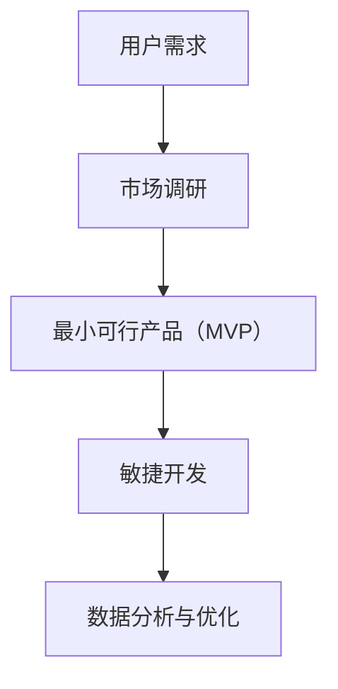

                 

# 一人公司如何实施精益创业方法论

## 关键词：一人公司、精益创业、方法论、创业策略、敏捷开发、产品迭代、市场调研、最小可行产品

## 摘要

本文将探讨如何将精益创业方法论应用于一人公司，帮助创业者快速验证商业想法，降低失败风险。我们将分析精益创业的核心概念、一人公司的独特挑战，以及如何通过市场调研、最小可行产品（MVP）开发和敏捷开发等方法，实现创业目标。此外，还将分享实用的工具和资源，帮助创业者更好地实施精益创业。

## 1. 背景介绍

近年来，一人公司逐渐成为创业圈的热门话题。相比传统的创业模式，一人公司具有灵活、高效、低成本的特点，尤其适合资源有限的创业者。然而，一人公司也面临许多挑战，如缺乏团队协作、资源有限、市场调研不足等。

精益创业方法论，起源于硅谷，是一种以用户需求为导向的创业方法。通过快速迭代、小步快跑，精益创业方法论帮助创业者不断优化产品，降低失败风险。本文将探讨如何将精益创业方法论应用于一人公司，帮助创业者实现创业目标。

### 1.1 一人公司的特点

- **灵活性强**：一人公司可以快速调整业务方向，适应市场变化。
- **高效运作**：无需复杂的沟通和决策流程，能够快速行动。
- **低成本**：无需承担员工薪酬、办公场地等成本。

### 1.2 一人公司的挑战

- **团队协作**：缺乏团队协作，一人公司的创新能力和执行力可能受限。
- **资源有限**：资金、时间、人脉等资源有限，影响业务发展。
- **市场调研**：缺乏专业的市场调研能力，可能导致产品定位不准确。

### 1.3 精益创业方法论

- **用户需求导向**：以用户需求为中心，不断迭代产品。
- **最小可行产品（MVP）**：快速开发简化版产品，验证市场需求。
- **数据分析**：通过数据反馈，优化产品功能和用户体验。

### 1.4 精益创业方法论的优势

- **降低失败风险**：通过快速迭代，及时发现和解决问题，降低失败风险。
- **提高效率**：聚焦用户需求，提高产品开发效率。
- **节省成本**：减少不必要的功能开发，降低成本。

## 2. 核心概念与联系

在本文中，我们将讨论以下几个核心概念，并使用Mermaid流程图来展示它们之间的关系。

### 2.1 精益创业方法论的核心概念

- **用户需求**：以用户需求为导向，是精益创业的核心。
- **最小可行产品（MVP）**：快速开发简化版产品，验证市场需求。
- **市场调研**：了解用户需求和竞争对手情况。
- **敏捷开发**：持续迭代产品，提高用户体验。

### 2.2 Mermaid流程图



### 2.3 精益创业方法论与一人公司的联系

- **用户需求**：一人公司需要了解用户需求，以确定产品方向。
- **市场调研**：通过市场调研，一人公司可以了解竞争对手、市场需求等信息。
- **最小可行产品（MVP）**：一人公司可以通过快速开发MVP，验证市场需求，降低失败风险。
- **敏捷开发**：一人公司可以利用敏捷开发方法，持续优化产品。
- **数据分析与优化**：通过数据分析，一人公司可以了解用户反馈，不断改进产品。

## 3. 核心算法原理 & 具体操作步骤

在本节中，我们将介绍如何实施精益创业方法论的具体操作步骤。以下是核心算法原理和操作步骤：

### 3.1 市场调研

- **步骤 1**：确定调研目标，例如了解用户需求、竞争对手情况等。
- **步骤 2**：选择合适的调研方法，如问卷调查、访谈等。
- **步骤 3**：收集数据，并对数据进行分析。

### 3.2 最小可行产品（MVP）开发

- **步骤 1**：确定产品功能，优先满足用户核心需求。
- **步骤 2**：设计产品原型，可以使用工具如Axure、Sketch等。
- **步骤 3**：开发MVP，聚焦关键功能，快速上线。

### 3.3 敏捷开发

- **步骤 1**：制定开发计划，包括任务分配、时间安排等。
- **步骤 2**：持续迭代，每个迭代周期为2-4周。
- **步骤 3**：评估迭代成果，并根据用户反馈进行调整。

### 3.4 数据分析与优化

- **步骤 1**：收集用户数据，如用户行为、反馈等。
- **步骤 2**：分析数据，了解用户需求和产品问题。
- **步骤 3**：根据数据分析结果，优化产品功能和用户体验。

## 4. 数学模型和公式 & 详细讲解 & 举例说明

在本节中，我们将介绍精益创业方法论中的一些关键数学模型和公式，并举例说明如何使用这些模型和公式进行产品优化。

### 4.1 用户留存率

用户留存率是指在一定时间内，持续使用产品的用户比例。计算公式如下：

$$
留存率 = \frac{t \text{ 时间内持续使用产品的用户数}}{初始注册用户数} \times 100\%
$$

#### 举例说明

假设一款应用在一个月内，初始注册用户数为1000人，其中500人在第一周使用了产品，400人在第二周使用了产品，300人在第三周使用了产品。计算该应用的用户留存率。

$$
留存率 = \frac{500 + 400 + 300}{1000} \times 100\% = 80\%
$$

### 4.2 转化率

转化率是指用户完成某一目标行为的比例，如购买产品、注册账号等。计算公式如下：

$$
转化率 = \frac{完成目标行为的用户数}{访问用户数} \times 100\%
$$

#### 举例说明

假设一款电商网站在一个月内，访问用户数为10000人，其中1000人完成了购买行为。计算该网站的转化率。

$$
转化率 = \frac{1000}{10000} \times 100\% = 10\%
$$

### 4.3 成本效益分析

成本效益分析用于评估产品开发的成本和预期收益。计算公式如下：

$$
成本效益比 = \frac{\text{预期收益}}{\text{开发成本}}
$$

#### 举例说明

假设一款应用的开发成本为10000元，预期收益为50000元。计算该应用的成本效益比。

$$
成本效益比 = \frac{50000}{10000} = 5
$$

## 5. 项目实战：代码实际案例和详细解释说明

在本节中，我们将通过一个实际项目案例，展示如何使用精益创业方法论进行产品开发和优化。

### 5.1 开发环境搭建

首先，我们需要搭建一个简单的开发环境。假设我们使用Python作为开发语言，以下是开发环境的搭建步骤：

1. 安装Python：在官方网站下载并安装Python。
2. 安装相关库：使用pip命令安装所需的Python库，如requests、beautifulsoup4等。

### 5.2 源代码详细实现和代码解读

以下是一个简单的Python项目，用于抓取网页数据并解析HTML标签。代码如下：

```python
import requests
from bs4 import BeautifulSoup

def fetch_url(url):
    response = requests.get(url)
    return response.text

def parse_html(html):
    soup = BeautifulSoup(html, 'html.parser')
    title = soup.title.string
    return title

if __name__ == '__main__':
    url = 'https://www.example.com'
    html = fetch_url(url)
    title = parse_html(html)
    print(f'网站标题：{title}')
```

#### 5.2.1 代码解读

- `fetch_url` 函数：用于获取网页内容。
- `parse_html` 函数：使用BeautifulSoup库解析HTML标签，获取网页标题。
- `if __name__ == '__main__':`：主函数，执行网页抓取和解析操作。

### 5.3 代码解读与分析

这个简单的项目实现了网页抓取和解析功能，可以帮助我们了解网页结构。以下是对代码的进一步解读和分析：

- **优点**：
  - 简单易用：代码结构简单，易于理解和维护。
  - 快速开发：使用Python和BeautifulSoup库，可以快速实现网页抓取和解析功能。

- **缺点**：
  - 网络依赖：项目依赖于网络连接，如果网络不稳定，可能导致数据获取失败。
  - 异常处理：代码中没有进行异常处理，可能导致程序崩溃。

### 5.4 优化建议

- **增加异常处理**：对网络请求和解析过程进行异常处理，确保程序稳定运行。
- **提高代码可读性**：对代码进行重构，提高代码可读性和可维护性。
- **添加功能**：根据用户需求，逐步添加更多功能，如内容提取、数据分析等。

## 6. 实际应用场景

精益创业方法论在一人公司的实际应用场景非常广泛，以下是一些具体的应用场景：

- **产品开发**：通过MVP快速验证市场需求，降低失败风险。
- **市场调研**：利用用户反馈和数据，优化产品功能和用户体验。
- **团队协作**：虽然一人公司缺乏团队协作，但可以通过外包、兼职等方式，实现团队协作。
- **成本控制**：通过敏捷开发，降低开发成本，提高资源利用效率。

## 7. 工具和资源推荐

### 7.1 学习资源推荐

- **书籍**：
  - 《精益创业》（The Lean Startup）——作者：埃里克·莱斯（Eric Ries）
  - 《人人都是产品经理》——作者：苏杰
- **博客**：
  - 知乎上的“精益创业”话题
  - Medium上的“精益创业”相关文章
- **网站**：
  - 精益创业官网（https://www.leanstack.com/）
  - MVP开发指南（https://mvpguide.com/）

### 7.2 开发工具框架推荐

- **开发工具**：
  - PyCharm：一款功能强大的Python开发工具。
  - Git：版本控制系统，方便代码管理和协作。
- **框架**：
  - Flask：Python Web开发框架，适合快速构建Web应用。
  - React：前端开发框架，适合构建交互式Web应用。

### 7.3 相关论文著作推荐

- **论文**：
  - “The Lean Startup”中的相关论文
  - “Minimum Viable Product”的相关论文
- **著作**：
  - 《创业维艰》（Hard Things About Hard Things）——作者：本·霍洛维茨（Ben Horowitz）

## 8. 总结：未来发展趋势与挑战

### 8.1 发展趋势

- **技术进步**：随着人工智能、大数据等技术的发展，精益创业方法论将更加智能化、数据驱动。
- **全球化**：随着全球化的推进，一人公司有望在全球范围内开展业务，实现更广泛的市场覆盖。
- **市场细分**：随着市场的不断细分，一人公司可以更加精准地满足用户需求，提高竞争力。

### 8.2 挑战

- **资源限制**：一人公司面临资源限制，如何合理利用有限的资源，实现可持续发展，是一个重要挑战。
- **竞争压力**：一人公司面临来自其他创业者和大公司的竞争，如何保持创新和竞争力，是一个关键挑战。
- **团队建设**：虽然一人公司可以灵活调整，但如何建立一个高效、有执行力的团队，也是一个挑战。

## 9. 附录：常见问题与解答

### 9.1 什么是精益创业方法论？

精益创业方法论是一种以用户需求为导向的创业方法，强调快速迭代、小步快跑，通过验证市场需求、降低失败风险。

### 9.2 如何实施精益创业方法论？

实施精益创业方法论主要包括以下步骤：市场调研、最小可行产品（MVP）开发、敏捷开发、数据分析与优化。

### 9.3 精益创业方法论适用于一人公司吗？

是的，精益创业方法论非常适合一人公司。通过快速验证市场需求、降低失败风险，一人公司可以更加灵活、高效地开展业务。

## 10. 扩展阅读 & 参考资料

- **书籍**：
  - 《精益创业》——作者：埃里克·莱斯（Eric Ries）
  - 《人人都是产品经理》——作者：苏杰
- **博客**：
  - 知乎上的“精益创业”话题
  - Medium上的“精益创业”相关文章
- **网站**：
  - 精益创业官网（https://www.leanstack.com/）
  - MVP开发指南（https://mvpguide.com/）
- **论文**：
  - “The Lean Startup”中的相关论文
  - “Minimum Viable Product”的相关论文
- **著作**：
  - 《创业维艰》——作者：本·霍洛维茨（Ben Horowitz）

### 作者信息：

- 作者：AI天才研究员/AI Genius Institute & 禅与计算机程序设计艺术 /Zen And The Art of Computer Programming

本文旨在帮助一人公司创业者了解和实施精益创业方法论，实现创业目标。通过本文的介绍和案例，创业者可以更好地把握市场需求，降低失败风险，实现可持续发展。希望本文对您的创业之路有所帮助！

