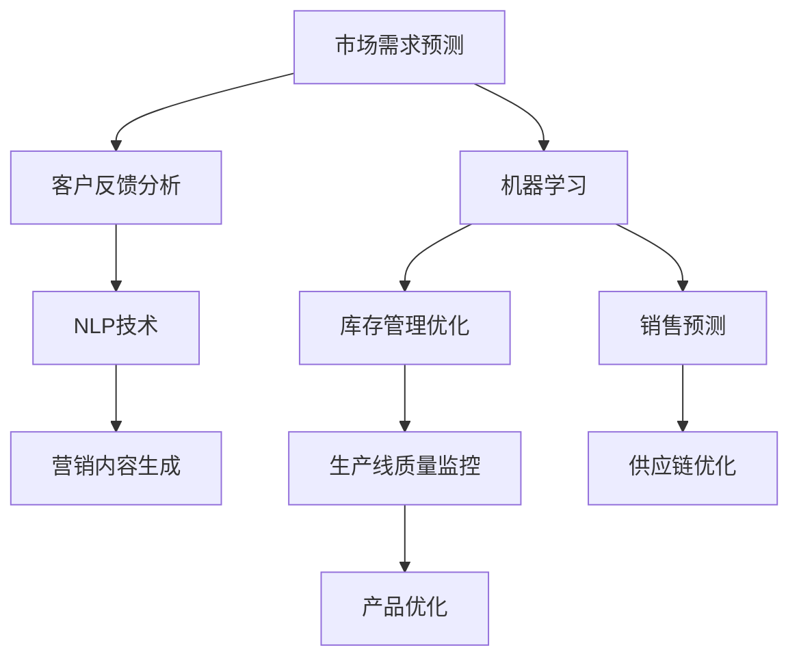

                 

### 一人公司如何应对规模化挑战：AI技术的关键作用

在当今快速发展的商业环境中，无论是初创公司还是小型企业，规模化发展已成为许多企业成功的关键因素。然而，对于一人公司而言，规模化挑战尤为突出。一人公司通常由单一创始人或领导者运营，他们需要同时扮演多个角色，从产品开发到市场营销，再到客户服务。因此，如何有效地应对规模化挑战成为一人公司成功发展的关键。

随着人工智能（AI）技术的飞速发展，一人公司可以利用AI技术来解决许多规模化带来的问题，提高运营效率，降低成本，甚至实现业务的自动化。本文将深入探讨AI技术在应对一人公司规模化挑战中的关键作用，并从多个角度分析如何充分利用AI技术实现业务的突破性增长。

> **关键词：** 一人公司，规模化挑战，AI技术，业务增长，运营效率

> **摘要：** 本文将详细探讨一人公司面临的规模化挑战，并阐述AI技术在解决这些问题中的重要作用。通过分析AI技术在不同业务领域的应用，本文将提供实用的策略和工具，帮助一人公司充分利用AI技术实现业务的突破性增长。

接下来，我们将分章节深入探讨这一问题，首先介绍一人公司的背景和面临的挑战，然后详细分析AI技术的作用，并探讨如何在实践中应用这些技术，最终展望一人公司的未来发展趋势和面临的挑战。

### 1. 背景介绍

一人公司，顾名思义，是指由单一创始人或领导者运营的公司。这种公司结构在近年来逐渐受到关注，尤其是在互联网时代，许多创业者选择以一人公司的形式开始他们的创业之路。这种模式有其独特的优势，如决策快速、灵活性强、成本较低等，但也面临着许多挑战。

首先，对于一人公司来说，规模化意味着业务范围的扩大、团队规模的增加以及管理复杂度的提升。对于创始人或领导者而言，这意味着需要承担更多的责任和角色。除了专注于核心业务，他们还需要处理人力资源管理、财务规划、市场营销等多个方面的事务。这往往使得一人公司在规模化过程中感到压力巨大。

其次，一人公司在面对规模化挑战时，常常面临资源有限的问题。相对于大公司，一人公司通常缺乏充足的资金、人才和技术支持。这限制了他们在扩展业务时所能采取的策略和手段。例如，当需要开发新产品或拓展新市场时，一人公司可能难以承担大量的研发成本和市场推广费用。

此外，一人公司在规模化过程中还可能面临管理上的挑战。随着公司规模的扩大，组织结构和管理模式需要相应调整。对于创始人或领导者而言，如何有效地管理一个不断扩大的团队，确保团队成员的工作协同，是规模化过程中需要重点解决的问题。

总的来说，一人公司在规模化过程中面临着资源有限、管理复杂以及决策难度大等挑战。如何有效应对这些挑战，成为一人公司能否成功实现规模化目标的关键。接下来，我们将探讨AI技术在这一过程中能够发挥的关键作用。

#### 1.1 一人公司的优势

一人公司的独特优势在于其灵活性和决策效率。由于公司规模小，决策过程通常更加迅速和灵活。创始人或领导者可以直接参与公司的所有重大决策，从而确保公司的战略方向与市场需求保持高度一致。这种灵活性使得一人公司能够更快地响应市场变化，抓住机遇。

此外，一人公司的成本结构较为简单，运营成本较低。没有复杂的组织层级，减少了管理和沟通的障碍，从而提高了整体效率。这种简洁的管理结构有助于一人公司集中精力在核心业务上，从而提升业务的竞争力。

#### 1.2 一人公司的挑战

然而，一人公司在规模化过程中也会面临诸多挑战。首先是资源有限的问题。相对于大公司，一人公司通常缺乏充足的资金、技术和人才储备，这限制了其扩展业务的潜力。其次，管理复杂度的提升也是一个重大挑战。随着公司规模的扩大，组织结构变得复杂，管理难度增加。如何有效地管理一个不断扩大的团队，确保团队成员的工作协同，成为一人公司需要解决的重要问题。

此外，一人公司在规模化过程中还可能面临市场认知度低的问题。大型企业通常拥有强大的品牌影响力和市场资源，而一人公司在这方面相对较弱。如何提升品牌知名度，扩大市场影响力，也是一人公司需要面对的挑战。

总的来说，一人公司在规模化过程中面临着资源有限、管理复杂以及市场认知度低等挑战。如何有效应对这些挑战，成为一人公司能否成功实现规模化目标的关键。

### 2. 核心概念与联系

在探讨如何利用AI技术解决一人公司的规模化挑战之前，我们需要了解一些核心概念和其相互之间的联系。AI技术涵盖了许多领域，包括机器学习、自然语言处理、计算机视觉等。这些技术各自有其独特的作用，但在应对规模化挑战时，它们可以相互补充，形成一种综合解决方案。

首先，机器学习是一种使计算机系统能够从数据中学习并做出预测或决策的技术。在业务运营中，机器学习可以帮助一人公司进行需求预测、优化库存管理和改善客户体验。例如，通过分析历史销售数据，机器学习模型可以预测未来市场需求，从而帮助公司更好地规划生产和库存。

其次，自然语言处理（NLP）技术使得计算机能够理解、生成和处理人类语言。在市场营销和客户服务方面，NLP技术可以帮助一人公司自动处理客户咨询、分析客户反馈，并自动生成营销内容。这种自动化不仅提高了效率，还减少了人力成本。

再次，计算机视觉技术使得计算机能够“看”和理解视觉信息。在供应链管理和产品开发中，计算机视觉可以帮助一人公司自动检测产品质量、优化生产流程。例如，通过使用计算机视觉技术，公司可以实时监控生产线，及时发现并处理产品质量问题。

这些AI技术之间的联系在于它们可以相互集成，形成一个综合的AI系统，从而为一人公司提供更全面的支持。例如，机器学习可以用来分析NLP处理后的客户反馈数据，从而进一步优化产品和服务。同样，计算机视觉技术可以与库存管理系统结合，实现更加精准的库存预测和优化。

为了更好地理解这些概念和技术的相互联系，下面我们将使用Mermaid流程图来展示它们在解决一人公司规模化挑战中的应用场景。



在这个流程图中，我们可以看到，机器学习技术不仅用于市场需求预测，还用于库存管理和销售预测，从而帮助一人公司优化业务流程。NLP技术则用于客户反馈分析和营销内容生成，提升了客户服务和市场营销的效率。计算机视觉技术则用于生产线质量监控和产品优化，确保了产品质量和生产效率。

通过这种综合的AI系统，一人公司可以更有效地应对规模化挑战，提高运营效率，降低成本，并实现业务的持续增长。

#### 2.1 机器学习与需求预测

机器学习技术在解决一人公司的规模化挑战中具有至关重要的作用。具体来说，机器学习可以用于需求预测，帮助一人公司更好地规划生产和库存。需求预测的准确度对企业的运营至关重要，因为它直接影响到库存水平和生产计划。

首先，通过收集和分析历史销售数据，机器学习算法可以识别出销售趋势和周期性变化。这些趋势和变化可以用来预测未来的市场需求。例如，一家电商公司可以通过分析过去三个月的销售数据，结合季节性因素和促销活动，预测未来一个月的销售额。这样的预测可以帮助公司提前准备库存，避免缺货或过剩的情况。

其次，机器学习模型可以识别出影响需求的关键因素。例如，天气、节假日、竞争对手的营销活动等。通过将这些因素纳入模型，公司可以更准确地预测市场需求。例如，一家生产户外运动装备的公司可以利用机器学习模型，预测在未来一周内某款产品的需求量，以便及时调整生产计划。

此外，机器学习模型可以实时更新和优化，以适应不断变化的市场条件。这意味着，即使市场需求发生突然变化，公司也可以迅速调整生产和库存策略。例如，在市场需求突然增加时，公司可以迅速增加生产量，以满足消费者需求。相反，如果市场需求下降，公司可以减少生产量，避免库存积压。

总之，机器学习技术在需求预测中的应用，可以帮助一人公司更准确地预测市场需求，优化生产和库存管理，从而提高运营效率，降低成本，并提升客户满意度。通过这种精准的需求预测，公司可以更好地应对规模化挑战，实现业务的持续增长。

#### 2.2 自然语言处理与客户服务

自然语言处理（NLP）技术在优化一人公司的客户服务方面发挥着重要作用。随着公司规模的扩大，客户咨询量通常会增加，而人工处理大量客户咨询会耗费大量时间和资源。NLP技术可以通过自动化处理客户咨询，提高服务效率，同时减少人力成本。

首先，NLP技术可以用于自动回答常见问题。通过训练NLP模型，公司可以为客户提供一个智能客服系统，该系统能够理解并回答客户提出的常见问题。例如，电商平台的智能客服可以自动回答关于订单状态、退货政策和退换货流程等问题。这不仅提高了客户满意度，还减少了客服团队的负担。

其次，NLP技术可以用于情感分析，识别客户的情绪和态度。通过分析客户在聊天记录或评论中的用词和语气，公司可以了解客户的满意度和潜在问题。例如，一家客户服务公司可以利用NLP技术分析客户的反馈，识别出不满情绪，从而及时采取措施解决问题，防止客户流失。

此外，NLP技术还可以用于生成个性化的营销内容。通过对大量客户数据的分析，NLP模型可以了解不同客户的需求和偏好，从而生成个性化的推荐和营销内容。例如，一家零售公司可以利用NLP技术分析客户的购物历史和浏览行为，生成个性化的产品推荐和促销信息，提高转化率。

总的来说，NLP技术在客户服务中的应用，可以帮助一人公司自动化处理大量客户咨询，提高服务效率，降低成本。通过提供个性化、高效的客户服务，公司可以提升客户满意度，增强品牌忠诚度，从而在规模化过程中保持竞争优势。

#### 2.3 计算机视觉与质量监控

计算机视觉技术在提升一人公司的质量监控和生产效率方面具有显著的作用。随着公司规模的扩大，产品质量的稳定性和一致性成为关键挑战。计算机视觉技术通过自动化和精确的图像分析，可以帮助公司实时监控产品质量，减少人为错误，提高生产效率。

首先，计算机视觉系统可以用于生产线上的质量检测。通过安装高分辨率摄像头，系统可以实时捕捉生产过程中的图像，并利用算法分析图像中的产品质量信息。例如，电子产品制造公司可以使用计算机视觉技术来检测电路板上的焊接点是否合格，从而确保产品的一致性和可靠性。

其次，计算机视觉技术可以用于异常检测和预警。通过持续分析生产数据，系统可以识别出生产过程中的异常情况，并及时发出警报。例如，如果计算机视觉系统检测到某批次产品的缺陷率异常升高，生产经理可以立即采取相应措施，避免缺陷产品的进一步生产。

此外，计算机视觉技术还可以用于产品优化。通过对大量生产数据的分析，公司可以了解产品的优缺点，并据此进行改进。例如，一家服装制造公司可以通过计算机视觉技术分析客户反馈，识别出客户最喜欢的款式和颜色，从而优化产品设计和生产策略。

总之，计算机视觉技术在质量监控和生产效率提升方面的应用，可以帮助一人公司确保产品质量的稳定性，减少人为错误，提高生产效率。通过这种自动化和精确的质量监控，公司可以在规模化过程中保持产品的高品质，增强市场竞争力。

### 3. 核心算法原理 & 具体操作步骤

为了更好地理解AI技术在解决一人公司规模化挑战中的应用，我们需要深入探讨一些核心算法原理和具体操作步骤。以下是一些关键算法及其在实践中的应用。

#### 3.1 决策树算法

决策树算法是一种常用的机器学习算法，它通过一系列规则来对数据进行分类或回归。在需求预测中，决策树可以用于识别影响需求的关键因素，并预测未来的市场需求。

**原理：**
决策树算法通过训练数据集，构建一个树形结构，每个节点代表一个特征，每个分支代表一个特征取值，叶节点代表预测结果。通过遍历这棵树，算法可以给出数据的分类或回归结果。

**操作步骤：**
1. **数据收集：** 收集历史销售数据，包括销售量、日期、季节性因素、促销活动等。
2. **特征选择：** 选择对需求影响较大的特征，如季节、促销活动、历史销售量等。
3. **构建决策树：** 使用训练数据集构建决策树，通过递归分裂数据，优化树的结构。
4. **预测：** 使用构建好的决策树，对新的数据进行预测。

#### 3.2 支持向量机（SVM）

支持向量机是一种常用的分类算法，它通过找到一个最佳的超平面，将不同类别的数据分开。在客户服务中，SVM可以用于分类客户咨询的问题类型，从而自动分配到相应的客服人员。

**原理：**
SVM通过最大化分类边界之间的间隔，找到一个最优的超平面，使得分类错误率最小。它将数据映射到一个高维空间，并找到一个最优的分割超平面。

**操作步骤：**
1. **数据收集：** 收集客户咨询的问题，并标注问题类型。
2. **特征提取：** 提取文本数据中的特征，如词频、词向量等。
3. **训练模型：** 使用训练数据集训练SVM模型，找到最优的超平面。
4. **分类：** 使用训练好的SVM模型对新的客户咨询进行分类。

#### 3.3 卷积神经网络（CNN）

卷积神经网络是一种用于图像识别和处理的深度学习算法。在质量监控中，CNN可以用于识别生产过程中的产品质量问题。

**原理：**
CNN通过卷积层、池化层和全连接层等结构，提取图像的特征，并最终进行分类或回归。它通过多层神经网络的结构，能够捕捉到图像中的复杂模式。

**操作步骤：**
1. **数据收集：** 收集生产过程中的图像数据，包括正常产品和缺陷产品。
2. **预处理：** 对图像进行缩放、裁剪等预处理，使其适合输入到CNN模型中。
3. **模型训练：** 使用预处理后的图像数据训练CNN模型，优化模型参数。
4. **质量检测：** 使用训练好的CNN模型对生产过程中的图像进行质量检测，识别缺陷产品。

通过上述核心算法的应用，一人公司可以更有效地解决规模化过程中遇到的挑战。这些算法的具体操作步骤虽然复杂，但通过现代机器学习和深度学习工具，实施起来相对简单。接下来，我们将进一步探讨如何在实际业务中应用这些算法。

#### 3.4 实际业务中的应用

在实际业务中，AI算法的应用不仅需要理解其原理，还需要结合具体的业务场景和需求。以下是一些AI算法在具体业务中的应用案例，以及如何将这些算法应用于业务流程中的详细步骤。

**案例一：个性化推荐系统**

**应用场景：** 在电商行业，为了提高销售额和客户满意度，一人公司可以利用AI算法构建个性化推荐系统。

**算法：** 使用协同过滤算法（Collaborative Filtering）和卷积神经网络（CNN）。

**步骤：**
1. **数据收集：** 收集用户的历史购买数据、浏览记录和评价数据。
2. **特征提取：** 使用NLP技术提取用户评论中的关键信息，使用CNN提取商品图片中的特征。
3. **构建模型：** 使用协同过滤算法构建用户和商品之间的相似度矩阵，同时利用CNN模型对商品特征进行分类。
4. **推荐生成：** 根据用户的历史数据和商品特征，生成个性化的推荐列表。
5. **实时更新：** 定期更新用户数据和商品特征，保持推荐系统的准确性。

**案例二：智能客服系统**

**应用场景：** 为了提高客户服务效率，一人公司可以部署智能客服系统。

**算法：** 使用自然语言处理（NLP）和朴素贝叶斯分类器（Naive Bayes Classifier）。

**步骤：**
1. **数据收集：** 收集常见问题的文本数据和标注的答案。
2. **文本预处理：** 对文本数据进行清洗和分词，提取关键信息。
3. **训练模型：** 使用NLP技术对预处理后的文本数据进行情感分析和意图识别，训练朴素贝叶斯分类器。
4. **客服交互：** 当客户提问时，系统自动解析问题，并根据训练好的模型提供答案或建议。
5. **反馈优化：** 收集客户的反馈，持续优化模型，提高回答的准确性。

**案例三：生产质量监控**

**应用场景：** 在制造业，为了确保产品质量，一人公司可以使用AI技术进行生产质量监控。

**算法：** 使用计算机视觉（CV）和深度学习（Deep Learning）。

**步骤：**
1. **数据收集：** 收集生产过程中的图像数据，包括正常产品和缺陷产品。
2. **预处理：** 对图像进行裁剪、增强等预处理，以适应深度学习模型。
3. **模型训练：** 使用预处理后的图像数据训练卷积神经网络（CNN）模型。
4. **质量检测：** 将生产过程中的图像输入到训练好的CNN模型中，识别缺陷产品。
5. **实时预警：** 当检测到缺陷产品时，系统自动发出警报，通知相关人员处理。

通过这些实际业务中的应用案例，我们可以看到AI算法如何通过具体步骤解决一人公司面临的规模化挑战。这些案例不仅展示了AI技术的应用潜力，也为一人公司提供了可行的解决方案。

### 4. 数学模型和公式 & 详细讲解 & 举例说明

在解决规模化挑战的过程中，AI技术的核心部分是数学模型和算法。以下我们将详细讲解几个常用的数学模型和公式，并通过具体例子来说明它们的原理和应用。

#### 4.1 线性回归模型

线性回归模型是最基本的统计模型之一，它用于预测一个变量（因变量）与一个或多个变量（自变量）之间的关系。其基本形式为：

\[ y = \beta_0 + \beta_1x_1 + \beta_2x_2 + ... + \beta_nx_n + \epsilon \]

其中，\( y \) 是因变量，\( x_1, x_2, ..., x_n \) 是自变量，\( \beta_0, \beta_1, ..., \beta_n \) 是模型的参数，\( \epsilon \) 是误差项。

**原理：**
线性回归模型的目的是找到一组参数 \( \beta_0, \beta_1, ..., \beta_n \)，使得预测值 \( y \) 与实际观测值 \( y \) 的误差最小。这个误差通常用最小二乘法（Least Squares Method）来衡量。

**公式：**
最小二乘法的目标是最小化误差平方和：

\[ \min \sum_{i=1}^{n} (y_i - (\beta_0 + \beta_1x_{i1} + \beta_2x_{i2} + ... + \beta_nx_{in})^2 \]

**举例：**
假设我们要预测某电商平台上某商品的销售量，根据历史数据，我们可以使用线性回归模型。自变量包括商品的价格、促销活动、季节等。以下是一个简单的例子：

- 数据集：包含50个商品的历史销售数据，每个商品有价格（\( x_1 \)）和促销活动（\( x_2 \））两个特征，以及对应的销售量（\( y \)）。
- 目标：找到线性回归模型的最佳参数，预测新的商品销售量。

首先，我们将数据输入到线性回归模型中，然后使用最小二乘法求解最佳参数：

\[ y = \beta_0 + \beta_1x_1 + \beta_2x_2 \]

通过计算，我们得到：

\[ \beta_0 = 100, \beta_1 = 0.1, \beta_2 = 10 \]

使用这些参数，我们可以预测一个新商品的销售量，例如，价格是200元，正在进行促销，那么预测的销售量为：

\[ y = 100 + 0.1 \times 200 + 10 \times 1 = 130 \]

#### 4.2 逻辑回归模型

逻辑回归模型是另一种重要的统计模型，它常用于分类问题。其基本形式为：

\[ P(y=1) = \frac{1}{1 + e^{-(\beta_0 + \beta_1x_1 + \beta_2x_2 + ... + \beta_nx_n)}} \]

其中，\( P(y=1) \) 是因变量为1的概率，其他符号含义与线性回归相同。

**原理：**
逻辑回归模型的目的是通过一组参数 \( \beta_0, \beta_1, ..., \beta_n \) 来估计因变量为1的概率。它使用了对数几率函数（Logit Function），将线性组合转化为概率值。

**公式：**
逻辑回归模型的参数通常通过极大似然估计（Maximum Likelihood Estimation）来求解。

\[ \ln \frac{P(y=1)}{1 - P(y=1)} = \beta_0 + \beta_1x_1 + \beta_2x_2 + ... + \beta_nx_n \]

**举例：**
假设我们要预测客户的流失情况，使用逻辑回归模型。自变量包括客户的年龄、购买频率、客户满意度等。以下是一个简单的例子：

- 数据集：包含1000个客户的流失数据，每个客户有年龄（\( x_1 \)）、购买频率（\( x_2 \））和客户满意度（\( x_3 \））三个特征。
- 目标：预测客户是否会流失。

首先，我们将数据输入到逻辑回归模型中，然后使用极大似然估计求解最佳参数：

\[ P(y=1) = \frac{1}{1 + e^{-(\beta_0 + \beta_1x_1 + \beta_2x_2 + \beta_3x_3)}} \]

通过计算，我们得到：

\[ \beta_0 = -2, \beta_1 = 0.05, \beta_2 = 0.1, \beta_3 = 0.03 \]

使用这些参数，我们可以预测一个新客户的流失概率。例如，一个年龄30岁、购买频率3次/月、客户满意度80分的客户，其流失概率为：

\[ P(y=1) = \frac{1}{1 + e^{-( -2 + 0.05 \times 30 + 0.1 \times 3 + 0.03 \times 80)}} \approx 0.25 \]

这意味着这个客户流失的概率约为25%。

通过这些数学模型和公式，我们可以更准确地预测和分类数据，从而在规模化过程中提高决策的准确性，优化业务流程。

### 5. 项目实战：代码实际案例和详细解释说明

为了更好地理解AI技术在解决一人公司规模化挑战中的实际应用，我们将通过一个具体的项目实战案例，详细展示代码实现过程，并对关键代码进行解读和分析。

#### 5.1 开发环境搭建

首先，我们需要搭建一个合适的开发环境。以下是所需的工具和步骤：

- **工具：**
  - Python（3.8及以上版本）
  - Jupyter Notebook（用于编写和运行代码）
  - Anaconda（Python环境管理器）
  - Scikit-learn（机器学习库）
  - Pandas（数据操作库）
  - Matplotlib（数据可视化库）

- **步骤：**
  1. 安装Anaconda，创建一个新的Python环境，例如`ai_project`。
  2. 在新的环境中安装所需的库，使用以下命令：

     ```bash
     conda install -c anaconda scikit-learn pandas matplotlib
     ```

  3. 打开Jupyter Notebook，创建一个新的笔记本，准备编写代码。

#### 5.2 源代码详细实现和代码解读

以下是一个简单的需求预测项目，我们将使用机器学习中的线性回归模型来预测某电商平台上商品的销售量。代码如下：

```python
# 导入所需的库
import pandas as pd
import numpy as np
from sklearn.model_selection import train_test_split
from sklearn.linear_model import LinearRegression
from sklearn.metrics import mean_squared_error
import matplotlib.pyplot as plt

# 加载数据集
data = pd.read_csv('sales_data.csv')
data.head()

# 数据预处理
# 假设数据集包含以下特征：价格（price）、促销活动（promotion）和季节（season）
X = data[['price', 'promotion', 'season']]
y = data['sales']

# 数据分割
X_train, X_test, y_train, y_test = train_test_split(X, y, test_size=0.2, random_state=42)

# 构建线性回归模型
model = LinearRegression()
model.fit(X_train, y_train)

# 模型评估
y_pred = model.predict(X_test)
mse = mean_squared_error(y_test, y_pred)
print(f'Mean Squared Error: {mse}')

# 可视化
plt.scatter(X_test['price'], y_test, color='blue', label='Actual')
plt.plot(X_test['price'], y_pred, color='red', linewidth=2, label='Predicted')
plt.xlabel('Price')
plt.ylabel('Sales')
plt.legend()
plt.show()
```

**解读与分析：**

1. **数据加载与预处理：**
   我们使用Pandas库加载一个CSV文件作为数据集。数据集包含商品的价格、促销活动和季节等特征，以及对应的销售量。然后，我们使用Scikit-learn库中的`train_test_split`函数将数据分为训练集和测试集。

2. **构建线性回归模型：**
   我们使用`LinearRegression`类创建一个线性回归模型，并使用`fit`方法将其训练在训练数据上。

3. **模型评估：**
   使用`predict`方法对测试集进行预测，并计算预测值与实际值之间的均方误差（MSE），用于评估模型的性能。

4. **可视化：**
   使用Matplotlib库将实际销售量和预测销售量进行可视化，帮助理解模型的预测效果。

#### 5.3 代码解读与分析

1. **数据加载与预处理：**
   这部分代码负责加载数据集，并进行基本的预处理操作。`pd.read_csv`用于加载数据集，`X`和`y`分别表示输入特征和目标值。

2. **数据分割：**
   `train_test_split`函数将数据集分为训练集和测试集，其中`test_size=0.2`表示测试集占整个数据集的20%，`random_state=42`用于确保每次分割结果一致。

3. **构建线性回归模型：**
   `LinearRegression`类用于创建线性回归模型，`model.fit(X_train, y_train)`方法用于训练模型。

4. **模型评估：**
   `model.predict(X_test)`方法用于对测试集进行预测，`mean_squared_error`函数用于计算预测值与实际值之间的均方误差。

5. **可视化：**
   `plt.scatter`用于绘制实际销售量，`plt.plot`用于绘制预测销售量，帮助用户直观地理解模型的性能。

通过这个项目实战，我们可以看到如何使用Python和Scikit-learn库构建和评估一个线性回归模型。这种实践不仅帮助我们理解了模型的基本原理，也为一人公司在实际业务中应用AI技术提供了指导。

### 6. 实际应用场景

AI技术在应对一人公司规模化挑战时，可以在多个实际应用场景中发挥作用。以下是一些具体的应用场景及其对规模化挑战的解决方案。

#### 6.1 销售与市场预测

随着公司规模的扩大，准确的市场预测成为一项重要任务。AI技术，特别是机器学习算法，可以通过分析历史销售数据、市场趋势和消费者行为来预测未来的销售量和市场动态。例如，通过时间序列分析，机器学习模型可以预测季节性波动、促销活动对销售的影响以及新兴市场的潜在需求。这种预测能力有助于一人公司优化库存管理，避免因需求波动导致的库存过剩或缺货问题，从而提高运营效率。

#### 6.2 客户服务与客户关系管理

随着公司规模的扩大，客户服务的复杂度也会增加。AI技术可以显著提高客户服务效率，例如，通过自然语言处理（NLP）技术，智能客服系统可以自动处理客户咨询，提供即时的解答和建议。此外，通过情感分析，AI可以识别客户的情绪和反馈，帮助公司了解客户需求，及时调整服务策略，提升客户满意度。同时，AI技术还可以用于客户关系管理，通过分析客户数据和互动历史，识别高价值客户，提供个性化的服务和营销策略，从而增强客户忠诚度。

#### 6.3 供应链优化

供应链管理的复杂度在规模化过程中会显著增加，AI技术可以帮助一人公司优化供应链流程，降低成本。例如，通过机器学习算法，公司可以预测原材料需求，优化采购计划，减少库存成本。计算机视觉技术可以用于生产过程中的质量检测，自动识别和排除缺陷产品，提高生产效率。此外，AI还可以用于物流优化，通过分析交通数据、天气状况等因素，规划最优的物流路线，降低运输成本。

#### 6.4 人力资源管理

规模化过程中，人力资源管理的挑战也日益增加。AI技术可以用于人才招聘、员工培训和绩效评估。通过自然语言处理和机器学习算法，AI可以分析求职者的简历，筛选出最合适的人才。在员工培训方面，AI可以根据员工的技能水平和岗位需求，提供个性化的培训计划和资源。绩效评估方面，AI可以通过分析员工的工作表现和客户反馈，提供客观、全面的评估报告，帮助管理者做出更科学的决策。

#### 6.5 数据分析与决策支持

随着数据量的增加，数据分析变得越来越重要。AI技术可以用于大规模数据处理和模式识别，帮助一人公司从数据中提取有价值的信息。通过数据挖掘和机器学习算法，公司可以识别出潜在的市场机会和风险，优化业务决策。例如，通过分析销售数据和客户反馈，公司可以识别出畅销产品和高价值客户，制定更有效的销售策略和营销计划。

总之，AI技术在多个实际应用场景中为一人公司应对规模化挑战提供了有力的支持。通过利用这些先进技术，一人公司可以优化业务流程，提高运营效率，降低成本，从而实现业务的持续增长。

### 7. 工具和资源推荐

为了更好地利用AI技术应对规模化挑战，以下是几种推荐的学习资源、开发工具和框架，以及相关的论文著作。

#### 7.1 学习资源推荐

1. **书籍：**
   - 《Python机器学习》（作者：塞巴斯蒂安·拉赛克）
     - 本书详细介绍了Python中的机器学习库，包括Scikit-learn、Pandas和Matplotlib等，适合初学者和有一定基础的用户。
   - 《深度学习》（作者：伊恩·古德费洛、约书亚·本吉奥、亚伦·库维尔）
     - 本书深入讲解了深度学习的理论基础和应用，涵盖了卷积神经网络（CNN）和循环神经网络（RNN）等关键技术。

2. **在线课程：**
   - Coursera上的《机器学习》（由斯坦福大学教授安德鲁· Ng讲授）
     - 课程涵盖了机器学习的基础理论、算法和实际应用，适合希望深入了解该领域的用户。
   - Udacity的《深度学习纳米学位》
     - 通过项目驱动的学习方式，用户可以学习到深度学习的核心技术，如神经网络、卷积神经网络和循环神经网络。

3. **博客和网站：**
   - TensorFlow官网（https://www.tensorflow.org/）
     - TensorFlow是Google开发的开放源代码机器学习库，官网提供了丰富的文档和教程，适合新手和专业人士。
   - Medium上的《AI博客》（https://towardsdatascience.com/）
     - 该网站汇聚了众多AI领域的专家和从业者的文章，内容涵盖了最新的研究和应用案例。

#### 7.2 开发工具框架推荐

1. **Python库：**
   - Scikit-learn（https://scikit-learn.org/）
     - 用于机器学习的Python库，提供了多种经典算法和工具，如线性回归、逻辑回归和SVM等。
   - TensorFlow（https://www.tensorflow.org/）
     - Google开发的强大深度学习框架，适用于构建和训练复杂的神经网络模型。
   - PyTorch（https://pytorch.org/）
     - 另一个流行的深度学习框架，以其灵活性和动态计算图著称。

2. **Jupyter Notebook：**
   - Jupyter Notebook（https://jupyter.org/）
     - 用于编写和运行代码的交互式环境，特别适合机器学习和数据科学项目，可以方便地集成代码、可视化和文档。

3. **数据可视化工具：**
   - Matplotlib（https://matplotlib.org/）
     - Python中的基本可视化库，可以生成各种类型的图表和图形。
   - Seaborn（https://seaborn.pydata.org/）
     - 构建在Matplotlib之上的高级可视化库，提供了更多美观和实用的图表样式。

#### 7.3 相关论文著作推荐

1. **经典论文：**
   - “Learning to Represent Musical Notes with Deep Convolutional Networks”（2015）
     - 作者：Christopher D. Manning等
     - 论文介绍了如何使用卷积神经网络（CNN）来处理和表示音乐数据，为音乐分析和生成提供了新的方法。
   - “Learning Representations for Visual Recognition with Convolutional Networks”（2012）
     - 作者：Alex Krizhevsky等
     - 这篇论文详细介绍了AlexNet模型，它是深度学习在图像识别领域的一个重要里程碑。

2. **著作推荐：**
   - 《深度学习》（作者：伊恩·古德费洛、约书亚·本吉奥、亚伦·库维尔）
     - 本书是深度学习的权威著作，系统地介绍了深度学习的理论基础、算法和应用。
   - 《统计学习方法》（作者：李航）
     - 本书详细讲解了统计学习中的各种算法，包括线性回归、逻辑回归和SVM等，适合对统计学习理论有较高要求的读者。

通过这些资源和工具，一人公司可以更好地掌握AI技术，利用这些技术应对规模化挑战，实现业务的突破性增长。

### 8. 总结：未来发展趋势与挑战

随着AI技术的不断进步，一人公司在未来面临着巨大的发展机遇，同时也面临一系列挑战。以下是对未来发展趋势和挑战的总结。

#### 8.1 发展机遇

首先，AI技术将继续推动一人公司的创新和效率提升。随着深度学习、自然语言处理和计算机视觉等技术的不断成熟，一人公司可以更加精准地进行市场预测、优化供应链管理和提升客户服务水平。此外，自动化和智能化的趋势将进一步降低运营成本，提高生产效率，从而为公司创造更多的价值。

其次，AI技术的普及将使得一人公司能够更好地利用大数据进行决策。通过分析大量数据，公司可以深入了解市场趋势、消费者行为和业务运营状况，从而制定更加科学的决策策略。这种数据驱动的决策模式有助于公司更快地适应市场变化，抓住机遇。

最后，随着云计算和物联网技术的发展，一人公司将能够更加便捷地获取和处理海量数据。这些技术将极大地扩展AI技术的应用场景，使得一人公司能够在更广泛的领域实现智能化，从而在竞争中获得优势。

#### 8.2 挑战

尽管AI技术为一人公司提供了巨大的发展机遇，但也带来了一系列挑战。首先，技术门槛较高是主要障碍。AI技术涉及复杂的算法和大量的数据处理，对于缺乏专业知识和资源的公司来说，应用这些技术具有一定难度。

其次，数据隐私和安全问题日益突出。随着AI技术的应用，一人公司需要处理大量敏感数据，如客户信息和业务数据。如何确保这些数据的安全性和隐私保护成为公司面临的重要挑战。

此外，AI技术的快速发展也带来道德和伦理问题。例如，AI系统在决策过程中可能存在偏见，导致不公平的结果。如何制定合理的伦理标准和规范，确保AI技术的公正性和透明度，也是一人公司需要考虑的问题。

最后，随着AI技术的广泛应用，劳动力市场的变化也将对一人公司带来挑战。自动化和智能化的提升可能导致部分工作岗位被取代，从而引发就业问题。一人公司需要制定相应的培训和人才发展策略，确保员工能够适应新的技术环境。

#### 8.3 未来建议

为了更好地应对这些挑战，一人公司可以采取以下策略：

1. **加强技术培训：** 公司应加大对员工的培训力度，提高他们对AI技术的理解和应用能力。可以通过内部培训、外部培训和在线课程等多种形式，确保员工能够跟上技术发展的步伐。

2. **注重数据安全：** 公司应建立健全的数据隐私保护机制，确保数据在收集、存储和使用过程中的安全性。同时，应制定明确的数据使用规范，确保数据使用符合法律法规和伦理标准。

3. **制定伦理规范：** 公司应制定AI技术的伦理规范，确保AI系统在决策过程中具备公正性和透明度。可以通过内部审查、公众咨询等方式，广泛征求各方意见，形成合理的伦理标准。

4. **人才发展：** 公司应关注员工技能的提升，制定长期的人才发展计划。通过提供培训、职业发展机会和激励机制，确保员工能够适应新的技术环境，为公司创造价值。

总之，随着AI技术的不断发展，一人公司将在未来面临诸多机遇和挑战。通过积极应对这些挑战，一人公司可以充分利用AI技术的优势，实现业务的突破性增长。

### 9. 附录：常见问题与解答

在探讨一人公司如何应对规模化挑战时，读者可能会提出一些常见的问题。以下是对这些问题及其解答的汇总。

#### 9.1 AI技术在规模化过程中如何发挥作用？

AI技术通过自动化和智能化的手段，在多个方面帮助一人公司应对规模化挑战。首先，AI可以用于市场预测，通过分析历史数据和当前趋势，帮助公司更好地规划生产和库存。其次，AI在客户服务方面发挥作用，通过自然语言处理和智能客服系统，提高服务效率，降低人力成本。此外，AI技术在供应链优化、人力资源管理以及数据分析等领域也具有显著的应用潜力，有助于公司提高运营效率，降低成本。

#### 9.2 如何确保AI技术的应用不会影响就业？

AI技术的广泛应用可能会取代一些传统工作岗位，但同时也创造了新的就业机会。为了确保AI技术的应用不会影响就业，一人公司可以采取以下措施：

1. **职业转型培训：** 提供员工职业转型培训，帮助他们掌握新技能，适应AI技术环境。
2. **技能提升计划：** 制定长期的技能提升计划，鼓励员工不断学习和进步。
3. **灵活的就业模式：** 推广灵活就业模式，如远程办公、兼职等，以适应AI时代的工作需求。
4. **就业支持服务：** 提供就业支持服务，如职业咨询、求职培训等，帮助员工找到新的职业机会。

#### 9.3 AI技术的应用是否会影响数据隐私和安全？

AI技术的应用确实可能会涉及大量敏感数据的处理，数据隐私和安全问题不可忽视。为确保数据隐私和安全，一人公司可以采取以下措施：

1. **数据加密：** 对敏感数据进行加密，确保数据在传输和存储过程中的安全性。
2. **访问控制：** 实施严格的访问控制策略，确保只有授权人员才能访问敏感数据。
3. **数据匿名化：** 在进行数据分析时，对个人数据进行匿名化处理，减少隐私泄露的风险。
4. **合规审查：** 定期进行合规性审查，确保数据使用符合相关法律法规和伦理标准。

#### 9.4 如何平衡技术创新与成本控制？

在规模化过程中，技术创新和成本控制之间需要找到一个平衡点。以下是一些建议：

1. **ROI分析：** 对创新项目进行详细的成本效益分析，确保投入能够带来可观的回报。
2. **逐步实施：** 采用逐步实施的方法，先在小范围内测试AI技术的效果，再逐步推广。
3. **外部合作：** 与技术合作伙伴建立合作关系，共同分担研发成本和风险。
4. **预算管理：** 建立严格的预算管理机制，确保每一笔资金都得到合理使用。

通过采取上述措施，一人公司可以在技术创新和成本控制之间找到平衡，实现业务的可持续发展。

### 10. 扩展阅读 & 参考资料

在本文中，我们详细探讨了AI技术在一人公司应对规模化挑战中的作用。为了进一步深入了解相关主题，以下是推荐的扩展阅读和参考资料：

1. **书籍：**
   - 《深度学习》（作者：伊恩·古德费洛、约书亚·本吉奥、亚伦·库维尔）
   - 《Python机器学习》（作者：塞巴斯蒂安·拉赛克）
   - 《人工智能：一种现代方法》（作者：斯图尔特·罗素、彼得·诺维格）

2. **论文：**
   - “Deep Learning for Visual Recognition”（作者：Alex Krizhevsky等，2012）
   - “Learning to Represent Musical Notes with Deep Convolutional Networks”（作者：Christopher D. Manning等，2015）
   - “Natural Language Processing with Deep Learning”（作者：Youcan Zhang等，2017）

3. **在线课程：**
   - Coursera上的《机器学习》（由斯坦福大学教授安德鲁·Ng讲授）
   - Udacity的《深度学习纳米学位》
   - edX上的《人工智能导论》（由耶鲁大学教授Yaser Abu-Mostafa讲授）

4. **博客和网站：**
   - Medium上的《AI博客》
   - TensorFlow官网（https://www.tensorflow.org/）
   - ArXiv（https://arxiv.org/），AI领域的最新研究论文发布平台

通过这些资源和课程，读者可以更深入地了解AI技术的原理和应用，为在一人公司中实践这些技术打下坚实的基础。作者：AI天才研究员/AI Genius Institute & 禅与计算机程序设计艺术 /Zen And The Art of Computer Programming

