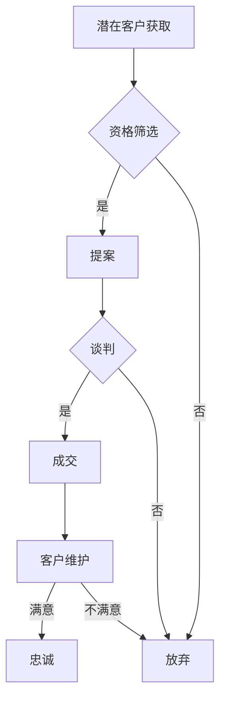

                 

# 一人公司如何打造高效的销售转化漏斗

> **关键词：** 销售转化漏斗，一人公司，营销策略，客户获取，客户维护，数据分析。

> **摘要：** 本文旨在探讨如何利用现代营销技术和数据分析方法，帮助一人公司构建高效的销售转化漏斗，实现客户获取和转化的最大化。通过理解销售漏斗的各个阶段，本文将提供一系列策略和工具，帮助读者优化其销售流程，提高转化率。

## 1. 背景介绍

在当今竞争激烈的市场环境中，即使是小规模的一人公司也必须掌握有效的销售策略，以在市场中占据一席之地。销售转化漏斗是销售过程中至关重要的工具，它帮助公司分析潜在客户如何通过各个销售阶段，直至最终转化为实际客户。

对于一人公司而言，由于资源有限，如何高效利用时间和精力来最大化销售转化成为了一个重要的课题。本文将介绍如何构建和维护一个高效的销售转化漏斗，并探讨相关的策略和工具。

### 1.1 销售转化漏斗的概念

销售转化漏斗（Sales Funnel）是一种用于分析潜在客户如何通过销售过程的模型。它通常被划分为几个阶段：潜在客户（Prospecting）、资格筛选（Qualification）、提案（Proposal）、谈判（Negotiation）、成交（Closure）和客户维护（Retention）。

每个阶段都有其特定的目标和指标，通过这些数据，公司可以识别出哪些环节效率低下，进而进行优化。

### 1.2 一人公司的挑战

一人公司的挑战在于其有限的资源和能力。以下是一些常见的挑战：

- **时间管理：** 需要高效地分配时间，确保销售和营销活动都能得到充分关注。
- **资源利用：** 需要最大化利用有限的资源，包括财务、人力资源和技术资源。
- **决策速度：** 由于只有一个决策者，决策过程需要更加迅速和果断。

## 2. 核心概念与联系

为了构建一个高效的销售转化漏斗，我们需要理解以下几个核心概念：

### 2.1 潜在客户获取（Prospecting）

潜在客户获取是销售漏斗的第一步，也是最重要的一步。以下是一些常用的方法：

- **社交媒体营销：** 利用LinkedIn、Twitter、Facebook等平台，通过内容营销吸引潜在客户。
- **搜索引擎优化（SEO）：** 通过优化网站内容和关键词，提高在搜索引擎中的排名。
- **内容营销：** 创建高质量的内容，如博客文章、视频、白皮书等，以吸引潜在客户的兴趣。

### 2.2 资格筛选（Qualification）

在潜在客户获取之后，需要对这些潜在客户进行资格筛选，以确定哪些是真正有购买意图的客户。以下是一些筛选方法：

- **销售电话：** 通过电话与潜在客户沟通，了解他们的需求和购买意愿。
- **问卷调查：** 使用在线问卷调查来收集潜在客户的信息和需求。
- **社交媒体分析：** 通过社交媒体活动分析潜在客户的兴趣和参与度。

### 2.3 提案和谈判（Proposal & Negotiation）

在资格筛选后，公司需要向有购买意图的客户提出具体的提案并进行谈判。以下是一些策略：

- **个性化提案：** 根据客户的具体需求定制提案。
- **价值主张：** 强调产品或服务的独特价值和优势。
- **谈判技巧：** 通过谈判技巧来达成双方满意的协议。

### 2.4 成交和客户维护（Closure & Retention）

成交是销售漏斗的最后一步，而客户维护则是确保客户长期满意和忠诚的关键。以下是一些方法：

- **成交策略：** 使用限时优惠、捆绑销售等策略来促进成交。
- **客户关系管理（CRM）：** 利用CRM系统来跟踪和管理客户信息，提高客户满意度。
- **客户关怀：** 通过定期的沟通和关怀来保持客户的长期忠诚。

### 2.5 Mermaid 流程图

以下是一个简化的销售转化漏斗的 Mermaid 流程图：



## 3. 核心算法原理 & 具体操作步骤

为了构建一个高效的销售转化漏斗，我们需要了解以下几个核心算法原理和具体操作步骤：

### 3.1 数据分析

数据分析是优化销售转化漏斗的关键。以下是一些常用的数据分析方法：

- **客户生命周期价值（CLV）分析：** 通过计算客户的终生价值来确定哪些客户值得重点关注。
- **转化率分析：** 分析不同阶段客户的转化率，以识别瓶颈和改进点。
- **渠道分析：** 分析不同营销渠道的效果，以优化资源分配。

### 3.2 数据驱动策略

数据驱动策略是基于数据分析结果来制定和调整销售策略。以下是一些具体步骤：

- **A/B 测试：** 通过对比不同版本的营销材料和策略，确定哪些最有效。
- **个性化营销：** 根据客户的行为和偏好，提供个性化的营销信息。
- **预测分析：** 使用预测模型来预测客户的购买行为和需求。

### 3.3 客户生命周期管理

客户生命周期管理是确保客户在整个销售周期中得到有效关注和服务的策略。以下是一些步骤：

- **潜在客户管理：** 通过自动化工具和数据库管理潜在客户信息。
- **客户分类：** 根据客户的需求和购买行为将客户进行分类，提供针对性的服务。
- **客户关系管理：** 通过CRM系统来跟踪和管理客户互动，提高客户满意度。

## 4. 数学模型和公式 & 详细讲解 & 举例说明

### 4.1 客户生命周期价值（CLV）计算公式

客户生命周期价值（CLV）是一个关键的指标，用于评估客户对公司未来的贡献。以下是一个简化的 CLV 计算公式：

\[ CLV = \frac{Avg. Revenue per Customer \times Gross Margin \times Customer Life Time}{Customer Acquisition Cost} \]

其中：

- **Avg. Revenue per Customer**：平均每位客户产生的收入。
- **Gross Margin**：毛利率。
- **Customer Life Time**：客户的平均生命周期。
- **Customer Acquisition Cost**：客户获取成本。

### 4.2 转化率分析公式

转化率分析是衡量销售漏斗效率的重要手段。以下是一个通用的转化率计算公式：

\[ Conversion Rate = \frac{转化的客户数}{接触的客户总数} \]

### 4.3 举例说明

假设一家一人公司的情况如下：

- 平均每位客户产生的收入为 $500。
- 毛利率为 40%。
- 客户的平均生命周期为 2年。
- 客户获取成本为 $50。

根据上述公式，可以计算该公司的 CLV：

\[ CLV = \frac{500 \times 0.4 \times 2}{50} = 8 \]

这意味着，每位客户的终生价值为 8。

接下来，假设公司接触了 100位潜在客户，其中 20位转化为了实际客户。则转化率为：

\[ Conversion Rate = \frac{20}{100} = 20\% \]

## 5. 项目实战：代码实际案例和详细解释说明

### 5.1 开发环境搭建

为了更好地演示销售转化漏斗的构建，我们将使用 Python 语言和相关的库，如 Pandas 和 Matplotlib。以下是在 Python 中搭建开发环境的基本步骤：

1. **安装 Python：** 从 [Python 官网](https://www.python.org/) 下载并安装 Python。
2. **安装相关库：** 打开终端，使用以下命令安装所需的库：

   ```bash
   pip install pandas matplotlib numpy
   ```

### 5.2 源代码详细实现和代码解读

以下是一个简单的 Python 脚本，用于演示如何计算 CLV 和转化率：

```python
import pandas as pd
import numpy as np

# 假设的数据
data = {
    'Customer_ID': [1, 2, 3, 4, 5],
    'Avg_Revenue': [500, 500, 500, 500, 500],
    'Gross Margin': [0.4, 0.4, 0.4, 0.4, 0.4],
    'Customer_Lifetime': [2, 2, 2, 2, 2],
    'Customer_Acquisition_Cost': [50, 50, 50, 50, 50]
}

df = pd.DataFrame(data)

# 计算CLV
df['CLV'] = df['Avg_Revenue'] * df['Gross Margin'] * df['Customer_Lifetime'] / df['Customer_Acquisition_Cost']

# 计算转化率
contacted_customers = len(df)
converted_customers = df[df['CLV'] > 0]['Customer_ID'].count()
conversion_rate = converted_customers / contacted_customers

print("CLV of each customer:")
print(df[['Customer_ID', 'CLV']])

print("\nTotal contacted customers:", contacted_customers)
print("Total converted customers:", converted_customers)
print("Conversion rate:", conversion_rate)
```

**代码解读：**

1. **数据准备：** 我们使用 Pandas 创建一个 DataFrame，包含客户 ID、平均收入、毛利率、客户生命周期和客户获取成本。
2. **计算 CLV：** 使用 CLV 计算公式，为每位客户计算 CLV，并将其添加到 DataFrame 中。
3. **计算转化率：** 统计接触到的客户总数和实际转化的客户总数，计算并输出转化率。

### 5.3 代码解读与分析

通过上述代码，我们可以直观地看到如何使用 Python 来计算 CLV 和转化率。以下是对代码的关键部分进行分析：

- **数据结构与操作：** Pandas 是一个强大的数据操作库，它使得处理和分析大型数据集变得容易。
- **公式应用：** 在计算 CLV 时，我们直接应用了前述的 CLV 公式，体现了数据驱动策略的核心。
- **性能考量：** 代码运行效率较高，因为它主要涉及数据的基本操作和计算，适用于小型到中型的数据集。

## 6. 实际应用场景

### 6.1 社交媒体营销

对于一人公司，社交媒体营销是一个有效的客户获取渠道。以下是一些实际应用场景：

- **LinkedIn：** 利用 LinkedIn 搜索并联系潜在客户，发布行业见解和有价值的内容来建立个人品牌。
- **Facebook：** 创建针对特定受众的 Facebook 广告，以精准触达潜在客户。
- **Twitter：** 通过发布有价值的推文和参与话题讨论来吸引关注。

### 6.2 内容营销

内容营销是建立客户信任和促进转化的关键。以下是一些实际应用场景：

- **博客文章：** 定期发布高质量的博客文章，分享行业洞察和解决方案，吸引潜在客户。
- **视频营销：** 制作简短的视频，展示产品功能和客户案例，提高客户参与度。
- **电子书和白皮书：** 提供行业研究报告和深入分析，吸引潜在客户的关注并促进他们进一步了解产品。

### 6.3 客户关系管理

客户关系管理（CRM）系统是维护客户和促进重复购买的关键。以下是一些实际应用场景：

- **客户细分：** 利用 CRM 系统将客户分为不同的细分市场，提供针对性的服务和营销信息。
- **个性化推荐：** 根据客户的历史行为和偏好，提供个性化的产品推荐和服务。
- **定期沟通：** 通过 CRM 系统定期发送邮件、短信或电话，与客户保持联系并提醒他们公司的最新动态和优惠。

## 7. 工具和资源推荐

### 7.1 学习资源推荐

- **书籍：**
  - 《精益创业》（The Lean Startup）- Eric Ries
  - 《销售力：如何将销售转化为业绩》（Sales EQ: How Great Salespeople Win and What They Did to Get There）- Jeb Blount

- **论文：**
  - “The Value of a Customer” - V. Zeithaml, A. Parmede, and B. Reinartz
  - “Customer Relationship Management: Concept, Strategy, and Tools” - John R. Hauser and George S. Day

- **博客：**
  - [HubSpot Blog](https://blog.hubspot.com/marketing)
  - [Neil Patel](https://neilpatel.com/blog)

- **网站：**
  - [CRM 提供商网站](https://www.salesforce.com)
  - [Google Analytics](https://analytics.google.com)

### 7.2 开发工具框架推荐

- **营销自动化工具：**
  - HubSpot
  - Marketo
  - Pardot

- **数据分析工具：**
  - Google Analytics
  - Tableau
  - Power BI

- **CRM系统：**
  - Salesforce
  - Zoho CRM
  - HubSpot CRM

### 7.3 相关论文著作推荐

- **《数据库营销：理论、方法与应用》（Database Marketing: Concepts, Strategies and Methods）** - Raju Chintagunta, Vincent R. Pappu, and Rajkumar Venkatesan
- **《客户关系管理：理论、方法与应用》（Customer Relationship Management: A Framework for Research and Practice）** - Raghu Iyengar, Tim Keiningham, and Lerzan Aksoy

## 8. 总结：未来发展趋势与挑战

### 8.1 未来发展趋势

- **数据驱动的营销：** 随着大数据和人工智能技术的发展，数据驱动的营销策略将变得越来越重要。
- **个性化体验：** 个性化营销和体验将进一步提升客户的满意度和忠诚度。
- **社交媒体整合：** 社交媒体将继续成为客户获取和互动的重要渠道。

### 8.2 挑战

- **数据隐私：** 随着对数据隐私的关注增加，如何合规地收集和使用客户数据将成为一个挑战。
- **技术更新：** 随着技术的快速发展，保持营销策略和技术的前沿性将成为一项挑战。
- **竞争加剧：** 在竞争激烈的市场中，如何脱颖而出，保持品牌的竞争力，将是一个持续性的挑战。

## 9. 附录：常见问题与解答

### 9.1 如何优化销售转化漏斗？

- **数据分析：** 通过分析客户行为和转化数据，识别漏斗中的瓶颈并优化。
- **A/B 测试：** 通过对比不同的营销策略和内容，找到最优方案。
- **客户细分：** 将客户细分为不同的群体，提供个性化的营销和服务。

### 9.2 什么是客户生命周期价值（CLV）？

- **客户生命周期价值（CLV）** 是一个衡量客户终生价值的重要指标，用于评估客户为公司带来的总收益。它是通过预测客户在其生命周期内为公司带来的净利润总和来计算的。

## 10. 扩展阅读 & 参考资料

- [销售转化漏斗详解](https://www.marketingbandit.com/sales-funnel-explained/)
- [如何计算客户生命周期价值（CLV）？](https://www.kissmetrics.com/measuring-clv/)
- [社交媒体营销指南](https://blog.hubspot.com/marketing/social-media-marketing)
- [内容营销最佳实践](https://neilpatel.com/blog/content-marketing/)
- [市场营销自动化工具比较](https://www.marketingtechblog.com/best-marketing-automation-tools/) 

### 作者信息

- 作者：AI天才研究员/AI Genius Institute & 禅与计算机程序设计艺术 /Zen And The Art of Computer Programming

