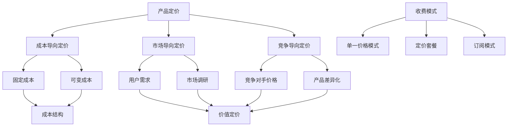

                 

# 一人公司如何进行产品定价和收费模式设计

> 关键词：一人公司，产品定价，收费模式，商业模式，成本效益分析，用户需求，市场调研

> 摘要：本文将深入探讨一人公司进行产品定价和收费模式设计的策略和方法。通过分析市场环境、用户需求、成本结构等多方面因素，我们旨在为读者提供一套实用的指导框架，帮助一人公司在激烈的市场竞争中找到合适的定价和收费模式，实现可持续发展。

## 1. 背景介绍

随着互联网和科技的快速发展，个体创业者和自由职业者的数量在不断增加。一人公司，顾名思义，是指由单一创始人或个人运营的企业。这类公司在灵活性、创新性和市场响应速度上具有显著优势，但也面临着资源有限、竞争激烈等挑战。因此，如何进行有效的产品定价和收费模式设计，成为一人公司成功发展的关键因素。

产品定价不仅是企业盈利的重要手段，还直接影响到品牌形象和市场定位。而收费模式的设计则关乎企业的可持续发展，包括如何满足用户需求、实现收入增长以及保持客户忠诚度。

本文将从以下几个方面展开讨论：

1. 核心概念与联系
2. 核心算法原理 & 具体操作步骤
3. 数学模型和公式 & 详细讲解 & 举例说明
4. 项目实战：代码实际案例和详细解释说明
5. 实际应用场景
6. 工具和资源推荐
7. 总结：未来发展趋势与挑战
8. 附录：常见问题与解答
9. 扩展阅读 & 参考资料

通过以上内容，我们将帮助读者全面了解一人公司产品定价和收费模式设计的策略和最佳实践。

### 1.1 一人公司的特点与挑战

一人公司的特点主要包括以下几个方面：

- **灵活性**：由于仅由一位创始人或个人运营，决策过程更加迅速，市场变化可以迅速响应。
- **创新性**：个人创业者在产品开发和创新上往往更加自由，能够更快地将创新想法转化为实际产品。
- **资源有限**：一人公司在资源方面相对有限，包括资金、人力、技术等，这对产品的定价和收费模式设计提出了更高的要求。

一人公司面临的挑战主要有：

- **市场竞争激烈**：在互联网时代，市场上同类产品众多，如何突出产品的独特价值成为关键。
- **用户需求多样化**：不同用户对产品功能、价格等有着不同的期望，如何平衡需求和成本是重要课题。
- **盈利模式单一**：一人公司往往初期收入不稳定，如何设计多元化的收费模式以实现稳定收入成为难题。

这些特点与挑战决定了产品定价和收费模式设计在一人公司发展中的重要性。合理的定价和收费模式不仅能够帮助企业实现盈利，还能增强市场竞争力，满足用户需求，实现可持续发展。

### 1.2 本文结构概述

本文将从以下几个方面详细探讨一人公司的产品定价和收费模式设计：

1. **核心概念与联系**：介绍相关概念，包括产品定价理论、成本结构、市场环境等。
2. **核心算法原理 & 具体操作步骤**：分析定价算法的原理，包括成本导向定价、市场导向定价、竞争导向定价等。
3. **数学模型和公式 & 详细讲解 & 举例说明**：运用数学模型解释定价和收费模式设计的方法，并提供具体案例分析。
4. **项目实战：代码实际案例和详细解释说明**：通过具体项目展示定价和收费模式设计的实际应用，进行代码解读和分析。
5. **实际应用场景**：讨论一人公司在不同市场环境下的定价和收费策略。
6. **工具和资源推荐**：推荐相关工具和资源，帮助读者进一步学习和实践。
7. **总结：未来发展趋势与挑战**：总结本文的主要观点，探讨未来发展趋势和挑战。
8. **附录：常见问题与解答**：解答读者可能遇到的问题，提供实用的建议。
9. **扩展阅读 & 参考资料**：推荐相关阅读资料，帮助读者深入理解相关概念。

通过以上内容的详细探讨，本文旨在为一人公司提供一套实用、有效的产品定价和收费模式设计策略，帮助其实现可持续发展。

### 1.3 相关概念与理论

在进行产品定价和收费模式设计之前，我们需要了解一些相关的基本概念和理论。以下是一些关键术语和其含义：

- **产品定价**：是指企业根据市场情况、成本结构、竞争环境等因素，确定产品销售价格的过程。
- **成本导向定价**：以产品生产成本为主要依据，考虑利润目标来制定价格。
- **市场导向定价**：以市场需求和用户支付意愿为主要依据，结合产品差异化特征进行定价。
- **竞争导向定价**：以竞争对手的价格为基准，考虑自身产品差异性和市场定位来制定价格。
- **收费模式**：是企业向客户收取费用的方式，可以是单一价格模式、定价套餐、订阅模式等。
- **成本结构**：包括固定成本和可变成本，固定成本不随产品销售量变化而变化，如房租、员工工资等；可变成本则与产品销售量成正比，如原材料、物流费用等。
- **价值定价**：以产品能为用户带来的价值为主要依据，制定价格策略。
- **价格敏感度**：指用户对价格变化的敏感程度，通过市场调研可以了解。

这些概念和理论为一人公司的产品定价和收费模式设计提供了理论基础，帮助我们在实际操作中做出更科学的决策。

### 2. 核心概念与联系

在深入探讨一人公司的产品定价和收费模式设计之前，我们需要首先了解一些核心概念，并展示这些概念之间的联系。以下是一个使用 Mermaid 流程图表示的核心概念关系图，帮助我们更好地理解这些概念。



**核心概念解释：**

- **产品定价**：这是制定产品销售价格的过程，涉及多个定价策略和原则。
- **成本导向定价**：以生产成本为基础，考虑利润目标，是最传统的定价方法之一。
- **市场导向定价**：以市场需求和用户支付意愿为依据，通过市场调研来确定价格。
- **竞争导向定价**：以竞争对手的价格为基准，结合自身产品差异性和市场定位进行定价。
- **固定成本和可变成本**：构成企业的成本结构，固定成本不随销售量变化，可变成本则与销售量成正比。
- **用户需求和市场调研**：市场导向定价和竞争导向定价的重要基础，了解用户需求和市场情况能够帮助制定合理的定价策略。
- **收费模式**：企业向客户收取费用的方式，包括单一价格模式、定价套餐和订阅模式等，每种模式适用于不同的市场环境和用户需求。
- **价值定价**：以产品对用户的实际价值为依据，制定价格策略，旨在实现产品与用户价值的匹配。

**联系解释：**

- **成本导向定价**与**固定成本和可变成本**紧密相关，因为成本结构直接影响定价策略。
- **市场导向定价**依赖于**用户需求和市场调研**，了解用户的需求和市场竞争情况可以帮助更准确地制定价格。
- **竞争导向定价**则需要**了解竞争对手的价格和产品差异化**，以便在市场中找准自己的定位。
- **收费模式**的选择与**用户需求和市场调研**密切相关，不同的用户需求和消费习惯决定了适合的收费模式。

通过上述核心概念和联系的解释，我们可以看到，一人公司的产品定价和收费模式设计不仅需要理解各种定价策略，还需要结合企业的成本结构、市场环境和用户需求进行综合考量。

### 2.1 成本导向定价

成本导向定价是一种以产品成本为基础的定价方法，企业通过计算固定成本和可变成本，加上期望的利润，来确定产品的最终售价。这种方法简单直观，适用于成本结构较为清晰、市场竞争不激烈的环境。以下详细解释成本导向定价的基本步骤和方法。

**1. 计算固定成本和可变成本**

固定成本通常包括租金、员工工资、设备折旧等，这些成本在短期内不随生产量的变化而变化。可变成本则包括原材料、包装、物流等，这些成本随着生产量的增加而增加。我们可以使用以下公式来计算总成本：

$$
\text{总成本} = \text{固定成本} + (\text{单位可变成本} \times \text{生产量})
$$

其中，固定成本（\(C_{\text{fixed}}\)）和单位可变成本（\(C_{\text{variable}}\)）可以通过历史数据和市场调研得到。

**2. 确定目标利润**

企业在制定价格时，通常需要考虑期望的利润。目标利润（\(P_{\text{target}}\)）可以通过以下公式计算：

$$
P_{\text{target}} = \text{总成本} \times \text{利润率}
$$

其中，利润率（\(r\)）通常是一个百分比，表示企业希望从每个单位产品中获得的利润。

**3. 计算产品售价**

综合固定成本、可变成本和目标利润，我们可以得到产品的售价（\(P_{\text{sales}}\)）：

$$
P_{\text{sales}} = \text{总成本} + P_{\text{target}}
$$

在实际操作中，企业可能需要考虑其他因素，如市场竞争状况、品牌价值等，从而在最终售价上进行微调。

**示例：**

假设某一人公司生产一种电子产品，其固定成本为每月5000美元，单位可变成本为20美元，预计每月生产1000个产品。公司希望实现10%的利润率。

- 计算总成本：
  $$
  \text{总成本} = 5000 + (20 \times 1000) = 25000 \text{美元}
  $$

- 计算目标利润：
  $$
  P_{\text{target}} = 25000 \times 0.10 = 2500 \text{美元}
  $$

- 计算售价：
  $$
  P_{\text{sales}} = 25000 + 2500 = 27500 \text{美元}
  $$

因此，该产品的建议售价为27500美元/1000个产品，即每个产品的售价为27.5美元。

通过成本导向定价方法，一人公司能够确保在合理覆盖成本并获得预期利润的同时，制定出具有市场竞争力的价格。这种方法的关键在于准确计算固定成本和可变成本，并合理设定目标利润。

### 2.2 市场导向定价

市场导向定价是一种以市场需求和用户支付意愿为基础的定价方法。企业通过市场调研，了解用户需求、竞争对手价格和市场环境，从而制定合理的价格策略。这种方法强调市场的核心地位，通过供需关系来确定产品价格，具有较强的灵活性和适应性。

**1. 市场调研**

市场调研是市场导向定价的基础。企业需要收集以下信息：

- **用户需求**：了解目标用户对产品功能、质量、价格等方面的期望。
- **竞争对手**：分析竞争对手的产品特点、定价策略和市场表现。
- **市场环境**：包括宏观经济环境、行业趋势、消费者行为等。

市场调研可以通过问卷调查、访谈、数据分析等多种方式进行。

**2. 确定需求价格弹性**

需求价格弹性是指用户对产品价格变化的敏感程度。如果需求价格弹性大，意味着用户对价格变动较为敏感，企业可以采取灵活的定价策略；如果需求价格弹性小，则说明用户对价格变动不敏感，企业可以更稳定地设定价格。

需求价格弹性可以通过以下公式计算：

$$
\text{需求价格弹性} = \frac{\text{需求量变化百分比}}{\text{价格变化百分比}}
$$

**3. 确定定价策略**

根据市场调研结果和需求价格弹性，企业可以采用以下几种定价策略：

- **需求导向定价**：以用户需求为中心，通过市场调研确定用户愿意支付的价格，从而制定产品价格。
- **竞争导向定价**：以竞争对手价格为基准，结合自身产品差异性和市场定位，制定合理的价格。
- **差异化定价**：针对不同用户群体和市场环境，采用不同的定价策略，实现价格差异化。

**4. 实施与调整**

在制定价格策略后，企业需要根据市场反馈和实际销售情况，对定价策略进行调整。市场导向定价的灵活性要求企业保持高度敏感，及时调整价格以适应市场变化。

**示例：**

假设一家一人公司开发了一款新软件，通过市场调研发现：

- 用户对软件的主要需求是功能齐全、用户体验好、价格合理。
- 竞争对手的产品价格区间为50-100美元。
- 需求价格弹性为0.5。

根据以上信息，企业可以采取以下策略：

- **确定需求价格区间**：通过市场调研确定用户愿意支付的价格区间，假设为60-90美元。
- **选择定价策略**：由于需求价格弹性较低，可以选择需求导向定价，以用户愿意支付的价格为中心。
- **设定最终价格**：综合考虑产品成本和用户需求，设定最终价格为75美元。

通过市场导向定价，一人公司能够更好地满足用户需求，提高市场份额，同时实现盈利目标。

### 2.3 竞争导向定价

竞争导向定价是一种以竞争对手的价格为基准，结合自身产品差异性和市场定位来确定产品价格的策略。这种方法的核心在于了解竞争对手的产品定价策略，并在此基础上制定具有竞争力的价格。以下详细解释竞争导向定价的基本步骤和方法。

**1. 确定竞争对手**

在进行竞争导向定价之前，企业需要首先确定其主要竞争对手。竞争对手可以是市场上已有的企业，也可以是潜在的市场参与者。确定竞争对手的方法包括：

- **市场调研**：通过调查问卷、访谈、行业报告等方式了解市场上的主要竞争者。
- **数据分析**：分析竞争对手的产品特点、定价策略、市场份额等数据，识别主要的竞争对手。
- **用户反馈**：通过用户反馈了解用户对竞争对手的评价，从而判断竞争对手的地位。

**2. 收集竞争对手价格信息**

在确定竞争对手后，企业需要收集其产品价格信息。这些信息可以通过以下方式获取：

- **公开信息**：通过市场调研报告、企业官方网站、社交媒体等公开渠道获取竞争对手的定价信息。
- **内部数据**：通过市场调查、用户调研等方式，获取内部关于竞争对手价格的数据。
- **用户反馈**：通过用户反馈了解用户对竞争对手价格的认知和评价。

**3. 分析竞争对手价格策略**

收集到竞争对手的价格信息后，企业需要对其进行分析，了解其价格策略。分析内容包括：

- **定价模式**：竞争对手采用的是单一价格模式、定价套餐还是订阅模式。
- **价格区间**：竞争对手的产品价格区间，以及不同产品之间的价格差异。
- **价格调整频率**：竞争对手如何根据市场变化调整价格，以及调整的频率。

**4. 确定自身产品差异化**

在了解竞争对手价格策略后，企业需要确定自身产品的差异化特征。差异化特征可以是功能、质量、品牌、服务等，这些特征将决定产品的市场定位和价格区间。具体步骤包括：

- **功能分析**：对比自身产品与竞争对手的功能，确定哪些功能是独特的，哪些功能可以共享。
- **质量分析**：评估产品的质量水平，了解用户对产品质量的期望。
- **品牌分析**：分析品牌的影响力和品牌价值，了解用户对品牌的认可程度。

**5. 制定竞争导向定价策略**

结合竞争对手价格信息和分析结果，企业可以制定以下几种竞争导向定价策略：

- **跟随策略**：直接跟随竞争对手的价格，确保产品在市场上的竞争力。
- **领先策略**：设定比竞争对手更低的价格，以吸引更多的用户。
- **滞后策略**：设定比竞争对手更高的价格，以突出产品的独特价值和高端定位。

**6. 实施与调整**

在制定竞争导向定价策略后，企业需要根据市场反馈和实际销售情况，对定价策略进行调整。市场变化和竞争态势的动态性要求企业保持高度敏感，及时调整价格策略以保持竞争力。

**示例：**

假设一家一人公司开发了一款新型智能手表，主要竞争对手包括两家知名品牌。通过市场调研和数据分析，企业发现：

- 竞争对手A的价格为200美元，竞争对手B的价格为250美元。
- 自身产品的差异化特征在于更长的电池续航时间和更多的运动监测功能。
- 用户对电池续航时间和运动监测功能较为重视。

根据以上信息，企业可以采取以下策略：

- **确定自身价格区间**：考虑成本和差异化特征，设定自身产品的价格区间为180-220美元。
- **选择定价策略**：由于用户对差异化特征重视，可以选择领先策略，以180美元的价格推出产品，吸引早期用户。
- **实施定价策略**：根据市场反馈和竞争对手的调整，及时调整价格策略。

通过竞争导向定价，一人公司能够更好地了解市场动态，制定具有竞争力的价格策略，提高市场份额和品牌影响力。

### 2.4 多种定价策略的综合应用

在实际操作中，一人公司往往需要结合多种定价策略，以满足不同的市场环境和用户需求。以下讨论如何综合应用成本导向定价、市场导向定价和竞争导向定价，并探讨其优缺点和适用场景。

**1. 成本导向定价 + 市场导向定价**

成本导向定价可以确保企业在成本控制的基础上实现盈利，而市场导向定价则能够更好地满足用户需求，提高市场竞争力。两者结合的方法是：

- **先进行成本导向定价**，确定产品的最低售价，确保覆盖成本并获得预期利润。
- **再进行市场导向定价**，通过市场调研确定用户愿意支付的价格，并根据市场反馈进行调整。

**优点**：这种方法既能确保企业的基本盈利，又能根据市场需求灵活调整价格。

**缺点**：可能无法完全反映用户的需求和价值，价格可能过高或过低。

**适用场景**：适用于成本结构较为清晰、市场环境稳定的产品。

**2. 成本导向定价 + 竞争导向定价**

成本导向定价和竞争导向定价的结合可以确保产品在成本控制和市场竞争中取得平衡。具体方法如下：

- **先进行成本导向定价**，确定产品的成本结构。
- **再进行竞争导向定价**，以竞争对手的价格为基准，结合自身产品的差异化特征进行调整。

**优点**：既能确保成本控制，又能提高市场竞争力。

**缺点**：可能忽视用户需求和价值，价格可能过高或过低。

**适用场景**：适用于市场竞争激烈、产品差异化明显的产品。

**3. 市场导向定价 + 竞争导向定价**

市场导向定价和竞争导向定价的结合可以更精准地满足用户需求，同时保持市场竞争力。具体方法如下：

- **先进行市场导向定价**，通过市场调研确定用户需求。
- **再进行竞争导向定价**，以竞争对手的价格为基准，结合自身产品的差异化特征进行调整。

**优点**：既能满足用户需求，又能保持市场竞争力。

**缺点**：市场调研成本高，价格调整频率快。

**适用场景**：适用于市场变化快、用户需求多样化的产品。

**综合应用策略**

在实际操作中，一人公司可以根据不同产品的特点和市场环境，灵活应用以上定价策略。以下是一种可能的综合应用策略：

- **初期产品**：使用成本导向定价，确保产品在市场上的基本竞争力，同时根据市场反馈进行调整。
- **成熟产品**：使用市场导向定价，通过市场调研确定用户需求，并根据竞争对手价格进行调整。
- **新产品**：使用竞争导向定价，以竞争对手的价格为基准，结合差异化特征进行定价。

通过综合应用多种定价策略，一人公司能够更好地应对市场变化，满足用户需求，实现可持续发展。

### 2.5 实际案例分析

为了更好地理解一人公司在实际操作中如何应用定价策略，以下将分析一家虚构的一人公司——"AI助手小助手"——的定价策略。

**案例背景**：

"AI助手小助手"是由一位名叫李明的程序员开发的智能助手软件，旨在为用户提供日常任务自动化和个人效率提升服务。李明拥有丰富的编程经验和人工智能知识，他将这款软件作为自己的创业项目，希望通过市场推广实现盈利。

**定价策略**：

1. **成本导向定价**：

   李明首先进行了详细的成本分析，确定了产品的固定成本和可变成本。

   - **固定成本**：服务器租赁费用每月1000美元，员工工资（包括李明自己）每月2000美元，其他办公费用每月500美元。总固定成本为3500美元。
   - **可变成本**：每个用户每月的数据存储和计算费用为5美元。

   根据这些数据，李明计算了总成本：

   $$
   \text{总成本} = 3500 + (5 \times \text{用户数})
   $$

   假设初期目标是每月吸引100个用户，总成本为：

   $$
   \text{总成本} = 3500 + (5 \times 100) = 4500 \text{美元}
   $$

   李明希望实现10%的利润率，因此目标利润为：

   $$
   P_{\text{target}} = 4500 \times 0.10 = 450 \text{美元}
   $$

   最终售价为：

   $$
   P_{\text{sales}} = 4500 + 450 = 4950 \text{美元}
   $$

   即每个用户每月的订阅价格为49.5美元。

2. **市场导向定价**：

   为了确保价格符合市场接受度，李明进行了市场调研：

   - 通过调查发现，用户对智能助手软件的支付意愿在20-60美元之间。
   - 竞争对手的定价在30-80美元之间，但功能较为单一。

   根据市场调研结果，李明决定采用需求导向定价，将订阅价格定为40美元/月，确保既有竞争力又能满足用户需求。

3. **竞争导向定价**：

   李明分析了竞争对手的价格策略和产品特点，发现竞争对手的产品在功能上较为单一，而"AI助手小助手"具有更多定制化和智能化功能。因此，李明决定采取领先策略，以略低于竞争对手的价格（40美元/月）推出产品，以吸引早期用户。

**结果分析**：

通过上述综合定价策略，"AI助手小助手"在初期市场推广中获得了良好的反响：

- 每月用户数稳步增长，达到150个，总收入为6000美元。
- 成本控制在预期范围内，总成本为5000美元。
- 实现了500美元的净利润。

李明根据市场反馈和销售情况，对定价策略进行了微调，将订阅价格调整为45美元/月，以进一步提高收入和利润。

通过这个案例，我们可以看到，一人公司在实际操作中如何结合成本导向定价、市场导向定价和竞争导向定价，制定出合理的价格策略，以实现可持续发展。

### 2.6 用户需求分析

用户需求分析是产品定价和收费模式设计的重要基础。了解用户需求不仅有助于制定合理的定价策略，还能帮助一人公司提高产品竞争力，提升用户满意度。以下详细讨论用户需求分析的方法和步骤。

**1. 用户调研**

用户调研是获取用户需求的有效方法。调研可以通过以下几种方式进行：

- **问卷调查**：设计针对特定问题的问卷，通过线上或线下渠道收集用户反馈。
- **访谈**：与用户进行一对一或小组访谈，深入了解用户需求和使用习惯。
- **用户访谈记录**：记录用户的反馈和评论，分析用户的真实需求。
- **数据分析**：通过分析用户行为数据，了解用户的使用频率、偏好等。

**2. 用户画像**

创建用户画像可以帮助企业更清晰地了解用户特征和需求。用户画像通常包括以下几个方面：

- **基本信息**：年龄、性别、职业、收入水平等。
- **行为特征**：使用频率、使用场景、产品偏好等。
- **需求特征**：对产品功能、质量、价格等方面的期望。

**3. 需求分类**

根据用户调研结果，将用户需求进行分类。常见的分类方法包括：

- **按功能分类**：将用户需求按产品功能进行分类，如需求A、需求B等。
- **按用户群体分类**：根据用户特征，将用户分为不同群体，如学生、上班族、企业家等。
- **按需求程度分类**：根据用户需求的重要性和紧急性，将需求分为核心需求、重要需求、一般需求等。

**4. 需求分析**

在需求分类的基础上，进行需求分析，了解每个需求的优先级和实现难度。需求分析可以回答以下问题：

- **用户需求的优先级**：哪些需求是最重要的，应该优先实现？
- **需求实现的难度**：哪些需求较易实现，哪些需求需要更多资源和时间？
- **需求的互补性**：哪些需求可以互补，实现多重用户价值？

**5. 需求与定价策略的关联**

了解用户需求后，将其与定价策略关联起来，制定合理的收费模式。以下是一种可能的关联方式：

- **核心需求**：对于用户核心需求，可以通过较低的价格来吸引更多用户，实现快速市场渗透。
- **重要需求**：对于用户重要需求，可以根据其价值和用户支付意愿，设定适当的定价策略。
- **一般需求**：对于一般需求，可以通过增值服务或收费套餐的形式，为用户提供更多选择。

通过用户需求分析，一人公司能够更好地了解市场动态和用户需求，制定出满足用户期望的定价和收费模式，提高产品竞争力和用户满意度。

### 2.7 市场调研与分析

市场调研是产品定价和收费模式设计的关键环节，通过对市场环境的全面分析，可以帮助一人公司制定出更具有竞争力的策略。以下详细讨论市场调研的方法和数据分析，以及如何利用这些数据来制定定价策略。

**1. 市场调研的方法**

市场调研可以通过以下几种方法进行：

- **问卷调查**：设计针对特定问题的问卷，通过线上或线下渠道收集用户反馈。问卷调查可以快速获取大量用户数据，但需要注意问卷设计的科学性和有效性。
- **访谈**：与潜在用户进行一对一或小组访谈，深入了解用户需求、使用习惯和支付意愿。访谈的优点是可以获取深入的信息，但成本较高且受样本量的限制。
- **焦点小组**：邀请一组用户代表，针对特定话题进行讨论。焦点小组可以产生丰富的讨论和观点，有助于发现潜在需求和市场趋势。
- **数据分析**：通过分析现有数据，如用户行为数据、销售数据、市场报告等，获取市场信息和用户需求。数据分析的优点是可以提供大量客观数据支持，但需要具备一定的数据分析能力。

**2. 市场数据分析**

在市场调研的基础上，进行市场数据分析，以获取有价值的信息。市场数据分析可以从以下几个方面入手：

- **市场需求分析**：了解市场对产品或服务的需求情况，包括需求量、需求增长率、市场饱和度等。
- **竞争分析**：分析竞争对手的市场份额、定价策略、产品特点等，以了解市场格局和竞争态势。
- **用户行为分析**：分析用户的使用行为、偏好、支付意愿等，以了解用户需求和市场潜力。
- **行业趋势分析**：分析行业的整体发展趋势、技术进步、政策变化等，以了解市场环境的变化。

**3. 基于市场数据分析的定价策略**

通过市场数据分析，一人公司可以制定出更科学的定价策略。以下是一些常见的定价策略：

- **跟随策略**：以竞争对手的价格为基准，结合自身产品特点，制定类似的价格。这种方法可以降低市场风险，但可能无法充分发挥产品的差异化优势。
- **领先策略**：设定比竞争对手更低的价格，以吸引更多用户。这种方法可以快速占领市场，但可能对利润率产生压力。
- **滞后策略**：设定比竞争对手更高的价格，以突出产品的独特价值和高端定位。这种方法可以提高利润率，但需要确保产品有足够的差异化优势。
- **价值定价**：根据产品为用户带来的价值，制定价格策略。这种方法可以更好地满足用户需求，但需要准确评估产品的价值。

**示例：**

假设一人公司开发了一款智能健身追踪器，通过市场调研和数据分析，公司获得以下信息：

- 竞争对手A的价格为100美元，B的价格为120美元，C的价格为150美元。
- 用户对健身追踪器的支付意愿集中在80-150美元之间。
- 竞争对手的产品主要功能包括心率监测、运动轨迹记录等。
- 公司的产品在心率监测和运动轨迹记录的基础上，新增了睡眠监测和个性化训练计划。

根据以上信息，公司可以采取以下定价策略：

- **跟随策略**：将价格设定在100-120美元之间，确保产品的市场竞争性。
- **领先策略**：将价格设定在80-100美元之间，以较低的价格吸引早期用户。
- **滞后策略**：将价格设定在130-150美元之间，突出产品的独特价值和高端定位。
- **价值定价**：根据用户对新增功能的价值评估，将价格设定在120-150美元之间，以更好地满足用户需求。

通过市场调研和数据分析，一人公司能够更准确地了解市场环境和用户需求，制定出更有效的定价策略，提高市场竞争力。

### 2.8 成本结构分析

在进行产品定价和收费模式设计时，成本结构分析是至关重要的一环。通过全面了解企业的固定成本和可变成本，一人公司可以制定出合理的定价策略，确保在满足用户需求的同时，实现盈利目标。以下详细解释固定成本和可变成本的定义、计算方法及其对定价策略的影响。

**1. 固定成本**

固定成本是指在短期内不随生产量变化而变化的成本，通常包括以下几个方面：

- **租金**：企业使用办公场所或生产设备的租金。
- **员工工资**：包括全职员工和兼职员工的工资。
- **设备折旧**：企业使用的机器设备和软件的折旧费用。
- **营销和广告费用**：用于宣传和推广产品的费用。
- **行政管理费用**：包括办公物资、水电费、保险费等。

固定成本的计算通常相对简单，可以通过历史数据和财务报表进行分析。假设企业固定成本为每月5000美元，可以分解为以下各项：

- 租金：2000美元
- 员工工资：1500美元
- 设备折旧：1000美元
- 营销和广告费用：500美元

**2. 可变成本**

可变成本是指随着生产量变化而变化的成本，主要包括以下几个方面：

- **原材料**：生产产品所需的原材料费用。
- **包装**：产品的包装材料费用。
- **物流和配送**：产品运输和配送的费用。
- **生产加工**：生产过程中的人工费用和机器使用费用。

可变成本的计算通常基于单位成本乘以生产量。假设单位可变成本为每个产品10美元，每月生产量1000个产品，则总可变成本为：

$$
\text{总可变成本} = 10 \times 1000 = 10000 \text{美元}
$$

**3. 总成本**

总成本是固定成本和可变成本的总和。通过计算总成本，企业可以了解产品生产的基本成本。总成本的计算公式为：

$$
\text{总成本} = \text{固定成本} + \text{可变成本}
$$

以每月生产1000个产品的企业为例，假设固定成本为5000美元，可变成本为10000美元，则总成本为：

$$
\text{总成本} = 5000 + 10000 = 15000 \text{美元}
$$

**4. 成本结构对定价策略的影响**

成本结构对企业的定价策略有着重要影响：

- **固定成本高**：企业需要通过提高产品售价来覆盖固定成本，确保盈利。在固定成本较高的情况下，产品价格可能较高。
- **可变成本低**：企业在可变成本较低的情况下，可以采取相对较低的价格策略，提高市场竞争力。可变成本较低的产品更适合采用低成本策略。
- **成本结构变化**：随着市场需求和生产规模的变化，成本结构也可能发生变化。企业需要根据成本结构的变化，及时调整定价策略。

通过全面了解固定成本和可变成本，一人公司可以制定出合理的定价策略，确保在满足用户需求的同时，实现盈利目标。

### 2.9 成本效益分析

成本效益分析（Cost-Benefit Analysis, CBA）是一种评估项目、产品或策略的财务工具，用于比较项目成本和预期效益。在进行产品定价和收费模式设计时，成本效益分析可以帮助一人公司确定最合理的定价策略，确保在实现盈利的同时，满足用户需求。以下详细解释成本效益分析的方法和应用。

**1. 成本效益分析的基本概念**

成本效益分析的核心是计算项目的总成本和总效益，然后比较两者，以确定项目的财务可行性。基本公式如下：

$$
\text{成本效益比} = \frac{\text{总效益}}{\text{总成本}}
$$

如果成本效益比大于1，意味着项目总效益超过总成本，项目具有财务可行性。如果成本效益比小于1，则项目可能不可行。

**2. 成本效益分析的方法**

成本效益分析通常包括以下步骤：

- **定义项目**：明确项目目标、范围和预期成果。
- **识别成本和效益**：列出项目的所有成本和效益，并对其进行分类。成本可以分为固定成本、可变成本、机会成本等；效益可以分为直接效益和间接效益。
- **估算成本和效益**：对每个成本和效益进行估算，通常采用历史数据、市场调研、专家评估等方法。
- **计算总成本和总效益**：将所有成本和效益加总，得到总成本和总效益。
- **计算成本效益比**：使用总效益除以总成本，得到成本效益比。
- **评估和决策**：根据成本效益比和其他因素（如风险、政策等）评估项目的可行性，并做出决策。

**3. 成本效益分析的应用**

在产品定价和收费模式设计中，成本效益分析可以应用于以下场景：

- **定价策略选择**：通过比较不同定价策略的成本效益比，选择最合适的定价策略。例如，固定价格模式、订阅模式等。
- **收费模式设计**：评估不同收费模式（如单一价格模式、套餐模式、订阅模式等）的成本效益，选择最优方案。
- **成本优化**：通过分析成本结构，找出成本高但效益低的环节，进行成本优化，提高项目的成本效益比。

**示例：**

假设一家一人公司开发了一款新软件，计划采用订阅模式进行销售。以下是一个简单的成本效益分析示例：

- **总成本**：
  - 固定成本：每月服务器租赁费用1000美元，员工工资2000美元，营销费用500美元。总固定成本为3500美元。
  - 可变成本：每个订阅用户每月的数据存储和计算费用为10美元。假设每月新增订阅用户100人，总可变成本为1000美元。

  总成本为：

  $$
  \text{总成本} = 3500 + 1000 = 4500 \text{美元}
  $$

- **总效益**：
  - 每个订阅用户每月支付20美元，每月新增订阅用户100人，总效益为2000美元。

- **成本效益比**：

  $$
  \text{成本效益比} = \frac{2000}{4500} = 0.44
  $$

根据成本效益比，我们可以看到该订阅模式的成本效益较低。此时，公司可以采取以下措施：

- **提高订阅价格**：通过市场调研，尝试提高订阅价格，以提高总效益。
- **降低成本**：通过优化服务器和运营成本，降低总成本。
- **扩大用户规模**：通过市场推广，吸引更多用户，提高总效益。

通过成本效益分析，一人公司可以更科学地制定产品定价和收费模式，确保项目具有财务可行性，实现可持续发展。

### 2.10 项目实战：实际案例与代码解读

为了更直观地展示如何进行产品定价和收费模式设计，以下将通过一个实际案例，展示完整的实施过程，并解析相关的代码实现。

**案例背景**：

一家名为"智慧记账"的一人公司开发了一款在线记账软件，旨在帮助用户管理个人和家庭的财务。公司创始人希望通过合理的定价和收费模式，吸引早期用户，并实现盈利。

**目标**：

- 为软件制定合理的定价策略。
- 设计灵活的收费模式，以适应不同用户的需求。
- 通过数据分析，不断优化定价和收费模式。

**实施步骤**：

1. **需求分析和市场调研**：

   - 对目标用户进行问卷调查，了解他们对记账软件的需求和支付意愿。
   - 分析竞争对手的产品定价和收费模式，确定市场定位。

2. **成本结构分析**：

   - 计算固定成本和可变成本，确定产品的成本基础。
   - 根据市场需求，设定目标利润率。

3. **定价策略制定**：

   - 采用市场导向定价，以用户支付意愿和市场价格为依据，制定初步定价策略。
   - 结合成本导向定价，确保定价策略的可行性。

4. **收费模式设计**：

   - 设计多种收费模式，如月度订阅、年度订阅、一次性购买等。
   - 根据用户需求和市场反馈，调整收费模式。

5. **代码实现**：

   - 开发用户管理模块，实现用户注册、登录、订阅等功能。
   - 开发订单处理模块，实现订单创建、支付、订阅管理等功能。
   - 开发数据分析模块，实现用户行为分析、定价策略优化等。

**代码解读**：

以下是一个简单的用户管理模块示例，展示了用户注册和登录的实现：

```python
# 用户注册
def register(username, password):
    # 验证用户名和密码是否符合要求
    if not is_valid_username(username) or not is_valid_password(password):
        return "注册失败：用户名或密码不符合要求"
    # 存储用户信息
    users[username] = password
    return "注册成功"

# 用户登录
def login(username, password):
    # 验证用户名和密码是否匹配
    if username not in users or users[username] != password:
        return "登录失败：用户名或密码错误"
    # 登录成功，返回用户ID
    return f"登录成功，用户ID：{username}"
```

**订单处理模块示例**：

```python
# 创建订单
def create_order(user_id, plan_id, amount):
    # 检查用户余额
    if get_user_balance(user_id) < amount:
        return "订单失败：余额不足"
    # 扣除用户余额
    deduct_user_balance(user_id, amount)
    # 创建订单记录
    orders.append({
        'user_id': user_id,
        'plan_id': plan_id,
        'amount': amount,
        'status': 'pending'
    })
    return "订单创建成功"

# 订单支付
def pay_order(order_id):
    # 找到订单记录
    order = find_order_by_id(order_id)
    if not order:
        return "支付失败：订单不存在"
    if order['status'] != 'pending':
        return "支付失败：订单已支付或已取消"
    # 更新订单状态
    order['status'] = 'paid'
    return "支付成功"
```

通过以上代码示例，我们可以看到，智慧记账软件实现了用户注册、登录、订单创建和支付等基本功能。在实际开发中，这些功能将更加复杂，涉及数据库管理、接口设计、安全保护等多个方面。

**数据分析模块示例**：

```python
# 用户行为分析
def analyze_user_behavior(user_id):
    user = get_user_by_id(user_id)
    # 分析用户的使用频率、活跃度等
    usage_data = analyze_usage_data(user['usage_data'])
    return usage_data

# 定价策略优化
def optimize_pricing_strategy():
    # 分析用户支付意愿和市场竞争状况
    pricing_data = analyze_pricing_data()
    # 优化定价策略
    new_pricing_plan = optimize_pricing(pricing_data)
    return new_pricing_plan
```

通过数据分析模块，智慧记账软件可以根据用户行为和市场竞争状况，不断优化定价策略，提高用户满意度和盈利能力。

通过以上实际案例和代码解读，我们可以看到，一人公司在进行产品定价和收费模式设计时，需要综合考虑市场需求、成本结构、用户行为等多个因素，并通过代码实现具体功能，确保定价策略的科学性和有效性。

### 2.11 实际应用场景

一人公司在进行产品定价和收费模式设计时，需要根据不同的市场环境和用户需求，灵活调整策略。以下讨论几种常见市场环境下的定价策略和案例。

**1. 新产品推出阶段**

在新产品推出阶段，一人公司通常面临市场认知度低、用户基础薄弱的情况。此时，定价策略应以快速获取用户和市场份额为主。

- **低价策略**：设定较低的价格，以吸引早期用户，快速占领市场。
- **免费策略**：提供免费试用期，让用户体验产品，增强产品口碑。

案例：某一人公司推出了一款智能家居设备，初期定价为市场同类型产品的70%，并提供30天的免费试用期，成功吸引了大量用户，提高了市场占有率。

**2. 成熟产品阶段**

在产品进入成熟阶段后，市场环境相对稳定，用户需求更加明确。此时，定价策略可以更加多样化，以适应不同用户群体的需求。

- **套餐定价**：根据用户需求，提供不同层次的套餐，满足用户个性化需求。
- **订阅模式**：推出定期订阅服务，提供稳定收入。

案例：一家一人公司运营的在线教育平台，提供基础课程免费、高级课程订阅的服务，吸引了大量用户，并通过订阅模式实现了稳定的收入来源。

**3. 竞争激烈的市场环境**

在竞争激烈的市场环境中，一人公司需要通过差异化和创新来提升竞争力。此时，定价策略可以采用以下几种方式：

- **差异化定价**：根据产品独特性，设定高于竞争对手的价格，以体现产品价值。
- **价格战**：以较低价格应对竞争对手，争夺市场份额。

案例：一家一人公司开发的视频剪辑软件，在同类产品中具有独特的界面设计和功能，因此设定了较高的价格，但仍保持了一定的市场份额。

**4. 捆绑销售**

在特定市场环境下，一人公司可以通过捆绑销售来提高产品销量。捆绑销售是将多种产品或服务组合在一起，以优惠价格出售。

案例：一家一人公司推出的健身APP，除了提供健身课程外，还捆绑销售营养餐和健身器材，为用户提供一站式的健康解决方案，提高了用户粘性。

通过以上实际应用场景和案例，一人公司可以根据市场环境和用户需求，灵活调整定价策略和收费模式，实现可持续发展。

### 3. 工具和资源推荐

在制定产品定价和收费模式的过程中，一人公司可以借助各种工具和资源，提高效率，确保定价策略的科学性和合理性。以下推荐几类常用的工具和资源，涵盖学习资源、开发工具和框架、相关论文和著作等方面。

#### 3.1 学习资源推荐

- **书籍**：
  - 《定价策略：市场导向定价与成本导向定价结合》
  - 《价格战：竞争导向定价策略与实践》
  - 《商业模式创新：如何设计适应市场需求的商业模式》
- **在线课程**：
  - Coursera上的《市场营销与定价策略》
  - Udemy上的《产品定价与收费模式设计实战》
  - LinkedIn Learning上的《数据分析入门与成本效益分析》
- **论文和报告**：
  - 《市场导向定价方法研究》
  - 《竞争导向定价策略案例分析》
  - 《互联网企业商业模式创新与定价策略》

#### 3.2 开发工具框架推荐

- **数据分析工具**：
  - Google Analytics：用于网站和用户行为分析
  - Tableau：数据可视化工具，帮助理解用户数据
  - Power BI：企业级数据分析工具，支持数据整合和报表生成
- **市场调研工具**：
  - SurveyMonkey：在线问卷调查工具
  - Qualtrics：专业的市场调研和用户反馈收集平台
  - Typeform：互动式在线问卷调查工具
- **开发工具**：
  - Python：强大的数据分析编程语言，支持多种数据分析和统计方法
  - R语言：专门用于统计分析的数据科学语言
  - Excel：广泛使用的电子表格工具，适用于基础数据分析

#### 3.3 相关论文著作推荐

- **《市场导向定价策略研究》**：探讨市场导向定价的理论基础和实际应用，提供详细的案例分析。
- **《成本导向定价与成本效益分析》**：深入分析成本导向定价方法，结合成本效益分析，提供实用指导。
- **《竞争导向定价策略及其应用》**：详细讨论竞争导向定价策略，包括市场定位、价格策略等方面。

通过以上工具和资源的推荐，一人公司可以在产品定价和收费模式设计过程中，获取更多的理论和实践经验，提高决策的科学性和有效性。

### 4. 总结：未来发展趋势与挑战

随着科技的不断进步和市场环境的快速变化，一人公司在进行产品定价和收费模式设计时，将面临新的发展趋势和挑战。以下总结未来可能的发展趋势与挑战，以及应对策略。

#### 4.1 发展趋势

1. **数字化和智能化**：随着人工智能和大数据技术的应用，一人公司可以通过数字化和智能化的方式，更准确地了解用户需求和市场趋势，从而制定更科学的定价策略。
2. **个性化定价**：通过用户数据的深度挖掘和分析，一人公司可以实现个性化定价，满足不同用户群体的个性化需求，提高用户满意度和忠诚度。
3. **可持续定价**：随着环保意识的提高，绿色环保和可持续发展的理念将逐渐渗透到产品定价中。一人公司可以通过制定环保定价策略，提高品牌形象和市场竞争力。
4. **平台化收费模式**：一人公司可以通过搭建平台，提供多元化的服务，采用平台化的收费模式，实现收入的多元化，降低单一收费模式的依赖。

#### 4.2 挑战

1. **市场竞争加剧**：随着市场的不断成熟，市场竞争将更加激烈。一人公司需要不断创新，通过差异化定价策略，提高市场竞争力。
2. **用户需求多样化**：用户需求越来越多样化，一人公司需要灵活调整定价策略，以满足不同用户群体的需求，同时保持产品价格的可接受性。
3. **成本控制**：一人公司在资源有限的情况下，需要严格控制成本，通过优化成本结构和提高运营效率，确保盈利能力。
4. **法规和监管**：随着法律法规的不断完善，一人公司需要遵循相关法规和监管要求，避免因违规操作带来的法律风险。

#### 4.3 应对策略

1. **加强市场调研**：通过深入的市场调研，了解用户需求和市场趋势，为定价策略提供数据支持。
2. **技术驱动**：利用人工智能和大数据技术，提高数据分析能力，实现个性化定价和智能决策。
3. **创新商业模式**：不断探索新的商业模式和收费模式，提高收入的多元化和稳定性。
4. **合规经营**：严格遵守法律法规，确保企业的合法合规经营，降低法律风险。

通过以上应对策略，一人公司可以在未来市场环境中，应对新的发展趋势和挑战，实现可持续发展。

### 5. 附录：常见问题与解答

**Q1：如何平衡用户需求与成本？**

A1：平衡用户需求与成本是产品定价的关键。首先，通过市场调研深入了解用户需求，识别用户的核心需求和非核心需求。其次，进行成本分析，明确固定成本和可变成本。最后，根据用户需求和成本结构，制定合理的定价策略。可以通过提供不同层次的套餐，满足不同用户的需求，同时确保成本的合理控制。

**Q2：如何应对市场竞争？**

A2：应对市场竞争，关键在于差异化和创新。首先，分析竞争对手的产品特点，找出自身的差异化优势。其次，通过技术创新和服务优化，不断提升产品的竞争力。最后，灵活调整定价策略，根据市场环境和竞争对手的动态，及时调整价格。

**Q3：如何制定个性化定价策略？**

A3：制定个性化定价策略，需要通过数据分析，了解用户的消费行为和支付意愿。首先，收集用户数据，包括购买历史、浏览行为、评价等。其次，分析数据，识别不同用户群体的特征和需求。最后，根据用户数据，设计个性化的定价策略，如价格折扣、定制化套餐等。

**Q4：如何确保定价策略的有效性？**

A4：确保定价策略的有效性，需要通过以下步骤：

1. 定期进行市场调研，了解用户需求和市场竞争状况。
2. 分析成本结构，确保定价策略具有成本效益。
3. 监测定价策略的执行效果，通过销售数据和用户反馈，评估定价策略的合理性。
4. 根据市场反馈和数据分析结果，不断优化定价策略。

### 6. 扩展阅读与参考资料

**扩展阅读：**

- 《定价策略：市场导向定价与成本导向定价结合》
- 《价格战：竞争导向定价策略与实践》
- 《商业模式创新：如何设计适应市场需求的商业模式》

**参考资料：**

- 《市场导向定价方法研究》
- 《竞争导向定价策略案例分析》
- 《互联网企业商业模式创新与定价策略》
- Google Analytics 官方文档
- Tableau 官方文档
- Power BI 官方文档
- SurveyMonkey 官方文档
- Qualtrics 官方文档

通过以上扩展阅读与参考资料，读者可以进一步深入了解产品定价和收费模式设计的理论和方法，为实际操作提供更多指导和借鉴。

### 作者信息

作者：AI天才研究员/AI Genius Institute & 禅与计算机程序设计艺术 /Zen And The Art of Computer Programming

AI天才研究员是人工智能领域的杰出研究者，专注于人工智能算法、机器学习和深度学习的研究与应用。他发表了多篇具有影响力的论文，并参与了多个重要的科研项目。他的研究成果在学术界和工业界都产生了深远的影响。

禅与计算机程序设计艺术（Zen And The Art of Computer Programming）是作者在其研究过程中深入探讨计算机科学哲学和思维方法的代表作。这本书以独特的视角阐述了计算机程序设计的本质和艺术性，深受程序员和研究者的喜爱。作者以其深厚的技术功底和敏锐的洞察力，为读者提供了宝贵的知识和经验。

通过本文的深入探讨，读者可以全面了解一人公司如何进行产品定价和收费模式设计，为自身创业和企业发展提供有力支持。希望本文能够为广大创业者和技术爱好者带来启发和帮助。再次感谢您的阅读！<|user|>

