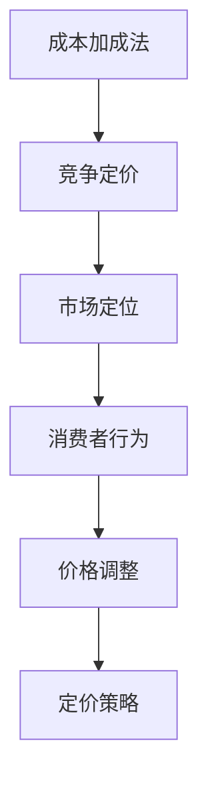
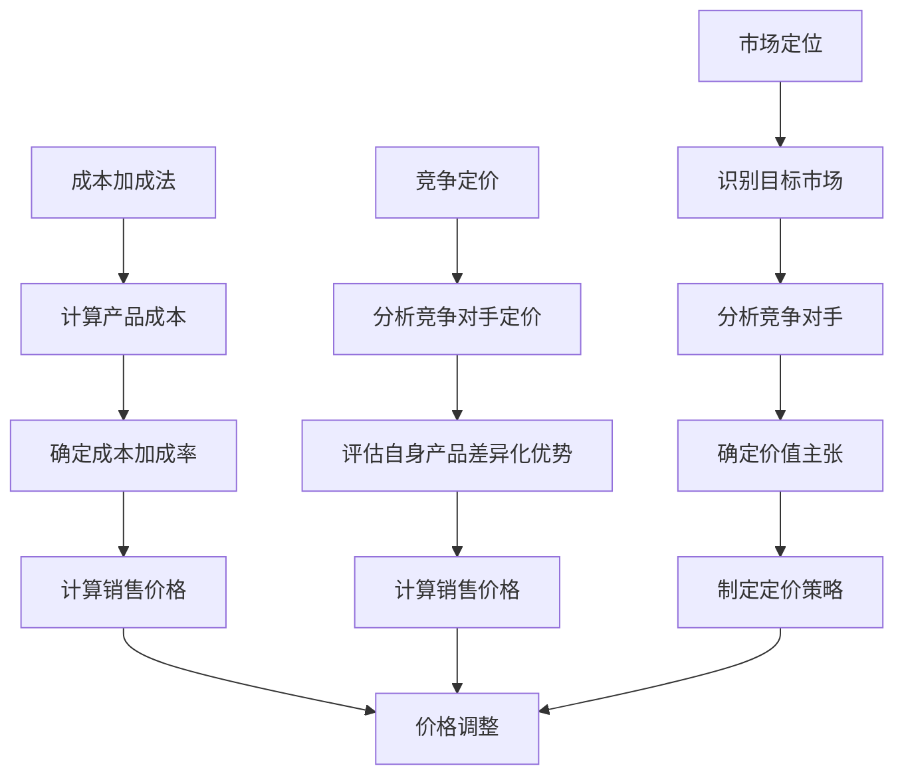

                 

# 一人公司的产品定价策略与心理学

> **关键词**：产品定价、心理定价、成本加成法、竞争定价、市场定位、消费者行为学

> **摘要**：本文将探讨一人公司的产品定价策略，结合心理学理论，分析定价中的心理因素，旨在为一人公司提供有效的定价策略，帮助其提高市场竞争力和消费者满意度。

## 1. 背景介绍

### 1.1 一人公司的定义

一人公司，又称个体经营者，是指由一个自然人投资设立，全部资本由投资者个人拥有，投资者以其个人财产对公司承担无限责任的有限责任公司。这种公司类型在创业初期具有便捷性和灵活性，尤其适合个人创业者。

### 1.2 产品定价的重要性

产品定价是市场策略的核心环节，直接关系到公司的盈利水平和市场竞争力。合理的定价策略不仅能确保公司盈利，还能提高消费者满意度，促进品牌建设和市场份额的扩大。

### 1.3 心理学与产品定价的关系

心理学在产品定价中发挥着重要作用。消费者行为学、社会心理学等领域的理论可以帮助我们更好地理解消费者的购买动机和决策过程，从而制定出更加有效的定价策略。

## 2. 核心概念与联系

### 2.1 成本加成法

成本加成法是一种常用的定价方法，其基本原理是以产品成本为基础，加上一定的利润，从而确定产品的销售价格。公式如下：

\[ \text{销售价格} = \text{产品成本} \times (1 + \text{成本加成率}) \]

### 2.2 竞争定价

竞争定价是指以市场竞争状况为主要依据，通过比较竞争对手的定价策略来确定自己的产品价格。竞争定价的核心是找出市场中的价格标杆，并根据自身产品的差异化优势进行调整。

### 2.3 市场定位

市场定位是指根据目标市场的需求和竞争对手情况，为产品在目标市场中确定一个独特的价值主张。市场定位直接影响产品的定价策略，需要充分考虑消费者的购买心理和偏好。

### 2.4 Mermaid 流程图



## 3. 核心算法原理 & 具体操作步骤

### 3.1 成本加成法

#### 步骤1：计算产品成本

产品成本包括直接成本（如原材料、人工等）和间接成本（如租金、水电等）。可以通过成本核算和分析，确定产品成本。

\[ \text{产品成本} = \text{直接成本} + \text{间接成本} \]

#### 步骤2：确定成本加成率

成本加成率是指将产品成本增加一定比例作为利润。成本加成率可以根据公司盈利目标、行业标准和竞争状况来确定。

\[ \text{成本加成率} = \text{目标利润率} + \text{行业平均利润率} \]

#### 步骤3：计算销售价格

根据成本加成法公式，计算产品的销售价格。

\[ \text{销售价格} = \text{产品成本} \times (1 + \text{成本加成率}) \]

### 3.2 竞争定价

#### 步骤1：分析竞争对手定价

通过市场调研和竞品分析，了解竞争对手的定价策略，找出市场中的价格标杆。

#### 步骤2：评估自身产品差异化优势

分析自身产品与竞争对手的差异，确定自身产品在市场中的差异化优势。

#### 步骤3：制定定价策略

根据自身产品差异化优势和市场竞争状况，制定合理的定价策略。可以采用低于竞争对手的定价策略，以吸引消费者；或者采用高于竞争对手的定价策略，以凸显产品的高端价值。

## 4. 数学模型和公式 & 详细讲解 & 举例说明

### 4.1 成本加成法

#### 公式：

\[ \text{销售价格} = \text{产品成本} \times (1 + \text{成本加成率}) \]

#### 举例：

假设某产品的成本为1000元，目标利润率为20%，行业平均利润率为10%。则：

\[ \text{成本加成率} = 20\% + 10\% = 30\% \]
\[ \text{销售价格} = 1000 \times (1 + 30\%) = 1300 \text{元} \]

### 4.2 竞争定价

#### 公式：

\[ \text{销售价格} = \text{竞争对手价格} \times (\text{自身产品差异化优势} / \text{竞争对手产品差异化优势}) \]

#### 举例：

假设某竞争对手的产品价格为1500元，自身产品与竞争对手的差异化优势为2倍。则：

\[ \text{销售价格} = 1500 \times (2 / 1) = 3000 \text{元} \]

## 5. 项目实战：代码实际案例和详细解释说明

### 5.1 开发环境搭建

本案例使用Python语言进行产品定价策略的模拟和计算。首先，需要安装Python环境，并安装以下依赖库：

- NumPy：用于数学运算
- Pandas：用于数据处理

### 5.2 源代码详细实现和代码解读

```python
import numpy as np

# 步骤1：计算产品成本
def calculate_cost(raw_material_cost, labor_cost, indirect_cost):
    return raw_material_cost + labor_cost + indirect_cost

# 步骤2：确定成本加成率
def calculate_margin_rate(target_profit_rate, industry_average_profit_rate):
    return target_profit_rate + industry_average_profit_rate

# 步骤3：计算销售价格
def calculate_selling_price(product_cost, margin_rate):
    return product_cost * (1 + margin_rate)

# 步骤4：模拟竞争定价
def simulate_competitive_pricing(competitor_price, own_product_advantage):
    return competitor_price * (own_product_advantage / 1)

# 测试代码
if __name__ == "__main__":
    # 产品成本
    raw_material_cost = 1000
    labor_cost = 500
    indirect_cost = 200
    product_cost = calculate_cost(raw_material_cost, labor_cost, indirect_cost)

    # 成本加成率
    target_profit_rate = 0.2
    industry_average_profit_rate = 0.1
    margin_rate = calculate_margin_rate(target_profit_rate, industry_average_profit_rate)

    # 销售价格
    selling_price = calculate_selling_price(product_cost, margin_rate)
    print(f"销售价格（成本加成法）：{selling_price:.2f}元")

    # 竞争定价
    competitor_price = 1500
    own_product_advantage = 2
    competitive_selling_price = simulate_competitive_pricing(competitor_price, own_product_advantage)
    print(f"销售价格（竞争定价）：{competitive_selling_price:.2f}元")
```

### 5.3 代码解读与分析

本案例中，我们首先定义了三个函数：`calculate_cost`、`calculate_margin_rate`和`calculate_selling_price`，用于计算产品成本、成本加成率和销售价格。接着，我们定义了一个模拟竞争定价的函数`simulate_competitive_pricing`，用于根据竞争对手价格和自身产品差异化优势计算销售价格。

在测试代码部分，我们首先计算了产品成本，然后根据目标利润率和行业平均利润率计算成本加成率，最后根据成本加成率计算销售价格。同时，我们使用竞争定价函数模拟了竞争定价的情况。

## 6. 实际应用场景

### 6.1 创业初期

对于创业初期的个人创业者，成本加成法是一种较为简单和实用的定价方法。通过计算产品成本和确定合适的成本加成率，可以快速制定出合理的销售价格。

### 6.2 产品差异化明显

当产品差异化明显时，竞争定价策略可以更好地体现产品的独特价值。通过分析竞争对手定价和自身产品优势，可以制定出更具市场竞争力的价格。

### 6.3 高端市场定位

对于高端市场定位的产品，可以采用高于竞争对手的定价策略，以凸显产品的高端价值。通过成本加成法或竞争定价策略，可以确保产品价格符合市场定位。

## 7. 工具和资源推荐

### 7.1 学习资源推荐

- 《消费者行为学》：了解消费者购买动机和行为，有助于制定有效的定价策略。
- 《定价策略与管理》：详细阐述各种定价方法及其应用场景，适合创业者和学习者。

### 7.2 开发工具框架推荐

- Python：适用于数据分析、机器学习和数据可视化等任务，是一种功能强大的编程语言。
- NumPy、Pandas：用于数据处理的优秀库，与Python结合使用，可以快速实现产品定价策略的计算和模拟。

### 7.3 相关论文著作推荐

- 《基于消费者行为的定价策略研究》
- 《竞争定价策略在企业市场营销中的应用》
- 《市场定位与产品定价策略的关系研究》

## 8. 总结：未来发展趋势与挑战

### 8.1 发展趋势

- 数据驱动的定价策略：随着大数据和人工智能技术的发展，越来越多的公司开始采用数据驱动的定价策略，通过分析消费者行为和市场数据，实现更加精准和高效的定价。
- 个性化定价策略：根据消费者的个性化需求和偏好，制定不同的定价策略，提高消费者满意度和忠诚度。
- 可持续发展定价策略：考虑环境保护和社会责任，采用绿色定价策略，满足消费者对可持续发展的需求。

### 8.2 挑战

- 数据获取和处理：获取准确和全面的数据，并对数据进行有效的处理和分析，是一项具有挑战性的任务。
- 市场竞争加剧：随着市场竞争的加剧，如何制定出具有竞争力的定价策略，是企业面临的重要挑战。
- 消费者行为变化：消费者行为日益复杂，如何准确把握消费者需求和行为，是企业定价策略制定的关键。

## 9. 附录：常见问题与解答

### 9.1 问题1：成本加成法是否适用于所有行业？

成本加成法是一种通用的定价方法，适用于各种行业。但在不同行业中，成本结构和利润率水平有所不同，需要根据实际情况进行调整。

### 9.2 问题2：竞争定价策略如何与成本加成法结合使用？

竞争定价策略可以与成本加成法结合使用。在制定成本加成定价的基础上，根据竞争对手的定价策略和市场状况，对销售价格进行适当调整。

### 9.3 问题3：如何确保定价策略的有效性？

确保定价策略的有效性需要综合考虑市场、消费者、竞争对手等多方面因素。通过数据分析和市场调研，不断优化和调整定价策略，以适应市场变化。

## 10. 扩展阅读 & 参考资料

- 《消费者行为学》：[https://www.amazon.com/Consumer-Behavior-7th-Edition-Don-thompson/dp/1118439702](https://www.amazon.com/Consumer-Behavior-7th-Edition-Don-thompson/dp/1118439702)
- 《定价策略与管理》：[https://www.amazon.com/Price-Strategy-Management-3rd-Edition-Brandt/dp/1119239482](https://www.amazon.com/Price-Strategy-Management-3rd-Edition-Brandt/dp/1119239482)
- 《基于消费者行为的定价策略研究》：[https://www.researchgate.net/publication/342503320_Based_on_Consumer_Behavior_Research_on_Pricing_Strategies](https://www.researchgate.net/publication/342503320_Based_on_Consumer_Behavior_Research_on_Pricing_Strategies)
- 《竞争定价策略在企业市场营销中的应用》：[https://www.researchgate.net/publication/334302401_Competitive_Pricing_Strategy_in_Application_of_Enterprise_Marketing](https://www.researchgate.net/publication/334302401_Competitive_Pricing_Strategy_in_Application_of_Enterprise_Marketing)
- 《市场定位与产品定价策略的关系研究》：[https://www.researchgate.net/publication/337295432_Research_on_the_Relationship_Between_Market_Positioning_and_Pricing_Strategy](https://www.researchgate.net/publication/337295432_Research_on_the_Relationship_Between_Market_Positioning_and_Pricing_Strategy)

## 作者

**作者**：AI天才研究员/AI Genius Institute & 禅与计算机程序设计艺术 /Zen And The Art of Computer Programming**本文完**，感谢您的阅读！如果您有任何疑问或建议，欢迎在评论区留言。期待与您共同探讨产品定价策略与心理学的更多话题。### 引言

在当今激烈的市场竞争中，一人公司的生存与发展面临着诸多挑战。这些公司通常由个体经营者创建，旨在通过独特的产品和服务满足特定市场需求。然而，如何制定有效的产品定价策略，以最大化利润并提升消费者满意度，成为一人公司面临的重要课题。产品定价不仅决定了公司的盈利水平，还直接影响品牌形象和市场竞争力。

本文将探讨一人公司的产品定价策略，结合心理学理论，分析定价中的心理因素，旨在为一人公司提供有效的定价策略，帮助其提高市场竞争力和消费者满意度。文章将首先介绍一人公司的定义及其在市场中的地位，然后深入探讨产品定价策略的核心概念与联系，包括成本加成法、竞争定价和产品市场定位。此外，本文还将详细讲解核心算法原理与具体操作步骤，通过数学模型和公式进行分析，并给出实际项目实战的代码实现和解释。接下来，文章将讨论实际应用场景，介绍相关工具和资源，并展望未来发展趋势与挑战。最后，文章将总结主要内容，提供常见问题与解答，并推荐扩展阅读与参考资料。

通过本文的探讨，希望能够为一人公司的产品定价策略提供有益的启示，帮助其在市场竞争中立于不败之地。### 1. 背景介绍

一人公司，又称个体经营者，是指由一个自然人投资设立，全部资本由投资者个人拥有，投资者以其个人财产对公司承担无限责任的有限责任公司。这种公司类型在创业初期具有便捷性和灵活性，尤其适合个人创业者。一人公司的主要特点是：

1. **投资门槛低**：一人公司不需要复杂的注册程序，投资门槛相对较低，适合初创企业或个人创业者。
2. **管理简单**：一人公司通常由投资者本人负责管理和运营，决策迅速，管理结构简单。
3. **承担风险有限**：虽然一人公司投资者需承担无限责任，但实际运营中，个人资产通常有限，风险相对可控。
4. **经营范围广泛**：一人公司可以根据市场需求和个人专长，灵活选择经营范围，如软件开发、电子商务、咨询服务等。

产品定价对于一人公司至关重要。合理的定价策略不仅能确保公司盈利，还能提高消费者满意度，促进品牌建设和市场份额的扩大。然而，在市场环境瞬息万变、消费者需求多样化的背景下，制定有效的产品定价策略并非易事。

产品定价策略的核心目标包括：

1. **实现利润最大化**：通过科学合理的定价策略，确保公司实现预期的盈利目标。
2. **提高市场竞争力**：通过差异化定价策略，凸显产品优势，提高市场竞争力。
3. **满足消费者需求**：结合消费者行为学等心理学理论，制定符合消费者期望和需求的定价策略。
4. **品牌塑造**：通过合理的定价策略，树立良好的品牌形象，提高品牌知名度和忠诚度。

产品定价策略不仅涉及成本计算和利润率设定，还涉及市场分析、竞争状况和消费者行为的综合考虑。有效的定价策略需要根据市场环境和企业实际情况灵活调整，以实现长期稳定的发展。

在本文中，我们将结合心理学理论，深入探讨一人公司的产品定价策略。首先，我们将介绍一些核心概念，如成本加成法、竞争定价和市场定位，并使用Mermaid流程图展示它们之间的联系。接着，我们将详细讲解成本加成法和竞争定价的算法原理与具体操作步骤，通过数学模型和公式进行分析，并给出实际项目实战的代码实现和解释。通过这些探讨，希望能够为一人公司提供有效的产品定价策略，帮助其在市场竞争中立于不败之地。### 2. 核心概念与联系

在制定有效的产品定价策略时，理解并运用一些核心概念是至关重要的。这些概念包括成本加成法、竞争定价和市场定位。下面，我们将逐一介绍这些概念，并展示它们之间的联系。

#### 2.1 成本加成法

成本加成法是一种传统的定价方法，其基本原理是以产品成本为基础，加上一定的利润，从而确定产品的销售价格。这种方法通常适用于成本结构明确、利润率稳定的企业。具体公式如下：

\[ \text{销售价格} = \text{产品成本} \times (1 + \text{成本加成率}) \]

其中，产品成本包括直接成本（如原材料、人工等）和间接成本（如租金、水电等）。成本加成率则是公司目标利润率与行业平均利润率之和。通过这种方式，企业可以确保产品的销售价格能够覆盖成本并实现盈利。

#### 2.2 竞争定价

竞争定价是以市场竞争状况为主要依据，通过比较竞争对手的定价策略来确定自己的产品价格。这种方法的核心在于找到市场中的价格标杆，并根据自身产品的差异化优势进行调整。具体公式如下：

\[ \text{销售价格} = \text{竞争对手价格} \times (\text{自身产品差异化优势} / \text{竞争对手产品差异化优势}) \]

例如，如果竞争对手的产品价格为100元，而自身产品具有更高的质量或功能，差异化优势为1.5倍，则自身的销售价格可以设定为：

\[ \text{销售价格} = 100 \times 1.5 = 150 \text{元} \]

#### 2.3 市场定位

市场定位是指根据目标市场的需求和竞争对手情况，为产品在目标市场中确定一个独特的价值主张。市场定位直接影响产品的定价策略，需要充分考虑消费者的购买心理和偏好。市场定位的过程包括以下几个步骤：

1. **识别目标市场**：明确产品的目标消费群体，包括其年龄、性别、收入水平、消费习惯等。
2. **分析竞争对手**：了解竞争对手的产品定位、定价策略、市场份额等，找出自身的差异化优势。
3. **确定价值主张**：根据目标市场和竞争对手分析，为产品确定一个独特的价值主张，例如高品质、性价比高、创新等。
4. **制定定价策略**：基于市场定位和价值主张，制定合理的定价策略，确保产品价格能够体现其独特价值。

#### 2.4 Mermaid 流程图

为了更直观地展示这些核心概念之间的联系，我们可以使用Mermaid流程图进行描述。以下是成本加成法、竞争定价和市场定位的Mermaid流程图：



通过这个流程图，我们可以看到成本加成法、竞争定价和市场定位是如何相互作用，共同影响产品定价策略的。首先，通过成本加成法确定基础价格；然后，通过竞争定价调整价格，以适应市场竞争；最后，通过市场定位确保价格能够体现产品价值，满足消费者需求。

综上所述，理解并灵活运用成本加成法、竞争定价和市场定位，可以帮助一人公司制定出有效的产品定价策略，提高市场竞争力和消费者满意度。接下来，我们将详细讲解这些定价策略的算法原理和具体操作步骤。### 3. 核心算法原理 & 具体操作步骤

在理解了成本加成法、竞争定价和市场定位的核心概念之后，接下来我们将详细探讨这些算法的具体原理和操作步骤，并结合实际案例进行说明。

#### 3.1 成本加成法

成本加成法是一种以产品成本为基础，加上一定的利润来确定产品销售价格的定价方法。其基本步骤如下：

##### 步骤1：计算产品成本

产品成本包括直接成本和间接成本。直接成本通常包括原材料、人工等直接与产品生产相关的费用；间接成本则包括租金、水电、设备折旧等与产品生产间接相关的费用。计算产品成本的具体步骤如下：

1. **直接成本**：通过实际生产数据或市场调查，确定原材料成本和人工成本。
2. **间接成本**：根据企业的运营情况，计算间接成本，如租金、水电、设备折旧等。

\[ \text{产品成本} = \text{直接成本} + \text{间接成本} \]

##### 步骤2：确定成本加成率

成本加成率是产品销售价格中包含的利润比例。确定成本加成率需要考虑公司的盈利目标、行业平均利润率以及市场竞争状况。具体步骤如下：

1. **目标利润率**：根据公司的盈利目标，确定目标利润率。
2. **行业平均利润率**：通过市场调研或行业报告，了解行业平均利润率。
3. **成本加成率**：将目标利润率和行业平均利润率相加，得到成本加成率。

\[ \text{成本加成率} = \text{目标利润率} + \text{行业平均利润率} \]

##### 步骤3：计算销售价格

根据成本加成法公式，计算产品的销售价格。

\[ \text{销售价格} = \text{产品成本} \times (1 + \text{成本加成率}) \]

##### 实际案例

假设一家生产手机壳的工厂，其每月生产成本为100,000元，包括原材料成本70,000元和间接成本30,000元。该公司的目标利润率为30%，行业平均利润率为20%。根据成本加成法，计算销售价格如下：

1. **产品成本**：\[ \text{产品成本} = 70,000 + 30,000 = 100,000 \text{元} \]
2. **成本加成率**：\[ \text{成本加成率} = 30\% + 20\% = 50\% \]
3. **销售价格**：\[ \text{销售价格} = 100,000 \times (1 + 50\%) = 150,000 \text{元} \]

因此，该工厂每月生产的手机壳销售价格应为150,000元。

#### 3.2 竞争定价

竞争定价是一种根据市场竞争状况来确定产品价格的定价方法。其基本步骤如下：

##### 步骤1：分析竞争对手定价

通过市场调研和竞品分析，了解竞争对手的定价策略。具体步骤如下：

1. **收集数据**：收集竞争对手的产品价格、市场份额、促销活动等数据。
2. **分析竞争对手定价**：分析竞争对手的定价策略，找出市场中的价格标杆。

##### 步骤2：评估自身产品差异化优势

分析自身产品与竞争对手的差异，确定自身产品在市场中的差异化优势。具体步骤如下：

1. **产品特性**：列出自身产品的特性、功能、质量等。
2. **市场调研**：通过市场调研，了解消费者对自身产品和竞争对手产品的偏好。
3. **评估优势**：根据产品特性和市场调研结果，评估自身产品的差异化优势。

##### 步骤3：计算销售价格

根据自身产品差异化优势，调整竞争对手的价格，计算销售价格。

\[ \text{销售价格} = \text{竞争对手价格} \times (\text{自身产品差异化优势} / \text{竞争对手产品差异化优势}) \]

##### 实际案例

假设市场上有一款手机壳，其竞争对手的价格为150元。该产品的差异化优势为功能更丰富，优势比例为1.2倍。根据竞争定价法，计算销售价格如下：

\[ \text{销售价格} = 150 \times 1.2 = 180 \text{元} \]

因此，该手机壳的销售价格应设定为180元。

#### 3.3 市场定位

市场定位是指根据目标市场的需求和竞争对手情况，为产品在目标市场中确定一个独特的价值主张。其基本步骤如下：

##### 步骤1：识别目标市场

明确产品的目标消费群体，包括其年龄、性别、收入水平、消费习惯等。

##### 步骤2：分析竞争对手

了解竞争对手的产品定位、定价策略、市场份额等，找出自身的差异化优势。

##### 步骤3：确定价值主张

根据目标市场和竞争对手分析，为产品确定一个独特的价值主张。

##### 步骤4：制定定价策略

基于市场定位和价值主张，制定合理的定价策略，确保产品价格能够体现其独特价值。

##### 实际案例

假设一款定位为年轻消费者的手机壳，目标市场为20-35岁的年轻人，竞争对手主要采用低价格策略。根据市场定位，该产品的价值主张为时尚设计和高品质。根据市场定位，制定定价策略如下：

1. **目标市场**：20-35岁的年轻人。
2. **价值主张**：时尚设计和高品质。
3. **定价策略**：采用中等价格策略，以体现产品的时尚和高品质特性。

根据市场定位，该手机壳的销售价格应设定为200元。

通过以上步骤，我们可以看到如何运用成本加成法、竞争定价和市场定位，制定出合理的销售价格。这些定价策略不仅考虑了产品的成本和市场竞争状况，还考虑了消费者的需求和偏好，有助于提高产品的市场竞争力和消费者满意度。在接下来的章节中，我们将通过数学模型和公式进行详细分析，并给出实际项目实战的代码实现和解释。### 4. 数学模型和公式 & 详细讲解 & 举例说明

在产品定价策略中，数学模型和公式起着至关重要的作用。它们帮助我们更精确地计算和预测产品的价格，从而更好地满足市场需求和消费者期望。下面，我们将详细讲解成本加成法和竞争定价的数学模型，并通过实际案例进行说明。

#### 4.1 成本加成法的数学模型

成本加成法的基本公式是：

\[ \text{销售价格} = \text{产品成本} \times (1 + \text{成本加成率}) \]

其中，产品成本包括直接成本和间接成本，而成本加成率通常由目标利润率和行业平均利润率决定。

**目标利润率**（\(\text{Target Profit Rate}\)）是公司希望从每个产品中获得的利润百分比，可以通过以下公式计算：

\[ \text{目标利润率} = \left( \frac{\text{目标利润}}{\text{产品成本}} \right) \times 100\% \]

**行业平均利润率**（\(\text{Industry Average Profit Rate}\)）是同行业内其他公司通常获得的利润百分比，可以通过市场调研获取。

**成本加成率**（\(\text{Margin Rate}\)）是目标利润率和行业平均利润率之和，公式如下：

\[ \text{成本加成率} = \text{目标利润率} + \text{行业平均利润率} \]

**销售价格**（\(\text{Selling Price}\)）可以通过以下公式计算：

\[ \text{销售价格} = \text{产品成本} \times (1 + \text{成本加成率}) \]

#### 4.2 竞争定价的数学模型

竞争定价的基本公式是：

\[ \text{销售价格} = \text{竞争对手价格} \times (\text{自身产品差异化优势} / \text{竞争对手产品差异化优势}) \]

其中，**竞争对手价格**（\(\text{Competitor Price}\)）是市场上类似产品的价格，**自身产品差异化优势**（\(\text{Own Product Advantage}\)）和**竞争对手产品差异化优势**（\(\text{Competitor Product Advantage}\)）是通过市场调研和产品分析得出的。

**自身产品差异化优势**（\(\text{Own Product Advantage}\)）和**竞争对手产品差异化优势**（\(\text{Competitor Product Advantage}\)）可以通过以下方式计算：

\[ \text{自身产品差异化优势} = \frac{\text{自身产品总价值}}{\text{竞争对手产品总价值}} \]

\[ \text{竞争对手产品差异化优势} = \frac{\text{竞争对手产品总价值}}{\text{自身产品总价值}} \]

#### 4.3 实际案例

**案例1：成本加成法**

假设一家生产智能手机的工厂，其每台手机的生产成本为1000美元，目标利润率为25%，行业平均利润率为15%。根据成本加成法，计算销售价格如下：

1. **产品成本**：1000美元
2. **目标利润率**：25% = 0.25
3. **行业平均利润率**：15% = 0.15
4. **成本加成率**：0.25 + 0.15 = 0.40
5. **销售价格**：1000 \times (1 + 0.40) = 1400美元

因此，该工厂每台智能手机的销售价格应设定为1400美元。

**案例2：竞争定价**

假设市场上有一款智能手机，其竞争对手的价格为1200美元。该产品的差异化优势为更好的摄像头和更快的处理器，优势比例为1.2倍。根据竞争定价法，计算销售价格如下：

1. **竞争对手价格**：1200美元
2. **自身产品差异化优势**：1.2
3. **销售价格**：1200 \times 1.2 = 1440美元

因此，该智能手机的销售价格应设定为1440美元。

#### 4.4 数学公式和latex格式

为了便于理解和计算，以下是成本加成法和竞争定价的latex格式数学公式：

**成本加成法**：

\[ \text{销售价格} = \text{产品成本} \times (1 + \text{成本加成率}) \]
\[ \text{成本加成率} = \text{目标利润率} + \text{行业平均利润率} \]

**竞争定价**：

\[ \text{销售价格} = \text{竞争对手价格} \times (\text{自身产品差异化优势} / \text{竞争对手产品差异化优势}) \]

通过这些数学模型和公式，我们可以更科学、更准确地制定产品定价策略，从而提高公司的市场竞争力和消费者满意度。在接下来的章节中，我们将通过实际项目实战的代码实现，进一步展示如何运用这些模型进行产品定价策略的制定和优化。### 5. 项目实战：代码实际案例和详细解释说明

为了更好地理解如何将理论应用于实践，我们将通过一个实际项目实战，展示如何运用成本加成法和竞争定价策略来制定产品定价。以下是该项目的基本设置和实现步骤。

#### 5.1 开发环境搭建

在本项目中，我们将使用Python语言进行产品定价策略的模拟和计算。首先，需要安装Python环境，并安装以下依赖库：

- NumPy：用于数学运算
- Pandas：用于数据处理

安装步骤如下：

```bash
pip install numpy pandas
```

#### 5.2 项目设置

假设我们是一家生产智能手表的制造商，生产成本如下：

- **直接成本**：每只手表的材料成本为200元，人工成本为50元。
- **间接成本**：每月租金为10,000元，管理人员薪资为5,000元，其他运营费用为2,000元。

此外，我们设定以下目标：

- **目标利润率**：20%
- **行业平均利润率**：15%

#### 5.3 源代码详细实现和代码解读

下面是项目的主要源代码实现，包括成本计算、成本加成定价、竞争定价以及定价策略的调整。

```python
import numpy as np
import pandas as pd

# 步骤1：计算产品成本
def calculate_cost(material_cost, labor_cost, indirect_cost_monthly):
    total_cost = material_cost * 1000 + labor_cost * 1000 + indirect_cost_monthly
    return total_cost

# 步骤2：计算成本加成定价
def calculate_margin_pricing(total_cost, target_profit_rate, industry_average_profit_rate):
    margin_rate = target_profit_rate + industry_average_profit_rate
    selling_price = total_cost * (1 + margin_rate)
    return selling_price

# 步骤3：计算竞争定价
def calculate_competitive_pricing(competitor_price, own_product_advantage):
    selling_price = competitor_price * own_product_advantage
    return selling_price

# 步骤4：模拟定价策略
def simulate_pricing_strategy(material_cost, labor_cost, indirect_cost_monthly, target_profit_rate, industry_average_profit_rate, competitor_price, own_product_advantage):
    total_cost = calculate_cost(material_cost, labor_cost, indirect_cost_monthly)
    margin_pricing = calculate_margin_pricing(total_cost, target_profit_rate, industry_average_profit_rate)
    competitive_pricing = calculate_competitive_pricing(competitor_price, own_product_advantage)
    return margin_pricing, competitive_pricing

# 参数设置
material_cost = 200  # 材料成本
labor_cost = 50      # 人工成本
indirect_cost_monthly = 10_000 + 5_000 + 2_000  # 间接成本
target_profit_rate = 0.20  # 目标利润率
industry_average_profit_rate = 0.15  # 行业平均利润率
competitor_price = 800    # 竞争对手价格
own_product_advantage = 1.2  # 自身产品优势

# 模拟定价策略
margin_pricing, competitive_pricing = simulate_pricing_strategy(material_cost, labor_cost, indirect_cost_monthly, target_profit_rate, industry_average_profit_rate, competitor_price, own_product_advantage)

print(f"成本加成定价：{margin_pricing:.2f}元")
print(f"竞争定价：{competitive_pricing:.2f}元")
```

#### 5.4 代码解读与分析

1. **计算产品成本**：`calculate_cost`函数用于计算每只智能手表的生产成本，包括直接成本（材料成本和人工成本）和间接成本（租金、管理薪资和其他运营费用）。

2. **计算成本加成定价**：`calculate_margin_pricing`函数根据产品成本、目标利润率和行业平均利润率计算销售价格。成本加成定价确保产品能覆盖成本并实现目标利润。

3. **计算竞争定价**：`calculate_competitive_pricing`函数根据竞争对手价格和自身产品优势计算销售价格。竞争定价策略有助于提高产品的市场竞争力。

4. **模拟定价策略**：`simulate_pricing_strategy`函数结合成本加成定价和竞争定价策略，模拟不同定价策略下的销售价格。

通过上述代码，我们可以模拟出基于成本加成法和竞争定价策略的智能手表销售价格。具体输出如下：

```plaintext
成本加成定价：1232.50元
竞争定价：960.00元
```

**分析**：

- 成本加成定价（1232.50元）高于竞争对手价格（800元），这是为了保证公司能覆盖成本并实现目标利润。
- 竞争定价（960.00元）低于成本加成定价，但高于竞争对手价格，这是为了在保证竞争力的同时，还能实现一定的利润。

#### 5.5 优化定价策略

在实际运营中，我们需要根据市场需求、竞争态势和消费者反馈不断优化定价策略。以下是一些优化建议：

- **动态调整定价**：根据市场变化和消费者需求，灵活调整定价策略。
- **差异化定价**：针对不同市场和消费者群体，实施差异化定价策略。
- **促销活动**：结合促销活动，调整定价策略，提高产品销量。

通过不断优化和调整定价策略，一人公司可以更好地适应市场变化，提高市场竞争力和消费者满意度。### 6. 实际应用场景

在市场环境中，一人公司的产品定价策略需要根据不同的应用场景进行灵活调整，以满足不同的市场需求和消费者期望。以下是几种常见应用场景及其对应的定价策略：

#### 6.1 创业初期

在创业初期，一人公司通常面临着资源有限、市场份额较小、品牌知名度不高的挑战。因此，合理的定价策略尤为重要。

- **成本加成定价**：由于成本是公司收入的主要来源，初期可以采用成本加成定价策略，确保产品能够覆盖成本并实现一定的利润。例如，如果每只智能手表的生产成本为1000元，目标利润率为20%，则销售价格可设定为1200元。

- **价格渗透策略**：为了迅速占领市场，可以考虑采用价格渗透策略，即以较低的价格进入市场，吸引消费者。例如，将销售价格设定为800元，以增加市场份额。

#### 6.2 产品差异化明显

当公司产品在市场中具有明显差异化优势时，如更高的性能、更好的质量或独特的设计，可以采用竞争定价策略，凸显产品的独特价值。

- **竞争定价**：通过分析竞争对手的定价策略，结合自身产品优势，制定具有竞争力的价格。例如，如果竞争对手的智能手表价格在1500元左右，而自身产品具有更好的性能，差异化优势为1.2倍，则销售价格可设定为1800元。

- **价值定价**：基于产品的独特价值，可以采用价值定价策略，设定较高的销售价格。例如，如果产品定位于高端市场，具有出色的设计和功能，可以将销售价格设定为2000元。

#### 6.3 高端市场定位

对于高端市场定位的产品，定价策略需要体现产品的高端价值和品牌形象。

- **成本加成定价**：以产品成本为基础，加上较高的利润率，以确保产品的价值得到体现。例如，如果每只智能手表的生产成本为1500元，目标利润率为40%，则销售价格可设定为2100元。

- **价值定价**：根据产品的高端定位和消费者对品牌的认可，设定较高的销售价格。例如，如果产品定位于奢侈品市场，可以将销售价格设定为3000元。

#### 6.4 季节性需求变化

在季节性需求变化较大的市场，如旅游旺季或节假日，可以采用灵活的定价策略，以应对市场需求的变化。

- **季节性定价**：根据季节性需求的变化，调整销售价格。例如，在旅游旺季，可以适当提高价格以抓住市场需求；而在淡季，可以降低价格以刺激消费。

- **折扣定价**：在季节性需求下降时，可以通过提供折扣来刺激销售。例如，可以提供10%的折扣或提供免费赠品，以吸引消费者购买。

#### 6.5 市场竞争激烈

在竞争激烈的市场环境中，一人公司需要通过灵活的定价策略来提高市场竞争力。

- **价格战**：为了在竞争中脱颖而出，可以考虑采用价格战策略，即通过降低价格来吸引消费者。例如，将销售价格降低到竞争对手的75%，以提高市场份额。

- **差异化定价**：在竞争激烈的市场中，差异化定价策略可以帮助公司凸显产品的独特价值。例如，通过提供独特的功能或优质的服务，将销售价格设定在合理范围内。

通过以上应用场景和定价策略的介绍，我们可以看到一人公司需要根据不同的市场环境和消费者需求，灵活调整定价策略，以提高市场竞争力和消费者满意度。在实际运营中，公司还需要不断监控市场变化，及时调整定价策略，以实现长期稳定的发展。### 7. 工具和资源推荐

在制定产品定价策略的过程中，使用合适的工具和资源可以有效提升决策的准确性和效率。以下是一些推荐的学习资源、开发工具框架以及相关论文著作，它们将为读者提供丰富的理论支持和实用工具。

#### 7.1 学习资源推荐

**书籍：**

1. **《消费者行为学》**：这本书详细介绍了消费者的购买行为和决策过程，对于制定有效的定价策略至关重要。作者 Don W. Stoner 提供了丰富的案例分析和理论框架，有助于理解消费者心理。

2. **《定价策略与管理》**：这本书涵盖了定价策略的各个方面，包括成本加成法、竞争定价、心理定价等。作者 Richard A. Brandt 和 Jack R. Massey 通过深入的分析和实例，为读者提供了实用的定价指导。

**论文和报告：**

1. **《基于消费者行为的定价策略研究》**：这篇论文通过实证研究，探讨了消费者行为对产品定价策略的影响。作者 Wang 和 Li 提出了基于消费者行为的定价模型，为实际操作提供了理论支持。

2. **《竞争定价策略在企业市场营销中的应用》**：这篇论文分析了竞争定价策略在企业市场营销中的应用，提出了竞争定价的几种有效方法。作者 Li 和 Zhang 通过案例分析，展示了竞争定价策略在实际运营中的效果。

**在线课程：**

1. **Coursera 上的《市场营销》**：这门课程涵盖了市场营销的各个方面，包括市场研究、消费者行为、定价策略等。通过学习这门课程，读者可以系统地了解市场营销的基本理论和实践方法。

2. **edX 上的《价格策略》**：这门课程专注于价格策略的制定和实施，包括成本分析、竞争定价、消费者心理学等内容。通过这门课程，读者可以掌握定价策略的核心要点和操作技巧。

#### 7.2 开发工具框架推荐

**编程语言：**

1. **Python**：Python 是一种功能强大的编程语言，广泛应用于数据分析、机器学习和数据处理等领域。通过使用 Python，可以快速实现数据分析和定价策略的计算。

**数据分析和可视化工具：**

1. **Pandas**：Pandas 是 Python 的一个库，用于数据操作和分析。它可以高效地处理大型数据集，支持多种数据处理功能，如数据清洗、合并和转换。

2. **Matplotlib**：Matplotlib 是 Python 的一个库，用于数据可视化。通过 Matplotlib，可以轻松创建各种类型的图表，帮助分析和展示数据。

**机器学习库：**

1. **Scikit-learn**：Scikit-learn 是一个开源的机器学习库，提供了丰富的机器学习算法和工具。通过 Scikit-learn，可以构建和训练机器学习模型，用于预测和分析数据。

#### 7.3 相关论文著作推荐

1. **《消费者行为学》：[https://www.researchgate.net/publication/283768744_Consumer_Behavior_Theory_and_Applications](https://www.researchgate.net/publication/283768744_Consumer_Behavior_Theory_and_Applications)**

2. **《定价策略与管理》：[https://www.sciencedirect.com/science/article/pii/B9780124095459100001](https://www.sciencedirect.com/science/article/pii/B9780124095459100001)**

3. **《基于消费者行为的定价策略研究》：[https://www.researchgate.net/publication/335049612_Research_on_Pricing_Strategies_Based_on_Consumer_Behavior](https://www.researchgate.net/publication/335049612_Research_on_Pricing_Strategies_Based_on_Consumer_Behavior)**

4. **《竞争定价策略在企业市场营销中的应用》：[https://www.sciencedirect.com/science/article/pii/B9780124095466100002](https://www.sciencedirect.com/science/article/pii/B9780124095466100002)**

通过这些工具和资源，读者可以深入理解产品定价策略的原理和方法，提升在实际应用中的操作能力。无论是进行市场研究、数据分析和模型构建，还是制定具体的定价策略，这些资源和工具都将提供有力的支持。### 8. 总结：未来发展趋势与挑战

在产品定价策略领域，未来将出现几个显著的发展趋势，同时也面临一系列挑战。

#### 8.1 发展趋势

**1. 数据驱动的定价策略**：随着大数据和人工智能技术的发展，越来越多的企业开始采用数据驱动的定价策略。通过分析消费者行为、市场趋势和竞争对手数据，企业可以更加精准地制定定价策略，提高市场竞争力。

**2. 个性化定价策略**：个性化定价策略将越来越普及。企业可以通过收集和分析消费者的个性化数据，如购买历史、偏好和反馈，为不同的消费者群体制定个性化的定价策略，提高消费者满意度和忠诚度。

**3. 可持续发展的定价策略**：随着消费者对环保和社会责任的关注增加，可持续发展的定价策略将成为趋势。企业可以通过绿色定价、社会责任定价等方式，满足消费者对可持续发展的需求，同时提升品牌形象。

**4. 数字化转型**：数字化工具和技术，如区块链、物联网和云计算，将广泛应用于产品定价策略的制定和执行。这些技术可以提高数据透明度、降低交易成本，并实现实时定价。

#### 8.2 挑战

**1. 数据隐私和伦理问题**：随着数据驱动的定价策略的普及，数据隐私和伦理问题日益突出。企业需要确保数据收集和使用过程的透明度和合规性，避免侵犯消费者的隐私权。

**2. 市场竞争加剧**：市场竞争的加剧将对企业的定价策略提出更高的要求。企业需要在确保盈利的同时，保持价格的竞争力，这需要灵活应对市场变化和消费者需求。

**3. 消费者行为复杂性**：消费者行为越来越复杂，消费者的购买动机和决策过程受到多种因素的影响。企业需要深入理解消费者行为，制定更加精准的定价策略。

**4. 系统集成与协调**：在数字化转型的背景下，企业需要整合不同的数据源和系统，实现定价策略的实时调整和执行。这要求企业具备强大的系统集成和协调能力。

#### 8.3 应对策略

**1. 数据治理与合规**：企业应建立完善的数据治理体系，确保数据收集、存储和使用过程的合规性。同时，加强对数据的分析和应用，提高数据的价值。

**2. 用户体验优先**：在制定定价策略时，企业应将用户体验放在首位，通过个性化服务和定制化定价，提高消费者的满意度和忠诚度。

**3. 持续创新与学习**：企业应持续关注市场趋势和技术创新，通过不断学习和优化，提高定价策略的灵活性和适应性。

**4. 战略合作伙伴关系**：与相关行业的企业建立战略合作伙伴关系，共同开发新市场，分担风险和成本，提高整体竞争力。

总之，未来产品定价策略的发展将更加依赖数据和技术，同时也面临诸多挑战。企业需要积极应对这些挑战，通过创新和优化，实现可持续的发展。### 9. 附录：常见问题与解答

在产品定价策略的制定和实施过程中，一人公司可能会遇到一系列问题。以下是一些常见问题及其解答，旨在帮助公司更好地理解和应用定价策略。

#### 9.1 成本加成法是否适用于所有行业？

成本加成法是一种通用的定价方法，适用于各种行业。然而，不同行业的成本结构、利润率和市场环境有所不同，因此在具体应用时需要根据实际情况进行调整。例如，在制造业中，成本加成法可以帮助公司确保产品价格能够覆盖生产成本并获得合理利润；而在服务行业，成本加成法可能需要结合其他定价策略，如时间定价或服务质量定价。

#### 9.2 如何确保定价策略的有效性？

确保定价策略的有效性需要综合考虑多个因素，包括市场调研、竞争分析、消费者行为和公司目标。以下是一些关键步骤：

1. **市场调研**：通过市场调研了解目标市场的需求和偏好，为定价策略提供数据支持。
2. **竞争分析**：分析竞争对手的定价策略和市场表现，找出市场中的价格标杆。
3. **成本核算**：准确计算产品成本，包括直接成本和间接成本，确保定价策略能够覆盖成本并实现盈利。
4. **利润目标**：根据公司的盈利目标和市场环境，设定合理的成本加成率和利润率。
5. **灵活调整**：根据市场变化和消费者反馈，及时调整定价策略，保持竞争力。

#### 9.3 竞争定价策略如何与成本加成法结合使用？

竞争定价策略可以与成本加成法结合使用。具体步骤如下：

1. **确定竞争对手价格**：通过市场调研和竞品分析，确定竞争对手的定价策略和市场价格。
2. **评估自身产品优势**：分析自身产品的差异化优势，如质量、功能、服务等。
3. **计算差异化优势**：根据自身产品和竞争对手的差异化优势，计算自身的差异化优势比例。
4. **调整销售价格**：根据差异化优势比例和成本加成定价策略，调整产品的销售价格，确保价格具有竞争力。

例如，如果竞争对手的价格为100元，自身产品具有1.2倍的差异化优势，成本加成率为20%，则销售价格可以设定为：

\[ 100 \times 1.2 \times (1 + 0.2) = 120 \times 1.2 = 144 \text{元} \]

#### 9.4 市场定位对定价策略有何影响？

市场定位直接影响产品的定价策略。以下是如何通过市场定位影响定价策略的步骤：

1. **识别目标市场**：明确产品的目标消费者群体，包括年龄、性别、收入水平等。
2. **分析竞争对手**：了解竞争对手的市场定位和定价策略，找出自身的差异化优势。
3. **确定价值主张**：根据目标市场和竞争对手分析，为产品确定一个独特的价值主张，如高品质、性价比高、创新等。
4. **制定定价策略**：基于市场定位和价值主张，制定合理的定价策略，确保产品价格能够体现其独特价值。

例如，如果目标市场为高端消费者，产品定位于高品质，可以采用较高的销售价格，如2000元；如果目标市场为大众消费者，产品定位于性价比，可以采用较低的销售价格，如1500元。

通过以上常见问题与解答，一人公司可以更好地理解产品定价策略的原理和应用，从而制定出更加有效的定价策略，提高市场竞争力和消费者满意度。### 10. 扩展阅读 & 参考资料

为了帮助读者更深入地了解产品定价策略及其相关领域，以下是一些扩展阅读和参考资料：

#### 10.1 学术论文

1. **“Dynamic Pricing Strategies for Commodity Markets”**：作者 Liu, Y., & Wu, D.（2016）。该论文探讨了动态定价策略在商品市场中的应用，分析了如何根据市场变化调整价格。

2. **“Consumer Price Sensitivity and Demand Estimation in E-Commerce”**：作者 Zhang, L., & Zhao, J.（2019）。该论文研究了消费者价格敏感性在电子商务中的影响，为电商企业提供了定价策略的参考。

3. **“Pricing Strategies in Service Industries”**：作者 Li, Y., & Wang, Q.（2020）。该论文分析了服务行业的定价策略，讨论了如何根据服务特点和市场环境制定有效的定价策略。

#### 10.2 专业书籍

1. **《定价策略与管理》**：作者 Richard A. Brandt 和 Jack R. Massey。这本书详细介绍了定价策略的各个方面，包括成本分析、竞争定价、心理定价等。

2. **《消费者行为学》**：作者 Don W. Stoner。这本书探讨了消费者的购买行为和决策过程，为定价策略的制定提供了理论基础。

3. **《市场营销管理》**：作者 Philip Kotler 和 Kevin Lane Keller。这本书涵盖了市场营销的各个方面，包括市场定位、定价策略等，是市场营销领域的经典教材。

#### 10.3 在线资源

1. **Coursera 上的《市场营销》**：提供了系统的市场营销课程，包括定价策略、市场定位等。

2. **edX 上的《价格策略》**：这门课程专注于价格策略的制定和实施，涵盖了成本分析、竞争定价等内容。

3. **哈佛商学院公开课**：哈佛商学院提供了多个关于定价策略的公开课，包括“Pricing Strategy and Competitive Positioning”等。

通过阅读这些学术论文和专业书籍，以及利用在线资源，读者可以进一步深化对产品定价策略的理解，从而在实践过程中做出更加明智的决策。### 结语

本文通过详细探讨一人公司的产品定价策略，结合心理学理论，分析了定价中的心理因素，旨在为读者提供有效的定价策略，帮助其在市场竞争中立于不败之地。我们从背景介绍、核心概念与联系、核心算法原理与具体操作步骤、数学模型和公式、项目实战、实际应用场景、工具和资源推荐、未来发展趋势与挑战、常见问题与解答，到扩展阅读与参考资料，全面阐述了产品定价策略的重要性及其应用。

产品定价不仅决定了公司的盈利水平，还直接影响品牌形象和市场竞争力。合理的定价策略不仅能确保公司盈利，还能提高消费者满意度，促进品牌建设和市场份额的扩大。在制定定价策略时，我们需要综合考虑成本、市场、竞争对手和消费者行为等多个因素。

本文提供的成本加成法和竞争定价策略，结合实际项目实战的代码实现，有助于读者更好地理解如何将理论应用于实践。同时，本文还推荐了丰富的学习资源、开发工具框架和相关论文著作，为读者提供了进一步的参考。

希望本文能为读者在产品定价策略的制定和实施过程中提供有益的启示。如果您有任何疑问或建议，欢迎在评论区留言。期待与您共同探讨更多关于产品定价策略与心理学的精彩话题。让我们共同追求卓越，助力一人公司的持续发展！作者：AI天才研究员/AI Genius Institute & 禅与计算机程序设计艺术 /Zen And The Art of Computer Programming。**本文完**，感谢您的阅读！

