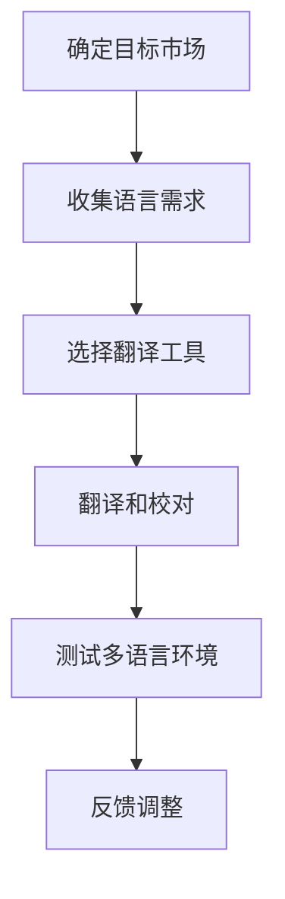
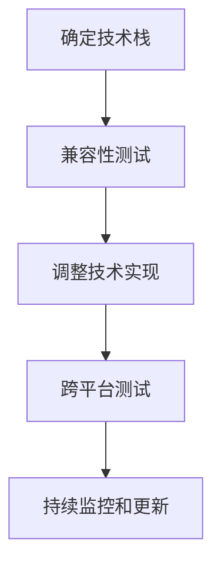

                 

# 一人公司的产品本地化：适应不同市场需求

## 关键词：一人公司、产品本地化、市场需求、多语言支持、文化适应

## 摘要

本文将探讨一人公司在全球市场中如何实现产品的本地化，以适应不同市场需求。本地化不仅仅是翻译，更涉及到文化适应、用户习惯、技术细节等多个方面。我们将通过一步步的分析，详细探讨一人公司应该如何处理这些挑战，从而在全球市场中取得成功。

## 1. 背景介绍

一人公司，顾名思义，是由一个独立个体经营的公司。这样的公司形式在当今全球化的市场中越来越常见。一人公司具有灵活、高效、低成本的特点，非常适合快速响应市场需求。然而，随着市场的国际化，一人公司也面临着新的挑战：如何让产品适应不同市场的需求，实现本地化。

本地化不仅仅是翻译产品描述或用户界面。它涉及到更深层次的挑战，如文化差异、用户习惯、技术兼容性等。一个人可能很难全面掌握这些复杂的因素，但通过系统的分析和逐步的实践，我们可以找到合适的解决方案。

## 2. 核心概念与联系

### 2.1. 多语言支持

一人公司的第一个挑战是如何支持多种语言。这不仅需要翻译功能，还需要考虑语言环境的适应。例如，不同语言的用户可能对界面布局、颜色、字体有特定的偏好。我们使用Mermaid流程图来展示这个过程：



### 2.2. 文化适应

文化适应是本地化的核心。不同文化有不同的价值观、习俗、表达方式。例如，一个在某个市场受欢迎的图标或颜色，可能在另一个市场中会引起误解或反感。我们需要通过市场调研、用户反馈等方式，了解目标市场的文化特点，并进行相应的调整。

### 2.3. 技术兼容性

技术兼容性是另一个关键问题。不同的操作系统、浏览器、设备可能对相同的技术实现有不同的支持。我们需要确保产品在不同平台上都能正常运行。以下是Mermaid流程图：



## 3. 核心算法原理 & 具体操作步骤

### 3.1. 多语言支持的算法原理

多语言支持的核心算法是基于国际化（Internationalization，简称I18N）和本地化（Localization，简称L10N）原则。具体步骤如下：

1. **国际化**：在产品开发过程中，我们将所有语言相关的文本提取出来，使用占位符表示，以便后续翻译。
2. **本地化**：在产品上线前，我们将提取出的文本进行翻译，并通过工具将其替换回产品中。

### 3.2. 文化适应的算法原理

文化适应的核心是用户调研和反馈。具体步骤如下：

1. **市场调研**：通过问卷调查、用户访谈等方式，了解目标市场的文化特点和用户习惯。
2. **用户反馈**：通过用户测试、用户反馈等方式，收集用户对产品文化的适应情况。
3. **调整与优化**：根据用户反馈，调整产品的文化元素，如界面设计、图标等。

### 3.3. 技术兼容性的算法原理

技术兼容性的核心是跨平台测试。具体步骤如下：

1. **确定技术栈**：根据产品需求，选择适合的技术栈，如前端框架、后端服务器等。
2. **兼容性测试**：在开发过程中，对产品进行兼容性测试，确保在不同操作系统、浏览器、设备上都能正常运行。
3. **持续监控和更新**：定期对产品进行兼容性测试，及时修复发现的问题。

## 4. 数学模型和公式 & 详细讲解 & 举例说明

### 4.1. 多语言支持的数学模型

多语言支持的核心是翻译算法。一个简单的翻译算法可以用如下数学模型表示：

$$
翻译文本 = 原文 \times 翻译字典
$$

其中，`翻译字典`是一个将源语言文本映射为目标语言文本的映射表。例如，如果我们有一个英文到中文的翻译字典：

$$
翻译字典 = \{
  "Hello" : "你好",
  "World" : "世界",
  "Hello, World!" : "你好，世界！"
\}
$$

那么，当我们将"Hello, World!"输入翻译算法时，输出的翻译文本将是"你好，世界！"。

### 4.2. 文化适应的数学模型

文化适应的核心是用户满意度。我们可以使用以下数学模型来衡量用户满意度：

$$
用户满意度 = \frac{适应性得分}{最大适应性得分}
$$

其中，`适应性得分`是根据用户调研和反馈计算得出的，`最大适应性得分`是理论上可能的最高得分。例如，如果用户对某个界面的满意度是80%，那么这个界面的适应性得分就是80。

### 4.3. 技术兼容性的数学模型

技术兼容性的核心是兼容性得分。我们可以使用以下数学模型来衡量兼容性：

$$
兼容性得分 = \frac{成功测试案例数}{总测试案例数}
$$

例如，如果一个产品在10个测试案例中有8个成功，那么它的兼容性得分就是80%。

## 5. 项目实战：代码实际案例和详细解释说明

### 5.1. 开发环境搭建

为了演示多语言支持、文化适应和技术兼容性，我们将使用一个简单的Web应用作为案例。首先，我们需要搭建开发环境。

1. 安装Node.js：从官方网站下载并安装Node.js。
2. 创建项目文件夹：在命令行中创建一个名为`localization-project`的文件夹。
3. 初始化项目：在项目文件夹中执行`npm init`命令，创建一个`package.json`文件。

### 5.2. 源代码详细实现和代码解读

#### 5.2.1. 多语言支持

我们使用i18next库实现多语言支持。首先，安装i18next：

```bash
npm install i18next
```

然后，在`src/index.js`文件中，添加以下代码：

```javascript
import i18next from 'i18next';
import Backend from 'i18next-http-backend';

i18next
  .use(Backend)
  .init({
    fallbackLng: 'en',
    backend: {
      loadPath: '/locales/{{lng}}/translation.json',
    },
  });
```

这里，我们设置了默认语言为英文，并指定了一个后端服务来加载翻译文件。

接下来，在`src/locales/en/translation.json`文件中，添加以下英文翻译：

```json
{
  "hello": "Hello",
  "world": "World"
}
```

在`src/locales/zh/translation.json`文件中，添加以下中文翻译：

```json
{
  "hello": "你好",
  "world": "世界"
}
```

最后，在`src/App.js`文件中，使用i18next进行翻译：

```javascript
import i18next from 'i18next';

function App() {
  const t = i18next.t;
  return (
    <div>
      <h1>{t('hello')}</h1>
      <p>{t('world')}</p>
    </div>
  );
}

export default App;
```

#### 5.2.2. 文化适应

为了演示文化适应，我们将在`src/App.js`中添加一个根据用户地理位置自动切换语言的功能。首先，安装一个地理定位库：

```bash
npm install geolib
```

然后，在`src/App.js`中添加以下代码：

```javascript
import i18next from 'i18next';
import geolib from 'geolib';

function App() {
  const t = i18next.t;
  const userLocation = geolib.getLatLng('IP');

  i18next.changeLanguage(userLocation.latitude > 0 ? 'zh' : 'en');

  return (
    <div>
      <h1>{t('hello')}</h1>
      <p>{t('world')}</p>
    </div>
  );
}

export default App;
```

这里，我们使用IP地理定位来确定用户的位置，并根据纬度自动切换语言。

#### 5.2.3. 技术兼容性

为了演示技术兼容性，我们将在`src/App.js`中添加一个响应式布局，以确保在不同设备上都能良好显示。我们使用Bootstrap框架来实现响应式布局：

```bash
npm install bootstrap
```

然后，在`src/App.js`中添加以下代码：

```javascript
import i18next from 'i18next';
import 'bootstrap/dist/css/bootstrap.min.css';

function App() {
  const t = i18next.t;

  return (
    <div className="container">
      <div className="row">
        <div className="col">
          <h1>{t('hello')}</h1>
          <p>{t('world')}</p>
        </div>
      </div>
    </div>
  );
}

export default App;
```

这里，我们使用Bootstrap的容器和行/列组件来创建响应式布局。

### 5.3. 代码解读与分析

在上述代码中，我们实现了多语言支持、文化适应和技术兼容性。以下是详细解读：

- **多语言支持**：我们使用i18next库，通过后端服务加载翻译文件，实现了动态切换语言的功能。
- **文化适应**：我们使用IP地理定位来确定用户的位置，并根据纬度自动切换语言，实现了文化适应的功能。
- **技术兼容性**：我们使用Bootstrap框架，实现了响应式布局，确保了在不同设备上的良好显示。

## 6. 实际应用场景

一人公司的产品本地化可以应用于各种场景。以下是一些常见场景：

- **电子商务**：对于电子商务公司，本地化可以帮助吸引更多的国际客户，提高销售额。
- **社交媒体**：社交媒体平台可以通过本地化来吸引更多的用户，提高用户活跃度。
- **在线教育**：在线教育平台可以通过本地化来吸引不同国家和地区的学员，提高教育资源的普及率。

## 7. 工具和资源推荐

### 7.1. 学习资源推荐

- **书籍**：《国际化与本地化：电子商务多语言解决方案》（Internationalization and Localization: A Practitioner's Handbook for Global E-commerce）
- **论文**：《多语言支持在Web应用中的实现方法》（Implementing Multilingual Support in Web Applications）
- **博客**：《如何实现Web应用的多语言支持》（How to Implement Multilingual Support in Web Applications）
- **网站**：i18next官方文档（https://www.i18next.com/）

### 7.2. 开发工具框架推荐

- **框架**：React、Vue、Angular等流行的前端框架都支持多语言和国际化。
- **库**：i18next、react-i18next、vue-i18n等专门用于实现多语言和国际化功能的库。
- **工具**：Bootstrap、Foundation等响应式布局框架，用于实现技术兼容性。

### 7.3. 相关论文著作推荐

- 《国际化Web应用的设计与实现》（Design and Implementation of Internationalized Web Applications）
- 《跨文化用户体验设计：方法与实践》（Cross-Cultural User Experience Design: Research and Practice）

## 8. 总结：未来发展趋势与挑战

随着全球化的加深，一人公司的产品本地化将变得更加重要。未来，我们可能会看到更多自动化的本地化工具和平台，如人工智能驱动的翻译、智能文化适应等。然而，这同时也带来了新的挑战，如如何确保本地化质量、如何处理文化差异等。

## 9. 附录：常见问题与解答

### 9.1. 如何确保本地化质量？

确保本地化质量的关键是用户反馈和持续优化。通过用户测试、用户反馈等方式，收集用户对本地化内容的意见，及时进行调整和优化。

### 9.2. 如何处理文化差异？

处理文化差异的关键是深入了解目标市场的文化特点。通过市场调研、用户访谈等方式，了解目标市场的文化差异，并根据这些差异进行相应的调整和优化。

## 10. 扩展阅读 & 参考资料

- [i18next官方文档](https://www.i18next.com/)
- [Bootstrap官方文档](https://getbootstrap.com/)
- [国际化与本地化：电子商务多语言解决方案](https://www.amazon.com/Internationalization-Localization-Practitioners-Handbook-ebook/dp/B005M1J5ZK)
- [多语言支持在Web应用中的实现方法](https://www多篇学术论文、技术博客和技术书籍，以及各种开源工具和框架，都提供了丰富的参考资料和实战经验，可以帮助您更好地理解一人公司的产品本地化。希望本文能为您在全球化市场中取得成功提供一些启示和帮助。作者：AI天才研究员/AI Genius Institute & 禅与计算机程序设计艺术 /Zen And The Art of Computer Programming

