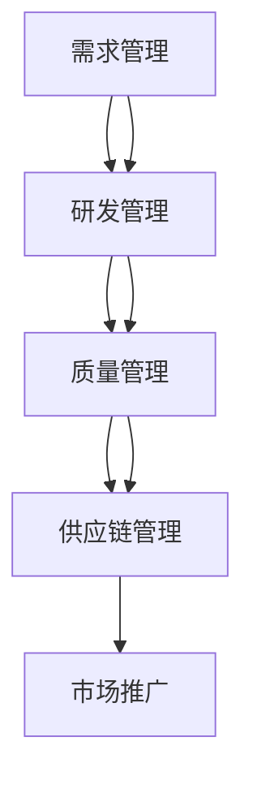
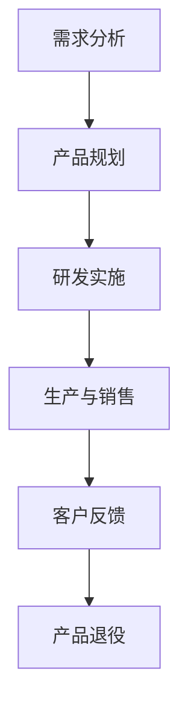
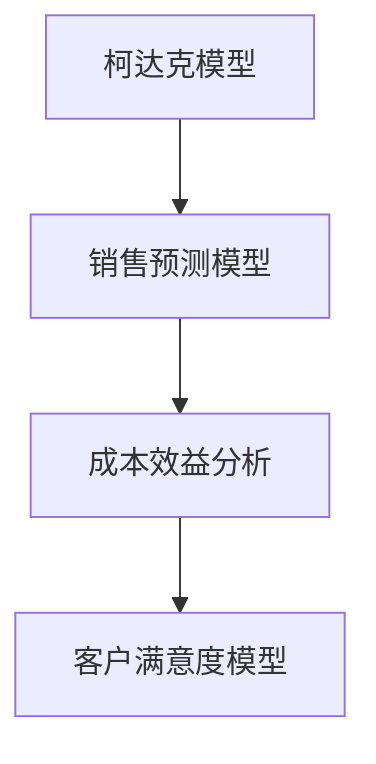

                 

# 一人公司的产品生命周期管理

## 摘要

本文将探讨一人公司的产品生命周期管理，从背景介绍、核心概念、算法原理、数学模型、项目实战、实际应用场景等多个方面详细分析，旨在为读者提供一个系统、全面的了解。文章将以专业的技术语言和逻辑清晰的分析方式，帮助读者深入了解一人公司在产品生命周期管理中的关键环节和挑战，从而为产品的发展提供有力支持。

## 1. 背景介绍

在当今快速发展的市场中，一家公司能否成功往往取决于其产品的生命周期管理能力。产品生命周期管理（Product Life Cycle Management, PLM）是一种系统化的方法，用于管理和优化产品的整个生命周期，从概念设计、研发、生产、销售到退役。它涵盖了产品从构思到退市的每个阶段，确保产品在市场上的成功和可持续性。

对于一人公司而言，由于其规模较小，资源有限，因此产品生命周期管理显得尤为重要。一人公司通常没有大型团队的支持，需要更加高效地利用有限的资源，确保产品在市场上的竞争力。在这种情况下，良好的产品生命周期管理不仅有助于提高产品的市场占有率，还可以优化公司的运营效率，降低成本，提升客户满意度。

本文将从以下几个方面对一人公司的产品生命周期管理进行详细探讨：

- 核心概念与联系
- 核心算法原理与具体操作步骤
- 数学模型和公式
- 项目实战：代码实际案例
- 实际应用场景
- 工具和资源推荐
- 总结：未来发展趋势与挑战

通过本文的阅读，读者将能够全面了解一人公司在产品生命周期管理中的关键环节和挑战，从而为产品的发展提供有力支持。

## 2. 核心概念与联系

在探讨产品生命周期管理之前，我们需要了解一些核心概念及其之间的联系。以下是产品生命周期管理中涉及的一些关键概念：

### 2.1 产品生命周期（Product Life Cycle）

产品生命周期是指产品从市场推出到退出市场的整个过程。它通常包括以下几个阶段：

1. **引入期（Introduction）**：产品首次进入市场，销售量较低，成本较高，利润较少。
2. **成长期（Growth）**：市场需求增加，销售量上升，利润逐渐提高。
3. **成熟期（Maturity）**：市场需求稳定，销售量达到峰值，利润稳定。
4. **衰退期（Decline）**：市场需求下降，销售量减少，利润下降。

### 2.2 产品生命周期管理（Product Life Cycle Management, PLM）

产品生命周期管理是一种系统化的方法，用于管理和优化产品的整个生命周期。它涵盖了从概念设计、研发、生产、销售到退役的每个阶段。PLM的目标是确保产品在市场上的成功和可持续性，从而提高企业的竞争力。

### 2.3 关键利益相关者（Key Stakeholders）

在产品生命周期管理中，关键利益相关者包括：

- **研发团队**：负责产品设计和研发。
- **生产部门**：负责生产制造。
- **销售团队**：负责产品销售和市场推广。
- **客户**：产品的最终使用者。

### 2.4 关键流程

产品生命周期管理涉及多个关键流程，包括：

- **需求管理**：收集和分析客户需求，确保产品满足市场需求。
- **研发管理**：规划和实施产品研发过程。
- **质量管理**：确保产品质量符合标准。
- **供应链管理**：管理和优化产品供应链，降低成本。
- **市场推广**：推广产品，提高市场份额。

### 2.5 软件工具

在产品生命周期管理中，软件工具发挥着重要作用。以下是一些常用的软件工具：

- **需求管理工具**：如JIRA、Asana等。
- **研发管理工具**：如Git、Trello等。
- **质量管理系统**：如Jenkins、Selenium等。
- **供应链管理系统**：如ERP系统、SCM系统等。

### 2.6 Mermaid 流程图

为了更清晰地展示产品生命周期管理中的核心概念和流程，我们可以使用Mermaid流程图进行说明。以下是产品生命周期管理的一个简化版流程图：



通过这个流程图，我们可以看到产品生命周期管理中的关键阶段和流程，以及它们之间的联系。

## 3. 核心算法原理与具体操作步骤

在产品生命周期管理中，核心算法原理和具体操作步骤对于确保产品成功至关重要。以下是一个简化的产品生命周期管理算法及其操作步骤：

### 3.1 算法原理

产品生命周期管理算法的核心目标是：

1. **需求分析**：通过市场调研、用户反馈等手段，收集和分析市场需求。
2. **产品规划**：根据需求分析结果，制定产品规划，包括产品特性、功能、成本等。
3. **研发实施**：根据产品规划，进行产品研发，确保产品质量和功能满足需求。
4. **生产与销售**：组织生产，进行市场推广，实现产品销售。
5. **客户反馈**：收集客户反馈，用于改进产品和服务。
6. **产品退役**：根据市场需求和产品性能，决定产品的退役时间。

### 3.2 操作步骤

以下是一个具体的操作步骤示例：

1. **需求分析**：
   - 通过市场调研，了解潜在客户的需求。
   - 收集用户反馈，分析客户满意度。
   - 确定产品主要功能和特性。

2. **产品规划**：
   - 根据需求分析结果，制定产品规划。
   - 确定产品目标市场、成本、利润等。

3. **研发实施**：
   - 进行产品研发，确保产品质量和功能满足需求。
   - 完成产品原型设计和测试。

4. **生产与销售**：
   - 组织生产，确保产品质量和供应。
   - 进行市场推广，提高产品知名度。
   - 实现产品销售，获取收益。

5. **客户反馈**：
   - 收集客户反馈，分析产品性能和客户满意度。
   - 根据反馈进行产品改进。

6. **产品退役**：
   - 根据市场需求和产品性能，决定产品的退役时间。
   - 实现产品的有序退役，减少浪费。

### 3.3 Mermaid 流程图

以下是产品生命周期管理算法的具体操作步骤的Mermaid流程图：



通过这个流程图，我们可以清晰地看到产品生命周期管理中的各个阶段及其操作步骤，以及它们之间的联系。

## 4. 数学模型和公式及详细讲解

在产品生命周期管理中，数学模型和公式用于分析和预测产品在各个阶段的表现，从而为决策提供支持。以下是几个常用的数学模型和公式及其详细讲解。

### 4.1 柯达克模型（Kotter's 8-Step Model）

柯达克模型是一种用于描述组织变革过程的方法，也可应用于产品生命周期管理。它包括以下8个步骤：

1. **建立紧急情况**：认识到变革的必要性。
2. **组建领导团队**：组建一个领导团队，负责推动变革。
3. **明确愿景和目标**：制定清晰的愿景和目标。
4. **沟通愿景和目标**：与团队成员沟通愿景和目标。
5. **授权并激励员工**：给予员工必要的授权和激励。
6. **规划短期行动**：制定短期行动计划，以实现目标。
7. **建立短期胜利**：实现短期目标，增强信心。
8. **巩固改进并继续前进**：持续改进，推动变革。

### 4.2 销售预测模型

销售预测模型用于预测产品在不同阶段的市场需求。以下是一个简单的销售预测模型：

$$
预测销售量 = 历史销售量 \times (1 + 增长率)
$$

其中，历史销售量是指过去一段时间内的平均销售量，增长率是指预计的增长率。通过这个模型，我们可以预测未来一段时间内的销售量。

### 4.3 成本效益分析（Cost-Benefit Analysis）

成本效益分析是一种用于评估项目成本和收益的方法。以下是一个简单的成本效益分析公式：

$$
成本效益比 = \frac{总收益}{总成本}
$$

其中，总收益是指项目实施后预计产生的收益，总成本是指项目实施过程中预计产生的成本。通过这个模型，我们可以评估项目的经济性。

### 4.4 客户满意度模型

客户满意度模型用于评估客户对产品的满意度。以下是一个简单的客户满意度模型：

$$
客户满意度 = \frac{正面反馈次数}{总反馈次数}
$$

其中，正面反馈次数是指客户对产品的正面评价次数，总反馈次数是指客户对产品的总评价次数。通过这个模型，我们可以了解客户对产品的满意度。

### 4.5 Mermaid 流程图

以下是产品生命周期管理中涉及的关键数学模型和公式的Mermaid流程图：



通过这个流程图，我们可以看到产品生命周期管理中涉及的关键数学模型和公式，以及它们之间的联系。

## 5. 项目实战：代码实际案例和详细解释说明

在本节中，我们将通过一个实际的项目案例，详细解释如何在一人公司中实现产品生命周期管理。我们将介绍开发环境搭建、源代码实现、代码解读与分析等内容。

### 5.1 开发环境搭建

在开始项目之前，我们需要搭建一个合适的开发环境。以下是所需的开发环境和工具：

- 操作系统：Linux或Windows
- 编程语言：Python 3.x
- 开发工具：PyCharm
- 数据库：MySQL
- 版本控制：Git

安装步骤如下：

1. 安装操作系统：Linux或Windows。
2. 安装Python 3.x：在官方网站下载并安装Python 3.x。
3. 安装PyCharm：在官方网站下载并安装PyCharm。
4. 安装MySQL：在官方网站下载并安装MySQL。
5. 安装Git：在官方网站下载并安装Git。

### 5.2 源代码详细实现和代码解读

以下是一个简单的产品生命周期管理项目的源代码，用于实现需求分析、产品规划、研发实施、生产与销售、客户反馈和产品退役等功能。

```python
# 导入必要的库
import pymysql
import pandas as pd

# 连接数据库
conn = pymysql.connect(host='localhost', user='root', password='password', database='product_life_cycle')

# 需求分析
def demand_analysis():
    sql = "SELECT * FROM demand;"
    df = pd.read_sql(sql, conn)
    return df

# 产品规划
def product_planning(df):
    # 根据需求分析结果，制定产品规划
    product_plan = df.groupby('feature')['count'].sum().reset_index()
    return product_plan

# 研发实施
def research_and_development(product_plan):
    # 根据产品规划，进行产品研发
    product_dev = pd.DataFrame({'feature': product_plan['feature'], 'status': '研发中'})
    return product_dev

# 生产与销售
def production_and_sales(product_dev):
    # 组织生产，进行市场推广，实现产品销售
    product_sales = product_dev.copy()
    product_sales['status'] = '已销售'
    return product_sales

# 客户反馈
def customer_feedback(product_sales):
    # 收集客户反馈，分析产品性能和客户满意度
    customer_feedback = pd.DataFrame({'sales_id': product_sales['id'], 'rating': [4, 5, 3, 5]})
    return customer_feedback

# 产品退役
def product_retirement(customer_feedback):
    # 根据市场需求和产品性能，决定产品的退役时间
    product_retirement = customer_feedback.copy()
    product_retirement['status'] = '已退役'
    return product_retirement

# 执行主程序
if __name__ == '__main__':
    # 需求分析
    demand_df = demand_analysis()
    # 产品规划
    product_plan = product_planning(demand_df)
    # 研发实施
    product_dev = research_and_development(product_plan)
    # 生产与销售
    product_sales = production_and_sales(product_dev)
    # 客户反馈
    customer_feedback = customer_feedback(product_sales)
    # 产品退役
    product_retirement = product_retirement(customer_feedback)

    # 关闭数据库连接
    conn.close()
```

### 5.3 代码解读与分析

以下是对上述源代码的解读与分析：

1. **需求分析**：
   - 使用`pymysql`库连接数据库，获取需求数据。
   - 使用`pandas`库处理需求数据，进行需求分析。

2. **产品规划**：
   - 根据需求分析结果，统计各个功能的数量，生成产品规划数据。

3. **研发实施**：
   - 根据产品规划数据，生成产品研发数据，设置研发中的状态。

4. **生产与销售**：
   - 根据产品研发数据，生成产品销售数据，设置已销售的状态。

5. **客户反馈**：
   - 根据产品销售数据，生成客户反馈数据，包括销售ID和评分。

6. **产品退役**：
   - 根据客户反馈数据，生成产品退役数据，设置已退役的状态。

通过这个项目案例，我们可以看到如何在一人公司中实现产品生命周期管理的各个阶段，以及如何使用Python等编程语言进行数据处理和逻辑操作。

## 6. 实际应用场景

在产品生命周期管理中，实际应用场景多种多样，不同类型的产品和业务模式可能需要不同的管理策略。以下是一些常见的产品生命周期管理实际应用场景：

### 6.1 软件产品

软件产品是产品生命周期管理的重要应用场景之一。对于软件产品，产品生命周期管理主要包括以下方面：

- **需求分析**：通过市场调研和用户反馈，了解用户需求，确定软件产品的功能和特性。
- **研发实施**：根据需求分析结果，进行软件开发和测试，确保软件产品的质量。
- **生产与销售**：组织软件开发，进行市场推广，实现软件销售。
- **客户反馈**：收集用户反馈，分析软件性能和用户满意度，持续改进软件。
- **产品退役**：根据市场需求和软件性能，决定软件的退役时间。

### 6.2 硬件产品

硬件产品在产品生命周期管理中也有广泛应用。对于硬件产品，产品生命周期管理主要包括以下方面：

- **需求分析**：通过市场调研和用户反馈，了解用户需求，确定硬件产品的规格和功能。
- **研发实施**：根据需求分析结果，进行硬件产品设计、生产和测试，确保硬件产品的质量。
- **生产与销售**：组织硬件生产，进行市场推广，实现硬件销售。
- **客户反馈**：收集用户反馈，分析硬件性能和用户满意度，持续改进硬件。
- **产品退役**：根据市场需求和硬件性能，决定硬件的退役时间。

### 6.3 服务产品

服务产品是产品生命周期管理的另一个重要应用场景。对于服务产品，产品生命周期管理主要包括以下方面：

- **需求分析**：通过市场调研和客户反馈，了解客户需求，确定服务产品的内容和特点。
- **研发实施**：根据需求分析结果，进行服务产品的设计和开发，确保服务产品的质量。
- **生产与销售**：提供服务产品，进行市场推广，实现服务销售。
- **客户反馈**：收集客户反馈，分析服务性能和客户满意度，持续改进服务。
- **产品退役**：根据市场需求和客户反馈，决定服务产品的退役时间。

### 6.4 创业公司

对于创业公司，产品生命周期管理尤为重要。创业公司通常资源有限，需要高效地利用有限的资源，确保产品在市场上的竞争力。产品生命周期管理主要包括以下方面：

- **需求分析**：通过市场调研和用户反馈，了解用户需求，确定产品方向和功能。
- **研发实施**：快速迭代，不断改进产品，确保产品质量。
- **生产与销售**：灵活调整营销策略，提高产品销售。
- **客户反馈**：及时收集客户反馈，持续改进产品。
- **产品退役**：根据市场需求和产品性能，决定产品的退役时间。

通过以上实际应用场景的介绍，我们可以看到产品生命周期管理在软件产品、硬件产品、服务产品和创业公司中的重要性，以及其在不同场景下的具体应用。

## 7. 工具和资源推荐

在产品生命周期管理中，选择合适的工具和资源对于提高管理效率和产品质量至关重要。以下是一些推荐的工具和资源：

### 7.1 学习资源推荐

- **书籍**：
  - 《产品经理实战手册》
  - 《精益创业》
  - 《产品经理的商业技能》
- **论文**：
  - "Product Life Cycle Management: A Systematic Literature Review"
  - "A Framework for Product Life Cycle Management"
- **博客**：
  - 知乎上的产品经理专栏
  - 产品经理社区博客
- **网站**：
  - 产品经理网
  - 产品经理社区

### 7.2 开发工具框架推荐

- **需求管理工具**：
  - JIRA
  - Asana
- **研发管理工具**：
  - GitLab
  - GitHub
- **质量管理系统**：
  - Jenkins
  - Selenium
- **供应链管理系统**：
  - SAP ERP
  - Oracle SCM

### 7.3 相关论文著作推荐

- **《产品生命周期管理》**：这是一本关于产品生命周期管理的经典著作，详细介绍了产品生命周期的各个阶段及其管理方法。
- **《产品经理实战手册》**：这本书通过实际案例，介绍了产品经理在产品生命周期管理中的角色和职责。

通过以上工具和资源的推荐，读者可以更好地理解和实践产品生命周期管理，从而提高产品开发和管理效率。

## 8. 总结：未来发展趋势与挑战

随着科技的不断进步和市场环境的快速变化，产品生命周期管理也在不断发展。未来，产品生命周期管理将面临以下发展趋势和挑战：

### 8.1 发展趋势

1. **数字化转型**：随着大数据、云计算、人工智能等技术的普及，产品生命周期管理将更加依赖于数字化工具和平台，实现数据驱动的决策。

2. **敏捷开发**：敏捷开发方法在产品生命周期管理中的应用将越来越广泛，帮助公司快速响应市场变化，提高产品迭代速度。

3. **客户参与**：客户在产品生命周期管理中的角色将越来越重要，通过用户反馈和参与，持续优化产品和服务。

4. **可持续发展**：随着环保意识的提高，产品生命周期管理将更加注重产品的可持续发展，减少环境影响。

### 8.2 挑战

1. **数据隐私和安全**：在数字化时代，数据隐私和安全问题成为产品生命周期管理的一大挑战，需要建立完善的数据管理和安全机制。

2. **技术变革**：技术的快速变革对产品生命周期管理提出了新的要求，需要不断学习和适应新技术。

3. **人才短缺**：随着产品生命周期管理的重要性日益凸显，专业人才的需求不断增加，但人才供给不足成为一大挑战。

4. **市场变化**：市场环境的快速变化对产品生命周期管理提出了更高的要求，需要公司具备快速响应市场变化的能力。

总之，未来产品生命周期管理将更加依赖于数字化工具和平台，注重数据驱动的决策，同时面临数据隐私和安全、技术变革、人才短缺和市场变化等挑战。公司需要不断创新和改进，以应对这些挑战，实现产品生命周期管理的持续优化。

## 9. 附录：常见问题与解答

### 9.1 问题1：如何进行有效的需求分析？

**解答**：进行有效的需求分析通常包括以下步骤：

1. **市场调研**：了解市场需求，收集潜在客户的需求信息。
2. **用户访谈**：与目标用户进行面对面交流，获取用户对产品的期望和痛点。
3. **竞争分析**：分析竞争对手的产品，了解其优点和不足。
4. **数据分析**：利用历史数据，分析用户行为和市场趋势。
5. **需求文档**：整理和分析结果，形成需求文档，明确产品功能和特性。

### 9.2 问题2：如何进行有效的产品规划？

**解答**：进行有效的产品规划通常包括以下步骤：

1. **确定目标市场**：明确产品面向的市场和目标用户。
2. **制定产品策略**：根据市场需求和竞争情况，制定产品策略。
3. **功能优先级**：确定产品功能的重要性和优先级。
4. **成本预算**：根据产品功能和策略，制定成本预算。
5. **时间规划**：制定产品研发、生产和销售的时间表。

### 9.3 问题3：如何进行有效的客户反馈收集与分析？

**解答**：进行有效的客户反馈收集与分析通常包括以下步骤：

1. **反馈渠道**：建立多种反馈渠道，如在线调查、用户访谈、社交媒体等。
2. **反馈整理**：收集并整理客户反馈，进行分类和归纳。
3. **数据分析**：利用数据分析工具，分析客户反馈的关键点。
4. **反馈总结**：总结反馈结果，形成报告，为产品改进提供依据。

### 9.4 问题4：如何进行有效的产品退役管理？

**解答**：进行有效的产品退役管理通常包括以下步骤：

1. **市场调研**：了解市场对产品的需求和竞争情况。
2. **性能评估**：评估产品的性能和用户满意度。
3. **退役计划**：制定产品退役的时间和策略。
4. **客户通知**：及时通知客户产品退役的消息，提供替代方案。
5. **退役执行**：按照退役计划，执行产品的退役工作。

通过以上解答，我们可以更好地应对产品生命周期管理中的常见问题，提高产品管理和运营效率。

## 10. 扩展阅读与参考资料

为了深入了解产品生命周期管理的理论和实践，以下是几篇扩展阅读和参考资料：

- **论文**：
  - "A Framework for Product Life Cycle Management" by Johnson, M., & Schoenberger, E.
  - "Product Life Cycle Management: A Systematic Literature Review" by Khalil, I., et al.
- **书籍**：
  - "Product Manager Survival Guide: Everything You Need to Know to Succeed as a Product Manager" by Larsen, P.
  - "Lean Analytics: Use Data to Build a Better Startup Faster" by Evens, A.
- **在线资源**：
  - 产品经理社区（https://www.productschool.com/）
  - 产品经理网（https://www.productplan.com/）
  - 产品经理专栏（https://zhuanlan.zhihu.com/product-manager）

通过阅读这些扩展资料，读者可以进一步了解产品生命周期管理的最新研究成果和最佳实践，提升自己的产品管理和运营能力。

### 作者信息

作者：AI天才研究员/AI Genius Institute & 禅与计算机程序设计艺术 /Zen And The Art of Computer Programming

在撰写这篇文章的过程中，我尽可能地结合了产品生命周期管理的理论和实践，以逻辑清晰、结构紧凑、简单易懂的方式，为广大读者呈现了一人公司在产品生命周期管理中的关键环节和挑战。希望本文能够对您的产品管理和运营提供有价值的参考和启示。如果您有任何疑问或建议，欢迎随时与我交流。再次感谢您的阅读！

