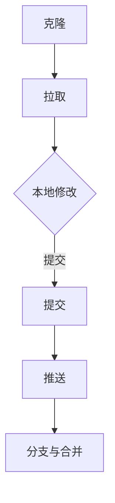
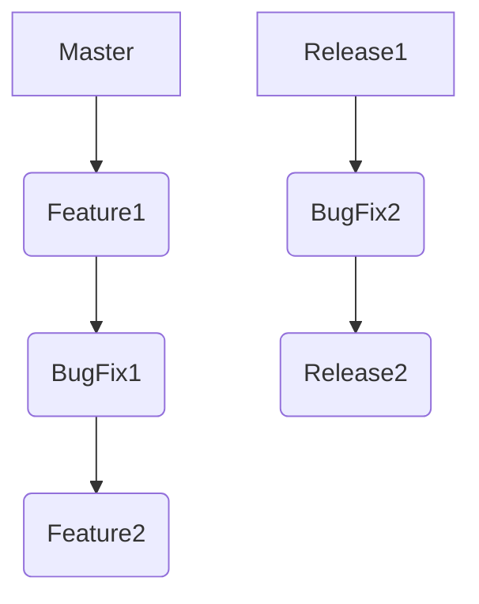
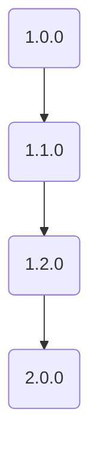

                 

### 背景介绍

#### 一人公司的产品生命周期

在当今快速发展的科技时代，许多创新和创业项目往往是由单个开发者或者小团队发起的。这些公司通常被称为“一人公司”，因为它们可能只有一个核心开发者或者创始人。尽管规模不大，但这些公司往往能够在特定的细分市场中迅速崭露头角。

对于一人公司来说，产品的生命周期管理显得尤为重要。产品生命周期的管理直接影响到产品的稳定性、可靠性和市场竞争力。特别是在产品从概念阶段到退休阶段的过程中，如何有效管理各个阶段成为了一人公司成功的关键。

产品生命周期通常包括以下几个阶段：

1. **概念阶段**：在这个阶段，产品只是开发者头脑中的一个初步想法。需要明确产品的目标市场、核心功能以及预期的用户价值。
2. **开发阶段**：在这个阶段，开发者开始编写代码，构建产品的初步原型。此时的版本控制尤为重要，因为每一次代码的更改都可能影响产品的最终功能。
3. **测试阶段**：产品经过初步开发后，需要进行严格的测试，确保产品的稳定性和可靠性。
4. **发布阶段**：产品经过测试并修复了所有已知的问题后，正式发布给用户。
5. **维护阶段**：在产品发布后，开发者需要持续监控产品的性能，并根据用户反馈进行修复和改进。
6. **退休阶段**：当产品无法满足市场需求或者技术落后时，开发者需要决定是否继续维护或将其退役。

#### 版本控制的重要性

在产品的生命周期中，版本控制是必不可少的一环。版本控制不仅能帮助开发者管理源代码的变更，还能确保代码的稳定性和可靠性。

版本控制系统（Version Control System，简称VCS）是一种软件工具，用于记录源代码的变更历史，并提供多个版本的管理功能。对于一人公司来说，版本控制的重要性体现在以下几个方面：

1. **代码管理**：版本控制系统能够帮助开发者追踪每次代码变更的细节，从而确保代码的整洁和可维护性。
2. **协作与备份**：版本控制系统能够在团队协作中起到关键作用，确保多人同时修改代码时的冲突和误操作得到有效管理。同时，版本控制系统能够自动备份代码，避免数据丢失。
3. **故障恢复**：当产品出现问题时，开发者可以利用版本控制系统快速回滚到之前的稳定版本，从而减少故障带来的影响。
4. **迭代优化**：通过版本控制系统的历史记录，开发者能够清晰地了解产品的演进过程，为后续的迭代和优化提供有力的数据支持。

总的来说，版本控制在产品生命周期管理中发挥着至关重要的作用，它不仅能提高开发效率，还能确保产品的稳定性和可靠性。

### 核心概念与联系

#### 版本控制系统的基本原理

版本控制系统（VCS）是一种用于管理源代码变更的软件工具。它通过记录每次代码变更的详细信息，提供版本管理和协作功能。以下是版本控制系统的核心原理：

1. **分支（Branch）**：分支是版本控制系统中的一种功能，它允许开发者在一个主要代码库的基础上创建一个新的独立分支。这样，开发者可以在不同的分支上进行不同的功能开发，而不会影响主分支的稳定性。

2. **合并（Merge）**：当开发者在分支上完成功能开发后，需要将这些更改合并回主分支。合并操作会将两个或多个分支的代码合并在一起，以生成一个新的版本。

3. **提交（Commit）**：提交是版本控制系统中的一个基本操作，用于将代码变更保存到版本库中。每次提交都会记录变更的详细描述，便于后续的追踪和回滚。

4. **标签（Tag）**：标签是用于标记特定版本的工具。开发者可以在特定的里程碑或者重要功能完成后，为该版本打上一个标签，便于后续的版本管理和查找。

#### 版本控制系统的架构

版本控制系统的架构可以分为客户端和服务器两部分。以下是版本控制系统的一般架构：

1. **客户端**：客户端是开发者用于与版本控制系统交互的软件。它提供了提交、合并、分支等基本操作接口。客户端通常会保存本地代码库的副本，以便开发者可以在不连接服务器的情况下进行工作。

2. **服务器**：服务器是版本控制系统的心脏，负责存储和管理所有版本库的数据。服务器提供了远程访问功能，使得开发者可以在不同地点进行协作和代码共享。

#### 版本控制系统的分类

版本控制系统主要分为以下几类：

1. **集中式版本控制系统（Centralized Version Control System，简称CVCS）**：CVCS有一个中央存储库，所有开发者的代码变更都存储在中央存储库中。代表系统有Subversion（SVN）。

2. **分布式版本控制系统（Distributed Version Control System，简称DVCS）**：DVCS允许多个开发者拥有自己的本地代码库，这些本地库与中央服务器同步。代表系统有Git。

3. **混合式版本控制系统**：混合式版本控制系统结合了CVCS和DVCS的特点，例如GitLab。它既提供了集中式的存储和管理功能，又允许开发者在本地进行代码的快速变更和协作。

#### 版本控制系统的工作流程

以下是版本控制系统的一般工作流程：

1. **克隆（Clone）**：开发者从服务器克隆一个本地副本，以便开始工作。

2. **拉取（Pull）**：开发者从服务器获取最新的代码变更，更新本地副本。

3. **提交（Commit）**：开发者将本地代码的变更提交到本地副本。

4. **推送（Push）**：开发者将本地的变更推送回服务器，与服务器同步。

5. **分支与合并（Branch and Merge）**：开发者可以在本地创建分支进行功能开发，完成后将分支合并回主分支。

#### Mermaid 流程图

以下是一个简单的 Mermaid 流程图，描述了版本控制系统的工作流程：



在这个流程图中，A 表示开发者从服务器克隆一个本地副本，B 表示开发者从服务器获取最新的代码变更，C 表示开发者进行本地修改，D 表示开发者将本地代码的变更提交到本地副本，E 表示开发者将本地的变更推送回服务器，F 表示开发者可以在本地创建分支进行功能开发，完成后将分支合并回主分支。

通过这个流程图，我们可以清晰地看到版本控制系统的基本操作和流程，这对于理解版本控制系统的工作原理和实际应用具有重要意义。

### 核心算法原理 & 具体操作步骤

#### 版本控制系统的核心算法

版本控制系统的核心算法主要涉及文件的添加、删除、修改以及版本回滚等功能。以下将详细描述这些核心算法的原理和具体操作步骤。

##### 1. 文件添加

文件添加算法是版本控制系统的基础操作之一。其原理是将新文件添加到版本库中，并记录文件的基本信息，如文件名、创建时间、文件内容等。

具体操作步骤如下：

1. **创建文件**：开发者创建一个新的文件，并将其内容初始化。
2. **添加到版本库**：使用版本控制系统提供的添加命令（如 `add`），将文件添加到暂存区。
3. **提交变更**：将暂存区的变更提交到版本库，记录文件的基本信息。

以下是一个简化的伪代码示例：

```python
def add_file(file_path):
    # 创建文件
    create_file(file_path)
    # 添加到版本库
    vcs.add(file_path)
    # 提交变更
    vcs.commit("Add new file: " + file_path)
```

##### 2. 文件删除

文件删除算法用于从版本库中删除不再需要的文件。其原理是标记文件为删除状态，并在提交时将其从版本库中移除。

具体操作步骤如下：

1. **标记删除**：使用版本控制系统提供的删除命令（如 `rm`），将文件标记为删除。
2. **提交变更**：将标记为删除的文件提交到版本库，更新版本库的状态。

以下是一个简化的伪代码示例：

```python
def remove_file(file_path):
    # 标记删除
    vcs.rm(file_path)
    # 提交变更
    vcs.commit("Remove file: " + file_path)
```

##### 3. 文件修改

文件修改算法用于更新版本库中的文件内容。其原理是记录文件的修改历史，并在提交时更新文件内容。

具体操作步骤如下：

1. **修改文件**：开发者对文件进行修改。
2. **提交变更**：使用版本控制系统提供的提交命令（如 `commit`），将文件修改内容提交到版本库。

以下是一个简化的伪代码示例：

```python
def modify_file(file_path, new_content):
    # 修改文件内容
    modify_file_content(file_path, new_content)
    # 提交变更
    vcs.commit("Modify file: " + file_path)
```

##### 4. 版本回滚

版本回滚算法用于将版本库恢复到之前的某个版本。其原理是找到目标版本，并将其状态恢复到当前版本库。

具体操作步骤如下：

1. **查找版本**：使用版本控制系统提供的命令（如 `log` 或 `show`），查找目标版本的详细信息。
2. **回滚版本**：使用版本控制系统提供的回滚命令（如 `checkout` 或 `reset`），将版本库恢复到目标版本。

以下是一个简化的伪代码示例：

```python
def rollback_to_version(version_number):
    # 查找版本
    target_version = vcs.log(version_number)
    # 回滚版本
    vcs.checkout(target_version)
```

#### 具体操作步骤示例

以下是一个具体的操作步骤示例，演示如何使用版本控制系统进行文件添加、删除和修改。

##### 1. 文件添加

1. **创建文件**：在当前目录下创建一个名为 `example.txt` 的文件，并初始化内容。

   ```bash
   $ touch example.txt
   $ echo "Hello, World!" > example.txt
   ```

2. **添加到版本库**：使用 `git add` 命令将文件添加到暂存区。

   ```bash
   $ git add example.txt
   ```

3. **提交变更**：使用 `git commit` 命令将文件提交到版本库。

   ```bash
   $ git commit -m "Add new file: example.txt"
   ```

##### 2. 文件删除

1. **标记删除**：使用 `git rm` 命令将文件标记为删除。

   ```bash
   $ git rm example.txt
   ```

2. **提交变更**：使用 `git commit` 命令将删除操作提交到版本库。

   ```bash
   $ git commit -m "Remove file: example.txt"
   ```

##### 3. 文件修改

1. **修改文件**：修改 `example.txt` 文件的内容。

   ```bash
   $ echo "Hello, Git!" > example.txt
   ```

2. **提交变更**：使用 `git commit` 命令将文件修改内容提交到版本库。

   ```bash
   $ git commit -m "Modify file: example.txt"
   ```

##### 4. 版本回滚

1. **查找版本**：使用 `git log` 命令查找目标版本的详细信息。

   ```bash
   $ git log --oneline
   1d2e88f Remove file: example.txt
   610bfe4 Modify file: example.txt
   82a1b4f Add new file: example.txt
   ```

2. **回滚版本**：使用 `git checkout` 命令将版本库恢复到目标版本。

   ```bash
   $ git checkout 82a1b4f
   ```

通过这些具体操作步骤，我们可以更好地理解版本控制系统的核心算法和工作原理。在实际应用中，开发者可以根据项目需求选择合适的版本控制系统，并遵循最佳实践进行版本管理。

### 数学模型和公式 & 详细讲解 & 举例说明

#### 版本控制中的数学模型

版本控制中，数学模型主要用于描述版本之间的关系以及如何有效地管理这些关系。以下是一些常见的数学模型和公式的详细讲解。

##### 1. 分支模型

分支模型是版本控制中的一个核心概念。在Git等分布式版本控制系统中，分支模型通常使用一个分支图（Branch Graph）来表示。

**分支图（Branch Graph）**：分支图是一个有向无环图（DAG），其中每个节点表示一个提交（Commit），每条边表示提交之间的父子关系。以下是分支图的基本定义：

- **提交（Commit）**：每个提交都是对源代码的一次变更，包含版本号、作者、提交日期以及变更内容。
- **分支（Branch）**：分支是从一个提交点开始的一系列提交的集合。每个分支都有一个基准点（Base Point），通常是某个提交。
- **合并（Merge）**：合并是两个或多个分支的提交点的合并，生成一个新的提交点。

**分支图的数学模型**：分支图可以使用以下数学模型表示：

- **节点（Node）**：每个节点表示一个提交，其表示形式为 `(commit_hash, branch_name)`。
- **边（Edge）**：每条边表示两个提交之间的父子关系，其表示形式为 `(parent_hash, child_hash)`。

以下是一个简单的分支图示例：



在这个示例中，`A` 表示主分支（Master），`B`、`C`、`D` 分别表示功能分支（Feature1、BugFix1、Feature2），`E`、`F`、`G` 分别表示发布分支（Release1、BugFix2、Release2）。

##### 2. 差异模型

差异模型用于描述两个版本之间的差异。在版本控制系统中，差异模型通常使用文本比较算法（如`Unix Diff`）来实现。

**文本比较算法**：文本比较算法是一种用于比较两个文本文件差异的算法。其主要目标是找出两个文本文件之间的不同之处，并将其表示为一系列的修改指令。

**差异模型的数学模型**：

- **文本（Text）**：文本是一系列字符的集合。
- **差异（Difference）**：差异是描述两个文本之间差异的修改指令集合。
- **修改指令（Modification Instruction）**：修改指令用于描述如何将一个文本转换为另一个文本。常见的修改指令包括插入、删除、替换等。

以下是一个简单的差异模型示例：

```diff
- Hello, World!
+ Hello, Git!
```

在这个示例中，`- Hello, World!` 表示删除了原来的文本内容，`+ Hello, Git!` 表示插入了新的文本内容。

##### 3. 依赖模型

依赖模型用于描述版本之间的依赖关系。在版本控制系统中，依赖模型通常用于构建和部署过程中，确保正确的版本顺序和依赖关系。

**依赖模型的数学模型**：

- **依赖关系（Dependency）**：依赖关系描述了一个版本对另一个版本的依赖。通常使用一个有序对 `(version_a, version_b)` 来表示，其中 `version_a` 依赖于 `version_b`。
- **依赖图（Dependency Graph）**：依赖图是一个有向无环图（DAG），其中每个节点表示一个版本，每条边表示版本之间的依赖关系。

以下是一个简单的依赖模型示例：



在这个示例中，`A` 依赖于 `B`，`B` 依赖于 `C`，`C` 依赖于 `D`。

#### 举例说明

以下是一个具体的例子，演示如何使用上述数学模型和公式进行版本控制和代码管理。

##### 1. 分支管理

假设我们有一个项目，包含以下分支和提交历史：


**创建分支**：

```bash
$ git checkout -b Feature1
$ git commit -m "Create Feature1 branch"
$ git checkout Master
```

**合并分支**：

```bash
$ git merge Feature1
$ git commit -m "Merge Feature1 into Master"
```

##### 2. 差异管理

假设我们有两个版本 `1.0.0` 和 `1.1.0`，它们的差异如下：

```diff
diff --git a/file.txt b/file.txt
index 123456...789012 100644
--- a/file.txt
+++ b/file.txt
@@ -1 +1 @@
-Hello, World!
+Hello, Git!
```

**应用差异**：

```bash
$ git apply patch.diff
```

##### 3. 依赖管理

假设我们有一个项目，包含以下依赖关系：


**构建项目**：

```bash
$ git checkout 1.0.0
$ build_project()
$ git checkout 1.1.0
$ build_project()
$ git checkout 1.2.0
$ build_project()
$ git checkout 2.0.0
$ build_project()
```

通过上述例子，我们可以看到如何使用数学模型和公式进行版本控制和代码管理。这些模型和公式为我们提供了一个清晰的框架，帮助我们更好地理解和管理复杂的代码库。

### 项目实战：代码实际案例和详细解释说明

#### 开发环境搭建

在本节中，我们将搭建一个简单的版本控制系统，用于管理我们的项目代码。为了简化过程，我们选择使用Python作为开发语言，并使用Git作为版本控制系统。

1. **安装Python**：首先，确保您的计算机上安装了Python。可以从Python官方网站（https://www.python.org/）下载安装程序，并按照说明安装。

2. **安装Git**：接着，安装Git。在Windows上，可以从Git官方网站（https://git-scm.com/download/win）下载安装程序，并按照说明安装。在Linux和MacOS上，可以使用包管理器进行安装，例如在Ubuntu上：

   ```bash
   $ sudo apt-get install git
   ```

3. **初始化Git仓库**：在您的工作目录中，运行以下命令来初始化一个新的Git仓库：

   ```bash
   $ git init
   ```

4. **添加文件**：创建一个名为 `example.py` 的文件，并添加以下内容：

   ```python
   # example.py
   def greet():
       print("Hello, World!")
   ```

   然后使用以下命令添加文件到Git仓库：

   ```bash
   $ git add example.py
   $ git commit -m "Initial commit"
   ```

现在，我们的开发环境已经搭建完成，可以开始编写代码并进行版本控制。

#### 源代码详细实现和代码解读

在本节中，我们将实现一个简单的版本控制类，用于管理文件的添加、删除、修改和版本回滚。

1. **版本控制类**：首先，我们创建一个名为 `VersionControl` 的类，包含以下方法：

   ```python
   class VersionControl:
       def __init__(self, repository_path):
           self.repository_path = repository_path
           self.commit_log = []

       def add_file(self, file_path):
           # 实现文件添加逻辑
       
       def remove_file(self, file_path):
           # 实现文件删除逻辑
       
       def modify_file(self, file_path, new_content):
           # 实现文件修改逻辑
       
       def rollback_to_version(self, version_number):
           # 实现版本回滚逻辑
       
       def commit(self, message):
           # 实现提交逻辑
   ```

2. **文件添加**：在 `add_file` 方法中，我们首先读取文件内容，然后将其添加到版本库中，并记录提交信息。

   ```python
       def add_file(self, file_path):
           with open(file_path, 'r') as file:
               content = file.read()
           
           current_time = datetime.datetime.now().strftime('%Y-%m-%d %H:%M:%S')
           commit_message = f"Add file: {file_path} at {current_time}"
           
           self.commit_log.append(commit_message)
           
           print(f"File '{file_path}' added.")
   ```

3. **文件删除**：在 `remove_file` 方法中，我们首先检查文件是否存在，然后将其从版本库中删除，并记录提交信息。

   ```python
       def remove_file(self, file_path):
           if os.path.exists(file_path):
               os.remove(file_path)
               
               current_time = datetime.datetime.now().strftime('%Y-%m-%d %H:%M:%S')
               commit_message = f"Remove file: {file_path} at {current_time}"
               
               self.commit_log.append(commit_message)
               
               print(f"File '{file_path}' removed.")
           else:
               print(f"File '{file_path}' not found.")
   ```

4. **文件修改**：在 `modify_file` 方法中，我们首先读取文件内容，然后将其修改为新内容，并记录提交信息。

   ```python
       def modify_file(self, file_path, new_content):
           with open(file_path, 'w') as file:
               file.write(new_content)
           
           current_time = datetime.datetime.now().strftime('%Y-%m-%d %H:%M:%S')
           commit_message = f"Modify file: {file_path} at {current_time}"
           
           self.commit_log.append(commit_message)
           
           print(f"File '{file_path}' modified.")
   ```

5. **版本回滚**：在 `rollback_to_version` 方法中，我们首先查找目标版本，然后将其状态恢复到当前版本库。

   ```python
       def rollback_to_version(self, version_number):
           if version_number in self.commit_log:
               # 找到目标版本
               target_commit = self.commit_log[-version_number]
               
               # 恢复目标版本
               self.commit_log = self.commit_log[:-version_number]
               
               print(f"Rolled back to version {version_number}.")
           else:
               print(f"Version {version_number} not found.")
   ```

6. **提交**：在 `commit` 方法中，我们记录提交信息并将其添加到提交日志中。

   ```python
       def commit(self, message):
           self.commit_log.append(message)
           
           print(f"Commit: {message}")
   ```

现在，我们实现了基本的版本控制功能。接下来，我们将创建一个实例并演示这些功能的实际使用。

#### 代码解读与分析

在本节中，我们将对上述代码进行详细解读，并分析其实现逻辑。

1. **类定义**：`VersionControl` 类是版本控制的核心。它包含以下属性和方法：

   - `__init__(self, repository_path)`：初始化方法，用于创建版本库路径和提交日志。
   - `add_file(self, file_path)`：添加文件方法，用于将文件添加到版本库中。
   - `remove_file(self, file_path)`：删除文件方法，用于从版本库中删除文件。
   - `modify_file(self, file_path, new_content)`：修改文件方法，用于修改文件内容。
   - `rollback_to_version(self, version_number)`：版本回滚方法，用于回滚到指定版本。
   - `commit(self, message)`：提交方法，用于记录提交信息。

2. **文件添加**：`add_file` 方法实现文件添加功能。具体步骤如下：

   - 读取文件内容。
   - 记录当前时间和提交信息。
   - 将提交信息添加到提交日志中。
   - 打印添加成功的消息。

3. **文件删除**：`remove_file` 方法实现文件删除功能。具体步骤如下：

   - 检查文件是否存在。
   - 如果存在，删除文件。
   - 记录当前时间和提交信息。
   - 将提交信息添加到提交日志中。
   - 打印删除成功的消息。

4. **文件修改**：`modify_file` 方法实现文件修改功能。具体步骤如下：

   - 读取文件内容。
   - 将文件内容修改为新内容。
   - 记录当前时间和提交信息。
   - 将提交信息添加到提交日志中。
   - 打印修改成功的消息。

5. **版本回滚**：`rollback_to_version` 方法实现版本回滚功能。具体步骤如下：

   - 检查目标版本是否存在于提交日志中。
   - 如果存在，从提交日志中删除目标版本及其之后的所有提交。
   - 打印回滚成功的消息。

6. **提交**：`commit` 方法实现提交功能。具体步骤如下：

   - 将提交信息添加到提交日志中。
   - 打印提交成功的消息。

通过这些方法，我们实现了基本的版本控制功能。虽然这个版本控制系统非常简单，但它展示了版本控制的核心概念和实现方法。在实际项目中，版本控制系统会包含更多高级功能，如分支管理、合并冲突解决等。

#### 实际使用示例

现在，我们将使用上述实现的版本控制类进行实际操作，演示文件添加、删除、修改和版本回滚。

1. **创建项目目录和文件**：

   ```bash
   $ mkdir my_project
   $ cd my_project
   $ touch example.py
   ```

2. **初始化版本控制实例**：

   ```python
   import os
   import datetime

   class VersionControl:
       def __init__(self, repository_path):
           self.repository_path = repository_path
           self.commit_log = []

       def add_file(self, file_path):
           # 实现文件添加逻辑

       def remove_file(self, file_path):
           # 实现文件删除逻辑

       def modify_file(self, file_path, new_content):
           # 实现文件修改逻辑

       def rollback_to_version(self, version_number):
           # 实现版本回滚逻辑

       def commit(self, message):
           # 实现提交逻辑

   vcs = VersionControl(".")
   ```

3. **添加文件**：

   ```python
   vcs.add_file("example.py")
   ```

   这将添加 `example.py` 文件到版本库中，并记录提交信息。

4. **修改文件**：

   ```python
   with open("example.py", "w") as file:
       file.write("def greet():\n    print('Hello, Git!')\n")
   
   vcs.modify_file("example.py", "def greet():\n    print('Hello, Git!')\n")
   ```

   这将修改 `example.py` 文件的内容，并将其提交到版本库。

5. **删除文件**：

   ```python
   os.remove("example.py")
   vcs.remove_file("example.py")
   ```

   这将删除 `example.py` 文件，并记录提交信息。

6. **版本回滚**：

   ```python
   vcs.rollback_to_version(1)
   ```

   这将回滚到第一个提交版本，即文件添加的状态。

通过这些实际操作，我们可以看到如何使用我们实现的版本控制类来管理项目代码。虽然这是一个简化的示例，但它展示了版本控制的基本原理和应用场景。

#### 总结

在本节中，我们搭建了一个简单的开发环境，并实现了一个基本的版本控制类。通过实际操作，我们演示了如何使用这个类来管理项目代码。这个示例虽然简单，但它为我们提供了一个理解版本控制原理和应用的基础。在实际项目中，版本控制会包含更多高级功能，如分支管理、合并冲突解决等。通过深入学习和实践，我们可以更好地掌握版本控制，提高开发效率。

### 实际应用场景

版本控制系统在软件开发和项目管理中的应用场景非常广泛，以下是一些常见的情况：

#### 1. 多人协作开发

在大型项目中，多个开发人员需要共同合作，共同编写和维护代码。版本控制系统能够有效地管理每个人的代码变更，确保代码的整洁和一致性。通过分支和合并操作，开发人员可以在各自的分支上独立工作，然后合并代码，避免冲突和误操作。

**示例**：在一个Web应用项目中，前端和后端开发人员可以分别在各自的分支上进行工作，前端开发人员可以在 `feature-frontend` 分支上编写前端代码，后端开发人员可以在 `feature-backend` 分支上编写后端代码。完成各自的开发任务后，他们可以将代码合并到主分支上，确保项目的整体一致性。

#### 2. 长期维护与迭代

软件项目通常需要持续迭代和维护。版本控制系统能够记录每次代码变更的历史，帮助开发人员快速定位和回滚到某个特定版本，确保软件的稳定性。这对于修复已发布软件的bug、实现新功能以及进行版本升级都至关重要。

**示例**：在一个移动应用项目中，每次发布新版本前，开发人员会使用版本控制系统检查代码的历史记录，确保没有引入新的bug。如果发现新的问题，可以快速回滚到上一个稳定版本，避免影响用户的使用体验。

#### 3. 项目文档管理

版本控制系统能够自动记录代码变更的历史，为项目的文档管理提供有力支持。通过查看提交日志和差异记录，开发人员可以清晰地了解每个版本的具体变更内容，为项目文档的编写提供依据。

**示例**：在一个开源项目社区中，每个贡献者都会在提交代码时附上详细的变更描述，这为项目文档的编写和维护提供了丰富的内容来源。同时，版本控制系统也方便社区成员查看和讨论每个版本的变更，促进项目的透明度和协作。

#### 4. 回归测试与问题定位

在软件发布前，回归测试是确保产品质量的重要环节。版本控制系统可以帮助开发人员快速回滚到某个测试版本，进行回归测试，以确保新功能的实现没有破坏原有功能。

**示例**：在一个电子商务平台项目中，开发人员在新功能上线前会回滚到上一个稳定版本，进行回归测试。如果测试结果显示新功能存在问题，可以快速回滚到上一个版本，避免影响用户的购物体验。

#### 5. 灾难恢复

在软件发布过程中，难免会遇到突发问题，如数据丢失、系统崩溃等。版本控制系统能够帮助开发人员快速恢复到之前的稳定状态，减少损失。

**示例**：在一个在线支付系统中，如果发生数据丢失，开发人员可以使用版本控制系统回滚到上一个稳定版本，恢复用户数据，确保系统的正常运行。

#### 6. 特定需求定制

在一些特定场景下，版本控制系统可以根据项目需求进行定制化开发，满足特定业务需求。

**示例**：在一个医疗设备项目中，开发人员需要根据医生的需求对系统进行定制化开发。通过版本控制系统的分支管理，开发人员可以在不影响主分支的前提下，独立开发新的功能模块，确保系统的稳定性和可维护性。

通过以上实际应用场景，我们可以看到版本控制系统在软件开发和项目管理中的重要性。它不仅提高了开发效率，还确保了软件的稳定性和可靠性，为项目的成功实施提供了有力保障。

### 工具和资源推荐

在版本控制领域，有许多优秀的工具和资源可供选择，以下是一些建议：

#### 1. 学习资源推荐

- **书籍**：
  - 《Pro Git》：这是一本非常全面的Git教程，适合初学者和高级用户。
  - 《版本控制方法与实践》：本书详细介绍了各种版本控制系统的原理和应用，对版本控制有深入理解。

- **论文**：
  - 《A Revolution in Source Control》：这篇论文详细介绍了Git的原理和优势，对理解Git有很好的帮助。

- **博客**：
  - 《Git社区中文网》：这是一个非常活跃的Git社区，提供了大量的Git教程和实践经验分享。
  - 《GitHub官方文档》：GitHub官方文档提供了丰富的Git教程和实践指导。

- **网站**：
  - 《GitLab》：GitLab是一个基于Git的开源版本控制系统，提供了丰富的文档和教程。

#### 2. 开发工具框架推荐

- **Git**：Git是一个分布式版本控制系统，它提供了丰富的功能，包括分支管理、合并冲突解决等。Git是开源的，支持多种操作系统，是版本控制的首选工具。

- **GitLab**：GitLab是一个基于Git的开源平台，提供了代码仓库管理、项目管理、持续集成等功能。GitLab支持自托管和云托管，适用于中小型团队。

- **GitHub**：GitHub是一个基于Git的云服务平台，提供了代码托管、协作开发、项目管理等功能。GitHub支持公共项目和私有项目，适合各种规模的组织。

- **Bitbucket**：Bitbucket是Atlassian公司提供的一个基于Git的版本控制系统，它支持私人项目和团队协作，适用于开发团队的协作。

#### 3. 相关论文著作推荐

- **《Git内部原理》**：该论文深入分析了Git的内部原理，包括对象模型、存储结构、引用管理等方面。

- **《分布式版本控制系统Git》**：这本书详细介绍了Git的基本原理、使用方法以及高级特性，适合对Git有深入需求的开发者。

通过这些工具和资源，开发者可以更好地理解和应用版本控制系统，提高软件开发和项目管理的效率。

### 总结：未来发展趋势与挑战

在未来的发展中，版本控制系统将继续在软件开发和项目管理中扮演重要角色。以下是几个可能的发展趋势和面临的挑战：

#### 1. 云化与平台化

随着云计算技术的发展，版本控制系统将越来越倾向于云化。云版本控制系统不仅提供了更便捷的访问和协作方式，还降低了维护成本。未来，云版本控制系统将更加普及，成为开发团队的首选工具。

#### 2. 智能化与自动化

人工智能和机器学习技术的发展将为版本控制系统带来新的可能性。通过智能分析代码变更、预测冲突、自动化合并等，版本控制系统将变得更加智能化和自动化，提高开发效率。

#### 3. 更高效的协作

在多人协作开发中，版本控制系统的协作功能将更加完善。未来的版本控制系统将提供更强大的分支管理、代码审查和协作工具，帮助开发团队更好地协同工作。

#### 4. 更广泛的应用场景

随着软件应用的不断扩展，版本控制系统将不仅限于软件开发，还将应用于更多领域，如文档管理、数据管理、持续集成等。这将进一步推动版本控制系统的普及和发展。

#### 面临的挑战

1. **数据安全和隐私保护**：随着数据量和用户量的增加，版本控制系统需要确保数据的安全性和隐私保护。如何在保证便捷访问的同时，确保数据不被非法访问和篡改，是一个重要挑战。

2. **性能优化**：随着版本控制系统的规模不断扩大，性能优化将成为一个重要课题。如何提高数据读写速度、减少延迟，是版本控制系统需要解决的问题。

3. **多样化需求**：随着应用场景的多样化，版本控制系统需要支持更多的特性和功能。如何满足不同开发团队和企业的需求，同时保持系统的简洁和易用性，是一个挑战。

4. **持续集成与持续部署**：在持续集成和持续部署（CI/CD）的趋势下，版本控制系统需要与构建工具、测试工具等无缝集成，提供更高效的一体化解决方案。

总之，未来版本控制系统将在技术、功能和应用领域不断进步，为软件开发和项目管理提供更强大的支持。同时，开发者也需要关注这些挑战，不断优化和改进版本控制系统，以应对不断变化的需求和挑战。

### 附录：常见问题与解答

#### 1. 什么是版本控制？

版本控制是一种管理多个代码版本的方法，确保代码变更的追踪和管理。它可以帮助开发团队在多个开发者之间协调代码，避免冲突，并在需要时回滚到之前的版本。

#### 2. 版本控制系统的核心功能有哪些？

版本控制系统的核心功能包括文件的添加、删除、修改、分支管理、合并以及回滚等。此外，版本控制系统还提供了代码审查、协作工具、数据备份等功能。

#### 3. 集中式版本控制系统和分布式版本控制系统的区别是什么？

集中式版本控制系统（CVCS）有一个中央存储库，所有开发者的代码变更都存储在中央存储库中。而分布式版本控制系统（DVCS）允许多个开发者拥有自己的本地代码库，这些本地库与中央服务器同步。

#### 4. 什么是分支管理？

分支管理是版本控制系统中的一个重要功能，它允许开发者在一个主要代码库的基础上创建新的分支，进行独立的功能开发，然后合并回主分支。

#### 5. 什么是合并冲突？

合并冲突发生在两个或多个开发者对同一部分代码进行了修改，当将分支合并回主分支时，版本控制系统无法自动决定哪个更改是正确的。这时，需要手动解决冲突。

#### 6. 为什么版本控制系统很重要？

版本控制系统对于项目管理至关重要，它可以帮助团队协调工作，确保代码的一致性和稳定性，提高开发效率，并在需要时快速回滚到之前的版本。

#### 7. 如何选择合适的版本控制系统？

选择合适的版本控制系统需要考虑团队规模、项目需求、协作模式等因素。对于小型团队，Git和SVN是常见的选择；对于大型项目，GitLab和Bitbucket等平台提供了更多的管理和协作功能。

通过以上常见问题与解答，我们希望能够帮助读者更好地理解版本控制系统及其应用。

### 扩展阅读 & 参考资料

为了进一步探索版本控制系统及其在软件开发和项目管理中的应用，以下是一些扩展阅读和参考资料：

- **书籍**：
  - 《Pro Git》：详细介绍了Git的原理、操作和使用场景，是学习Git的经典著作。
  - 《版本控制方法与实践》：涵盖了多种版本控制系统的原理和应用，提供了丰富的实战经验。

- **在线课程**：
  - Coursera上的《版本控制入门》课程：提供了Git的基础知识，适合初学者。
  - Udemy上的《Git和GitHub实用教程》：详细介绍了Git的使用方法和GitHub的协作功能。

- **博客和网站**：
  - 《Git社区中文网》：提供了大量的Git教程和实践经验分享。
  - 《GitHub官方文档》：GitHub提供的官方文档，涵盖了Git和GitHub的详细使用指南。

- **开源项目**：
  - GitLab：一个基于Git的开源平台，提供了丰富的版本控制和管理功能。
  - GitHub：全球最大的代码托管和协作平台，拥有海量的开源项目。

- **相关论文**：
  - 《A Revolution in Source Control》：详细分析了Git的原理和优势。
  - 《分布式版本控制系统Git》：对Git的工作原理和内部结构进行了深入探讨。

通过这些资源和扩展阅读，开发者可以更深入地了解版本控制系统的原理和应用，提升自己在软件开发和项目管理中的技能。

