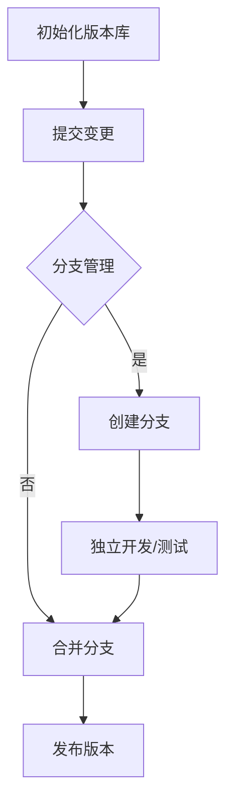

                 

# 一人公司的产品迭代与版本控制

## 关键词
- 产品迭代
- 版本控制
- 一人公司
- Git
- 工作流程
- 自动化
- 测试
- 部署

## 摘要

本文旨在探讨一人公司在产品迭代过程中的版本控制策略。我们将分析版本控制的基本概念，讨论其在小型企业中的重要性，并提供一套适用于个人开发者的产品迭代和版本管理流程。通过实际的开发案例，我们将展示如何利用Git等工具实现高效的版本控制，并探讨未来发展趋势与面临的挑战。

## 1. 背景介绍

在当今快速变化的技术时代，产品和服务的迭代速度越来越快。对于企业来说，如何有效地管理产品迭代和版本控制，确保产品质量和客户满意度，成为一项关键任务。尤其是在小型企业或一人公司中，由于资源有限，如何高效地管理产品迭代，确保项目进度和质量，成为迫切需要解决的问题。

版本控制是一种管理项目源代码和文档变化的技术。它可以帮助开发者追踪代码的变更历史，协作开发，确保代码的完整性和一致性。在多人协作的项目中，版本控制是必不可少的。然而，对于一人公司或小型团队来说，版本控制同样重要。它可以确保开发者能够轻松回滚到之前的版本，避免因错误导致的重大损失。

## 2. 核心概念与联系

### 2.1 版本控制的基本概念

版本控制主要包括以下几个核心概念：

- **版本（Version）**：代码或文档的一个特定状态，通常通过数字或标签来标识。
- **变更（Change）**：对代码或文档的修改。
- **提交（Commit）**：将变更保存到版本库中。
- **分支（Branch）**：从主分支分离出来，用于独立开发或测试的分支。
- **合并（Merge）**：将分支上的变更合并到主分支。

### 2.2 版本控制工具

目前，最流行的版本控制工具是Git。Git是一款开源的分布式版本控制系统，具有高效、灵活、易用等特点。以下是Git的一些核心功能：

- **分布式存储**：每个开发者都有自己的版本库，可以独立工作。
- **分支管理**：轻松创建、切换和合并分支，便于独立开发或测试。
- **快速操作**：Git的算法效率高，操作速度快。
- **强大的合并能力**：Git能够智能地处理合并冲突，提高合并效率。

### 2.3 版本控制流程

版本控制的流程可以分为以下几个步骤：

1. **初始化版本库**：创建一个新的版本库，用于存储项目文件。
2. **提交变更**：开发者对代码或文档进行修改后，将其提交到版本库中。
3. **分支管理**：根据开发需求，创建分支用于独立开发或测试。
4. **合并分支**：将分支上的变更合并到主分支，确保代码的一致性。
5. **发布版本**：将合并后的代码打包成版本，供用户使用。

### 2.4 Mermaid 流程图

以下是版本控制流程的Mermaid流程图：



## 3. 核心算法原理 & 具体操作步骤

### 3.1 Git 操作步骤

以下是使用Git进行版本控制的基本操作步骤：

1. **安装Git**：在官方网站下载并安装Git。

2. **初始化版本库**：

   ```shell
   git init
   ```

3. **添加文件到版本库**：

   ```shell
   git add <file>
   ```

4. **提交变更**：

   ```shell
   git commit -m "提交信息"
   ```

5. **查看提交历史**：

   ```shell
   git log
   ```

6. **创建分支**：

   ```shell
   git branch <branch-name>
   ```

7. **切换分支**：

   ```shell
   git checkout <branch-name>
   ```

8. **合并分支**：

   ```shell
   git merge <branch-name>
   ```

9. **解决合并冲突**：

   ```shell
   git status
   git add <file>
   git commit -m "解决合并冲突"
   ```

### 3.2 实际操作示例

假设我们有一个名为`project`的Git仓库，我们需要对其进行版本控制。

1. **初始化版本库**：

   ```shell
   git init
   ```

2. **添加文件**：

   ```shell
   git add README.md
   ```

3. **提交变更**：

   ```shell
   git commit -m "初始化项目"
   ```

4. **创建分支**：

   ```shell
   git branch feature1
   ```

5. **切换到分支**：

   ```shell
   git checkout feature1
   ```

6. **修改文件**：

   ```shell
   echo "这是一个新功能" >> README.md
   git add README.md
   git commit -m "添加新功能"
   ```

7. **切换回主分支**：

   ```shell
   git checkout main
   ```

8. **合并分支**：

   ```shell
   git merge feature1
   ```

9. **解决合并冲突**：

   ```shell
   git status
   echo "解决冲突后的内容" > README.md
   git add README.md
   git commit -m "解决合并冲突"
   ```

## 4. 数学模型和公式 & 详细讲解 & 举例说明

### 4.1 代码版本号模型

在版本控制中，代码版本号通常采用以下模型：

```latex
V = V\_major\_.V\_minor\_.V\_patch
```

- `V\_major`：主版本号，表示产品的大版本。
- `V\_minor`：次版本号，表示产品的功能迭代。
- `V\_patch`：修订号，表示产品的Bug修复和性能优化。

### 4.2 举例说明

假设我们有一个项目，主版本号为1，次版本号为2，修订号为3。这意味着这是项目的第2次功能迭代，第3次Bug修复。

```latex
V = 1.2.3
```

## 5. 项目实战：代码实际案例和详细解释说明

### 5.1 开发环境搭建

为了更好地展示如何使用版本控制工具，我们将搭建一个简单的Python项目。

1. **安装Python**：在官方网站下载并安装Python。

2. **创建项目目录**：

   ```shell
   mkdir my_project
   cd my_project
   ```

3. **初始化版本库**：

   ```shell
   git init
   ```

4. **创建一个名为`main.py`的文件**：

   ```shell
   nano main.py
   ```

5. **编写代码**：

   ```python
   print("Hello, World!")
   ```

6. **保存并退出编辑器**。

### 5.2 源代码详细实现和代码解读

在项目中，我们有一个`main.py`文件，其中包含了一个简单的Python脚本。下面是代码的实现和解读。

```python
print("Hello, World!")
```

这行代码的作用是在终端输出“Hello, World!”。这是一个非常简单的Python脚本，用于演示如何编写和运行一个Python程序。

### 5.3 代码解读与分析

这段代码非常简单，只有一个`print`函数，用于输出文本。`print`函数是Python内置的函数，用于在终端输出文本。

```python
print("Hello, World!")
```

在这个函数调用中，`"Hello, World!"`是传递给`print`函数的参数，表示要输出的文本。当程序运行时，`print`函数会将这个文本输出到终端。

## 6. 实际应用场景

### 6.1 单人开发

在单人开发的项目中，版本控制可以帮助开发者追踪代码变更，方便回滚到之前的版本。例如，当开发者发现代码出现问题时，可以使用版本控制工具快速回滚到之前的稳定版本，避免因错误导致的损失。

### 6.2 功能迭代

在功能迭代过程中，版本控制可以帮助开发者创建分支，用于独立开发新功能。完成功能开发后，可以将分支合并到主分支，确保代码的完整性和一致性。

### 6.3 部署与测试

在部署和测试过程中，版本控制可以帮助开发者快速回滚到之前的版本，以便排查问题。此外，版本控制还可以用于管理测试环境，确保测试环境的稳定性和一致性。

## 7. 工具和资源推荐

### 7.1 学习资源推荐

- **《版本控制之道：Git使用手册》**：详细介绍了Git的基本概念和操作，适合初学者入门。
- **《Pro Git》**：一本全面、深入的Git教程，适合有一定Git基础的读者。
- **GitHub官方文档**：GitHub提供了丰富的官方文档，涵盖Git的基本概念和操作，以及GitHub的特有功能。

### 7.2 开发工具框架推荐

- **Visual Studio Code**：一款免费、开源的跨平台代码编辑器，支持多种编程语言，具备丰富的插件生态。
- **GitKraken**：一款图形界面的Git客户端，支持Windows、Mac和Linux平台，界面美观，操作简单。

### 7.3 相关论文著作推荐

- **《Git内部原理及性能优化》**：一篇关于Git内部原理和性能优化的论文，深入分析了Git的工作机制和优化策略。
- **《分布式版本控制系统：Git原理与实践》**：一本关于Git的深入探讨书籍，涵盖了Git的原理、使用方法和最佳实践。

## 8. 总结：未来发展趋势与挑战

### 8.1 发展趋势

- **智能化版本控制**：随着人工智能技术的发展，未来版本控制工具将具备更智能的变更追踪、冲突解决和优化建议功能。
- **多云环境版本控制**：随着云计算的普及，版本控制工具将更好地支持多云环境，提供更灵活、高效的版本控制解决方案。
- **区块链技术融合**：区块链技术可以与版本控制相结合，提供更安全、可信的版本控制机制。

### 8.2 面临的挑战

- **性能优化**：随着项目规模的扩大，版本控制工具需要优化性能，提高处理速度。
- **安全性保障**：保护代码安全和隐私是版本控制领域的重要挑战。
- **用户教育**：提高开发者对版本控制的理解和技能水平，降低使用门槛。

## 9. 附录：常见问题与解答

### 9.1 如何解决Git冲突？

当多个开发者对同一文件进行了修改并尝试合并时，可能会出现冲突。解决冲突的步骤如下：

1. 使用`git status`查看冲突文件。
2. 打开冲突文件，手动解决冲突。
3. 保存并关闭文件。
4. 使用`git add`命令将解决后的文件添加到暂存区。
5. 使用`git commit`命令提交解决后的文件。

### 9.2 如何回滚到之前的版本？

使用版本控制工具，可以轻松回滚到之前的版本。以下是使用Git进行回滚的步骤：

1. 使用`git log`查看提交历史。
2. 找到需要回滚的版本，记录其提交哈希值。
3. 使用`git reset --hard <commit-hash>`命令回滚到指定版本。

## 10. 扩展阅读 & 参考资料

- **《版本控制基础教程》**：https://www.git-tower.com/learn/git/everything-you-need-to-know-about-git/
- **《Git权威指南》**：https://git-scm.com/book/en/v2
- **《Pro Git》**：https://git-scm.com/book/en/v2
- **《GitHub官方文档》**：https://docs.github.com/en

### 作者

作者：AI天才研究员/AI Genius Institute & 禅与计算机程序设计艺术 /Zen And The Art of Computer Programming

本文由AI天才研究员撰写，旨在帮助读者了解版本控制的基本概念和应用。作者对计算机编程和人工智能领域有深入的研究，并著有多本畅销书籍。希望本文能对读者在产品迭代和版本控制方面提供有价值的参考。

