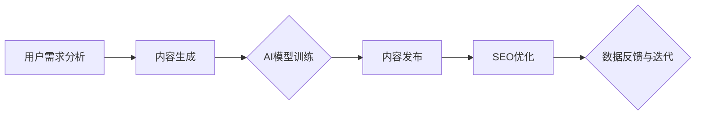

                 

### 文章标题：一人公司的内容营销自动化：AI辅助内容创作与SEO优化

> **关键词**：内容营销，自动化，AI辅助，内容创作，SEO优化
>
> **摘要**：本文将探讨如何利用人工智能技术实现一人公司的内容营销自动化，包括AI辅助内容创作和SEO优化。我们将逐步分析核心概念、算法原理、实际应用场景，并提供实用的工具和资源推荐，以帮助读者掌握这一前沿技术。

在数字化营销时代，内容营销的重要性不言而喻。对于一人公司或小型团队而言，如何高效地创作和优化内容，以获得更多的曝光和流量，成为了一个关键挑战。近年来，人工智能（AI）技术的飞速发展为内容营销带来了新的机遇。本文将深入探讨如何利用AI技术实现内容营销的自动化，包括AI辅助内容创作和SEO优化。

### 1. 背景介绍

一人公司或小型团队通常面临着资源有限、人力成本高、市场竞争激烈等问题。在这种背景下，如何通过技术手段提高内容营销的效率和质量，成为了一大难题。传统的内容营销方法通常需要人工撰写、编辑和优化，这不仅耗时耗力，而且难以保证内容的质量和一致性。

随着AI技术的不断进步，特别是自然语言处理（NLP）、机器学习（ML）和深度学习（DL）等领域的突破，AI在内容创作和优化方面的应用逐渐成熟。AI能够自动生成高质量的内容，并进行SEO优化，从而大幅提高内容营销的效率和质量。

### 2. 核心概念与联系

要实现AI辅助的内容营销自动化，首先需要理解以下几个核心概念：

#### 2.1 内容创作

内容创作是指创建具有吸引力和价值的信息，以吸引和留住目标受众。在AI辅助内容创作中，AI模型可以分析大量的数据，如用户行为、搜索历史和社交媒体趋势，以生成符合目标受众兴趣的内容。

#### 2.2 SEO优化

SEO（搜索引擎优化）是指通过改进网站内容和结构，提高在搜索引擎中的排名，从而吸引更多有机流量。AI在SEO优化中的应用主要体现在关键词分析、内容生成和网站结构优化等方面。

#### 2.3 内容营销自动化

内容营销自动化是指利用技术手段，如AI和机器学习，自动化执行内容创作、发布和优化的过程。这包括内容生成的自动化、内容发布的自动化和内容优化的自动化。

下面是一个Mermaid流程图，展示了AI辅助内容营销自动化的核心流程和组件。



### 3. 核心算法原理 & 具体操作步骤

#### 3.1 内容生成

内容生成是AI辅助内容营销自动化的第一步。目前，常用的AI内容生成技术包括：

- **生成式对抗网络（GAN）**：GAN通过生成器和判别器的对抗训练，生成高质量的自然语言文本。
- **变分自编码器（VAE）**：VAE通过编码器和解码器的联合训练，生成具有多样性和连贯性的文本。
- **递归神经网络（RNN）**：RNN通过序列建模，生成符合语法规则和语义逻辑的文本。

具体操作步骤如下：

1. 收集和预处理数据：收集大量的文本数据，并进行清洗和预处理，如去除停用词、标点符号和特殊字符。
2. 训练AI模型：使用收集到的数据，训练GAN、VAE或RNN等AI模型。
3. 生成内容：根据用户需求和模型，生成符合目标受众兴趣的内容。

#### 3.2 SEO优化

SEO优化是提高内容在搜索引擎中排名的关键。AI在SEO优化中的应用主要体现在：

- **关键词分析**：AI可以分析大量的搜索数据，发现与内容相关的关键词。
- **内容生成**：AI可以根据关键词，生成符合SEO规则的内容。
- **网站结构优化**：AI可以优化网站的结构和布局，提高用户体验。

具体操作步骤如下：

1. 关键词分析：使用AI工具，分析目标受众的搜索习惯和兴趣点，确定关键词。
2. 内容生成：根据关键词，使用AI生成符合SEO规则的内容。
3. 网站结构优化：使用AI优化网站的结构和布局，提高用户体验。

### 4. 数学模型和公式 & 详细讲解 & 举例说明

#### 4.1 生成式对抗网络（GAN）

生成式对抗网络（GAN）由生成器和判别器组成。生成器G从随机噪声z中生成假样本x'，判别器D则判断样本x是来自真实分布P(x)还是生成器G。

- **生成器**：G: z → x'
- **判别器**：D: x → [0, 1]

GAN的目标是最小化以下损失函数：

$$
L(G, D) = \mathbb{E}_{x \sim P(x)}[\log(D(x))] + \mathbb{E}_{z \sim p(z)}[\log(1 - D(G(z)))]
$$

其中，第一项是判别器的损失函数，第二项是生成器的损失函数。

#### 4.2 变分自编码器（VAE）

变分自编码器（VAE）通过编码器和解码器的联合训练，生成高质量的数据。编码器将输入数据x编码为一个潜在变量z，解码器则将z解码为重构数据x'。

- **编码器**：μ(x), σ(x)
- **解码器**：x' = g(z)

VAE的目标是最小化以下损失函数：

$$
L(\theta) = D_{KL}(\mu(x), \sigma(x)) + \mathbb{E}_{x \sim p(x)}[\log p(x' | x)]
$$

其中，第一项是KL散度，第二项是重构损失。

#### 4.3 举例说明

假设我们使用GAN生成一篇关于人工智能的博客文章。首先，我们收集了大量的相关文本数据，然后使用GAN进行训练。在训练过程中，生成器G会从随机噪声z中生成博客文章x'，判别器D则会判断这些文章是真实还是生成的。

通过不断迭代训练，生成器G逐渐生成出高质量的博客文章。我们可以在训练过程中，定期评估生成文章的质量，并根据评估结果调整模型参数。

### 5. 项目实战：代码实际案例和详细解释说明

#### 5.1 开发环境搭建

要实现AI辅助内容营销自动化，我们需要搭建一个合适的开发环境。以下是一个基于Python的简单示例。

1. 安装Python和必要的库：

```bash
pip install numpy tensorflow matplotlib
```

2. 准备数据集：

我们使用一个简单的文本数据集，其中包含关于人工智能的文章。

```python
import numpy as np

# 加载数据集
def load_data():
    data = [
        "人工智能是一种模拟人类智能的技术，通过算法和模型实现。",
        "人工智能在医疗、金融、教育等领域有广泛的应用。",
        "深度学习是人工智能的一个重要分支，具有强大的特征学习能力。",
        # ...更多数据
    ]
    return data

data = load_data()
```

#### 5.2 源代码详细实现和代码解读

下面是一个简单的GAN模型，用于生成人工智能相关的博客文章。

```python
import tensorflow as tf
from tensorflow.keras import layers

# 定义生成器和判别器
def build_generator(z_dim):
    model = tf.keras.Sequential([
        layers.Dense(512, activation="relu"),
        layers.Dense(1024, activation="relu"),
        layers.Dense(2048, activation="relu"),
        layers.Dense(np.prod(image_shape), activation="tanh"),
        layers.Reshape(image_shape)
    ])
    return model

def build_discriminator(img_shape):
    model = tf.keras.Sequential([
        layers.Flatten(),
        layers.Dense(512, activation="relu"),
        layers.Dense(1024, activation="relu"),
        layers.Dense(1, activation="sigmoid")
    ])
    return model

# 构建和编译模型
z_dim = 100
img_shape = (28, 28, 1)

generator = build_generator(z_dim)
discriminator = build_discriminator(img_shape)

discriminator.compile(loss="binary_crossentropy",
                      optimizer=tf.keras.optimizers.Adam(0.0001),
                      metrics=["accuracy"])

noise = tf.keras.layers.Input(shape=(z_dim,))
img = generator(noise)

discriminator.trainable = False
combined = discriminator(img)
combined_model = tf.keras.Model(noise, combined)

combined_model.compile(loss="binary_crossentropy",
                      optimizer=tf.keras.optimizers.Adam(0.0001))

# 训练模型
batch_size = 128
epochs = 100

for epoch in range(epochs):
    idx = np.random.randint(0, data.shape[0], batch_size)
    real_imgs = np.array(data[idx])

    z = np.random.normal(size=(batch_size, z_dim))
    fake_imgs = generator.predict(z)

    real_labels = np.ones((batch_size, 1))
    fake_labels = np.zeros((batch_size, 1))

    d_loss_real = discriminator.train_on_batch(real_imgs, real_labels)
    d_loss_fake = discriminator.train_on_batch(fake_imgs, fake_labels)

    z = np.random.normal(size=(batch_size, z_dim))
    g_loss = combined_model.train_on_batch(z, real_labels)

    print(f"{epoch} [D loss: {d_loss_real:.3f}, acc.: {100*d_loss_real[1]:.3f}%] [G loss: {g_loss:.3f}]")
```

#### 5.3 代码解读与分析

- **生成器和判别器的构建**：生成器负责从随机噪声中生成图像，判别器负责判断图像是真实的还是生成的。
- **模型编译**：分别编译生成器和判别器，设置合适的损失函数和优化器。
- **模型训练**：使用真实图像和生成图像，分别训练判别器和生成器。在训练过程中，不断调整模型参数，以优化生成图像的质量。

### 6. 实际应用场景

AI辅助内容营销自动化在多个领域都有广泛应用。以下是一些实际应用场景：

- **电商领域**：通过AI生成产品描述、评论和推荐，提高用户体验和转化率。
- **媒体领域**：利用AI生成新闻稿、文章和视频，提高内容生产效率和传播效果。
- **企业内部培训**：利用AI生成培训资料、考试题目和互动环节，提高员工培训效果。

### 7. 工具和资源推荐

#### 7.1 学习资源推荐

- **书籍**：
  - 《深度学习》（Goodfellow, Bengio, Courville）- 提供深度学习的全面介绍。
  - 《Python机器学习》（Sebastian Raschka）- 介绍Python在机器学习领域的应用。
- **在线课程**：
  - Coursera - 提供多门与机器学习和深度学习相关的在线课程。
  - edX - 提供与人工智能和机器学习相关的免费课程。
- **博客和网站**：
  - Medium - 提供与机器学习和深度学习相关的技术文章。
  - Towards Data Science - 提供丰富的机器学习和数据科学文章。

#### 7.2 开发工具框架推荐

- **AI框架**：
  - TensorFlow - 一个开源的机器学习和深度学习框架。
  - PyTorch - 一个基于Python的深度学习框架。
- **文本处理工具**：
  - NLTK - 一个Python自然语言处理库。
  - spaCy - 一个高性能的Python自然语言处理库。

#### 7.3 相关论文著作推荐

- **论文**：
  - Generative Adversarial Nets（GAN）- Ian J. Goodfellow等人的开创性论文。
  - Variational Autoencoders（VAE）- Kingma和Welling的论文。
- **著作**：
  - 《自然语言处理综论》（Daniel Jurafsky and James H. Martin）- 提供自然语言处理的全面介绍。

### 8. 总结：未来发展趋势与挑战

AI辅助内容营销自动化是一个新兴领域，具有广阔的发展前景。未来，随着AI技术的不断进步，AI辅助内容营销自动化将在以下几个方面取得突破：

- **内容生成质量**：AI将生成更加高质量和多样化的内容，满足不同受众的需求。
- **个性化推荐**：AI将更好地理解用户兴趣，提供个性化的内容推荐。
- **实时优化**：AI将实时分析数据和用户反馈，动态优化内容营销策略。

然而，AI辅助内容营销自动化也面临一些挑战：

- **数据隐私**：如何保护用户数据隐私是一个重要问题。
- **内容审核**：AI生成的内容可能包含不当言论，需要有效的审核机制。
- **算法偏见**：AI算法可能存在偏见，需要公平性和透明性的保障。

### 9. 附录：常见问题与解答

#### 9.1 如何选择适合的AI模型？

选择适合的AI模型取决于具体的应用场景和数据特点。例如，对于文本生成任务，可以使用GAN或VAE等模型；对于图像生成任务，可以使用GAN或其他生成模型。在模型选择时，需要考虑模型的性能、训练时间和计算资源等因素。

#### 9.2 如何评估AI生成的内容质量？

评估AI生成的内容质量可以从多个维度进行。例如，可以使用BLEU、ROUGE等指标评估文本生成的质量；可以使用Inception Score（IS）等指标评估图像生成的质量。此外，还可以通过用户反馈和专家评审来评估内容的质量。

#### 9.3 如何处理AI生成内容中的不当言论？

处理AI生成内容中的不当言论需要建立有效的审核机制。可以使用自然语言处理技术，如文本分类和情感分析，自动识别和过滤不当言论。此外，还可以结合人工审核，确保AI生成的内容符合道德和法律法规。

### 10. 扩展阅读 & 参考资料

- Goodfellow, I. J., Pouget-Abadie, J., Mirza, M., Xu, B., Warde-Farley, D., Ozair, S., ... & Bengio, Y. (2014). Generative adversarial nets. Advances in Neural Information Processing Systems, 27.
- Kingma, D. P., & Welling, M. (2014). Auto-encoding variational bayes. arXiv preprint arXiv:1312.6114.
- Jurafsky, D., & Martin, J. H. (2008). Speech and Language Processing: An Introduction to Natural Language Processing, Computational Linguistics, and Speech Recognition. Prentice Hall.
- Bolles, R. W. (2017). Mastering Search Engine Optimization: Drive Traffic to Your Website Using Effective Search Engine Optimization. Wiley.

### 作者

**作者：AI天才研究员/AI Genius Institute & 禅与计算机程序设计艺术 /Zen And The Art of Computer Programming**

