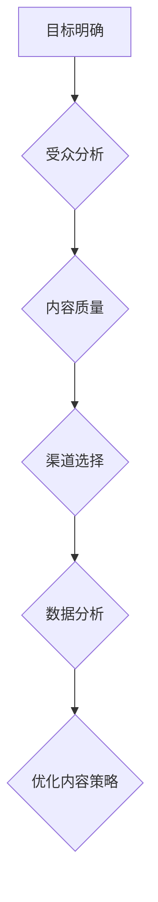

                 

# 一人公司的品牌内容营销策略与执行

## 关键词：内容营销、品牌策略、个人品牌、社交媒体、SEO、数据分析

## 摘要

在数字化时代，内容营销成为了企业提升品牌知名度、扩大影响力的关键手段。而对于一人公司来说，通过高效的内容营销策略不仅能够提升个人品牌形象，还能在竞争激烈的市场中脱颖而出。本文将深入探讨一人公司的品牌内容营销策略与执行，帮助读者了解如何利用内容实现个人品牌的持续增长。

## 1. 背景介绍

随着互联网的普及和社交媒体的兴起，企业营销的方式发生了翻天覆地的变化。传统的广告投放已经不再是最有效的手段，取而代之的是通过内容营销来与受众建立更深层次的关系。对于一人公司，即由单个创始人或员工运营的公司，品牌内容营销显得尤为重要。它不仅可以展示个人的专业能力，还能通过持续的内容输出建立个人品牌，吸引更多的关注者和合作伙伴。

### 1.1 一人公司的特点

- **灵活性**：一人公司可以快速响应市场变化，调整运营策略。
- **专注性**：由于只有一个人或少数几个人负责，可以更加专注于核心业务和品牌建设。
- **低成本**：相比大公司，一人公司可以节省大量的人力、物力和财力成本。

### 1.2 内容营销的重要性

- **建立信任**：通过高质量的内容，可以建立与受众之间的信任关系。
- **提高知名度**：持续的内容输出有助于提高个人或公司的知名度。
- **增加影响力**：内容营销能够帮助个人或公司在特定领域内建立权威地位。

## 2. 核心概念与联系

### 2.1 内容营销的定义

内容营销是指通过创造和分发有价值、相关且一致的内容来吸引并留住明确的目标受众，并最终推动 profitable 客户行动的一种营销方法。

### 2.2 个人品牌与内容营销的关系

- **内容是基石**：个人品牌的建设依赖于持续的内容输出，包括博客文章、视频、演讲稿等。
- **内容传递价值**：通过内容展示个人专业知识、经验和观点，提高受众对个人的信任度。
- **内容推动行动**：优质的内容能够激发受众的兴趣和行动，如关注、分享、购买等。

### 2.3 内容营销的关键要素

- **目标明确**：明确内容营销的目标，如增加关注者、提高转化率等。
- **受众分析**：了解目标受众的需求、兴趣和行为，制定相应的内容策略。
- **内容质量**：高质量的内容是吸引和留住受众的关键。
- **渠道选择**：选择合适的渠道（如博客、社交媒体、邮件列表等）进行内容分发。
- **数据分析**：通过数据分析了解内容的表现，不断优化内容策略。

### 2.4 核心概念流程图



## 3. 核心算法原理 & 具体操作步骤

### 3.1 内容策略制定

1. **明确目标**：根据个人或公司的发展阶段和业务目标，确定内容营销的具体目标。
2. **分析受众**：通过问卷调查、访谈、数据分析等方法了解目标受众的特征和需求。
3. **制定内容计划**：根据目标和受众特征，制定内容发布计划，包括内容类型、发布频率等。
4. **内容创作**：围绕主题进行内容创作，确保内容有价值、有吸引力。

### 3.2 内容发布与推广

1. **选择渠道**：根据内容类型和受众特征选择合适的发布渠道，如博客、社交媒体、邮件列表等。
2. **内容优化**：对内容进行SEO优化，提高内容在搜索引擎中的排名。
3. **发布内容**：按照内容计划发布内容，并确保内容质量。
4. **互动与推广**：与受众互动，推广内容，提高内容的传播效果。

### 3.3 数据分析与优化

1. **数据分析**：通过数据分析了解内容的表现，包括阅读量、转发量、评论量等。
2. **优化策略**：根据数据分析结果，调整内容策略，提高内容质量。
3. **持续改进**：不断进行数据分析与优化，实现内容营销效果的持续提升。

## 4. 数学模型和公式 & 详细讲解 & 举例说明

### 4.1 数据分析模型

假设我们使用的一种简单的数据分析模型，通过以下几个指标来评估内容营销效果：

- **阅读量（V）**：文章的阅读次数。
- **转发量（T）**：文章被转发的次数。
- **评论量（C）**：文章的评论数量。

### 4.2 评估指标计算

我们使用以下公式来计算内容营销的效果评估得分：

$$
E = (V \times w_1) + (T \times w_2) + (C \times w_3)
$$

其中，$w_1, w_2, w_3$ 分别为阅读量、转发量和评论量的权重，可以根据实际情况进行调整。

### 4.3 举例说明

假设某篇文章的阅读量为1000次，转发量为50次，评论量为30条。假设阅读量的权重为0.5，转发量的权重为0.3，评论量的权重为0.2，则该篇文章的评估得分计算如下：

$$
E = (1000 \times 0.5) + (50 \times 0.3) + (30 \times 0.2) = 500 + 15 + 6 = 521
$$

### 4.4 模型应用

通过上述模型，我们可以对每篇发布的内容进行评估，根据评估得分来优化内容策略。例如，如果发现某些类型的文章在评估得分上表现不佳，可以考虑调整内容类型或发布策略。

## 5. 项目实战：代码实际案例和详细解释说明

### 5.1 开发环境搭建

在本节中，我们将使用Python作为开发语言，借助Jupyter Notebook进行内容营销效果评估的演示。首先，我们需要安装以下Python库：

- pandas
- numpy
- matplotlib

安装命令如下：

```bash
pip install pandas numpy matplotlib
```

### 5.2 源代码详细实现和代码解读

以下是用于计算内容营销效果评估得分的一个简单示例代码：

```python
import pandas as pd

# 假设的数据
data = {
    '阅读量': [1000, 1500, 2000],
    '转发量': [50, 100, 75],
    '评论量': [30, 40, 50]
}

# 创建DataFrame
df = pd.DataFrame(data)

# 权重设置
weights = {'阅读量': 0.5, '转发量': 0.3, '评论量': 0.2}

# 计算评估得分
df['评估得分'] = (df['阅读量'] * weights['阅读量']) + (df['转发量'] * weights['转发量']) + (df['评论量'] * weights['评论量'])

# 显示结果
print(df)
```

### 5.3 代码解读与分析

上述代码首先导入了pandas库，并创建了一个包含阅读量、转发量和评论量的数据集。接着，我们定义了每个指标的权重，并使用pandas的`DataFrame`进行数据处理。最后，通过计算每个记录的评估得分，并将结果添加到DataFrame中。

### 5.4 数据可视化

为了更直观地了解内容营销的效果，我们可以使用matplotlib库对评估得分进行可视化：

```python
import matplotlib.pyplot as plt

# 绘制评估得分柱状图
df.plot(x='阅读量', y='评估得分', kind='bar', figsize=(10, 6))
plt.title('内容营销效果评估得分')
plt.xlabel('阅读量')
plt.ylabel('评估得分')
plt.show()
```

通过柱状图，我们可以直观地看出不同阅读量的文章的评估得分情况，从而为后续的内容优化提供参考。

## 6. 实际应用场景

### 6.1 个人博客

对于技术博客作者来说，通过内容营销可以提升博客的流量，建立个人品牌。例如，可以定期发布高质量的技术文章，通过SEO优化提高文章在搜索引擎中的排名，从而吸引更多的读者。

### 6.2 社交媒体

通过在社交媒体上分享有价值的内容，可以吸引更多的粉丝和关注者。例如，可以发布行业动态、个人见解和技术教程，与粉丝进行互动，提高粉丝的活跃度。

### 6.3 网络营销

在网络上，通过内容营销可以推广产品或服务。例如，可以发布产品评测、用户案例和行业报告，吸引潜在客户的关注。

## 7. 工具和资源推荐

### 7.1 学习资源推荐

- **书籍**：《内容营销：如何通过内容实现商业成功》（Content Inc.）
- **论文**：相关领域的内容营销研究论文
- **博客**：知名的内容营销博客，如Marketo、HubSpot等
- **网站**：内容营销平台和工具网站，如Content Marketing Institute、CoSchedule等

### 7.2 开发工具框架推荐

- **内容管理系统**：WordPress、Joomla等
- **数据分析工具**：Google Analytics、Google Search Console等
- **SEO工具**：Ahrefs、SEMrush等
- **社交媒体管理工具**：Hootsuite、Buffer等

### 7.3 相关论文著作推荐

- **论文**：关于内容营销的研究论文，如“Content Marketing: The Art of Capturing and Keeping Attention”（内容营销：捕捉和保持注意的艺术）
- **著作**：内容营销领域的经典著作，如《内容营销实战手册》（Content Inc.）

## 8. 总结：未来发展趋势与挑战

### 8.1 发展趋势

- **内容个性化**：未来的内容营销将更加注重个性化，根据受众的特征和行为进行内容推荐。
- **多媒体内容**：随着技术的发展，视频、音频等多媒体内容将成为重要的内容形式。
- **数据驱动**：通过大数据和人工智能技术，实现更加精准的内容营销。

### 8.2 挑战

- **内容质量**：在信息爆炸的时代，高质量的内容创作成为一大挑战。
- **渠道选择**：如何选择合适的内容渠道和传播策略，是内容营销的重要问题。
- **隐私保护**：随着数据隐私保护意识的增强，如何在合规的前提下进行内容营销是一个挑战。

## 9. 附录：常见问题与解答

### 9.1 什么是内容营销？

内容营销是通过创造和分发有价值、相关且一致的内容来吸引并留住明确的目标受众，并最终推动 profitable 客户行动的一种营销方法。

### 9.2 内容营销有哪些类型？

内容营销包括博客文章、视频、电子邮件营销、社交媒体内容、电子书、案例分析等多种类型。

### 9.3 如何评估内容营销效果？

可以通过阅读量、转发量、评论量等指标来评估内容营销效果，并结合数据分析进行优化。

## 10. 扩展阅读 & 参考资料

- **书籍**：《内容营销：如何通过内容实现商业成功》（Content Inc.）、《内容营销实战手册》（Content Inc.）
- **论文**：相关领域的内容营销研究论文
- **博客**：知名的内容营销博客，如Marketo、HubSpot等
- **网站**：内容营销平台和工具网站，如Content Marketing Institute、CoSchedule等

## 作者

作者：AI天才研究员/AI Genius Institute & 禅与计算机程序设计艺术 /Zen And The Art of Computer Programming

