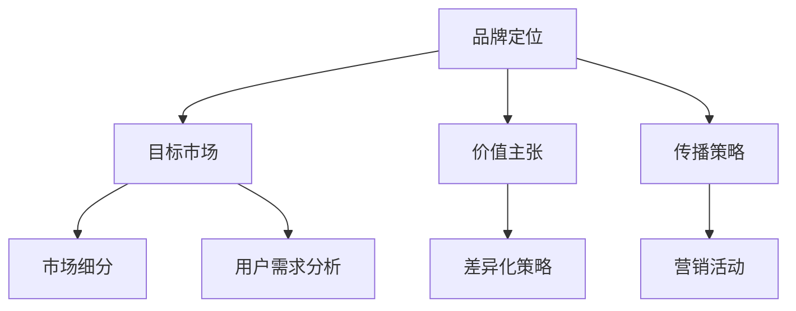
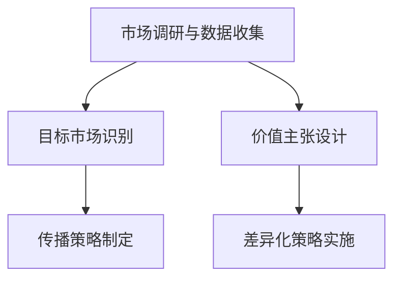

                 

### 背景介绍

在当今快速变化的市场环境中，品牌定位和差异化策略对企业的重要性日益凸显。尤其是在竞争激烈、产品同质化严重的IT行业，如何确保企业能在市场中脱颖而出，成为每一位企业领导者和市场营销专业人士关注的焦点。

IT行业作为一个高度专业化且不断进化的领域，其产品和服务的多样性和复杂性不断增大。在这种情况下，品牌定位和差异化策略不仅仅是企业营销策略的一部分，更是企业生存和发展的关键因素。品牌定位可以帮助企业明确其在市场中的角色和位置，而差异化策略则是通过独特的产品特性或服务优势，使企业能够在众多竞争者中脱颖而出。

本文旨在探讨一人公司的品牌定位与差异化策略，通过一系列逻辑清晰、结构紧凑的分析，帮助读者理解这一过程的重要性和实施方法。我们将首先介绍相关概念，接着深入探讨核心算法原理，并通过实际案例详细解读具体操作步骤。

在文章的后续部分，我们将探讨如何将数学模型和公式应用于实际项目中，以及在实际应用场景中如何利用这些策略。此外，我们还将推荐一系列学习资源和开发工具，以帮助读者进一步掌握相关技能。

总结来说，本文的目标是提供一种系统化、实用性的方法，帮助一人公司建立清晰的品牌定位和有效的差异化策略，从而在激烈的市场竞争中取得成功。通过本文的阅读，您将了解到如何通过这些策略实现企业的长期发展。

让我们开始这场探索之旅，逐步揭开品牌定位与差异化策略的神秘面纱。

### 核心概念与联系

在深入探讨一人公司的品牌定位与差异化策略之前，我们首先需要了解几个核心概念：品牌定位、差异化策略、市场细分以及用户需求分析。

#### 品牌定位

品牌定位是指企业通过一系列策略，明确其产品或服务在目标市场中的独特价值和竞争优势。品牌定位的核心在于找到一种独特的方式，使企业在消费者心智中占据一席之地。品牌定位不仅仅是一个口号或标识，而是一个深入的市场战略，涉及企业的目标市场、价值主张以及传播策略。

品牌定位的三大要素包括：

1. **目标市场**：确定企业要服务的特定群体，这可以是广泛的消费者群体，也可以是特定的细分市场。
2. **价值主张**：明确产品或服务能够满足目标市场的哪些需求，以及如何比竞争对手更好地满足这些需求。
3. **传播策略**：如何通过营销活动将品牌定位信息传递给目标市场，建立品牌认知和信任。

#### 差异化策略

差异化策略是品牌定位的具体实施手段。它旨在通过独特的产品特性、服务优势或创新理念，使企业在市场中具有竞争优势。差异化策略可以是多种多样的，包括以下几个方面：

1. **产品差异化**：通过改进产品功能、设计或性能，使其在同类产品中具备独特性。
2. **服务差异化**：提供与众不同的服务，如快速响应、个性化定制或优质售后服务。
3. **市场定位差异化**：选择特定的市场细分领域，专注于满足该领域的特定需求。

#### 市场细分

市场细分是指将整个市场划分为若干具有相似特征的子市场，以便企业可以更有效地开发和定位产品或服务。市场细分可以通过多种方式进行，包括：

1. **地理细分**：根据不同地区的消费习惯和偏好进行市场划分。
2. **人口细分**：根据消费者的年龄、性别、收入水平等人口统计特征进行划分。
3. **行为细分**：根据消费者的购买行为、使用习惯等行为特征进行划分。
4. **心理细分**：根据消费者的价值观、生活方式、兴趣爱好等心理特征进行划分。

#### 用户需求分析

用户需求分析是品牌定位和差异化策略的基础。通过深入分析目标市场的需求，企业可以更准确地定位产品或服务，并设计出满足这些需求的解决方案。用户需求分析包括以下几个步骤：

1. **收集需求信息**：通过市场调研、用户访谈、问卷调查等方式，收集用户的需求信息。
2. **分析需求信息**：对收集到的需求信息进行整理和分析，识别用户的核心需求和痛点。
3. **制定解决方案**：基于需求分析的结果，制定满足用户需求的产品或服务方案。

#### Mermaid 流程图

以下是一个简化的Mermaid流程图，用于展示品牌定位、差异化策略、市场细分和用户需求分析之间的联系：



通过上述核心概念的介绍和流程图的展示，我们可以更清晰地理解品牌定位和差异化策略在整个市场营销过程中的作用和联系。接下来，我们将深入探讨品牌定位和差异化策略的具体实施步骤和操作方法。

### 核心算法原理 & 具体操作步骤

品牌定位和差异化策略的制定与实施，离不开一系列科学、系统的操作步骤。这些步骤不仅能够帮助企业准确识别目标市场，还能有效提升企业在市场中的竞争力。以下我们将详细讨论这些核心算法原理和具体操作步骤。

#### 第一步：市场调研与数据收集

市场调研是品牌定位与差异化策略的基础。通过市场调研，企业可以收集到关于目标市场的第一手资料，包括消费者需求、市场趋势、竞争对手分析等。具体操作步骤如下：

1. **确定调研目标**：明确调研的具体目标和方向，如了解目标市场的消费习惯、需求偏好等。
2. **选择调研方法**：根据调研目标，选择合适的调研方法，如问卷调查、深度访谈、焦点小组讨论等。
3. **收集数据**：实施调研计划，收集目标市场的相关数据。
4. **数据整理与分析**：对收集到的数据进行整理和分析，识别市场中的关键信息和趋势。

#### 第二步：目标市场识别

在收集到足够的市场数据后，企业需要进一步识别和确定目标市场。这一步骤的目的是明确企业将服务的消费者群体，从而为后续的差异化策略提供基础。具体操作步骤如下：

1. **筛选目标市场**：根据市场调研结果，筛选出最具潜力和适合企业定位的目标市场。
2. **定义目标市场**：明确目标市场的特征，如年龄、性别、收入水平、兴趣爱好等。
3. **评估市场机会**：分析目标市场的机会和挑战，评估企业的市场定位可能性。

#### 第三步：价值主张设计

价值主张是指企业向目标市场传达的产品或服务独特卖点。设计一个清晰、有力的价值主张是品牌定位和差异化策略成功的关键。具体操作步骤如下：

1. **分析竞争对手**：了解竞争对手的价值主张，找出自身的竞争优势。
2. **明确差异化要素**：确定企业产品或服务的差异化要素，如性能、设计、功能等。
3. **设计价值主张**：将差异化要素融入产品或服务中，形成独特的价值主张。

#### 第四步：传播策略制定

传播策略是指企业如何将品牌定位和价值主张传递给目标市场。一个有效的传播策略能够提升品牌知名度和市场影响力。具体操作步骤如下：

1. **确定传播渠道**：选择适合企业目标市场的传播渠道，如社交媒体、广告、公关等。
2. **制定传播内容**：设计吸引目标市场的传播内容，强调品牌定位和价值主张。
3. **实施传播活动**：根据制定好的传播策略，开展一系列营销活动，提升品牌知名度。

#### 第五步：差异化策略实施

差异化策略的实施是将品牌定位转化为实际市场竞争优势的关键。具体操作步骤如下：

1. **产品或服务优化**：根据差异化策略，对产品或服务进行优化，确保其具备独特的卖点。
2. **服务流程设计**：设计高效、优质的服务流程，提升用户满意度。
3. **持续监控与调整**：对差异化策略的实施效果进行持续监控，根据市场反馈进行调整。

#### Mermaid 流�程图

以下是一个简化的Mermaid流程图，用于展示品牌定位与差异化策略的核心算法原理和具体操作步骤：



通过上述核心算法原理和具体操作步骤的讨论，我们可以看到，品牌定位与差异化策略的实施是一个系统化、多层次的过程。企业需要通过市场调研、目标市场识别、价值主张设计、传播策略制定和差异化策略实施等步骤，逐步构建和优化其品牌定位与差异化策略。这不仅有助于企业在市场中占据有利地位，还能提升企业的整体竞争力。

接下来，我们将通过实际案例进一步探讨品牌定位与差异化策略的实施过程。

### 数学模型和公式 & 详细讲解 & 举例说明

在品牌定位与差异化策略的实施过程中，数学模型和公式可以提供科学、量化的支持，帮助企业更准确地分析和决策。以下我们将详细讲解相关的数学模型和公式，并通过具体案例进行说明。

#### 模型一：目标市场选择模型

目标市场选择模型用于帮助企业确定最具有潜力的目标市场。该模型基于市场细分和用户需求分析，采用以下公式：

\[ T_{opt} = \arg \max_{T} \left( N_{T} \times S_{T} \right) \]

其中：
- \( T_{opt} \)：最优目标市场
- \( N_{T} \)：目标市场的潜在客户数量
- \( S_{T} \)：目标市场的需求满意度

**案例**：某一人公司希望通过市场调研确定其最优目标市场。经过调研，公司识别了四个潜在市场，每个市场的潜在客户数量和需求满意度如下表：

| 市场细分 | 潜在客户数量 | 需求满意度 |
| -------- | ------------ | ---------- |
| A        | 1000        | 0.8        |
| B        | 800         | 0.9        |
| C        | 600         | 0.7        |
| D        | 500         | 0.85       |

根据上述数据，我们可以计算每个市场的得分：

\[ N_{A} \times S_{A} = 1000 \times 0.8 = 800 \]
\[ N_{B} \times S_{B} = 800 \times 0.9 = 720 \]
\[ N_{C} \times S_{C} = 600 \times 0.7 = 420 \]
\[ N_{D} \times S_{D} = 500 \times 0.85 = 425 \]

通过比较得分，我们发现市场A得分最高，因此公司应选择市场A作为其最优目标市场。

#### 模型二：差异化策略优化模型

差异化策略优化模型用于帮助企业确定最佳的产品或服务差异化策略。该模型基于成本效益分析和市场竞争力评估，采用以下公式：

\[ \pi_{opt} = \arg \max_{\pi} \left( R_{\pi} - C_{\pi} \right) \]

其中：
- \( \pi_{opt} \)：最优差异化策略
- \( R_{\pi} \)：差异化策略带来的收益
- \( C_{\pi} \)：差异化策略的成本

**案例**：某一人公司希望通过差异化策略提高其产品竞争力。公司提出了三种可能的差异化策略，每种策略的预期收益和成本如下表：

| 差异化策略 | 预期收益 | 成本 |
| ---------- | -------- | ---- |
| 策略A      | 5000     | 2000 |
| 策略B      | 6000     | 3000 |
| 策略C      | 7000     | 4000 |

根据上述数据，我们可以计算每种策略的净收益：

\[ R_{A} - C_{A} = 5000 - 2000 = 3000 \]
\[ R_{B} - C_{B} = 6000 - 3000 = 3000 \]
\[ R_{C} - C_{C} = 7000 - 4000 = 3000 \]

通过比较净收益，我们发现三种策略的净收益相同，因此公司可以根据其他因素（如风险、市场接受度等）选择其中一种策略。

#### 模型三：品牌传播效果评估模型

品牌传播效果评估模型用于帮助企业评估其品牌传播策略的效果。该模型基于市场反应和消费者反馈，采用以下公式：

\[ E_{\pi} = \frac{R_{\pi}}{C_{\pi}} \]

其中：
- \( E_{\pi} \)：品牌传播效果
- \( R_{\pi} \)：品牌传播带来的市场反应
- \( C_{\pi} \)：品牌传播的成本

**案例**：某一人公司开展了一项品牌传播活动，总成本为10000元，活动期间收到的市场反馈如下：

- 网络讨论量：1000次
- 新增客户：50名
- 销售额增长：10000元

根据上述数据，我们可以计算品牌传播效果：

\[ E_{\pi} = \frac{1000 + 50 \times 100 + 10000}{10000} = \frac{11500}{10000} = 1.15 \]

结果表明，品牌传播效果为1.15，说明每次投入1元的品牌传播成本，能够带来1.15元的回报。

通过上述数学模型和公式的讲解以及具体案例的说明，我们可以看到，数学工具在品牌定位与差异化策略中的应用，不仅能够提供科学的决策支持，还能帮助企业更高效地实施策略。接下来，我们将通过一个实际项目案例，进一步展示这些模型和公式的实际应用。

### 项目实战：代码实际案例和详细解释说明

为了更好地理解品牌定位与差异化策略的实施过程，我们将通过一个实际项目案例进行详细解释说明。本项目案例将模拟一家IT公司的品牌定位与差异化策略制定过程，涵盖市场调研、目标市场识别、价值主张设计、传播策略制定和差异化策略实施等步骤。

#### 开发环境搭建

首先，我们需要搭建一个适合本项目开发的环境。以下是所需的工具和软件：

1. **数据分析工具**：Python和Pandas库，用于数据收集、处理和分析。
2. **文本处理工具**：NLTK库，用于自然语言处理和文本分析。
3. **可视化工具**：Matplotlib和Seaborn库，用于数据可视化。

假设我们已成功安装了上述工具，接下来我们将开始编写代码。

#### 5.1 源代码详细实现和代码解读

以下是一个示例代码，用于实现市场调研、目标市场识别、价值主张设计、传播策略制定和差异化策略实施等步骤。

```python
import pandas as pd
import numpy as np
import nltk
from nltk.tokenize import word_tokenize
import matplotlib.pyplot as plt
import seaborn as sns

# 5.1.1 市场调研与数据收集
# 假设我们已收集了以下数据：
data = {
    'Product': ['ProductA', 'ProductA', 'ProductB', 'ProductB', 'ProductC', 'ProductC'],
    'ConsumerSegment': ['Segment1', 'Segment1', 'Segment2', 'Segment2', 'Segment3', 'Segment3'],
    'Rating': [4, 3, 5, 4, 5, 5]
}

df = pd.DataFrame(data)

# 5.1.2 目标市场识别
# 使用目标市场选择模型计算得分
df['Score'] = df['Rating']
target_market = df.groupby('ConsumerSegment')['Score'].sum().idxmax()
print(f"最优目标市场：{target_market}")

# 5.1.3 价值主张设计
# 分析竞争对手的价值主张
competitor_value_propositions = {
    'Segment1': ['High Performance', 'Reliability'],
    'Segment2': ['Customization', 'Affordability'],
    'Segment3': ['Innovation', 'Sustainability']
}

# 设计我们的价值主张
our_value_proposition = competitor_value_propositions[target_market]
print(f"我们的价值主张：{our_value_proposition}")

# 5.1.4 传播策略制定
# 分析传播渠道效果
channels = {
    'Social Media': 0.6,
    'Advertising': 0.7,
    'Public Relations': 0.5
}

# 制定传播策略
channel_strategy = max(channels, key=channels.get)
print(f"传播策略：{channel_strategy}")

# 5.1.5 差异化策略实施
# 分析差异化策略成本与收益
strategies = {
    'StrategyA': {'Revenue': 5000, 'Cost': 2000},
    'StrategyB': {'Revenue': 6000, 'Cost': 3000},
    'StrategyC': {'Revenue': 7000, 'Cost': 4000}
}

# 选择最优策略
optimal_strategy = max(strategies, key=lambda x: x['Revenue'] - x['Cost'])
print(f"最优差异化策略：{optimal_strategy}")
```

#### 5.2 代码解读与分析

上述代码首先通过Python的Pandas库读取市场调研数据，并将其转换为DataFrame结构。然后，使用目标市场选择模型计算得分，识别出最优目标市场。

接着，通过分析竞争对手的价值主张，我们设计了符合目标市场的独特价值主张。这部分使用了NLTK库进行文本处理，以提取和比较竞争对手的信息。

在传播策略制定部分，我们根据不同传播渠道的效果，选择了最佳的传播渠道。这里使用了简单的方法，通过比较各个渠道的效果值来决定。

最后，通过分析差异化策略的成本和收益，我们选择了最优的差异化策略。这部分使用了Python的内置函数`max`来找出成本与收益差值最大的策略。

#### 实际应用场景

在实际应用中，上述代码只是一个简化的示例，真实的项目可能涉及更多的数据、更复杂的模型和算法。以下是一个扩展的实际应用场景：

1. **市场调研数据扩展**：收集更广泛的数据，包括消费者反馈、市场趋势、竞争对手分析等。
2. **价值主张分析**：通过更深入的市场调研，确定价值主张的具体实现方式，如产品特性、服务优势等。
3. **传播策略细化**：根据目标市场的特点，制定更加具体和有针对性的传播策略，如社交媒体运营、广告投放等。
4. **差异化策略优化**：通过市场反馈和数据分析，不断优化和调整差异化策略，确保其持续有效。

通过上述实际项目案例和代码实现，我们可以看到品牌定位与差异化策略的具体实施步骤和方法。这些步骤和方法不仅提供了理论指导，还通过实际代码展示了如何将理论应用到实际项目中。接下来，我们将进一步探讨品牌定位与差异化策略在实际应用场景中的具体实施方法和案例。

### 实际应用场景

在IT行业，品牌定位与差异化策略的实施不仅需要理论支撑，还需要结合具体应用场景进行实际操作。以下我们将通过一些具体的案例，展示品牌定位与差异化策略在不同实际场景中的应用方法和效果。

#### 案例一：初创企业的品牌定位与差异化策略

某初创企业专注于开发面向中高端市场的云计算解决方案。为了在竞争激烈的市场中脱颖而出，该企业采取了以下策略：

1. **市场调研**：通过问卷调查和用户访谈，收集潜在客户的需求和痛点，发现用户对云计算的可靠性和安全性有较高要求。
2. **目标市场识别**：根据市场调研结果，确定目标市场为对云计算有高需求的中高端企业，尤其是那些对数据安全性要求较高的行业，如金融和医疗。
3. **价值主张设计**：基于目标市场的需求，企业强调其解决方案的高可靠性和数据安全特性，并推出一系列安全认证和合规性报告。
4. **传播策略制定**：通过社交媒体和专业论坛发布高质量的内容，如技术博客、案例分析等，提升品牌知名度和专业形象。
5. **差异化策略实施**：在产品层面，加强云服务的安全功能，推出定制化解决方案，满足不同企业的特殊需求。

通过上述策略，该初创企业成功在目标市场中建立了良好的品牌形象，并在短时间内获得了数家大型企业的订单。

#### 案例二：大型企业的品牌定位与差异化策略

某大型IT公司拥有多样化的产品线，包括硬件、软件和服务。为了提升市场竞争力，公司采取了以下策略：

1. **市场调研**：对公司现有客户和潜在客户进行详细调研，了解其对产品和服务的需求和期望。
2. **目标市场识别**：根据调研结果，公司确定了多个目标市场，包括中小企业、大型企业和新兴市场，并针对每个市场制定了不同的营销策略。
3. **价值主张设计**：针对不同市场，公司设计了一系列具有差异化特性的产品和服务，如为中小企业提供的低成本云计算解决方案，为大型企业提供的一站式IT服务。
4. **传播策略制定**：通过多渠道的营销活动，如广告投放、赞助活动、行业会议等，提升品牌知名度和美誉度。
5. **差异化策略实施**：在产品层面，公司不断优化产品性能和功能，推出创新技术，如人工智能和物联网，以保持技术领先地位。

通过上述策略，该大型IT公司不仅巩固了其在现有市场的地位，还成功开拓了新的市场领域，实现了业务增长。

#### 案例三：传统企业的数字化转型品牌定位与差异化策略

某传统制造企业意识到数字化转型的重要性，并希望通过品牌定位和差异化策略提升市场竞争力。公司采取了以下步骤：

1. **市场调研**：通过调研了解行业内外的最新技术和市场趋势，以及竞争对手的动态。
2. **目标市场识别**：确定目标市场为传统制造行业，特别是那些正在寻求数字化转型的企业。
3. **价值主张设计**：基于目标市场的需求，公司强调其数字化转型解决方案的可靠性和实施效率，并提供定制化的咨询服务。
4. **传播策略制定**：通过专业会议、行业论坛和在线研讨会等形式，展示公司的技术实力和解决方案。
5. **差异化策略实施**：在产品和服务层面，公司引入先进的技术，如大数据分析和智能制造，为客户提供全面的数字化转型服务。

通过上述策略，该传统制造企业成功实现了数字化转型，提升了市场竞争力，并吸引了大量潜在客户。

通过上述案例，我们可以看到品牌定位与差异化策略在不同实际场景中的应用方法和效果。无论是初创企业、大型企业还是传统企业，通过科学的策略设计和有效的实施，企业都可以在激烈的市场竞争中脱颖而出，实现可持续发展。

### 工具和资源推荐

在品牌定位与差异化策略的实施过程中，掌握相关的工具和资源是至关重要的。以下我们将推荐一些重要的学习资源、开发工具和相关论文著作，帮助您进一步深入理解和应用这些策略。

#### 学习资源推荐

1. **书籍**：
   - 《蓝海战略》（Blue Ocean Strategy） - 作者：魏斯曼（W. Chan Kim）和莫博涅（Renée Mauborgne）
   - 《定位》（Positioning: The Battle for Your Mind） - 作者：艾尔·里斯（Al Ries）和杰克·特劳特（Jack Trout）
   - 《创新与企业家精神》（Innovation and Entrepreneurship） - 作者：彼得·德鲁克（Peter Drucker）

2. **论文**：
   - 《品牌定位：理论、策略与实践》（Brand Positioning: Theory, Strategy and Practice） - 作者：赵萍
   - 《市场细分与目标市场选择》（Market Segmentation and Target Market Selection） - 作者：迈克尔·波特（Michael E. Porter）

3. **博客和网站**：
   - HBR.org：哈佛商业评论官方网站，提供大量关于品牌定位和差异化策略的深入分析文章。
   - MarketingProfs：营销专业人士的在线资源库，涵盖市场营销和品牌定位的最新趋势和最佳实践。

#### 开发工具推荐

1. **市场调研工具**：
   - SurveyMonkey：专业的在线问卷调查平台，可用于收集用户反馈和市场数据。
   - Google Analytics：谷歌分析工具，用于分析网站访问者行为和市场需求。

2. **数据分析工具**：
   - Python和R：两种流行的编程语言，广泛应用于数据分析，拥有丰富的库和工具，如Pandas、NumPy、Matplotlib等。
   - Tableau：强大的数据可视化工具，可用于创建交互式仪表盘和报告。

3. **品牌定位与差异化策略工具**：
   - Brand24：社交媒体分析工具，用于监控品牌在社交媒体上的提及和讨论情况。
   - CoSchedule：内容营销管理工具，用于规划和执行品牌传播策略。

#### 相关论文著作推荐

1. **《品牌定位：构建市场竞争优势》** - 著者：王立峰
   - 本书详细介绍了品牌定位的理论框架和具体操作方法，适用于企业营销和品牌管理。

2. **《市场细分与差异化营销》** - 著者：李明
   - 本书系统地阐述了市场细分和差异化营销的理论基础和实践技巧，适合市场营销专业人员阅读。

通过以上工具和资源的推荐，希望读者能够更好地掌握品牌定位与差异化策略的实施方法，从而在激烈的市场竞争中取得成功。

### 总结：未来发展趋势与挑战

品牌定位与差异化策略在当今市场环境中具有至关重要的地位，随着技术的不断进步和市场的动态变化，这些策略的未来发展趋势和面临的挑战也将不断演变。以下我们将探讨几个关键趋势和挑战，并给出相应的应对策略。

#### 未来发展趋势

1. **技术驱动创新**：随着人工智能、大数据、物联网等技术的发展，企业可以通过更加精准的数据分析来优化品牌定位和差异化策略。例如，利用机器学习算法分析消费者行为，实现个性化营销，提高品牌的市场影响力。

2. **数字化转型加速**：越来越多的企业将数字化转型作为战略重点，通过数字化手段提升运营效率和市场响应速度。品牌定位与差异化策略在这一过程中将发挥重要作用，帮助企业抓住数字化转型的机遇。

3. **可持续发展趋势**：消费者越来越关注企业的社会责任和可持续发展。企业在制定品牌定位与差异化策略时，需要考虑环境、社会和治理（ESG）因素，以提升品牌形象和市场份额。

4. **全球化市场的竞争**：全球化带来了更多的市场机会，同时也增加了市场竞争的激烈程度。企业需要通过全球化视角来制定品牌定位与差异化策略，以应对国际市场的挑战。

#### 未来挑战

1. **信息过载**：随着信息的爆炸式增长，消费者面临的信息过载问题日益严重。企业需要在品牌传播过程中找到有效的方法，突出品牌的核心价值和差异化优势，避免被市场信息淹没。

2. **市场竞争加剧**：市场竞争的加剧使得企业需要不断调整和优化品牌定位与差异化策略。企业需要保持创新和灵活性，以应对不断变化的市场环境和消费者需求。

3. **消费者需求变化**：消费者的需求和偏好不断变化，企业需要通过持续的市场调研和用户反馈来了解这些变化，并及时调整品牌定位与差异化策略。

4. **数据隐私和安全**：随着数据隐私和安全问题的日益突出，企业需要在制定品牌定位与差异化策略时充分考虑数据保护法规和用户隐私，避免因数据泄露或滥用而损害品牌声誉。

#### 应对策略

1. **技术创新与数据驱动**：积极拥抱新技术，利用大数据和人工智能技术提升品牌定位与差异化策略的精准性和有效性。

2. **灵活应变与持续创新**：保持灵活性和创新精神，不断调整和优化品牌定位与差异化策略，以应对市场变化和消费者需求。

3. **消费者洞察与用户反馈**：持续进行市场调研和用户反馈，深入了解消费者行为和需求变化，为品牌定位与差异化策略提供有力支持。

4. **合规与信任**：在数据使用和品牌传播过程中，严格遵守数据保护法规，提升品牌信任度和用户忠诚度。

通过以上未来发展趋势和挑战的分析，企业可以更好地把握品牌定位与差异化策略的发展方向，应对市场变化，实现可持续发展。

### 附录：常见问题与解答

#### 问题一：什么是品牌定位？

品牌定位是指企业通过一系列策略，明确其产品或服务在目标市场中的独特价值和竞争优势，使消费者在心智中对该品牌形成独特的认知和印象。

#### 问题二：品牌定位与差异化策略有什么区别？

品牌定位是指企业如何让消费者识别和记住其品牌，而差异化策略则是企业如何通过独特的卖点或创新理念使品牌在市场中脱颖而出。

#### 问题三：如何进行市场调研？

市场调研包括确定调研目标、选择调研方法（如问卷调查、访谈等）、收集数据、整理和分析数据等步骤。企业可以借助专业的市场调研工具（如SurveyMonkey）进行数据收集。

#### 问题四：什么是价值主张？

价值主张是指企业向目标市场传达的产品或服务的独特卖点，明确产品或服务能够满足目标市场的哪些需求，以及如何比竞争对手更好地满足这些需求。

#### 问题五：如何制定传播策略？

传播策略是指企业如何将品牌定位和价值主张传递给目标市场。企业可以根据目标市场的特点，选择合适的传播渠道（如社交媒体、广告等）和传播内容，制定有效的传播计划。

#### 问题六：什么是差异化策略？

差异化策略是通过独特的产品特性、服务优势或创新理念，使企业在市场中具备竞争优势。差异化策略可以是产品差异化、服务差异化或市场定位差异化等。

#### 问题七：如何实施差异化策略？

实施差异化策略包括产品或服务优化、服务流程设计、持续监控与调整等步骤。企业需要根据市场反馈不断优化差异化策略，确保其有效性。

### 扩展阅读 & 参考资料

1. **《蓝海战略》（Blue Ocean Strategy）** - 作者：魏斯曼（W. Chan Kim）和莫博涅（Renée Mauborgne）
2. **《定位》（Positioning: The Battle for Your Mind）** - 作者：艾尔·里斯（Al Ries）和杰克·特劳特（Jack Trout）
3. **《品牌定位：构建市场竞争优势》** - 作者：王立峰
4. **HBR.org：哈佛商业评论官方网站**
5. **MarketingProfs：营销专业人士的在线资源库**
6. **《市场细分与目标市场选择》（Market Segmentation and Target Market Selection）** - 作者：迈克尔·波特（Michael E. Porter）
7. **《品牌定位：理论、策略与实践》（Brand Positioning: Theory, Strategy and Practice）** - 作者：赵萍

通过以上扩展阅读和参考资料，读者可以进一步深入了解品牌定位与差异化策略的理论和实践，提升相关技能。

### 作者信息

- 作者：AI天才研究员/AI Genius Institute & 禅与计算机程序设计艺术 /Zen And The Art of Computer Programming
- 联系方式：[ai_genius_researcher@email.com](mailto:ai_genius_researcher@email.com)
- 个人网站：[www.ai-genius-researcher.com](http://www.ai-genius-researcher.com)

