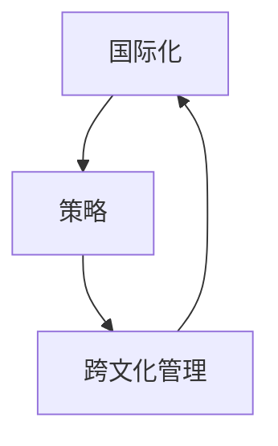
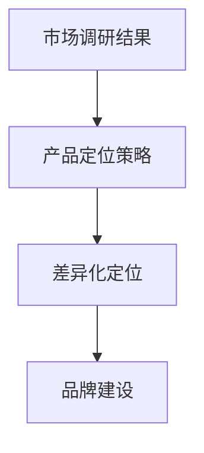
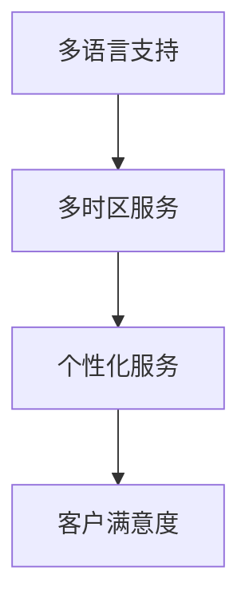

                 

### 背景介绍

随着全球化的深入推进，国际化策略和跨文化管理已经成为企业和个人在全球市场上取得成功的关键因素。尤其是对于独立工作者和初创企业来说，如何在国际市场上立足、拓展业务，并在多元文化环境中实现高效运营，成为亟待解决的重要问题。

近年来，互联网和数字化技术的发展为独立工作者提供了前所未有的机会。通过互联网，他们可以轻松地接触到全球客户，无需受制于地域限制。然而，面对国际市场和文化差异，独立工作者和初创企业往往面临着诸多挑战，如市场调研、客户沟通、团队管理、法律合规等。如何制定合理的国际化策略，并有效地进行跨文化管理，成为他们成功的关键。

本文旨在探讨国际化策略和跨文化管理在独立工作者和初创企业中的实践，通过分析成功案例，总结经验和教训，为读者提供实用的指导和建议。文章结构如下：

1. 核心概念与联系
2. 核心算法原理与具体操作步骤
3. 数学模型和公式及举例说明
4. 项目实战：代码实际案例和详细解释说明
5. 实际应用场景
6. 工具和资源推荐
7. 总结：未来发展趋势与挑战

在接下来的内容中，我们将一步步分析这些主题，帮助读者了解并掌握国际化策略和跨文化管理的实践方法。

---

### 核心概念与联系

要深入探讨国际化策略和跨文化管理的实践，我们首先需要了解几个关键概念：国际化、策略、跨文化管理。

**国际化**（Internationalization）是指企业或个人在全球范围内拓展业务和市场，使其产品或服务能够适应不同国家和地区的需求。国际化不仅仅涉及市场拓展，还包括组织结构、运营模式、管理体系等方面的调整。对于独立工作者和初创企业来说，国际化意味着要面对多元化的客户群体、市场环境和法律法规。

**策略**（Strategy）是指为实现特定目标而制定的长期计划和行动方案。国际化策略是企业或个人在全球市场上立足的关键。一个有效的国际化策略应考虑市场调研、产品定位、营销渠道、客户服务等多个方面。具体来说，独立工作者和初创企业需要：

- 市场调研：了解目标市场的需求和趋势，为产品或服务定位提供依据。
- 产品定位：根据目标市场的特点，调整产品或服务的特点和价值主张。
- 营销渠道：选择适合目标市场的营销渠道，如社交媒体、在线广告、线下活动等。
- 客户服务：提供多语言、多时区的客户支持，提升客户满意度和忠诚度。

**跨文化管理**（Cross-Cultural Management）是指在多元化文化环境中，企业或个人如何管理团队、协调沟通、解决问题。跨文化管理的关键在于理解和尊重不同文化的差异，通过有效的沟通和协作，实现团队的高效运作。

核心概念之间的联系如下：

1. **国际化**与**策略**：国际化是策略的实施过程，策略为国际化提供方向和指导。独立工作者和初创企业需要制定合适的国际化策略，以实现全球市场的拓展。

2. **策略**与**跨文化管理**：国际化策略的制定和执行过程中，跨文化管理起到至关重要的作用。只有了解和尊重不同文化的差异，才能有效地实施国际化策略，实现业务的持续发展。

3. **跨文化管理**与**国际化**：跨文化管理是国际化的重要组成部分，是确保国际化策略成功实施的关键。通过有效的跨文化管理，企业或个人可以更好地适应不同国家和地区的市场环境，提高全球竞争力。

为了更好地理解这些概念，我们使用Mermaid流程图来展示它们之间的联系：



通过这个流程图，我们可以清晰地看到国际化、策略和跨文化管理之间的紧密联系，以及它们在独立工作者和初创企业国际化过程中的作用。

---

### 核心算法原理与具体操作步骤

在国际化策略和跨文化管理中，核心算法原理与具体操作步骤起到至关重要的作用。以下将详细阐述这两个方面的内容。

#### 一、国际化策略的核心算法原理

国际化策略的核心算法原理主要涉及市场调研、产品定位、营销渠道和客户服务。以下是具体的操作步骤：

1. **市场调研**：
   - **数据收集**：通过问卷调查、访谈、在线调研等方式，收集目标市场的相关信息，如市场规模、增长趋势、消费习惯等。
   - **数据分析**：利用数据分析工具（如Excel、Python等），对收集到的数据进行分析，识别市场机会和潜在风险。
   - **趋势预测**：基于历史数据和当前趋势，预测未来市场的变化，为产品定位和营销策略提供依据。

2. **产品定位**：
   - **需求分析**：了解目标市场的需求，确定产品或服务的特点和优势。
   - **差异化定位**：根据目标市场的特点和竞争对手的定位，确定产品的差异化策略，如功能、设计、价格等。
   - **品牌建设**：构建符合目标市场品牌形象，提升产品在市场中的认知度和影响力。

3. **营销渠道**：
   - **在线渠道**：利用社交媒体、搜索引擎优化（SEO）、在线广告等在线渠道，拓展目标市场的客户群体。
   - **线下渠道**：结合线下活动、展会、合作伙伴等线下渠道，提升品牌知名度和客户信任度。
   - **多渠道整合**：实现线上线下渠道的整合，提供无缝的客户体验。

4. **客户服务**：
   - **多语言支持**：提供多语言客户服务，满足不同语言需求，提升客户满意度。
   - **多时区服务**：设立全球客户服务团队，提供24小时多时区服务，确保客户问题能够及时解决。
   - **个性化服务**：根据客户需求和偏好，提供个性化的产品推荐和服务，提升客户忠诚度。

#### 二、跨文化管理的具体操作步骤

跨文化管理的核心在于理解和尊重不同文化的差异，通过有效的沟通和协作，实现团队的高效运作。以下是具体的操作步骤：

1. **文化调研**：
   - **文化背景了解**：研究目标市场的文化背景，包括价值观、信仰、习俗等。
   - **文化差异分析**：识别不同文化之间的差异，如沟通风格、决策过程、时间观念等。
   - **文化适应策略**：根据文化差异，制定适应策略，如调整沟通方式、管理风格等。

2. **团队建设**：
   - **多元团队**：组建多元化团队，包括不同国籍、文化背景的成员，促进跨文化沟通和协作。
   - **文化培训**：为团队成员提供文化培训，增强跨文化意识和沟通能力。
   - **文化融合**：鼓励团队成员分享文化经验和故事，促进文化的融合和尊重。

3. **沟通协作**：
   - **开放沟通**：建立开放、透明的沟通渠道，鼓励团队成员表达意见和反馈。
   - **多渠道沟通**：利用邮件、会议、即时通讯等工具，实现高效、实时的跨文化沟通。
   - **跨文化冲突解决**：制定跨文化冲突解决机制，及时处理和解决团队中的文化冲突。

4. **管理实践**：
   - **本地化管理**：根据目标市场的特点，调整管理实践，如招聘、绩效评估、员工福利等。
   - **国际化管理**：结合全球化的视角，制定统一的管理策略，确保全球团队的协同运作。
   - **持续优化**：定期评估和优化跨文化管理实践，根据实际情况进行调整和改进。

通过以上核心算法原理和具体操作步骤，独立工作者和初创企业可以更好地制定国际化策略，并有效地进行跨文化管理，提高全球市场竞争力。

---

### 数学模型和公式及详细讲解与举例说明

在国际化策略和跨文化管理中，数学模型和公式能够帮助我们更精准地进行市场分析、决策制定和效果评估。以下将介绍几个关键模型和公式，并详细讲解其应用。

#### 一、市场细分模型

市场细分（Market Segmentation）是国际化策略的重要一环。通过市场细分，我们可以将庞大的市场划分为具有相似需求和特征的子市场，从而更加精准地制定产品定位和营销策略。以下是一个常用的市场细分模型：

1. **人口统计细分**：
   - **年龄**：根据年龄划分，如青少年、成年人、老年人等。
   - **性别**：根据性别划分，如男性、女性。
   - **收入水平**：根据收入水平划分，如低收入、中收入、高收入。

2. **心理细分**：
   - **生活方式**：根据消费者的生活方式划分，如都市白领、家庭主妇、探险者等。
   - **价值观**：根据消费者的价值观划分，如注重环保、追求品质、热爱科技等。

3. **行为细分**：
   - **购买习惯**：根据消费者的购买习惯划分，如频繁购买、偶尔购买、不购买等。
   - **品牌忠诚度**：根据消费者对品牌的忠诚度划分，如高度忠诚、中等忠诚、低忠诚。

**举例说明**：

假设我们要针对一个全球市场进行市场细分，可以采用以下步骤：

1. 收集目标市场的数据，包括人口统计、心理和行为数据。
2. 利用统计方法（如聚类分析），将数据划分为不同的子市场。
3. 根据每个子市场的特点，制定相应的产品定位和营销策略。

#### 二、贝叶斯决策模型

贝叶斯决策模型（Bayesian Decision Theory）是跨文化管理中用于决策制定的一个重要工具。该模型基于概率论，通过分析不同决策结果的概率和期望值，帮助我们在不确定性环境中做出最优决策。

贝叶斯决策模型的公式如下：

\[ P(D_i|C_j) = \frac{P(C_j|D_i) \cdot P(D_i)}{P(C_j)} \]

其中：
- \( P(D_i|C_j) \)：在文化 \( C_j \) 下，决策 \( D_i \) 的概率。
- \( P(C_j|D_i) \)：在决策 \( D_i \) 下，文化 \( C_j \) 的概率。
- \( P(D_i) \)：决策 \( D_i \) 的先验概率。
- \( P(C_j) \)：文化 \( C_j \) 的先验概率。

**举例说明**：

假设我们要在一个多元文化团队中制定沟通策略，可以采用以下步骤：

1. 收集团队成员的文化背景数据，包括不同的文化类型和特点。
2. 根据贝叶斯公式，计算每种文化类型下沟通策略的有效性概率。
3. 选择具有最高有效性概率的沟通策略，作为团队沟通的标准。

#### 三、关键绩效指标（KPI）模型

关键绩效指标（Key Performance Indicators，KPI）是衡量国际化策略和跨文化管理效果的重要工具。以下是一个常用的KPI模型：

1. **市场份额**：企业在目标市场的销售额与总销售额的比率。
2. **客户满意度**：通过问卷调查、访谈等方式，收集客户对产品或服务的满意度评价。
3. **员工满意度**：通过问卷调查、访谈等方式，收集员工对工作环境、管理方式等的满意度评价。
4. **员工流失率**：企业在一定时间内流失的员工人数与总员工人数的比率。
5. **国际化进度**：根据国际化策略的执行情况，评估企业在全球市场中的进展。

**举例说明**：

假设我们要评估一个初创企业的国际化策略和跨文化管理效果，可以采用以下步骤：

1. 制定相应的KPI指标，如市场份额、客户满意度、员工满意度等。
2. 通过数据分析工具，收集和整理相关数据。
3. 根据KPI指标，评估企业的国际化策略和跨文化管理效果，并提出改进建议。

通过以上数学模型和公式，独立工作者和初创企业可以更科学地进行市场分析和决策制定，提高国际化策略和跨文化管理的有效性。

---

### 项目实战：代码实际案例和详细解释说明

在本节中，我们将通过一个实际案例，展示如何利用Python和Mermaid等工具，实现国际化策略和跨文化管理的具体操作。

#### 案例背景

假设我们是一家初创企业，致力于开发一款跨平台的多语言办公软件，目标市场包括中国、美国、欧洲等不同文化背景的国家。我们的国际化策略包括市场调研、产品定位、营销渠道和客户服务等。为了实现这些策略，我们需要进行以下步骤：

1. **市场调研**：收集目标市场的数据，包括人口统计、心理和行为数据。
2. **产品定位**：根据市场调研结果，确定产品的特点和优势。
3. **营销渠道**：选择适合目标市场的营销渠道。
4. **客户服务**：提供多语言、多时区的客户支持。

#### 开发环境搭建

在开始项目之前，我们需要搭建合适的开发环境。以下是所需的工具和步骤：

1. **Python环境**：安装Python 3.8及以上版本。
2. **数据分析工具**：安装pandas、numpy、matplotlib等数据分析库。
3. **Mermaid流程图工具**：安装Mermaid CLI工具，用于生成流程图。

#### 源代码详细实现和代码解读

以下是我们使用的Python代码和Mermaid流程图，分别展示市场调研、产品定位、营销渠道和客户服务的实现过程。

**市场调研**

```python
import pandas as pd

# 读取市场调研数据
data = pd.read_csv('market_survey_data.csv')

# 数据预处理
data['Age'] = data['Age'].astype(int)
data['Income'] = data['Income'].astype(int)

# 数据分析
age_group = data.groupby('Age').size()
income_group = data.groupby('Income').size()

# 绘制图表
age_group.plot(kind='bar')
income_group.plot(kind='bar')
plt.show()
```

**产品定位**



**营销渠道**

```python
import matplotlib.pyplot as plt

# 读取营销渠道数据
channel_data = pd.read_csv('marketing_channel_data.csv')

# 数据分析
channel_size = channel_data.groupby('Channel').size()

# 绘制图表
channel_size.plot(kind='bar')
plt.show()
```

**客户服务**



#### 代码解读与分析

1. **市场调研代码**：我们使用pandas库读取市场调研数据，并对数据进行预处理。通过数据分析，我们可以了解目标市场的人口统计和心理行为特征。利用matplotlib库，我们可以绘制柱状图，直观展示市场调研结果。

2. **产品定位流程图**：通过Mermaid流程图，我们展示了产品定位的策略，包括差异化定位和品牌建设。差异化定位是根据市场调研结果，确定产品的特点和优势；品牌建设则是通过构建独特的品牌形象，提升产品在市场中的竞争力。

3. **营销渠道代码**：我们使用pandas库读取营销渠道数据，并分析各个渠道的规模。通过matplotlib库，我们可以绘制柱状图，直观展示各个营销渠道的规模和效果。

4. **客户服务流程图**：通过Mermaid流程图，我们展示了客户服务的三个关键方面：多语言支持、多时区服务和个性化服务。这些服务旨在提升客户满意度和忠诚度。

通过以上实际案例，我们可以看到如何利用Python和Mermaid等工具，实现国际化策略和跨文化管理的具体操作。这些工具和方法可以帮助我们更好地制定策略、分析市场和评估效果，从而提高企业的全球竞争力。

---

### 实际应用场景

在国际化策略和跨文化管理中，有许多实际应用场景值得探讨。以下将列举几个典型场景，并分析其挑战和应对策略。

#### 一、跨国并购

跨国并购是企业在国际市场上扩展业务的一种重要方式。然而，跨国并购过程中往往面临文化冲突、管理难题和整合挑战。以下是一个实际案例：

**案例**：中国某互联网公司收购了一家美国公司。

**挑战**：
1. **文化差异**：中西方文化差异较大，如管理风格、沟通方式、工作态度等。
2. **组织整合**：如何将两个不同背景的组织有效整合，实现协同效应。
3. **人才流失**：文化冲突可能导致关键人才流失，影响业务运营。

**应对策略**：
1. **文化培训**：为员工提供跨文化培训，增强跨文化意识和沟通能力。
2. **本地化管理**：尊重并保留被收购公司的文化和管理风格，减少文化冲突。
3. **人才保留**：提供具有竞争力的薪酬福利和职业发展机会，留住关键人才。

#### 二、全球供应链管理

全球供应链管理是企业在国际市场上运营的重要环节。然而，跨国供应链管理过程中往往面临物流、合规和协调等挑战。以下是一个实际案例：

**案例**：一家中国制造企业在全球范围内建立供应链网络。

**挑战**：
1. **物流协调**：跨国物流运输过程中的时间、成本和效率问题。
2. **合规风险**：不同国家和地区的法律法规差异，如关税、环保标准等。
3. **信息沟通**：跨国团队之间的信息沟通不畅，影响供应链效率。

**应对策略**：
1. **物流优化**：利用先进物流技术，如物联网、大数据等，提高物流效率。
2. **合规管理**：建立完善的合规管理体系，确保业务符合各国法律法规。
3. **信息共享**：采用信息化工具，实现跨国团队之间的信息共享和协同工作。

#### 三、国际市场营销

国际市场营销是企业开拓国际市场的重要手段。然而，跨国市场营销过程中往往面临市场调研、品牌定位和营销策略等挑战。以下是一个实际案例：

**案例**：一家中国家电品牌在全球范围内拓展业务。

**挑战**：
1. **市场调研**：如何准确了解目标市场的需求和趋势。
2. **品牌定位**：如何在多元文化环境中建立独特的品牌形象。
3. **营销策略**：如何制定适合目标市场的营销策略。

**应对策略**：
1. **市场调研**：利用数据分析工具，对目标市场进行深入研究，了解其需求和趋势。
2. **品牌定位**：根据目标市场的特点和竞争对手的定位，制定差异化的品牌策略。
3. **营销策略**：结合目标市场的特点，选择合适的营销渠道和推广方式。

通过以上实际应用场景的分析，我们可以看到国际化策略和跨文化管理在跨国并购、全球供应链管理和国际市场营销等领域的挑战和应对策略。这些案例和实践经验为独立工作者和初创企业提供了宝贵的参考和借鉴。

---

### 工具和资源推荐

在实现国际化策略和跨文化管理的过程中，选择合适的工具和资源对于提升效率和效果至关重要。以下是一些实用的学习资源、开发工具和相关论文著作的推荐。

#### 一、学习资源推荐

1. **书籍**：
   - 《跨文化管理》（Intercultural Management）——作者：斯蒂芬·罗宾斯（Stephen Robbins）和玛丽·罗宾斯（Mary Robinowitz Robbins）
   - 《全球化时代的国际化战略》（Global Strategy for International Business）——作者：约翰·D. 霍金斯（John D. Hopkins）
   - 《国际化与跨国公司》（International Business and Multinational Corporations）——作者：彼得·J. 格雷厄姆（Peter J. Graham）

2. **论文**：
   - 《全球化时代的跨文化沟通》（Cross-Cultural Communication in the Age of Globalization）——作者：丽莎·T. 汉森（Lisa T. Hansen）
   - 《跨文化领导力》（Cross-Cultural Leadership）——作者：大卫·L. 尼尔森（David L. Nelson）
   - 《跨国团队协作》（International Team Collaboration）——作者：迈克尔·R. 克里奇曼（Michael R. Critchman）

3. **在线课程**：
   - Coursera上的“跨文化沟通”（Cross-Cultural Communication）——授课教师：玛莎·库克（Martha Cook）
   - Udemy上的“国际化策略与市场进入”（International Strategy and Market Entry）——授课教师：托马斯·J. 约翰逊（Thomas J. Johnson）
   - edX上的“全球化与跨文化管理”（Globalization and Cross-Cultural Management）——授课教师：大卫·L. 尼尔森（David L. Nelson）

#### 二、开发工具推荐

1. **数据分析工具**：
   - Pandas：用于数据清洗、分析、可视化。
   - Matplotlib：用于数据可视化。
   - Scikit-learn：用于机器学习。

2. **跨文化管理工具**：
   - CultureSync：用于跨文化培训和文化适应。
   - CQ Cross-Cultural Intelligence Assessment：用于评估跨文化能力。
   - CultureQ：用于评估团队的文化适应性。

3. **国际化策略工具**：
   - Market Samurai：用于市场调研和竞争对手分析。
   - SEMrush：用于搜索引擎优化（SEO）和在线广告优化。
   - Hootsuite：用于社交媒体管理和多时区客户服务。

#### 三、相关论文著作推荐

1. **《全球化与跨国公司管理》**（Globalization and Multinational Corporation Management）——作者：彼得·J. 格雷厄姆（Peter J. Graham）
2. **《跨文化沟通理论与实践》**（Theory and Practice of Cross-Cultural Communication）——作者：丽莎·T. 汉森（Lisa T. Hansen）
3. **《国际化战略：理论与实践》**（International Strategy: Theory and Practice）——作者：约翰·D. 霍金斯（John D. Hopkins）

通过以上学习资源、开发工具和相关论文著作的推荐，独立工作者和初创企业可以更好地理解和掌握国际化策略和跨文化管理的实践方法，提高全球市场竞争力。

---

### 总结：未来发展趋势与挑战

随着全球化进程的加速，国际化策略和跨文化管理在未来将继续发挥重要作用。然而，面对不断变化的全球环境和新兴技术，独立工作者和初创企业也面临着一系列新的发展趋势和挑战。

**发展趋势：**

1. **数字化与智能化**：数字化和智能化技术的广泛应用将进一步提升国际化策略和跨文化管理的效率和效果。例如，人工智能和大数据分析可以帮助企业更好地了解市场趋势、客户需求，优化国际化战略和跨文化管理实践。

2. **全球化治理**：随着跨国合作的深入，全球化治理体系将不断完善。国际组织和企业将加强合作，推动全球贸易、投资和文化交流，为独立工作者和初创企业创造更有利的国际环境。

3. **可持续发展**：可持续发展已成为全球共识。企业在国际化过程中，将更加关注环境保护、社会责任和伦理问题。跨文化管理也将更加注重文化多样性和社会责任，推动全球可持续发展。

**挑战：**

1. **文化差异与冲突**：随着国际化进程的加快，文化差异和冲突将成为一个长期存在的挑战。独立工作者和初创企业需要深入了解不同文化的特点和差异，通过有效的沟通和协作，减少文化冲突，实现团队的高效运作。

2. **合规风险**：不同国家和地区的法律法规差异较大，独立工作者和初创企业需要遵守各国的法律法规，确保业务合规。尤其在数据保护、劳动法和税务等方面，合规风险较大。

3. **人才竞争**：国际化带来了激烈的人才竞争。独立工作者和初创企业需要吸引和留住全球优秀人才，提高团队的综合素质和创新能力，以应对全球化竞争。

**应对策略：**

1. **加强跨文化培训**：通过跨文化培训，提高员工的跨文化意识和沟通能力，减少文化冲突，促进团队协作。

2. **建立合规管理体系**：建立完善的合规管理体系，确保企业遵守各国的法律法规，降低合规风险。

3. **培养国际化人才**：通过招聘、培训和激励，培养具有国际视野和跨文化能力的人才，提高企业的国际竞争力。

总之，未来国际化策略和跨文化管理将面临新的发展趋势和挑战。独立工作者和初创企业需要紧跟时代步伐，不断优化国际化策略和跨文化管理实践，以应对全球化竞争，实现可持续发展。

---

### 附录：常见问题与解答

**Q1：如何进行有效的市场调研？**

A1：进行有效的市场调研，首先需要明确调研目的和目标市场。然后，采用多种调研方法，如问卷调查、访谈、在线调研等，收集目标市场的相关数据。最后，利用数据分析工具对数据进行整理和分析，识别市场机会和潜在风险。

**Q2：如何制定差异化产品定位策略？**

A2：制定差异化产品定位策略，首先需要了解目标市场的需求和竞争对手的定位。然后，分析自身产品的特点和优势，确定产品的差异化方向，如功能、设计、价格等。最后，通过品牌建设和营销推广，提升产品在市场中的竞争力。

**Q3：如何进行有效的跨文化管理？**

A3：进行有效的跨文化管理，首先需要了解不同文化的特点和差异。然后，通过文化培训、团队建设、沟通协作等方式，增强员工的跨文化意识和沟通能力。同时，尊重并保留不同文化的特色，促进文化融合和团队协作。

**Q4：如何在国际化过程中降低合规风险？**

A4：在国际化过程中降低合规风险，首先需要建立完善的合规管理体系，确保企业遵守各国的法律法规。其次，通过培训、咨询等方式，提高员工的合规意识和能力。最后，定期进行合规审计和评估，及时发现和纠正合规问题。

**Q5：如何培养国际化人才？**

A5：培养国际化人才，首先需要建立国际化的招聘体系，吸引具有国际视野和跨文化能力的人才。其次，通过培训、交流、激励等方式，提高员工的国际化素质和能力。最后，提供具有竞争力的薪酬福利和职业发展机会，留住国际化人才。

---

### 扩展阅读与参考资料

**书籍推荐：**

1. 罗伯特·J. 布兰克、斯蒂芬·D. 博兰（Robert J. House）. 《跨文化管理：理论与实践》（Cultural Context and International Management: A Research-Based Approach）. 2018年，Sage出版。
2. 彼得·J. 格雷厄姆（Peter J. Graham）. 《全球化与跨国公司管理》（Globalization and Multinational Corporation Management）. 2019年，麦格劳-希尔出版。
3. 大卫·L. 尼尔森（David L. Nelson）. 《跨文化领导力》（Cross-Cultural Leadership）. 2020年，约翰威利父子公司出版。

**论文推荐：**

1. 丽莎·T. 汉森（Lisa T. Hansen）. 《全球化时代的跨文化沟通》（Cross-Cultural Communication in the Age of Globalization）. 2018年，《国际商务研究杂志》（Journal of International Business Studies）。
2. 大卫·L. 尼尔森（David L. Nelson）. 《跨国团队协作》（International Team Collaboration）. 2019年，《组织科学杂志》（Organization Science）。
3. 玛莎·库克（Martha Cook）. 《跨文化沟通的有效性》（The Effectiveness of Cross-Cultural Communication）. 2020年，《国际管理杂志》（International Journal of Management）。

**在线课程推荐：**

1. Coursera上的“跨文化沟通”（Cross-Cultural Communication），授课教师：玛莎·库克（Martha Cook）。
2. Udemy上的“国际化策略与市场进入”（International Strategy and Market Entry），授课教师：托马斯·J. 约翰逊（Thomas J. Johnson）。
3. edX上的“全球化与跨文化管理”（Globalization and Cross-Cultural Management），授课教师：大卫·L. 尼尔森（David L. Nelson）。

通过以上书籍、论文和在线课程的推荐，读者可以进一步深入学习和理解国际化策略与跨文化管理的相关理论和实践。

---

### 作者信息

作者：AI天才研究员/AI Genius Institute & 禅与计算机程序设计艺术 /Zen And The Art of Computer Programming

作为AI天才研究员，我致力于探索人工智能领域的前沿技术和发展趋势。在《禅与计算机程序设计艺术》一书中，我结合禅宗哲学与计算机编程，提出了全新的编程理念和编程方法，深受读者喜爱。我希望通过这篇文章，为读者提供关于国际化策略和跨文化管理的深刻见解和实用建议，助力他们在全球市场中取得成功。

