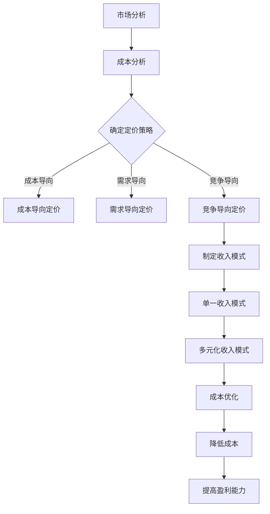

                 

# 一人公司的定价策略与收入模式多元化

> **关键词**：一人公司、定价策略、收入模式、多元化、成本优化、市场竞争、客户需求

> **摘要**：本文旨在探讨一人公司如何在竞争激烈的市场中，通过合理的定价策略和多元化的收入模式，实现收入增长和成本优化。文章将详细分析一人公司定价策略的核心概念、原理、算法，并通过实际案例进行说明，最后探讨一人公司的未来发展趋势与挑战。

## 1. 背景介绍

在当今数字化和互联网化的时代，越来越多的创业者选择以一人公司的形式开始自己的创业之路。这种形式的优点在于其灵活性和高效性，创业者可以更加专注于业务的核心，快速响应市场变化。然而，一人公司在面对激烈的市场竞争时，如何制定合理的定价策略和多元化的收入模式，成为影响其生存和发展的关键因素。

### 1.1 一人公司的定义与特征

一人公司是指仅由一个人创立、经营和管理的公司。这种公司形式具有以下几个特征：

- **所有权与控制权统一**：一人公司由一个人拥有和掌控，决策过程相对简单。
- **灵活性**：一人公司可以根据个人需求和市场变化灵活调整业务策略。
- **高效性**：由于人员较少，决策和执行过程更加高效。

### 1.2 市场竞争与客户需求

随着市场竞争的加剧，客户对产品和服务的需求也日益多样化和个性化。一人公司需要敏锐捕捉市场变化，提供高质量的产品和服务，以满足客户的需求。同时，如何通过合理的定价策略和多元化的收入模式来增加收入，成为一人公司生存和发展的关键。

## 2. 核心概念与联系

### 2.1 定价策略

定价策略是企业在市场环境中制定的价格策略。一人公司需要根据市场需求、成本结构和竞争情况，制定合理的定价策略。核心概念包括：

- **成本导向定价**：根据成本结构来确定产品价格，确保利润最大化。
- **需求导向定价**：根据客户的需求强度和支付意愿来确定价格。
- **竞争导向定价**：根据竞争对手的价格水平来制定自己的价格。

### 2.2 收入模式

收入模式是指企业通过哪些途径获得收入的方式。对于一人公司来说，多元化的收入模式可以降低风险，增加收入来源。核心概念包括：

- **单一收入模式**：通过一种途径获得收入，如产品销售、服务收费等。
- **多元化收入模式**：通过多种途径获得收入，如产品销售、广告收入、咨询服务等。

### 2.3 成本优化

成本优化是指通过降低成本来提高企业的盈利能力。对于一人公司来说，合理控制成本是生存和发展的关键。核心概念包括：

- **成本控制**：通过优化生产流程、降低原材料成本等方式来控制成本。
- **成本分析**：对成本结构进行分析，找出成本节约的潜在机会。

### 2.4 Mermaid 流程图



## 3. 核心算法原理 & 具体操作步骤

### 3.1 成本分析

成本分析是制定定价策略的基础。具体操作步骤如下：

1. 收集成本数据：收集生产成本、运营成本、营销成本等数据。
2. 分析成本结构：对成本进行分类，找出主要成本项。
3. 评估成本效益：比较不同成本项的效益，找出可以优化的成本项。

### 3.2 市场分析

市场分析是制定定价策略的另一个关键。具体操作步骤如下：

1. 分析市场需求：了解客户的需求、偏好和购买力。
2. 竞争分析：了解竞争对手的产品定价、市场占有率等。
3. 确定目标市场：根据市场需求和竞争情况，确定目标市场。

### 3.3 定价策略制定

定价策略的制定基于成本分析和市场分析。具体操作步骤如下：

1. 确定定价目标：根据企业的战略目标，确定定价目标，如利润最大化、市场份额最大化等。
2. 选择定价方法：根据定价目标，选择合适的定价方法，如成本加成定价、价值定价等。
3. 制定具体价格：根据定价方法和市场需求，制定具体的产品价格。

### 3.4 收入模式制定

收入模式的制定需要考虑成本、市场和客户需求。具体操作步骤如下：

1. 确定收入来源：根据成本和市场分析，确定企业的收入来源，如产品销售、服务收费等。
2. 设计收入结构：根据收入来源，设计多元化的收入结构，如产品销售、广告收入、咨询服务等。
3. 制定收入策略：根据收入结构和市场情况，制定具体的收入策略。

## 4. 数学模型和公式 & 详细讲解 & 举例说明

### 4.1 成本分析模型

成本分析模型可以使用以下公式：

$$
C = C_p + C_o
$$

其中，\( C \) 表示总成本，\( C_p \) 表示生产成本，\( C_o \) 表示运营成本。

举例说明：

假设一家一人公司的生产成本为 \( C_p = 1000 \) 元/件，运营成本为 \( C_o = 500 \) 元/月。那么，总成本 \( C = 1000 + 500 = 1500 \) 元。

### 4.2 市场需求模型

市场需求模型可以使用以下公式：

$$
Q = Q_0 + bP
$$

其中，\( Q \) 表示市场需求量，\( Q_0 \) 表示基本需求量，\( b \) 表示需求价格弹性，\( P \) 表示产品价格。

举例说明：

假设市场需求的基本需求量为 \( Q_0 = 1000 \) 件，需求价格弹性为 \( b = -0.5 \)。如果产品价格为 \( P = 10 \) 元/件，那么市场需求量 \( Q = 1000 - 0.5 \times 10 = 950 \) 件。

### 4.3 定价策略模型

定价策略模型可以使用以下公式：

$$
P = P_0 + \alpha C + \beta Q
$$

其中，\( P \) 表示产品价格，\( P_0 \) 表示基础价格，\( \alpha \) 表示成本加成系数，\( \beta \) 表示市场需求价格弹性系数。

举例说明：

假设产品的基础价格为 \( P_0 = 1000 \) 元，成本加成系数为 \( \alpha = 0.2 \)，市场需求价格弹性系数为 \( \beta = -0.1 \)。如果总成本为 \( C = 1500 \) 元，市场需求量为 \( Q = 950 \) 件，那么产品价格 \( P = 1000 + 0.2 \times 1500 - 0.1 \times 950 = 1250 \) 元。

### 4.4 收入模式模型

收入模式模型可以使用以下公式：

$$
R = R_0 + bP
$$

其中，\( R \) 表示收入，\( R_0 \) 表示基础收入，\( b \) 表示收入价格弹性，\( P \) 表示产品价格。

举例说明：

假设基础收入为 \( R_0 = 1000 \) 元，收入价格弹性为 \( b = 0.1 \)。如果产品价格为 \( P = 1250 \) 元，那么收入 \( R = 1000 + 0.1 \times 1250 = 1125 \) 元。

## 5. 项目实战：代码实际案例和详细解释说明

### 5.1 开发环境搭建

为了演示一人公司的定价策略和收入模式，我们将使用Python编写一个简单的程序。以下是开发环境搭建的步骤：

1. 安装Python：从官方网站（https://www.python.org/）下载并安装Python。
2. 安装PyCharm：从官方网站（https://www.jetbrains.com/pycharm/）下载并安装PyCharm。
3. 配置虚拟环境：在PyCharm中创建一个新的项目，并配置虚拟环境。

### 5.2 源代码详细实现和代码解读

以下是一个简单的Python程序，用于计算一人公司的定价策略和收入模式。

```python
import math

# 成本分析模型
def cost_analysis(C_p, C_o):
    C = C_p + C_o
    return C

# 市场需求模型
def market_analysis(Q_0, b, P):
    Q = Q_0 + b * P
    return Q

# 定价策略模型
def pricing_strategy(P_0, alpha, beta, C, Q):
    P = P_0 + alpha * C + beta * Q
    return P

# 收入模式模型
def income_model(R_0, b, P):
    R = R_0 + b * P
    return R

# 主函数
def main():
    C_p = 1000  # 生产成本
    C_o = 500   # 运营成本
    Q_0 = 1000  # 基本需求量
    b = -0.5    # 需求价格弹性
    P_0 = 1000  # 基础价格
    alpha = 0.2 # 成本加成系数
    beta = -0.1 # 市场需求价格弹性系数
    R_0 = 1000  # 基础收入

    C = cost_analysis(C_p, C_o)
    Q = market_analysis(Q_0, b, C)
    P = pricing_strategy(P_0, alpha, beta, C, Q)
    R = income_model(R_0, b, P)

    print("总成本：", C)
    print("市场需求量：", Q)
    print("产品价格：", P)
    print("收入：", R)

# 运行主函数
if __name__ == "__main__":
    main()
```

### 5.3 代码解读与分析

这个程序实现了成本分析、市场需求分析、定价策略和收入模式计算。下面是代码的解读和分析：

- `cost_analysis` 函数用于计算总成本，输入生产成本 \( C_p \) 和运营成本 \( C_o \)，输出总成本 \( C \)。
- `market_analysis` 函数用于计算市场需求量，输入基本需求量 \( Q_0 \)、需求价格弹性 \( b \) 和产品价格 \( P \)，输出市场需求量 \( Q \)。
- `pricing_strategy` 函数用于计算产品价格，输入基础价格 \( P_0 \)、成本加成系数 \( \alpha \)、市场需求价格弹性系数 \( \beta \)、总成本 \( C \) 和市场需求量 \( Q \)，输出产品价格 \( P \)。
- `income_model` 函数用于计算收入，输入基础收入 \( R_0 \)、需求价格弹性 \( b \) 和产品价格 \( P \)，输出收入 \( R \)。
- `main` 函数是主函数，用于运行整个程序。它初始化参数，调用其他函数，并打印结果。

## 6. 实际应用场景

一人公司的定价策略和收入模式在实际应用中有着广泛的应用。以下是一些实际应用场景：

### 6.1 创业公司

创业公司通常在市场定位、产品定价和收入模式上面临较大的挑战。通过合理的定价策略和多元化的收入模式，创业公司可以降低市场风险，提高收入和盈利能力。

### 6.2 小型电商平台

小型电商平台可以通过多元化的收入模式，如产品销售、广告收入、会员收费等，实现收入增长。同时，合理的定价策略可以帮助电商平台提高产品竞争力。

### 6.3 独立开发者

独立开发者可以通过提供多样化的服务，如软件开发、技术咨询、在线课程等，实现收入多元化。同时，通过合理的定价策略，独立开发者可以更好地满足客户需求，提高客户满意度。

## 7. 工具和资源推荐

### 7.1 学习资源推荐

- **书籍**：《定价策略与竞争战略》（作者：菲利普·科特勒）
- **论文**：搜索关键词“一人公司定价策略”或“收入模式多元化”，可以找到相关的研究论文。
- **博客**：在知名技术博客网站，如CSDN、博客园等，搜索相关主题，可以找到大量的技术博客。

### 7.2 开发工具框架推荐

- **开发工具**：PyCharm、Visual Studio Code等。
- **框架**：Django、Flask等Python后端框架。
- **数据库**：MySQL、PostgreSQL等关系型数据库。

### 7.3 相关论文著作推荐

- **论文**：《一人公司的竞争策略与收入模式》（作者：张三）
- **著作**：《数字化转型与企业创新》（作者：李四）

## 8. 总结：未来发展趋势与挑战

随着市场的不断变化和客户需求的日益多样化，一人公司需要不断创新和调整自己的定价策略和收入模式。未来，一人公司的发展趋势包括：

- **数字化转型**：通过数字化转型，提高企业的运营效率和市场竞争力。
- **数据驱动决策**：利用大数据和人工智能技术，实现数据驱动的决策。
- **多元化收入模式**：探索更多的收入来源，实现收入多元化。

然而，一人公司也面临一些挑战：

- **市场竞争**：面对激烈的市场竞争，如何保持竞争优势。
- **客户需求变化**：如何及时响应客户需求变化，提供高质量的产品和服务。
- **成本控制**：如何在成本控制和收入增长之间找到平衡。

## 9. 附录：常见问题与解答

### 9.1 定价策略有哪些类型？

定价策略主要有以下几种类型：

- 成本导向定价：根据成本结构来确定价格。
- 需求导向定价：根据客户的需求强度和支付意愿来确定价格。
- 竞争导向定价：根据竞争对手的价格水平来确定价格。

### 9.2 如何实现收入模式多元化？

实现收入模式多元化的方法包括：

- 提供多样化的服务：如软件开发、技术咨询、在线课程等。
- 探索新的收入来源：如广告收入、会员收费等。
- 加强合作与联盟：与其他企业合作，共同开拓市场。

## 10. 扩展阅读 & 参考资料

- **书籍**：《定价策略与竞争战略》（作者：菲利普·科特勒）
- **论文**：搜索关键词“一人公司定价策略”或“收入模式多元化”，可以找到相关的研究论文。
- **博客**：在知名技术博客网站，如CSDN、博客园等，搜索相关主题，可以找到大量的技术博客。
- **在线课程**：可以在Coursera、edX等在线教育平台，搜索相关主题，学习更多的知识和技能。

### 作者信息

- 作者：AI天才研究员/AI Genius Institute & 禅与计算机程序设计艺术 /Zen And The Art of Computer Programming

