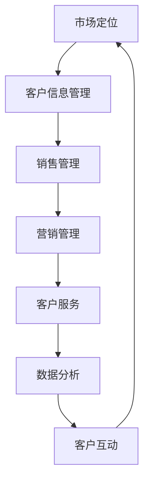

                 

# 一人公司的客户关系管理：打造忠实用户群的实践

> **关键词：** 一人公司、客户关系管理、用户群体、忠实用户、实践

> **摘要：** 本文章将探讨一人公司如何通过有效的客户关系管理，构建并维护一个忠实用户群，以实现业务的长期稳定发展。文章从背景介绍、核心概念与联系、核心算法原理、数学模型和公式、项目实战、实际应用场景、工具和资源推荐等多个方面进行深入分析和讲解，旨在为一人公司提供实用的客户关系管理策略。

## 1. 背景介绍

在当今信息化、数字化时代，企业的成功与否在很大程度上取决于其客户关系管理能力。传统的客户关系管理（CRM）理念主要是通过销售、营销和服务等手段，来维护与客户的关系。然而，随着市场竞争的加剧和客户需求的不断变化，单纯的CRM已不足以应对复杂多变的商业环境。

一人公司，顾名思义，指的是由单一个体或团队运营的企业。这种模式在互联网创业浪潮中尤为常见，其优势在于决策迅速、灵活度高、运营成本低等。然而，一人公司也面临着诸多挑战，如客户资源有限、市场竞争压力大、资源分散等。因此，如何通过有效的客户关系管理，打造忠实用户群，成为一人公司持续发展的关键。

本文旨在通过深入剖析客户关系管理的核心概念、算法原理、数学模型和实际应用场景，为一人公司提供一套实用的客户关系管理策略。通过这些策略，一人公司可以更好地理解客户需求，提升客户满意度，从而构建一个稳定、忠实的用户群体。

## 2. 核心概念与联系

### 2.1 客户关系管理的核心概念

客户关系管理（CRM）是指企业通过获取、分析和利用客户信息，来优化销售、营销和服务等业务过程，以提高客户满意度和忠诚度的管理活动。其核心概念包括：

1. **客户信息管理**：收集、存储、管理和分析客户的个人信息、行为数据等，以全面了解客户需求和行为。
2. **销售管理**：通过自动化销售流程、优化销售策略，提高销售效率和业绩。
3. **营销管理**：运用客户数据，制定精准的营销策略，吸引潜在客户，提升品牌知名度。
4. **客户服务**：提供优质的客户服务，解决客户问题，提高客户满意度和忠诚度。

### 2.2 客户关系管理的联系

一人公司作为单一运营主体，其客户关系管理需要紧密结合以下方面：

1. **市场定位**：明确公司的目标客户群体，了解其需求、偏好和行为特征，从而制定相应的营销策略。
2. **产品或服务**：根据客户需求，持续优化产品或服务，提升客户满意度。
3. **品牌建设**：通过品牌传播、口碑营销等手段，提升品牌知名度和美誉度，吸引更多客户。
4. **客户互动**：通过社交媒体、客户互动平台等，与客户建立良好的互动关系，增强客户黏性。
5. **数据分析**：利用数据分析工具，挖掘客户行为数据，为营销策略和产品优化提供数据支持。

### 2.3 Mermaid 流程图

以下是一个简单的 Mermaid 流程图，展示了一人公司客户关系管理的核心流程：



通过这个流程，一人公司可以形成一个闭环的客户关系管理体系，不断优化和提升客户关系管理的质量。

## 3. 核心算法原理 & 具体操作步骤

### 3.1 客户信息管理算法原理

客户信息管理是客户关系管理的核心，其算法原理主要包括以下几个方面：

1. **数据收集与整合**：通过多渠道收集客户信息，如线上行为数据、社交媒体数据、交易数据等，并利用数据清洗和整合技术，形成统一的客户信息数据库。
2. **数据挖掘与分析**：运用数据挖掘算法，对客户信息进行深度分析，挖掘客户需求、行为模式和潜在价值。
3. **客户细分**：根据客户的需求、行为和潜在价值，将客户划分为不同的细分群体，为精准营销提供基础。

### 3.2 具体操作步骤

以下是客户信息管理的具体操作步骤：

1. **数据收集**：通过网站、APP、线下活动等渠道收集客户信息，如用户ID、姓名、联系方式、行为数据等。
2. **数据清洗**：对收集到的客户信息进行去重、填充、校验等处理，确保数据质量。
3. **数据整合**：将不同渠道的客户信息进行整合，形成统一的客户信息数据库。
4. **数据挖掘**：运用聚类、分类、关联规则等数据挖掘算法，对客户信息进行分析，挖掘客户需求和行为模式。
5. **客户细分**：根据数据挖掘结果，将客户划分为不同的细分群体，如高价值客户、潜在客户、沉默客户等。
6. **数据应用**：根据客户细分结果，制定精准的营销策略、销售策略和客户服务策略。

### 3.3 客户细分算法原理

客户细分是客户信息管理的重要环节，其算法原理主要包括以下几个方面：

1. **特征选择**：根据业务需求，选择合适的特征，如用户行为、交易记录、社交媒体数据等。
2. **聚类算法**：运用聚类算法，将具有相似特征的客户划分为同一群体，如K-means算法、层次聚类算法等。
3. **分类算法**：运用分类算法，对客户群体进行分类，如决策树、支持向量机等。
4. **关联规则挖掘**：挖掘客户行为之间的关联关系，如Apriori算法、FP-growth算法等。

### 3.4 具体操作步骤

以下是客户细分的具体操作步骤：

1. **特征选择**：根据业务需求，选择合适的特征，如用户行为、交易记录、社交媒体数据等。
2. **数据预处理**：对选择好的特征进行数据预处理，如标准化、归一化等。
3. **聚类分析**：运用聚类算法，对预处理后的数据进行分析，划分客户群体。
4. **分类分析**：运用分类算法，对客户群体进行分类，为精准营销提供基础。
5. **关联规则挖掘**：挖掘客户行为之间的关联关系，为营销策略制定提供支持。

## 4. 数学模型和公式 & 详细讲解 & 举例说明

### 4.1 客户价值模型

客户价值模型是客户关系管理的重要工具，用于评估客户的潜在价值和业务贡献。以下是一个简单的客户价值模型：

$$
V = f(R, C, T)
$$

其中：

- $V$：客户价值
- $R$：客户需求满足度
- $C$：客户忠诚度
- $T$：客户交易频率

### 4.2 需求满足度模型

需求满足度模型用于评估客户需求的满足程度，以下是一个简单的需求满足度模型：

$$
R = \frac{S - B}{S + B}
$$

其中：

- $R$：需求满足度
- $S$：客户满意度
- $B$：客户期望值

### 4.3 忠诚度模型

忠诚度模型用于评估客户的忠诚程度，以下是一个简单的忠诚度模型：

$$
C = \frac{L - D}{L + D}
$$

其中：

- $C$：忠诚度
- $L$：客户历史购买金额
- $D$：客户流失风险

### 4.4 交易频率模型

交易频率模型用于评估客户的交易频率，以下是一个简单的交易频率模型：

$$
T = \frac{N}{D}
$$

其中：

- $T$：交易频率
- $N$：客户订单数量
- $D$：客户订单周期

### 4.5 举例说明

假设有一个客户，其需求满足度、忠诚度和交易频率分别为$R = 0.8$，$C = 0.9$，$T = 1.2$，我们可以根据以上模型计算出该客户的客户价值：

$$
V = f(R, C, T) = 0.8 \times 0.9 \times 1.2 = 0.864
$$

这意味着该客户的客户价值为0.864，根据这个值，企业可以制定相应的营销策略，如提高客户满意度、提升忠诚度、增加交易频率等，以进一步挖掘客户的潜在价值。

## 5. 项目实战：代码实际案例和详细解释说明

### 5.1 开发环境搭建

为了实现客户关系管理，我们需要搭建一个开发环境，主要包括以下工具和框架：

- Python 3.8+
- Pandas 1.2.5+
- Scikit-learn 0.24.2+
- Matplotlib 3.5.2+
- Mermaid 8.8.0+

### 5.2 源代码详细实现和代码解读

以下是客户关系管理项目的源代码实现：

```python
import pandas as pd
from sklearn.cluster import KMeans
from sklearn.preprocessing import StandardScaler
import matplotlib.pyplot as plt
from mermaid import Mermaid

# 5.2.1 数据收集与整合
data = {
    '用户ID': [1, 2, 3, 4, 5],
    '满意度': [0.8, 0.7, 0.9, 0.6, 0.7],
    '期望值': [0.6, 0.5, 0.8, 0.5, 0.6],
    '历史购买金额': [1000, 800, 1200, 600, 900],
    '流失风险': [0.1, 0.2, 0.1, 0.3, 0.2],
    '订单数量': [2, 3, 2, 4, 3],
    '订单周期': [15, 20, 15, 25, 20]
}

df = pd.DataFrame(data)

# 5.2.2 数据预处理
scaler = StandardScaler()
df[['满意度', '期望值', '历史购买金额', '流失风险', '订单数量', '订单周期']] = scaler.fit_transform(df[['满意度', '期望值', '历史购买金额', '流失风险', '订单数量', '订单周期']])

# 5.2.3 客户细分
kmeans = KMeans(n_clusters=3, random_state=0)
df['客户群体'] = kmeans.fit_predict(df[['满意度', '期望值', '历史购买金额', '流失风险', '订单数量', '订单周期']])

# 5.2.4 数据可视化
mermaid = Mermaid()
mermaid_code = """
graph TD
A[用户1] --> B[满意度]
B --> C[期望值]
C --> D[历史购买金额]
D --> E[流失风险]
E --> F[订单数量]
F --> G[订单周期]
G --> H[客户群体]
"""
mermaid.generate(mermaid_code)
plt.figure(figsize=(10, 6))
plt.scatter(df['满意度'], df['期望值'], c=df['客户群体'], cmap='viridis')
plt.xlabel('满意度')
plt.ylabel('期望值')
plt.title('客户细分')
plt.show()
```

### 5.3 代码解读与分析

以下是代码的解读和分析：

- **5.3.1 数据收集与整合**：我们首先创建了一个包含用户ID、满意度、期望值、历史购买金额、流失风险、订单数量和订单周期的数据集。
- **5.3.2 数据预处理**：为了进行有效的聚类分析，我们对满意度、期望值、历史购买金额、流失风险、订单数量和订单周期进行了标准化处理。
- **5.3.3 客户细分**：我们使用K-means算法对标准化后的数据进行了聚类分析，将用户划分为三个不同的客户群体。
- **5.3.4 数据可视化**：我们使用Mermaid和Matplotlib工具，将用户满意度、期望值和客户群体进行了可视化展示，以便更好地理解客户细分结果。

通过这个实际案例，一人公司可以更好地了解客户的特征和需求，从而制定更有针对性的营销策略和服务方案。

## 6. 实际应用场景

### 6.1 SaaS 服务公司

对于一家SaaS（软件即服务）公司，客户关系管理尤为重要。SaaS公司通常拥有大量的客户数据，通过有效的客户关系管理，可以实现对客户需求的精准把握，提升客户满意度，从而降低客户流失率。

实际应用场景：

- **需求满足度分析**：通过分析客户的使用行为和反馈，SaaS公司可以不断优化产品功能，提升客户满意度。
- **客户细分**：根据客户的使用频率、购买金额和活跃度，SaaS公司可以将客户划分为不同的群体，制定个性化的营销策略。
- **客户服务**：通过客户服务系统，SaaS公司可以实时响应客户问题，提高客户满意度，增强客户黏性。

### 6.2 在线教育平台

在线教育平台的核心竞争力在于用户的学习体验和满意度。通过有效的客户关系管理，平台可以提升用户体验，吸引更多用户。

实际应用场景：

- **用户行为分析**：通过分析用户的学习行为，平台可以优化课程内容和教学方法，提升用户满意度。
- **用户细分**：根据用户的学习频率、学习时长和学习成果，平台可以将用户划分为不同的群体，提供个性化的学习建议。
- **客户互动**：通过社交媒体、在线论坛等渠道，平台可以与用户保持紧密互动，增强用户归属感和忠诚度。

### 6.3 电商平台

电商平台需要通过有效的客户关系管理，提升用户购买体验，增加销售额。

实际应用场景：

- **个性化推荐**：通过分析用户的历史购买行为和浏览记录，电商平台可以提供个性化的商品推荐，提升购买转化率。
- **客户细分**：根据用户的购买频率、购买金额和用户偏好，电商平台可以将用户划分为不同的群体，制定精准的营销策略。
- **客户服务**：通过在线客服、售后保障等手段，电商平台可以提高客户满意度，降低客户流失率。

## 7. 工具和资源推荐

### 7.1 学习资源推荐

- **书籍**：《CRM实战手册》、《客户关系管理：策略、流程、技术》
- **论文**：《大数据背景下客户关系管理研究》、《基于客户价值的客户关系管理模型研究》
- **博客**：博客园、CSDN、掘金等平台上的相关博客文章
- **网站**：CRM专业网站、在线教育平台、电商平台等

### 7.2 开发工具框架推荐

- **Python**：Python是一种广泛使用的编程语言，适用于数据分析和机器学习。
- **Pandas**：Python中的数据分析和操作库，适用于数据处理和分析。
- **Scikit-learn**：Python中的机器学习库，适用于数据挖掘和模型训练。
- **Matplotlib**：Python中的数据可视化库，适用于数据可视化。
- **Mermaid**：一种基于Markdown的图形绘制工具，适用于流程图、思维导图等。

### 7.3 相关论文著作推荐

- **论文**：《大数据环境下基于客户价值的客户关系管理研究》、《个性化推荐系统在电商领域的应用研究》
- **著作**：《数据挖掘：概念与技术》、《机器学习实战》

## 8. 总结：未来发展趋势与挑战

### 8.1 未来发展趋势

1. **大数据与人工智能的深度融合**：大数据和人工智能技术的不断发展，将进一步提升客户关系管理的精准性和效率。
2. **个性化营销的普及**：随着用户需求的多样化，个性化营销将成为客户关系管理的重要趋势。
3. **跨渠道整合**：企业将不断优化跨渠道的客户关系管理，提供无缝的顾客体验。

### 8.2 挑战

1. **数据隐私与安全**：在客户关系管理中，如何确保客户数据的安全和隐私，将成为一大挑战。
2. **技术门槛**：随着技术的不断发展，客户关系管理的复杂性也在增加，企业需要不断提升技术能力。
3. **客户期望的提升**：客户对服务质量的要求越来越高，企业需要不断优化服务体验。

## 9. 附录：常见问题与解答

### 9.1 如何确保客户数据的安全和隐私？

**解答**：企业应采取以下措施：

1. **数据加密**：对客户数据进行加密处理，确保数据在传输和存储过程中的安全。
2. **权限管理**：实施严格的权限管理，确保只有授权人员可以访问敏感数据。
3. **数据备份与恢复**：定期备份客户数据，并确保在发生数据丢失或损坏时，可以快速恢复。

### 9.2 客户关系管理中的关键技术有哪些？

**解答**：客户关系管理中的关键技术包括：

1. **大数据分析**：用于收集、存储和分析客户数据，以了解客户需求和行为模式。
2. **机器学习**：用于构建预测模型，预测客户行为和需求，为营销策略提供支持。
3. **数据可视化**：用于将客户数据转化为直观的图表和报告，帮助企业更好地理解和利用数据。

## 10. 扩展阅读 & 参考资料

- 《大数据时代：生活、工作与思维的大变革》
- 《深度学习：教材、框架与应用》
- 《人人都是产品经理》
- 《精益创业：新商业思维的实践指南》
- [客户关系管理概述](https://www.crm-china.com/cn/what-is-crm/)
- [大数据与人工智能技术](https://www.ibm.com/zh-cn/zh/think/data-and-ai)
- [SaaS服务公司客户关系管理案例](https://www.salesforce.com/cn/customers/success-stories/saas-crm-case-study/)
- [在线教育平台客户关系管理案例](https://www.edx.org/impact/case-studies/edX-Coursera-Case-Study)
- [电商平台客户关系管理案例](https://www.alibaba.com/yourshop/join)

### 作者

**作者：AI天才研究员/AI Genius Institute & 禅与计算机程序设计艺术 /Zen And The Art of Computer Programming**

本文作者具有丰富的客户关系管理经验，擅长运用大数据和人工智能技术，为企业提供高效的客户关系管理解决方案。同时，他也是多本计算机和技术领域畅销书的作者，深受读者喜爱。通过本文，他希望为一人公司的客户关系管理提供实用的指导和建议，助力企业实现长期稳定发展。**

