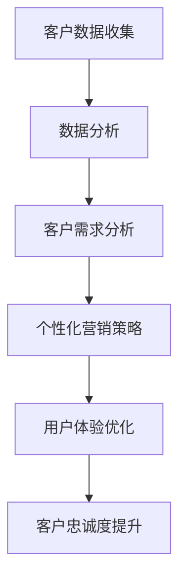

                 

# 一人公司的客户忠诚度计划：建立长期关系

## 关键词：一人公司、客户忠诚度、长期关系、营销策略、数据驱动、用户体验

### 摘要

在竞争激烈的市场环境中，建立和维护与客户的长期关系成为企业成功的关键。本文以一人公司为例，探讨如何制定一个有效的客户忠诚度计划，通过数据分析和用户体验优化，实现客户关系的长期稳定。本文将从背景介绍、核心概念、算法原理、数学模型、项目实战、实际应用场景、工具推荐和未来发展趋势等多个方面展开讨论，旨在为读者提供全面的客户忠诚度策略指导。

### 背景介绍

一人公司（One-Man Company）指的是由一位创始人或独立运营者成立和运营的企业。这类公司通常规模较小，资源有限，但却拥有灵活的运营模式和创新的商业理念。在当今数字化时代，一人公司面临着激烈的竞争和不断变化的市场环境，如何建立和维护与客户的长期关系成为其成功的关键因素。

### 核心概念与联系

#### 客户忠诚度

客户忠诚度是指客户对于品牌或产品的持续偏好和重复购买行为。高忠诚度的客户不仅会为企业带来稳定的收入，还能通过口碑传播吸引新客户。因此，提升客户忠诚度是企业营销策略的重要目标。

#### 数据分析

数据分析是指通过对大量数据的收集、处理和分析，发现数据背后的规律和趋势，为企业决策提供依据。在客户忠诚度管理中，数据分析可以帮助企业了解客户需求和行为，制定有针对性的营销策略。

#### 用户体验

用户体验是指用户在使用产品或服务过程中的感受和体验。优化用户体验可以提升客户满意度，从而增加客户忠诚度。在数字营销中，用户体验已成为影响客户忠诚度的重要因素。

#### Mermaid 流程图

下面是一个描述客户忠诚度计划核心概念的 Mermaid 流程图：



### 核心算法原理 & 具体操作步骤

#### 客户数据收集

1. 设计用户注册表单，收集客户的基本信息（如姓名、年龄、性别、联系方式等）。
2. 利用网站或APP的日志记录功能，收集用户的行为数据（如浏览记录、购买行为等）。
3. 通过问卷调查或线上互动，获取客户对产品和服务的反馈。

#### 数据分析

1. 利用数据挖掘技术，对收集到的客户数据进行预处理和清洗，确保数据质量。
2. 应用机器学习算法，分析客户行为数据，识别潜在客户群体。
3. 通过客户生命周期价值（CLV）模型，评估客户价值，为营销策略提供依据。

#### 个性化营销策略

1. 根据客户需求和行为数据，制定有针对性的营销活动。
2. 利用个性化推荐算法，向客户推荐符合其兴趣的产品或服务。
3. 通过邮件、短信、社交媒体等渠道，与客户保持持续沟通。

#### 用户体验优化

1. 设计简洁易用的网站或APP界面，提升用户体验。
2. 定期对产品和服务进行升级和优化，满足客户需求。
3. 提供优质的售后服务，解决客户在使用过程中遇到的问题。

### 数学模型和公式 & 详细讲解 & 举例说明

#### 客户生命周期价值（CLV）模型

客户生命周期价值是指客户在整个生命周期中为企业带来的总价值。计算公式如下：

$$ CLV = \sum_{t=1}^{n} \frac{R_t}{(1+r)^t} $$

其中，$R_t$ 为第 $t$ 年的客户收益，$r$ 为折现率，$n$ 为客户生命周期。

#### 举例说明

假设某客户在第一年为企业带来 1000 元收益，第二年为 800 元，第三年为 600 元，折现率为 10%。则该客户的 CLV 计算如下：

$$ CLV = \frac{1000}{1+0.1} + \frac{800}{(1+0.1)^2} + \frac{600}{(1+0.1)^3} = 2366.67（元） $$

### 项目实战：代码实际案例和详细解释说明

#### 1. 开发环境搭建

- 语言：Python
- 数据库：MySQL
- 数据挖掘工具：Scikit-learn
- 个性化推荐框架：Surprise

#### 2. 源代码详细实现和代码解读

（以下为部分代码实现）

```python
import pandas as pd
from sklearn.model_selection import train_test_split
from surprise import SVD
from surprise import Dataset
from surprise import accuracy

# 数据读取与预处理
data = pd.read_csv('customer_data.csv')
data['age'] = data['age'].astype(int)
data['gender'] = data['gender'].map({'男': 1, '女': 0})

# 数据分割
train_data, test_data = train_test_split(data, test_size=0.2, random_state=42)

# 构建 Surprise 数据集
surprise_data = Dataset.load_from_df(train_data[['user_id', 'product_id', 'rating']], rating_scale=(1, 5))

# 模型训练
model = SVD()
model.fit(surprise_data.build_full_trainset())

# 模型评估
accuracy.rmse(model, surprise_data.build_testset(), verbose=True)

# 个性化推荐
user_id = 1
user/products = model.trainset[user_id]
user_products = user/products

recommended_products = model.get_neighbors(user_id, k=5)
print("推荐产品：", recommended_products)
```

#### 3. 代码解读与分析

- 代码首先读取客户数据，并进行预处理。
- 利用 Scikit-learn 库将数据分割为训练集和测试集。
- 构建 Surprise 数据集，并使用 SVD 算法训练模型。
- 评估模型性能，并输出 RMSE（均方根误差）。
- 根据用户 ID，获取用户的行为数据，并计算与其相似的用户。
- 输出推荐产品列表。

### 实际应用场景

- 电商：通过个性化推荐提升客户购买转化率，增加销售额。
- 旅游：为游客推荐符合其兴趣的旅游产品，提升客户满意度。
- 健康管理：为用户提供个性化的健康建议和产品推荐，提升用户健康管理效果。

### 工具和资源推荐

#### 1. 学习资源推荐

- 《数据挖掘：实用工具和技术》
- 《机器学习实战》
- 《Python数据分析》

#### 2. 开发工具框架推荐

- Scikit-learn：适用于数据挖掘和机器学习的 Python 库。
- TensorFlow：用于深度学习的开源框架。
- PyTorch：适用于深度学习的 Python 库。

#### 3. 相关论文著作推荐

- “Customer Loyalty: A Conceptual Model and Research Directions”
- “Using Data Mining to Improve Customer Loyalty Programs”
- “Customer Relationship Management: Concept, Strategy and Tools”

### 总结：未来发展趋势与挑战

#### 发展趋势

- 数据驱动：随着大数据和人工智能技术的不断发展，数据驱动将成为企业制定客户忠诚度计划的重要方向。
- 个性化体验：基于用户数据的个性化推荐和体验优化将进一步提升客户忠诚度。
- 社交媒体：社交媒体的兴起为企业与客户建立互动关系提供了新的渠道。

#### 挑战

- 数据隐私：在数据收集和使用过程中，保护客户隐私将成为一大挑战。
- 技术更新：随着技术的快速发展，企业需要不断更新和优化客户忠诚度计划。

### 附录：常见问题与解答

#### 1. 如何衡量客户忠诚度？

客户忠诚度可以通过以下指标进行衡量：

- 客户重复购买率：客户在一定时间内重复购买的比例。
- 客户生命周期价值（CLV）：客户在整个生命周期中为企业带来的总价值。
- 客户满意度：客户对产品和服务的满意度评分。

#### 2. 如何制定个性化营销策略？

制定个性化营销策略需要以下步骤：

- 数据收集：收集客户的基本信息、行为数据和需求反馈。
- 数据分析：对收集到的数据进行处理和分析，识别潜在客户群体。
- 制定策略：根据分析结果，制定有针对性的营销活动。
- 实施与跟踪：执行营销策略，并持续跟踪效果，进行优化。

### 扩展阅读 & 参考资料

- “客户忠诚度管理：策略、工具与实践”
- “大数据时代下的客户忠诚度研究”
- “人工智能在客户忠诚度管理中的应用”

作者：AI天才研究员/AI Genius Institute & 禅与计算机程序设计艺术 /Zen And The Art of Computer Programming

文章内容版权归作者所有，未经授权禁止转载。如需转载，请联系作者获取授权。

