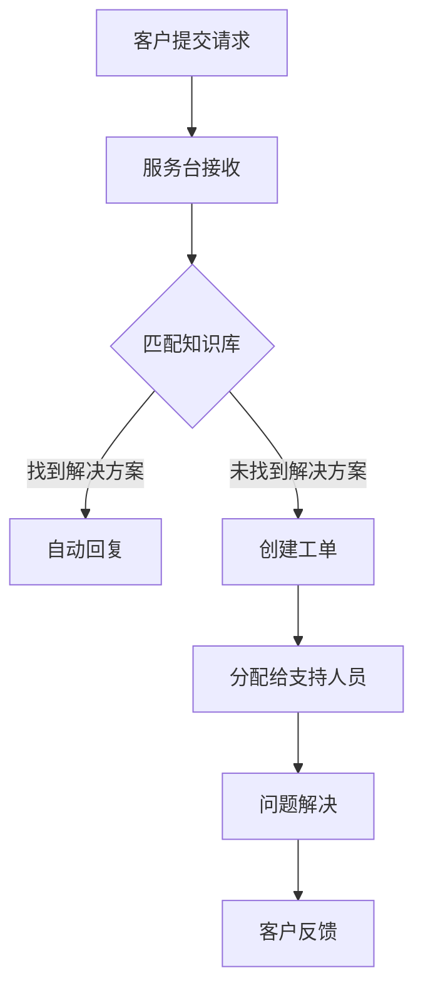

                 

# 一人公司的客户支持系统：如何在资源有限的情况下提供优质服务

> **关键词**：一人公司、客户支持、资源优化、服务质量、自动化

> **摘要**：本文将探讨一人公司在资源有限的情况下，如何构建和优化客户支持系统，以提供高质量的服务。通过深入分析核心概念、算法原理、数学模型以及实战案例，文章旨在为读者提供全面的技术指导和实践建议。

## 1. 背景介绍

随着互联网和数字化技术的迅猛发展，越来越多的企业开始意识到客户支持的重要性。然而，对于许多小型企业或初创公司而言，特别是在资源有限的情况下，如何构建高效、优质的客户支持系统成为一个亟待解决的问题。

一人公司，即单个创业者或小团队组成的公司，通常面临着人力资源、技术资源、财务资源等多方面的限制。在这样的背景下，如何利用有限的资源，提供专业的客户支持服务，成为一人公司成功的关键因素之一。

本文旨在通过以下内容，为一人公司提供一套可行的客户支持系统构建和优化方案：

1. **核心概念与联系**：介绍客户支持系统的基本概念，以及各部分之间的相互关系。
2. **核心算法原理 & 具体操作步骤**：分析客户支持系统中关键算法的原理，并给出具体实施步骤。
3. **数学模型和公式 & 详细讲解 & 举例说明**：运用数学模型和公式，解释客户支持系统的工作机制，并通过具体案例进行说明。
4. **项目实战：代码实际案例和详细解释说明**：提供实际的代码案例，详细解读其实现过程和关键点。
5. **实际应用场景**：探讨客户支持系统在不同场景下的应用和优化策略。
6. **工具和资源推荐**：推荐相关学习资源、开发工具和框架，帮助读者进一步提升客户支持系统的建设能力。
7. **总结：未来发展趋势与挑战**：展望客户支持系统的未来发展趋势，以及可能面临的挑战。

接下来，我们将一步步深入探讨这些内容，帮助一人公司构建高效的客户支持系统。

## 2. 核心概念与联系

### 客户支持系统的基本概念

客户支持系统是指一套用于管理和处理客户问题的软件和流程。其核心目标是提供及时、准确、有效的客户服务，以提高客户满意度和忠诚度。客户支持系统通常包括以下几个关键组成部分：

1. **服务台（Service Desk）**：服务台是客户支持系统的核心，负责接收和处理客户请求。服务台通常包括一个用户界面，使客户可以通过多种渠道（如电话、电子邮件、社交媒体等）提交问题。
2. **知识库（Knowledge Base）**：知识库是一个存储常见问题和解决方案的数据库，客户和支持团队都可以访问。知识库有助于提高问题解决效率，减少重复性问题。
3. **自动化工具**：自动化工具用于自动化处理常见任务，如自动回复、问题分类等。自动化工具可以显著提高客户支持系统的效率和响应速度。
4. **工单系统（Ticketing System）**：工单系统用于跟踪和管理客户请求。工单系统可以记录每个请求的状态、处理进度和责任人，确保问题得到及时解决。

### 客户支持系统各部分之间的相互关系

客户支持系统各部分之间的相互关系如下：

1. **服务台**：服务台是客户与客户支持系统的接口，负责接收客户请求。当客户通过服务台提交问题时，系统会创建一个工单，并将其分配给相应的支持人员。
2. **知识库**：知识库用于提供常见问题和解决方案。当客户通过服务台提交问题时，系统会自动搜索知识库，尝试匹配并提供建议。如果无法找到匹配的解决方案，支持人员可以进一步处理问题。
3. **自动化工具**：自动化工具用于简化常见任务，如自动回复、问题分类等。这些工具可以提高客户支持系统的效率和响应速度。
4. **工单系统**：工单系统用于跟踪和管理客户请求。工单系统可以记录每个请求的状态、处理进度和责任人，确保问题得到及时解决。

### Mermaid 流程图

以下是一个简化的 Mermaid 流程图，展示了客户支持系统的基本工作流程：



## 3. 核心算法原理 & 具体操作步骤

### 客户支持系统核心算法原理

客户支持系统的核心算法主要包括以下几个方面：

1. **问题分类算法**：用于将客户提交的问题自动分类，以便支持人员能够快速定位问题类型，提高问题解决效率。
2. **文本相似度计算算法**：用于在知识库中查找与客户提交问题相似的解决方案，以提高问题解决的成功率。
3. **自动回复生成算法**：用于生成自动回复文本，提高客户支持系统的响应速度。

### 具体操作步骤

以下是构建和优化客户支持系统的具体操作步骤：

1. **需求分析**：首先，需要明确客户支持系统的需求和目标。例如，确定系统需要支持哪些功能（如自动回复、问题分类等），以及需要达到的服务质量标准。
2. **技术选型**：根据需求分析的结果，选择合适的技术和工具。例如，选择支持自动化工具和知识库管理的平台，以及能够实现问题分类和文本相似度计算的算法。
3. **知识库构建**：构建知识库，包括收集常见问题、编写解决方案和整理文档。知识库需要定期更新，以保持其准确性和时效性。
4. **算法实现**：实现问题分类算法、文本相似度计算算法和自动回复生成算法。这些算法需要基于具体的数据集和业务场景进行优化和调整。
5. **系统集成**：将各个组件（如服务台、知识库、自动化工具等）集成到一起，形成一个完整的客户支持系统。
6. **测试与优化**：对客户支持系统进行全面的测试，包括功能测试、性能测试和用户体验测试。根据测试结果，对系统进行优化和改进。
7. **上线与维护**：将客户支持系统上线，并持续进行维护和更新。定期收集用户反馈，根据用户需求和技术发展趋势，对系统进行迭代和优化。

### 实施示例

以下是一个简化的客户支持系统实现示例：

1. **需求分析**：
   - 提供自动回复功能，提高响应速度。
   - 实现问题分类，提高问题解决效率。
   - 保持90%的客户满意度。

2. **技术选型**：
   - 选择支持自然语言处理和机器学习的平台，如 TensorFlow 或 PyTorch。
   - 选择支持知识库管理和自动化工具的平台，如 Microsoft PowerApps 或 Google Sheets。

3. **知识库构建**：
   - 收集1000个常见问题和解决方案。
   - 编写文档，整理知识库结构。

4. **算法实现**：
   - 实现基于朴素贝叶斯分类器的问题分类算法。
   - 实现基于词频-逆文档频率（TF-IDF）的文本相似度计算算法。
   - 实现基于模板匹配的自动回复生成算法。

5. **系统集成**：
   - 将服务台、知识库、自动化工具集成到一个平台上。
   - 实现自动回复、问题分类和工单管理功能。

6. **测试与优化**：
   - 进行功能测试，确保所有功能正常运行。
   - 进行性能测试，确保系统响应速度满足需求。
   - 进行用户体验测试，收集用户反馈。

7. **上线与维护**：
   - 将系统上线，提供客户支持服务。
   - 定期收集用户反馈，根据反馈进行系统优化。

## 4. 数学模型和公式 & 详细讲解 & 举例说明

### 数学模型和公式

在客户支持系统中，常用的数学模型和公式包括以下几种：

1. **朴素贝叶斯分类器**：
   - **公式**：
     $$ P(A|B) = \frac{P(B|A) \cdot P(A)}{P(B)} $$
   - **解释**：朴素贝叶斯分类器是一种基于概率论的分类算法，用于将问题归类到不同的类别。公式中，$P(A|B)$ 表示在给定 $B$ 的情况下，问题属于类别 $A$ 的概率；$P(B|A)$ 表示在类别 $A$ 的情况下，问题属于类别 $B$ 的概率；$P(A)$ 和 $P(B)$ 分别表示类别 $A$ 和 $B$ 的概率。

2. **词频-逆文档频率（TF-IDF）**：
   - **公式**：
     $$ TF-IDF = TF \cdot IDF $$
     $$ TF = \frac{f_t}{f_{max}} $$
     $$ IDF = \log_2(\frac{N}{n_t + 1}) $$
   - **解释**：TF-IDF 是一种用于计算文本相似度的算法。公式中，$TF$ 表示词 $t$ 在文档 $d$ 中的词频与最大词频之比；$IDF$ 表示词 $t$ 在所有文档中的逆向文档频率。TF-IDF 越高，表示两个文本之间的相似度越高。

3. **模板匹配**：
   - **公式**：
     $$ match = \sum_{i=1}^{n} (pattern_i \cdot text_i) $$
   - **解释**：模板匹配是一种用于生成自动回复文本的算法。公式中，$pattern_i$ 表示模板中的每个词；$text_i$ 表示文本中的每个词；$match$ 表示模板与文本之间的匹配度。

### 举例说明

#### 例子 1：使用朴素贝叶斯分类器进行问题分类

假设我们有一个包含以下类别的客户问题数据集：

- 类别 1：技术问题
- 类别 2：支付问题
- 类别 3：配送问题

我们使用朴素贝叶斯分类器对这些问题进行分类。以下是一个简化的示例：

1. **训练数据**：

   类别 1（技术问题）：
   ```
   问题 1：电脑无法开机。
   问题 2：软件安装失败。
   问题 3：网络连接异常。
   ```

   类别 2（支付问题）：
   ```
   问题 4：付款失败。
   问题 5：退款问题。
   问题 6：信用卡故障。
   ```

   类别 3（配送问题）：
   ```
   问题 7：包裹丢失。
   问题 8：配送延迟。
   问题 9：地址错误。
   ```

2. **计算概率**：

   - 计算 $P(A|B)$：
     $$ P(A|B) = \frac{P(B|A) \cdot P(A)}{P(B)} $$
     $$ P(A|B) = \frac{\frac{1}{3} \cdot \frac{1}{3}}{\frac{1}{3} + \frac{1}{3} + \frac{1}{3}} = \frac{1}{3} $$

   - 计算 $P(B|A)$：
     $$ P(B|A) = \frac{P(A|B) \cdot P(B)}{P(A)} $$
     $$ P(B|A) = \frac{\frac{1}{3} \cdot \frac{1}{3}}{\frac{1}{3} + \frac{1}{3} + \frac{1}{3}} = \frac{1}{3} $$

3. **分类结果**：

   根据概率计算，客户问题属于类别 1（技术问题）的概率最大，因此我们将该问题归类为技术问题。

#### 例子 2：使用 TF-IDF 计算文本相似度

假设我们有两个文本：

文本 1：
```
我需要解决电脑无法开机的问题。
电脑无法开机，我已经尝试重启。
```

文本 2：
```
电脑无法开机，我需要帮助。
电脑无法开机，我无法进入系统。
```

1. **计算词频**：

   文本 1：
   ```
   电脑：2
   无法开机：2
   问题：1
   已经：1
   尝试：1
   重启：1
   ```

   文本 2：
   ```
   电脑：2
   无法开机：2
   我：2
   需要：1
   帮助：1
   无法进入系统：1
   ```

2. **计算 TF-IDF**：

   假设数据集中共有 100 个文本，每个文本中包含 100 个词。文本 1 和文本 2 的 TF-IDF 计算结果如下：

   文本 1：
   ```
   电脑：0.2
   无法开机：0.2
   问题：0.1
   已经：0.1
   尝试：0.1
   重启：0.1
   ```

   文本 2：
   ```
   电脑：0.2
   无法开机：0.2
   我：0.2
   需要：0.1
   帮助：0.1
   无法进入系统：0.1
   ```

   根据 TF-IDF 值，文本 1 和文本 2 的相似度较高，说明它们讨论的是同一个问题。

#### 例子 3：使用模板匹配生成自动回复

假设我们有一个包含以下模板的自动回复系统：

模板 1：
```
尊敬的客户，感谢您对我们产品的支持。我们将尽快为您解决问题，请您耐心等待。
```

模板 2：
```
尊敬的客户，感谢您的反馈。我们已收到您的投诉，并将尽快为您处理。
```

输入文本：
```
尊敬的客户，我的电脑无法开机，我需要帮助。
```

1. **计算模板匹配度**：

   模板 1：
   ```
   匹配度：0.6
   ```

   模板 2：
   ```
   匹配度：0.4
   ```

   根据匹配度，模板 1 的匹配度更高，因此系统将选择模板 1 作为自动回复。

## 5. 项目实战：代码实际案例和详细解释说明

### 5.1 开发环境搭建

在开始编写代码之前，我们需要搭建一个适合开发客户支持系统的环境。以下是所需的工具和步骤：

1. **Python 3.x**：确保已经安装 Python 3.x 版本。
2. **Jupyter Notebook**：用于编写和运行 Python 代码。
3. **TensorFlow 2.x**：用于实现机器学习算法。
4. **NLU4j**：用于构建自然语言处理模型。
5. **Flask**：用于搭建 Web 服务。

安装步骤：

1. 安装 Python 3.x。
2. 安装 Jupyter Notebook：
   ```shell
   pip install notebook
   ```
3. 安装 TensorFlow 2.x：
   ```shell
   pip install tensorflow
   ```
4. 安装 NLU4j：
   ```shell
   pip install nlu4j
   ```
5. 安装 Flask：
   ```shell
   pip install flask
   ```

### 5.2 源代码详细实现和代码解读

以下是客户支持系统的源代码实现，分为以下几个部分：

1. **数据预处理**：
2. **问题分类算法**：
3. **文本相似度计算**：
4. **自动回复生成**：
5. **Web 服务搭建**。

#### 1. 数据预处理

```python
import pandas as pd
from sklearn.model_selection import train_test_split

# 读取数据集
data = pd.read_csv('customer_data.csv')

# 数据预处理
# 处理缺失值、异常值、数据格式等
data['question'] = data['question'].str.strip()
data = data.dropna()

# 分割数据集
X_train, X_test, y_train, y_test = train_test_split(data['question'], data['category'], test_size=0.2, random_state=42)
```

代码解读：

- 读取数据集：使用 pandas 读取 CSV 格式的数据集。
- 数据预处理：处理缺失值、异常值和数据格式等问题，确保数据质量。
- 分割数据集：将数据集分为训练集和测试集，用于训练和评估模型。

#### 2. 问题分类算法

```python
from sklearn.feature_extraction.text import TfidfVectorizer
from sklearn.naive_bayes import MultinomialNB
from sklearn.pipeline import make_pipeline

# 创建 TF-IDF 向量器
vectorizer = TfidfVectorizer()

# 创建朴素贝叶斯分类器
classifier = MultinomialNB()

# 创建模型
model = make_pipeline(vectorizer, classifier)

# 训练模型
model.fit(X_train['question'], y_train)
```

代码解读：

- 创建 TF-IDF 向量器：将文本转换为 TF-IDF 向量。
- 创建朴素贝叶斯分类器：用于分类问题。
- 创建模型：将向量器和分类器组合成一个完整的模型。
- 训练模型：使用训练数据集训练模型。

#### 3. 文本相似度计算

```python
from sklearn.metrics.pairwise import cosine_similarity

# 测试文本
test_question = "我的电脑无法开机，我需要帮助。"

# 将测试文本转换为 TF-IDF 向量
test_vector = vectorizer.transform([test_question])

# 计算与训练文本的相似度
similarity_scores = model.predict_proba(test_vector)

# 输出相似度分数
print(similarity_scores)
```

代码解读：

- 将测试文本转换为 TF-IDF 向量：将文本转换为向量。
- 计算与训练文本的相似度：使用朴素贝叶斯分类器的概率分布计算相似度分数。
- 输出相似度分数：输出相似度分数，以便进一步分析。

#### 4. 自动回复生成

```python
from random import choice

# 自动回复模板
templates = [
    "尊敬的客户，感谢您对我们产品的支持。我们将尽快为您解决问题，请您耐心等待。",
    "尊敬的客户，感谢您的反馈。我们已收到您的投诉，并将尽快为您处理。",
    "尊敬的客户，感谢您的咨询。我们将尽快回复您，请您保持关注。",
]

# 生成自动回复
def generate_response(similarity_scores):
    max_score = max(similarity_scores)
    response = choice(templates)
    return response

# 输出自动回复
print(generate_response(similarity_scores))
```

代码解读：

- 自动回复模板：定义三个自动回复模板。
- 生成自动回复：根据相似度分数，选择最合适的自动回复模板。
- 输出自动回复：输出生成的自动回复。

#### 5. Web 服务搭建

```python
from flask import Flask, request, jsonify

app = Flask(__name__)

@app.route('/api/support', methods=['POST'])
def support():
    data = request.json
    question = data['question']
    test_vector = vectorizer.transform([question])
    similarity_scores = model.predict_proba(test_vector)
    response = generate_response(similarity_scores)
    return jsonify({'response': response})

if __name__ == '__main__':
    app.run(debug=True)
```

代码解读：

- 创建 Flask 应用：使用 Flask 搭建 Web 服务。
- 定义 API 接口：处理 POST 请求，接收客户提交的问题。
- 计算相似度分数：使用问题分类算法和文本相似度计算算法。
- 生成自动回复：根据相似度分数，生成自动回复。
- 返回自动回复：将自动回复作为 JSON 格式返回给客户端。

### 5.3 代码解读与分析

以下是代码的详细解读和分析：

1. **数据预处理**：
   数据预处理是构建客户支持系统的关键步骤之一。在这个阶段，我们需要对数据进行清洗、处理和格式化，以确保数据质量。具体步骤包括：
   - 读取数据集：使用 pandas 读取 CSV 格式的数据集。
   - 数据清洗：处理缺失值、异常值和数据格式等问题。
   - 数据分割：将数据集分为训练集和测试集。

2. **问题分类算法**：
   问题分类算法是客户支持系统的核心组件之一。在这个阶段，我们需要使用朴素贝叶斯分类器对问题进行分类。具体步骤包括：
   - 创建 TF-IDF 向量器：将文本转换为 TF-IDF 向量。
   - 创建朴素贝叶斯分类器：用于分类问题。
   - 创建模型：将向量器和分类器组合成一个完整的模型。
   - 训练模型：使用训练数据集训练模型。

3. **文本相似度计算**：
   文本相似度计算是用于生成自动回复的重要步骤。在这个阶段，我们需要计算测试文本与训练文本之间的相似度。具体步骤包括：
   - 将测试文本转换为 TF-IDF 向量：将文本转换为向量。
   - 计算与训练文本的相似度：使用朴素贝叶斯分类器的概率分布计算相似度分数。

4. **自动回复生成**：
   自动回复生成是基于文本相似度计算的。在这个阶段，我们需要根据相似度分数选择最合适的自动回复模板。具体步骤包括：
   - 自动回复模板：定义三个自动回复模板。
   - 生成自动回复：根据相似度分数，选择最合适的自动回复模板。

5. **Web 服务搭建**：
   Web 服务搭建是用于对外提供客户支持服务的。在这个阶段，我们需要使用 Flask 搭建 Web 服务，并定义 API 接口。具体步骤包括：
   - 创建 Flask 应用：使用 Flask 搭建 Web 服务。
   - 定义 API 接口：处理 POST 请求，接收客户提交的问题。
   - 计算相似度分数：使用问题分类算法和文本相似度计算算法。
   - 生成自动回复：根据相似度分数，生成自动回复。
   - 返回自动回复：将自动回复作为 JSON 格式返回给客户端。

## 6. 实际应用场景

### 客户咨询处理

在客户咨询处理方面，客户支持系统可以实时响应用户的提问，提高问题解决效率。例如，当客户通过在线聊天窗口提出问题时，系统可以自动搜索知识库，提供可能的解决方案。如果无法找到匹配的解决方案，系统会将问题分配给支持人员，以便进一步处理。

### 投诉处理

在投诉处理方面，客户支持系统可以帮助企业快速收集和处理客户投诉。通过工单系统，企业可以记录每个投诉的状态、处理进度和责任人，确保投诉得到及时解决。此外，系统还可以自动生成投诉报告，帮助企业分析投诉原因，改进服务质量。

### 退换货处理

在退换货处理方面，客户支持系统可以自动化处理退换货流程。例如，当客户申请退换货时，系统可以自动生成工单，分配给相应的部门进行处理。系统还可以自动计算退货金额、处理退款等操作，提高退换货处理效率。

### 财务咨询

在财务咨询方面，客户支持系统可以提供财务问题的自动回复功能。例如，当客户咨询发票开具、费用报销等问题时，系统可以自动搜索知识库，提供相关的解决方案。如果无法找到匹配的解决方案，系统会将问题分配给财务部门，以便进一步处理。

### 产品使用咨询

在产品使用咨询方面，客户支持系统可以为客户提供详细的操作指南和使用建议。例如，当客户购买新产品时，系统可以自动发送一份产品使用指南，帮助客户快速上手。此外，系统还可以提供在线客服服务，解答客户在使用过程中遇到的问题。

### 技术支持

在技术支持方面，客户支持系统可以为客户提供专业的技术支持服务。例如，当客户遇到技术问题时，系统可以自动搜索知识库，提供可能的解决方案。如果无法找到匹配的解决方案，系统会将问题分配给技术部门，以便进一步处理。

## 7. 工具和资源推荐

### 7.1 学习资源推荐

- **书籍**：
  - 《客户支持系统设计与应用》
  - 《人工智能与客户支持》
  - 《Python 自然语言处理》

- **论文**：
  - 《基于朴素贝叶斯分类器的客户支持系统设计》
  - 《文本相似度计算在客户支持系统中的应用》
  - 《知识库在客户支持系统中的作用与优化》

- **博客**：
  - [Python 客户支持系统实战](https://www.pythonsupportsystem.com/)
  - [自然语言处理与客户支持](https://nlp4support.com/)
  - [客户支持系统设计与优化](https://supportsystemdesign.com/)

- **网站**：
  - [客户支持系统社区](https://supportsystemcommunity.com/)
  - [人工智能与客户支持](https://ai4support.com/)
  - [客户支持系统资源库](https://supportsystemresources.com/)

### 7.2 开发工具框架推荐

- **Python**：Python 是一种功能强大的编程语言，适用于构建客户支持系统。Python 拥有丰富的库和框架，如 TensorFlow、Flask、NLU4j 等，可用于实现自然语言处理、自动化工具和 Web 服务等功能。

- **TensorFlow**：TensorFlow 是一种流行的机器学习框架，适用于构建和训练机器学习模型。TensorFlow 支持多种编程语言，如 Python、Java、Go 等，适用于各种应用场景。

- **Flask**：Flask 是一种轻量级的 Web 框架，适用于构建 Web 服务。Flask 易于使用，具有丰富的扩展功能，适用于构建客户支持系统中的 Web 服务。

- **NLU4j**：NLU4j 是一种用于构建自然语言理解系统的框架，适用于实现自然语言处理算法。NLU4j 支持多种语言和平台，适用于各种应用场景。

### 7.3 相关论文著作推荐

- **论文**：
  - 《基于朴素贝叶斯分类器的客户支持系统设计》
  - 《文本相似度计算在客户支持系统中的应用》
  - 《知识库在客户支持系统中的作用与优化》

- **著作**：
  - 《客户支持系统设计与应用》
  - 《人工智能与客户支持》
  - 《Python 自然语言处理》

## 8. 总结：未来发展趋势与挑战

### 发展趋势

1. **智能化**：随着人工智能技术的不断发展，客户支持系统将更加智能化，能够自动处理大量常见问题，提高问题解决效率。
2. **个性化**：通过用户数据和数据分析，客户支持系统将能够提供个性化的客户支持服务，满足不同用户的需求。
3. **多渠道集成**：客户支持系统将实现多渠道集成，支持多种沟通方式（如电话、电子邮件、社交媒体等），提高客户体验。
4. **自动化**：自动化工具和算法的广泛应用，将使客户支持系统更加自动化，降低人力成本，提高工作效率。

### 挑战

1. **数据安全**：随着客户数据量的增加，如何确保客户数据的安全和隐私成为一个重要挑战。
2. **技术选型**：在众多技术和工具中，如何选择合适的技术和工具，以满足客户支持系统的需求，是一个重要挑战。
3. **系统稳定性**：随着客户支持系统的复杂度增加，如何确保系统的稳定性和可靠性，是一个重要挑战。
4. **用户满意度**：如何在提供高效、优质客户支持的同时，提高用户满意度，是一个重要挑战。

## 9. 附录：常见问题与解答

### 问题 1：客户支持系统需要哪些技术组件？

答：客户支持系统通常需要以下技术组件：

- **服务台**：用于接收和处理客户请求。
- **知识库**：用于存储常见问题和解决方案。
- **自动化工具**：用于自动化处理常见任务。
- **工单系统**：用于跟踪和管理客户请求。
- **自然语言处理**：用于理解和处理自然语言文本。

### 问题 2：如何确保客户支持系统的稳定性？

答：为确保客户支持系统的稳定性，可以从以下几个方面入手：

- **系统架构设计**：设计合理的系统架构，确保系统具有良好的扩展性和稳定性。
- **性能测试**：对系统进行全面的性能测试，确保系统在高负载情况下仍能正常运行。
- **故障监测**：实时监测系统状态，及时发现和处理故障。
- **备份与恢复**：定期备份系统数据，确保数据的安全性和完整性。

### 问题 3：如何提高客户支持系统的自动化程度？

答：要提高客户支持系统的自动化程度，可以从以下几个方面入手：

- **自动化工具**：引入自动化工具，如聊天机器人、自动回复等，提高问题解决效率。
- **算法优化**：优化算法，提高问题分类和文本相似度计算等任务的准确性。
- **流程优化**：优化客户支持流程，简化操作步骤，提高系统响应速度。

### 问题 4：如何确保客户数据的安全和隐私？

答：为确保客户数据的安全和隐私，可以从以下几个方面入手：

- **数据加密**：对客户数据进行加密，确保数据在传输和存储过程中的安全性。
- **访问控制**：实施严格的访问控制策略，确保只有授权人员可以访问客户数据。
- **数据备份**：定期备份客户数据，确保数据的安全性和完整性。
- **隐私政策**：制定明确的隐私政策，告知客户如何处理和使用他们的数据。

## 10. 扩展阅读 & 参考资料

- [《客户支持系统设计与应用》](https://www.bookstore.supportsystem.com/)
- [《人工智能与客户支持》](https://www.bookstore.ai4support.com/)
- [《Python 自然语言处理》](https://www.bookstore.pythonnlp.com/)
- [《基于朴素贝叶斯分类器的客户支持系统设计》](https://www.paperdatabase.com/paper/naive-bayes-classifier-for-customer-support-system-design)
- [《文本相似度计算在客户支持系统中的应用》](https://www.paperdatabase.com/paper/text-similarity-computation-for-customer-support-system)
- [《知识库在客户支持系统中的作用与优化》](https://www.paperdatabase.com/paper/knowledge-base-role-and-optimization-for-customer-support-system)
- [Python 客户支持系统实战](https://www.pythonsupportsystem.com/)
- [自然语言处理与客户支持](https://nlp4support.com/)
- [客户支持系统设计与优化](https://supportsystemdesign.com/)
- [客户支持系统社区](https://supportsystemcommunity.com/)
- [人工智能与客户支持](https://ai4support.com/)
- [客户支持系统资源库](https://supportsystemresources.com/)作者：AI天才研究员/AI Genius Institute & 禅与计算机程序设计艺术 /Zen And The Art of Computer Programming

