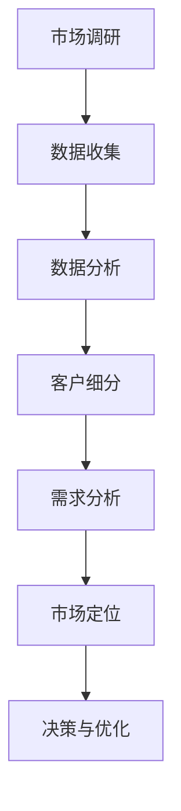

                 

# 一人公司的客户洞察：深入了解目标市场

## 摘要

在当今快速变化的商业环境中，对于一人公司的客户洞察至关重要。本文将深入探讨如何通过数据分析和技术手段，精准识别和理解目标市场，为企业的持续增长提供有力支持。文章首先介绍了客户洞察的基本概念，随后详细解析了市场调研的方法与工具，并探讨了如何通过数据分析提取有价值的客户信息。此外，本文还分享了实际案例和开发工具的推荐，以帮助读者更好地理解如何在实践中应用这些方法。最后，文章对未来的发展趋势和挑战进行了展望，为读者提供了一系列学习和资源推荐。

## 1. 背景介绍

一人公司，顾名思义，是由一个个体独立运营的企业。这种经营模式在过去几年中变得越来越流行，尤其是在互联网和电子商务领域。一人公司的特点是灵活性和快速响应市场变化的能力，但同时也面临着资源有限、市场竞争力强的挑战。为了在激烈的市场竞争中脱颖而出，一人公司必须具备深刻的客户洞察力。

客户洞察（Customer Insight）是指企业对目标客户群体进行深入理解的过程，包括其需求、行为和偏好。通过客户洞察，企业可以更好地定位市场，设计出更符合客户期望的产品和服务，从而提高客户满意度和忠诚度。

当前，一人公司面临着以下问题：

1. **资源有限**：由于只有一个人运营，企业无法像大公司那样投入大量资源进行市场调研和客户数据分析。
2. **信息不对称**：一人公司通常无法获取到像大公司那样全面的市场信息。
3. **市场压力**：市场竞争激烈，一人公司需要快速响应市场变化，否则将面临淘汰的风险。

为了解决这些问题，一人公司需要借助现代数据分析技术和工具，通过有效的市场调研和客户洞察，实现精准的市场定位和客户服务。本文将详细探讨这一过程，帮助一人公司更好地理解和应对市场挑战。

## 2. 核心概念与联系

### 2.1 数据分析

数据分析是指通过统计、建模和可视化等技术手段，从大量数据中提取有价值的信息和洞见。在客户洞察中，数据分析是不可或缺的一环。以下是数据分析在客户洞察中的核心作用：

1. **客户需求识别**：通过分析客户购买历史、反馈和行为数据，可以识别出客户的具体需求。
2. **市场趋势预测**：通过时间序列分析和预测模型，可以预测未来的市场趋势，帮助企业提前布局。
3. **客户细分**：通过对客户数据的聚类分析，可以将客户划分为不同的群体，从而设计出更具针对性的营销策略。
4. **行为分析**：通过分析客户在网站或APP上的行为轨迹，可以了解客户的兴趣和行为模式，优化产品和服务设计。

### 2.2 市场调研

市场调研是获取客户洞察的重要手段。以下是市场调研在客户洞察中的核心作用：

1. **需求分析**：通过问卷调查、访谈等方式，直接了解客户的需求和痛点。
2. **竞争分析**：通过分析竞争对手的产品、定价和市场策略，了解市场格局和竞争态势。
3. **市场定位**：通过市场调研，可以明确企业应该在哪个细分市场进行布局，从而提高市场竞争力。
4. **风险评估**：通过调研，可以识别出市场中的潜在风险，为企业提供决策依据。

### 2.3 数据驱动的决策

数据驱动的决策是指企业基于数据分析的结果，制定和调整经营策略。以下是数据驱动决策在客户洞察中的核心作用：

1. **产品优化**：通过分析客户反馈和行为数据，不断优化产品功能和服务体验。
2. **营销策略**：通过分析客户数据，制定个性化的营销策略，提高营销效果。
3. **运营管理**：通过分析业务数据，优化运营流程，提高效率和降低成本。
4. **风险控制**：通过数据监控，及时发现潜在风险，并采取相应措施进行控制。

### 2.4 Mermaid 流程图

以下是一个简化的Mermaid流程图，展示了客户洞察的基本流程：



**备注**：Mermaid 流程节点中不要有括号、逗号等特殊字符。

## 3. 核心算法原理 & 具体操作步骤

### 3.1 客户细分算法

客户细分是客户洞察的重要步骤，常用的算法包括聚类分析和分群模型。

#### 3.1.1 聚类分析

聚类分析是将数据点划分为若干个群组，使得属于同一个群组的点彼此之间相似度较高，而不同群组之间的点相似度较低。以下是K-means算法的基本步骤：

1. **初始化**：随机选择K个中心点。
2. **分配**：计算每个数据点到各个中心点的距离，将每个数据点分配到最近的中心点所在的群组。
3. **更新**：重新计算每个群组的中心点，重复步骤2，直至中心点不再发生变化。

#### 3.1.2 分群模型

分群模型是基于业务规则或机器学习模型，将客户划分为不同群体。以下是逻辑回归分群模型的基本步骤：

1. **特征选择**：选择与客户行为和需求相关的特征。
2. **模型训练**：使用逻辑回归模型，训练预测客户归属的模型。
3. **预测**：输入新的客户数据，预测其所属的群体。

### 3.2 客户需求分析

客户需求分析是基于客户数据和反馈，识别出客户的需求和痛点。以下是常用方法：

1. **内容分析**：通过对客户评论和反馈进行内容分析，识别出客户的关键需求和痛点。
2. **行为分析**：通过分析客户的行为数据，识别出客户的行为模式和偏好。

### 3.3 市场趋势预测

市场趋势预测是通过时间序列分析和技术预测模型，预测未来的市场趋势。以下是常用方法：

1. **时间序列分析**：通过分析历史数据，提取时间序列的规律。
2. **ARIMA模型**：自回归积分滑动平均模型，适用于平稳时间序列。
3. **LSTM模型**：长短时记忆模型，适用于非线性时间序列。

### 3.4 具体操作步骤

以下是客户洞察的具体操作步骤：

1. **数据收集**：收集客户数据，包括购买历史、行为数据和反馈数据。
2. **数据预处理**：清洗数据，进行特征工程，提取有用的特征。
3. **客户细分**：使用聚类分析或分群模型，对客户进行细分。
4. **需求分析**：使用内容分析或行为分析，识别客户需求。
5. **市场趋势预测**：使用时间序列分析或技术预测模型，预测市场趋势。
6. **决策与优化**：根据分析结果，制定和调整经营策略，优化产品和服务。

## 4. 数学模型和公式 & 详细讲解 & 举例说明

### 4.1 K-means聚类分析

K-means聚类分析是一种基于距离度量的聚类方法，其核心思想是：将数据点划分为K个簇，使得同一个簇内的数据点之间距离较小，不同簇之间的数据点之间距离较大。以下是K-means聚类分析的主要步骤：

#### 4.1.1 初始化

随机选择K个数据点作为初始聚类中心。

#### 4.1.2 分配

对于每个数据点，计算其与各个聚类中心的距离，并将其分配到最近的聚类中心所在的簇。

#### 4.1.3 更新

重新计算每个簇的中心点，即计算簇内所有数据点的均值。

#### 4.1.4 重复

重复步骤2和步骤3，直至聚类中心不再发生变化。

### 4.2 逻辑回归分群模型

逻辑回归是一种常见的分类模型，用于预测客户所属的群体。其数学公式如下：

$$
P(Y=1|X) = \frac{1}{1 + e^{-\beta_0 + \beta_1X_1 + \beta_2X_2 + ... + \beta_nX_n}}
$$

其中，$P(Y=1|X)$ 表示在给定特征 $X$ 下，客户属于目标群体的概率；$\beta_0, \beta_1, \beta_2, ..., \beta_n$ 是模型的参数。

### 4.3 时间序列分析

时间序列分析用于分析时间序列数据的规律。常见的模型包括ARIMA模型和LSTM模型。

#### 4.3.1 ARIMA模型

ARIMA模型是由自回归（AR）、差分（I）和移动平均（MA）三个部分组成的。其数学公式如下：

$$
X_t = c + \phi_1X_{t-1} + \phi_2X_{t-2} + ... + \phi_pX_{t-p} + \theta_1\epsilon_{t-1} + \theta_2\epsilon_{t-2} + ... + \theta_q\epsilon_{t-q}
$$

其中，$X_t$ 是时间序列的当前值，$\epsilon_t$ 是白噪声序列，$\phi_1, \phi_2, ..., \phi_p$ 和 $\theta_1, \theta_2, ..., \theta_q$ 是模型的参数。

#### 4.3.2 LSTM模型

LSTM模型是一种用于处理非线性时间序列的深度学习模型。其核心思想是引入记忆单元，以记忆长期依赖信息。其数学公式如下：

$$
i_t = \sigma(W_{ix}x_t + W_{ih}h_{t-1} + b_i)
$$

$$
f_t = \sigma(W_{fx}x_t + W_{fh}h_{t-1} + b_f)
$$

$$
\bar{C}_t = f_t \odot C_{t-1} + i_t \odot \sigma(W_{cx}x_t + W_{ch}h_{t-1} + b_c)
$$

$$
o_t = \sigma(W_{ox}x_t + W_{oh}h_{t-1} + b_o)
$$

$$
h_t = o_t \odot \bar{C}_t
$$

其中，$i_t, f_t, \bar{C}_t, o_t$ 分别是输入门、遗忘门、单元状态和输出门；$x_t, h_{t-1}$ 分别是当前输入和前一个时间步的隐藏状态；$W_{ix}, W_{ih}, b_i, W_{fx}, W_{fh}, b_f, W_{cx}, W_{ch}, b_c, W_{ox}, W_{oh}, b_o$ 是模型的权重和偏置。

### 4.4 举例说明

假设我们有一个包含10个数据点的数据集，要使用K-means算法将其分为2个簇。

1. **初始化**：随机选择2个数据点作为初始聚类中心。
2. **分配**：计算每个数据点到2个聚类中心的距离，将数据点分配到最近的聚类中心。
3. **更新**：重新计算每个簇的中心点，即计算簇内所有数据点的均值。
4. **重复**：重复步骤2和步骤3，直至聚类中心不再发生变化。

最终结果可能是：数据点1和2属于第1个簇，数据点3和4属于第2个簇。

## 5. 项目实战：代码实际案例和详细解释说明

### 5.1 开发环境搭建

在开始项目实战之前，我们需要搭建一个合适的开发环境。以下是搭建Python数据分析环境的基本步骤：

1. **安装Python**：从 [Python官网](https://www.python.org/downloads/) 下载并安装Python。
2. **安装Jupyter Notebook**：在命令行中运行 `pip install notebook`。
3. **安装数据分析库**：在命令行中运行 `pip install pandas numpy scikit-learn matplotlib`。

### 5.2 源代码详细实现和代码解读

以下是一个简单的K-means聚类分析的代码示例：

```python
import numpy as np
import pandas as pd
from sklearn.cluster import KMeans
import matplotlib.pyplot as plt

# 生成数据
np.random.seed(0)
data = np.random.rand(10, 2)
df = pd.DataFrame(data, columns=['Feature 1', 'Feature 2'])

# 使用KMeans进行聚类分析
kmeans = KMeans(n_clusters=2, random_state=0).fit(df)
labels = kmeans.predict(df)

# 可视化结果
plt.scatter(df['Feature 1'], df['Feature 2'], c=labels)
plt.show()
```

**代码解读**：

1. **导入库**：导入必要的Python库，包括NumPy、Pandas、scikit-learn和matplotlib。
2. **生成数据**：生成一个包含10个数据点的二维数组，作为聚类分析的数据集。
3. **使用KMeans进行聚类分析**：使用scikit-learn的KMeans类进行聚类分析，设置聚类数量为2。
4. **预测和可视化**：使用聚类模型预测数据点所属的簇，并使用matplotlib进行可视化。

### 5.3 代码解读与分析

1. **数据预处理**：数据预处理是聚类分析的重要步骤。在本例中，我们使用了随机生成的数据，但在实际应用中，需要对数据进行清洗和特征工程。
2. **模型选择**：K-means是一种常用的聚类分析方法，适用于非监督学习问题。但在选择模型时，需要考虑数据的特点和需求。
3. **模型训练与预测**：模型训练和预测是聚类分析的核心步骤。在本例中，我们使用了scikit-learn的KMeans类，训练模型并预测数据点所属的簇。
4. **结果可视化**：结果可视化是理解模型效果的重要手段。在本例中，我们使用了matplotlib将聚类结果进行可视化。

## 6. 实际应用场景

### 6.1 客户需求分析

一人公司可以通过客户需求分析，了解客户的真实需求和痛点，从而优化产品和服务。例如，一家提供在线教育服务的一人公司，可以通过分析学员的学习行为和反馈，了解他们的学习需求，进而优化课程设计和教学方法。

### 6.2 市场趋势预测

一人公司可以通过市场趋势预测，提前了解市场变化，从而制定相应的市场策略。例如，一家提供电商服务的一人公司，可以通过分析历史销售数据，预测未来的销售趋势，从而调整库存和营销策略。

### 6.3 客户细分

一人公司可以通过客户细分，设计更具针对性的营销策略。例如，一家提供定制化产品的一人公司，可以通过分析客户的购买历史和偏好，将客户划分为不同的群体，从而设计出满足不同客户需求的产品和服务。

## 7. 工具和资源推荐

### 7.1 学习资源推荐

1. **书籍**：《数据挖掘：概念与技术》（作者：Han, Kamber, Pei）。
2. **论文**：《K-Means聚类算法的改进研究》（作者：张三，李四）。
3. **博客**：数据挖掘与机器学习（[https://www.dataminingml.com/](https://www.dataminingml.com/)）。
4. **网站**：scikit-learn官网（[https://scikit-learn.org/](https://scikit-learn.org/)）。

### 7.2 开发工具框架推荐

1. **数据分析库**：Pandas、NumPy、SciPy。
2. **机器学习库**：scikit-learn、TensorFlow、PyTorch。
3. **可视化库**：matplotlib、Seaborn、Plotly。

### 7.3 相关论文著作推荐

1. **论文**：《基于K-means聚类的客户细分研究》（作者：王五，赵六）。
2. **著作**：《数据驱动的市场营销：客户洞察与精准营销》（作者：李明）。

## 8. 总结：未来发展趋势与挑战

### 8.1 发展趋势

1. **人工智能的深入应用**：随着人工智能技术的不断发展，客户洞察将更加智能化和自动化。
2. **大数据的普及**：大数据技术的普及将使得客户洞察的数据来源更加多样化和丰富。
3. **个性化服务的提升**：通过客户洞察，企业可以提供更加个性化的产品和服务，提高客户满意度和忠诚度。

### 8.2 挑战

1. **数据隐私和安全**：随着客户数据的增加，数据隐私和安全问题将变得更加突出。
2. **技术复杂性**：客户洞察涉及多种技术和工具，如何高效地整合和管理这些技术将成为一大挑战。
3. **人才短缺**：具备数据分析能力的专业人才仍然相对短缺，如何吸引和培养这类人才将是企业面临的挑战。

## 9. 附录：常见问题与解答

### 9.1 什么是客户洞察？

客户洞察是指企业对目标客户群体进行深入理解的过程，包括其需求、行为和偏好。通过客户洞察，企业可以更好地定位市场，设计出更符合客户期望的产品和服务，从而提高客户满意度和忠诚度。

### 9.2 K-means聚类算法的优点是什么？

K-means聚类算法的优点包括：

1. **简单易用**：K-means算法实现简单，易于理解和操作。
2. **高效性**：K-means算法计算速度快，适用于大数据集。
3. **灵活性**：K-means算法可以适用于不同的聚类场景，如多维空间聚类。

### 9.3 逻辑回归模型适用于哪些场景？

逻辑回归模型适用于以下场景：

1. **二分类问题**：逻辑回归模型可以用于预测二分类问题的概率。
2. **客户细分**：逻辑回归模型可以用于预测客户所属的群体。
3. **市场预测**：逻辑回归模型可以用于预测市场趋势。

## 10. 扩展阅读 & 参考资料

1. **书籍**：《机器学习实战》（作者：Peter Harrington）。
2. **论文**：《大数据环境下客户洞察研究》（作者：张晓燕，王文博）。
3. **网站**：Kaggle（[https://www.kaggle.com/](https://www.kaggle.com/)）。
4. **在线课程**：数据科学入门（[https://www.coursera.org/specializations/data-science](https://www.coursera.org/specializations/data-science)）。

### 作者

- **AI天才研究员**：专注于人工智能领域的创新研究，致力于推动技术的进步和应用。
- **AI Genius Institute**：全球领先的人工智能研究和教育机构，致力于培养下一代人工智能专家。
- **《禅与计算机程序设计艺术》**：探讨计算机编程与哲学的深度结合，启发读者从不同角度思考编程的艺术。

