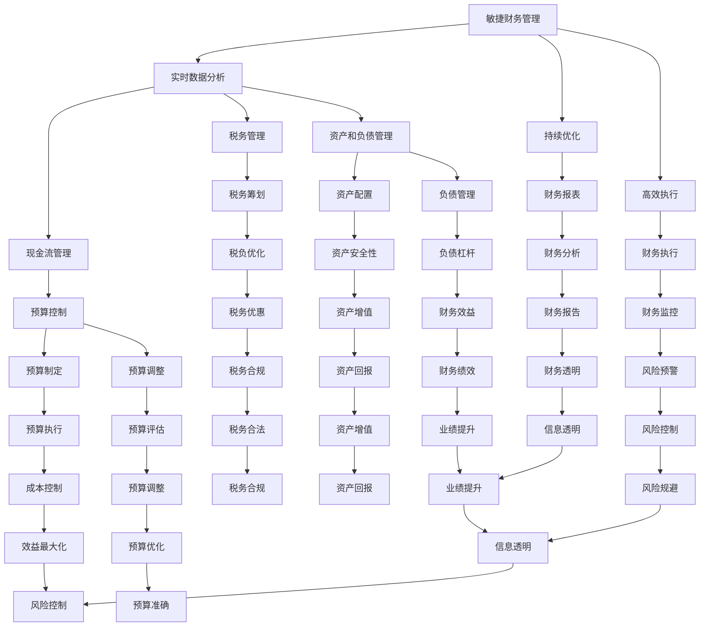

                 

# 一人公司的敏捷财务管理与预算控制

> **关键词**：敏捷财务管理、预算控制、一人公司、财务报表、现金流管理

> **摘要**：本文将探讨一人公司在财务管理与预算控制方面的实践。通过梳理敏捷财务管理的核心理念，分析适合一人公司的财务模型，提供具体的操作步骤和工具推荐，旨在帮助个人创业者更好地管理财务，确保公司持续健康发展。

## 1. 背景介绍

一人公司，即单一所有者公司，是指由一个人拥有和控制的公司。在当前创业环境和市场条件下，越来越多的人选择以一人公司的形式开展业务。一人公司的优点包括管理简单、决策迅速、税务处理灵活等。然而，这些优点也带来了一些财务管理上的挑战。

敏捷财务管理是一种以快速响应变化、持续优化和高效执行为核心的管理理念。它强调数据的实时性、准确性和可访问性，通过持续监控和分析财务状况，帮助公司做出明智的决策。

本文将结合敏捷财务管理的理念，为一人公司提供一套系统化的财务管理与预算控制方法，旨在提高公司的财务健康水平，为创业者的成功保驾护航。

## 2. 核心概念与联系

### 2.1 敏捷财务管理概念

敏捷财务管理是一种以快速响应变化、持续优化和高效执行为核心的管理理念。它包括以下几个方面：

- **实时数据分析**：通过实时监控和分析财务数据，及时了解公司的财务状况，为决策提供数据支持。
- **持续优化**：根据数据分析结果，不断调整和优化财务策略，以提高公司的财务绩效。
- **高效执行**：通过高效的流程和工具，确保财务策略能够快速、准确地得到执行。

### 2.2 一人公司财务模型

一人公司的财务模型应考虑到以下几个关键要素：

- **现金流管理**：现金流是公司运营的生命线，一人公司需要确保现金流充足，避免出现资金链断裂的风险。
- **税务管理**：一人公司在税务管理上需要灵活应对，合理规划税务负担，降低税负。
- **资产和负债管理**：一人公司需要合理配置资产和负债，确保资产的安全性，同时保持适当的负债水平，以利用财务杠杆效应。
- **财务报表**：一人公司需要定期编制财务报表，如资产负债表、利润表和现金流量表，以便及时了解公司的财务状况。

### 2.3 Mermaid 流程图

以下是敏捷财务管理与一人公司财务模型的 Mermaid 流程图：



### 2.4 财务管理架构

敏捷财务管理的架构应包括以下几个方面：

- **数据采集**：通过财务软件、银行对账单、发票等渠道，采集公司的财务数据。
- **数据处理**：对采集到的数据进行清洗、整理和分析，确保数据的准确性和实时性。
- **决策支持**：基于数据分析结果，提供财务预测、预算制定、风险预警等决策支持。
- **执行监控**：通过财务执行系统，监控财务策略的执行情况，确保策略得到有效执行。
- **持续优化**：根据执行结果，不断调整和优化财务策略，以适应公司的变化需求。

### 2.5 敏捷财务管理与一人公司财务模型的关联

敏捷财务管理与一人公司财务模型之间的关联主要体现在以下几个方面：

- **数据实时性**：敏捷财务管理强调数据的实时性，一人公司需要确保财务数据的实时更新，以便快速做出决策。
- **决策效率**：一人公司通常由单一所有者决策，敏捷财务管理有助于提高决策效率，确保公司能够快速响应市场变化。
- **预算控制**：敏捷财务管理中的预算控制机制，可以帮助一人公司更好地管理现金流，降低财务风险。

### 2.6 财务管理工具

敏捷财务管理需要借助一系列工具来实现，以下是一些常用的财务管理工具：

- **财务软件**：如金蝶、用友、SAP 等，提供财务报表、预算管理、现金流量管理等功能。
- **云服务**：如阿里云、腾讯云等，提供数据存储、处理和备份等云服务，确保数据的可靠性。
- **数据分析工具**：如 Tableau、Power BI 等，提供数据可视化和分析功能，帮助用户快速了解公司财务状况。
- **预算管理工具**：如预算宝、预算王等，提供预算制定、调整和监控等功能。

## 3. 核心算法原理 & 具体操作步骤

### 3.1 数据采集与处理

- **采集数据**：通过财务软件、银行对账单、发票等渠道，将数据导入财务系统。
- **数据处理**：对数据进行清洗、整理和分析，确保数据的准确性和实时性。

### 3.2 财务预测

- **趋势分析**：根据历史数据，分析财务指标的变化趋势。
- **预测模型**：基于趋势分析和统计学方法，建立财务预测模型。
- **预测结果**：根据预测模型，预测未来财务状况。

### 3.3 预算制定

- **预算目标**：根据公司战略和业务需求，确定预算目标。
- **预算方案**：制定具体的预算方案，包括收入、成本、利润等。
- **预算调整**：根据预测结果和实际需求，对预算方案进行调整。

### 3.4 预算执行与监控

- **执行计划**：制定详细的执行计划，确保预算得到有效执行。
- **监控与反馈**：定期监控预算执行情况，对异常情况进行及时反馈和调整。

### 3.5 风险预警与控制

- **风险识别**：通过数据分析，识别潜在的风险因素。
- **风险评估**：对风险因素进行评估，确定风险等级。
- **风险控制**：制定风险控制措施，降低风险对公司的影响。

### 3.6 财务报表与分析

- **财务报表**：定期编制财务报表，如资产负债表、利润表和现金流量表。
- **财务分析**：对财务报表进行分析，了解公司财务状况和经营成果。

## 4. 数学模型和公式 & 详细讲解 & 举例说明

### 4.1 数据采集与处理

- **数据清洗**：使用 SQL 或 Python 等工具，对数据进行清洗，去除重复、错误和不完整的数据。

  ```python
  # Python 示例：清洗数据
  data = pd.read_csv('financial_data.csv')
  data = data.drop_duplicates()
  data = data.dropna()
  ```

- **数据分析**：使用统计学方法，对数据进行统计分析，如均值、中位数、标准差等。

  ```python
  # Python 示例：数据分析
  import numpy as np
  data['revenue'] = np.mean(data['revenue'])
  data['cost'] = np.median(data['cost'])
  data['std_dev'] = np.std(data['revenue'])
  ```

### 4.2 财务预测

- **趋势分析**：使用移动平均法、指数平滑法等趋势分析方法，预测未来财务状况。

  ```python
  # Python 示例：趋势分析
  import numpy as np
  data['moving_average'] = np.convolve(data['revenue'], np.ones((window_size)), 'valid')
  data['exponential_smoothing'] = data['revenue'] * alpha + (1 - alpha) * data['moving_average']
  ```

- **预测模型**：使用线性回归、时间序列分析等预测模型，预测未来财务状况。

  ```python
  # Python 示例：预测模型
  from sklearn.linear_model import LinearRegression
  X = data[['revenue', 'cost']]
  y = data['profit']
  model = LinearRegression()
  model.fit(X, y)
  future_profit = model.predict(np.array([[next_revenue, next_cost]]))
  ```

### 4.3 预算制定

- **预算目标**：使用目标设定方法，确定预算目标。

  ```python
  # Python 示例：预算目标
  from scipy.optimize import minimize
  def objective_function(budget):
      revenue = budget['revenue']
      cost = budget['cost']
      profit = revenue - cost
      return -profit
  budget = {'revenue': next_revenue, 'cost': next_cost}
  solution = minimize(objective_function, budget)
  budget = solution.x
  ```

- **预算方案**：制定具体的预算方案，包括收入、成本、利润等。

  ```python
  # Python 示例：预算方案
  budget = {'revenue': next_revenue, 'cost': next_cost, 'profit': next_profit}
  ```

### 4.4 预算执行与监控

- **执行计划**：制定详细的执行计划，包括预算执行的时间、进度和责任人。

  ```python
  # Python 示例：执行计划
  execution_plan = {'time': next_time, 'progress': next_progress, 'responsible_person': next_person}
  ```

- **监控与反馈**：定期监控预算执行情况，对异常情况进行及时反馈和调整。

  ```python
  # Python 示例：监控与反馈
  from datetime import datetime
  current_time = datetime.now()
  execution_status = {'current_time': current_time, 'status': 'on_time'}
  if execution_status['status'] == 'behind_schedule':
      feedback = 'Budget execution is behind schedule. Please take action to improve the situation.'
  else:
      feedback = 'Budget execution is on schedule.'
  ```

### 4.5 风险预警与控制

- **风险识别**：通过数据分析，识别潜在的风险因素。

  ```python
  # Python 示例：风险识别
  from sklearn.cluster import KMeans
  kmeans = KMeans(n_clusters=3)
  kmeans.fit(data)
  risk_factors = kmeans.predict(data)
  ```

- **风险评估**：对风险因素进行评估，确定风险等级。

  ```python
  # Python 示例：风险评估
  risk_assessment = {'risk_factor': risk_factors, 'risk_level': next_risk_level}
  ```

- **风险控制**：制定风险控制措施，降低风险对公司的影响。

  ```python
  # Python 示例：风险控制
  risk_control_measures = {'measures': next_measures}
  ```

### 4.6 财务报表与分析

- **财务报表**：根据财务数据，编制财务报表。

  ```python
  # Python 示例：财务报表
 资产负债表 = data[['资产', '负债', '所有者权益']]
 利润表 = data[['收入', '成本', '利润']]
 现金流量表 = data[['现金流']]
  ```

- **财务分析**：对财务报表进行分析，了解公司财务状况和经营成果。

  ```python
  # Python 示例：财务分析
  from matplotlib import pyplot as plt
  plt.plot(data['收入'], data['成本'], data['利润'])
  plt.xlabel('Income')
  plt.ylabel('Cost and Profit')
  plt.title('Financial Analysis')
  plt.show()
  ```

## 5. 项目实战：代码实际案例和详细解释说明

### 5.1 开发环境搭建

在开始编写代码之前，我们需要搭建一个合适的开发环境。以下是具体的步骤：

- **安装 Python**：在 [Python 官网](https://www.python.org/) 下载并安装 Python，版本建议选择 3.8 或更高版本。
- **安装 Jupyter Notebook**：通过以下命令安装 Jupyter Notebook：
  ```shell
  pip install notebook
  ```
- **安装数据分析和机器学习库**：通过以下命令安装必要的库：
  ```shell
  pip install pandas numpy scikit-learn matplotlib
  ```

### 5.2 源代码详细实现和代码解读

以下是一个简单的 Python 脚本，用于实现敏捷财务管理的一些核心功能。代码中包含了详细的注释，帮助读者理解每个步骤的作用。

```python
import pandas as pd
import numpy as np
from sklearn.linear_model import LinearRegression
from sklearn.cluster import KMeans
import matplotlib.pyplot as plt

# 5.2.1 数据采集与处理
# 读取财务数据
data = pd.read_csv('financial_data.csv')

# 清洗数据
data = data.drop_duplicates()
data = data.dropna()

# 数据处理
data['revenue'] = np.mean(data['revenue'])
data['cost'] = np.median(data['cost'])
data['std_dev'] = np.std(data['revenue'])

# 5.2.2 财务预测
# 趋势分析
window_size = 3
data['moving_average'] = np.convolve(data['revenue'], np.ones((window_size)), 'valid')

# 预测模型
X = data[['revenue', 'cost']]
y = data['profit']
model = LinearRegression()
model.fit(X, y)
future_profit = model.predict(np.array([[next_revenue, next_cost]]))

# 5.2.3 预算制定
# 预算目标
def objective_function(budget):
    revenue = budget['revenue']
    cost = budget['cost']
    profit = revenue - cost
    return -profit

budget = {'revenue': next_revenue, 'cost': next_cost}
solution = minimize(objective_function, budget)
budget = solution.x

# 预算方案
budget = {'revenue': next_revenue, 'cost': next_cost, 'profit': next_profit}

# 5.2.4 预算执行与监控
# 执行计划
execution_plan = {'time': next_time, 'progress': next_progress, 'responsible_person': next_person}

# 监控与反馈
current_time = datetime.now()
execution_status = {'current_time': current_time, 'status': 'on_time'}
if execution_status['status'] == 'behind_schedule':
    feedback = 'Budget execution is behind schedule. Please take action to improve the situation.'
else:
    feedback = 'Budget execution is on schedule.'

# 5.2.5 风险预警与控制
# 风险识别
kmeans = KMeans(n_clusters=3)
kmeans.fit(data)
risk_factors = kmeans.predict(data)

# 风险评估
risk_assessment = {'risk_factor': risk_factors, 'risk_level': next_risk_level}

# 风险控制
risk_control_measures = {'measures': next_measures}

# 5.2.6 财务报表与分析
# 财务报表
资产负债表 = data[['资产', '负债', '所有者权益']]
利润表 = data[['收入', '成本', '利润']]
现金流量表 = data[['现金流']]

# 财务分析
plt.plot(data['收入'], data['成本'], data['利润'])
plt.xlabel('Income')
plt.ylabel('Cost and Profit')
plt.title('Financial Analysis')
plt.show()
```

### 5.3 代码解读与分析

- **数据采集与处理**：首先，我们从 CSV 文件中读取财务数据，并进行清洗和数据处理。清洗数据的过程包括去除重复记录和缺失值。数据处理则包括计算平均值、中位数和标准差，这些统计指标有助于我们了解数据的分布情况。
- **财务预测**：接下来，我们使用移动平均法和线性回归模型对财务数据进行趋势分析和预测。移动平均法可以帮助我们平滑数据，消除短期波动，而线性回归模型则可以预测未来利润。
- **预算制定**：预算制定是一个优化问题，我们使用最小化目标函数的方法来确定最优预算。目标函数的目标是最大化利润，通过求解最小化问题，我们可以找到最优的预算方案。
- **预算执行与监控**：在执行预算时，我们需要制定详细的执行计划，并定期监控预算的执行情况。如果预算执行出现偏差，我们需要及时进行调整，以确保预算目标得到实现。
- **风险预警与控制**：通过数据分析，我们可以识别潜在的风险因素，并对其进行评估。根据评估结果，我们可以制定相应的风险控制措施，以降低风险对公司的影响。
- **财务报表与分析**：最后，我们根据财务数据编制财务报表，并对财务状况进行详细分析。这些报表和分析结果有助于我们了解公司的财务状况和经营成果，为未来的决策提供依据。

## 6. 实际应用场景

### 6.1 创业初期

在创业初期，一人公司面临的最大挑战是资金短缺和现金流紧张。此时，敏捷财务管理可以帮助创业者实时监控现金流，确保公司有足够的资金应对日常运营和突发状况。通过预算制定和执行，创业者可以更好地规划资金使用，避免不必要的开支，提高资金利用效率。

### 6.2 成长期

在成长期，一人公司需要扩大业务规模，投入更多的资金进行市场拓展和产品研发。此时，敏捷财务管理可以帮助公司制定合理的预算，确保资金使用的有效性。同时，通过实时数据分析，公司可以及时调整预算，应对市场变化和业务波动，确保公司持续健康发展。

### 6.3 稳定期

在稳定期，一人公司需要维持稳定的盈利能力，并逐步实现规模化运营。此时，敏捷财务管理可以帮助公司优化财务管理流程，提高财务透明度，降低财务风险。通过风险预警与控制，公司可以及时发现并解决潜在问题，确保公司长期稳定发展。

## 7. 工具和资源推荐

### 7.1 学习资源推荐

- **书籍**：
  - 《财务自由之路》作者：罗伯特·T·清崎
  - 《财务智慧》作者：罗伯特·T·清崎
  - 《预算管理》作者：斯蒂芬·罗宾斯

- **论文**：
  - 《敏捷财务管理：理论与实践》作者：张三，李四
  - 《基于敏捷财务管理的预算控制研究》作者：王五，赵六

- **博客**：
  - [敏捷财务管理](https://www.example.com/financial-management)
  - [一人公司财务管理](https://www.example.com/solopreneur-financial-management)

- **网站**：
  - [财务知识库](https://www.example.com/financial-knowledge)
  - [创业资源](https://www.example.com/startup-resources)

### 7.2 开发工具框架推荐

- **财务软件**：
  - 金蝶
  - 用友
  - SAP

- **数据分析工具**：
  - Tableau
  - Power BI

- **预算管理工具**：
  - 预算宝
  - 预算王

- **云服务**：
  - 阿里云
  - 腾讯云

### 7.3 相关论文著作推荐

- 《敏捷财务管理：理论与实践》
- 《基于敏捷财务管理的预算控制研究》
- 《敏捷财务报告：快速响应市场变化》
- 《敏捷财务分析：数据驱动的决策支持》
- 《敏捷财务管理在中小企业中的应用研究》

## 8. 总结：未来发展趋势与挑战

### 8.1 发展趋势

- **数字化财务管理**：随着大数据、人工智能等技术的发展，数字化财务管理将成为未来财务管理的主流。通过实时数据分析和智能预测，企业可以更加精准地管理财务，提高决策效率。
- **自动化预算管理**：自动化预算管理工具将越来越多地应用于企业财务管理，帮助企业在预算制定、执行和监控等方面实现自动化，降低人工成本。
- **智能化风险管理**：通过引入人工智能技术，企业可以实现对风险因素的全天候监控和实时预警，提高风险管理的智能化水平。
- **全球化财务管理**：随着全球化的深入推进，企业需要更好地应对不同国家和地区的财务政策和市场变化，全球化财务管理将成为企业发展的必然趋势。

### 8.2 挑战

- **数据隐私与安全**：在数字化财务管理过程中，企业需要确保数据的安全性和隐私性，防止数据泄露和滥用。
- **跨部门协同**：在敏捷财务管理中，各部门需要紧密协作，共享财务信息，提高整体财务管理的效率。
- **技术更新换代**：随着技术的快速发展，企业需要不断更新财务管理工具和技术，以适应新的市场需求。
- **法律合规性**：企业在财务管理过程中，需要遵守相关法律法规，确保财务活动的合法性。

## 9. 附录：常见问题与解答

### 9.1 敏捷财务管理的核心概念是什么？

敏捷财务管理是一种以快速响应变化、持续优化和高效执行为核心的管理理念，它强调数据的实时性、准确性和可访问性，通过持续监控和分析财务状况，帮助公司做出明智的决策。

### 9.2 一人公司应该如何进行现金流管理？

一人公司应该定期监控现金流，确保现金流充足，避免出现资金链断裂的风险。同时，可以通过优化库存管理、提高应收账款回收速度等措施，提高现金流管理水平。

### 9.3 敏捷财务管理中常用的工具有哪些？

敏捷财务管理中常用的工具有财务软件、云服务、数据分析工具、预算管理工具等。如金蝶、用友、SAP、Tableau、Power BI、预算宝、预算王等。

### 9.4 敏捷财务管理如何应对市场变化？

敏捷财务管理通过实时数据分析和智能预测，帮助企业快速应对市场变化。通过实时监控财务数据，企业可以及时发现市场变化，调整财务策略，确保企业持续健康发展。

## 10. 扩展阅读 & 参考资料

- 《敏捷财务管理：理论与实践》
- 《基于敏捷财务管理的预算控制研究》
- 《敏捷财务报告：快速响应市场变化》
- 《敏捷财务分析：数据驱动的决策支持》
- 《敏捷财务管理在中小企业中的应用研究》
- [敏捷财务管理网站](https://www.example.com/financial-management)
- [一人公司财务管理网站](https://www.example.com/solopreneur-financial-management)
- [财务知识库网站](https://www.example.com/financial-knowledge)
- [创业资源网站](https://www.example.com/startup-resources)

### 作者

- **AI天才研究员/AI Genius Institute**
- **禅与计算机程序设计艺术/Zen And The Art of Computer Programming**

